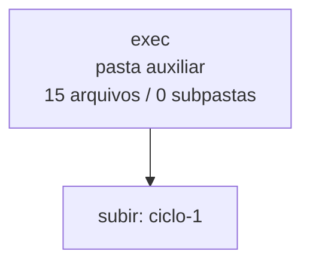

<!-- IA_NAVIGACAO:GERADO_AUTO:v1 -->
# Mapa IA - exec

Atualizado automaticamente em: **2026-08-05 13:33:28 -0300**

- Caminho: `C:\Users\IgorPC\.claude\projects\Escritório fabio osório\fabricas de melhoria de petições\_FORJA_HARNESS\autoresearch\ciclos\ciclo-1\exec`
- Tipo: **pasta auxiliar**
- Função para navegação: conteúdo auxiliar ou residual
- Conteúdo recursivo: **15 arquivos**, **0 subpastas**, **420.5 KB**
- Tipos de arquivo: .md: 6, .json: 3, .jsonl: 3, .txt: 3
- Mapa raiz: [MAPA_IA.md](<../../../../../MAPA_IA.md>)
- Índice geral: [INDICE_GERAL_IA.md](<../../../../../00_IA_NAVIGACAO/INDICE_GERAL_IA.md>)
- Protocolo de navegação: [PROTOCOLO_NAVEGACAO_IA.md](<../../../../../00_IA_NAVIGACAO/PROTOCOLO_NAVEGACAO_IA.md>)
- Inventário JSON para agentes: [inventario_ia.json](<../../../../../00_IA_NAVIGACAO/dados/inventario_ia.json>)
- Mapa superior: [ciclo-1](<../MAPA_IA.md>)

## GPS Mermaid

## Ordem de leitura recomendada

1. Ler este `MAPA_IA.md` antes de abrir arquivos pesados.
2. Subir para a raiz se precisar das regras globais `AGENTS.md`, `CLAUDE.md` e `_LEIS_GERAIS`.

## Subpastas diretas

_Sem subpastas diretas._

## Arquivos diretos

| Arquivo | Papel | Tamanho | Modificado | Observação |
|---|---:|---:|---:|---|
| [MANIFEST_varA.json](<MANIFEST_varA.json>) | dados/script | 729 B | 2026-07-23 03:56 | dado estruturado ou rotina técnica |
| [MANIFEST_varB.json](<MANIFEST_varB.json>) | dados/script | 729 B | 2026-07-23 03:56 | dado estruturado ou rotina técnica |
| [MANIFEST_vigente.json](<MANIFEST_vigente.json>) | dados/script | 732 B | 2026-07-23 03:56 | dado estruturado ou rotina técnica |
| [raw_varA.jsonl](<raw_varA.jsonl>) | dados/script | 2.0 KB | 2026-07-23 03:54 | dado estruturado ou rotina técnica |
| [raw_varB.jsonl](<raw_varB.jsonl>) | dados/script | 1.9 KB | 2026-07-23 03:54 | dado estruturado ou rotina técnica |
| [raw_vigente.jsonl](<raw_vigente.jsonl>) | dados/script | 4.4 KB | 2026-07-23 03:55 | dado estruturado ou rotina técnica |
| [err_varA.txt](<err_varA.txt>) | outro | 2.7 KB | 2026-07-23 03:47 | arquivo não classificado automaticamente |
| [err_varB.txt](<err_varB.txt>) | outro | 2.8 KB | 2026-07-23 03:49 | arquivo não classificado automaticamente |
| [err_vigente.txt](<err_vigente.txt>) | outro | 10.5 KB | 2026-07-23 03:55 | arquivo não classificado automaticamente |
| [EXECPROMPT_varA.md](<EXECPROMPT_varA.md>) | outro | 65.4 KB | 2026-07-23 03:46 | arquivo não classificado automaticamente \| tópicos: PROMPT — Fábrica de Melhoria de Petições; MISSÃO; FASE 1 — LEITURA ESTRATÉGICA DA PASTA |
| [EXECPROMPT_varB.md](<EXECPROMPT_varB.md>) | outro | 54.1 KB | 2026-07-23 03:46 | arquivo não classificado automaticamente \| tópicos: PROMPT — Fábrica de Melhoria de Petições; MISSÃO E REGRA DE PARADA; GATE 1 — INGESTÃO, IDENTIDADE E COBERTURA |
| [EXECPROMPT_vigente.md](<EXECPROMPT_vigente.md>) | outro | 57.1 KB | 2026-07-23 03:46 | arquivo não classificado automaticamente \| tópicos: PROMPT — Fábrica de Melhoria de Petições (genérico, colar em qualquer pasta de processo); MISSÃO; FASE 1 — LEITURA ESTRATÉGICA DA PASTA (obrigatória antes de escrever qualquer linha) |
| [OUT_varA.md](<OUT_varA.md>) | outro | 81.9 KB | 2026-07-23 03:54 | arquivo não classificado automaticamente \| tópicos: MINUTA INTERNA — NÃO PROTOCOLAR; 1. PEÇA MELHORADA COMPLETA; AÇÃO DECLARATÓRIA DE INVALIDADE DE EXCLUSÃO DE BENEFICIÁRIO C/C OBRIGAÇÃO DE FAZER, EXIBIÇÃO DE DOCUMENTOS E INDENIZAÇÃO |
| [OUT_varB.md](<OUT_varB.md>) | outro | 58.3 KB | 2026-07-23 03:54 | arquivo não classificado automaticamente \| tópicos: `INTERNAL_WORKING` — NÃO PROTOCOLAR; PEÇA MELHORADA COMPLETA; AÇÃO DECLARATÓRIA DE INVALIDADE DE EXCLUSÃO DE BENEFICIÁRIO C/C OBRIGAÇÃO DE FAZER, EXIBIÇÃO DE DOCUMENTOS E INDENIZAÇÃO |
| [OUT_vigente.md](<OUT_vigente.md>) | outro | 77.2 KB | 2026-07-23 03:55 | arquivo não classificado automaticamente \| tópicos: MINUTA CONTROLADA E RELATÓRIO DE MELHORIAS; PARTE I — PEÇA MELHORADA COMPLETA; AÇÃO DECLARATÓRIA DE INVALIDADE DE EXCLUSÃO DE BENEFICIÁRIO C/C OBRIGAÇÃO DE FAZER, EXIBIÇÃO DE DOCUMENTOS E INDENIZAÇÃO |

## Leitura por papel

- **dados/script**: [MANIFEST_varA.json](<MANIFEST_varA.json>), [MANIFEST_varB.json](<MANIFEST_varB.json>), [MANIFEST_vigente.json](<MANIFEST_vigente.json>), [raw_varA.jsonl](<raw_varA.jsonl>), [raw_varB.jsonl](<raw_varB.jsonl>), [raw_vigente.jsonl](<raw_vigente.jsonl>)
- **outro**: [err_varA.txt](<err_varA.txt>), [err_varB.txt](<err_varB.txt>), [err_vigente.txt](<err_vigente.txt>), [EXECPROMPT_varA.md](<EXECPROMPT_varA.md>), [EXECPROMPT_varB.md](<EXECPROMPT_varB.md>), [EXECPROMPT_vigente.md](<EXECPROMPT_vigente.md>), [OUT_varA.md](<OUT_varA.md>), [OUT_varB.md](<OUT_varB.md>), [OUT_vigente.md](<OUT_vigente.md>)

## Observações anti-alucinação

- Este mapa classifica por nomes, extensões e posição na árvore; não substitui leitura de fonte primária.
- Fato, citação, ID processual, prazo e jurisprudência só entram em peça depois de conferência no arquivo-fonte ou fonte oficial.
- Se a pasta tiver regimento, a peça deve refletir o regimento vigente na data do protocolo.
