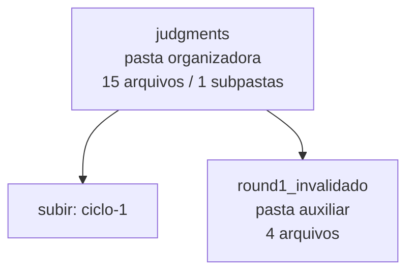

<!-- IA_NAVIGACAO:GERADO_AUTO:v1 -->
# Mapa IA - judgments

Atualizado automaticamente em: **2026-08-05 13:33:28 -0300**

- Caminho: `C:\Users\IgorPC\.claude\projects\Escritório fabio osório\fabricas de melhoria de petições\_FORJA_HARNESS\autoresearch\ciclos\ciclo-1\judgments`
- Tipo: **pasta organizadora**
- Função para navegação: agrega subpastas; abrir mapa filho conforme objetivo
- Conteúdo recursivo: **15 arquivos**, **1 subpastas**, **33.6 KB**
- Tipos de arquivo: .json: 15
- Mapa raiz: [MAPA_IA.md](<../../../../../MAPA_IA.md>)
- Índice geral: [INDICE_GERAL_IA.md](<../../../../../00_IA_NAVIGACAO/INDICE_GERAL_IA.md>)
- Protocolo de navegação: [PROTOCOLO_NAVEGACAO_IA.md](<../../../../../00_IA_NAVIGACAO/PROTOCOLO_NAVEGACAO_IA.md>)
- Inventário JSON para agentes: [inventario_ia.json](<../../../../../00_IA_NAVIGACAO/dados/inventario_ia.json>)
- Mapa superior: [ciclo-1](<../MAPA_IA.md>)

## GPS Mermaid

## Ordem de leitura recomendada

1. Ler este `MAPA_IA.md` antes de abrir arquivos pesados.
2. Subir para a raiz se precisar das regras globais `AGENTS.md`, `CLAUDE.md` e `_LEIS_GERAIS`.

## Subpastas diretas

| Subpasta | Tipo | Conteúdo | Atualização | Próximo passo |
|---|---|---:|---:|---|
| [round1_invalidado](<round1_invalidado/MAPA_IA.md>) | pasta auxiliar | 4 arquivos / 0 subpastas | 2026-07-23 03:59 | conteúdo auxiliar ou residual |

## Arquivos diretos

| Arquivo | Papel | Tamanho | Modificado | Observação |
|---|---:|---:|---:|---|
| [juiz1r2-claude_ciclo1-varA.json](<juiz1r2-claude_ciclo1-varA.json>) | dados/script | 1.6 KB | 2026-07-23 04:01 | dado estruturado ou rotina técnica |
| [juiz1r2-claude_ciclo1-varB.json](<juiz1r2-claude_ciclo1-varB.json>) | dados/script | 1.5 KB | 2026-07-23 04:01 | dado estruturado ou rotina técnica |
| [juiz1r3-claude_ciclo1-varA.json](<juiz1r3-claude_ciclo1-varA.json>) | dados/script | 1.1 KB | 2026-07-23 04:05 | dado estruturado ou rotina técnica |
| [juiz1r3-claude_ciclo1-varB.json](<juiz1r3-claude_ciclo1-varB.json>) | dados/script | 1.2 KB | 2026-07-23 04:05 | dado estruturado ou rotina técnica |
| [juiz2r2-claude_ciclo1-varA.json](<juiz2r2-claude_ciclo1-varA.json>) | dados/script | 1.7 KB | 2026-07-23 04:01 | dado estruturado ou rotina técnica |
| [juiz2r2-claude_ciclo1-varB.json](<juiz2r2-claude_ciclo1-varB.json>) | dados/script | 2.1 KB | 2026-07-23 04:01 | dado estruturado ou rotina técnica |
| [juiz2r3-claude_ciclo1-varA.json](<juiz2r3-claude_ciclo1-varA.json>) | dados/script | 1.6 KB | 2026-07-23 04:05 | dado estruturado ou rotina técnica |
| [juiz2r3-claude_ciclo1-varB.json](<juiz2r3-claude_ciclo1-varB.json>) | dados/script | 1.0 KB | 2026-07-23 04:05 | dado estruturado ou rotina técnica |
| [raw_juizes.json](<raw_juizes.json>) | dados/script | 6.3 KB | 2026-07-23 04:01 | dado estruturado ou rotina técnica |
| [raw_juizes_round1_invalidado.json](<raw_juizes_round1_invalidado.json>) | dados/script | 5.0 KB | 2026-07-23 03:59 | dado estruturado ou rotina técnica |
| [raw_round3.json](<raw_round3.json>) | dados/script | 4.8 KB | 2026-07-23 04:05 | dado estruturado ou rotina técnica |

## Leitura por papel

- **dados/script**: [juiz1r2-claude_ciclo1-varA.json](<juiz1r2-claude_ciclo1-varA.json>), [juiz1r2-claude_ciclo1-varB.json](<juiz1r2-claude_ciclo1-varB.json>), [juiz1r3-claude_ciclo1-varA.json](<juiz1r3-claude_ciclo1-varA.json>), [juiz1r3-claude_ciclo1-varB.json](<juiz1r3-claude_ciclo1-varB.json>), [juiz2r2-claude_ciclo1-varA.json](<juiz2r2-claude_ciclo1-varA.json>), [juiz2r2-claude_ciclo1-varB.json](<juiz2r2-claude_ciclo1-varB.json>), [juiz2r3-claude_ciclo1-varA.json](<juiz2r3-claude_ciclo1-varA.json>), [juiz2r3-claude_ciclo1-varB.json](<juiz2r3-claude_ciclo1-varB.json>), [raw_juizes.json](<raw_juizes.json>), [raw_juizes_round1_invalidado.json](<raw_juizes_round1_invalidado.json>), [raw_round3.json](<raw_round3.json>)

## Observações anti-alucinação

- Este mapa classifica por nomes, extensões e posição na árvore; não substitui leitura de fonte primária.
- Fato, citação, ID processual, prazo e jurisprudência só entram em peça depois de conferência no arquivo-fonte ou fonte oficial.
- Se a pasta tiver regimento, a peça deve refletir o regimento vigente na data do protocolo.
