<!-- IA_NAVIGACAO:GERADO_AUTO:v1 -->
# Mapa IA - ciclo-2

Atualizado automaticamente em: **2026-08-05 13:55:56 -0300**

- Caminho: `C:\Users\IgorPC\.claude\projects\Escritório fabio osório\fabricas de melhoria de petições\_FORJA_HARNESS\autoresearch\ciclos\ciclo-2`
- Tipo: **pasta organizadora**
- Função para navegação: agrega subpastas; abrir mapa filho conforme objetivo
- Conteúdo recursivo: **104 arquivos**, **10 subpastas**, **2.4 MB**
- Tipos de arquivo: .json: 50, .md: 36, .jsonl: 9, .stderr: 9
- Mapa raiz: [MAPA_IA.md](<../../../../MAPA_IA.md>)
- Índice geral: [INDICE_GERAL_IA.md](<../../../../00_IA_NAVIGACAO/INDICE_GERAL_IA.md>)
- Protocolo de navegação: [PROTOCOLO_NAVEGACAO_IA.md](<../../../../00_IA_NAVIGACAO/PROTOCOLO_NAVEGACAO_IA.md>)
- Inventário JSON para agentes: [inventario_ia.json](<../../../../00_IA_NAVIGACAO/dados/inventario_ia.json>)
- Mapa superior: [ciclos](<../MAPA_IA.md>)

## GPS Mermaid

```mermaid
flowchart TD
  N76b1a309c4["ciclo-2<br/>pasta organizadora<br/>104 arquivos / 10 subpastas"]
  N462fddea96["subir: ciclos"]
  N76b1a309c4 --> N462fddea96
  click N462fddea96 "../MAPA_IA.md" "Abrir mapa superior"
  N139f8588d0["blind<br/>pasta auxiliar<br/>8 arquivos"]
  N76b1a309c4 --> N139f8588d0
  click N139f8588d0 "blind/MAPA_IA.md" "Abrir mapa da pasta"
  N6a0e030475["blind2<br/>pasta auxiliar<br/>8 arquivos"]
  N76b1a309c4 --> N6a0e030475
  click N6a0e030475 "blind2/MAPA_IA.md" "Abrir mapa da pasta"
  Nc8ace9aae4["exec<br/>pasta auxiliar<br/>20 arquivos"]
  N76b1a309c4 --> Nc8ace9aae4
  click Nc8ace9aae4 "exec/MAPA_IA.md" "Abrir mapa da pasta"
  Ne5ede32e55["exec2<br/>pasta auxiliar<br/>21 arquivos"]
  N76b1a309c4 --> Ne5ede32e55
  click Ne5ede32e55 "exec2/MAPA_IA.md" "Abrir mapa da pasta"
  N84dc19e6f3["judgments<br/>pasta organizadora<br/>11 arquivos"]
  N76b1a309c4 --> N84dc19e6f3
  click N84dc19e6f3 "judgments/MAPA_IA.md" "Abrir mapa da pasta"
  N9b99e375b3["runpair-t1<br/>pasta auxiliar<br/>3 arquivos"]
  N76b1a309c4 --> N9b99e375b3
  click N9b99e375b3 "runpair-t1/MAPA_IA.md" "Abrir mapa da pasta"
  Nb7d4870b0c["runpair-t1b<br/>pasta auxiliar<br/>3 arquivos"]
  N76b1a309c4 --> Nb7d4870b0c
  click Nb7d4870b0c "runpair-t1b/MAPA_IA.md" "Abrir mapa da pasta"
  N1e6cae1eb7["runpair-t2<br/>pasta auxiliar<br/>3 arquivos"]
  N76b1a309c4 --> N1e6cae1eb7
  click N1e6cae1eb7 "runpair-t2/MAPA_IA.md" "Abrir mapa da pasta"
  Nffd3ce62fd["runpair-t2b<br/>pasta auxiliar<br/>3 arquivos"]
  N76b1a309c4 --> Nffd3ce62fd
  click Nffd3ce62fd "runpair-t2b/MAPA_IA.md" "Abrir mapa da pasta"
```

## Ordem de leitura recomendada

1. Ler este `MAPA_IA.md` antes de abrir arquivos pesados.
2. Subir para a raiz se precisar das regras globais `AGENTS.md`, `CLAUDE.md` e `_LEIS_GERAIS`.

## Subpastas diretas

| Subpasta | Tipo | Conteúdo | Atualização | Próximo passo |
|---|---|---:|---:|---|
| [blind](<blind/MAPA_IA.md>) | pasta auxiliar | 8 arquivos / 0 subpastas | 2026-07-23 20:24 | conteúdo auxiliar ou residual |
| [blind2](<blind2/MAPA_IA.md>) | pasta auxiliar | 8 arquivos / 0 subpastas | 2026-07-23 20:39 | conteúdo auxiliar ou residual |
| [exec](<exec/MAPA_IA.md>) | pasta auxiliar | 20 arquivos / 0 subpastas | 2026-07-23 20:22 | conteúdo auxiliar ou residual |
| [exec2](<exec2/MAPA_IA.md>) | pasta auxiliar | 21 arquivos / 0 subpastas | 2026-07-23 20:38 | conteúdo auxiliar ou residual |
| [judgments](<judgments/MAPA_IA.md>) | pasta organizadora | 11 arquivos / 1 subpastas | 2026-07-23 20:47 | agrega subpastas; abrir mapa filho conforme objetivo |
| [runpair-t1](<runpair-t1/MAPA_IA.md>) | pasta auxiliar | 3 arquivos / 0 subpastas | 2026-07-23 20:22 | conteúdo auxiliar ou residual |
| [runpair-t1b](<runpair-t1b/MAPA_IA.md>) | pasta auxiliar | 3 arquivos / 0 subpastas | 2026-07-23 20:38 | conteúdo auxiliar ou residual |
| [runpair-t2](<runpair-t2/MAPA_IA.md>) | pasta auxiliar | 3 arquivos / 0 subpastas | 2026-07-23 20:22 | conteúdo auxiliar ou residual |
| [runpair-t2b](<runpair-t2b/MAPA_IA.md>) | pasta auxiliar | 3 arquivos / 0 subpastas | 2026-07-23 20:38 | conteúdo auxiliar ou residual |

## Arquivos diretos

| Arquivo | Papel | Tamanho | Modificado | Observação |
|---|---:|---:|---:|---|
| [AR_CANARY_RESULT.json](<AR_CANARY_RESULT.json>) | dados/script | 1.8 KB | 2026-07-23 20:06 | dado estruturado ou rotina técnica |
| [AR_CANARY_RESULT_pos_rebase.json](<AR_CANARY_RESULT_pos_rebase.json>) | dados/script | 1.8 KB | 2026-07-23 23:14 | dado estruturado ou rotina técnica |
| [AR_CICLO_MANIFEST.json](<AR_CICLO_MANIFEST.json>) | dados/script | 4.8 KB | 2026-07-23 20:06 | dado estruturado ou rotina técnica |
| [AR_COMPARISON_t1.json](<AR_COMPARISON_t1.json>) | dados/script | 372 B | 2026-07-23 20:23 | dado estruturado ou rotina técnica |
| [AR_COMPARISON_t1_r2.json](<AR_COMPARISON_t1_r2.json>) | dados/script | 372 B | 2026-07-23 20:38 | dado estruturado ou rotina técnica |
| [AR_COMPARISON_t2.json](<AR_COMPARISON_t2.json>) | dados/script | 373 B | 2026-07-23 20:23 | dado estruturado ou rotina técnica |
| [AR_COMPARISON_t2_r2.json](<AR_COMPARISON_t2_r2.json>) | dados/script | 372 B | 2026-07-23 20:38 | dado estruturado ou rotina técnica |
| [AR_INDICATORS_e1.json](<AR_INDICATORS_e1.json>) | dados/script | 18.9 KB | 2026-07-23 20:38 | dado estruturado ou rotina técnica |
| [AR_INDICATORS_e2.json](<AR_INDICATORS_e2.json>) | dados/script | 12.3 KB | 2026-07-23 20:38 | dado estruturado ou rotina técnica |
| [AR_INDICATORS_e3.json](<AR_INDICATORS_e3.json>) | dados/script | 20.3 KB | 2026-07-23 20:38 | dado estruturado ou rotina técnica |
| [AR_INDICATORS_e4.json](<AR_INDICATORS_e4.json>) | dados/script | 14.2 KB | 2026-07-23 20:38 | dado estruturado ou rotina técnica |
| [AR_INDICATORS_t1_varH.json](<AR_INDICATORS_t1_varH.json>) | dados/script | 10.0 KB | 2026-07-23 20:23 | dado estruturado ou rotina técnica |
| [AR_INDICATORS_t1_vigente.json](<AR_INDICATORS_t1_vigente.json>) | dados/script | 12.8 KB | 2026-07-23 20:23 | dado estruturado ou rotina técnica |
| [AR_INDICATORS_t2_varH.json](<AR_INDICATORS_t2_varH.json>) | dados/script | 14.2 KB | 2026-07-23 20:23 | dado estruturado ou rotina técnica |
| [AR_INDICATORS_t2_vigente.json](<AR_INDICATORS_t2_vigente.json>) | dados/script | 27.0 KB | 2026-07-23 20:23 | dado estruturado ou rotina técnica |
| [AR_JUDGMENT_ciclo2-t1b.json](<AR_JUDGMENT_ciclo2-t1b.json>) | dados/script | 1.1 KB | 2026-07-23 20:47 | dado estruturado ou rotina técnica |
| [AR_JUDGMENT_ciclo2-t2b.json](<AR_JUDGMENT_ciclo2-t2b.json>) | dados/script | 1.0 KB | 2026-07-23 20:45 | dado estruturado ou rotina técnica |
| [raw_mutador_gen1.jsonl](<raw_mutador_gen1.jsonl>) | dados/script | 238.4 KB | 2026-07-23 20:14 | dado estruturado ou rotina técnica |
| [resultados_gen1.json](<resultados_gen1.json>) | dados/script | 529 B | 2026-07-23 20:48 | dado estruturado ou rotina técnica |
| [variantes_gen1.json](<variantes_gen1.json>) | dados/script | 303 B | 2026-07-23 20:14 | dado estruturado ou rotina técnica |
| [AR_CICLO_2_RELATORIO.md](<AR_CICLO_2_RELATORIO.md>) | outro | 6.9 KB | 2026-07-23 23:20 | arquivo não classificado automaticamente \| tópicos: Ciclo AR-2 — Geração 1 (hybrid) REAL: a variante perdeu e nada foi promovido (23/07/2026); Resultado; O experimento (pré-registrado; log encadeado verde no fechamento) |
| [AR_PROMOTION_NOTA.md](<AR_PROMOTION_NOTA.md>) | outro | 860 B | 2026-07-23 20:48 | arquivo não classificado automaticamente \| tópicos: Nota da bancada — ciclo AR-2: NENHUMA PROMOÇÃO |
| [PROMPT_MUTADOR_GEN1.md](<PROMPT_MUTADOR_GEN1.md>) | outro | 1.9 KB | 2026-07-23 20:09 | arquivo não classificado automaticamente |
| [raw_mutador_gen1.stderr](<raw_mutador_gen1.stderr>) | outro | 2.8 KB | 2026-07-23 20:12 | arquivo não classificado automaticamente |

## Leitura por papel

- **dados/script**: [AR_CANARY_RESULT.json](<AR_CANARY_RESULT.json>), [AR_CANARY_RESULT_pos_rebase.json](<AR_CANARY_RESULT_pos_rebase.json>), [AR_CICLO_MANIFEST.json](<AR_CICLO_MANIFEST.json>), [AR_COMPARISON_t1.json](<AR_COMPARISON_t1.json>), [AR_COMPARISON_t1_r2.json](<AR_COMPARISON_t1_r2.json>), [AR_COMPARISON_t2.json](<AR_COMPARISON_t2.json>), [AR_COMPARISON_t2_r2.json](<AR_COMPARISON_t2_r2.json>), [AR_INDICATORS_e1.json](<AR_INDICATORS_e1.json>), [AR_INDICATORS_e2.json](<AR_INDICATORS_e2.json>), [AR_INDICATORS_e3.json](<AR_INDICATORS_e3.json>), [AR_INDICATORS_e4.json](<AR_INDICATORS_e4.json>), [AR_INDICATORS_t1_varH.json](<AR_INDICATORS_t1_varH.json>), [AR_INDICATORS_t1_vigente.json](<AR_INDICATORS_t1_vigente.json>), [AR_INDICATORS_t2_varH.json](<AR_INDICATORS_t2_varH.json>), [AR_INDICATORS_t2_vigente.json](<AR_INDICATORS_t2_vigente.json>), [AR_JUDGMENT_ciclo2-t1b.json](<AR_JUDGMENT_ciclo2-t1b.json>), [AR_JUDGMENT_ciclo2-t2b.json](<AR_JUDGMENT_ciclo2-t2b.json>), [raw_mutador_gen1.jsonl](<raw_mutador_gen1.jsonl>), [resultados_gen1.json](<resultados_gen1.json>), [variantes_gen1.json](<variantes_gen1.json>)
- **outro**: [AR_CICLO_2_RELATORIO.md](<AR_CICLO_2_RELATORIO.md>), [AR_PROMOTION_NOTA.md](<AR_PROMOTION_NOTA.md>), [PROMPT_MUTADOR_GEN1.md](<PROMPT_MUTADOR_GEN1.md>), [raw_mutador_gen1.stderr](<raw_mutador_gen1.stderr>)

## Observações anti-alucinação

- Este mapa classifica por nomes, extensões e posição na árvore; não substitui leitura de fonte primária.
- Fato, citação, ID processual, prazo e jurisprudência só entram em peça depois de conferência no arquivo-fonte ou fonte oficial.
- Se a pasta tiver regimento, a peça deve refletir o regimento vigente na data do protocolo.
