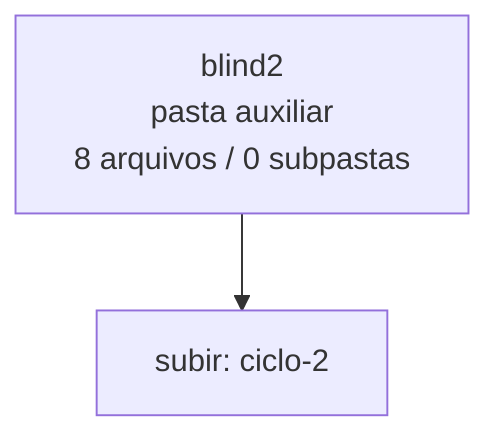

<!-- IA_NAVIGACAO:GERADO_AUTO:v1 -->
# Mapa IA - blind2

Atualizado automaticamente em: **2026-08-05 13:55:48 -0300**

- Caminho: `C:\Users\IgorPC\.claude\projects\Escritório fabio osório\fabricas de melhoria de petições\_FORJA_HARNESS\autoresearch\ciclos\ciclo-2\blind2`
- Tipo: **pasta auxiliar**
- Função para navegação: conteúdo auxiliar ou residual
- Conteúdo recursivo: **8 arquivos**, **0 subpastas**, **461.1 KB**
- Tipos de arquivo: .md: 8
- Mapa raiz: [MAPA_IA.md](<../../../../../MAPA_IA.md>)
- Índice geral: [INDICE_GERAL_IA.md](<../../../../../00_IA_NAVIGACAO/INDICE_GERAL_IA.md>)
- Protocolo de navegação: [PROTOCOLO_NAVEGACAO_IA.md](<../../../../../00_IA_NAVIGACAO/PROTOCOLO_NAVEGACAO_IA.md>)
- Inventário JSON para agentes: [inventario_ia.json](<../../../../../00_IA_NAVIGACAO/dados/inventario_ia.json>)
- Mapa superior: [ciclo-2](<../MAPA_IA.md>)

## GPS Mermaid

## Ordem de leitura recomendada

1. Ler este `MAPA_IA.md` antes de abrir arquivos pesados.
2. Subir para a raiz se precisar das regras globais `AGENTS.md`, `CLAUDE.md` e `_LEIS_GERAIS`.

## Subpastas diretas

_Sem subpastas diretas._

## Arquivos diretos

| Arquivo | Papel | Tamanho | Modificado | Observação |
|---|---:|---:|---:|---|
| [PAR_ciclo2-t1b_ORD1_L.md](<PAR_ciclo2-t1b_ORD1_L.md>) | outro | 72.7 KB | 2026-07-23 20:39 | arquivo não classificado automaticamente \| tópicos: RASCUNHO NÃO PROTOCOLÁVEL — PENDÊNCIAS DE VERIFICAÇÃO; I — SÍNTESE EXECUTIVA; Quadro 1 — O que se pede agora e o que se reserva à instrução |
| [PAR_ciclo2-t1b_ORD1_R.md](<PAR_ciclo2-t1b_ORD1_R.md>) | outro | 68.1 KB | 2026-07-23 20:39 | arquivo não classificado automaticamente \| tópicos: MINUTA INTERNA — AÇÃO DECLARATÓRIA DE INVALIDADE DE EXCLUSÃO DE BENEFICIÁRIO; AÇÃO DECLARATÓRIA DE INVALIDADE DE EXCLUSÃO DE BENEFICIÁRIO C/C OBRIGAÇÃO DE FAZER, EXIBIÇÃO DE DOCUMENTOS E INDENIZAÇÃO; SÍNTESE DA CONTROVÉRSIA, DOS FUNDAMENTOS E DO PEDIDO |
| [PAR_ciclo2-t1b_ORD2_L.md](<PAR_ciclo2-t1b_ORD2_L.md>) | outro | 68.1 KB | 2026-07-23 20:39 | arquivo não classificado automaticamente \| tópicos: MINUTA INTERNA — AÇÃO DECLARATÓRIA DE INVALIDADE DE EXCLUSÃO DE BENEFICIÁRIO; AÇÃO DECLARATÓRIA DE INVALIDADE DE EXCLUSÃO DE BENEFICIÁRIO C/C OBRIGAÇÃO DE FAZER, EXIBIÇÃO DE DOCUMENTOS E INDENIZAÇÃO; SÍNTESE DA CONTROVÉRSIA, DOS FUNDAMENTOS E DO PEDIDO |
| [PAR_ciclo2-t1b_ORD2_R.md](<PAR_ciclo2-t1b_ORD2_R.md>) | outro | 72.7 KB | 2026-07-23 20:39 | arquivo não classificado automaticamente \| tópicos: RASCUNHO NÃO PROTOCOLÁVEL — PENDÊNCIAS DE VERIFICAÇÃO; I — SÍNTESE EXECUTIVA; Quadro 1 — O que se pede agora e o que se reserva à instrução |
| [PAR_ciclo2-t2b_ORD1_L.md](<PAR_ciclo2-t2b_ORD1_L.md>) | outro | 52.3 KB | 2026-07-23 20:39 | arquivo não classificado automaticamente \| tópicos: MINUTA INTEGRAL DE TRABALHO — NÃO PROTOCOLAR; MEMORIAL; SÍNTESE EXECUTIVA |
| [PAR_ciclo2-t2b_ORD1_R.md](<PAR_ciclo2-t2b_ORD1_R.md>) | outro | 37.6 KB | 2026-07-23 20:39 | arquivo não classificado automaticamente \| tópicos: Memorial — versão de trabalho interno; MEMORIAL DA RECORRENTE; Síntese da controvérsia, dos fundamentos e do pedido |
| [PAR_ciclo2-t2b_ORD2_L.md](<PAR_ciclo2-t2b_ORD2_L.md>) | outro | 37.6 KB | 2026-07-23 20:39 | arquivo não classificado automaticamente \| tópicos: Memorial — versão de trabalho interno; MEMORIAL DA RECORRENTE; Síntese da controvérsia, dos fundamentos e do pedido |
| [PAR_ciclo2-t2b_ORD2_R.md](<PAR_ciclo2-t2b_ORD2_R.md>) | outro | 52.3 KB | 2026-07-23 20:39 | arquivo não classificado automaticamente \| tópicos: MINUTA INTEGRAL DE TRABALHO — NÃO PROTOCOLAR; MEMORIAL; SÍNTESE EXECUTIVA |

## Leitura por papel

- **outro**: [PAR_ciclo2-t1b_ORD1_L.md](<PAR_ciclo2-t1b_ORD1_L.md>), [PAR_ciclo2-t1b_ORD1_R.md](<PAR_ciclo2-t1b_ORD1_R.md>), [PAR_ciclo2-t1b_ORD2_L.md](<PAR_ciclo2-t1b_ORD2_L.md>), [PAR_ciclo2-t1b_ORD2_R.md](<PAR_ciclo2-t1b_ORD2_R.md>), [PAR_ciclo2-t2b_ORD1_L.md](<PAR_ciclo2-t2b_ORD1_L.md>), [PAR_ciclo2-t2b_ORD1_R.md](<PAR_ciclo2-t2b_ORD1_R.md>), [PAR_ciclo2-t2b_ORD2_L.md](<PAR_ciclo2-t2b_ORD2_L.md>), [PAR_ciclo2-t2b_ORD2_R.md](<PAR_ciclo2-t2b_ORD2_R.md>)

## Observações anti-alucinação

- Este mapa classifica por nomes, extensões e posição na árvore; não substitui leitura de fonte primária.
- Fato, citação, ID processual, prazo e jurisprudência só entram em peça depois de conferência no arquivo-fonte ou fonte oficial.
- Se a pasta tiver regimento, a peça deve refletir o regimento vigente na data do protocolo.
