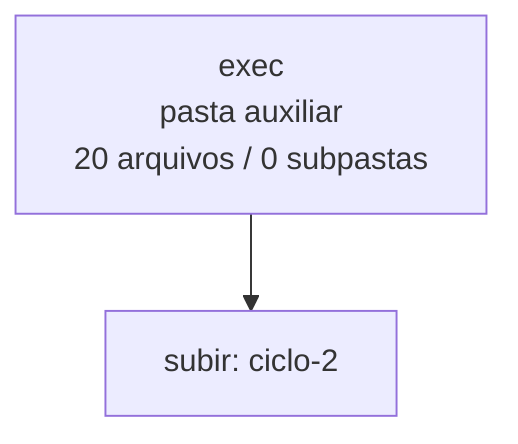

<!-- IA_NAVIGACAO:GERADO_AUTO:v1 -->
# Mapa IA - exec

Atualizado automaticamente em: **2026-08-05 13:55:48 -0300**

- Caminho: `C:\Users\IgorPC\.claude\projects\Escritório fabio osório\fabricas de melhoria de petições\_FORJA_HARNESS\autoresearch\ciclos\ciclo-2\exec`
- Tipo: **pasta auxiliar**
- Função para navegação: conteúdo auxiliar ou residual
- Conteúdo recursivo: **20 arquivos**, **0 subpastas**, **441.5 KB**
- Tipos de arquivo: .md: 8, .json: 4, .jsonl: 4, .stderr: 4
- Mapa raiz: [MAPA_IA.md](<../../../../../MAPA_IA.md>)
- Índice geral: [INDICE_GERAL_IA.md](<../../../../../00_IA_NAVIGACAO/INDICE_GERAL_IA.md>)
- Protocolo de navegação: [PROTOCOLO_NAVEGACAO_IA.md](<../../../../../00_IA_NAVIGACAO/PROTOCOLO_NAVEGACAO_IA.md>)
- Inventário JSON para agentes: [inventario_ia.json](<../../../../../00_IA_NAVIGACAO/dados/inventario_ia.json>)
- Mapa superior: [ciclo-2](<../MAPA_IA.md>)

## GPS Mermaid

## Ordem de leitura recomendada

1. Ler este `MAPA_IA.md` antes de abrir arquivos pesados.
2. Subir para a raiz se precisar das regras globais `AGENTS.md`, `CLAUDE.md` e `_LEIS_GERAIS`.

## Subpastas diretas

_Sem subpastas diretas._

## Arquivos diretos

| Arquivo | Papel | Tamanho | Modificado | Observação |
|---|---:|---:|---:|---|
| [MANIFEST_t1_varH.json](<MANIFEST_t1_varH.json>) | dados/script | 732 B | 2026-07-23 20:22 | dado estruturado ou rotina técnica |
| [MANIFEST_t1_vigente.json](<MANIFEST_t1_vigente.json>) | dados/script | 735 B | 2026-07-23 20:22 | dado estruturado ou rotina técnica |
| [MANIFEST_t2_varH.json](<MANIFEST_t2_varH.json>) | dados/script | 732 B | 2026-07-23 20:22 | dado estruturado ou rotina técnica |
| [MANIFEST_t2_vigente.json](<MANIFEST_t2_vigente.json>) | dados/script | 735 B | 2026-07-23 20:22 | dado estruturado ou rotina técnica |
| [raw_t1_varH.jsonl](<raw_t1_varH.jsonl>) | dados/script | 1.9 KB | 2026-07-23 20:19 | dado estruturado ou rotina técnica |
| [raw_t1_vigente.jsonl](<raw_t1_vigente.jsonl>) | dados/script | 4.4 KB | 2026-07-23 20:22 | dado estruturado ou rotina técnica |
| [raw_t2_varH.jsonl](<raw_t2_varH.jsonl>) | dados/script | 2.1 KB | 2026-07-23 20:19 | dado estruturado ou rotina técnica |
| [raw_t2_vigente.jsonl](<raw_t2_vigente.jsonl>) | dados/script | 6.2 KB | 2026-07-23 20:21 | dado estruturado ou rotina técnica |
| [EXECPROMPT_t1_varH.md](<EXECPROMPT_t1_varH.md>) | outro | 55.6 KB | 2026-07-23 20:14 | arquivo não classificado automaticamente \| tópicos: PROMPT — Fábrica de Melhoria de Petições; MISSÃO E REGRA DE PARADA; GATE 1 — INGESTÃO, IDENTIDADE E COBERTURA |
| [EXECPROMPT_t1_vigente.md](<EXECPROMPT_t1_vigente.md>) | outro | 57.1 KB | 2026-07-23 20:14 | arquivo não classificado automaticamente \| tópicos: PROMPT — Fábrica de Melhoria de Petições (genérico, colar em qualquer pasta de processo); MISSÃO; FASE 1 — LEITURA ESTRATÉGICA DA PASTA (obrigatória antes de escrever qualquer linha) |
| [EXECPROMPT_t2_varH.md](<EXECPROMPT_t2_varH.md>) | outro | 30.3 KB | 2026-07-23 20:14 | arquivo não classificado automaticamente \| tópicos: PROMPT — Fábrica de Melhoria de Petições; MISSÃO E REGRA DE PARADA; GATE 1 — INGESTÃO, IDENTIDADE E COBERTURA |
| [EXECPROMPT_t2_vigente.md](<EXECPROMPT_t2_vigente.md>) | outro | 31.8 KB | 2026-07-23 20:14 | arquivo não classificado automaticamente \| tópicos: PROMPT — Fábrica de Melhoria de Petições (genérico, colar em qualquer pasta de processo); MISSÃO; FASE 1 — LEITURA ESTRATÉGICA DA PASTA (obrigatória antes de escrever qualquer linha) |
| [OUT_t1_varH.md](<OUT_t1_varH.md>) | outro | 52.2 KB | 2026-07-23 20:18 | arquivo não classificado automaticamente \| tópicos: `internal_working` — minuta integral não liberada para protocolo; PEÇA MELHORADA; AÇÃO DECLARATÓRIA DE INVALIDADE DE EXCLUSÃO DE BENEFICIÁRIO C/C OBRIGAÇÃO DE FAZER, EXIBIÇÃO DE DOCUMENTOS E INDENIZAÇÃO |
| [OUT_t1_vigente.md](<OUT_t1_vigente.md>) | outro | 74.6 KB | 2026-07-23 20:21 | arquivo não classificado automaticamente \| tópicos: MINUTA INTERNA NÃO PROTOCOLÁVEL; PARTE 1 — PEÇA MELHORADA COMPLETA; AÇÃO DECLARATÓRIA DE NULIDADE DE EXCLUSÃO DE BENEFICIÁRIO C/C OBRIGAÇÃO DE FAZER, EXIBIÇÃO DE DOCUMENTOS E INDENIZAÇÃO P |
| [OUT_t2_varH.md](<OUT_t2_varH.md>) | outro | 31.3 KB | 2026-07-23 20:19 | arquivo não classificado automaticamente \| tópicos: INTERNAL_WORKING — MEMORIAL; SÍNTESE DA CONTROVÉRSIA, DOS FUNDAMENTOS E DO PEDIDO; 1. A QUESTÃO DEVOLVIDA É DE DIREITO |
| [OUT_t2_vigente.md](<OUT_t2_vigente.md>) | outro | 62.8 KB | 2026-07-23 20:21 | arquivo não classificado automaticamente \| tópicos: OUT_T2_VIGENTE — MEMORIAL APRIMORADO E RELATÓRIO INTERNO; PARTE I — PEÇA MELHORADA COMPLETA; MEMORIAL |
| [raw_t1_varH.stderr](<raw_t1_varH.stderr>) | outro | 3.1 KB | 2026-07-23 20:18 | arquivo não classificado automaticamente |
| [raw_t1_vigente.stderr](<raw_t1_vigente.stderr>) | outro | 10.9 KB | 2026-07-23 20:21 | arquivo não classificado automaticamente |
| [raw_t2_varH.stderr](<raw_t2_varH.stderr>) | outro | 3.5 KB | 2026-07-23 20:19 | arquivo não classificado automaticamente |
| [raw_t2_vigente.stderr](<raw_t2_vigente.stderr>) | outro | 10.9 KB | 2026-07-23 20:21 | arquivo não classificado automaticamente |

## Leitura por papel

- **dados/script**: [MANIFEST_t1_varH.json](<MANIFEST_t1_varH.json>), [MANIFEST_t1_vigente.json](<MANIFEST_t1_vigente.json>), [MANIFEST_t2_varH.json](<MANIFEST_t2_varH.json>), [MANIFEST_t2_vigente.json](<MANIFEST_t2_vigente.json>), [raw_t1_varH.jsonl](<raw_t1_varH.jsonl>), [raw_t1_vigente.jsonl](<raw_t1_vigente.jsonl>), [raw_t2_varH.jsonl](<raw_t2_varH.jsonl>), [raw_t2_vigente.jsonl](<raw_t2_vigente.jsonl>)
- **outro**: [EXECPROMPT_t1_varH.md](<EXECPROMPT_t1_varH.md>), [EXECPROMPT_t1_vigente.md](<EXECPROMPT_t1_vigente.md>), [EXECPROMPT_t2_varH.md](<EXECPROMPT_t2_varH.md>), [EXECPROMPT_t2_vigente.md](<EXECPROMPT_t2_vigente.md>), [OUT_t1_varH.md](<OUT_t1_varH.md>), [OUT_t1_vigente.md](<OUT_t1_vigente.md>), [OUT_t2_varH.md](<OUT_t2_varH.md>), [OUT_t2_vigente.md](<OUT_t2_vigente.md>), [raw_t1_varH.stderr](<raw_t1_varH.stderr>), [raw_t1_vigente.stderr](<raw_t1_vigente.stderr>), [raw_t2_varH.stderr](<raw_t2_varH.stderr>), [raw_t2_vigente.stderr](<raw_t2_vigente.stderr>)

## Observações anti-alucinação

- Este mapa classifica por nomes, extensões e posição na árvore; não substitui leitura de fonte primária.
- Fato, citação, ID processual, prazo e jurisprudência só entram em peça depois de conferência no arquivo-fonte ou fonte oficial.
- Se a pasta tiver regimento, a peça deve refletir o regimento vigente na data do protocolo.
