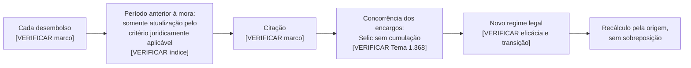
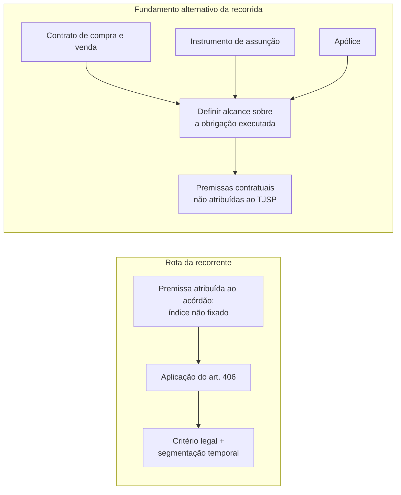

# OUT_T2_VIGENTE — MEMORIAL APRIMORADO E RELATÓRIO INTERNO

> **STATUS: RASCUNHO INTERNO — NÃO PROTOCOLÁVEL.**  
> Esta execução foi integralmente offline e limitada ao material transcrito no prompt. Não houve acesso aos autos, ao Regimento Interno do STJ, às leis em fonte oficial nem aos repositórios oficiais de jurisprudência. Os marcadores `[VERIFICAR: ...]` são bloqueantes. A íntegra do ato impugnado e a cronologia processual completa não foram disponibilizadas; por isso, o gate de cobertura da Fase 1 e o gate de pendências da Fase 4 permanecem abertos. Este arquivo reúne, por imposição desta execução, a minuta e o relatório interno; a seção de auditoria não integra futura versão protocolável.

---

# PARTE I — PEÇA MELHORADA COMPLETA

## MEMORIAL

**EXCELENTÍSSIMO SENHOR MINISTRO MOURA RIBEIRO, RELATOR, E EMINENTÍSSIMOS SENHORES MINISTROS DA TERCEIRA TURMA DO SUPERIOR TRIBUNAL DE JUSTIÇA**

[VERIFICAR: relatoria, prevenção, competência, composição atual da Terceira Turma, pauta e modalidade do julgamento]

**Recurso Especial nº 2.237.713/SP** (registro nº 2023/0448436-0)  
**Recorrente:** AZIMUT DO BRASIL FABRICAÇÃO DE IATES LTDA.  
**Recorrida:** BRADESCO AUTO/RE COMPANHIA DE SEGUROS  
**Origem:** Agravo de Instrumento nº 2131785-85.2022.8.26.0000 (TJSP)

[VERIFICAR: classe, número, registro, partes, origem e fase processual atual]

## SÍNTESE EXECUTIVA

1. A controvérsia pode ser enunciada em uma pergunta: reconhecida pelo próprio Tribunal de origem a ausência de definição expressa, no título judicial, dos índices de juros e correção monetária, pode o cumprimento de sentença acrescentar a cumulação da Tabela Prática do TJSP com juros de 1% ao mês, ou deve observar a taxa legal do art. 406 do Código Civil? [VERIFICAR: íntegra do título, exato alcance do reconhecimento judicial e redação oficial do art. 406 do Código Civil]

2. O acórdão recorrido teria afastado a Selic por duas razões: atribuiu-lhe natureza remuneratória e considerou incompatíveis com sua aplicação os termos iniciais distintos da correção monetária e dos juros. Depois, determinou a incidência da Tabela Prática do TJSP mais juros de 1% ao mês. [VERIFICAR: teor integral e contexto das e-STJ fls. 56 e 77–78]

3. Esses fundamentos devem ser confrontados com o Tema Repetitivo 1.368, ao qual o material fornecido atribui a definição da Selic como taxa legal de mora do art. 406 do Código Civil no período anterior à Lei nº 14.905/2024, e com a técnica de segmentação temporal atribuída ao AgInt no AREsp nº 2.059.743/RJ. [VERIFICAR: identificação, processos representativos, fonte oficial, tese literal, localização, julgamento, publicação, trânsito, eventual modulação e alcance temporal do Tema 1.368/STJ] [VERIFICAR: identificação, órgão, fonte oficial, inteiro teor, trecho literal, localização e pertinência do AgInt no AREsp nº 2.059.743/RJ]

4. O fundamento alternativo apresentado pela recorrida, baseado em três convenções contratuais, não teria sido adotado nos acórdãos recorridos. Acolhê-lo como nova razão de desprovimento exigiria estabelecer, pela primeira vez no recurso especial, o alcance do contrato de compra e venda, do instrumento de assunção e da apólice sobre a obrigação executada. [VERIFICAR: íntegra dos acórdãos, dos três instrumentos e do memorial da recorrida, especialmente e-STJ fls. 381–382]

5. Requer-se, assim, o provimento do recurso para afastar a cumulação imposta na execução, fixar o critério jurídico aplicável e devolver os autos à origem para o recálculo segmentado, preservados os termos iniciais efetivamente constantes do título e vedada a sobreposição de encargos. A incidência do regime posterior à Lei nº 14.905/2024 fica condicionada à verificação de sua eficácia, transição e cognoscibilidade nos limites deste recurso. [VERIFICAR: pedidos e causa de pedir do recurso especial; data de produção de efeitos e regras intertemporais da Lei nº 14.905/2024]

## I — A PERGUNTA JURÍDICA QUE DECIDE O RECURSO

6. **Pode a execução preencher o silêncio do título com a Tabela Prática do TJSP e juros de 1% ao mês quando o próprio Tribunal de origem reconheceu que esses índices não foram expressamente fixados?**

7. A solução, nos limites em que a controvérsia foi descrita no material fornecido, prescinde de reexame de fatos ou de cláusulas contratuais. Parte de duas premissas atribuídas ao acórdão recorrido: o título não definiu expressamente os índices; e a execução, apesar disso, adotou Tabela Prática mais 1% ao mês. [VERIFICAR: íntegra do título e dos acórdãos; se houve referência direta, indireta ou por remissão a encargos convencionais]

8. No julgamento dos embargos, o TJSP teria registrado: “de fato não restou decidido de forma expressa a incidência dos juros de 1% ao mês e correção monetária pela tabela prática deste E. Tribunal” (e-STJ fl. 77). [VERIFICAR: transcrição literal, pontuação, contexto, autoria, alcance e localização exata em e-STJ fl. 77]

9. A Selic teria sido afastada porque o Tribunal local a qualificou como remuneratória e considerou incompatíveis com sua aplicação os termos iniciais distintos dos juros e da correção. Em seguida, teria determinado Tabela Prática e juros de 1% ao mês (e-STJ fl. 78). [VERIFICAR: teor integral, dispositivo e contexto de e-STJ fl. 78]

10. A defesa apresentada pela recorrida nas contrarrazões também teria tratado a controvérsia como definição da taxa legal, ao sustentar que o art. 406 do Código Civil remetia ao percentual previsto no art. 161, § 1º, do CTN (e-STJ fls. 105–110). [VERIFICAR: conteúdo integral das contrarrazões, referências e redação oficial vigente dos dispositivos]

11. O núcleo do recurso, portanto, não é escolher entre leituras possíveis de três instrumentos privados. É definir a consequência jurídica, à luz do art. 406 do Código Civil, da ausência de índice expresso no título. [VERIFICAR: exato escopo do recurso especial, prequestionamento do art. 406 e inexistência de fundamento contratual incorporado ao acórdão]

## II — AS PREMISSAS DO ACÓRDÃO E SUA CONSEQUÊNCIA JURÍDICA

12. A execução deve observar o título, mas não pode atribuir-lhe um critério que o título não contém. Se a ausência de definição expressa foi efetivamente reconhecida pelo TJSP, o silêncio do título não pode ser convertido, na execução, em cláusula convencional de 1% ao mês. [VERIFICAR: dispositivo do título, limites objetivos da coisa julgada e atos da fase executiva]

13. O quadro decisório é curto:

| Premissa que o material atribui ao acórdão | Consequência jurídica sustentada |
|---|---|
| O título não fixou expressamente Tabela Prática e juros de 1% ao mês | O cumprimento não pode tratar essa combinação como critério já estabilizado |
| A Selic foi afastada por sua suposta natureza remuneratória | Deve-se aplicar a definição oficial e vigente da taxa legal do art. 406 |
| Os juros e a correção têm termos iniciais distintos | Devem-se segmentar os períodos, sem sobrepor encargos |
| As três convenções não integram a razão de decidir | Seu alcance não pode ser fixado originariamente no recurso especial |

[VERIFICAR: cada premissa pela íntegra do título, dos acórdãos e da cronologia processual]

14. Essa estrutura preserva os limites cognitivos do recurso especial: aceita as premissas efetivamente assentadas pela origem e discute apenas a subsunção normativa. [VERIFICAR: se todas as premissas acima foram efetivamente assentadas e se o recurso não demanda revisão do conjunto probatório]

## III — O TEMA 1.368 E A TAXA LEGAL DO ART. 406 DO CÓDIGO CIVIL

15. O material fornecido atribui à Corte Especial, no Tema Repetitivo 1.368, a seguinte tese:

> “O art. 406 Código Civil de 2002, antes da entrada em vigor da Lei n° 14.905/2024, deve ser interpretado no sentido de que é a SELIC a taxa de juros de mora aplicável às dívidas de natureza civil, por ser esta a taxa em vigor para a atualização monetária e a mora no pagamento de impostos devidos à Fazenda Nacional.”

[VERIFICAR: texto literal, inclusive preposição, grafia, numeração, órgão julgador, processos representativos, fonte oficial, localização da tese e eventual retificação]

16. Se confirmados a tese, seu alcance e sua incidência neste caso, ficam superadas as duas razões atribuídas ao acórdão. A Selic não pode ser afastada como taxa meramente remuneratória se o precedente qualificado a define como taxa legal de mora para dívidas civis no período pertinente. E, por compreender os encargos que a tese lhe atribui, sua incidência não admite a cumulação com outro índice no mesmo intervalo. [VERIFICAR: alcance vinculante, natureza da obrigação, período alcançado e vedação exata de cumulação]

17. Não se pede que o STJ refaça a conta. Pede-se que fixe a régua jurídica com que a origem deverá calculá-la. A operação aritmética permanece no juízo de origem; o que se devolve a esta Corte é o critério legal. [VERIFICAR: limites dos pedidos formulados no recurso]

## IV — TERMOS INICIAIS DISTINTOS EXIGEM SEGMENTAÇÃO, NÃO SOBREPOSIÇÃO

18. A diferença entre o termo inicial da atualização e o dos juros não define, por si só, uma taxa diversa. Ela exige que o cálculo seja dividido em períodos, preservando os marcos efetivamente estabelecidos no título e impedindo a incidência simultânea de encargos incompatíveis. [VERIFICAR: termos iniciais literais no título e metodologia juridicamente aplicável]

19. O material fornecido atribui ao AgInt no AREsp nº 2.059.743/RJ, da Quarta Turma, solução que aplicou a Selic a título sem taxa diversa e determinou a segmentação temporal para impedir sobreposição. [VERIFICAR: número, classe, partes, relatoria, órgão julgador, datas, fonte oficial, inteiro teor, trecho literal e localização; confirmar identidade entre as premissas do precedente e as deste caso]

20. A segmentação funciona como fronteira entre os encargos:

21. O diagrama apenas explicita a lógica; não substitui a fundamentação. Até o início da mora, deve incidir somente a atualização monetária pelo critério juridicamente aplicável a esse intervalo, cuja definição não pode ser inventada neste memorial. A partir da concorrência dos encargos, incidirá a Selic sem cumulação, se confirmados o Tema 1.368 e o precedente de segmentação. [VERIFICAR: índice pré-mora, marcos do título e alcance dos precedentes]

## V — NÃO HÁ ESTABILIZAÇÃO DE CRITÉRIO QUE O TÍTULO NÃO DEFINIU

22. A recorrida sustenta que o percentual teria se estabilizado porque a questão não foi levada à apelação. Essa objeção depende da cronologia integral e do conteúdo do título. [VERIFICAR: apelação, trânsito, primeira decisão sobre os índices, intimações, impugnações e eventual preclusão]

23. Segundo o material fornecido, a combinação da Tabela Prática com juros de 1% ao mês somente se materializou na execução, e a Azimut a impugnou nessa fase (e-STJ fls. 4–10). [VERIFICAR: integralidade, tempestividade, objeto e resultado da impugnação; cronologia completa dos atos]

24. Se o título realmente não fixou o índice e não houve decisão anterior estabilizada sobre o critério, a aplicação da taxa legal não substitui comando coberto pela coisa julgada. Ao contrário, impede que a execução atribua ao título conteúdo que ele não expressou. [VERIFICAR: inexistência de decisão anterior preclusa e limites objetivos da coisa julgada]

25. O material também invoca o AgInt no AREsp nº 2.257.500/SP, atribuído à Terceira Turma, para a proposição de que a aplicação da Selic a título com referência genérica a juros legais, sem índice expresso, não viola a coisa julgada (e-STJ fls. 131–132). [VERIFICAR: identificação, fonte oficial, inteiro teor, trecho literal, localização, órgão julgador, premissas e efetiva analogia; conteúdo do agravo em e-STJ fls. 131–132]

26. Esse precedente somente deverá permanecer na versão protocolável se a conferência oficial demonstrar equivalência material entre suas premissas e as do caso. “Referência genérica a juros legais” e “silêncio integral sobre índices” não podem ser tratados como equivalentes por aproximação. [VERIFICAR: comparação analítica dos títulos]

## VI — O FUNDAMENTO DAS “TRÊS CONVENÇÕES” NÃO INTEGRA A RAZÃO DE DECIDIR DESCRITA

27. No memorial de 25 de junho de 2026, a recorrida teria sustentado a existência de três convenções de 1% ao mês: uma no contrato de compra e venda, outra relacionada ao instrumento de assunção e uma terceira na apólice (e-STJ fls. 381–382). [VERIFICAR: data, autoria, teor literal, existência e alcance das cláusulas e localizadores]

28. A recorrente não precisa negar a existência ou a autenticidade desses instrumentos. O ponto é anterior: segundo o material fornecido, os acórdãos recorridos não os adotaram como fundamento para definir os encargos incidentes sobre a obrigação executada. [VERIFICAR: íntegra dos acórdãos, especialmente e-STJ fls. 56 e 77–78]

29. Sem examinar o conteúdo ou o alcance desses instrumentos, basta observar que transformá-los agora em razão suficiente de desprovimento exigiria fixar premissas contratuais que não constariam do acórdão: quais cláusulas alcançam a obrigação executada, qual sua extensão objetiva e qual o efeito jurídico do instrumento de assunção e da apólice nesse vínculo. [VERIFICAR: natureza da obrigação, sub-rogação, premissas efetivamente assentadas e eventual fundamento alternativo autônomo de direito]

30. O contraste entre as duas rotas é objetivo:

31. A primeira rota aplica o direito federal às premissas do acórdão. A segunda somente pode produzir o resultado pretendido depois de interpretados os instrumentos e reconstruída uma base decisória que, conforme o material fornecido, a origem não fixou. [VERIFICAR: inteiro teor dos acórdãos e instrumentos]

32. A afirmação atribuída à recorrida de que o Tribunal de origem “confirmou” as convenções não pode ser aceita nem refutada sem a leitura integral dos acórdãos. Se a conferência comprovar que não há tal fundamento, silêncio decisório não poderá ser convertido em premissa contratual. [VERIFICAR: frase literal em e-STJ fl. 382 e fundamentos completos dos acórdãos]

## VII — A TESE CONTRATUAL ALTERNATIVA NÃO PODE SER CONSTRUÍDA ORIGINARIAMENTE NO RECURSO ESPECIAL

33. A recorrente pede a aplicação do art. 406 do Código Civil às premissas que afirma já estarem assentadas. Não pede que esta Corte escolha entre interpretações contratuais, reveja autenticidade documental ou reavalie prova. [VERIFICAR: razões e pedidos integrais do recurso especial]

34. O fundamento alternativo da recorrida, ao contrário, somente poderia ser acolhido se o STJ definisse o alcance dos três instrumentos sobre a obrigação executada. Se essas premissas não constam do acórdão, tal percurso encontra os limites cognitivos atribuídos às Súmulas 5 e 7 do STJ. [VERIFICAR: textos oficiais das Súmulas 5 e 7; conteúdo dos instrumentos; existência de premissas suficientes no acórdão]

35. As Súmulas 5 e 7 não podem funcionar como porta fechada para a subsunção legal pedida pela recorrente e porta aberta para uma reconstrução contratual necessária apenas ao fundamento alternativo da recorrida. A solução coerente é tomar o acórdão como está, sem lhe acrescentar premissas. [VERIFICAR: aderência da questão recursal às premissas incontroversas]

36. Subsidiariamente, apenas se o colegiado considerar indispensável examinar o fundamento contratual não enfrentado, requer-se o retorno dos autos à origem para pronunciamento específico, sem fixação originária, pelo STJ, do alcance dos instrumentos. [VERIFICAR: compatibilidade deste pedido subsidiário com o recurso interposto, ausência de inovação e consequência processual juridicamente adequada]

## VIII — REGIME TEMPORAL E COMANDO DE RECÁLCULO

37. O provimento buscado não exige a apuração de valores nesta Corte. Exige a definição do critério jurídico e o retorno à origem para recálculo, preservados os termos iniciais efetivamente fixados no título. [VERIFICAR: conteúdo do título e limites do pedido recursal]

38. Para o período anterior à produção de efeitos da Lei nº 14.905/2024, o material sustenta a incidência da Selic como taxa legal do art. 406, sem cumulação, conforme o Tema 1.368. [VERIFICAR: data de produção de efeitos da lei, alcance temporal do Tema 1.368 e natureza civil da dívida]

39. Para o período posterior, o material aponta a incidência do IPCA quando não houver índice convencionado ou previsto em lei específica, nos termos do art. 389, parágrafo único, e de juros pela taxa legal do art. 406, §§ 1º a 3º, do Código Civil. Essa afirmação somente pode integrar a versão protocolável após confirmação do texto oficial, da fórmula, da transição para obrigações em curso e de sua cognoscibilidade neste recurso. [VERIFICAR: Lei nº 14.905/2024, redação oficial dos dispositivos, vigência, produção de efeitos, regulamentação, regra intertemporal e escopo do REsp]

40. A origem deverá realizar a conta sem alterar os marcos do título, sem sobrepor correção e juros a uma taxa que já os compreenda e sem antecipar, neste memorial, o índice do intervalo pré-mora ainda não demonstrado. [VERIFICAR: metodologia de cálculo juridicamente correta em cada período]

## IX — CONCLUSÃO EM TRÊS PROPOSIÇÕES

41. **Primeira:** se o título não definiu expressamente Tabela Prática e juros de 1% ao mês, a execução não pode tratar essa combinação como critério incorporado à coisa julgada. [VERIFICAR: íntegra do título e cronologia]

42. **Segunda:** se confirmados o Tema 1.368 e sua aplicabilidade, a taxa legal do art. 406, no período pertinente, é a Selic, sem cumulação com outro índice durante a concorrência dos encargos. [VERIFICAR: todos os quatro elementos do gate de precedente e alcance temporal]

43. **Terceira:** termos iniciais distintos exigem segmentação do cálculo; não autorizam a criação de taxa diversa nem a interpretação originária de três instrumentos que não teriam integrado a razão de decidir. [VERIFICAR: precedente de segmentação, marcos do título e fundamentos dos acórdãos]

## X — QUADRO DOS PEDIDOS

| Pedido | Fundamento | Premissa indispensável |
|---|---|---|
| Afastar Tabela Prática + 1% ao mês | Art. 406 do Código Civil e vedação de sobreposição | Título sem esses índices expressos |
| Aplicar Selic no período juridicamente pertinente | Tema Repetitivo 1.368 | Dívida civil, período alcançado e precedente confirmado |
| Preservar termos iniciais por segmentação | Técnica atribuída ao AgInt no AREsp nº 2.059.743/RJ | Marcos efetivamente fixados no título |
| Rejeitar a construção contratual originária | Limites cognitivos do recurso especial | Convenções não adotadas como fundamento pelo TJSP |
| Aplicar o regime legal posterior, se cognoscível | Lei nº 14.905/2024 | Eficácia, transição e inclusão nos limites do recurso |
| Devolver à origem para recálculo | Separação entre critério jurídico e conta | Pedido compatível com o recurso |

[VERIFICAR: cada fundamento, premissa e compatibilidade com os pedidos já formulados]

## XI — PEDIDOS

44. Diante do exposto, a recorrente requer:

a) o conhecimento e o provimento do recurso especial, para reconhecer a violação ao art. 406 do Código Civil; [VERIFICAR: prequestionamento, admissibilidade e escopo do recurso]

b) o afastamento da cumulação da Tabela Prática do TJSP com juros de 1% ao mês no período em que incidir a Selic como taxa legal; [VERIFICAR: Tema 1.368, período e premissas do título]

c) a fixação, para o período anterior ao novo regime legal e dentro do alcance temporal confirmado, da Selic sem cumulação com outro índice durante a concorrência dos encargos; [VERIFICAR: data de corte, alcance e eventual modulação]

d) a devolução dos autos à origem para cálculo segmentado, preservados os termos iniciais efetivamente estabelecidos no título, com definição do índice aplicável ao período anterior à mora e vedação de toda sobreposição; [VERIFICAR: termos do título e se a definição do índice pré-mora deve ser feita pelo STJ ou pela origem]

e) se confirmada sua incidência e cognoscibilidade neste recurso, a observância do regime intertemporal da Lei nº 14.905/2024 no período posterior à sua produção de efeitos; [VERIFICAR: texto, eficácia, transição e limites do REsp]

f) subsidiariamente, caso se considere indispensável examinar os três instrumentos invocados pela recorrida, o retorno dos autos à origem para pronunciamento específico, sem fixação originária, pelo STJ, de premissas contratuais não assentadas. [VERIFICAR: cabimento, consequência processual e ausência de inovação recursal]

**Nestes termos, pede deferimento.**

Brasília, 19 de julho de 2026.  
[VERIFICAR: data efetiva de assinatura e protocolo]

**FÁBIO MEDINA OSÓRIO**  
OAB/RS 64.975

**MARCUS VINICIUS FURTADO COÊLHO**  
OAB/PI 2.525 | OAB/DF 18.958

**RENATO FARORO PAIROL**  
OAB/SP 235.151

**LUIZ FERNANDO VIEIRA MARTINS**  
OAB/RS 53.731 | OAB/DF 56.258

**GABRIEL RICARDO DA COSTA ALVES**  
OAB/DF 64.738

[VERIFICAR: nomes, grafia, inscrições, poderes, representação e assinaturas]

---

# PARTE II — RELATÓRIO INTERNO DE MELHORIAS E VERIFICAÇÃO

## 1. Resultado executivo

A minuta foi reorganizada em torno de uma cadeia decisória única: **índice omitido → taxa legal → segmentação temporal → recálculo pela origem**. Foram removidas formulações que interpretavam o conteúdo dos três contratos, porque isso enfraquecia a própria tese de impossibilidade de cognição originária. Também foi corrigida a falsa completude do cálculo: o índice do intervalo entre cada desembolso e o início da mora não consta do material e permanece expressamente pendente.

O resultado não é protocolável. Há mais de três pendências materiais, todos os precedentes carecem dos quatro elementos de verificação, a íntegra do ato impugnado não foi fornecida, a cronologia está incompleta e o Regimento Interno do STJ não foi conferido.

## 2. Mapa do caso

### 2.1. Partes, órgão, objeto e resultado buscado

- Recorrente indicada: Azimut do Brasil Fabricação de Iates Ltda.
- Recorrida indicada: Bradesco Auto/RE Companhia de Seguros.
- Recurso indicado: REsp nº 2.237.713/SP, registro nº 2023/0448436-0.
- Origem indicada: AI nº 2131785-85.2022.8.26.0000, TJSP.
- Relator e órgão indicados: Ministro Moura Ribeiro, Terceira Turma do STJ.
- Objeto descrito: taxa legal e combinação de juros/correção em cumprimento de título que teria omitido os índices.
- Resultado buscado: afastar Tabela Prática + 1% ao mês; fixar critério legal; segmentar períodos; devolver à origem para recálculo.

Todos esses dados vêm somente do texto fornecido e estão `[NÃO VERIFICADOS]`.

### 2.2. Cronologia disponível e códigos de atos

| Código | Ato | Data | Sujeito/órgão | Pedido ou conteúdo | Resultado/efeito descrito | Localizador | Status |
|---|---|---|---|---|---|---|---|
| ATO-01 | Título judicial | não informada | origem não detalhada | condenação e marcos de encargos | teria omitido índices expressos | não fornecido | blocked |
| ATO-02 | Apelação | não informada | TJSP | não detalhado | recorrida alega ausência de impugnação do percentual | não fornecido | blocked |
| ATO-03 | Decisão na execução | não informada | origem | adoção de critério de cálculo | teria aplicado Tabela Prática + 1% | e-STJ fls. 4–10, por referência indireta | pendente |
| ATO-04 | Impugnação da Azimut | não informada | Azimut/origem | contestação dos índices | resultado não detalhado | e-STJ fls. 4–10 | pendente |
| ATO-05 | Agravo de Instrumento | 2022 no número CNJ | TJSP | revisão do critério | fundamentos/resultados incompletos | e-STJ fl. 56 | pendente |
| ATO-06 | Embargos de declaração | não informada | TJSP | integração do acórdão | reconhecimento atribuído de ausência de definição expressa; manutenção dos índices | e-STJ fls. 77–78 | pendente |
| ATO-07 | Recurso Especial | registro 2023 | Azimut/STJ | violação do art. 406 | fase e admissibilidade não informadas | REsp indicado | pendente |
| ATO-08 | Contrarrazões | não informada | Bradesco | defesa de taxa legal ligada ao CTN | resultado não informado | e-STJ fls. 105–110 | pendente |
| ATO-09 | Agravo da Azimut | não informada | Azimut | invocação do AREsp 2.257.500/SP | resultado não informado | e-STJ fls. 131–132 | pendente |
| ATO-10 | Memorial da recorrida | 25/06/2026 | Bradesco | tese das três convenções | não decidido no material | e-STJ fls. 381–382 | pendente |
| ATO-11 | Memorial da recorrente | 19/07/2026 no texto | Azimut | tese da taxa legal | minuta em melhoria | texto fornecido | pendente |

**Questões de identidade bloqueantes:** não se conhecem a data, o dispositivo e o trânsito de ATO-01; a sequência completa entre ATO-03 e ATO-07; eventuais decisões monocráticas, agravos internos, retratações, destaques ou intimações; nem a pauta atual. “O acórdão” e “a decisão” permanecem potencialmente ambíguos fora dos códigos acima.

### 2.3. Pontos fortes

1. Reconhecimento atribuído ao próprio TJSP de que os índices não foram expressamente definidos.
2. Possibilidade de formular o problema como subsunção do art. 406, sem interpretar contratos.
3. Distinção entre taxa aplicável e técnica de cálculo por períodos.
4. Assimetria cognitiva: a recorrente afirma trabalhar com premissas do acórdão; a tese alternativa exigiria premissas contratuais novas.
5. Pedido de retorno à origem reduz o custo institucional do provimento.

### 2.4. Pontos fracos e resposta adversarial provável

| Ataque provável | Risco | Resposta estrutural |
|---|---|---|
| O título incorporou taxa convencional direta ou indiretamente | crítico | conferir íntegra; se verdadeiro, reavaliar toda a tese |
| Houve preclusão ou coisa julgada em decisão anterior | crítico | reconstruir cronologia e impugnações |
| A Selic não resolve períodos com termos iniciais distintos | alto | demonstrar segmentação com precedente verificado e índice pré-mora definido |
| A tese das convenções pode manter o resultado | alto | mostrar ausência de premissa local; evitar interpretar os contratos |
| Súmulas 5 e 7 atingem a própria recorrente | alto | manter pedido limitado à subsunção das premissas assentadas |
| Lei nº 14.905/2024 é inovação ou tem transição diversa | alto | conferir recurso, direito intertemporal e reduzir capítulo se necessário |
| O precedente tido como análogo tem premissas diferentes | alto | cotejo analítico e remoção se não houver aderência |

### 2.5. Questões processuais laterais

- Prevenção: `[VERIFICAR: distribuição, prevenção e relatoria atual]`.
- Preclusão: `[VERIFICAR: todas as decisões anteriores sobre índices e respectivas impugnações]`.
- Competência interna: `[VERIFICAR: competência e composição vigente da Terceira Turma]`.
- Pauta/sessão: `[VERIFICAR: julgamento virtual ou presencial, preferência, destaque e sustentação oral]`.
- Fato superveniente: o Tema 1.368 e a Lei nº 14.905/2024 são apresentados como supervenientes ou temporalmente relevantes, mas suas datas e cognoscibilidade precisam ser demonstradas.
- Prequestionamento: `[VERIFICAR: art. 406 do Código Civil e demais dispositivos efetivamente prequestionados]`.
- Constitucional: não foi criado bloco autônomo com arts. 5º, LIV/LV, e 93, IX, da Constituição, porque o memorial fornecido não demonstra que essas matérias integrem o REsp; inseri-las poderia inovar e deslocar matéria estranha à competência do STJ.

## 3. Exploração problematizadora — exatamente 100 perguntas

**Protocolo lógico:** FORJA-F2A-100-v1, reproduzido neste arquivo por impossibilidade de criar artefato separado.  
**Legenda epistemológica:** `D` = dado declarado no material; `I` = inferência estratégica; `J` = questão jurídica; `F` = fato/processo/número que exige fonte. `blocked` significa ausência de resposta verificável.

### Ótica 1 — mandato e resultado

1. **Qual decisão concreta se busca?** Âncora: provimento do REsp e recálculo. Importância: define o dispositivo. Natureza: D/J. Fonte: pedidos do memorial fornecido. Status: pendente de cotejo com o REsp; diligência: conferir razões e pedidos integrais.
2. **O memorial pode pedir aplicação do regime pós-2024?** Âncora: pedido “a partir de 30 de agosto de 2024”. Importância: evita inovação. Natureza: J/F. Fonte: §§ 25–26 originais. Status: blocked; consequência: possível não conhecimento; diligência: conferir escopo e direito superveniente.
3. **O objetivo principal é afastar a cumulação ou fixar toda a conta?** Âncora: devolução à origem. Importância: mantém tese estreita. Natureza: D/I. Fonte: §§ 23 e 26. Status: respondido provisoriamente: afastar cumulação e fixar critério.
4. **Há pedido subsidiário já admissível?** Âncora: três convenções não examinadas. Importância: protege contra fundamento alternativo. Natureza: J. Fonte: ausência no texto original. Status: blocked; diligência: conferir recurso antes de manter retorno subsidiário.
5. **Qual é o resultado mínimo aceitável?** Âncora: não interpretar contratos no STJ. Importância: estratégia minimax. Natureza: I/J. Fonte: capítulos IV–V originais. Status: inferido: devolução à origem; depende de cabimento.
6. **O memorial deve tratar de valores?** Âncora: cálculo pela origem. Importância: evita reexame. Natureza: D/J. Fonte: § 23 original. Status: respondido: não, salvo demonstração abstrata dos períodos.
7. **O julgamento já está pautado?** Âncora: endereçamento ao colegiado. Importância: prazo e forma do memorial. Natureza: F. Fonte: não fornecida. Status: blocked; diligência: consultar andamento e pauta.
8. **Haverá sustentação oral?** Âncora: memorial ao colegiado. Importância: coordena mensagem escrita e oral. Natureza: F/J. Fonte: não fornecida. Status: blocked; diligência: conferir regimento e modalidade da sessão.
9. **A data de 19/07/2026 é a data real de assinatura?** Âncora: fecho original. Importância: integridade formal. Natureza: F. Fonte: texto fornecido. Status: não verificado; diligência: confirmar antes do protocolo.
10. **Quem autoriza a versão final?** Âncora: cinco signatários. Importância: governança e representação. Natureza: F. Fonte: assinaturas do texto. Status: blocked; diligência: conferir poderes, inscrições e aprovação humana.

### Ótica 2 — fatos e cronologia

11. **Qual é o teor integral do título?** Âncora: alegada omissão dos índices. Importância: premissa central. Natureza: F. Fonte: não fornecida. Status: blocked; consequência: impede peça protocolável; diligência: obter íntegra.
12. **O título menciona encargos convencionais por remissão?** Âncora: três convenções. Importância: pode derrubar a tese. Natureza: F. Fonte: não fornecida. Status: blocked; diligência: cotejo literal.
13. **O título fixou correção desde cada desembolso?** Âncora: § 11 original. Importância: segmentação. Natureza: F. Fonte: afirmação do memorial. Status: pendente; diligência: localizar no dispositivo.
14. **O título fixou juros desde a citação?** Âncora: § 11 original. Importância: marco da mora. Natureza: F. Fonte: afirmação do memorial. Status: pendente; diligência: localizar no dispositivo.
15. **Quando surgiu pela primeira vez Tabela Prática + 1%?** Âncora: execução. Importância: preclusão. Natureza: F. Fonte: e-STJ fls. 4–10 por referência. Status: blocked; diligência: cronologia integral.
16. **Quando a Azimut foi intimada e impugnou?** Âncora: impugnação na execução. Importância: tempestividade. Natureza: F. Fonte: e-STJ fls. 4–10. Status: blocked; diligência: conferir datas e protocolo.
17. **Houve decisão anterior não recorrida sobre o índice?** Âncora: alegação de preclusão. Importância: risco crítico. Natureza: F/J. Fonte: não fornecida. Status: blocked; diligência: levantar todos os atos.
18. **Qual acórdão contém a razão principal e qual julga embargos?** Âncora: e-STJ fls. 56 e 77–78. Importância: identidade dos atos. Natureza: F. Fonte: referências do texto. Status: blocked; diligência: codificar acórdãos com datas e dispositivos.
19. **O Tema 1.368 foi julgado antes ou depois do acórdão recorrido?** Âncora: precedente qualificado. Importância: tratamento processual. Natureza: F/J. Fonte: não fornecida. Status: blocked; diligência: verificar datas oficiais.
20. **A execução alcança período posterior à nova lei?** Âncora: pedido pós-2024. Importância: utilidade do capítulo temporal. Natureza: F. Fonte: não fornecida. Status: blocked; diligência: planilha e período executado.

### Ótica 3 — prova e fontes

21. **A frase de e-STJ fl. 77 é literal e completa?** Âncora: omissão reconhecida. Importância: principal prova. Natureza: F. Fonte: citação no texto. Status: pendente; diligência: conferir página e contexto.
22. **O dispositivo de e-STJ fl. 78 impõe exatamente a cumulação?** Âncora: critério executório. Importância: objeto do REsp. Natureza: F. Fonte: resumo do texto. Status: pendente; diligência: transcrição literal.
23. **E-STJ fl. 56 contém fundamento autônomo relevante?** Âncora: limites do título/preclusão. Importância: dialeticidade. Natureza: F. Fonte: menção no § 17. Status: blocked; diligência: leitura integral.
24. **As contrarrazões realmente invocam o art. 161, § 1º, do CTN?** Âncora: e-STJ fls. 105–110. Importância: delimitação histórica. Natureza: F. Fonte: afirmação original. Status: pendente; diligência: cotejo.
25. **O agravo realmente invocou o AREsp 2.257.500/SP?** Âncora: e-STJ fls. 131–132. Importância: preservação da tese. Natureza: F. Fonte: afirmação original. Status: pendente; diligência: conferir.
26. **O memorial da recorrida contém as três convenções e a frase “confirmou”?** Âncora: e-STJ fls. 381–382. Importância: resposta fiel. Natureza: F. Fonte: afirmação original. Status: pendente; diligência: transcrição literal.
27. **Os três instrumentos estão nos autos?** Âncora: contrato, assunção, apólice. Importância: ponte processual. Natureza: F. Fonte: não confirmada. Status: blocked; diligência: localizar evento/fls.
28. **Qual documento prova a natureza regressiva da obrigação?** Âncora: § 16 original. Importância: enquadramento. Natureza: F/J. Fonte: não localizada. Status: blocked; diligência: acórdão/título.
29. **Há memória de cálculo nos autos?** Âncora: recálculo e períodos. Importância: demonstrar impacto. Natureza: F/numérica. Fonte: não fornecida. Status: blocked; diligência: obter planilhas sem inseri-las como prova não juntada.
30. **As referências “e-STJ fl.” correspondem à paginação oficial atual?** Âncora: todos os localizadores. Importância: auditabilidade. Natureza: F. Fonte: texto fornecido. Status: blocked; diligência: conferir autos eletrônicos.

### Ótica 4 — processo e competência

31. **O art. 406 foi prequestionado?** Âncora: violação central. Importância: admissibilidade. Natureza: J/F. Fonte: acórdãos não fornecidos. Status: blocked; diligência: cotejar recurso e embargos.
32. **A instância ordinária foi exaurida?** Âncora: REsp em julgamento. Importância: admissibilidade. Natureza: F/J. Fonte: não fornecida. Status: blocked; diligência: andamento completo.
33. **A Terceira Turma é o órgão competente atualmente?** Âncora: endereçamento. Importância: forma e estratégia. Natureza: F/J. Fonte: texto original. Status: não verificado; diligência: regimento e andamento.
34. **Moura Ribeiro permanece relator?** Âncora: endereçamento nominal. Importância: correção formal. Natureza: F. Fonte: texto original. Status: não verificado; diligência: andamento oficial.
35. **Há prevenção ou redistribuição?** Âncora: recurso e órgão. Importância: identidade processual. Natureza: F/J. Fonte: não fornecida. Status: blocked; diligência: consultar distribuição.
36. **Qual é a modalidade da sessão?** Âncora: memorial e sustentação. Importância: providências regimentais. Natureza: F/J. Fonte: não fornecida. Status: blocked; diligência: pauta.
37. **Há prazo ou forma regimental para memorial?** Âncora: entrega ao colegiado. Importância: validade operacional. Natureza: J. Fonte: RISTJ não acessado. Status: blocked; diligência: conferir versão consolidada e emendas.
38. **Cabe pedido de preferência ou destaque?** Âncora: julgamento potencialmente virtual. Importância: oralidade. Natureza: J/F. Fonte: não fornecida. Status: blocked; diligência: regimento e pauta.
39. **O pedido subsidiário de retorno à origem cabe neste REsp?** Âncora: tese contratual não examinada. Importância: minimax. Natureza: J. Fonte: recurso não fornecido. Status: blocked; diligência: conferir causa de pedir e precedentes.
40. **O direito superveniente pode ser conhecido sem inovação?** Âncora: Lei nº 14.905/2024. Importância: capítulo VIII. Natureza: J. Fonte: não fornecida. Status: blocked; diligência: pesquisa oficial e cotejo do recurso.

### Ótica 5 — direito e precedentes

41. **Qual é a redação oficial do art. 406 no período anterior?** Âncora: taxa legal. Importância: fundamento. Natureza: J/F. Fonte: não acessada. Status: blocked; diligência: fonte oficial.
42. **Qual é a redação oficial após a Lei nº 14.905/2024?** Âncora: transição. Importância: cálculo. Natureza: J/F. Fonte: texto não acessado. Status: blocked; diligência: fonte oficial.
43. **O Tema 1.368 existe com a tese transcrita?** Âncora: capítulo III. Importância: decisiva. Natureza: F/J. Fonte: só o prompt. Status: blocked; diligência: SCON/STJ e DJe.
44. **Quais processos representam o Tema 1.368?** Âncora: gate determinístico. Importância: identidade. Natureza: F. Fonte: não fornecida. Status: blocked; diligência: página oficial do tema.
45. **O Tema transitou e houve modulação?** Âncora: força e alcance. Importância: aplicação temporal. Natureza: F/J. Fonte: não fornecida. Status: blocked; diligência: certidão/andamento oficial.
46. **O AREsp 2.059.743/RJ contém a segmentação descrita?** Âncora: capítulo IV. Importância: neutraliza objeção. Natureza: F/J. Fonte: só o prompt. Status: blocked; diligência: inteiro teor oficial.
47. **O AREsp 2.257.500/SP é realmente análogo?** Âncora: coisa julgada. Importância: suporte do capítulo V. Natureza: F/J. Fonte: só o prompt. Status: blocked; diligência: cotejo analítico.
48. **As Súmulas 5 e 7 têm incidência nesta configuração?** Âncora: tese contratual. Importância: limites cognitivos. Natureza: J. Fonte: acórdão/instrumentos ausentes. Status: blocked; diligência: fontes oficiais e premissas locais.
49. **O art. 161, § 1º, do CTN ainda é relevante à controvérsia histórica?** Âncora: contrarrazões. Importância: fidelidade. Natureza: J/F. Fonte: não acessada. Status: blocked; diligência: conferir lei e argumento.
50. **Qual índice rege o período pré-mora?** Âncora: cada desembolso até citação. Importância: fecha a conta. Natureza: J/F. Fonte: título e direito ausentes. Status: blocked; consequência: pedido incompleto; diligência: título + fonte oficial.

### Ótica 6 — adversário e julgador

51. **Qual é a melhor razão alternativa da recorrida?** Âncora: três convenções. Importância: antecipação. Natureza: I/J. Fonte: memorial adverso descrito. Status: inferido: taxa convencional incorporada à obrigação.
52. **A recorrida pode defender o resultado por fundamento não adotado?** Âncora: manutenção do acórdão. Importância: resposta técnica. Natureza: J. Fonte: não pesquisada. Status: blocked; diligência: limites do REsp.
53. **O julgador pode ver inovação no capítulo pós-2024?** Âncora: nova lei. Importância: foco. Natureza: I/J. Fonte: escopo ausente. Status: risco alto; diligência: cotejar o recurso.
54. **O julgador pode entender que a recorrente interpreta contratos?** Âncora: § 16 original. Importância: coerência. Natureza: I. Fonte: texto original. Status: sim; correção: remover interpretação substantiva, como feito.
55. **A expressão “puramente jurídica” é vulnerável?** Âncora: título original do capítulo I. Importância: credibilidade. Natureza: I. Fonte: depende de fatos documentais. Status: sim; correção: “prescinde de reexame, tal como delimitado”.
56. **A palavra “manobra” prejudica o ethos?** Âncora: síntese original. Importância: tom institucional. Natureza: I. Fonte: texto original. Status: sim; correção: “fundamento alternativo”.
57. **O colegiado pode concordar com a taxa e divergir do cálculo?** Âncora: segmentação. Importância: pedido administrável. Natureza: I/J. Fonte: tese do texto. Status: cenário plausível; resposta: devolver conta à origem.
58. **O colegiado pode exigir análise das convenções?** Âncora: defesa adversa. Importância: pedido subsidiário. Natureza: I/J. Fonte: instrumentos ausentes. Status: cenário plausível; diligência: confirmar retorno à origem.
59. **Qual premissa mais reduz risco institucional do provimento?** Âncora: cálculo pela origem. Importância: persuasão. Natureza: I. Fonte: estrutura recursal. Status: fixar critério sem apurar valores.
60. **Qual frase deve ser lembrada após a leitura?** Âncora: omissão do título. Importância: comunicação. Natureza: I. Fonte: síntese do caso. Status: “o silêncio do título não pode virar cláusula convencional”.

### Ótica 7 — riscos, ética e impactos

61. **Há risco de atribuição errada ao Tema 1.368?** Âncora: tese literal. Importância: P0 jurídico. Natureza: F/ética. Fonte: não verificada. Status: crítico; diligência: quatro elementos oficiais.
62. **Há risco de citação truncada de e-STJ fl. 77?** Âncora: frase central. Importância: P0 factual. Natureza: F/ética. Fonte: página ausente. Status: crítico; diligência: contexto integral.
63. **Há risco de ocultar origem operacional?** Âncora: referências processuais. Importância: confidencialidade. Natureza: ética. Fonte: peça não menciona canais internos. Status: controlado nesta minuta.
64. **Há risco de afirmar juntada inexistente?** Âncora: três instrumentos. Importância: integridade. Natureza: F/ética. Fonte: não confirmada. Status: crítico; correção: não dizer “juntado aos autos” sem prova.
65. **Há risco de inventar percentuais de êxito?** Âncora: Monte Carlo exigida. Importância: honestidade. Natureza: ética/metodológica. Fonte: sem dados. Status: controlado; percentuais recusados.
66. **Há risco de o visual virar prova?** Âncora: diagramas. Importância: fidelidade. Natureza: ética/comunicação. Fonte: premissas não verificadas. Status: controlado por marcadores e texto analítico.
67. **Há risco de ampliar a obrigação com a nova lei?** Âncora: pós-2024. Importância: impacto financeiro. Natureza: J/F. Fonte: não verificada. Status: alto; diligência: transição e cálculo.
68. **Há risco de prequestionamento constitucional artificial?** Âncora: cautela de sênior. Importância: técnica. Natureza: J/ética. Fonte: recurso ausente. Status: controlado; bloco não criado.
69. **Há risco de assinatura ou OAB incorreta?** Âncora: fecho. Importância: regularidade. Natureza: F. Fonte: só o prompt. Status: pendente; diligência: conferência cadastral e procuração.
70. **Qual é o impacto de protocolar com `[VERIFICAR]`?** Âncora: gates. Importância: segurança. Natureza: operacional/ética. Fonte: instruções. Status: proibido; consequência: minuta não protocolável.

### Ótica 8 — alternativas e soluções

71. **É melhor retirar o capítulo pós-2024?** Âncora: risco de inovação. Importância: foco. Natureza: I/J. Fonte: escopo ausente. Status: decisão condicionada; retirar se não estiver abrangido.
72. **É melhor manter o AREsp 2.257.500/SP?** Âncora: analogia incerta. Importância: credibilidade. Natureza: I/J. Fonte: precedente não verificado. Status: manter só após cotejo; senão remover.
73. **Pode-se sustentar a tese sem precedentes ordinários?** Âncora: art. 406 + Tema repetitivo. Importância: robustez. Natureza: I/J. Fonte: tema não verificado. Status: sim em tese, se o tema for confirmado.
74. **Um único diagrama é suficiente?** Âncora: caso técnico. Importância: sobriedade. Natureza: comunicação. Fonte: blueprint. Status: sim; dois foram mantidos no rascunho para teste, reduzir a um na final.
75. **Tabela substitui diagrama contratual?** Âncora: rotas argumentativas. Importância: compatibilidade Word. Natureza: comunicação. Fonte: estrutura. Status: possível; decidir após renderização.
76. **Deve-se pedir cassação ou simples retorno?** Âncora: fundamento não enfrentado. Importância: consequência processual. Natureza: J. Fonte: recurso ausente. Status: blocked; diligência: pesquisa e escopo.
77. **Pode-se limitar o pedido à vedação de cumulação?** Âncora: resultado mínimo. Importância: menor risco. Natureza: I/J. Fonte: pedidos originais. Status: alternativa se transição não for cognoscível.
78. **Pode-se formular o índice pré-mora desde já?** Âncora: lacuna. Importância: completude. Natureza: J/F. Fonte: insuficiente. Status: não; diligência: título e lei.
79. **Convém anexar memória de cálculo ilustrativa?** Âncora: segmentação. Importância: compreensão. Natureza: operacional/F. Fonte: dados ausentes. Status: não nesta execução; só com valores verificados e autorização.
80. **Se as convenções constarem do acórdão, qual plano B?** Âncora: risco central. Importância: sobrevivência da tese. Natureza: I/J. Fonte: blocked. Status: reavaliar o caso; não presumir que Súmulas 5/7 resolvem.

### Ótica 9 — quantificação e execução

81. **Qual é o valor controvertido entre os critérios?** Âncora: impacto do recálculo. Importância: materialidade. Natureza: numérica/F. Fonte: não fornecida. Status: blocked; diligência: cálculos oficiais.
82. **Quantos desembolsos existem e em quais datas?** Âncora: termo inicial individual. Importância: segmentação. Natureza: numérica/F. Fonte: não fornecida. Status: blocked; diligência: título e documentos.
83. **Qual foi a data da citação?** Âncora: início da mora. Importância: corte temporal. Natureza: F. Fonte: não fornecida. Status: blocked; diligência: certidão.
84. **Qual foi a data de produção de efeitos da nova lei?** Âncora: corte indicado como 30/08/2024. Importância: conta. Natureza: F/J. Fonte: só o texto. Status: blocked; diligência: fonte oficial.
85. **Qual série Selic deve ser usada?** Âncora: cálculo. Importância: execução. Natureza: técnica/J. Fonte: não fornecida. Status: blocked; diligência: decisão e metodologia oficial.
86. **Como evitar dupla incidência na virada de períodos?** Âncora: segmentação. Importância: exatidão. Natureza: técnica/J. Fonte: precedente não verificado. Status: princípio respondido, fórmula blocked.
87. **Qual índice atualizará o período pré-mora?** Âncora: lacuna identificada. Importância: cálculo integral. Natureza: J/F. Fonte: ausente. Status: blocked.
88. **Existe capitalização ou apenas juros simples?** Âncora: memória de cálculo. Importância: valor. Natureza: J/F. Fonte: não fornecida. Status: blocked; diligência: título e cálculo.
89. **A mudança de regime exige cálculo diário ou mensal?** Âncora: Lei nº 14.905/2024. Importância: execução. Natureza: técnica/J. Fonte: não verificada. Status: blocked; diligência: norma e regulamentação.
90. **A minuta melhorada aumenta êxito em quanto?** Âncora: simulação. Importância: priorização. Natureza: quantitativa. Fonte: nenhum dataset. Status: blocked; consequência: não há percentual honesto; diligência: base comparável e calibração.

### Ótica 10 — comunicação, visual e validação

91. **A síntese permite extrair controvérsia, fundamentos e pedido em meia página?** Âncora: cautela 343-A. Importância: leitura humana/IA. Natureza: comunicação. Fonte: minuta. Status: sim estruturalmente; renderização pendente.
92. **Cada seção abre com tese identificável?** Âncora: dupla audiência. Importância: triagem. Natureza: comunicação. Fonte: minuta. Status: sim, revisão final pendente.
93. **Há repetição excessiva?** Âncora: memorial técnico. Importância: concisão. Natureza: editorial. Fonte: minuta. Status: reduzida, mas precisa revisão após remoção dos marcadores.
94. **Os diagramas cabem na margem?** Âncora: Mermaid/Word. Importância: legibilidade. Natureza: visual. Fonte: não renderizada. Status: blocked; diligência: converter e inspecionar página a página.
95. **A paleta institucional foi aplicada?** Âncora: petróleo e terracota. Importância: padrão. Natureza: visual. Fonte: Markdown sem SVG/EMF. Status: blocked; diligência: pipeline visual autorizado em etapa posterior.
96. **Cabeçalho, timbre, fonte, margens e rodapé foram reproduzidos?** Âncora: padrão do escritório. Importância: identidade. Natureza: visual/F. Fonte: original em arquivo não fornecida. Status: blocked; diligência: comparar com peça original.
97. **Há sinais de texto artificial?** Âncora: anti-IA. Importância: credibilidade. Natureza: editorial. Fonte: minuta. Status: mitigado por tom sóbrio; revisão humana ainda necessária.
98. **Toda afirmação não verificada está marcada no corpo?** Âncora: espelhamento. Importância: integridade. Natureza: auditoria. Fonte: minuta. Status: sim por inspeção autoral, mas sem validador.
99. **O PDF foi inspecionado página a página?** Âncora: gate visual. Importância: entrega. Natureza: validação. Fonte: nenhum PDF gerado. Status: blocked; consequência: não declarar pronto.
100. **O que falta para remover “não protocolável”?** Âncora: gates abertos. Importância: encerramento. Natureza: operacional. Fonte: relatório. Status: obter autos integrais e cronologia; verificar regimento, leis, precedentes e localizadores; resolver todas as pendências; gerar DOCX/PDF; validar visual e juridicamente.

### Consolidação F2-A

- **Definição do problema:** saber se a execução pode impor Tabela Prática + 1% quando o título teria omitido os índices, ou se deve aplicar a taxa legal com cálculo segmentado.
- **Síntese diagnóstica:** a tese é promissora somente se a frase de e-STJ fl. 77 e a íntegra do título confirmarem a ausência de critério convencional. O maior risco é existir referência indireta aos contratos ou decisão anterior preclusa.
- **Hipótese 1:** aplicar Selic no período confirmado, sem cumulação, e devolver a conta à origem. Condições: Tema 1.368 e segmentação oficialmente verificados; título sem índice. Riscos: transição e período pré-mora.
- **Hipótese 2:** se o fundamento contratual for indispensável e não tiver sido decidido, devolver à origem sem interpretação originária. Condições: pedido compatível com o REsp. Riscos: inovação ou consequência processual diversa.
- **Questões materiais abertas:** íntegra do título; cronologia; precedentes; índice pré-mora; escopo do REsp; lei nova; regimento; pauta.
- **Roteamento:** F3 — pesquisa oficial de legislação, regimento e precedentes; F4 — ingestão/cotejo dos autos; F5 — estratégia após resolução das premissas; F6 — limpeza de todos os marcadores e fechamento da peça; F7 — DOCX/PDF, renderização e inspeção.

## 4. Varredura de atribuição e premissas

### 4.1. Precedentes mapeados

| Precedente | Tribunal/órgão atribuído | Data | Trecho literal disponível | Fonte oficial | Localização | Status |
|---|---|---|---|---|---|---|
| Tema Repetitivo 1.368 | STJ/Corte Especial | não fornecida | tese transcrita no prompt | não consultada | não confirmada | INDISPONÍVEL-TRANSITÓRIO nesta sessão offline |
| AgInt no AREsp nº 2.059.743/RJ | STJ/Quarta Turma | não fornecida | não | não consultada | não | INDISPONÍVEL-TRANSITÓRIO |
| AgInt no AREsp nº 2.257.500/SP | STJ/Terceira Turma, segundo o texto | não fornecida | não | não consultada | não | INDISPONÍVEL-TRANSITÓRIO |
| Súmula 5/STJ | STJ | não fornecida | não transcrita | não consultada | não | A-VERIFICAR |
| Súmula 7/STJ | STJ | não fornecida | não transcrita | não consultada | não | A-VERIFICAR |

Nenhum precedente alcançou o status `VERIFICADO`, pois nenhum reúne, nesta execução, identificador confirmado, fonte oficial nomeada com acesso, trecho literal conferido e localização no julgado. Não houve busca real em fonte aberta por imposição do modo offline; portanto, nenhum foi classificado como `NÃO-ENCONTRADO` ou banido. A versão protocolável não poderá manter qualquer deles sem resolução humana registrada.

### 4.2. Premissas mapeadas

| Premissa | Fonte alegada | Local exato | Status |
|---|---|---|---|
| Título não fixou Tabela Prática + 1% | acórdão dos embargos | e-STJ fl. 77 | pendente de íntegra |
| Selic afastada como remuneratória e por termos distintos | acórdão | e-STJ fl. 78 | pendente de íntegra |
| TJSP impôs Tabela Prática + 1% | acórdão/execução | e-STJ fl. 78 | pendente de dispositivo |
| Bradesco defendeu art. 161, § 1º, CTN | contrarrazões | e-STJ fls. 105–110 | pendente |
| Azimut impugnou na execução | impugnação | e-STJ fls. 4–10 | pendente de cronologia |
| AREsp 2.257.500/SP foi invocado | agravo | e-STJ fls. 131–132 | pendente |
| Bradesco alegou três convenções | memorial de 25/06/2026 | e-STJ fls. 381–382 | pendente |
| Acórdãos não examinaram as convenções | acórdãos | e-STJ fls. 56 e 77–78 | blocked até leitura integral |
| Correção desde cada desembolso | título | não localizado | blocked |
| Juros desde a citação | título | não localizado | blocked |
| Obrigação é civil/regressiva | título/acórdão | não localizado | blocked |
| Lei nova alcança período executado | cálculo/lei | não localizado | blocked |

## 5. Conselho de guerra e síntese adversarial

### 5.1. Contribuições incorporadas

- **Helena:** reduziu o problema a quatro perguntas decisórias; priorizou omissão do título, Tema 1.368, distinção da tese contratual e segmentação; identificou a lacuna do índice pré-mora.
- **Cícero:** condicionou todos os fundamentos a admissibilidade, prequestionamento, regimento e escopo do REsp; advertiu que memorial não sana nem amplia o recurso.
- **Diabob:** apontou que o texto original interpretava os mesmos instrumentos que desejava excluir; destacou coisa julgada, preclusão, analogia imperfeita e inovação pós-2024.
- **Maquiavel:** favoreceu uma solução institucional de baixo custo — o STJ fixa o critério e a origem calcula.
- **Sun Tzu:** concentrou a peça no terreno mais seguro e evitou oferecer à recorrida uma discussão contratual detalhada.
- **Diana/comunicação:** substituiu “manobra” por linguagem institucional; adotou uma metáfora central e perguntas jurisdicionais claras.
- **Visual law:** criou um fluxo temporal e um contraste de rotas, ambos acompanhados de explicação analítica.

### 5.2. Conflitos resolvidos

1. **Interpretar os contratos para refutar a recorrida × não ingressar na matéria contratual:** venceu a segunda opção. A peça afirma apenas ausência de premissa no acórdão.
2. **Fixar todo o cálculo × definir critério:** venceu a definição do critério com retorno à origem.
3. **Afirmar índice pré-mora × não inventar:** venceu a marcação de pendência e remessa da definição ao órgão competente.
4. **Inserir prequestionamento constitucional padrão × evitar inovação:** não foi criado bloco constitucional sem prova de pertinência.
5. **Simular percentuais × honestidade metodológica:** percentuais foram recusados.

## 6. Arsenal Helena e avaliação quantitativa

### 6.1. Ferramentas escolhidas

- análise de cenários;
- minimax entre recorrente, recorrida e colegiado;
- análise qualitativa de sensibilidade;
- modelagem de incentivos institucionais;
- ranking ordinal de melhorias.

### 6.2. Ferramentas descartadas

- **Monte Carlo e painel de magistrados sintéticos:** descartados por falta de conjunto observável de decisões comparáveis, variáveis calibradas, distribuições justificadas, validação fora da amostra e execução reprodutível. Gerar milhares de votos com pesos intuitivos apenas multiplicaria uma opinião e produziria falsa precisão.
- **Análise bayesiana numérica:** descartada pela ausência de priors e likelihoods empiricamente justificáveis.
- **R e testes estatísticos:** descartados porque não há amostra nem hipótese quantitativa testável.

### 6.3. Resultado admissível

Não há probabilidade percentual honesta para a versão original nem para a melhorada. A conclusão é ordinal: a revisão tende a ser superior se — e somente se — forem confirmadas a omissão do título, a aplicabilidade dos precedentes, a segmentação e a ausência de inovação.

**Ranking qualitativo de impacto:**

1. omissão expressamente reconhecida pelo TJSP — impacto máximo;
2. Tema 1.368 confirmado — impacto máximo, condicionado;
3. distinção entre razão de decidir e três convenções — impacto alto;
4. segmentação temporal com índice pré-mora resolvido — impacto alto;
5. coisa julgada/preclusão reconstruídas cronologicamente — impacto médio-alto;
6. recálculo pela origem — impacto médio;
7. regime pós-2024 — impacto incerto e risco de dispersão.

**Entra na peça:** os itens 1 a 6, conforme verificação.  
**Fica interno:** cenários, incentivos, ranking e perfis decisórios.  
**Descartado:** percentuais, deltas numéricos e qualquer alegação ao juízo sobre simulação.

## 7. Regimento e leis gerais

Não houve leitura do `REGIMENTO_INTERNO_STJ.md`, de emendas regimentais, da Lei nº 8.906/1994 ou da LC nº 35/1979, porque a execução proibiu leitura de disco e consulta externa.

Antes do protocolo:

- `[VERIFICAR: versão consolidada vigente do RISTJ e emendas até a data da elaboração]`;
- `[VERIFICAR: teor e aplicabilidade do art. 343-A do RISTJ à síntese inicial]`;
- `[VERIFICAR: competência, composição, memoriais, pauta, sessão, preferência, destaque e sustentação oral]`;
- `[VERIFICAR: dispositivos efetivamente incidentes do Estatuto da OAB e da LOMAN; não inserir referências decorativas]`.

Impacto já refletido de forma provisória: síntese inicial, endereçamento condicionado, alerta sobre composição e cautela para não ampliar o recurso.

## 8. Cautelas de sênior — matriz de aplicabilidade

| Cautela | Aplicabilidade | Resultado |
|---|---|---|
| Síntese estilo art. 343-A | universal | aplicada estruturalmente; teor regimental pendente |
| Varredura de questões laterais | universal | aplicada; prevenção, preclusão, competência, composição, superveniência e pauta mapeadas |
| Prequestionamento legal | aplicável | art. 406 destacado; comprovação pendente |
| Prequestionamento constitucional | não demonstrado | N/A provisório; não se criou fundamento novo |
| Terminologia recursal blindada | aplicável | “subsunção”, “premissa assentada” e “sem reexame” adotados |
| Fato superveniente em capítulo próprio | potencialmente aplicável | regime pós-2024 isolado; cognoscibilidade pendente |
| Regras próprias de EDcl | N/A como forma da peça | trata-se de memorial em REsp; os embargos aparecem apenas na cronologia |
| Visual como apoio | aplicável | diagramas acompanhados de fundamentação |

## 9. Mudanças em relação ao original

1. Síntese reescrita como controvérsia, fundamentos, risco e pedido.
2. Tese “puramente jurídica” calibrada para depender das premissas efetivamente assentadas.
3. Removida a interpretação substantiva do contrato, assunção e apólice.
4. “Manobra” substituída por “fundamento alternativo”.
5. Tema 1.368, dois agravos internos, súmulas e dispositivos receberam marcação inline.
6. Segmentação temporal tornou-se capítulo próprio e visual.
7. Lacuna do índice pré-mora foi confessada, não preenchida artificialmente.
8. Coisa julgada e preclusão foram condicionadas à cronologia integral.
9. Regime pós-2024 foi subordinado a eficácia, transição e limites do REsp.
10. Criado pedido subsidiário condicionado à ausência de inovação.
11. Inseridos quadros de premissas e pedidos.
12. Reduzida a agressividade e reforçado o ethos institucional.

## 10. Validação executada e não executada

### Executada nesta sessão

- revisão adversarial por personas independentes sobre o material do prompt;
- checagem lógica de coerência entre tese principal, tese alternativa e pedidos;
- varredura autoral de marcadores inline;
- identificação de mais de três pendências e consequente classificação de risco crítico;
- preservação dos nomes, números, datas e localizadores exatamente como fornecidos, todos condicionados à verificação.

### Não executada por bloqueio objetivo

- leitura integral da pasta, autos, título, acórdãos, contratos, apólice e memoriais;
- pesquisa oficial em SCON/STJ, DJe, legislação e regimento;
- criação do ledger canônico separado e validação por script;
- geração de SVG/EMF, DOCX e PDF;
- reprodução de timbre, fonte, margens, cabeçalho, rodapé e assinatura;
- renderização e inspeção visual página a página;
- checagem de citações contra fonte oficial;
- remoção dos marcadores e emissão de versão protocolável;
- simulação quantitativa e revalidação numérica.

## 11. Gate final e diligência única

**Gate: REPROVADO — risco crítico.** Há zero precedentes verificados, mais de três premissas pendentes, ausência da íntegra do ato impugnado e cronologia incompleta. Nenhum DOCX/PDF final pode ser gerado a partir deste texto enquanto esses pontos permanecerem.

**Próxima ação necessária:** realizar uma única rodada de fechamento com os autos integrais e as fontes oficiais: reconstruir a cronologia, conferir todos os localizadores, resolver o índice pré-mora e o escopo pós-2024, validar regimento/leis/precedentes, remover ou confirmar cada marcador e somente então gerar e inspecionar o DOCX/PDF protocolável.
