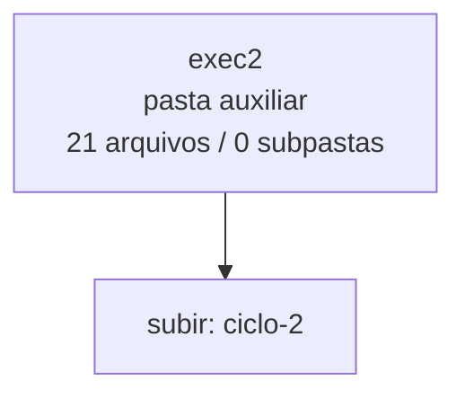

<!-- IA_NAVIGACAO:GERADO_AUTO:v1 -->
# Mapa IA - exec2

Atualizado automaticamente em: **2026-08-05 13:33:28 -0300**

- Caminho: `C:\Users\IgorPC\.claude\projects\Escritório fabio osório\fabricas de melhoria de petições\_FORJA_HARNESS\autoresearch\ciclos\ciclo-2\exec2`
- Tipo: **pasta auxiliar**
- Função para navegação: conteúdo auxiliar ou residual
- Conteúdo recursivo: **21 arquivos**, **0 subpastas**, **564.7 KB**
- Tipos de arquivo: .md: 8, .json: 5, .jsonl: 4, .stderr: 4
- Mapa raiz: [MAPA_IA.md](<../../../../../MAPA_IA.md>)
- Índice geral: [INDICE_GERAL_IA.md](<../../../../../00_IA_NAVIGACAO/INDICE_GERAL_IA.md>)
- Protocolo de navegação: [PROTOCOLO_NAVEGACAO_IA.md](<../../../../../00_IA_NAVIGACAO/PROTOCOLO_NAVEGACAO_IA.md>)
- Inventário JSON para agentes: [inventario_ia.json](<../../../../../00_IA_NAVIGACAO/dados/inventario_ia.json>)
- Mapa superior: [ciclo-2](<../MAPA_IA.md>)

## GPS Mermaid

## Ordem de leitura recomendada

1. Ler este `MAPA_IA.md` antes de abrir arquivos pesados.
2. Subir para a raiz se precisar das regras globais `AGENTS.md`, `CLAUDE.md` e `_LEIS_GERAIS`.

## Subpastas diretas

_Sem subpastas diretas._

## Arquivos diretos

| Arquivo | Papel | Tamanho | Modificado | Observação |
|---|---:|---:|---:|---|
| [EXECMAP.json](<EXECMAP.json>) | dados/script | 171 B | 2026-07-23 20:28 | dado estruturado ou rotina técnica |
| [MANIFEST_e1.json](<MANIFEST_e1.json>) | dados/script | 728 B | 2026-07-23 20:38 | dado estruturado ou rotina técnica |
| [MANIFEST_e2.json](<MANIFEST_e2.json>) | dados/script | 728 B | 2026-07-23 20:38 | dado estruturado ou rotina técnica |
| [MANIFEST_e3.json](<MANIFEST_e3.json>) | dados/script | 729 B | 2026-07-23 20:38 | dado estruturado ou rotina técnica |
| [MANIFEST_e4.json](<MANIFEST_e4.json>) | dados/script | 727 B | 2026-07-23 20:38 | dado estruturado ou rotina técnica |
| [raw_e1.jsonl](<raw_e1.jsonl>) | dados/script | 1.7 KB | 2026-07-23 20:34 | dado estruturado ou rotina técnica |
| [raw_e2.jsonl](<raw_e2.jsonl>) | dados/script | 3.6 KB | 2026-07-23 20:34 | dado estruturado ou rotina técnica |
| [raw_e3.jsonl](<raw_e3.jsonl>) | dados/script | 112.1 KB | 2026-07-23 20:37 | dado estruturado ou rotina técnica |
| [raw_e4.jsonl](<raw_e4.jsonl>) | dados/script | 1.8 KB | 2026-07-23 20:32 | dado estruturado ou rotina técnica |
| [EXECPROMPT_e1.md](<EXECPROMPT_e1.md>) | outro | 55.6 KB | 2026-07-23 20:28 | arquivo não classificado automaticamente \| tópicos: PROMPT — Fábrica de Melhoria de Petições; MISSÃO E REGRA DE PARADA; GATE 1 — INGESTÃO, IDENTIDADE E COBERTURA |
| [EXECPROMPT_e2.md](<EXECPROMPT_e2.md>) | outro | 31.8 KB | 2026-07-23 20:28 | arquivo não classificado automaticamente \| tópicos: PROMPT — Fábrica de Melhoria de Petições (genérico, colar em qualquer pasta de processo); MISSÃO; FASE 1 — LEITURA ESTRATÉGICA DA PASTA (obrigatória antes de escrever qualquer linha) |
| [EXECPROMPT_e3.md](<EXECPROMPT_e3.md>) | outro | 57.2 KB | 2026-07-23 20:28 | arquivo não classificado automaticamente \| tópicos: PROMPT — Fábrica de Melhoria de Petições (genérico, colar em qualquer pasta de processo); MISSÃO; FASE 1 — LEITURA ESTRATÉGICA DA PASTA (obrigatória antes de escrever qualquer linha) |
| [EXECPROMPT_e4.md](<EXECPROMPT_e4.md>) | outro | 30.2 KB | 2026-07-23 20:28 | arquivo não classificado automaticamente \| tópicos: PROMPT — Fábrica de Melhoria de Petições; MISSÃO E REGRA DE PARADA; GATE 1 — INGESTÃO, IDENTIDADE E COBERTURA |
| [OUT_e1.md](<OUT_e1.md>) | outro | 67.3 KB | 2026-07-23 20:34 | arquivo não classificado automaticamente \| tópicos: MINUTA INTERNA — AÇÃO DECLARATÓRIA DE INVALIDADE DE EXCLUSÃO DE BENEFICIÁRIO; AÇÃO DECLARATÓRIA DE INVALIDADE DE EXCLUSÃO DE BENEFICIÁRIO C/C OBRIGAÇÃO DE FAZER, EXIBIÇÃO DE DOCUMENTOS E INDENIZAÇÃO; SÍNTESE DA CONTROVÉRSIA, DOS FUNDAMENTOS E DO PEDIDO |
| [OUT_e2.md](<OUT_e2.md>) | outro | 51.8 KB | 2026-07-23 20:34 | arquivo não classificado automaticamente \| tópicos: MINUTA INTEGRAL DE TRABALHO — NÃO PROTOCOLAR; MEMORIAL; SÍNTESE EXECUTIVA |
| [OUT_e3.md](<OUT_e3.md>) | outro | 72.0 KB | 2026-07-23 20:37 | arquivo não classificado automaticamente \| tópicos: RASCUNHO NÃO PROTOCOLÁVEL — PENDÊNCIAS DE VERIFICAÇÃO; I — SÍNTESE EXECUTIVA; Quadro 1 — O que se pede agora e o que se reserva à instrução |
| [OUT_e4.md](<OUT_e4.md>) | outro | 37.1 KB | 2026-07-23 20:32 | arquivo não classificado automaticamente \| tópicos: Memorial — versão de trabalho interno; MEMORIAL DA RECORRENTE; Síntese da controvérsia, dos fundamentos e do pedido |
| [raw_e1.stderr](<raw_e1.stderr>) | outro | 15.1 KB | 2026-07-23 20:34 | arquivo não classificado automaticamente |
| [raw_e2.stderr](<raw_e2.stderr>) | outro | 10.4 KB | 2026-07-23 20:34 | arquivo não classificado automaticamente |
| [raw_e3.stderr](<raw_e3.stderr>) | outro | 11.0 KB | 2026-07-23 20:37 | arquivo não classificado automaticamente |
| [raw_e4.stderr](<raw_e4.stderr>) | outro | 2.8 KB | 2026-07-23 20:29 | arquivo não classificado automaticamente |

## Leitura por papel

- **dados/script**: [EXECMAP.json](<EXECMAP.json>), [MANIFEST_e1.json](<MANIFEST_e1.json>), [MANIFEST_e2.json](<MANIFEST_e2.json>), [MANIFEST_e3.json](<MANIFEST_e3.json>), [MANIFEST_e4.json](<MANIFEST_e4.json>), [raw_e1.jsonl](<raw_e1.jsonl>), [raw_e2.jsonl](<raw_e2.jsonl>), [raw_e3.jsonl](<raw_e3.jsonl>), [raw_e4.jsonl](<raw_e4.jsonl>)
- **outro**: [EXECPROMPT_e1.md](<EXECPROMPT_e1.md>), [EXECPROMPT_e2.md](<EXECPROMPT_e2.md>), [EXECPROMPT_e3.md](<EXECPROMPT_e3.md>), [EXECPROMPT_e4.md](<EXECPROMPT_e4.md>), [OUT_e1.md](<OUT_e1.md>), [OUT_e2.md](<OUT_e2.md>), [OUT_e3.md](<OUT_e3.md>), [OUT_e4.md](<OUT_e4.md>), [raw_e1.stderr](<raw_e1.stderr>), [raw_e2.stderr](<raw_e2.stderr>), [raw_e3.stderr](<raw_e3.stderr>), [raw_e4.stderr](<raw_e4.stderr>)

## Observações anti-alucinação

- Este mapa classifica por nomes, extensões e posição na árvore; não substitui leitura de fonte primária.
- Fato, citação, ID processual, prazo e jurisprudência só entram em peça depois de conferência no arquivo-fonte ou fonte oficial.
- Se a pasta tiver regimento, a peça deve refletir o regimento vigente na data do protocolo.
