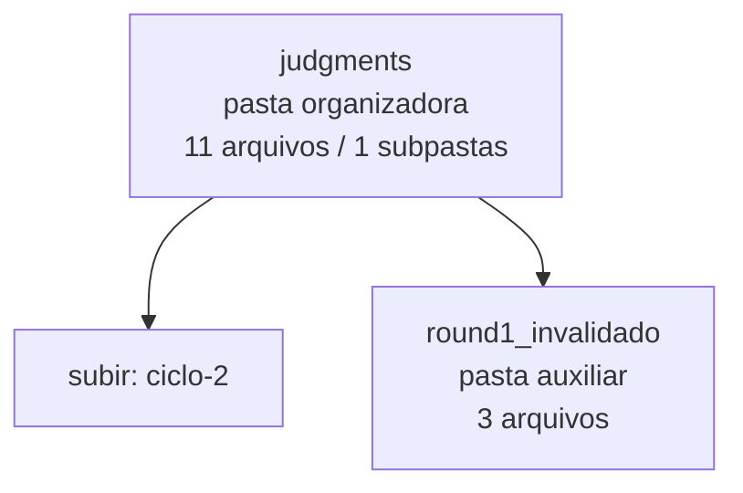

<!-- IA_NAVIGACAO:GERADO_AUTO:v1 -->
# Mapa IA - judgments

Atualizado automaticamente em: **2026-08-05 13:33:28 -0300**

- Caminho: `C:\Users\IgorPC\.claude\projects\Escritório fabio osório\fabricas de melhoria de petições\_FORJA_HARNESS\autoresearch\ciclos\ciclo-2\judgments`
- Tipo: **pasta organizadora**
- Função para navegação: agrega subpastas; abrir mapa filho conforme objetivo
- Conteúdo recursivo: **11 arquivos**, **1 subpastas**, **13.5 KB**
- Tipos de arquivo: .json: 10, .md: 1
- Mapa raiz: [MAPA_IA.md](<../../../../../MAPA_IA.md>)
- Índice geral: [INDICE_GERAL_IA.md](<../../../../../00_IA_NAVIGACAO/INDICE_GERAL_IA.md>)
- Protocolo de navegação: [PROTOCOLO_NAVEGACAO_IA.md](<../../../../../00_IA_NAVIGACAO/PROTOCOLO_NAVEGACAO_IA.md>)
- Inventário JSON para agentes: [inventario_ia.json](<../../../../../00_IA_NAVIGACAO/dados/inventario_ia.json>)
- Mapa superior: [ciclo-2](<../MAPA_IA.md>)

## GPS Mermaid

## Ordem de leitura recomendada

1. Ler este `MAPA_IA.md` antes de abrir arquivos pesados.
2. Subir para a raiz se precisar das regras globais `AGENTS.md`, `CLAUDE.md` e `_LEIS_GERAIS`.

## Subpastas diretas

| Subpasta | Tipo | Conteúdo | Atualização | Próximo passo |
|---|---|---:|---:|---|
| [round1_invalidado](<round1_invalidado/MAPA_IA.md>) | pasta auxiliar | 3 arquivos / 0 subpastas | 2026-07-23 20:45 | conteúdo auxiliar ou residual |

## Arquivos diretos

| Arquivo | Papel | Tamanho | Modificado | Observação |
|---|---:|---:|---:|---|
| [juiz1r2c2-claude_ciclo2-t1b.json](<juiz1r2c2-claude_ciclo2-t1b.json>) | dados/script | 1.2 KB | 2026-07-23 20:41 | dado estruturado ou rotina técnica |
| [juiz1r2c2-claude_ciclo2-t2b.json](<juiz1r2c2-claude_ciclo2-t2b.json>) | dados/script | 1.4 KB | 2026-07-23 20:41 | dado estruturado ou rotina técnica |
| [juiz1r3c2-claude_ciclo2-t1b.json](<juiz1r3c2-claude_ciclo2-t1b.json>) | dados/script | 1.2 KB | 2026-07-23 20:45 | dado estruturado ou rotina técnica |
| [juiz1r3c2-claude_ciclo2-t2b.json](<juiz1r3c2-claude_ciclo2-t2b.json>) | dados/script | 1.1 KB | 2026-07-23 20:45 | dado estruturado ou rotina técnica |
| [juiz2r2c2-claude_ciclo2-t1b.json](<juiz2r2c2-claude_ciclo2-t1b.json>) | dados/script | 1.4 KB | 2026-07-23 20:41 | dado estruturado ou rotina técnica |
| [juiz2r2c2-claude_ciclo2-t2b.json](<juiz2r2c2-claude_ciclo2-t2b.json>) | dados/script | 1.4 KB | 2026-07-23 20:41 | dado estruturado ou rotina técnica |
| [juiz2r3c2-claude_ciclo2-t2b.json](<juiz2r3c2-claude_ciclo2-t2b.json>) | dados/script | 1.3 KB | 2026-07-23 20:45 | dado estruturado ou rotina técnica |
| [juiz3r3c2-claude_ciclo2-t1b.json](<juiz3r3c2-claude_ciclo2-t1b.json>) | dados/script | 1.1 KB | 2026-07-23 20:47 | dado estruturado ou rotina técnica |

## Leitura por papel

- **dados/script**: [juiz1r2c2-claude_ciclo2-t1b.json](<juiz1r2c2-claude_ciclo2-t1b.json>), [juiz1r2c2-claude_ciclo2-t2b.json](<juiz1r2c2-claude_ciclo2-t2b.json>), [juiz1r3c2-claude_ciclo2-t1b.json](<juiz1r3c2-claude_ciclo2-t1b.json>), [juiz1r3c2-claude_ciclo2-t2b.json](<juiz1r3c2-claude_ciclo2-t2b.json>), [juiz2r2c2-claude_ciclo2-t1b.json](<juiz2r2c2-claude_ciclo2-t1b.json>), [juiz2r2c2-claude_ciclo2-t2b.json](<juiz2r2c2-claude_ciclo2-t2b.json>), [juiz2r3c2-claude_ciclo2-t2b.json](<juiz2r3c2-claude_ciclo2-t2b.json>), [juiz3r3c2-claude_ciclo2-t1b.json](<juiz3r3c2-claude_ciclo2-t1b.json>)

## Observações anti-alucinação

- Este mapa classifica por nomes, extensões e posição na árvore; não substitui leitura de fonte primária.
- Fato, citação, ID processual, prazo e jurisprudência só entram em peça depois de conferência no arquivo-fonte ou fonte oficial.
- Se a pasta tiver regimento, a peça deve refletir o regimento vigente na data do protocolo.
