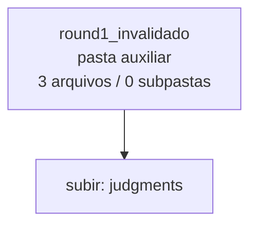

<!-- IA_NAVIGACAO:GERADO_AUTO:v1 -->
# Mapa IA - round1_invalidado

Atualizado automaticamente em: **2026-08-05 13:33:24 -0300**

- Caminho: `C:\Users\IgorPC\.claude\projects\Escritório fabio osório\fabricas de melhoria de petições\_FORJA_HARNESS\autoresearch\ciclos\ciclo-2\judgments\round1_invalidado`
- Tipo: **pasta auxiliar**
- Função para navegação: conteúdo auxiliar ou residual
- Conteúdo recursivo: **3 arquivos**, **0 subpastas**, **3.5 KB**
- Tipos de arquivo: .json: 2, .md: 1
- Mapa raiz: [MAPA_IA.md](<../../../../../../MAPA_IA.md>)
- Índice geral: [INDICE_GERAL_IA.md](<../../../../../../00_IA_NAVIGACAO/INDICE_GERAL_IA.md>)
- Protocolo de navegação: [PROTOCOLO_NAVEGACAO_IA.md](<../../../../../../00_IA_NAVIGACAO/PROTOCOLO_NAVEGACAO_IA.md>)
- Inventário JSON para agentes: [inventario_ia.json](<../../../../../../00_IA_NAVIGACAO/dados/inventario_ia.json>)
- Mapa superior: [judgments](<../MAPA_IA.md>)

## GPS Mermaid

## Ordem de leitura recomendada

1. Ler este `MAPA_IA.md` antes de abrir arquivos pesados.
2. Subir para a raiz se precisar das regras globais `AGENTS.md`, `CLAUDE.md` e `_LEIS_GERAIS`.

## Subpastas diretas

_Sem subpastas diretas._

## Arquivos diretos

| Arquivo | Papel | Tamanho | Modificado | Observação |
|---|---:|---:|---:|---|
| [juiz2r3c2-claude_ciclo2-t1b_ancora_invalida.json](<juiz2r3c2-claude_ciclo2-t1b_ancora_invalida.json>) | dados/script | 1.2 KB | 2026-07-23 20:45 | dado estruturado ou rotina técnica |
| [raw_votos_round1.json](<raw_votos_round1.json>) | dados/script | 880 B | 2026-07-23 20:28 | dado estruturado ou rotina técnica |
| [INVALIDACAO.md](<INVALIDACAO.md>) | outro | 1.4 KB | 2026-07-23 20:28 | arquivo não classificado automaticamente \| tópicos: Round 1 do ciclo AR-2 — INVALIDADO (cegamento comprometido); Evidência (verificada por busca exata na fonte); Causa raiz |

## Leitura por papel

- **dados/script**: [juiz2r3c2-claude_ciclo2-t1b_ancora_invalida.json](<juiz2r3c2-claude_ciclo2-t1b_ancora_invalida.json>), [raw_votos_round1.json](<raw_votos_round1.json>)
- **outro**: [INVALIDACAO.md](<INVALIDACAO.md>)

## Observações anti-alucinação

- Este mapa classifica por nomes, extensões e posição na árvore; não substitui leitura de fonte primária.
- Fato, citação, ID processual, prazo e jurisprudência só entram em peça depois de conferência no arquivo-fonte ou fonte oficial.
- Se a pasta tiver regimento, a peça deve refletir o regimento vigente na data do protocolo.
