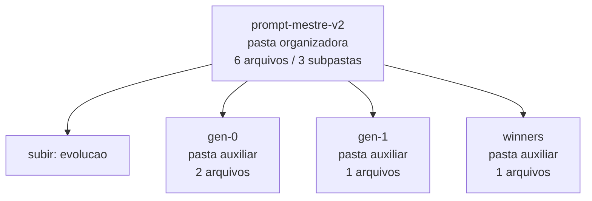

<!-- IA_NAVIGACAO:GERADO_AUTO:v1 -->
# Mapa IA - prompt-mestre-v2

Atualizado automaticamente em: **2026-08-05 13:33:35 -0300**

- Caminho: `C:\Users\IgorPC\.claude\projects\Escritório fabio osório\fabricas de melhoria de petições\_FORJA_HARNESS\autoresearch\evolucao\prompt-mestre-v2`
- Tipo: **pasta organizadora**
- Função para navegação: agrega subpastas; abrir mapa filho conforme objetivo
- Conteúdo recursivo: **6 arquivos**, **3 subpastas**, **105.7 KB**
- Tipos de arquivo: .md: 5, .json: 1
- Mapa raiz: [MAPA_IA.md](<../../../../MAPA_IA.md>)
- Índice geral: [INDICE_GERAL_IA.md](<../../../../00_IA_NAVIGACAO/INDICE_GERAL_IA.md>)
- Protocolo de navegação: [PROTOCOLO_NAVEGACAO_IA.md](<../../../../00_IA_NAVIGACAO/PROTOCOLO_NAVEGACAO_IA.md>)
- Inventário JSON para agentes: [inventario_ia.json](<../../../../00_IA_NAVIGACAO/dados/inventario_ia.json>)
- Mapa superior: [evolucao](<../MAPA_IA.md>)

## GPS Mermaid

## Ordem de leitura recomendada

1. Ler este `MAPA_IA.md` antes de abrir arquivos pesados.
2. Subir para a raiz se precisar das regras globais `AGENTS.md`, `CLAUDE.md` e `_LEIS_GERAIS`.

## Subpastas diretas

| Subpasta | Tipo | Conteúdo | Atualização | Próximo passo |
|---|---|---:|---:|---|
| [gen-0](<gen-0/MAPA_IA.md>) | pasta auxiliar | 2 arquivos / 0 subpastas | 2026-07-23 03:44 | conteúdo auxiliar ou residual |
| [gen-1](<gen-1/MAPA_IA.md>) | pasta auxiliar | 1 arquivos / 0 subpastas | 2026-07-23 20:13 | conteúdo auxiliar ou residual |
| [winners](<winners/MAPA_IA.md>) | pasta auxiliar | 1 arquivos / 0 subpastas | 2026-07-23 04:06 | conteúdo auxiliar ou residual |

## Arquivos diretos

| Arquivo | Papel | Tamanho | Modificado | Observação |
|---|---:|---:|---:|---|
| [manifest.json](<manifest.json>) | dados/script | 2.6 KB | 2026-07-23 20:48 | dado estruturado ou rotina técnica |
| [baseline.md](<baseline.md>) | outro | 20.6 KB | 2026-07-23 02:37 | arquivo não classificado automaticamente \| tópicos: PROMPT — Fábrica de Melhoria de Petições (genérico, colar em qualquer pasta de processo); MISSÃO; FASE 1 — LEITURA ESTRATÉGICA DA PASTA (obrigatória antes de escrever qualquer linha) |

## Leitura por papel

- **dados/script**: [manifest.json](<manifest.json>)
- **outro**: [baseline.md](<baseline.md>)

## Observações anti-alucinação

- Este mapa classifica por nomes, extensões e posição na árvore; não substitui leitura de fonte primária.
- Fato, citação, ID processual, prazo e jurisprudência só entram em peça depois de conferência no arquivo-fonte ou fonte oficial.
- Se a pasta tiver regimento, a peça deve refletir o regimento vigente na data do protocolo.
