<!-- IA_NAVIGACAO:GERADO_AUTO:v1 -->
# Mapa IA - bancada_cafelana_v7

Atualizado automaticamente em: **2026-08-05 13:32:38 -0300**

- Caminho: `C:\Users\IgorPC\.claude\projects\Escritório fabio osório\fabricas de melhoria de petições\_FORJA_HARNESS\bancada_cafelana_v7`
- Tipo: **pasta de caso/produção**
- Função para navegação: contém peça, parecer, memorial, relatório ou plano
- Conteúdo recursivo: **45 arquivos**, **14 subpastas**, **1.1 MB**
- Tipos de arquivo: .md: 20, .json: 19, .py: 6
- Mapa raiz: [MAPA_IA.md](<../../MAPA_IA.md>)
- Índice geral: [INDICE_GERAL_IA.md](<../../00_IA_NAVIGACAO/INDICE_GERAL_IA.md>)
- Protocolo de navegação: [PROTOCOLO_NAVEGACAO_IA.md](<../../00_IA_NAVIGACAO/PROTOCOLO_NAVEGACAO_IA.md>)
- Inventário JSON para agentes: [inventario_ia.json](<../../00_IA_NAVIGACAO/dados/inventario_ia.json>)
- Mapa superior: [_FORJA_HARNESS](<../MAPA_IA.md>)

## GPS Mermaid

```mermaid
flowchart TD
  Ne2bd1b7acc["bancada_cafelana_v7<br/>pasta de caso/produção<br/>45 arquivos / 14 subpastas"]
  N9b2db0adfb["subir: _FORJA_HARNESS"]
  Ne2bd1b7acc --> N9b2db0adfb
  click N9b2db0adfb "../MAPA_IA.md" "Abrir mapa superior"
  Nb94ee7b0ed["avaliacao<br/>pasta organizadora<br/>9 arquivos"]
  Ne2bd1b7acc --> Nb94ee7b0ed
  click Nb94ee7b0ed "avaliacao/MAPA_IA.md" "Abrir mapa da pasta"
  N60795358d4["cego<br/>pasta auxiliar<br/>7 arquivos"]
  Ne2bd1b7acc --> N60795358d4
  click N60795358d4 "cego/MAPA_IA.md" "Abrir mapa da pasta"
  N5ccfbaa25e["execucao<br/>pasta organizadora<br/>12 arquivos"]
  Ne2bd1b7acc --> N5ccfbaa25e
  click N5ccfbaa25e "execucao/MAPA_IA.md" "Abrir mapa da pasta"
  Nb41fb02bc2["execucao_descartadas<br/>pasta organizadora<br/>5 arquivos"]
  Ne2bd1b7acc --> Nb41fb02bc2
  click Nb41fb02bc2 "execucao_descartadas/MAPA_IA.md" "Abrir mapa da pasta"
  N85307df5ba["protocolo<br/>pasta de caso/produção<br/>3 arquivos"]
  Ne2bd1b7acc --> N85307df5ba
  click N85307df5ba "protocolo/MAPA_IA.md" "Abrir mapa da pasta"
  N0063ae0a73["LEIA-ME.md<br/>instruções locais da pasta"]
  Ne2bd1b7acc --> N0063ae0a73
  click N0063ae0a73 "LEIA-ME.md" "Abrir arquivo"
  N72cddfb99b["RELATORIO_BANCADA_V7.md<br/>relatório, auditoria, checklist ou aprendizado"]
  Ne2bd1b7acc --> N72cddfb99b
  click N72cddfb99b "RELATORIO_BANCADA_V7.md" "Abrir arquivo"
```

## Ordem de leitura recomendada

1. Ler este `MAPA_IA.md` antes de abrir arquivos pesados.
2. Subir para a raiz se precisar das regras globais `AGENTS.md`, `CLAUDE.md` e `_LEIS_GERAIS`.

## Subpastas diretas

| Subpasta | Tipo | Conteúdo | Atualização | Próximo passo |
|---|---|---:|---:|---|
| [avaliacao](<avaliacao/MAPA_IA.md>) | pasta organizadora | 9 arquivos / 1 subpastas | 2026-07-27 15:03 | agrega subpastas; abrir mapa filho conforme objetivo |
| [cego](<cego/MAPA_IA.md>) | pasta auxiliar | 7 arquivos / 0 subpastas | 2026-07-27 14:56 | conteúdo auxiliar ou residual |
| [execucao](<execucao/MAPA_IA.md>) | pasta organizadora | 12 arquivos / 6 subpastas | 2026-07-27 16:18 | agrega subpastas; abrir mapa filho conforme objetivo |
| [execucao_descartadas](<execucao_descartadas/MAPA_IA.md>) | pasta organizadora | 5 arquivos / 2 subpastas | 2026-07-27 14:39 | agrega subpastas; abrir mapa filho conforme objetivo |
| [protocolo](<protocolo/MAPA_IA.md>) | pasta de caso/produção | 3 arquivos / 0 subpastas | 2026-07-27 14:57 | contém peça, parecer, memorial, relatório ou plano |

## Arquivos diretos

| Arquivo | Papel | Tamanho | Modificado | Observação |
|---|---:|---:|---:|---|
| [LEIA-ME.md](<LEIA-ME.md>) | regras | 9.4 KB | 2026-07-27 16:21 | instruções locais da pasta \| tópicos: Bancada Cafelana V7 — teste independente de modelos; O que se está medindo; A tarefa |
| [RELATORIO_BANCADA_V7.md](<RELATORIO_BANCADA_V7.md>) | relatório/auditoria | 12.8 KB | 2026-07-27 15:05 | relatório, auditoria, checklist ou aprendizado \| tópicos: Bancada Cafelana V7 — relatório; 1. O resultado; 2. O achado que mais importa: ninguém inventou |
| [bancada_avaliar.py](<bancada_avaliar.py>) | dados/script | 21.0 KB | 2026-07-27 14:59 | dado estruturado ou rotina técnica |
| [bancada_dossie.py](<bancada_dossie.py>) | dados/script | 6.6 KB | 2026-07-27 14:57 | dado estruturado ou rotina técnica |
| [bancada_executar.py](<bancada_executar.py>) | dados/script | 15.5 KB | 2026-07-27 16:17 | dado estruturado ou rotina técnica |
| [bancada_juizes.py](<bancada_juizes.py>) | dados/script | 17.0 KB | 2026-07-27 15:02 | dado estruturado ou rotina técnica |
| [bancada_registro.py](<bancada_registro.py>) | dados/script | 23.3 KB | 2026-07-27 16:21 | dado estruturado ou rotina técnica |
| [bancada_relatorio.py](<bancada_relatorio.py>) | dados/script | 4.8 KB | 2026-07-27 15:03 | dado estruturado ou rotina técnica |
| [RESULTADOS_DETALHADOS_BANCADA_V7.md](<RESULTADOS_DETALHADOS_BANCADA_V7.md>) | outro | 29.5 KB | 2026-07-27 16:22 | arquivo não classificado automaticamente \| tópicos: Registro detalhado — Bancada Cafelana V7; 1. Insumo congelado; 2. Execução — telemetria por participante |

## Leitura por papel

- **regras**: [LEIA-ME.md](<LEIA-ME.md>)
- **relatório/auditoria**: [RELATORIO_BANCADA_V7.md](<RELATORIO_BANCADA_V7.md>)
- **dados/script**: [bancada_avaliar.py](<bancada_avaliar.py>), [bancada_dossie.py](<bancada_dossie.py>), [bancada_executar.py](<bancada_executar.py>), [bancada_juizes.py](<bancada_juizes.py>), [bancada_registro.py](<bancada_registro.py>), [bancada_relatorio.py](<bancada_relatorio.py>)
- **outro**: [RESULTADOS_DETALHADOS_BANCADA_V7.md](<RESULTADOS_DETALHADOS_BANCADA_V7.md>)

## Observações anti-alucinação

- Este mapa classifica por nomes, extensões e posição na árvore; não substitui leitura de fonte primária.
- Fato, citação, ID processual, prazo e jurisprudência só entram em peça depois de conferência no arquivo-fonte ou fonte oficial.
- Se a pasta tiver regimento, a peça deve refletir o regimento vigente na data do protocolo.
