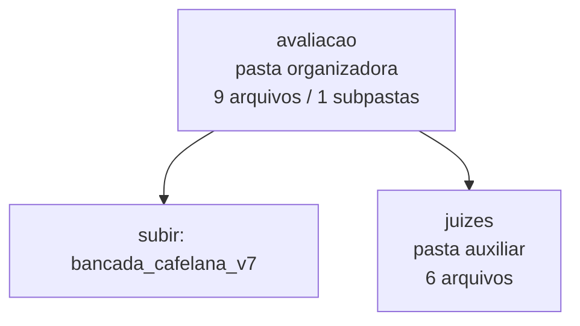

<!-- IA_NAVIGACAO:GERADO_AUTO:v1 -->
# Mapa IA - avaliacao

Atualizado automaticamente em: **2026-08-05 13:56:04 -0300**

- Caminho: `C:\Users\IgorPC\.claude\projects\Escritório fabio osório\fabricas de melhoria de petições\_FORJA_HARNESS\bancada_cafelana_v7\avaliacao`
- Tipo: **pasta organizadora**
- Função para navegação: agrega subpastas; abrir mapa filho conforme objetivo
- Conteúdo recursivo: **9 arquivos**, **1 subpastas**, **63.5 KB**
- Tipos de arquivo: .json: 9
- Mapa raiz: [MAPA_IA.md](<../../../MAPA_IA.md>)
- Índice geral: [INDICE_GERAL_IA.md](<../../../00_IA_NAVIGACAO/INDICE_GERAL_IA.md>)
- Protocolo de navegação: [PROTOCOLO_NAVEGACAO_IA.md](<../../../00_IA_NAVIGACAO/PROTOCOLO_NAVEGACAO_IA.md>)
- Inventário JSON para agentes: [inventario_ia.json](<../../../00_IA_NAVIGACAO/dados/inventario_ia.json>)
- Mapa superior: [bancada_cafelana_v7](<../MAPA_IA.md>)

## GPS Mermaid

## Ordem de leitura recomendada

1. Ler este `MAPA_IA.md` antes de abrir arquivos pesados.
2. Subir para a raiz se precisar das regras globais `AGENTS.md`, `CLAUDE.md` e `_LEIS_GERAIS`.

## Subpastas diretas

| Subpasta | Tipo | Conteúdo | Atualização | Próximo passo |
|---|---|---:|---:|---|
| [juizes](<juizes/MAPA_IA.md>) | pasta auxiliar | 6 arquivos / 0 subpastas | 2026-07-27 15:01 | conteúdo auxiliar ou residual |

## Arquivos diretos

| Arquivo | Papel | Tamanho | Modificado | Observação |
|---|---:|---:|---:|---|
| [DETERMINISTICA.json](<DETERMINISTICA.json>) | dados/script | 35.2 KB | 2026-07-27 14:59 | dado estruturado ou rotina técnica |
| [JUIZES_CONSOLIDADO.json](<JUIZES_CONSOLIDADO.json>) | dados/script | 3.4 KB | 2026-07-27 15:02 | dado estruturado ou rotina técnica |
| [QUADRO_FINAL.json](<QUADRO_FINAL.json>) | dados/script | 3.2 KB | 2026-07-27 15:03 | dado estruturado ou rotina técnica |

## Leitura por papel

- **dados/script**: [DETERMINISTICA.json](<DETERMINISTICA.json>), [JUIZES_CONSOLIDADO.json](<JUIZES_CONSOLIDADO.json>), [QUADRO_FINAL.json](<QUADRO_FINAL.json>)

## Observações anti-alucinação

- Este mapa classifica por nomes, extensões e posição na árvore; não substitui leitura de fonte primária.
- Fato, citação, ID processual, prazo e jurisprudência só entram em peça depois de conferência no arquivo-fonte ou fonte oficial.
- Se a pasta tiver regimento, a peça deve refletir o regimento vigente na data do protocolo.
