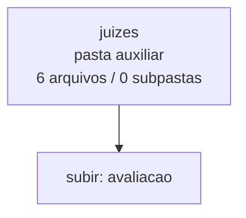

<!-- IA_NAVIGACAO:GERADO_AUTO:v1 -->
# Mapa IA - juizes

Atualizado automaticamente em: **2026-08-05 13:33:35 -0300**

- Caminho: `C:\Users\IgorPC\.claude\projects\Escritório fabio osório\fabricas de melhoria de petições\_FORJA_HARNESS\bancada_cafelana_v7\avaliacao\juizes`
- Tipo: **pasta auxiliar**
- Função para navegação: conteúdo auxiliar ou residual
- Conteúdo recursivo: **6 arquivos**, **0 subpastas**, **21.7 KB**
- Tipos de arquivo: .json: 6
- Mapa raiz: [MAPA_IA.md](<../../../../MAPA_IA.md>)
- Índice geral: [INDICE_GERAL_IA.md](<../../../../00_IA_NAVIGACAO/INDICE_GERAL_IA.md>)
- Protocolo de navegação: [PROTOCOLO_NAVEGACAO_IA.md](<../../../../00_IA_NAVIGACAO/PROTOCOLO_NAVEGACAO_IA.md>)
- Inventário JSON para agentes: [inventario_ia.json](<../../../../00_IA_NAVIGACAO/dados/inventario_ia.json>)
- Mapa superior: [avaliacao](<../MAPA_IA.md>)

## GPS Mermaid

## Ordem de leitura recomendada

1. Ler este `MAPA_IA.md` antes de abrir arquivos pesados.
2. Subir para a raiz se precisar das regras globais `AGENTS.md`, `CLAUDE.md` e `_LEIS_GERAIS`.

## Subpastas diretas

_Sem subpastas diretas._

## Arquivos diretos

| Arquivo | Papel | Tamanho | Modificado | Observação |
|---|---:|---:|---:|---|
| [grok-4.5_dir.json](<grok-4.5_dir.json>) | dados/script | 3.3 KB | 2026-07-27 15:00 | dado estruturado ou rotina técnica |
| [grok-4.5_inv.json](<grok-4.5_inv.json>) | dados/script | 3.2 KB | 2026-07-27 15:01 | dado estruturado ou rotina técnica |
| [opus-5_dir.json](<opus-5_dir.json>) | dados/script | 4.1 KB | 2026-07-27 15:00 | dado estruturado ou rotina técnica |
| [opus-5_inv.json](<opus-5_inv.json>) | dados/script | 4.1 KB | 2026-07-27 15:01 | dado estruturado ou rotina técnica |
| [sol-5.6_dir.json](<sol-5.6_dir.json>) | dados/script | 3.5 KB | 2026-07-27 15:00 | dado estruturado ou rotina técnica |
| [sol-5.6_inv.json](<sol-5.6_inv.json>) | dados/script | 3.4 KB | 2026-07-27 15:00 | dado estruturado ou rotina técnica |

## Leitura por papel

- **dados/script**: [grok-4.5_dir.json](<grok-4.5_dir.json>), [grok-4.5_inv.json](<grok-4.5_inv.json>), [opus-5_dir.json](<opus-5_dir.json>), [opus-5_inv.json](<opus-5_inv.json>), [sol-5.6_dir.json](<sol-5.6_dir.json>), [sol-5.6_inv.json](<sol-5.6_inv.json>)

## Observações anti-alucinação

- Este mapa classifica por nomes, extensões e posição na árvore; não substitui leitura de fonte primária.
- Fato, citação, ID processual, prazo e jurisprudência só entram em peça depois de conferência no arquivo-fonte ou fonte oficial.
- Se a pasta tiver regimento, a peça deve refletir o regimento vigente na data do protocolo.
