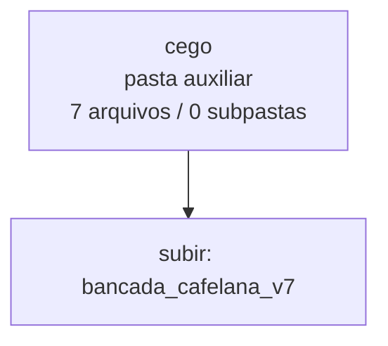

<!-- IA_NAVIGACAO:GERADO_AUTO:v1 -->
# Mapa IA - cego

Atualizado automaticamente em: **2026-08-05 13:56:04 -0300**

- Caminho: `C:\Users\IgorPC\.claude\projects\Escritório fabio osório\fabricas de melhoria de petições\_FORJA_HARNESS\bancada_cafelana_v7\cego`
- Tipo: **pasta auxiliar**
- Função para navegação: conteúdo auxiliar ou residual
- Conteúdo recursivo: **7 arquivos**, **0 subpastas**, **318.8 KB**
- Tipos de arquivo: .md: 6, .json: 1
- Mapa raiz: [MAPA_IA.md](<../../../MAPA_IA.md>)
- Índice geral: [INDICE_GERAL_IA.md](<../../../00_IA_NAVIGACAO/INDICE_GERAL_IA.md>)
- Protocolo de navegação: [PROTOCOLO_NAVEGACAO_IA.md](<../../../00_IA_NAVIGACAO/PROTOCOLO_NAVEGACAO_IA.md>)
- Inventário JSON para agentes: [inventario_ia.json](<../../../00_IA_NAVIGACAO/dados/inventario_ia.json>)
- Mapa superior: [bancada_cafelana_v7](<../MAPA_IA.md>)

## GPS Mermaid

## Ordem de leitura recomendada

1. Ler este `MAPA_IA.md` antes de abrir arquivos pesados.
2. Subir para a raiz se precisar das regras globais `AGENTS.md`, `CLAUDE.md` e `_LEIS_GERAIS`.

## Subpastas diretas

_Sem subpastas diretas._

## Arquivos diretos

| Arquivo | Papel | Tamanho | Modificado | Observação |
|---|---:|---:|---:|---|
| [CEGAMENTO.json](<CEGAMENTO.json>) | dados/script | 233 B | 2026-07-27 14:56 | dado estruturado ou rotina técnica |
| [P1.md](<P1.md>) | outro | 41.0 KB | 2026-07-27 14:56 | arquivo não classificado automaticamente \| tópicos: IMPUGNAÇÃO AO AGRAVO INTERNO — V7; IMPUGNAÇÃO AO AGRAVO INTERNO; RESUMO |
| [P2.md](<P2.md>) | outro | 79.0 KB | 2026-07-27 14:56 | arquivo não classificado automaticamente \| tópicos: IMPUGNAÇÃO AO AGRAVO INTERNO — V7; RESUMO; SÍNTESE DOS PONTOS ESSENCIAIS |
| [P3.md](<P3.md>) | outro | 74.3 KB | 2026-07-27 14:56 | arquivo não classificado automaticamente \| tópicos: IMPUGNAÇÃO AO AGRAVO INTERNO — V7; IMPUGNAÇÃO AO AGRAVO INTERNO; RESUMO |
| [P4.md](<P4.md>) | outro | 72.7 KB | 2026-07-27 14:56 | arquivo não classificado automaticamente \| tópicos: IMPUGNAÇÃO AO AGRAVO INTERNO — V7; RESUMO; SÍNTESE DOS PONTOS ESSENCIAIS |
| [P5.md](<P5.md>) | outro | 4.8 KB | 2026-07-27 14:56 | arquivo não classificado automaticamente \| tópicos: IMPUGNAÇÃO AO AGRAVO INTERNO — V7; IMPUGNAÇÃO AO AGRAVO INTERNO; RESUMO |
| [P6.md](<P6.md>) | outro | 46.8 KB | 2026-07-27 14:56 | arquivo não classificado automaticamente \| tópicos: IMPUGNAÇÃO AO AGRAVO INTERNO — V7; RESUMO; SÍNTESE DOS PONTOS ESSENCIAIS |

## Leitura por papel

- **dados/script**: [CEGAMENTO.json](<CEGAMENTO.json>)
- **outro**: [P1.md](<P1.md>), [P2.md](<P2.md>), [P3.md](<P3.md>), [P4.md](<P4.md>), [P5.md](<P5.md>), [P6.md](<P6.md>)

## Observações anti-alucinação

- Este mapa classifica por nomes, extensões e posição na árvore; não substitui leitura de fonte primária.
- Fato, citação, ID processual, prazo e jurisprudência só entram em peça depois de conferência no arquivo-fonte ou fonte oficial.
- Se a pasta tiver regimento, a peça deve refletir o regimento vigente na data do protocolo.
