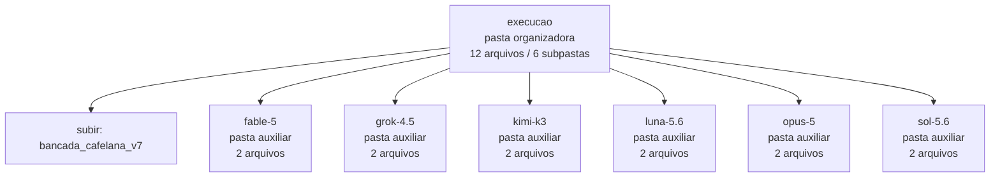

<!-- IA_NAVIGACAO:GERADO_AUTO:v1 -->
# Mapa IA - execucao

Atualizado automaticamente em: **2026-08-05 13:33:43 -0300**

- Caminho: `C:\Users\IgorPC\.claude\projects\Escritório fabio osório\fabricas de melhoria de petições\_FORJA_HARNESS\bancada_cafelana_v7\execucao`
- Tipo: **pasta organizadora**
- Função para navegação: agrega subpastas; abrir mapa filho conforme objetivo
- Conteúdo recursivo: **12 arquivos**, **6 subpastas**, **326.3 KB**
- Tipos de arquivo: .json: 6, .md: 6
- Mapa raiz: [MAPA_IA.md](<../../../MAPA_IA.md>)
- Índice geral: [INDICE_GERAL_IA.md](<../../../00_IA_NAVIGACAO/INDICE_GERAL_IA.md>)
- Protocolo de navegação: [PROTOCOLO_NAVEGACAO_IA.md](<../../../00_IA_NAVIGACAO/PROTOCOLO_NAVEGACAO_IA.md>)
- Inventário JSON para agentes: [inventario_ia.json](<../../../00_IA_NAVIGACAO/dados/inventario_ia.json>)
- Mapa superior: [bancada_cafelana_v7](<../MAPA_IA.md>)

## GPS Mermaid

## Ordem de leitura recomendada

1. Ler este `MAPA_IA.md` antes de abrir arquivos pesados.
2. Subir para a raiz se precisar das regras globais `AGENTS.md`, `CLAUDE.md` e `_LEIS_GERAIS`.

## Subpastas diretas

| Subpasta | Tipo | Conteúdo | Atualização | Próximo passo |
|---|---|---:|---:|---|
| [fable-5](<fable-5/MAPA_IA.md>) | pasta auxiliar | 2 arquivos / 0 subpastas | 2026-07-27 16:18 | conteúdo auxiliar ou residual |
| [grok-4.5](<grok-4.5/MAPA_IA.md>) | pasta auxiliar | 2 arquivos / 0 subpastas | 2026-07-27 14:15 | conteúdo auxiliar ou residual |
| [kimi-k3](<kimi-k3/MAPA_IA.md>) | pasta auxiliar | 2 arquivos / 0 subpastas | 2026-07-27 14:29 | conteúdo auxiliar ou residual |
| [luna-5.6](<luna-5.6/MAPA_IA.md>) | pasta auxiliar | 2 arquivos / 0 subpastas | 2026-07-27 14:10 | conteúdo auxiliar ou residual |
| [opus-5](<opus-5/MAPA_IA.md>) | pasta auxiliar | 2 arquivos / 0 subpastas | 2026-07-27 16:18 | conteúdo auxiliar ou residual |
| [sol-5.6](<sol-5.6/MAPA_IA.md>) | pasta auxiliar | 2 arquivos / 0 subpastas | 2026-07-27 14:14 | conteúdo auxiliar ou residual |

## Arquivos diretos

_Sem arquivos diretos nesta pasta._

## Leitura por papel

- Sem arquivos diretos.

## Observações anti-alucinação

- Este mapa classifica por nomes, extensões e posição na árvore; não substitui leitura de fonte primária.
- Fato, citação, ID processual, prazo e jurisprudência só entram em peça depois de conferência no arquivo-fonte ou fonte oficial.
- Se a pasta tiver regimento, a peça deve refletir o regimento vigente na data do protocolo.
