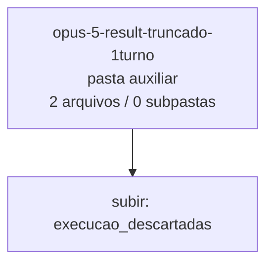

<!-- IA_NAVIGACAO:GERADO_AUTO:v1 -->
# Mapa IA - opus-5-result-truncado-1turno

Atualizado automaticamente em: **2026-08-05 13:55:56 -0300**

- Caminho: `C:\Users\IgorPC\.claude\projects\Escritório fabio osório\fabricas de melhoria de petições\_FORJA_HARNESS\bancada_cafelana_v7\execucao_descartadas\opus-5-result-truncado-1turno`
- Tipo: **pasta auxiliar**
- Função para navegação: conteúdo auxiliar ou residual
- Conteúdo recursivo: **2 arquivos**, **0 subpastas**, **11.6 KB**
- Tipos de arquivo: .json: 1, .md: 1
- Mapa raiz: [MAPA_IA.md](<../../../../MAPA_IA.md>)
- Índice geral: [INDICE_GERAL_IA.md](<../../../../00_IA_NAVIGACAO/INDICE_GERAL_IA.md>)
- Protocolo de navegação: [PROTOCOLO_NAVEGACAO_IA.md](<../../../../00_IA_NAVIGACAO/PROTOCOLO_NAVEGACAO_IA.md>)
- Inventário JSON para agentes: [inventario_ia.json](<../../../../00_IA_NAVIGACAO/dados/inventario_ia.json>)
- Mapa superior: [execucao_descartadas](<../MAPA_IA.md>)

## GPS Mermaid

## Ordem de leitura recomendada

1. Ler este `MAPA_IA.md` antes de abrir arquivos pesados.
2. Subir para a raiz se precisar das regras globais `AGENTS.md`, `CLAUDE.md` e `_LEIS_GERAIS`.

## Subpastas diretas

_Sem subpastas diretas._

## Arquivos diretos

| Arquivo | Papel | Tamanho | Modificado | Observação |
|---|---:|---:|---:|---|
| [META.json](<META.json>) | dados/script | 1.2 KB | 2026-07-27 14:39 | dado estruturado ou rotina técnica |
| [SAIDA.md](<SAIDA.md>) | outro | 10.4 KB | 2026-07-27 14:39 | arquivo não classificado automaticamente \| tópicos: 2. Tratamento de cada pendência declarada no relatório da V6 (exigência 1); 3. Autoridades — o que fiz e o que deliberadamente não fiz (exigência 4); 4. Ajustes menores |

## Leitura por papel

- **dados/script**: [META.json](<META.json>)
- **outro**: [SAIDA.md](<SAIDA.md>)

## Observações anti-alucinação

- Este mapa classifica por nomes, extensões e posição na árvore; não substitui leitura de fonte primária.
- Fato, citação, ID processual, prazo e jurisprudência só entram em peça depois de conferência no arquivo-fonte ou fonte oficial.
- Se a pasta tiver regimento, a peça deve refletir o regimento vigente na data do protocolo.
