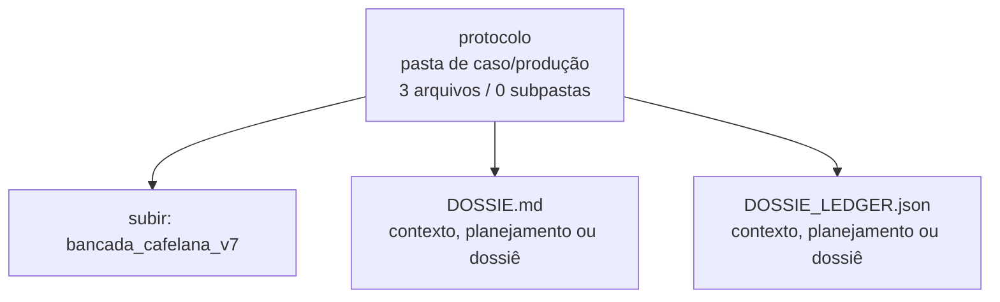

<!-- IA_NAVIGACAO:GERADO_AUTO:v1 -->
# Mapa IA - protocolo

Atualizado automaticamente em: **2026-08-05 13:56:04 -0300**

- Caminho: `C:\Users\IgorPC\.claude\projects\Escritório fabio osório\fabricas de melhoria de petições\_FORJA_HARNESS\bancada_cafelana_v7\protocolo`
- Tipo: **pasta de caso/produção**
- Função para navegação: contém peça, parecer, memorial, relatório ou plano
- Conteúdo recursivo: **3 arquivos**, **0 subpastas**, **147.1 KB**
- Tipos de arquivo: .md: 2, .json: 1
- Mapa raiz: [MAPA_IA.md](<../../../MAPA_IA.md>)
- Índice geral: [INDICE_GERAL_IA.md](<../../../00_IA_NAVIGACAO/INDICE_GERAL_IA.md>)
- Protocolo de navegação: [PROTOCOLO_NAVEGACAO_IA.md](<../../../00_IA_NAVIGACAO/PROTOCOLO_NAVEGACAO_IA.md>)
- Inventário JSON para agentes: [inventario_ia.json](<../../../00_IA_NAVIGACAO/dados/inventario_ia.json>)
- Mapa superior: [bancada_cafelana_v7](<../MAPA_IA.md>)

## GPS Mermaid

## Ordem de leitura recomendada

1. Ler este `MAPA_IA.md` antes de abrir arquivos pesados.
2. Subir para a raiz se precisar das regras globais `AGENTS.md`, `CLAUDE.md` e `_LEIS_GERAIS`.

## Subpastas diretas

_Sem subpastas diretas._

## Arquivos diretos

| Arquivo | Papel | Tamanho | Modificado | Observação |
|---|---:|---:|---:|---|
| [DOSSIE.md](<DOSSIE.md>) | plano/contexto | 139.9 KB | 2026-07-27 14:57 | contexto, planejamento ou dossiê \| tópicos: DOSSIÊ ÚNICO — CAFELANA V7 (bancada de modelos); \[PECA_BASE_V6\] Texto integral da V6, entregue em 27/07/2026. É a base sobre a qual a V7 trabalha.; IMPUGNAÇÃO AO AGRAVO INTERNO |
| [DOSSIE_LEDGER.json](<DOSSIE_LEDGER.json>) | plano/contexto | 3.8 KB | 2026-07-27 14:57 | contexto, planejamento ou dossiê |
| [PROMPT_V7.md](<PROMPT_V7.md>) | outro | 3.4 KB | 2026-07-27 14:06 | arquivo não classificado automaticamente \| tópicos: A tarefa; Cinco exigências que valem como critério; Formato exato da resposta |

## Leitura por papel

- **plano/contexto**: [DOSSIE.md](<DOSSIE.md>), [DOSSIE_LEDGER.json](<DOSSIE_LEDGER.json>)
- **outro**: [PROMPT_V7.md](<PROMPT_V7.md>)

## Observações anti-alucinação

- Este mapa classifica por nomes, extensões e posição na árvore; não substitui leitura de fonte primária.
- Fato, citação, ID processual, prazo e jurisprudência só entram em peça depois de conferência no arquivo-fonte ou fonte oficial.
- Se a pasta tiver regimento, a peça deve refletir o regimento vigente na data do protocolo.
