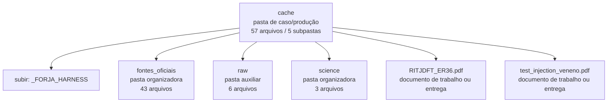

<!-- IA_NAVIGACAO:GERADO_AUTO:v1 -->
# Mapa IA - cache

Atualizado automaticamente em: **2026-08-05 13:56:09 -0300**

- Caminho: `C:\Users\IgorPC\.claude\projects\Escritório fabio osório\fabricas de melhoria de petições\_FORJA_HARNESS\cache`
- Tipo: **pasta de caso/produção**
- Função para navegação: contém peça, parecer, memorial, relatório ou plano
- Conteúdo recursivo: **57 arquivos**, **5 subpastas**, **1.9 MB**
- Tipos de arquivo: .txt: 40, .md: 6, .json: 4, .pdf: 3, .html: 3, .xml: 1
- Mapa raiz: [MAPA_IA.md](<../../MAPA_IA.md>)
- Índice geral: [INDICE_GERAL_IA.md](<../../00_IA_NAVIGACAO/INDICE_GERAL_IA.md>)
- Protocolo de navegação: [PROTOCOLO_NAVEGACAO_IA.md](<../../00_IA_NAVIGACAO/PROTOCOLO_NAVEGACAO_IA.md>)
- Inventário JSON para agentes: [inventario_ia.json](<../../00_IA_NAVIGACAO/dados/inventario_ia.json>)
- Mapa superior: [_FORJA_HARNESS](<../MAPA_IA.md>)

## GPS Mermaid

## Ordem de leitura recomendada

1. Ler este `MAPA_IA.md` antes de abrir arquivos pesados.
2. Subir para a raiz se precisar das regras globais `AGENTS.md`, `CLAUDE.md` e `_LEIS_GERAIS`.
3. Para fatos, datas, citações e IDs: verificar nos anexos/fontes antes de afirmar.

## Subpastas diretas

| Subpasta | Tipo | Conteúdo | Atualização | Próximo passo |
|---|---|---:|---:|---|
| [fontes_oficiais](<fontes_oficiais/MAPA_IA.md>) | pasta organizadora | 43 arquivos / 1 subpastas | 2026-07-26 16:06 | agrega subpastas; abrir mapa filho conforme objetivo |
| [raw](<raw/MAPA_IA.md>) | pasta auxiliar | 6 arquivos / 0 subpastas | 2026-07-09 20:20 | conteúdo auxiliar ou residual |
| [science](<science/MAPA_IA.md>) | pasta organizadora | 3 arquivos / 1 subpastas | 2026-07-11 00:21 | agrega subpastas; abrir mapa filho conforme objetivo |

## Arquivos diretos

| Arquivo | Papel | Tamanho | Modificado | Observação |
|---|---:|---:|---:|---|
| [RITJDFT_ER36.pdf](<RITJDFT_ER36.pdf>) | peça/trabalho | 902.8 KB | 2026-07-09 19:46 | documento de trabalho ou entrega |
| [test_injection_veneno.pdf](<test_injection_veneno.pdf>) | peça/trabalho | 1.6 KB | 2026-08-05 01:20 | documento de trabalho ou entrega |
| [F1_INJECTION_SCAN.json](<F1_INJECTION_SCAN.json>) | dados/script | 11.4 KB | 2026-08-05 03:09 | dado estruturado ou rotina técnica |
| [DIFF_CAFELANA_TESTE.md](<DIFF_CAFELANA_TESTE.md>) | outro | 27.5 KB | 2026-07-09 16:47 | arquivo não classificado automaticamente \| tópicos: Diff Automático: Nossa Versão vs. Protocolada; Estatísticas; Mudanças Detalhadas |
| [DIFF_CAFELANA_TESTE_REEXEC.md](<DIFF_CAFELANA_TESTE_REEXEC.md>) | outro | 27.5 KB | 2026-07-09 16:52 | arquivo não classificado automaticamente \| tópicos: Diff Automático: Nossa Versão vs. Protocolada; Estatísticas; Mudanças Detalhadas |

## Leitura por papel

- **peça/trabalho**: [RITJDFT_ER36.pdf](<RITJDFT_ER36.pdf>), [test_injection_veneno.pdf](<test_injection_veneno.pdf>)
- **dados/script**: [F1_INJECTION_SCAN.json](<F1_INJECTION_SCAN.json>)
- **outro**: [DIFF_CAFELANA_TESTE.md](<DIFF_CAFELANA_TESTE.md>), [DIFF_CAFELANA_TESTE_REEXEC.md](<DIFF_CAFELANA_TESTE_REEXEC.md>)

## Observações anti-alucinação

- Este mapa classifica por nomes, extensões e posição na árvore; não substitui leitura de fonte primária.
- Fato, citação, ID processual, prazo e jurisprudência só entram em peça depois de conferência no arquivo-fonte ou fonte oficial.
- Se a pasta tiver regimento, a peça deve refletir o regimento vigente na data do protocolo.
