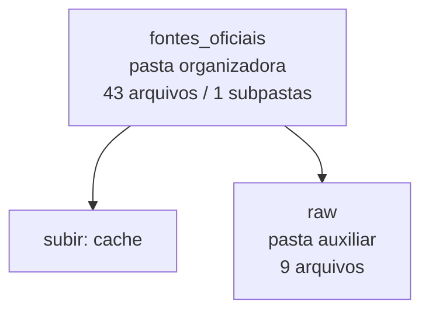

<!-- IA_NAVIGACAO:GERADO_AUTO:v1 -->
# Mapa IA - fontes_oficiais

Atualizado automaticamente em: **2026-08-05 13:33:43 -0300**

- Caminho: `C:\Users\IgorPC\.claude\projects\Escritório fabio osório\fabricas de melhoria de petições\_FORJA_HARNESS\cache\fontes_oficiais`
- Tipo: **pasta organizadora**
- Função para navegação: agrega subpastas; abrir mapa filho conforme objetivo
- Conteúdo recursivo: **43 arquivos**, **1 subpastas**, **363.3 KB**
- Tipos de arquivo: .txt: 37, .md: 4, .pdf: 1, .json: 1
- Mapa raiz: [MAPA_IA.md](<../../../MAPA_IA.md>)
- Índice geral: [INDICE_GERAL_IA.md](<../../../00_IA_NAVIGACAO/INDICE_GERAL_IA.md>)
- Protocolo de navegação: [PROTOCOLO_NAVEGACAO_IA.md](<../../../00_IA_NAVIGACAO/PROTOCOLO_NAVEGACAO_IA.md>)
- Inventário JSON para agentes: [inventario_ia.json](<../../../00_IA_NAVIGACAO/dados/inventario_ia.json>)
- Mapa superior: [cache](<../MAPA_IA.md>)

## GPS Mermaid

## Ordem de leitura recomendada

1. Ler este `MAPA_IA.md` antes de abrir arquivos pesados.
2. Subir para a raiz se precisar das regras globais `AGENTS.md`, `CLAUDE.md` e `_LEIS_GERAIS`.
3. Para fatos, datas, citações e IDs: verificar nos anexos/fontes antes de afirmar.

## Subpastas diretas

| Subpasta | Tipo | Conteúdo | Atualização | Próximo passo |
|---|---|---:|---:|---|
| [raw](<raw/MAPA_IA.md>) | pasta auxiliar | 9 arquivos / 0 subpastas | 2026-07-08 23:49 | conteúdo auxiliar ou residual |

## Arquivos diretos

| Arquivo | Papel | Tamanho | Modificado | Observação |
|---|---:|---:|---:|---|
| [STJ_ER_53_2026_DJe_2026-07-01.pdf](<STJ_ER_53_2026_DJe_2026-07-01.pdf>) | fonte/documento | 174.3 KB | 2026-07-10 13:32 | fonte/anexo para verificação |
| [OFFICIAL_SOURCE_MANIFEST.json](<OFFICIAL_SOURCE_MANIFEST.json>) | dados/script | 7.7 KB | 2026-07-21 20:28 | dado estruturado ou rotina técnica |
| [ANS_PORTABILIDADE_RN438_2018.txt](<ANS_PORTABILIDADE_RN438_2018.txt>) | outro | 6.2 KB | 2026-07-09 19:45 | arquivo não classificado automaticamente |
| [ANS_RN558_2022_DLP_CPT.txt](<ANS_RN558_2022_DLP_CPT.txt>) | outro | 9.1 KB | 2026-07-09 19:45 | arquivo não classificado automaticamente |
| [ANS_RN558_2022_TEXTO_INTEGRAL.txt](<ANS_RN558_2022_TEXTO_INTEGRAL.txt>) | outro | 31.7 KB | 2026-07-09 19:55 | arquivo não classificado automaticamente |
| [ANS_SANCOES_NIP_RN489.txt](<ANS_SANCOES_NIP_RN489.txt>) | outro | 11.1 KB | 2026-07-09 19:45 | arquivo não classificado automaticamente |
| [BCB_SELIC_ACUMULADA_2014_2021.txt](<BCB_SELIC_ACUMULADA_2014_2021.txt>) | outro | 2.1 KB | 2026-07-08 23:45 | arquivo não classificado automaticamente |
| [PLANALTO_CC_ART406.txt](<PLANALTO_CC_ART406.txt>) | outro | 2.5 KB | 2026-07-08 23:46 | arquivo não classificado automaticamente |
| [PLANALTO_CDC_ART34.txt](<PLANALTO_CDC_ART34.txt>) | outro | 380 B | 2026-07-09 20:20 | arquivo não classificado automaticamente |
| [PLANALTO_LEI_14905_2024.txt](<PLANALTO_LEI_14905_2024.txt>) | outro | 7.4 KB | 2026-07-08 23:46 | arquivo não classificado automaticamente |
| [PLANALTO_LEI_9656_ART11_13.txt](<PLANALTO_LEI_9656_ART11_13.txt>) | outro | 5.4 KB | 2026-07-09 19:44 | arquivo não classificado automaticamente |
| [PLANALTO_LEI_9656_ART11_13_VERBATIM.txt](<PLANALTO_LEI_9656_ART11_13_VERBATIM.txt>) | outro | 2.3 KB | 2026-07-09 19:56 | arquivo não classificado automaticamente |
| [README_PESQUISA_MATEUS.md](<README_PESQUISA_MATEUS.md>) | outro | 7.2 KB | 2026-07-09 19:48 | arquivo não classificado automaticamente \| tópicos: Pesquisa de Fontes Oficiais — Caso Mateus Grassi Medina Osório; ACHADOS CRÍTICOS (SÍNTESE EXECUTIVA); ARQUIVOS CAPTURADOS NESTA PASTA |
| [RISTJ_ART_343A_ER53_2026.md](<RISTJ_ART_343A_ER53_2026.md>) | outro | 4.1 KB | 2026-07-25 18:46 | arquivo não classificado automaticamente \| tópicos: RISTJ — art. 343-A (Emenda Regimental 53/2026); Texto verbatim; Âmbito de aplicação — restrito |
| [RISTJ_ARTIGOS_CITADOS_ER47_2024.txt](<RISTJ_ARTIGOS_CITADOS_ER47_2024.txt>) | outro | 14.9 KB | 2026-07-26 16:06 | arquivo não classificado automaticamente |
| [SINTESE_ACHADOS_MATEUS_GRASSI_09072026.md](<SINTESE_ACHADOS_MATEUS_GRASSI_09072026.md>) | outro | 12.7 KB | 2026-07-09 19:46 | arquivo não classificado automaticamente \| tópicos: SÍNTESE DE ACHADOS — Mateus Grassi Medina Osório; CONCLUSÕES JURÍDICAS PRELIMINARES; ✓ ACHADO 1: VIOLAÇÃO DE LEI 9.656, ART. 11 + PARÁGRAFO ÚNICO |
| [STATUS_CAPTURAS_09072026.md](<STATUS_CAPTURAS_09072026.md>) | outro | 10.4 KB | 2026-07-09 19:47 | arquivo não classificado automaticamente \| tópicos: STATUS DE CAPTURAS DE FONTES OFICIAIS; ARQUIVOS CAPTURADOS E GRAVADOS; ✓ 1. PLANALTO_LEI_9656_ART11_13.txt |
| [STF_SUMULA_150.txt](<STF_SUMULA_150.txt>) | outro | 176 B | 2026-07-08 23:50 | arquivo não classificado automaticamente |
| [STF_SUMULA_269.txt](<STF_SUMULA_269.txt>) | outro | 180 B | 2026-07-08 23:50 | arquivo não classificado automaticamente |
| [STF_SUMULA_271.txt](<STF_SUMULA_271.txt>) | outro | 297 B | 2026-07-08 23:50 | arquivo não classificado automaticamente |
| [STF_SUMULA_283.txt](<STF_SUMULA_283.txt>) | outro | 4.0 KB | 2026-07-08 19:06 | arquivo não classificado automaticamente |
| [STF_SUMULA_284.txt](<STF_SUMULA_284.txt>) | outro | 4.1 KB | 2026-07-08 19:06 | arquivo não classificado automaticamente |
| [STF_SUMULA_383.txt](<STF_SUMULA_383.txt>) | outro | 349 B | 2026-07-08 23:50 | arquivo não classificado automaticamente |
| [STF_SUMULAS_201_300.txt](<STF_SUMULAS_201_300.txt>) | outro | 1.7 KB | 2026-07-08 19:05 | arquivo não classificado automaticamente |
| [STJ_RESP_2199164.txt](<STJ_RESP_2199164.txt>) | outro | 1.3 KB | 2026-07-08 23:50 | arquivo não classificado automaticamente |
| [STJ_SUMULA_182.txt](<STJ_SUMULA_182.txt>) | outro | 1.2 KB | 2026-07-08 19:05 | arquivo não classificado automaticamente |
| [STJ_SUMULA_211.txt](<STJ_SUMULA_211.txt>) | outro | 1.4 KB | 2026-07-08 19:05 | arquivo não classificado automaticamente |
| [STJ_SUMULA_339.txt](<STJ_SUMULA_339.txt>) | outro | 228 B | 2026-07-08 23:50 | arquivo não classificado automaticamente |
| [STJ_SUMULA_5.txt](<STJ_SUMULA_5.txt>) | outro | 1.4 KB | 2026-07-10 00:44 | arquivo não classificado automaticamente |
| [STJ_SUMULA_523.txt](<STJ_SUMULA_523.txt>) | outro | 485 B | 2026-07-08 23:50 | arquivo não classificado automaticamente |
| [STJ_SUMULA_608.txt](<STJ_SUMULA_608.txt>) | outro | 547 B | 2026-07-09 20:18 | arquivo não classificado automaticamente |
| [STJ_SUMULA_609.txt](<STJ_SUMULA_609.txt>) | outro | 622 B | 2026-07-09 20:18 | arquivo não classificado automaticamente |
| [STJ_SUMULA_7.txt](<STJ_SUMULA_7.txt>) | outro | 1.4 KB | 2026-07-08 19:05 | arquivo não classificado automaticamente |
| [STJ_TEMA_1368.txt](<STJ_TEMA_1368.txt>) | outro | 1.3 KB | 2026-07-08 23:50 | arquivo não classificado automaticamente |

## Leitura por papel

- **fonte/documento**: [STJ_ER_53_2026_DJe_2026-07-01.pdf](<STJ_ER_53_2026_DJe_2026-07-01.pdf>)
- **dados/script**: [OFFICIAL_SOURCE_MANIFEST.json](<OFFICIAL_SOURCE_MANIFEST.json>)
- **outro**: [ANS_PORTABILIDADE_RN438_2018.txt](<ANS_PORTABILIDADE_RN438_2018.txt>), [ANS_RN558_2022_DLP_CPT.txt](<ANS_RN558_2022_DLP_CPT.txt>), [ANS_RN558_2022_TEXTO_INTEGRAL.txt](<ANS_RN558_2022_TEXTO_INTEGRAL.txt>), [ANS_SANCOES_NIP_RN489.txt](<ANS_SANCOES_NIP_RN489.txt>), [BCB_SELIC_ACUMULADA_2014_2021.txt](<BCB_SELIC_ACUMULADA_2014_2021.txt>), [PLANALTO_CC_ART406.txt](<PLANALTO_CC_ART406.txt>), [PLANALTO_CDC_ART34.txt](<PLANALTO_CDC_ART34.txt>), [PLANALTO_LEI_14905_2024.txt](<PLANALTO_LEI_14905_2024.txt>), [PLANALTO_LEI_9656_ART11_13.txt](<PLANALTO_LEI_9656_ART11_13.txt>), [PLANALTO_LEI_9656_ART11_13_VERBATIM.txt](<PLANALTO_LEI_9656_ART11_13_VERBATIM.txt>), [README_PESQUISA_MATEUS.md](<README_PESQUISA_MATEUS.md>), [RISTJ_ART_343A_ER53_2026.md](<RISTJ_ART_343A_ER53_2026.md>), [RISTJ_ARTIGOS_CITADOS_ER47_2024.txt](<RISTJ_ARTIGOS_CITADOS_ER47_2024.txt>), [SINTESE_ACHADOS_MATEUS_GRASSI_09072026.md](<SINTESE_ACHADOS_MATEUS_GRASSI_09072026.md>), [STATUS_CAPTURAS_09072026.md](<STATUS_CAPTURAS_09072026.md>), [STF_SUMULA_150.txt](<STF_SUMULA_150.txt>), [STF_SUMULA_269.txt](<STF_SUMULA_269.txt>), [STF_SUMULA_271.txt](<STF_SUMULA_271.txt>), [STF_SUMULA_283.txt](<STF_SUMULA_283.txt>), [STF_SUMULA_284.txt](<STF_SUMULA_284.txt>), [STF_SUMULA_383.txt](<STF_SUMULA_383.txt>), [STF_SUMULAS_201_300.txt](<STF_SUMULAS_201_300.txt>), [STJ_RESP_2199164.txt](<STJ_RESP_2199164.txt>), [STJ_SUMULA_182.txt](<STJ_SUMULA_182.txt>), [STJ_SUMULA_211.txt](<STJ_SUMULA_211.txt>), [STJ_SUMULA_339.txt](<STJ_SUMULA_339.txt>), [STJ_SUMULA_5.txt](<STJ_SUMULA_5.txt>), [STJ_SUMULA_523.txt](<STJ_SUMULA_523.txt>), [STJ_SUMULA_608.txt](<STJ_SUMULA_608.txt>), [STJ_SUMULA_609.txt](<STJ_SUMULA_609.txt>), [STJ_SUMULA_7.txt](<STJ_SUMULA_7.txt>), [STJ_TEMA_1368.txt](<STJ_TEMA_1368.txt>)

## Observações anti-alucinação

- Este mapa classifica por nomes, extensões e posição na árvore; não substitui leitura de fonte primária.
- Fato, citação, ID processual, prazo e jurisprudência só entram em peça depois de conferência no arquivo-fonte ou fonte oficial.
- Se a pasta tiver regimento, a peça deve refletir o regimento vigente na data do protocolo.
