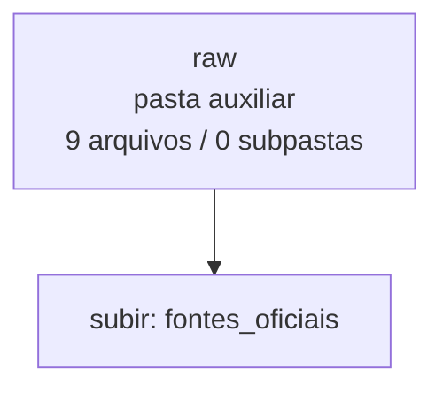

<!-- IA_NAVIGACAO:GERADO_AUTO:v1 -->
# Mapa IA - raw

Atualizado automaticamente em: **2026-08-05 13:55:56 -0300**

- Caminho: `C:\Users\IgorPC\.claude\projects\Escritório fabio osório\fabricas de melhoria de petições\_FORJA_HARNESS\cache\fontes_oficiais\raw`
- Tipo: **pasta auxiliar**
- Função para navegação: conteúdo auxiliar ou residual
- Conteúdo recursivo: **9 arquivos**, **0 subpastas**, **33.3 KB**
- Tipos de arquivo: .txt: 9
- Mapa raiz: [MAPA_IA.md](<../../../../MAPA_IA.md>)
- Índice geral: [INDICE_GERAL_IA.md](<../../../../00_IA_NAVIGACAO/INDICE_GERAL_IA.md>)
- Protocolo de navegação: [PROTOCOLO_NAVEGACAO_IA.md](<../../../../00_IA_NAVIGACAO/PROTOCOLO_NAVEGACAO_IA.md>)
- Inventário JSON para agentes: [inventario_ia.json](<../../../../00_IA_NAVIGACAO/dados/inventario_ia.json>)
- Mapa superior: [fontes_oficiais](<../MAPA_IA.md>)

## GPS Mermaid

## Ordem de leitura recomendada

1. Ler este `MAPA_IA.md` antes de abrir arquivos pesados.
2. Subir para a raiz se precisar das regras globais `AGENTS.md`, `CLAUDE.md` e `_LEIS_GERAIS`.

## Subpastas diretas

_Sem subpastas diretas._

## Arquivos diretos

| Arquivo | Papel | Tamanho | Modificado | Observação |
|---|---:|---:|---:|---|
| [RAW_STF_SUMULA_150.txt](<RAW_STF_SUMULA_150.txt>) | outro | 8.5 KB | 2026-07-08 23:49 | arquivo não classificado automaticamente |
| [RAW_STF_SUMULA_269.txt](<RAW_STF_SUMULA_269.txt>) | outro | 5.0 KB | 2026-07-08 23:49 | arquivo não classificado automaticamente |
| [RAW_STF_SUMULA_271.txt](<RAW_STF_SUMULA_271.txt>) | outro | 5.1 KB | 2026-07-08 23:49 | arquivo não classificado automaticamente |
| [RAW_STF_SUMULA_383.txt](<RAW_STF_SUMULA_383.txt>) | outro | 5.9 KB | 2026-07-08 23:49 | arquivo não classificado automaticamente |
| [RAW_STJ_SCON_AGINT_1830905.txt](<RAW_STJ_SCON_AGINT_1830905.txt>) | outro | 1.3 KB | 2026-07-08 23:47 | arquivo não classificado automaticamente |
| [RAW_STJ_SCON_ERESP_727842.txt](<RAW_STJ_SCON_ERESP_727842.txt>) | outro | 1.1 KB | 2026-07-08 23:47 | arquivo não classificado automaticamente |
| [RAW_STJ_SUMULA_339.txt](<RAW_STJ_SUMULA_339.txt>) | outro | 1.4 KB | 2026-07-08 23:47 | arquivo não classificado automaticamente |
| [RAW_STJ_SUMULA_523.txt](<RAW_STJ_SUMULA_523.txt>) | outro | 1.6 KB | 2026-07-08 23:47 | arquivo não classificado automaticamente |
| [RAW_STJ_TEMA_1368.txt](<RAW_STJ_TEMA_1368.txt>) | outro | 3.3 KB | 2026-07-08 23:47 | arquivo não classificado automaticamente |

## Leitura por papel

- **outro**: [RAW_STF_SUMULA_150.txt](<RAW_STF_SUMULA_150.txt>), [RAW_STF_SUMULA_269.txt](<RAW_STF_SUMULA_269.txt>), [RAW_STF_SUMULA_271.txt](<RAW_STF_SUMULA_271.txt>), [RAW_STF_SUMULA_383.txt](<RAW_STF_SUMULA_383.txt>), [RAW_STJ_SCON_AGINT_1830905.txt](<RAW_STJ_SCON_AGINT_1830905.txt>), [RAW_STJ_SCON_ERESP_727842.txt](<RAW_STJ_SCON_ERESP_727842.txt>), [RAW_STJ_SUMULA_339.txt](<RAW_STJ_SUMULA_339.txt>), [RAW_STJ_SUMULA_523.txt](<RAW_STJ_SUMULA_523.txt>), [RAW_STJ_TEMA_1368.txt](<RAW_STJ_TEMA_1368.txt>)

## Observações anti-alucinação

- Este mapa classifica por nomes, extensões e posição na árvore; não substitui leitura de fonte primária.
- Fato, citação, ID processual, prazo e jurisprudência só entram em peça depois de conferência no arquivo-fonte ou fonte oficial.
- Se a pasta tiver regimento, a peça deve refletir o regimento vigente na data do protocolo.
