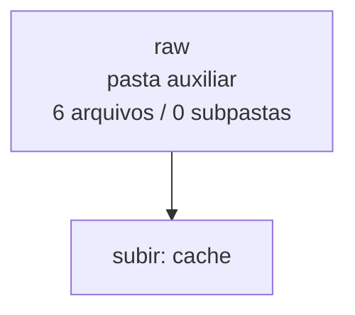

<!-- IA_NAVIGACAO:GERADO_AUTO:v1 -->
# Mapa IA - raw

Atualizado automaticamente em: **2026-08-05 13:33:43 -0300**

- Caminho: `C:\Users\IgorPC\.claude\projects\Escritório fabio osório\fabricas de melhoria de petições\_FORJA_HARNESS\cache\raw`
- Tipo: **pasta auxiliar**
- Função para navegação: conteúdo auxiliar ou residual
- Conteúdo recursivo: **6 arquivos**, **0 subpastas**, **403.2 KB**
- Tipos de arquivo: .html: 3, .txt: 3
- Mapa raiz: [MAPA_IA.md](<../../../MAPA_IA.md>)
- Índice geral: [INDICE_GERAL_IA.md](<../../../00_IA_NAVIGACAO/INDICE_GERAL_IA.md>)
- Protocolo de navegação: [PROTOCOLO_NAVEGACAO_IA.md](<../../../00_IA_NAVIGACAO/PROTOCOLO_NAVEGACAO_IA.md>)
- Inventário JSON para agentes: [inventario_ia.json](<../../../00_IA_NAVIGACAO/dados/inventario_ia.json>)
- Mapa superior: [cache](<../MAPA_IA.md>)

## GPS Mermaid

## Ordem de leitura recomendada

1. Ler este `MAPA_IA.md` antes de abrir arquivos pesados.
2. Subir para a raiz se precisar das regras globais `AGENTS.md`, `CLAUDE.md` e `_LEIS_GERAIS`.

## Subpastas diretas

_Sem subpastas diretas._

## Arquivos diretos

| Arquivo | Papel | Tamanho | Modificado | Observação |
|---|---:|---:|---:|---|
| [l8078.html](<l8078.html>) | outro | 165.2 KB | 2026-07-09 20:20 | arquivo não classificado automaticamente |
| [l9656.html](<l9656.html>) | outro | 168.9 KB | 2026-07-09 19:56 | arquivo não classificado automaticamente |
| [rn558_ans.html](<rn558_ans.html>) | outro | 35.7 KB | 2026-07-09 19:54 | arquivo não classificado automaticamente |
| [rn558_texto.txt](<rn558_texto.txt>) | outro | 30.8 KB | 2026-07-09 19:54 | arquivo não classificado automaticamente |
| [scon_sumula_608_bruto.txt](<scon_sumula_608_bruto.txt>) | outro | 1.3 KB | 2026-07-09 20:18 | arquivo não classificado automaticamente |
| [scon_sumula_609_bruto.txt](<scon_sumula_609_bruto.txt>) | outro | 1.4 KB | 2026-07-09 20:17 | arquivo não classificado automaticamente |

## Leitura por papel

- **outro**: [l8078.html](<l8078.html>), [l9656.html](<l9656.html>), [rn558_ans.html](<rn558_ans.html>), [rn558_texto.txt](<rn558_texto.txt>), [scon_sumula_608_bruto.txt](<scon_sumula_608_bruto.txt>), [scon_sumula_609_bruto.txt](<scon_sumula_609_bruto.txt>)

## Observações anti-alucinação

- Este mapa classifica por nomes, extensões e posição na árvore; não substitui leitura de fonte primária.
- Fato, citação, ID processual, prazo e jurisprudência só entram em peça depois de conferência no arquivo-fonte ou fonte oficial.
- Se a pasta tiver regimento, a peça deve refletir o regimento vigente na data do protocolo.
