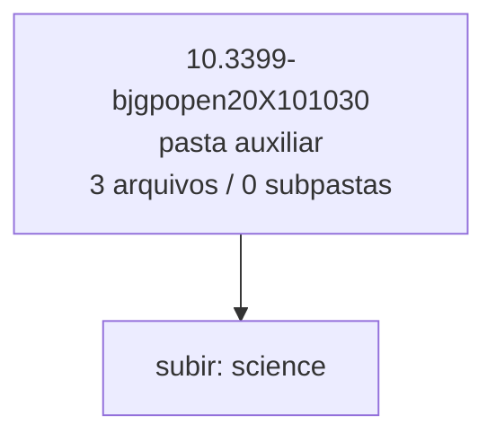

<!-- IA_NAVIGACAO:GERADO_AUTO:v1 -->
# Mapa IA - 10.3399-bjgpopen20X101030

Atualizado automaticamente em: **2026-08-05 13:33:35 -0300**

- Caminho: `C:\Users\IgorPC\.claude\projects\Escritório fabio osório\fabricas de melhoria de petições\_FORJA_HARNESS\cache\science\10.3399-bjgpopen20X101030`
- Tipo: **pasta auxiliar**
- Função para navegação: conteúdo auxiliar ou residual
- Conteúdo recursivo: **3 arquivos**, **0 subpastas**, **191.3 KB**
- Tipos de arquivo: .json: 2, .xml: 1
- Mapa raiz: [MAPA_IA.md](<../../../../MAPA_IA.md>)
- Índice geral: [INDICE_GERAL_IA.md](<../../../../00_IA_NAVIGACAO/INDICE_GERAL_IA.md>)
- Protocolo de navegação: [PROTOCOLO_NAVEGACAO_IA.md](<../../../../00_IA_NAVIGACAO/PROTOCOLO_NAVEGACAO_IA.md>)
- Inventário JSON para agentes: [inventario_ia.json](<../../../../00_IA_NAVIGACAO/dados/inventario_ia.json>)
- Mapa superior: [science](<../MAPA_IA.md>)

## GPS Mermaid

## Ordem de leitura recomendada

1. Ler este `MAPA_IA.md` antes de abrir arquivos pesados.
2. Subir para a raiz se precisar das regras globais `AGENTS.md`, `CLAUDE.md` e `_LEIS_GERAIS`.

## Subpastas diretas

_Sem subpastas diretas._

## Arquivos diretos

| Arquivo | Papel | Tamanho | Modificado | Observação |
|---|---:|---:|---:|---|
| [CROSSREF_DOI.json](<CROSSREF_DOI.json>) | dados/script | 23.8 KB | 2026-07-11 00:21 | dado estruturado ou rotina técnica |
| [DISCOVERY.json](<DISCOVERY.json>) | dados/script | 70.2 KB | 2026-07-11 00:21 | dado estruturado ou rotina técnica |
| [PMC7465578.xml](<PMC7465578.xml>) | dados/script | 97.2 KB | 2026-07-11 00:21 | dado estruturado ou rotina técnica |

## Leitura por papel

- **dados/script**: [CROSSREF_DOI.json](<CROSSREF_DOI.json>), [DISCOVERY.json](<DISCOVERY.json>), [PMC7465578.xml](<PMC7465578.xml>)

## Observações anti-alucinação

- Este mapa classifica por nomes, extensões e posição na árvore; não substitui leitura de fonte primária.
- Fato, citação, ID processual, prazo e jurisprudência só entram em peça depois de conferência no arquivo-fonte ou fonte oficial.
- Se a pasta tiver regimento, a peça deve refletir o regimento vigente na data do protocolo.
