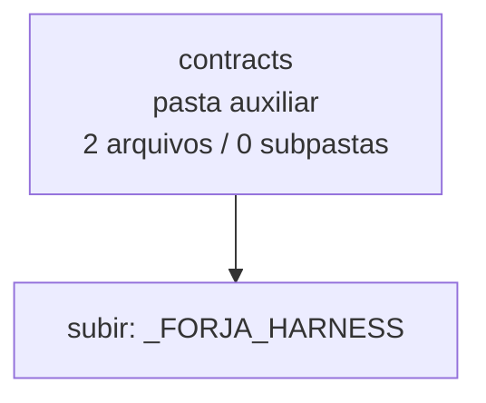

<!-- IA_NAVIGACAO:GERADO_AUTO:v1 -->
# Mapa IA - contracts

Atualizado automaticamente em: **2026-08-05 13:56:09 -0300**

- Caminho: `C:\Users\IgorPC\.claude\projects\Escritório fabio osório\fabricas de melhoria de petições\_FORJA_HARNESS\contracts`
- Tipo: **pasta auxiliar**
- Função para navegação: conteúdo auxiliar ou residual
- Conteúdo recursivo: **2 arquivos**, **0 subpastas**, **7.1 KB**
- Tipos de arquivo: .md: 2
- Mapa raiz: [MAPA_IA.md](<../../MAPA_IA.md>)
- Índice geral: [INDICE_GERAL_IA.md](<../../00_IA_NAVIGACAO/INDICE_GERAL_IA.md>)
- Protocolo de navegação: [PROTOCOLO_NAVEGACAO_IA.md](<../../00_IA_NAVIGACAO/PROTOCOLO_NAVEGACAO_IA.md>)
- Inventário JSON para agentes: [inventario_ia.json](<../../00_IA_NAVIGACAO/dados/inventario_ia.json>)
- Mapa superior: [_FORJA_HARNESS](<../MAPA_IA.md>)

## GPS Mermaid

## Ordem de leitura recomendada

1. Ler este `MAPA_IA.md` antes de abrir arquivos pesados.
2. Subir para a raiz se precisar das regras globais `AGENTS.md`, `CLAUDE.md` e `_LEIS_GERAIS`.

## Subpastas diretas

_Sem subpastas diretas._

## Arquivos diretos

| Arquivo | Papel | Tamanho | Modificado | Observação |
|---|---:|---:|---:|---|
| [INTEGRACAO_STJ_TEIAJUS_2026-07-12.md](<INTEGRACAO_STJ_TEIAJUS_2026-07-12.md>) | outro | 3.9 KB | 2026-07-12 14:50 | arquivo não classificado automaticamente \| tópicos: Contrato de tarefa — STJ no TeiaJus e na ponte FORJA |
| [INTEGRACAO_TEIAJUS_2026-07-12.md](<INTEGRACAO_TEIAJUS_2026-07-12.md>) | outro | 3.1 KB | 2026-07-12 13:48 | arquivo não classificado automaticamente \| tópicos: Contrato de tarefa — Integração FORJA + TeiaJus |

## Leitura por papel

- **outro**: [INTEGRACAO_STJ_TEIAJUS_2026-07-12.md](<INTEGRACAO_STJ_TEIAJUS_2026-07-12.md>), [INTEGRACAO_TEIAJUS_2026-07-12.md](<INTEGRACAO_TEIAJUS_2026-07-12.md>)

## Observações anti-alucinação

- Este mapa classifica por nomes, extensões e posição na árvore; não substitui leitura de fonte primária.
- Fato, citação, ID processual, prazo e jurisprudência só entram em peça depois de conferência no arquivo-fonte ou fonte oficial.
- Se a pasta tiver regimento, a peça deve refletir o regimento vigente na data do protocolo.
