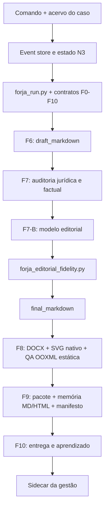

<!-- generated-by: gsd-doc-writer -->
# Arquitetura da FORJA

## Visão geral

A FORJA é uma arquitetura local, orientada a eventos e artefatos, que percorre fases F0–F10. Cada fase resolve entradas declaradas, trabalha em uma tentativa isolada, produz artefatos com hash, passa por gates e só então promove a saída para o estado canônico do caso. O painel de gestão é uma visão derivada; a verdade jurídica permanece nos documentos e artefatos auditados.

## Componentes



## Fluxo de dados

1. `forja_state_machine.py` materializa o estado a partir dos eventos imutáveis do caso.
2. `forja_run.py start` cria uma tentativa em `state/<caseId>/runs/<run>/<phase>/<attempt>/` e congela o contrato e as entradas.
3. O produtor grava o resultado somente dentro da tentativa.
4. `forja_run.py promote` recompõe gates, hashes e invariantes antes de copiar artefatos para `n3_artifacts/`.
5. Em F7, `audited_markdown` somente segue para F7-B quando o gate jurídico não contém P0.
6. O operador ou workflow chama `forja_editorial.py`; `forja_run.py` não dispara o passe editorial automaticamente. O executor autentica o Claude Code por OAuth Claude Max, envia o texto por stdin e solicita a revisão editorial ao modelo padrão `claude-opus-5` (allowlist em `forja_editorial_model.py`; `claude-fable-5` segue autorizado como legado).
7. `forja_editorial_fidelity.py` compara origem e saída. Se houver divergência, a candidata editorial é descartada; o executor admite três candidatas internas no total (inicial + até dois retries), todas a partir da origem.
8. F8 usa `final_markdown`; o pacote revalida o bundle Fable 5 antes de aceitar um entregável não interno.

## Subfase F7-B

F7-B está embutida em F7 para não renumerar F8–F10 nem invalidar estados históricos. O contrato exige:

- `final_markdown`;
- `editorial_report`;
- `editorial_diff`;
- `fable5_usage`;
- gates `fable5_oauth_confirmed`, `editorial_source_hash_match`, `editorial_fidelity_pass` e `human_style_final_pass`.

O modelo atua apenas como produtor editorial. O revisor efetivo é determinístico e independente da declaração do modelo.

`FABLE5_RESULT*.json` é um fragmento de integração, não o resultado completo da fase. Seus artefatos e gates precisam ser incorporados ao `PHASE_RESULT.json` de F7, preservando `producerRole=forja-auditor-juridico`, `reviewerRole=forja-gate-controller` e os demais requisitos contratuais. Usar o fragmento diretamente como resultado da fase reprova a validação de papéis.

## Invariantes editoriais

O passe final preserva:

- números, datas, valores e percentuais;
- marcadores processuais;
- autoridades, dispositivos, precedentes e citações entre aspas;
- marcadores de auditoria e ressalvas;
- títulos e capítulos;
- bloco de pedidos, fecho e assinaturas;
- ausência de proveniência operacional interna;
- no mínimo 90% do comprimento não branco do texto auditado.

Esses invariantes cobrem sinais mecanicamente verificáveis; não detectam toda possível mudança factual sem números, adição semanticamente nova, aspas simples ou pedidos sem heading reconhecido. Não provam equivalência semântica universal. O diff editorial e a revisão humana continuam obrigatórios.

## Abstrações principais

| Abstração | Arquivo | Responsabilidade |
|---|---|---|
| estado derivado e eventos | `forja_state_machine.py` | revisão, idempotência, reabertura e ciclo de vida |
| contrato de fase | `forja_phase_contracts.py` | entradas, saídas, gates, papéis e próxima fase |
| tentativa isolada | `forja_run.py` | preparação, validação e promoção de artefatos |
| editor final | `forja_editorial.py` | chamada Claude Code Fable 5 e persistência do bundle |
| fidelidade editorial | `forja_editorial_fidelity.py` | hashes e invariantes audited→final |
| pacote hash-bound | `forja_package.py` | validação final por entregável e vínculo aos arquivos |
| estilo humano | `forja_estilo_humano.py` | sinais determinísticos de vícios de escrita |
| QA visual | `forja_visual_qa_structural.py` | inspeção estática de OOXML, SVG, fidelidade e layout |
| memória de auditabilidade | `forja_memoria_auditabilidade.py` | processo, métodos, hashes, gates, decisões e limites em MD/HTML/JSON |

## Organização do repositório

```text
_FORJA_HARNESS/
├── phase_contracts/        contratos N3 F0-F10
├── phase_contracts_n4/     extensões candidatas N4
├── state/                  estado, eventos, tentativas e artefatos dos casos
├── reports/                validações e relatórios de arquitetura
├── telemetria/             registros de execução e qualidade
├── planejamento/           decisões arquiteturais e planos versionados
├── templates/              contratos e modelos internos
├── docs/                   documentação canônica de operação e desenvolvimento
├── forja_*.py              módulos executáveis da esteira
└── test_*.py               regressões unitárias e integradas
```

## Compatibilidade

- Nenhuma nova fase foi inserida na tupla F0–F10.
- Tentativas iniciadas com um hash antigo de contrato precisam ser concluídas sob aquele contrato ou formalmente reabertas.
- Pacotes históricos sem `final_markdown` continuam válidos no regime de época.
- Entregáveis novos com passe Fable 5 usam `final_markdown*` e bundles sufixados quando houver múltiplos documentos.
