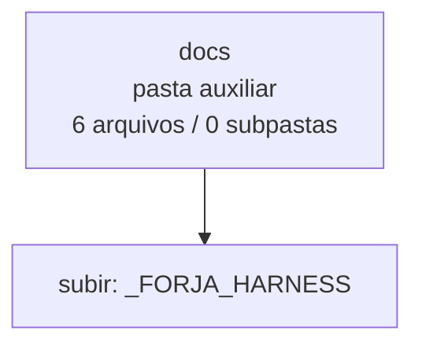

<!-- IA_NAVIGACAO:GERADO_AUTO:v1 -->
# Mapa IA - docs

Atualizado automaticamente em: **2026-08-05 13:32:38 -0300**

- Caminho: `C:\Users\IgorPC\.claude\projects\Escritório fabio osório\fabricas de melhoria de petições\_FORJA_HARNESS\docs`
- Tipo: **pasta auxiliar**
- Função para navegação: conteúdo auxiliar ou residual
- Conteúdo recursivo: **6 arquivos**, **0 subpastas**, **28.8 KB**
- Tipos de arquivo: .md: 6
- Mapa raiz: [MAPA_IA.md](<../../MAPA_IA.md>)
- Índice geral: [INDICE_GERAL_IA.md](<../../00_IA_NAVIGACAO/INDICE_GERAL_IA.md>)
- Protocolo de navegação: [PROTOCOLO_NAVEGACAO_IA.md](<../../00_IA_NAVIGACAO/PROTOCOLO_NAVEGACAO_IA.md>)
- Inventário JSON para agentes: [inventario_ia.json](<../../00_IA_NAVIGACAO/dados/inventario_ia.json>)
- Mapa superior: [_FORJA_HARNESS](<../MAPA_IA.md>)

## GPS Mermaid

## Ordem de leitura recomendada

1. Ler este `MAPA_IA.md` antes de abrir arquivos pesados.
2. Subir para a raiz se precisar das regras globais `AGENTS.md`, `CLAUDE.md` e `_LEIS_GERAIS`.

## Subpastas diretas

_Sem subpastas diretas._

## Arquivos diretos

| Arquivo | Papel | Tamanho | Modificado | Observação |
|---|---:|---:|---:|---|
| [AGENT_INTERFACE.md](<AGENT_INTERFACE.md>) | outro | 2.9 KB | 2026-07-29 22:59 | arquivo não classificado automaticamente \| tópicos: Interface da FORJA para agentes; Uso; Estado vivo e agregado; nenhum argumento mostra conteúdo útil |
| [ARCHITECTURE.md](<ARCHITECTURE.md>) | outro | 5.9 KB | 2026-08-04 00:36 | arquivo não classificado automaticamente \| tópicos: Arquitetura da FORJA; Visão geral; Componentes |
| [CONFIGURATION.md](<CONFIGURATION.md>) | outro | 4.8 KB | 2026-07-27 17:31 | arquivo não classificado automaticamente \| tópicos: Configuração da FORJA; Fontes de configuração; Configuração do modelo editorial (F7-B) |
| [DEVELOPMENT.md](<DEVELOPMENT.md>) | outro | 4.2 KB | 2026-08-04 00:36 | arquivo não classificado automaticamente \| tópicos: Desenvolvimento; Princípio de mudança; Estrutura essencial |
| [GETTING-STARTED.md](<GETTING-STARTED.md>) | outro | 3.3 KB | 2026-07-27 17:31 | arquivo não classificado automaticamente \| tópicos: Primeiros passos; Pré-requisitos; Verificação inicial |
| [TESTING.md](<TESTING.md>) | outro | 7.6 KB | 2026-08-05 03:09 | arquivo não classificado automaticamente \| tópicos: Testes; Estratégia; Baseline — a porta de entrada única |

## Leitura por papel

- **outro**: [AGENT_INTERFACE.md](<AGENT_INTERFACE.md>), [ARCHITECTURE.md](<ARCHITECTURE.md>), [CONFIGURATION.md](<CONFIGURATION.md>), [DEVELOPMENT.md](<DEVELOPMENT.md>), [GETTING-STARTED.md](<GETTING-STARTED.md>), [TESTING.md](<TESTING.md>)

## Observações anti-alucinação

- Este mapa classifica por nomes, extensões e posição na árvore; não substitui leitura de fonte primária.
- Fato, citação, ID processual, prazo e jurisprudência só entram em peça depois de conferência no arquivo-fonte ou fonte oficial.
- Se a pasta tiver regimento, a peça deve refletir o regimento vigente na data do protocolo.
