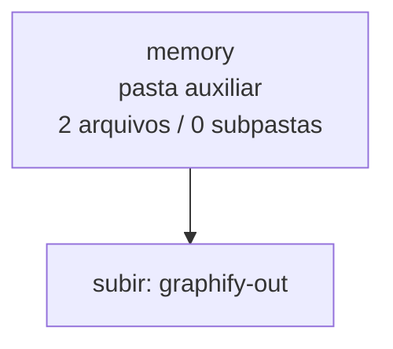

<!-- IA_NAVIGACAO:GERADO_AUTO:v1 -->
# Mapa IA - memory

Atualizado automaticamente em: **2026-08-05 13:56:04 -0300**

- Caminho: `C:\Users\IgorPC\.claude\projects\Escritório fabio osório\fabricas de melhoria de petições\_FORJA_HARNESS\graphify-out\memory`
- Tipo: **pasta auxiliar**
- Função para navegação: conteúdo auxiliar ou residual
- Conteúdo recursivo: **2 arquivos**, **0 subpastas**, **2.4 KB**
- Tipos de arquivo: .md: 2
- Mapa raiz: [MAPA_IA.md](<../../../MAPA_IA.md>)
- Índice geral: [INDICE_GERAL_IA.md](<../../../00_IA_NAVIGACAO/INDICE_GERAL_IA.md>)
- Protocolo de navegação: [PROTOCOLO_NAVEGACAO_IA.md](<../../../00_IA_NAVIGACAO/PROTOCOLO_NAVEGACAO_IA.md>)
- Inventário JSON para agentes: [inventario_ia.json](<../../../00_IA_NAVIGACAO/dados/inventario_ia.json>)
- Mapa superior: [graphify-out](<../MAPA_IA.md>)

## GPS Mermaid

## Ordem de leitura recomendada

1. Ler este `MAPA_IA.md` antes de abrir arquivos pesados.
2. Subir para a raiz se precisar das regras globais `AGENTS.md`, `CLAUDE.md` e `_LEIS_GERAIS`.

## Subpastas diretas

_Sem subpastas diretas._

## Arquivos diretos

| Arquivo | Papel | Tamanho | Modificado | Observação |
|---|---:|---:|---:|---|
| [query_20260730_183445_analise_criticamente_os_planos_van_aken_e_mckinsey.md](<query_20260730_183445_analise_criticamente_os_planos_van_aken_e_mckinsey.md>) | outro | 1007 B | 2026-07-30 15:34 | arquivo não classificado automaticamente \| tópicos: Q: Analise criticamente os planos Van Aken e McKinsey e integre os recursos existentes da FORJA em uma nova versao conso; Answer; Outcome |
| [query_20260803_150808_revise_agora_todo_o_plano_final_de_modo_sistemico.md](<query_20260803_150808_revise_agora_todo_o_plano_final_de_modo_sistemico.md>) | outro | 1.4 KB | 2026-08-03 12:08 | arquivo não classificado automaticamente \| tópicos: Q: revise agora todo o plano final de modo sistemico procurando pontas soltas e avaliado o resultado final se ja esta pr; Answer; Outcome |

## Leitura por papel

- **outro**: [query_20260730_183445_analise_criticamente_os_planos_van_aken_e_mckinsey.md](<query_20260730_183445_analise_criticamente_os_planos_van_aken_e_mckinsey.md>), [query_20260803_150808_revise_agora_todo_o_plano_final_de_modo_sistemico.md](<query_20260803_150808_revise_agora_todo_o_plano_final_de_modo_sistemico.md>)

## Observações anti-alucinação

- Este mapa classifica por nomes, extensões e posição na árvore; não substitui leitura de fonte primária.
- Fato, citação, ID processual, prazo e jurisprudência só entram em peça depois de conferência no arquivo-fonte ou fonte oficial.
- Se a pasta tiver regimento, a peça deve refletir o regimento vigente na data do protocolo.
