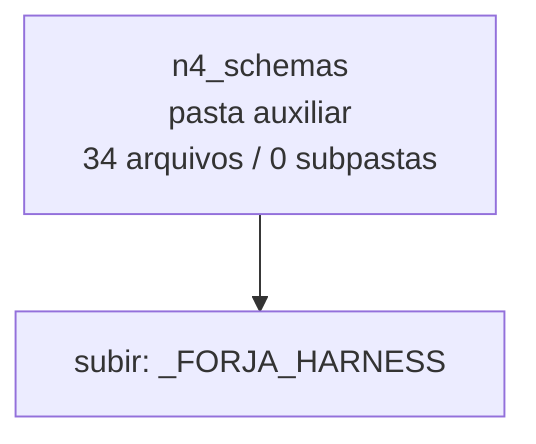

<!-- IA_NAVIGACAO:GERADO_AUTO:v1 -->
# Mapa IA - n4_schemas

Atualizado automaticamente em: **2026-08-05 13:32:38 -0300**

- Caminho: `C:\Users\IgorPC\.claude\projects\Escritório fabio osório\fabricas de melhoria de petições\_FORJA_HARNESS\n4_schemas`
- Tipo: **pasta auxiliar**
- Função para navegação: conteúdo auxiliar ou residual
- Conteúdo recursivo: **34 arquivos**, **0 subpastas**, **150.5 KB**
- Tipos de arquivo: .json: 34
- Mapa raiz: [MAPA_IA.md](<../../MAPA_IA.md>)
- Índice geral: [INDICE_GERAL_IA.md](<../../00_IA_NAVIGACAO/INDICE_GERAL_IA.md>)
- Protocolo de navegação: [PROTOCOLO_NAVEGACAO_IA.md](<../../00_IA_NAVIGACAO/PROTOCOLO_NAVEGACAO_IA.md>)
- Inventário JSON para agentes: [inventario_ia.json](<../../00_IA_NAVIGACAO/dados/inventario_ia.json>)
- Mapa superior: [_FORJA_HARNESS](<../MAPA_IA.md>)

## GPS Mermaid

## Ordem de leitura recomendada

1. Ler este `MAPA_IA.md` antes de abrir arquivos pesados.
2. Subir para a raiz se precisar das regras globais `AGENTS.md`, `CLAUDE.md` e `_LEIS_GERAIS`.

## Subpastas diretas

_Sem subpastas diretas._

## Arquivos diretos

| Arquivo | Papel | Tamanho | Modificado | Observação |
|---|---:|---:|---:|---|
| [ARTIFACT_CATALOG.json](<ARTIFACT_CATALOG.json>) | dados/script | 8.0 KB | 2026-07-29 16:13 | dado estruturado ou rotina técnica |
| [common.schema.json](<common.schema.json>) | dados/script | 2.4 KB | 2026-07-29 16:13 | dado estruturado ou rotina técnica |
| [document_comparison.schema.json](<document_comparison.schema.json>) | dados/script | 5.1 KB | 2026-07-29 16:13 | dado estruturado ou rotina técnica |
| [f10_delivery_integrity.schema.json](<f10_delivery_integrity.schema.json>) | dados/script | 3.7 KB | 2026-07-29 16:13 | dado estruturado ou rotina técnica |
| [f10_human_diff_classification.schema.json](<f10_human_diff_classification.schema.json>) | dados/script | 5.1 KB | 2026-07-29 16:13 | dado estruturado ou rotina técnica |
| [f2_n4_classification.schema.json](<f2_n4_classification.schema.json>) | dados/script | 3.5 KB | 2026-07-29 16:13 | dado estruturado ou rotina técnica |
| [f2_question_tree.schema.json](<f2_question_tree.schema.json>) | dados/script | 8.5 KB | 2026-07-29 16:13 | dado estruturado ou rotina técnica |
| [f3_conduct_ledger.schema.json](<f3_conduct_ledger.schema.json>) | dados/script | 3.5 KB | 2026-07-29 16:13 | dado estruturado ou rotina técnica |
| [f3_document_comparison.schema.json](<f3_document_comparison.schema.json>) | dados/script | 3.5 KB | 2026-07-29 16:13 | dado estruturado ou rotina técnica |
| [f3_event_identity.schema.json](<f3_event_identity.schema.json>) | dados/script | 3.5 KB | 2026-07-29 16:13 | dado estruturado ou rotina técnica |
| [f3_mapa_destinatario.schema.json](<f3_mapa_destinatario.schema.json>) | dados/script | 11.3 KB | 2026-07-29 16:13 | dado estruturado ou rotina técnica |
| [f3_reasoning_graph.schema.json](<f3_reasoning_graph.schema.json>) | dados/script | 3.5 KB | 2026-07-29 16:13 | dado estruturado ou rotina técnica |
| [f4_case_acceptance_tests.schema.json](<f4_case_acceptance_tests.schema.json>) | dados/script | 4.0 KB | 2026-07-29 16:13 | dado estruturado ou rotina técnica |
| [f4_coverage_matrix.schema.json](<f4_coverage_matrix.schema.json>) | dados/script | 3.5 KB | 2026-07-29 16:13 | dado estruturado ou rotina técnica |
| [f4_decision_factor_map.schema.json](<f4_decision_factor_map.schema.json>) | dados/script | 3.5 KB | 2026-07-29 16:13 | dado estruturado ou rotina técnica |
| [f4_intertemporal_map.schema.json](<f4_intertemporal_map.schema.json>) | dados/script | 3.5 KB | 2026-07-29 16:13 | dado estruturado ou rotina técnica |
| [f4_quantification_scenarios.schema.json](<f4_quantification_scenarios.schema.json>) | dados/script | 3.5 KB | 2026-07-29 16:13 | dado estruturado ou rotina técnica |
| [f4_settlement_map.schema.json](<f4_settlement_map.schema.json>) | dados/script | 3.5 KB | 2026-07-29 16:13 | dado estruturado ou rotina técnica |
| [f4_signature_brief.schema.json](<f4_signature_brief.schema.json>) | dados/script | 8.4 KB | 2026-07-29 16:13 | dado estruturado ou rotina técnica |
| [f4_thesis_maturity.schema.json](<f4_thesis_maturity.schema.json>) | dados/script | 4.6 KB | 2026-07-29 16:13 | dado estruturado ou rotina técnica |
| [f5c_claim_evidence_map.schema.json](<f5c_claim_evidence_map.schema.json>) | dados/script | 3.5 KB | 2026-07-29 16:13 | dado estruturado ou rotina técnica |
| [f5c_evidence_synthesis.schema.json](<f5c_evidence_synthesis.schema.json>) | dados/script | 3.5 KB | 2026-07-29 16:13 | dado estruturado ou rotina técnica |
| [f5c_research_protocol.schema.json](<f5c_research_protocol.schema.json>) | dados/script | 3.5 KB | 2026-07-29 16:13 | dado estruturado ou rotina técnica |
| [f5c_study_ledger.schema.json](<f5c_study_ledger.schema.json>) | dados/script | 3.5 KB | 2026-07-29 16:13 | dado estruturado ou rotina técnica |
| [f7_case_test_results.schema.json](<f7_case_test_results.schema.json>) | dados/script | 4.4 KB | 2026-07-29 16:13 | dado estruturado ou rotina técnica |
| [f7_global_consistency.schema.json](<f7_global_consistency.schema.json>) | dados/script | 3.5 KB | 2026-07-29 16:13 | dado estruturado ou rotina técnica |
| [f7_metacognitive_audit.schema.json](<f7_metacognitive_audit.schema.json>) | dados/script | 3.5 KB | 2026-07-29 16:13 | dado estruturado ou rotina técnica |
| [f7_science_audit.schema.json](<f7_science_audit.schema.json>) | dados/script | 3.5 KB | 2026-07-29 16:13 | dado estruturado ou rotina técnica |
| [f9_delivery_selection.schema.json](<f9_delivery_selection.schema.json>) | dados/script | 3.6 KB | 2026-07-29 16:13 | dado estruturado ou rotina técnica |
| [learning_candidate.schema.json](<learning_candidate.schema.json>) | dados/script | 5.6 KB | 2026-07-29 16:13 | dado estruturado ou rotina técnica |
| [N4_LAYOUT_PROFILES.json](<N4_LAYOUT_PROFILES.json>) | dados/script | 1.3 KB | 2026-07-21 21:17 | dado estruturado ou rotina técnica |
| [post_protocol_baseline_backfill.schema.json](<post_protocol_baseline_backfill.schema.json>) | dados/script | 4.4 KB | 2026-07-29 16:13 | dado estruturado ou rotina técnica |
| [post_protocol_return.schema.json](<post_protocol_return.schema.json>) | dados/script | 6.0 KB | 2026-07-29 16:13 | dado estruturado ou rotina técnica |
| [protocol_evidence.schema.json](<protocol_evidence.schema.json>) | dados/script | 4.8 KB | 2026-07-29 16:13 | dado estruturado ou rotina técnica |

## Leitura por papel

- **dados/script**: [ARTIFACT_CATALOG.json](<ARTIFACT_CATALOG.json>), [common.schema.json](<common.schema.json>), [document_comparison.schema.json](<document_comparison.schema.json>), [f10_delivery_integrity.schema.json](<f10_delivery_integrity.schema.json>), [f10_human_diff_classification.schema.json](<f10_human_diff_classification.schema.json>), [f2_n4_classification.schema.json](<f2_n4_classification.schema.json>), [f2_question_tree.schema.json](<f2_question_tree.schema.json>), [f3_conduct_ledger.schema.json](<f3_conduct_ledger.schema.json>), [f3_document_comparison.schema.json](<f3_document_comparison.schema.json>), [f3_event_identity.schema.json](<f3_event_identity.schema.json>), [f3_mapa_destinatario.schema.json](<f3_mapa_destinatario.schema.json>), [f3_reasoning_graph.schema.json](<f3_reasoning_graph.schema.json>), [f4_case_acceptance_tests.schema.json](<f4_case_acceptance_tests.schema.json>), [f4_coverage_matrix.schema.json](<f4_coverage_matrix.schema.json>), [f4_decision_factor_map.schema.json](<f4_decision_factor_map.schema.json>), [f4_intertemporal_map.schema.json](<f4_intertemporal_map.schema.json>), [f4_quantification_scenarios.schema.json](<f4_quantification_scenarios.schema.json>), [f4_settlement_map.schema.json](<f4_settlement_map.schema.json>), [f4_signature_brief.schema.json](<f4_signature_brief.schema.json>), [f4_thesis_maturity.schema.json](<f4_thesis_maturity.schema.json>), [f5c_claim_evidence_map.schema.json](<f5c_claim_evidence_map.schema.json>), [f5c_evidence_synthesis.schema.json](<f5c_evidence_synthesis.schema.json>), [f5c_research_protocol.schema.json](<f5c_research_protocol.schema.json>), [f5c_study_ledger.schema.json](<f5c_study_ledger.schema.json>), [f7_case_test_results.schema.json](<f7_case_test_results.schema.json>), [f7_global_consistency.schema.json](<f7_global_consistency.schema.json>), [f7_metacognitive_audit.schema.json](<f7_metacognitive_audit.schema.json>), [f7_science_audit.schema.json](<f7_science_audit.schema.json>), [f9_delivery_selection.schema.json](<f9_delivery_selection.schema.json>), [learning_candidate.schema.json](<learning_candidate.schema.json>), [N4_LAYOUT_PROFILES.json](<N4_LAYOUT_PROFILES.json>), [post_protocol_baseline_backfill.schema.json](<post_protocol_baseline_backfill.schema.json>), [post_protocol_return.schema.json](<post_protocol_return.schema.json>), [protocol_evidence.schema.json](<protocol_evidence.schema.json>)

## Observações anti-alucinação

- Este mapa classifica por nomes, extensões e posição na árvore; não substitui leitura de fonte primária.
- Fato, citação, ID processual, prazo e jurisprudência só entram em peça depois de conferência no arquivo-fonte ou fonte oficial.
- Se a pasta tiver regimento, a peça deve refletir o regimento vigente na data do protocolo.
