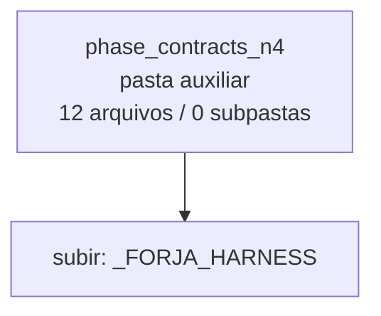

<!-- IA_NAVIGACAO:GERADO_AUTO:v1 -->
# Mapa IA - phase_contracts_n4

Atualizado automaticamente em: **2026-08-05 13:32:38 -0300**

- Caminho: `C:\Users\IgorPC\.claude\projects\Escritório fabio osório\fabricas de melhoria de petições\_FORJA_HARNESS\phase_contracts_n4`
- Tipo: **pasta auxiliar**
- Função para navegação: conteúdo auxiliar ou residual
- Conteúdo recursivo: **12 arquivos**, **0 subpastas**, **15.5 KB**
- Tipos de arquivo: .json: 12
- Mapa raiz: [MAPA_IA.md](<../../MAPA_IA.md>)
- Índice geral: [INDICE_GERAL_IA.md](<../../00_IA_NAVIGACAO/INDICE_GERAL_IA.md>)
- Protocolo de navegação: [PROTOCOLO_NAVEGACAO_IA.md](<../../00_IA_NAVIGACAO/PROTOCOLO_NAVEGACAO_IA.md>)
- Inventário JSON para agentes: [inventario_ia.json](<../../00_IA_NAVIGACAO/dados/inventario_ia.json>)
- Mapa superior: [_FORJA_HARNESS](<../MAPA_IA.md>)

## GPS Mermaid

## Ordem de leitura recomendada

1. Ler este `MAPA_IA.md` antes de abrir arquivos pesados.
2. Subir para a raiz se precisar das regras globais `AGENTS.md`, `CLAUDE.md` e `_LEIS_GERAIS`.

## Subpastas diretas

_Sem subpastas diretas._

## Arquivos diretos

| Arquivo | Papel | Tamanho | Modificado | Observação |
|---|---:|---:|---:|---|
| [EXTENSIONS.json](<EXTENSIONS.json>) | dados/script | 3.2 KB | 2026-07-29 16:13 | dado estruturado ou rotina técnica |
| [F0.json](<F0.json>) | dados/script | 684 B | 2026-07-29 16:13 | dado estruturado ou rotina técnica |
| [F1.json](<F1.json>) | dados/script | 774 B | 2026-07-29 16:13 | dado estruturado ou rotina técnica |
| [F10.json](<F10.json>) | dados/script | 1.1 KB | 2026-07-29 16:13 | dado estruturado ou rotina técnica |
| [F2.json](<F2.json>) | dados/script | 1.0 KB | 2026-07-29 16:13 | dado estruturado ou rotina técnica |
| [F3.json](<F3.json>) | dados/script | 1.1 KB | 2026-07-29 16:13 | dado estruturado ou rotina técnica |
| [F4.json](<F4.json>) | dados/script | 1.3 KB | 2026-07-29 16:13 | dado estruturado ou rotina técnica |
| [F5.json](<F5.json>) | dados/script | 880 B | 2026-07-29 16:13 | dado estruturado ou rotina técnica |
| [F6.json](<F6.json>) | dados/script | 836 B | 2026-07-29 16:13 | dado estruturado ou rotina técnica |
| [F7.json](<F7.json>) | dados/script | 2.4 KB | 2026-07-29 16:13 | dado estruturado ou rotina técnica |
| [F8.json](<F8.json>) | dados/script | 1.4 KB | 2026-07-29 16:13 | dado estruturado ou rotina técnica |
| [F9.json](<F9.json>) | dados/script | 931 B | 2026-07-29 16:13 | dado estruturado ou rotina técnica |

## Leitura por papel

- **dados/script**: [EXTENSIONS.json](<EXTENSIONS.json>), [F0.json](<F0.json>), [F1.json](<F1.json>), [F10.json](<F10.json>), [F2.json](<F2.json>), [F3.json](<F3.json>), [F4.json](<F4.json>), [F5.json](<F5.json>), [F6.json](<F6.json>), [F7.json](<F7.json>), [F8.json](<F8.json>), [F9.json](<F9.json>)

## Observações anti-alucinação

- Este mapa classifica por nomes, extensões e posição na árvore; não substitui leitura de fonte primária.
- Fato, citação, ID processual, prazo e jurisprudência só entram em peça depois de conferência no arquivo-fonte ou fonte oficial.
- Se a pasta tiver regimento, a peça deve refletir o regimento vigente na data do protocolo.
