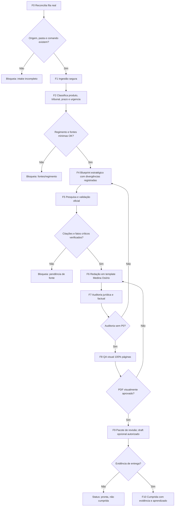

# FORJA N2 — Análise crítica e planejamento corrigido

**Data:** 2026-07-08  
**Status:** versão superior consolidada dos quatro planejamentos FORJA; originais reescritos para N2 em 2026-07-08  
**Escopo:** registrar falhas/acertos e justificar a correção aplicada ao PRD, TDD, roadmap e diagramas  
**Fontes analisadas:** `01_PRD_FORJA.md`, `02_TDD_FORJA.md`, `03_ROADMAP_FORJA.md`, `04_DIAGRAMAS_FORJA.md`  

---

## 1. Veredito executivo

Os quatro planejamentos têm uma base útil: fases F0-F10, preocupação com regimento, red team, auditoria visual, custos e modo sombra. Porém, no estado atual, **não estão prontos para implementação confiável**. O principal defeito não é falta de ambição; é excesso de promessa sem contrato operacional verificável.

O risco maior é jurídico-operacional: o plano mistura painel, Gmail, WhatsApp, IA jurídica, Word COM, pesquisa oficial e entrega ao escritório como se todos tivessem o mesmo nível de confiabilidade. Não têm. O painel é gestão; a prova está nos anexos, autos, e-mails, PDFs e fontes oficiais. A versão N2 corrige isso criando uma esteira com fonte de verdade explícita, estados bloqueantes e entrega somente com evidência.

**Decisão N2:** FORJA deve ser primeiro um harness de produção assistida, auditável e bloqueante. Só depois deve assumir automação mais agressiva. A meta correta é reduzir retrabalho e fila mental sem criar falsa segurança.

---

## 2. Acertos preservados

1. **Modelo por fases F0-F10.** A decomposição por ingestão, pesquisa, planejamento, redação, auditoria, QA visual, entrega e encerramento é aproveitável.
2. **Gates humanos.** A ideia de bloquear em plano jurídico, auditoria e entrega é correta.
3. **Regimento antes da redação.** Esse ponto é obrigatório pela regra da fábrica e deve permanecer como gate duro.
4. **Anti-alucinação como requisito, não como estilo.** O plano acerta ao tratar citação, precedente, processo, prazo e fato de autos como itens verificáveis.
5. **QA visual página a página.** A exigência de renderizar o PDF e inspecionar todas as páginas é correta e deve ser mantida.
6. **Modo sombra.** Rodar em paralelo antes de assumir produção é o caminho certo, desde que sem mover nem apagar artefatos automaticamente.
7. **Reuso de componentes existentes.** O plano acerta ao não reinventar `gestao_escritorio`, `demandas.json`, `word_visual_pipeline.py`, templates e aprendizados.
8. **Preocupação com custo.** O alerta sobre retry e orçamento é relevante, mas precisa ser recalculado com preço/modelo real no momento de execução.

---

## 3. Falhas críticas identificadas

### P0 — impedem execução segura

| Falha | Onde aparece | Correção N2 |
|---|---|---|
| Não há versão única da verdade: PRD v1.1, TDD v1.0, Roadmap v1.0, Diagramas v2.0 divergem. | Todos os documentos | Criar `FORJA_SPEC_MANIFEST.json` e tratar este N2 como fonte normativa até os originais serem atualizados. |
| WhatsApp entra no Roadmap M0, mas o TDD diz que está fora do v1.0. | Roadmap M0 vs. TDD escopo | N2 separa: WhatsApp textual pode gerar comando/demanda; áudio e transcrição ficam em backlog técnico até existir fluxo validado. |
| Google Calendar é tratado como disparador técnico. | PRD/Roadmap/Diagramas | Calendar vira lembrete humano. Execução real deve ser Codex automation, Windows Task Scheduler ou serviço local validado. |
| `cumprida` pode ser marcada por estado do painel, não por evidência de entrega. | PRD F10/TDD F10 | N2 exige e-mail enviado, anexo entregue, WhatsApp entregue ou intervenção manual documentada antes de `cumprida`. |
| Destinatário de rascunho é inconsistente: PRD usa Fábio; TDD usa Igor. | PRD F9 vs. TDD F9 | N2 remove hardcode. Usa `approvedRecipients` por demanda e cria draft somente quando autorizado. |
| Percentuais de vitória e Monte Carlo parecem precisão jurídica sem base auditável. | TDD F5B, TDD/Roadmap relatórios | N2 proíbe percentual de êxito como métrica de entrega. Permite apenas classificação qualitativa com premissas explícitas. |
| Fallback para fonte não oficial pode passar como validação. | TDD F4 fallback Google Scholar | N2 permite fontes não oficiais só para descoberta. Citação final exige fonte oficial ou arquivo-fonte arquivado. |
| Fallback `python-docx` pode violar o padrão Word do escritório. | PRD/TDD/Roadmap | N2: documento protocolável sempre parte do template ou peça anterior. Fallback degradado bloqueia entrega final, salvo autorização humana explícita. |
| Suposições sobre sandbox/CLI não estão comprovadas e há trechos corrompidos no TDD. | TDD F0/F2/custos | N2 cria adaptador validado por teste local antes de rodar em caso real. Nenhuma flag vira requisito sem prova. |

### P1 — geram retrabalho ou falsa governança

| Falha | Impacto | Correção N2 |
|---|---|---|
| Estado `FORJA_STATE.json` é citado, mas não especificado. | Cada agente pode gravar campos diferentes. | N2 define schema mínimo. |
| Critérios como "100% match" com trabalho manual são rígidos demais e mal definidos. | Pode reprovar por diferença irrelevante ou aprovar por igualdade superficial. | N2 mede estrutura, anexos, comando, prazos, evidência e ausência de perda documental. |
| Modo sombra move `_SOMBRA_M0/*` para a pasta principal. | Risco de duplicar, sobrescrever ou poluir caso. | N2 nunca move automaticamente. Produz diff e proposta de promoção. |
| `0 [VERIFICAR]` é critério final, mas o plano não separa minuta interna de peça protocolável. | Pode bloquear pesquisa útil ou deixar pendência escondida. | N2 permite `[VERIFICAR]` em fases internas; bloqueia F9/F10 enquanto existir pendência protocolável. |
| Painel remoto é citado sem contrato de campos. | Pode virar painel bonito, mas inútil para execução ou auditoria. | N2 define campos operacionais mínimos: caso, fase, P0/P1/P2, próximo passo, evidência e caminhos de artefatos. |
| Custos usam preços/modelos possivelmente desatualizados. | Fatura e expectativa ficam erradas. | N2 calcula custo real por execução e só usa estimativa como faixa revisável. |
| Ferramentas marcadas como ausentes no PRD existem na máquina. | Roadmap fica errado e bloqueia M4 sem motivo. | N2 atualiza dependências: Inkscape, Graphviz, Tectonic e Mermaid CLI estão disponíveis localmente em 08/07/2026. |

### P2 — ajustes de qualidade

| Falha | Correção N2 |
|---|---|
| Diagramas usam alguns rótulos e ícones que podem quebrar renderização ou ficarem inadequados em documento formal. | Usar ASCII nos arquivos de automação e deixar símbolos apenas em material visual final validado. |
| Roadmap mistura produto, implementação e operação diária. | Separar: especificação, execução técnica, governança e uso pelo escritório. |
| Métricas de sucesso são boas, mas faltam métricas de dano evitado. | Incluir: citações removidas, pendências detectadas, anexos faltantes, demandas não marcadas como cumpridas por falta de prova. |
| Não há owner claro por artefato. | Cada fase passa a ter saída, dono lógico e critério de bloqueio. |

---

## 4. Princípios corrigidos do FORJA N2

1. **Painel resume; comando orienta; anexo prova.** O painel nunca é prova jurídica nem prova de entrega.
2. **Fonte oficial vence conveniência.** SCON vale para STJ; STF e tribunais locais exigem portal oficial ou arquivo oficial arquivado. Jusbrasil, Google Scholar e IA são descoberta, não validação.
3. **Bloqueio é sucesso quando evita erro.** Um caso parado por falta de regimento, anexo, prazo ou citação não é falha do sistema; é proteção.
4. **Sem consenso falso.** Conselho multi-agente registra divergência real: acatado, rejeitado e motivo.
5. **Sem número persuasivo não auditável.** Probabilidade de êxito, delta percentual e "Monte Carlo jurídico" só podem aparecer como experimento interno, nunca como relatório para entrega sem metodologia validada.
6. **Entrega final exige evidência.** `pronta` significa pacote pronto para revisão; `cumprida` significa entregue/protocolada/comprovada.
7. **Comunicação vira comando operacional.** WhatsApp, e-mail, Hermes e intervenção manual entram como origem, comando, anexos, evidência ou pendência; rótulo genérico não é gate N2.
8. **Degradação explícita.** Se Gmail, SCON, Word COM ou Hermes falham, o estado vira `degraded` ou `blocked`; não vira "OK".
9. **Template primeiro.** Peça protocolável parte de `TEMPLATE_MEDINA_OSORIO_PETICAO.docx` ou de cópia da peça anterior do caso.

---

## 5. Escopo N2

### Dentro do escopo

- Reconciliar fila real do escritório com `demandas.json`, comandos, pastas e evidências.
- Rodar ingestão assistida de e-mails e comandos existentes.
- Criar inventário de caso, matriz de fontes, regimento e leis gerais.
- Gerar blueprint jurídico com discordância registrada.
- Pesquisar jurisprudência com validação oficial.
- Redigir minuta a partir de template ou peça anterior.
- Auditar fatos, citações, prazos, placeholders, regimento e diagramação.
- Gerar pacote de revisão para Igor/Fábio.
- Criar draft Gmail somente quando autorizado e com destinatário por demanda.
- Marcar demanda como cumprida somente com evidência arquivada.

### Fora do escopo N2

- Enviar e-mail automaticamente.
- Protocolar judicialmente.
- Assinar digitalmente.
- Marcar demanda cumprida com base apenas no painel.
- Transcrever áudio WhatsApp automaticamente antes de existir fluxo técnico validado.
- Transformar comunicação informal em evidência final sem arquivo, mensagem, protocolo ou intervenção manual documentada.
- Usar probabilidade numérica de vitória como promessa de qualidade.
- Atualizar regimento por resumo; regimento precisa de texto integral e metadados.

---

## 6. Arquitetura N2 corrigida

### Camadas

1. **Gestão operacional**
   - `gestao_escritorio/data/demandas.json`
   - `intervencoes_manuais.json`
   - `status_integracoes.json`
   - painel local em `127.0.0.1:8765`

2. **Caso jurídico**
   - pasta do caso
   - `COMANDO_DO_EMAIL.md`, `COMANDO_DO_WHATSAPP.md` ou `COMANDO_MANUAL.md`
   - anexos, autos, PDFs, DOCX, regimento, leis, relatórios, QA

3. **Harness FORJA**
   - `_FORJA_HARNESS/state/<caseId>/FORJA_STATE.json`
   - logs e checkpoints
   - adaptadores para Gmail/gws, Hermes sanitizado, pesquisa oficial, Word COM e QA visual

4. **Entrega e evidência**
   - pacote final local
   - draft opcional
   - evidência arquivada em `gestao_escritorio/entregas_fabio_osorio`
   - comentário manual vinculado à demanda quando necessário

### Fonte de verdade por tipo

| Tipo de informação | Fonte de verdade |
|---|---|
| Status da fila | `demandas.json` + `intervencoes_manuais.json` |
| Existência de demanda | comando + pasta + entrada no painel |
| Fato jurídico | anexo/autos/PDF/DOCX/fonte oficial |
| Tribunal/regimento | número CNJ, endereçamento, decisão e `REGIMENTO_INTERNO_<TRIBUNAL>.md` |
| Entrega | e-mail enviado, WhatsApp entregue, protocolo, anexo arquivado ou intervenção manual documentada |
| Custo | log real por fase, não estimativa fixa |

---

## 7. Schema mínimo N2

### Extensão em `demandas.json`

```json
{
  "id": "demanda-...",
  "status": "aberta",
  "forja": {
    "version": "N2.0",
    "enabled": true,
    "caseId": "case-...",
    "phase": "F3_FONTES_REGIMENTO",
    "phaseStatus": "blocked",
    "caseFolder": "C:/Users/IgorPC/.../Nome do caso",
    "commandFile": "COMANDO_DO_EMAIL.md",
    "approvedRecipients": [],
    "blockedReasons": [
      {
        "code": "REGIMENTO_AUSENTE",
        "severity": "P0",
        "detail": "Regimento do tribunal não encontrado na pasta."
      }
    ],
    "deliveryEvidence": {
      "status": "none|draft_created|sent_confirmed|manual_override",
      "path": null,
      "confirmedAt": null
    },
    "costs": {
      "budgetUsd": null,
      "actualUsd": null,
      "requiresApproval": false
    }
  }
}
```

### `FORJA_STATE.json`

```json
{
  "caseId": "case-...",
  "specVersion": "N2.0",
  "createdAt": "2026-07-08T00:00:00-03:00",
  "updatedAt": "2026-07-08T00:00:00-03:00",
  "currentPhase": "F3_FONTES_REGIMENTO",
  "status": "blocked",
  "inputs": {
    "demandId": "demanda-...",
    "caseFolder": "C:/...",
    "commandFile": "COMANDO_DO_EMAIL.md"
  },
  "phaseHistory": [],
  "artifacts": [],
  "gates": [],
  "sourceLedger": [],
  "deliveryEvidence": null,
  "costLog": []
}
```

### Ledger de fontes

Cada afirmação crítica deve caber em uma destas classes:

- `[FONTE: arquivo]`
- `[FONTE: oficial]`
- `[DECLARAÇÃO DO ESCRITÓRIO/CLIENTE]`
- `[INFERÊNCIA]`
- `[HIPÓTESE ESTRATÉGICA]`
- `[NÃO VERIFICADO]`

Regra: `[NÃO VERIFICADO]` pode existir em artefato interno, mas bloqueia peça final, draft e marcação como pronta.

---

## 8. Fases N2 corrigidas

### F0 — Vigília e reconciliação da fila

**Objetivo:** saber o estado real antes de agir.  
**Entrada:** `demandas.json`, `status_integracoes.json`, comandos, pastas e evidências.  
**Execução:** atualizar painel, detectar novas demandas, classificar integrações como `ok`, `degraded`, `needs_login` ou `offline`.  
**Correção principal:** Calendar não executa automação; ele lembra. A execução vem de rotina Codex/agendador/serviço local validado.  
**Gate:** nenhuma demanda nova entra como confiável se origem, pasta ou comando estiverem ausentes.

### F1 — Ingestão segura

**Objetivo:** criar ou reconciliar uma demanda sem perder contexto.  
**Saídas:** pasta, comando, anexos, hash/lista de anexos, entrada no painel.  
**Regras:** não sobrescrever pasta existente; não consolidar duas pastas CASO-02 apagando uma; deduplicar por `threadId`, assunto, processo e anexos.  
**Gate:** anexos esperados ausentes viram pendência explícita.

### F2 — Classificação do produto e risco

**Objetivo:** decidir o tipo de trabalho antes de aplicar molde jurídico.  
**Classificações:** petição, memorial, embargos, parecer, laudo, proposta, administrativo.  
**Campos obrigatórios:** tribunal provável, prazo, urgência, produto esperado, destinatário de revisão, pasta, anexos esperados e evidência mínima para avançar.  
**Gate:** produto indefinido, tribunal indefinido quando necessário, pasta ausente, comando ausente ou anexos esperados não mapeados.

### F3 — Fontes, regimento e leis gerais

**Objetivo:** bloquear redação sem base normativa.  
**Execução:** identificar tribunal, ler `REGIMENTO_INTERNO_<TRIBUNAL>.md`, conferir metadados, emendas posteriores e `_LEIS_GERAIS`.  
**Saídas:** `F3_MAPA_FONTES_E_REGIMENTO.md` e `sourceLedger`.  
**Gate P0:** regimento ausente, incompleto ou sem metadados bloqueia F4/F6 até correção.

### F4 — Mapa do caso e estratégia

**Objetivo:** transformar documentos em plano jurídico.  
**Execução:** separar fatos documentais, declarações, inferências, hipóteses e lacunas. Rodar conselho multi-agente quando fizer sentido.  
**Saída:** `F4_BLUEPRINT_ESTRATEGICO.md`.  
**Correção principal:** divergências entre personas são registradas; Helena não "aplana" discordância para consenso falso.  
**Gate:** plano precisa dizer o que entra, o que sai, por quê e quais lacunas podem matar protocolo.

### F5 — Pesquisa externa com validação oficial

**Objetivo:** encontrar e validar precedentes.  
**Execução:** usar buscas e skills como descoberta; validar em fonte oficial antes de citação.  
**Saídas:** `F5_JURISPRUDENCIA_VERIFICADA.md` e `F5_CITACOES_REMOVIDAS.md`.  
**Gate P0:** precedente não localizado em fonte oficial não entra como citação final. Pode virar hipótese ou pendência.

### F6 — Redação a partir de template

**Objetivo:** produzir minuta forte sem quebrar padrão do escritório.  
**Execução:** copiar template ou peça anterior; redigir com blueprint, ledger de fontes e padrão Medina Osório.  
**Visual law:** só entra se resolver cronologia, fluxo, matriz prova-argumento, contradição ou pedido.  
**Gate:** nenhum documento protocolável nasce de `Document()` vazio.

### F7 — Auditoria jurídica e factual

**Objetivo:** remover erro antes do pacote visual.  
**Checks obrigatórios:** citações, fatos, prazos, premissas, anexos mencionados, regimento, leis gerais, placeholders, metadados sensíveis.  
**Saídas:** `F7_RELATORIO_AUDITORIA.md`, `CHECKLIST_FONTES_E_PENDENCIAS.md`.  
**Gate:** qualquer P0 volta para F4/F5/F6, não segue como "pronto com ressalva".

### F8 — QA visual

**Objetivo:** confirmar que o PDF final realmente ficou íntegro.  
**Execução:** Word COM para PDF, render de 100% das páginas, inspeção de timbre, fólio, rodapé, margens, fontes, diagramas e sobreposição.  
**Dependências verificadas em 08/07/2026:** Inkscape, Graphviz, Tectonic e Mermaid CLI existem localmente; ImageMagick não foi localizado no `PATH` nesta checagem.  
**Gate:** PDF final só é aprovado com evidência de inspeção página a página.

### F9 — Pacote de revisão e draft opcional

**Objetivo:** entregar para Igor/Fábio revisar, não enviar automaticamente.  
**Saídas:** DOCX, PDF, relatório, checklist e preview visual.  
**Draft Gmail:** opcional, depende de autorização e `approvedRecipients`.  
**Gate:** `pronta_para_revisao` não é `cumprida`.

### F10 — Reconciliação, entrega e aprendizado

**Objetivo:** fechar o ciclo sem mentira operacional.  
**Execução:** arquivar evidência de envio/protocolo/entrega, salvar final, registrar feedback, atualizar painel.  
**Gate para `cumprida`:** evidência real ou intervenção manual documentada.  
**Saídas:** `F10_DOCUMENTACAO_FINAL/`, `DIFF_ORIGINAL_VS_FINAL.md`, `APRENDIZADOS_DO_CASO.md`, atualização do painel.

---

## 9. Roadmap N2

### M0 — Travar especificação e segurança operacional

**Duração sugerida:** 2 a 4 dias.  
**Entrega:** `FORJA_SPEC_MANIFEST.json`, schema de `FORJA_STATE.json`, estados do painel e regras de evidência.  
**Critério de pronto:** os quatro documentos antigos apontam para o N2 ou estão marcados como superseded. Nenhum agente segue TDD antigo sem compatibilidade.

### M1 — Reconciliação da fila e ingestão degradável

**Duração sugerida:** 1 semana.  
**Entrega:** rotina que lê painel, comandos e pastas; classifica Gmail/Hermes como `ok/degraded/needs_login/offline`; gera pendências claras.  
**Critério de pronto:** 10 demandas reais auditadas sem criar duplicidade nem marcar cumprida sem prova.

### M2 — Gate de fontes, regimento e leis gerais

**Duração sugerida:** 1 a 2 semanas.  
**Entrega:** `F3_MAPA_FONTES_E_REGIMENTO.md` automático para casos piloto.  
**Critério de pronto:** 5 casos com tribunal identificado, regimento lido, emendas registradas e lacunas bloqueantes nominadas.

### M3 — Pesquisa oficial e ledger de citações

**Duração sugerida:** 2 semanas.  
**Entrega:** validador de citações por fonte oficial e relatório de citações removidas.  
**Critério de pronto:** 2 casos com todas as citações finais confirmadas em fonte oficial ou arquivo-fonte arquivado.

### M4 — Redação com template e visual law controlado

**Duração sugerida:** 2 a 4 semanas.  
**Entrega:** uma peça piloto DOCX/PDF usando template, sem documento vazio, com diagramas apenas quando úteis.  
**Critério de pronto:** render de todas as páginas, 0 placeholders, padrão Medina Osório preservado.

### M5 — Auditoria, entrega e fechamento com evidência

**Duração sugerida:** 1 a 2 semanas.  
**Entrega:** pacote completo de revisão e fluxo de marcação `cumprida` somente com evidência.  
**Critério de pronto:** uma demanda piloto vai de aberta a cumprida com trilha completa: comando, fontes, minuta, auditoria, QA, entrega e evidência.

---

## 10. Critérios de aceite N2

1. Nenhuma fase final aceita `[NÃO VERIFICADO]`, `[VERIFICAR]`, `[NOME]`, `[DATA]`, `[CRC-UF]` ou placeholder equivalente.
2. Nenhuma citação jurisprudencial entra sem fonte oficial ou arquivo oficial arquivado.
3. Nenhum regimento é aceito sem fonte, versão, data de download e seção de emendas posteriores.
4. Nenhum DOCX protocolável nasce fora do template ou de peça anterior do caso.
5. Nenhum PDF final é aprovado sem render e inspeção de todas as páginas.
6. Nenhuma demanda vira `cumprida` sem evidência de entrega.
7. Nenhuma entrada de WhatsApp, e-mail ou Hermes vira tarefa acionável sem comando, pasta e anexos esperados registrados.
8. Nenhum custo pago novo é assumido sem limite e registro.
9. Nenhum fallback degradado vira entrega final sem autorização explícita.
10. Nenhum agente pode alterar o escopo v1/v2 sem atualizar o manifest.

---

## 11. Métricas N2

### Métricas de qualidade

- Citações removidas por falta de fonte oficial.
- Fatos reclassificados de fato documental para declaração/inferência.
- Pendências bloqueantes detectadas antes de draft.
- Placeholders encontrados antes do PDF final.
- Páginas com defeito visual detectadas no render.

### Métricas operacionais

- Tempo de fila até `pronta_para_revisao`.
- Tempo parado por falta de anexo, regimento, login ou fonte oficial.
- Demandas reconciliadas como abertas, vencidas, 48h, sem resposta com peça, pendência de anexos.
- Demandas que não foram marcadas como cumpridas por falta de evidência.

### Métricas de custo

- Custo real por fase.
- Retries por fase.
- Diferença entre estimativa e custo real.
- Casos bloqueados por orçamento.

---

## 12. Diagrama N2 — fluxo corrigido



---

## 13. Decisões que substituem os quatro documentos anteriores

| Tema | Versão antiga | N2 corrigido |
|---|---|---|
| Fonte normativa | Quatro docs divergentes | Manifest + este N2 como fonte temporária |
| WhatsApp | Escopo e backlog ao mesmo tempo | Texto sanitizado no escopo; áudio fora |
| Calendar | Dispara automação | Lembrete humano; automação roda por rotina validada |
| Gmail | Draft hardcoded | Draft opcional por demanda e autorização |
| Cumprimento | Status pode avançar após envio detectado | Só com evidência arquivada |
| Jurisprudência | SCON/Google Scholar misturados | Oficial para validação; não oficial só descoberta |
| Probabilidade de vitória | Percentuais e Monte Carlo | Classificação qualitativa auditável |
| Visual law | Fallback degradado pode entregar | Fallback degradado bloqueia final se afetar padrão |
| Custos | Estimativas fixas | Custo real por fase + limite |
| Modo sombra | Pode mover para main | Nunca move; propõe promoção |

---

## 14. Próximas ações recomendadas

1. Implementar primeiro o schema de estado e a reconciliação de evidências; não começar por Claude headless.
2. Rodar piloto N2 em caso já concluído, preferencialmente CASO-04 ou Jalusa, comparando contra artefatos finais existentes.
3. Depois ligar ingestão Gmail/WhatsApp em modo sombra.
4. Só promover automação para produção quando o fechamento com evidência estiver funcionando.

**Ações já executadas em 2026-07-08:** `FORJA_SPEC_MANIFEST.json` criado; `01_PRD_FORJA.md`, `02_TDD_FORJA.md`, `03_ROADMAP_FORJA.md` e `04_DIAGRAMAS_FORJA.md` reescritos para N2.

---

## 15. Resumo para Igor

O FORJA original tem boa direção, mas ainda parece um plano de demonstração. O N2 transforma em plano operacional: menos promessa, mais prova. A diferença prática é que a máquina não pode dizer "pronto" sem fonte, não pode dizer "cumprido" sem entrega, não pode usar número bonito de vitória, não pode esconder que Gmail/WhatsApp está degradado e não pode quebrar o padrão visual do escritório por fallback técnico.

Essa versão é a base certa para implementar sem criar risco jurídico novo.
