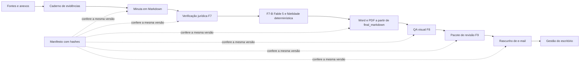
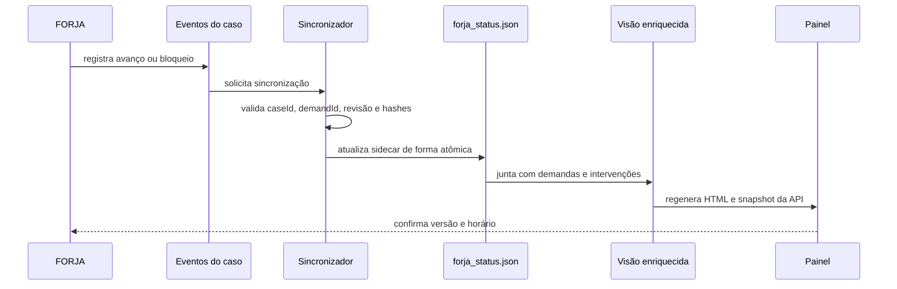
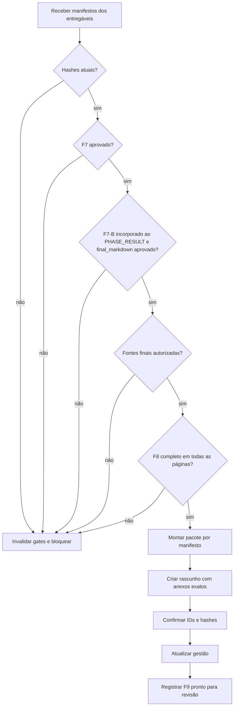

# FORJA N3 — PLANO DE INTEGRIDADE, CONTEXTO, VISUAL E GESTÃO

**Status:** proposta de implementação incremental — revisão 2  
**Revisado em:** 09/07/2026  
**Base preservada:** FORJA N2, fases F0–F10, Helena, Cícero, red team, verificadores, template Medina Osório, Word COM, SVG→EMF, Gmail em rascunho e revisão humana.  
**Auditoria de origem:** `../reports/AUDITORIA_COMPLETA_FORJA_5_6_2026-07-09.md`

---

## 1. Objetivo da N3

A FORJA N3 não substitui a N2. Ela acrescenta uma camada de integridade para garantir que:

1. cada fase avance por transição válida;
2. todo fato e fundamento importante preserve sua fonte e página;
3. o arquivo auditado seja exatamente o arquivo diagramado e anexado;
4. nenhuma peça final avance com fonte não autorizada;
5. nenhuma página seja aprovada apenas porque foi renderizada;
6. todo ciclo atualize automaticamente o sistema de gestão;
7. o painel mostre onde a FORJA rodou, onde não rodou, onde parou e por quê;
8. versões antigas continuem disponíveis e recuperáveis.

**Nome proposto:** FORJA N3 — Integridade Operacional e Visual.

## 1.1 Correções incorporadas na revisão 2

A primeira versão do plano ainda deixava sete ambiguidades que poderiam recriar os problemas auditados. Esta revisão as resolve antes da implementação:

1. a FORJA **não escreverá diretamente** em `demandas.json`, porque esse arquivo é reconstruído por Gmail, WhatsApp, tarefas manuais e enriquecimentos locais;
2. a gestão receberá os estados da FORJA em uma base lateral própria, unida ao painel somente na leitura/renderização;
3. eventos terão sequência, revisão esperada, chave de idempotência e recuperação após interrupção;
4. fase processual, estado do ciclo e situação dos gates serão dimensões separadas;
5. o QA anterior à revisão humana será realizado por inspeção independente do gerador, sem o campo enganoso `humanReview`;
6. a fidelidade não será medida apenas entre Markdown e DOCX: haverá correspondência parágrafo→fato/fonte e comparação MD→DOCX→PDF;
7. links de artefatos no painel serão abertos pelo servidor local por `artifactId`, evitando caminhos `file:///` quebrados por espaços, acentos ou políticas do navegador.

## 1.2 Limites da versão

A N3 não pretende:

- automatizar envio ou protocolo;
- substituir a decisão jurídica de Fábio, Igor ou do advogado responsável;
- transformar todo caso legado para o novo formato de uma vez;
- usar resumo como substituto do documento original;
- criar uma infraestrutura distribuída desnecessária;
- misturar atualização da FORJA com coleta de Gmail, WhatsApp ou agenda.

---

## 2. Princípio central

O novo fluxo terá uma única cadeia de identidade:



Se qualquer arquivo mudar, os gates posteriores ficam vencidos e precisam ser refeitos. Não haverá “QA aprovado” para um PDF diferente daquele que foi anexado.

---

## 3. Arquitetura incremental

## 3.1 Novos artefatos canônicos por caso

Cada `state/case-*/` passará a poder conter, sem invalidar os arquivos antigos:

| Arquivo | Finalidade |
|---|---|
| `FORJA_CASE_MANIFEST.json` | identidade do caso, demanda, versão, execução e estado derivado |
| `events/000001-<eventId>.json` | evento canônico e imutável, gravado atomicamente; nenhuma fase apaga a anterior |
| `FORJA_EVENTS.jsonl` | exportação reconstruível para leitura e auditoria; não é a fonte primária de escrita |
| `F1_DOCUMENT_INDEX.json` | inventário de anexos com hash, tipo, páginas e status de leitura |
| `F1_COVERAGE.json` | páginas/partes efetivamente lidas, falhas de extração e releituras exigidas |
| `F3_FACT_LEDGER.json` | fatos, fonte, página, grau de certeza e uso permitido |
| `F3_CHRONOLOGY.json` | cronologia canônica e conflitos de datas |
| `F3_CONTRADICTIONS.json` | versões incompatíveis, lacunas e perguntas abertas |
| `F4_PROPOSITION_LEDGER.json` | proposições jurídicas aprovadas para redação |
| `F6_PARAGRAPH_PROVENANCE.json` | vínculo entre parágrafos da minuta, fatos, fontes e proposições jurídicas |
| `F7_GATE_RESULT.json` | veredito jurídico agregado por artefato e por pacote |
| `FABLE5_RESULT.json` | fragmento editorial a incorporar ao resultado completo F7; não substitui `PHASE_RESULT.json` |
| `editorial_fidelity.json` | hashes e invariantes recompostos entre `audited_markdown` e `final_markdown` |
| `F8_QA_LEDGER.json` | inspeção de todas as páginas e diagramas |
| `FORJA_PACKAGE.json` | arquivos finais, função, hashes e anexos do rascunho |
| `F10_DELIVERY_EVIDENCE.json` | evidência estruturada de revisão/envio/protocolo |

O `FORJA_STATE.json` continuará existindo durante toda a migração. Na N3 ele vira uma visão de compatibilidade gerada a partir dos eventos, não um arquivo que qualquer etapa pode sobrescrever livremente.

## 3.2 Estado derivado, não atribuído

Novo módulo proposto: `_FORJA_HARNESS/forja_state_machine.py`.

Responsabilidades:

- validar a transição solicitada;
- registrar `eventId`, `eventSeq`, `idempotencyKey`, `runId`, `attemptId`, horário, fase, resultado e motivo;
- impedir regressão silenciosa;
- permitir reabertura explícita de um gate;
- calcular fase, ciclo, gates, bloqueadores e próxima ação em campos separados;
- gravar de forma atômica;
- rejeitar escrita quando a revisão esperada estiver desatualizada;
- recuperar a visão materializada a partir dos eventos após interrupção;
- manter compatibilidade com estados N2.

### 3.2.1 Modelo de estado em três dimensões

Um único campo `status` não é suficiente. A N3 separará:

| Dimensão | Exemplos | Pergunta respondida |
|---|---|---|
| `phaseCursor` | `F5`, `F7`, `F9` | em qual etapa o ciclo está trabalhando? |
| `lifecycleStatus` | `running`, `blocked`, `ready_for_review`, `sent_confirmed` | qual é a situação operacional do caso? |
| `gateStatus` | `f7=pass`, `f8=stale`, `citations=blocked` | quais aprovações continuam válidas? |

Assim, uma pesquisa reaberta depois de F9 pode produzir `phaseCursor=F5`, `lifecycleStatus=blocked` e `f8=stale` sem apagar que F9 já ocorreu em uma tentativa anterior.

### 3.2.2 Contrato mínimo do evento

```json
{
  "schemaVersion": 1,
  "eventId": "evt-uuid",
  "eventSeq": 42,
  "idempotencyKey": "caseId:runId:F7:attempt2:completed",
  "caseId": "case-...",
  "demandId": "email-...",
  "runId": "run-...",
  "attemptId": "attempt-...",
  "expectedRevision": 41,
  "type": "phase_completed",
  "phase": "F7_AUDITORIA",
  "result": "pass",
  "artifactHashes": {},
  "at": "ISO-8601",
  "actor": "forja-auditor"
}
```

Regras de concorrência e recuperação:

- somente um escritor mantém o lock curto do caso;
- `expectedRevision` diferente da última sequência reprova a escrita, sem sobrescrever trabalho alheio;
- repetir a mesma `idempotencyKey` devolve o evento existente;
- cada evento é criado em arquivo temporário e promovido por rename atômico;
- arquivo parcial nunca entra em `events/`;
- `FORJA_STATE.json`, JSONL e sincronização são reconstruíveis a partir dos eventos;
- lock abandonado possui expiração e somente é retomado depois de confirmar que não há escritor ativo;
- duas IAs podem ler e produzir artefatos paralelamente, mas a promoção de fase passa pelo escritor canônico.

Estados operacionais recomendados:

| Estado | Significado |
|---|---|
| `not_run` | a demanda não passou pela FORJA |
| `queued` | apta, aguardando início |
| `running` | existe fase em execução |
| `blocked` | impedimento concreto identificado |
| `ready_for_review` | pacote íntegro disponível para revisão humana |
| `draft_awaiting_review` | rascunho Gmail criado, sem envio confirmado |
| `sent_confirmed` | envio humano confirmado por evidência |
| `fulfilled_by_forja_f10` | ciclo encerrado com trilha completa |
| `fulfilled_by_reconciliation` | cumprimento anterior reconhecido por reconciliação |
| `superseded` | estado substituído por caso canônico |

### Regra de reabertura

Se uma pesquisa posterior encontrar problema após F9:

- F9 continua registrado como tentativa concluída;
- é criado evento `gate_reopened` para F5/F7;
- o estado vira `blocked` ou `running`;
- o rascunho e o QA anterior ficam `stale`;
- a fase atual não volta silenciosamente para F5.

## 3.3 Manifesto do pacote

`FORJA_PACKAGE.json` será a lista definitiva do que saiu da FORJA.

Campos mínimos:

```json
{
  "caseId": "case-...",
  "runId": "run-...",
  "createdAt": "ISO-8601",
  "status": "ready_for_review",
  "deliverables": [
    {
      "id": "peca-principal",
      "role": "protocolavel",
      "md": {"path": "...", "sha256": "..."},
      "docx": {"path": "...", "sha256": "..."},
      "pdf": {"path": "...", "sha256": "..."},
      "f7ResultSha256": "...",
      "f8ResultSha256": "..."
    }
  ],
  "draft": {
    "draftId": "...",
    "threadId": "...",
    "attachmentHashes": []
  }
}
```

Papéis permitidos:

- `protocolavel`;
- `memorando_interno`;
- `estudo_estrategico`;
- `parecer`;
- `anexo_visual`;
- `resposta_email`;
- `material_apoio`.

O papel do arquivo não basta para decidir o gate. Cada entregável terá também `audience` e `releasePolicy`:

| Política | Exemplos | Regra de fontes e pendências |
|---|---|---|
| `strict_protocol` | petição, memorial, representação pronta para uso | zero fonte não conferida, zero placeholder, zero pendência material |
| `decision_support` | estudo e parecer encaminhados a Fábio/Igor | pendência permitida somente se rotulada no próprio documento e no e-mail |
| `internal_working` | blueprint, red team, notas de leitura | pode conter hipóteses, sempre com classificação e sem aparência de peça final |

O texto do e-mail será gerado a partir do manifesto e dos gates. Ele não poderá afirmar “todas as fontes conferidas” quando existir qualquer pendência em um entregável anexado.

## 3.4 Matriz de fontes de verdade

| Informação | Fonte canônica | Visões derivadas |
|---|---|---|
| evento e avanço de fase | `events/*.json` | `FORJA_STATE.json`, JSONL, painel |
| fato jurídico | `F3_FACT_LEDGER.json` + documento original | minuta, relatório, auditoria |
| validade da fonte | ledger de fontes/F5 | F7, pacote, e-mail |
| arquivo entregue | `FORJA_PACKAGE.json` por hash | draft Gmail, painel |
| QA visual | `F8_QA_LEDGER.json` vinculado ao hash do PDF | pacote, painel |
| demanda do escritório | `demandas.json` | painel enriquecido |
| intervenções humanas | `intervencoes_manuais.json` | painel enriquecido |
| execução da FORJA no painel | `forja_status.json` | snapshot HTML/API |
| envio/protocolo | `F10_DELIVERY_EVIDENCE.json` + identificador externo | estado e painel |

Nenhuma visão derivada pode ser usada para reescrever sua própria fonte canônica.

---

## 4. Continuidade de contexto sem perda de sentido

## 4.1 Correção da premissa

Contexto longo continuará sendo usado, mas não será tratado como garantia de leitura uniforme. A N3 adotará **contexto longo com cadernos de evidência por fase**.

Não se propõe banco vetorial complexo. Os próprios arquivos do caso serão a base; a melhoria é organizar a passagem de informação.

## 4.2 Unidade mínima: afirmação com lastro

Cada fato decisivo deve carregar:

- `factId` estável;
- texto da afirmação;
- entidade envolvida;
- data/período;
- `sourceId`;
- página/evento;
- trecho de apoio;
- classificação: comprovado, declarado, inferido, conflitante ou não verificado;
- uso permitido na peça;
- agente que extraiu;
- agente que confirmou.

## 4.3 Pacotes de entrada por fase

| Fase | Recebe obrigatoriamente |
|---|---|
| F1 | anexos originais + índice documental |
| F2 | comando + resumo do índice + limitações materiais |
| F3 | fatos, cronologia, contradições e acesso aos originais |
| F4 | caderno F3 + objetivo jurídico + pareceres Helena/Cícero |
| F5 | proposições que exigem fonte oficial |
| F6 | blueprint aprovado + proposition ledger + fatos autorizados + mapa parágrafo→lastro |
| F7 | minuta + ledgers + originais apontados |
| F8 | arquivos exatos aprovados em F7 |
| F9 | somente arquivos com F7/F8 válidos e hashes atuais |
| F10 | pacote, evidência externa e registro de aprendizado |

## 4.4 Limites operacionais

- documento grande é indexado por partes e páginas;
- cada leitor registra intervalo lido, método, falha de extração e cobertura do documento;
- resumo nunca substitui o acesso ao original;
- o redator recebe os fatos/proposições aprovados e pode reabrir a fonte;
- o auditor recebe a peça e os originais, não apenas o resumo do redator;
- trecho sem origem preservada não pode virar fato comprovado por repetição entre agentes;
- cada parágrafo argumentativo recebe IDs laterais de fatos/proposições, mantidos fora do texto visível da peça;
- nenhuma fase recebe artefatos de outro caso sem declaração explícita;
- nome das partes, número do processo e cliente formam um `caseNamespace`.

## 4.5 Gate contra contaminação entre casos

Novo teste `forja_case_isolation.py`:

- cria lista de entidades esperadas do caso;
- varre peça, relatório, e-mail e manifesto por nomes exclusivos de outros casos;
- sinaliza referência estrangeira;
- permite modelos e citações comuns por whitelist;
- bloqueia F9 se houver entidade externa sem justificativa.

Isso capturaria “LIBRA SUL” no relatório Azimut.

## 4.6 Cobertura, compressão e estouro de contexto

Cada execução registrará:

- quantidade de páginas disponíveis e efetivamente cobertas;
- páginas sem texto, OCR duvidoso ou leitura visual pendente;
- itens deliberadamente excluídos e justificativa;
- tamanho do pacote entregue a cada agente;
- checkpoint de continuidade antes de trocar de agente ou resumir contexto;
- fatos descartados por conflito, duplicidade ou irrelevância.

Quando um pacote ultrapassar o limite operacional definido para a fase, ele será dividido por documento ou questão jurídica, nunca cortado no meio sem ledger. A conclusão só pode ser agregada quando `F1_COVERAGE.json` comprovar que todos os intervalos obrigatórios foram processados.

## 4.7 Fidelidade semântica entre formatos

A N3 terá três comparações complementares:

1. **origem→minuta:** parágrafos decisivos apontam para fatos/proposições autorizados;
2. **Markdown→DOCX:** títulos, parágrafos, listas, tabelas, citações e notas preservam seus `blockId`;
3. **DOCX→PDF:** texto extraído, ordem dos blocos, páginas e elementos visuais correspondem ao documento renderizado.

Mudança de redação é permitida; perda de proposição, inversão de sentido, retirada de ressalva ou alteração numérica é bloqueadora. O relatório de fidelidade mostrará diferenças materiais, não apenas porcentagem genérica de cobertura.

---

## 5. Gates jurídicos N3

## 5.1 Gate F5 — fonte utilizável

Para artefatos `protocolavel`:

- toda jurisprudência, súmula, tema, regimento e citação literal deve possuir fonte;
- `finalUseAllowed` deve ser `true`;
- `citacoesNaoConferidas` deve ser vazio;
- a fonte deve ter hash ou URL oficial + data de consulta;
- duplicatas de fonte devem ser consolidadas por identificador canônico.

## 5.2 Gate F7 — conteúdo

F7 passa somente se, por artefato:

- `p0 == 0`;
- personas obrigatórias presentes quando aplicáveis;
- citações finais conferidas;
- fatos decisivos apontam para `factId` autorizado;
- nenhum placeholder proibido;
- nenhuma entidade estrangeira inexplicada;
- relatório e arquivo têm hashes correspondentes.

P1 pode existir em `internal_working`. Em `decision_support`, ele precisa aparecer de forma inteligível no próprio documento e no e-mail. Em `strict_protocol`, deve ser classificado como:

- `aceito_para_revisao_humana` com justificativa; ou
- `bloqueador_de_protocolo`.

Mesmo quando aceito para revisão humana, um P1 material impede o rótulo “pronto para protocolo”. Não haverá um P1 genérico que desaparece no fechamento.

### 5.2-A Gate F7-B — texto final canônico

Para tentativas F7 novas, zero P0 é pré-condição, não conclusão do conteúdo textual. O operador executa `forja_fable5.py` de forma controlada dentro da tentativa; `forja_run.py` não faz essa chamada automaticamente. O editor usa `claude-fable-5` pela autenticação OAuth Claude Max, sem API key, e produz uma candidata exclusivamente editorial.

`forja_editorial_fidelity.py` recompõe hashes, evidência de modelo/autenticação e invariantes sem confiar na autocertificação do modelo. São bloqueantes alterações de números, datas, valores, autoridades, marcadores processuais, citações, marcadores de ressalva/auditoria, títulos, pedidos, fecho ou origem operacional, bem como retenção inferior ao mínimo e P0 de estilo humano. O editor também não pode mudar tese, estratégia, prova, conclusão, condicionante ou prequestionamento.

O executor admite três candidatas internas no total — a inicial e até dois retries —, sempre do `audited_markdown` original. Essas candidatas não se confundem com as até quatro tentativas externas da fase F7, que continuam isoladas em diretórios de tentativa. Após aprovação, `final_markdown` é o cânone de F8/F9 e `audited_markdown` permanece na trilha.

## 5.3 Gate F9 — pacote

F9 não cria rascunho se:

- qualquer entregável protocolável estiver com fonte não conferida;
- F7/F8 estiverem vencidos por mudança de hash;
- algum arquivo listado não existir;
- o anexo escolhido não for o arquivo do manifesto;
- `EMAIL_RESPOSTA.txt`/equivalente canônico não existir;
- o conjunto de anexos divergir do pacote.

## 5.4 Gate F10 — evidência

Evidência válida deve ser estruturada:

- tipo: e-mail, protocolo, WhatsApp, arquivo entregue ou reconciliação;
- identificador externo ou caminho existente;
- horário;
- responsável;
- hash quando houver arquivo;
- vínculo com `caseId` e `packageSha256`.

Texto livre continua como observação, não como prova suficiente isolada.

---

## 6. QA visual N3

## 6.1 Separar geração, inspeção e aprovação

Três resultados diferentes:

1. `rendered`: PDF virou imagens;
2. `lint_passed`: verificações geométricas e textuais passaram;
3. `independent_review_passed`: todas as páginas foram examinadas e registradas por agente/revisor diferente do gerador.

Somente os três juntos produzem `F8: approved`.

Essa aprovação é **pré-revisão humana**. Ela significa que a FORJA considera o pacote visualmente íntegro para ser entregue a Fábio/Igor, não que o responsável humano aprovou o mérito ou autorizou protocolo.

Regras de independência:

- o gerador não pode aprovar o próprio PDF;
- a identidade do revisor e a execução ficam registradas;
- o revisor recebe o PDF final e o mapa de expectativas, não a justificativa de que “já está correto”;
- achado exige correção, nova renderização e nova revisão das páginas afetadas;
- alteração que muda paginação invalida a revisão de todas as páginas posteriores.

## 6.2 Validador SVG V2

Novo módulo proposto: `_FERRAMENTAS/medina_visual_lint.py`.

Verificações obrigatórias:

- XML válido;
- enums válidos para `font-weight`, `font-style` e `text-anchor`;
- fonte mínima no tamanho final;
- texto dentro do `viewBox`;
- texto dentro do cartão ao qual pertence;
- texto sem colisão com outro texto;
- formas opacas sem cobrir conteúdo relevante;
- conectores sem atravessar rótulos;
- padding mínimo;
- legenda e número de figura coerentes;
- nenhuma caixa com texto truncado;
- relação de contraste mínima para leitura.

O cálculo será determinístico por bounding boxes sempre que o SVG permitir. O render final continuará sendo examinado porque Word/EMF pode introduzir diferenças.

O validador não tratará toda interseção como erro. Caixas, fundos e textos terão papéis explícitos no SVG (`data-role`, `data-container-id`), permitindo distinguir conteúdo legitimamente contido de uma forma opaca que cobre outro bloco. Diagramas legados sem metadados rodam com heurística e revisão independente obrigatória.

## 6.3 Parser Markdown visual

Correções em `forja_visual.py`:

- reconhecer H1–H6;
- tratar blockquotes `>` de forma própria;
- remover gramática Markdown que não deve aparecer;
- preservar listas, tabelas e notas;
- dimensionar colunas de tabela por conteúdo, não por divisão igual fixa;
- validar numeração de figuras;
- impedir legenda dupla;
- substituir o gate de cobertura parcial por comparação estrutural de blocos.

## 6.4 Cobertura de conteúdo V2

O gate atual usa linhas acima de 60 caracteres e os primeiros 150 caracteres. O novo gate deve comparar:

- títulos;
- parágrafos;
- itens de lista;
- linhas de tabela;
- citações;
- notas;
- marcadores especiais.

Cada bloco recebe `blockId` e hash normalizado. Exclusões só podem ocorrer por ID explícito no mapa, nunca por substring genérica.

## 6.5 Ledger página a página

Exemplo de `F8_QA_LEDGER.json`:

```json
{
  "pdfSha256": "...",
  "pageCount": 31,
  "pages": [
    {
      "page": 1,
      "imageSha256": "...",
      "lint": "pass",
      "independentReview": {
        "status": "pass",
        "reviewer": "forja-visual-auditor",
        "runId": "run-...",
        "reviewedAt": "ISO-8601"
      },
      "findings": []
    }
  ],
  "approved": true
}
```

Se o PDF mudar, o ledger fica automaticamente vencido.

## 6.6 Regressões visuais obrigatórias

Transformar os defeitos reais em fixtures:

| Fixture | Deve reprovar por |
|---|---|
| Natura p. 10 | sobreposição de degraus + legenda duplicada |
| Libra Sul p. 9 | caixa opaca cobrindo rótulos |
| Patrícia/Fábio p. 6 | colisões e total oculto |
| CORSAN p. 3 | overflow horizontal dos cartões |
| CORSAN p. 15 | rótulos sobrepostos à timeline |
| Libra Sul p. 12 | `####` literal |
| SVG Azimut/Natura/Patrícia | atributos inválidos |

Essas páginas não devem ser apenas corrigidas; devem virar testes para que o mesmo erro não retorne.

## 6.7 QA em quatro camadas

| Camada | Verifica |
|---|---|
| 1. Fonte | Markdown vazado, estrutura, tabelas, legendas, placeholders |
| 2. Vetor | SVG/XML, geometria, caixas, conectores, atributos e fontes |
| 3. Documento | estilos Word, cabeçalho/rodapé, fólio, quebras, tabelas, páginas em branco |
| 4. Render final | sobreposição, clipping, texto ilegível, ordem visual e fidelidade PDF |

Também serão bloqueadores:

- cabeçalho ou rodapé ausente/inconsistente;
- número de página duplicado, cortado ou deslocado;
- linha órfã de título no fim da página;
- tabela partida de forma ilegível;
- página em branco não intencional;
- nota lateral colidindo com corpo ou fólio;
- figura afastada do argumento que deveria explicar;
- densidade que torne o texto pequeno apesar de cumprir nominalmente 8 pt.

---

## 7. Integração com a gestão do escritório

## 7.1 Papel de `ABRIR_GESTAO_ESCRITORIO.html`

O lançador será preservado. Ele continuará abrindo:

- painel vivo local;
- snapshot local;
- versão móvel, quando disponível.

A integração será feita na camada de dados e no servidor, não no lançador.

## 7.2 Sincronizador file-first

Novo módulo proposto: `gestao_escritorio/scripts/sync_forja_gestao.py`.

Motivo da escolha file-first:

- funciona mesmo com o servidor local fechado;
- evita perder atualização por indisponibilidade temporária;
- usa gravação atômica já praticada no painel;
- pode ser chamado pelo fluxo e pelo servidor;
- permite replay e auditoria.

### Decisão de propriedade dos dados

O sincronizador **não altera `demandas.json`**. A rotina atual `update_dashboard_local.ps1` reconstrói esse arquivo e depois aplica `intervencoes_manuais.json`; inserir a FORJA nele criaria disputa de escrita e risco de perda no próximo refresh.

Serão usados dois sidecars:

| Arquivo | Conteúdo |
|---|---|
| `gestao_escritorio/data/forja_status.json` | última visão materializada da FORJA por `demandId` |
| `gestao_escritorio/data/forja_case_links.json` | vínculo explícito entre demanda e caso, incluindo casos substituídos ou reconciliados |

`render_dashboard.py` e a API carregarão `demandas.json`, intervenções manuais e `forja_status.json`, unindo-os em memória por `demandId`. Demanda sem vínculo será exibida como `not_run`; não será necessário poluir a base de coleta com vinte blocos artificiais.

Fluxo:



Regras do sincronizador:

- vínculo primário somente por `demandId` registrado no caso;
- vínculo legado somente por entrada aprovada em `forja_case_links.json`;
- assunto, primeira palavra ou nome parecido nunca fecham associação automaticamente;
- gravação protegida por lock **entre processos** próprio do sidecar, compartilhado pela CLI e pelo servidor; o `threading.Lock` interno do servidor não é suficiente;
- atualização aceita apenas `eventSeq` maior que o já sincronizado;
- repetição da mesma sequência é idempotente;
- falha de sincronização não altera o evento do caso;
- `--reconcile` compara todos os casos com o sidecar e reaplica eventos faltantes;
- `lastSyncedEventSeq`, `lastSyncAttemptAt` e erro compacto tornam atraso visível.

O sidecar será sempre escrito em arquivo temporário, validado contra schema e promovido por rename. Leitores continuarão vendo a versão anterior completa enquanto a nova é montada.

## 7.3 Visão `forja` unida à demanda

O bloco abaixo aparece na **visão enriquecida** da demanda e no snapshot do painel. Sua fonte é `forja_status.json`, não uma mutação de `demandas.json`:

```json
{
  "forja": {
    "version": "N3.0",
    "caseId": "case-...",
    "runId": "run-...",
    "status": "draft_awaiting_review",
    "currentPhase": "F9_PACOTE_REVISAO",
    "completedPhases": ["F1", "F2", "F3", "F4", "F5", "F6", "F7", "F8", "F9"],
    "blockers": [],
    "gates": {
      "f7": "pass",
      "f8": "pass",
      "citations": "pass"
    },
    "visualQa": {"reviewed": 36, "total": 36, "status": "pass"},
    "draftId": "...",
    "artifacts": [],
    "lastEventAt": "...",
    "syncedAt": "...",
    "stale": false
  }
}
```

Para demanda que nunca passou pela FORJA:

```json
{
  "forja": {
    "version": "N3.0",
    "status": "not_run",
    "reason": "sem caso FORJA associado"
  }
}
```

Assim o painel responde à pergunta do usuário: “onde rodou ou não rodou?”.

## 7.3.1 Contrato de precedência

| Campo | Regra |
|---|---|
| `status` da demanda | coleta + override humano; FORJA não marca cumprimento por conta própria |
| `forja.lifecycleStatus` | derivado exclusivamente dos eventos FORJA |
| `proximaAcao` | painel exibe a ação manual e, separadamente, `forja.nextAction` |
| prazo | continua na gestão; data mencionada por documento permanece “a conferir” |
| evidência de envio | só muda a demanda após F10/reconciliação com identificador válido |
| comentários | resumo derivado pode ser anexado, mas não substitui o sidecar |

Isso evita que “pronta para revisão” apague uma pendência administrativa ou que uma ação manual antiga esconda o bloqueador técnico da FORJA.

## 7.4 Atualizações automáticas

Eventos que obrigam sincronização:

- caso criado;
- fase iniciada/concluída;
- bloqueio ou desbloqueio;
- parecer Helena/Cícero registrado;
- F7 aprovado/reprovado;
- F8 aprovado/reprovado;
- pacote criado;
- rascunho Gmail criado;
- envio confirmado;
- caso encerrado ou substituído.

O comentário humano-resumido pode continuar existindo, mas será gerado do evento, sem ser a única fonte do estágio.

## 7.5 Campos do painel

Para cada demanda, exibir:

- “FORJA não executada”, “em andamento”, “bloqueada”, “pronta para revisão” ou “enviada”;
- fase atual e última fase concluída;
- horário da última sincronização;
- alerta de estado desatualizado;
- P0/P1 e bloqueadores;
- fontes oficiais: conferidas/pendentes;
- QA visual: páginas revisadas/total;
- pareceres Helena e Cícero;
- links locais para pacote e artefatos;
- `draftId`/thread quando houver;
- próxima ação real;
- evidência de cumprimento.

### Links que realmente abrem

O painel não emitirá links `file:///C:/...`. Cada botão de artefato enviará `caseId` + `artifactId` ao servidor local. O servidor resolverá o caminho exclusivamente pelo `FORJA_PACKAGE.json` e então abrirá o arquivo com o aplicativo padrão do Windows ou a pasta correspondente.

Regras:

- o navegador nunca fornece um caminho livre;
- o artefato precisa existir no manifesto e ter o hash esperado;
- caminhos com espaços e acentos são resolvidos no servidor, sem montagem manual de URL;
- arquivo ausente mostra erro útil e marca o pacote como divergente;
- na versão remota/móvel, o botão local fica identificado como indisponível em vez de abrir link quebrado;
- PDFs que devam ser consultados no navegador podem ser servidos por rota autenticada do painel local, sem expor caminho físico.

## 7.6 Regra de status da demanda

- rascunho criado não marca `cumprida`;
- `ready_for_review` e `draft_awaiting_review` mantêm a demanda aberta;
- somente `sent_confirmed`, protocolo ou reconciliação comprovada podem concluir;
- mudança manual continua possível, mas deve registrar evidência estruturada;
- divergência estado/painel gera alerta e não é resolvida por suposição.

## 7.7 Endpoint opcional

Depois do sincronizador file-first estável, o servidor pode expor:

- `POST /api/forja/sync`;
- `GET /api/forja/status/<caseId>`;
- `GET /api/forja/artifacts/<caseId>`.
- `POST /api/forja/open-artifact` com `caseId` e `artifactId`;
- `POST /api/forja/open-package` com `caseId`.

As rotas chamam o mesmo módulo de sincronização; não mantêm uma segunda regra de negócio.

---

## 8. Fechamento único do ciclo

## 8.1 Executor canônico e retomável

O fechamento só será confiável se as fases anteriores também tiverem um caminho reproduzível. Novo módulo proposto: `_FORJA_HARNESS/forja_run.py`.

Ele receberá `caseId`, fase inicial opcional e feature flags. Não receberá um prompt livre capaz de ignorar o contrato. Cada fase terá especificação versionada em `phase_contracts/F0.json` a `F10.json` com:

- entradas obrigatórias e hashes;
- artefatos permitidos;
- saída esperada e schema;
- gates de promoção;
- próxima transição válida;
- política de retry;
- responsável por gerar e responsável por revisar.

Regras de execução:

- cada tentativa trabalha em `runs/<runId>/<phase>/<attemptId>/`;
- agentes escrevem apenas na pasta da tentativa;
- o executor valida e promove artefatos para o manifesto canônico;
- falha mantém a tentativa para diagnóstico e não substitui a última versão válida;
- retomada começa no último evento confirmado, sem repetir entrega ou comentário;
- retry ganha novo `attemptId` e preserva a tentativa anterior;
- nenhuma fase altera `currentPhase` diretamente;
- `forja_headless.py` poderá ser adaptado como invocador, mas não continuará sendo a autoridade do estado.

## 8.2 Fechamento F7→F10

Novo orquestrador proposto: `_FORJA_HARNESS/forja_close_cycle.py`.

Ele não redige a peça. Apenas fecha o ciclo com ordem rígida:



Não haverá outro caminho autorizado para criar rascunho de pacote FORJA.

Antes de registrar o rascunho, o fechamento calculará os hashes dos bytes efetivamente enviados como anexos. Depois da criação, armazenará `draftId`, `threadId`, nomes, tamanhos e hashes do conjunto. O rascunho é reprovado se o conjunto diferir de `FORJA_PACKAGE.json`.

## 8.3 Responsabilidades independentes

| Papel | Pode produzir | Não pode aprovar sozinho |
|---|---|---|
| leitores | extrações e caderno F1/F3 | cobertura final do próprio lote |
| Helena/Cícero | pareceres estratégicos/jurídicos | minuta final |
| redator | Markdown e mapa de proveniência | F7 |
| auditor jurídico | F7 e `audited_markdown` | texto que ele próprio redigiu |
| editor Fable 5 | candidata `final_markdown`, diff e relatório | fidelidade; aprovação vem dos gates determinísticos |
| compositor visual | DOCX/PDF/diagramas | F8 |
| auditor visual | ledger F8 | PDF que ele próprio gerou |
| fechador | pacote e draft | mérito jurídico ou visual |
| sincronizador | sidecar da gestão | status jurídico do caso |

Em contingência, uma mesma IA pode desempenhar papéis em execuções separadas, mas nunca aprovar no mesmo `runId` o artefato que acabou de gerar sem uma nova revisão independente registrada.

---

## 9. Plano de implementação seguro

## Etapa 0 — Congelamento da referência

**Mudança de comportamento:** nenhuma.

- criar inventário e hashes dos scripts atuais;
- salvar snapshot dos 21 estados e dados da gestão;
- registrar quais casos são N2, reconciliados ou legados;
- documentar a matriz de fontes de verdade e schemas antes do primeiro código;
- fixar o hash do plano e dos contratos usados em cada piloto;
- não normalizar estados antigos;
- estabelecer feature flags.

Saída: baseline reproduzível e plano de rollback.

## Etapa 1 — Testes que reproduzem os erros

**Mudança de comportamento:** nenhuma.

- corrigir `validate_f7_integration.py`;
- adicionar teste de JSON global;
- adicionar testes de regressão de fase;
- adicionar testes de duas escritas concorrentes e revisão desatualizada;
- simular interrupção entre evento, materialização e sincronização;
- adicionar teste de fonte não autorizada em F9;
- criar fixtures dos sete defeitos visuais;
- criar teste de contaminação entre casos;
- criar teste de fidelidade origem→MD→DOCX→PDF;
- criar teste de identidade de hashes;
- criar teste estado→sidecar→painel em diretório temporário;
- criar teste de abertura de artefato com espaços e acentos.

Critério: os novos testes devem falhar contra a N2 exatamente pelos problemas encontrados.

## Etapa 2 — Manifesto e máquina de estados em sombra

**Mudança de comportamento:** apenas gravação paralela, sem controlar produção.

- implementar eventos atômicos em `events/*.json` e exportação JSONL reconstruível;
- gerar `FORJA_CASE_MANIFEST.json` a partir dos estados atuais;
- comparar estado N2 e estado N3 derivado;
- emitir relatório de divergências;
- provar idempotência, lock curto e recuperação após evento parcial;
- não alterar `currentPhase` legado automaticamente.

Critério: replay dos 21 casos sem perder eventos e com divergências explícitas.

## Etapa 3 — Contexto estruturado

**Mudança de comportamento:** novos cadernos passam a acompanhar casos-piloto.

- implementar índice documental;
- fatos, cronologia e contradições;
- proposition ledger;
- mapa parágrafo→fato/proposição;
- isolamento de namespace;
- cobertura por documento/página;
- contratos de entrada e saída de F1–F7.

Critério: toda afirmação decisiva do piloto aponta para arquivo e página/evento.

## Etapa 4 — QA visual V2

**Mudança de comportamento:** o gate novo roda em sombra e compara com o atual.

- implementar lint SVG/XML;
- corrigir parser H1–H6 e blockquotes;
- implementar cobertura estrutural;
- criar ledger de páginas;
- separar compositor e auditor visual;
- validar estrutura Word e paridade textual do PDF;
- rodar nas cinco peças visual law anteriores;
- provar que os defeitos conhecidos são detectados.

Critério: nenhum dos sete defeitos passa; peças simples sem defeito continuam aprovadas.

## Etapa 5 — Sincronização com a gestão em sombra

**Mudança de comportamento:** gera arquivo de comparação, não altera painel oficial.

- implementar `sync_forja_gestao.py` e `forja_status.json` em destino temporário;
- associar `caseId` a `demandId` de forma estrita;
- gerar a visão `forja` para as 20 demandas sem alterar `demandas.json`;
- derivar `not_run` onde não houver vínculo;
- comparar próxima ação, status e evidência;
- validar replay de sequências não sincronizadas;
- validar links por `artifactId` no servidor local;
- verificar que a regeneração do painel continua funcionando.

Critério: zero alteração indevida de status e zero demanda concluída por rascunho.

## Etapa 6 — Fechamento único em piloto

**Mudança de comportamento:** ativada por feature flag em um caso escolhido.

- montar `FORJA_PACKAGE.json`;
- executar o caso pelo `forja_run.py` com contratos versionados;
- executar F7/F8 por hash;
- criar rascunho apenas pelo novo fechamento;
- sincronizar o painel;
- verificar links, IDs, bytes e hashes dos anexos;
- confirmar rollback.

Critério: pacote, draft e painel mostram os mesmos arquivos e o mesmo estado.

## Etapa 7 — Replay e promoção gradual

- replay em Azimut, CORSAN, Libra Sul, Natura, Patrícia/Fábio e Plano de Saúde;
- corrigir primeiro os módulos, não reescrever silenciosamente as peças;
- gerar relatório antes/depois;
- ativar N3 por novos casos;
- manter N2 disponível até três ciclos novos estáveis e o replay dos seis casos representativos.

---

## 10. Feature flags e rollback

Flags propostas:

```json
{
  "eventStoreV1": false,
  "stateMachineV2": false,
  "phaseRunnerV1": false,
  "contextLedgersV1": false,
  "visualGateV2": false,
  "managementSidecarV1": false,
  "forjaManagementBridge": false,
  "canonicalCloseCycle": false
}
```

Regras:

- ativação independente;
- dependências explícitas: `stateMachineV2` depende de `eventStoreV1`; fechamento depende de state machine, F7 e F8 válidos;
- default `false` até concluir etapa de sombra;
- nenhuma migração destrutiva;
- backup antes da primeira escrita em cada base;
- escrita atômica com arquivo temporário + rename;
- se a sincronização falhar, o caso continua íntegro e o painel mostra “sincronização pendente”;
- desligar `managementSidecarV1` faz o painel ignorar o sidecar sem tocar em `demandas.json`;
- rollback desliga a flag e volta ao fluxo N2 sem apagar eventos N3;
- nenhuma flag pode promover estado sozinha ao ser ligada novamente: o replay recalcula a visão e exige gates atuais.

---

## 11. Matriz de testes obrigatórios

| ID | Teste | Resultado esperado |
|---|---|---|
| ST-01 | tentar F9→F5 por atribuição direta | rejeitar; exigir `gate_reopened` |
| ST-02 | repetir evento idempotente | não duplicar fase/comentário |
| ST-03 | estado N2 sem evento | gerar visão compatível, sem alterar original |
| ST-04 | dois agentes promovem a mesma revisão | um confirma; o outro recebe conflito sem sobrescrever |
| ST-05 | interrupção após gravar evento | reconstruir estado e sincronização no replay |
| ST-06 | evento temporário/parcial | ignorar e não avançar fase |
| J-01 | `finalUseAllowed=false` em peça protocolável | bloquear F9 |
| J-02 | citação pendente em estudo interno | permitir revisão com rótulo, bloquear protocolo |
| J-03 | mudar MD após F7 | invalidar F7, F8 e pacote |
| J-04 | e-mail diz “tudo conferido” com pendência | reprovar texto do e-mail |
| CT-01 | entidade de outro caso no relatório | bloquear F9 |
| CT-02 | PDF grande segmentado | comprovar cobertura de todas as páginas |
| CT-03 | fato sem página/origem | impedir uso como fato comprovado |
| CT-04 | ressalva retirada na conversão | reprovar fidelidade semântica |
| CT-05 | número/data muda entre MD e PDF | reprovar pacote |
| V-01 | Natura p. 10 | reprovar |
| V-02 | Libra p. 9 | reprovar |
| V-03 | Patrícia p. 6 | reprovar |
| V-04 | CORSAN p. 3 e p. 15 | reprovar |
| V-05 | `####` e `>` literais | reprovar |
| V-06 | atributos SVG inválidos | reprovar |
| V-07 | PDF regenerado após inspeção | invalidar ledger |
| V-08 | gerador tenta aprovar o próprio run | rejeitar independência do QA |
| V-09 | cabeçalho, fólio ou página em branco defeituosa | reprovar estrutura Word/PDF |
| G-01 | caso avança de fase | painel atualizar em uma sincronização |
| G-02 | rascunho criado | demanda permanece aberta |
| G-03 | evidência textual sem ID/caminho | não concluir automaticamente |
| G-04 | servidor fechado | registrar e sincronizar na próxima execução |
| G-05 | demanda sem caso | mostrar `not_run` |
| G-06 | refresh Gmail regrava `demandas.json` | preservar estado FORJA no sidecar |
| G-07 | dois casos tentam atualizar o sidecar | manter ambos sem perda de atualização |
| G-08 | artefato com espaço/acento | abrir pelo `artifactId` no servidor local |
| G-09 | versão móvel tenta abrir arquivo local | informar indisponibilidade, sem link quebrado |
| PK-01 | anexo do draft difere do manifesto | bloquear fechamento |
| PK-02 | JSON inválido | falhar no gate de pacote |
| PK-03 | arquivo antigo escolhido por glob | impedir; seleção somente por ID do manifesto |
| PK-04 | retry após draft já criado | reutilizar/identificar a entrega, sem duplicar rascunho |

## 11.1 Corpus de regressão obrigatório

| Caso | Capacidade que o replay precisa provar |
|---|---|
| Azimut | isolamento entre casos, fontes pendentes e relatório sem contaminação |
| CORSAN | cartões, overflow horizontal, timeline e painel de entrega |
| Libra Sul | H4/blockquotes, sobreposição opaca e integridade de memoriais longos |
| Natura | legenda, sequência visual e colisão entre degraus |
| Patrícia/Fábio | números, percentuais, caixas, JSON válido e total visível |
| Plano de Saúde | pacote com cinco produtos, fonte não verificada, regressão F9→F5 e dez anexos |

Cada replay roda sobre cópia imutável do caso, produz relatório antes/depois e não substitui a peça histórica. O objetivo é provar o gate, não “embelezar” retroativamente o acervo.

---

## 12. Critérios de aceitação da N3

A versão só pode ser promovida quando todos os itens abaixo forem verdadeiros:

1. a visão das 20 demandas exibe estado FORJA ou `not_run` sem inserir esses dados em `demandas.json`;
2. nenhum caso sofre regressão silenciosa de fase;
3. F9 é impossível com `finalUseAllowed=false` em artefato protocolável;
4. 100% das páginas do pacote possuem revisão independente registrada no ledger F8;
5. os sete defeitos visuais conhecidos são detectados automaticamente;
6. os cinco produtos simples recentes continuam renderizando sem regressão;
7. todos os JSON da FORJA são válidos;
8. `validate_f7_integration.py` passa da raiz do workspace e da pasta harness;
9. não há entidade exclusiva de outro caso em peça, relatório ou e-mail;
10. fatos decisivos e parágrafos argumentativos possuem lastro rastreável;
11. MD, DOCX, PDF, F7, F8, pacote e anexos têm hashes e conteúdo coerentes;
12. painel atualiza pelo sidecar após cada evento relevante sem depender de comentário manual;
13. refresh de Gmail/WhatsApp e aplicação de intervenções não apagam o estado FORJA;
14. conflitos de escrita não perdem eventos nem artefatos válidos;
15. interrupção em qualquer ponto pode ser retomada sem duplicar fase, comentário ou rascunho;
16. todos os links locais de artefatos abrem por `artifactId` no painel vivo;
17. o compositor visual não consegue aprovar o próprio `runId`;
18. texto do e-mail corresponde às pendências reais do pacote;
19. rascunho nunca conclui demanda;
20. integração indisponível gera status pendente, nunca `ok` falso;
21. rollback para N2 é demonstrado em teste;
22. três ciclos novos e o replay dos seis casos representativos terminam sem divergência entre eventos, estado, pacote, Gmail e painel.

---

## 13. Definição de pronto por camada

### Estado

- transições validadas;
- eventos imutáveis, idempotentes e recuperáveis;
- concorrência sem perda de atualização;
- reabertura explícita;
- compatibilidade N2.

### Jurídico

- fontes finais autorizadas;
- fatos com lastro;
- mapa de proveniência dos parágrafos decisivos;
- Helena, Cícero e red team registrados;
- classificação clara de papel, público e política de liberação.

### Visual

- SVG válido;
- nenhuma colisão conhecida;
- nenhuma gramática Markdown vazada;
- todas as páginas revisadas por execução independente do gerador;
- estrutura Word/PDF validada;
- QA vinculado ao hash do PDF.

### Pacote

- manifesto completo;
- anexos exatos;
- e-mail canônico;
- hashes, bytes e IDs confirmados;
- retry sem duplicar rascunho.

### Gestão

- sidecar `forja_status.json` atualizado e unido à visão;
- `demandas.json` preservado como base da gestão;
- próxima ação real;
- status sem conclusão prematura;
- links por `artifactId` e evidência acessíveis;
- alerta de desatualização.

---

## 14. Ordem de construção recomendada

1. schemas, contratos de fase e baseline de rollback;
2. testes de regressão, concorrência e interrupção;
3. eventos atômicos + máquina de estados;
4. executor retomável + cadernos de contexto;
5. gate jurídico F5/F7/F9;
6. QA visual V2 independente;
7. manifesto de pacote + fechamento único;
8. sidecar e sincronizador da gestão;
9. replay dos seis casos e piloto controlado;
10. ativação gradual após três ciclos estáveis.

Essa ordem resolve primeiro as contradições que podem produzir afirmações falsas de prontidão. A aparência do painel vem depois da integridade dos dados que ele exibirá.

---

## 15. Métricas e aprendizado operacional

Cada execução produzirá `FORJA_RUN_METRICS.json` com dados suficientes para detectar degradação sem depender da memória do agente:

- duração e resultado de cada fase;
- número de tentativas e motivo dos retries;
- quantidade de documentos/páginas disponíveis e cobertos;
- tamanho dos pacotes de contexto por fase;
- falhas de extração, estouro de contexto ou interrupção;
- quantidade de fatos, contradições, fontes e pendências;
- P0/P1 por gate;
- páginas e diagramas reprovados em F8;
- tempo entre evento e sincronização do painel;
- identidade dos artefatos promovidos;
- uso/custo quando o provedor realmente fornecer esses dados, sem inventar estimativa.

Indicadores da N3:

| Indicador | Meta de promoção |
|---|---:|
| divergência evento/estado/painel | 0 |
| artefato anexado sem hash do pacote | 0 |
| página sem revisão independente | 0 |
| fonte não autorizada em `strict_protocol` | 0 |
| atualização perdida por concorrência | 0 |
| link local quebrado no painel vivo | 0 |
| defeito visual conhecido que escape ao gate | 0 |
| cobertura documental obrigatória | 100% ou bloqueio explícito |

Correções feitas por Fábio, Igor, Helena ou Cícero após a entrega serão classificadas por causa: fato, fonte, estratégia, redação, omissão, visual, prazo, pacote ou gestão. A retrospectiva só vira nova regra quando houver exemplo reproduzível e teste correspondente.

---

## 16. Riscos controlados da implementação

| Risco | Controle previsto |
|---|---|
| complexidade excessiva | arquivos JSON simples, sidecar e módulos pequenos; sem banco novo na primeira versão |
| evento duplicado | `idempotencyKey` + sequência por caso |
| duas IAs no mesmo caso | lock curto + `expectedRevision` + promoção central |
| refresh do painel apagar FORJA | sidecar separado de `demandas.json` |
| associação ao caso errado | `demandId`/registro explícito; nunca aproximação por assunto |
| falso positivo do lint visual | metadados de layout + tolerâncias + revisão independente |
| gerador autoaprovar o resultado | papéis e `runId` distintos no ledger |
| estado legado inconsistente | adaptador somente leitura + divergência explícita, sem migração em massa |
| retry duplicar Gmail | chave de idempotência e consulta do `draftId` antes de criar |
| mudança depois do QA | invalidação automática por hash e paginação |
| plano e código divergirem | `specVersion` e `specHash` registrados no manifesto de cada execução |

## 16.1 Controle de versão do próprio plano

- esta revisão 2 continua proposta e não muda o manifesto canônico N2;
- schemas e contratos terão versão própria;
- cada piloto registra o hash deste documento e dos contratos usados;
- alteração de regra durante um caso cria nova versão, não reinterpreta retroativamente eventos antigos;
- somente após os critérios da seção 12 o `FORJA_SPEC_MANIFEST.json` poderá declarar N3 como padrão;
- a promoção final exige atualização coerente de PRD, TDD, roadmap, diagramas, documentação técnica e runbook.

---

## 17. Resultado esperado

Ao final, o usuário abrirá `ABRIR_GESTAO_ESCRITORIO.html` e verá, para cada demanda:

- se a FORJA foi ou não executada;
- em que fase está;
- o que já passou nos gates;
- o que bloqueou;
- quais peças e estudos existem;
- se Helena e Cícero participaram;
- quantas páginas foram realmente revisadas;
- se há rascunho aguardando revisão;
- se houve envio/protocolo comprovado;
- qual é a próxima ação correta.

Ao mesmo tempo, a FORJA impedirá que um relatório se declare aprovado quando a página contém sobreposição, que uma fonte não verificada entre silenciosamente no pacote e que uma atualização tardia de pesquisa apague o estágio já alcançado.

---

## 18. Nota histórica de implementação posterior — F7-B (15/07/2026)

A revisão 2 deste plano nasceu antes da implementação do F7-B. O acréscimo acima registra o estado vigente sem reclassificar eventos históricos: tentativas anteriores permanecem interpretadas pelo contrato e `specHash` usados à época; tentativas novas exigem o bundle editorial.

`FABLE5_RESULT[<sufixo>].json` é deliberadamente um fragmento para mesclagem no `PHASE_RESULT.json`, pois F7 também contém auditoria jurídica, red team e artefatos adversariais. A promoção valida o conjunto completo. Em múltiplos entregáveis, `audited_markdown<suffix>`, `final_markdown<suffix>`, relatório, diff, uso e fidelidade compartilham o mesmo sufixo seguro, impedindo contaminação por pareamento implícito.
