# DIAGRAMAS — FORJA N4: Raciocínio, Prova e Ciência

**Versão proposta:** N4.0  
**Data:** 2026-07-10  
**Status:** versão final dos diagramas de planejamento; não vigentes  
**Revisão do documento:** final-r2, após auditoria cruzada de 2026-07-10  
**PRD:** `10_PRD_FORJA_N4_RACIOCINIO_PROVA_CIENCIA.md`  
**TDD:** `11_TDD_FORJA_N4_RACIOCINIO_PROVA_CIENCIA.md`  
**Roadmap:** `12_ROADMAP_FORJA_N4_RACIOCINIO_PROVA_CIENCIA.md`

> Os diagramas explicam a candidata N4. Em caso de conflito, prevalecem o manifest vigente e, para o planejamento N4, PRD e TDD nesta ordem.

---

## 1. Evolução incremental dentro de F0–F10

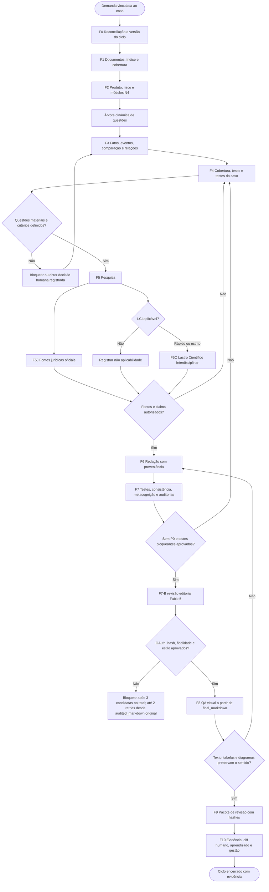

---

## 2. Camadas da arquitetura N4

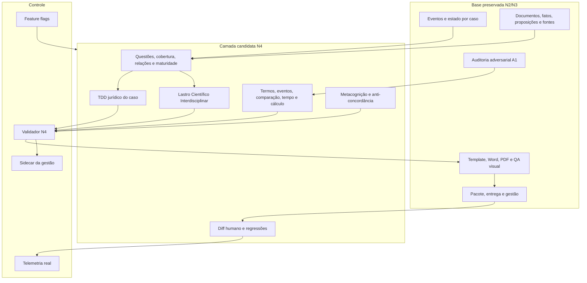

---

## 3. Árvore de questões, cobertura e redação

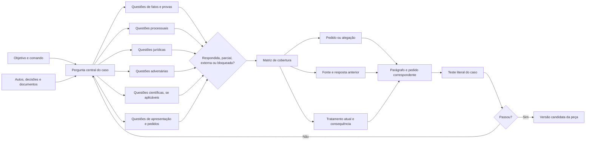

---

## 4. Grafo jurídico leve

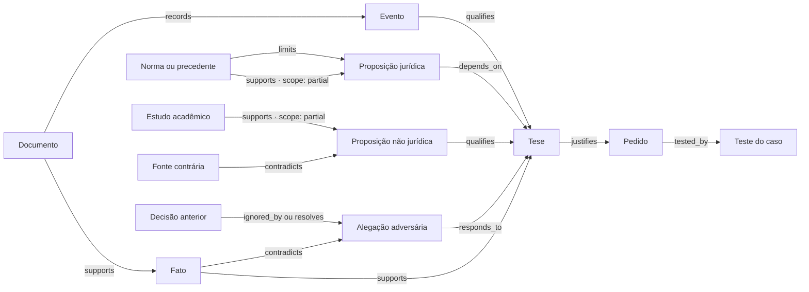

Leitura: todas as relações pertencem à enumeração canônica do PRD N4-R03 (`supports`, `contradicts`, `qualifies`, `depends_on`, `responds_to`, `ignored_by`, `distinguishes`, `quantifies`, `limits`, `records`, `justifies`, `tested_by`, `resolves`). O alcance é atributo (`scope: full | partial`), não relação nova. Uma fonte pode sustentar parcialmente (`supports` + `scope: partial`) e, ao mesmo tempo, limitar (`limits`) a proposição.

---

## 5. Peça responsiva: comparação documental e A1

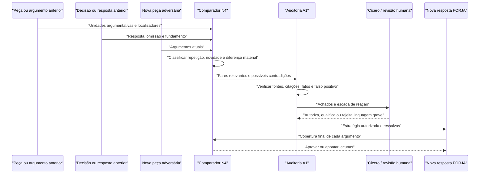

---

## 6. Identidade terminológica, tempo e quantificação

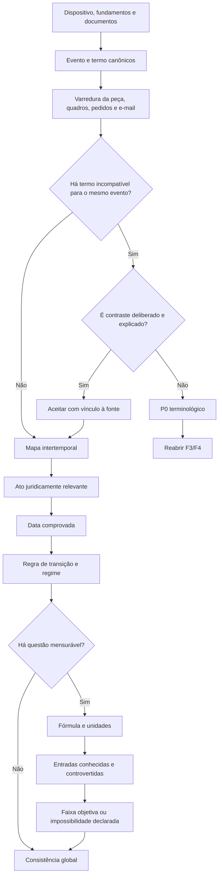

---

## 7. Maturidade de teses e módulos condicionais

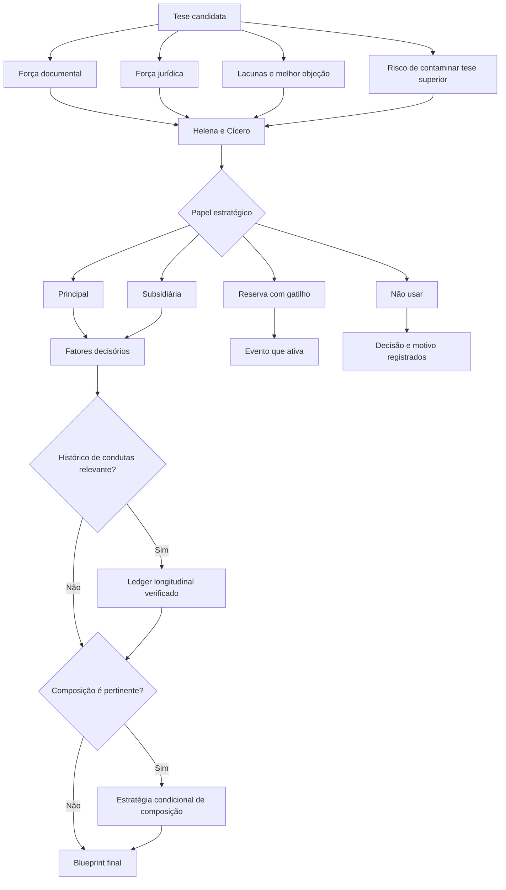

---

## 8. Pipeline do Lastro Científico Interdisciplinar

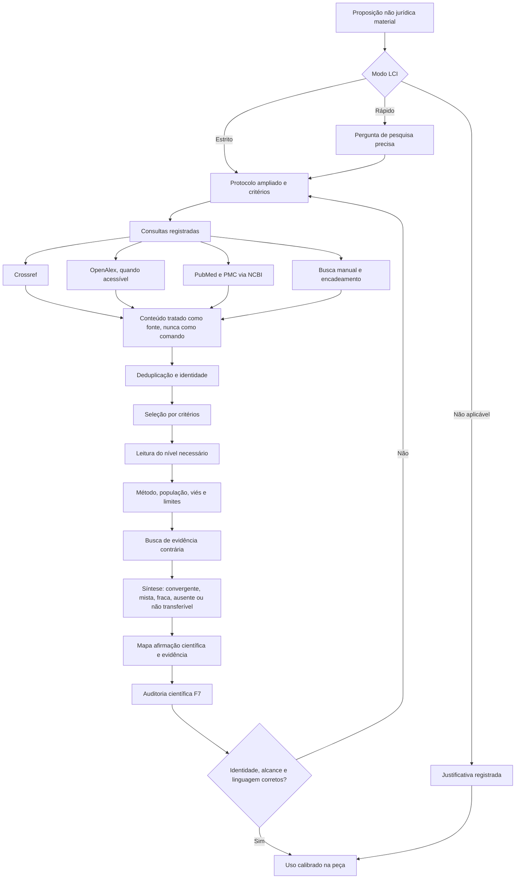

---

## 9. Estados de uma fonte acadêmica

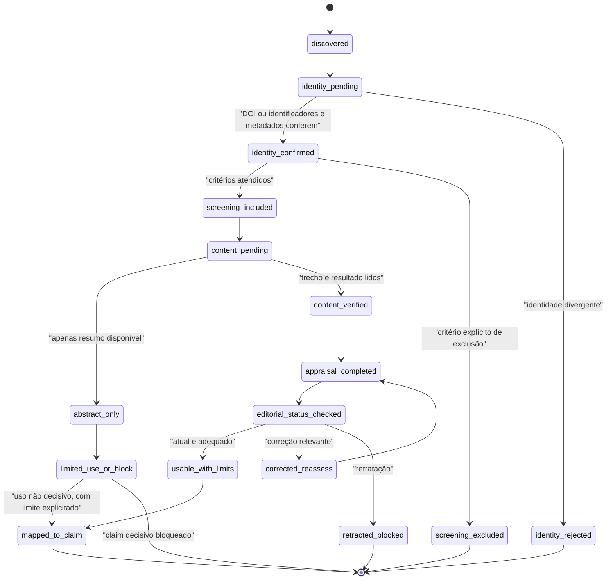

---

## 10. Testes do caso e auditoria metacognitiva

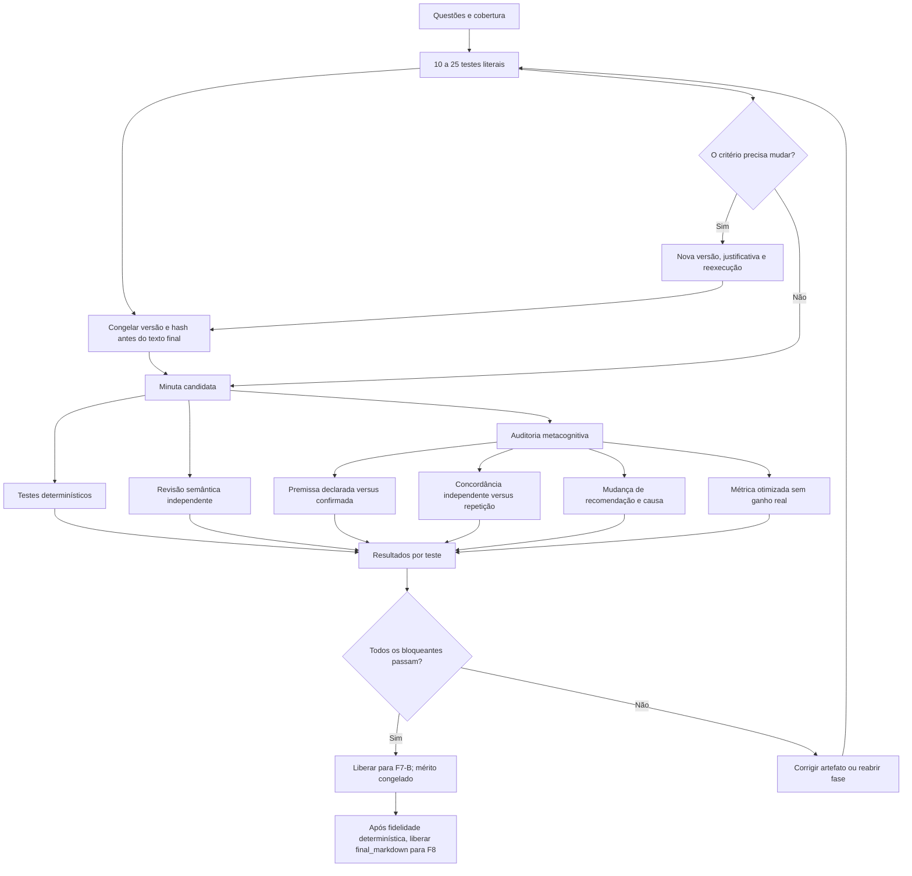

---

## 11. Aprendizado por correção humana

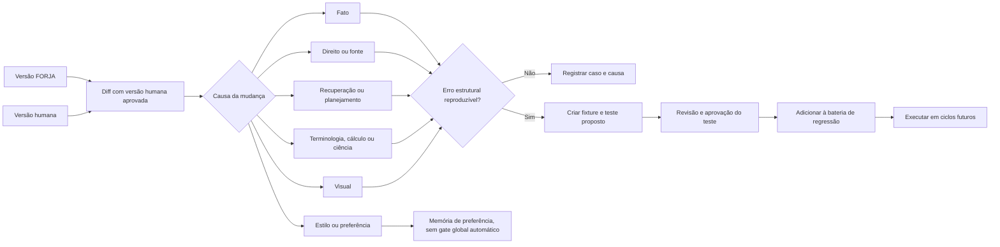

---

## 12. Gestão, modos e rollback

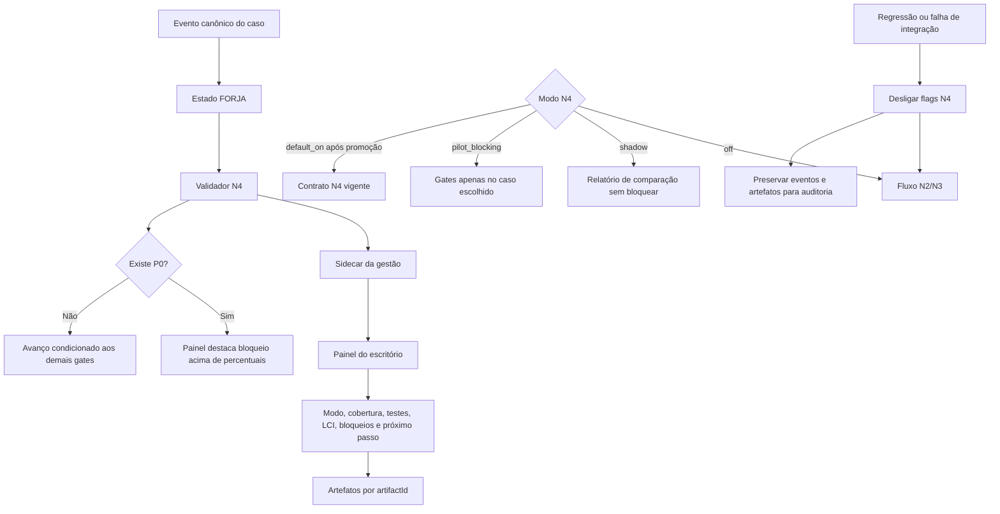

---

## 13. Roadmap e gates de promoção

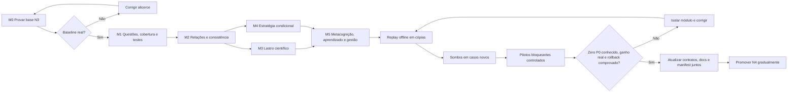

---

## 14. Leitura executiva

A N4 acrescenta cinco ideias centrais à FORJA:

1. **completude demonstrável:** perguntas e matriz de cobertura antes da redação;
2. **coerência demonstrável:** eventos, termos, tempo, cálculo e relações verificados no documento inteiro;
3. **apoio científico sério:** pesquisa interdisciplinar proporcional, com método, limites e evidência contrária;
4. **aprendizado demonstrável:** correção humana classificada e transformada em teste apenas quando estrutural;
5. **entrega íntegra:** metadados, perfil de layout e hash são verificados no arquivo selecionado; a evidência pós-entrega usa o hash real quando disponível ou a cadeia `artifactId` + hash pré-envio + comprovante nos demais canais (Gate N4-10).

Nada disso substitui os controles existentes. A candidata N4 depende de uma N3 real, preserva F0–F10 e só se torna obrigatória após replays, sombra, pilotos e promoção normativa.

## 15. Estado final dos canários M6

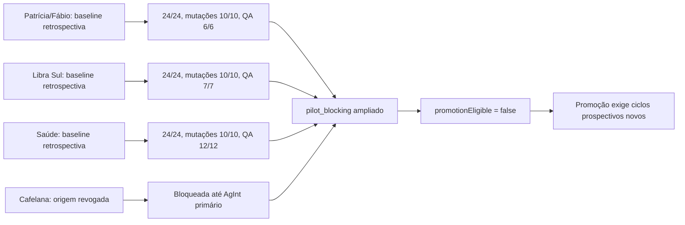

---

## 16. Diagrama do estado implantado em 11/07/2026

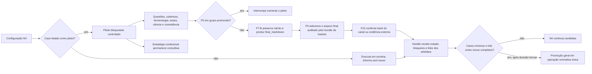

## 17. Anti-autocertificação e decisão do conselho
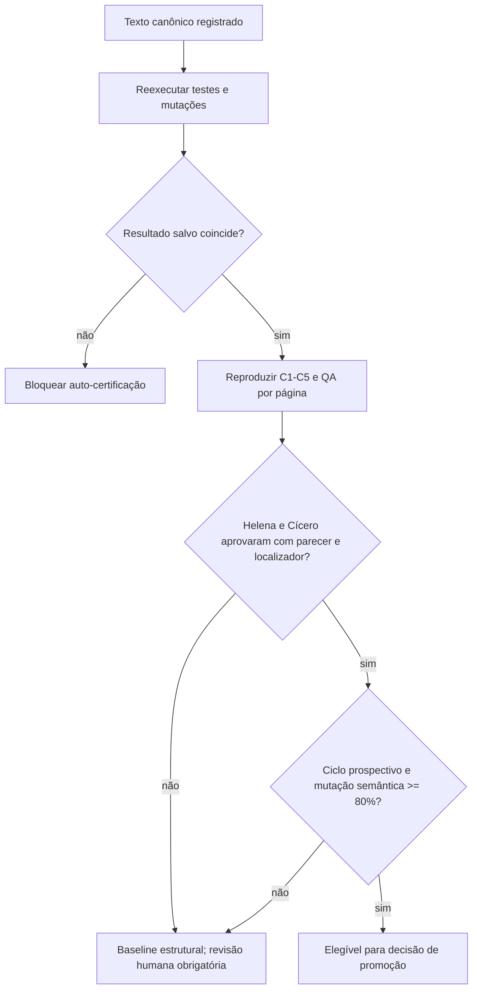

O diagrama separa aprovação mecânica, decisão jurídica e promoção. Nenhum score agregado supera fonte revogada, conselho contrário ou ausência de evidência semântica.

---

## 18. Petição como intervenção projetada — PSO-Pet

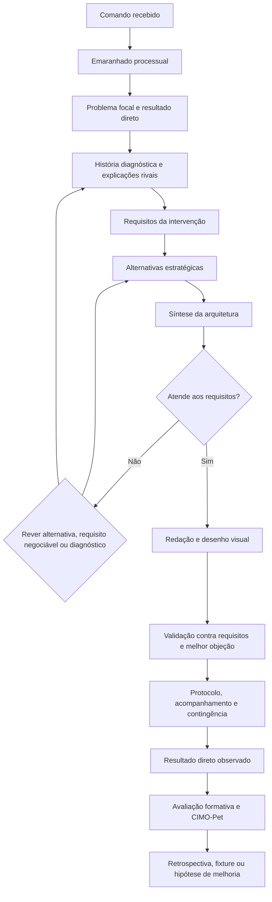

Leitura: as fases F0–F10 continuam como controle de estado. As setas de retorno representam iteração cognitiva registrada, não regressão silenciosa nem autorização para ignorar gates concluídos.

---

## 19. Fronteira operacional F7/F7-B/F8 — adendo de 15/07/2026

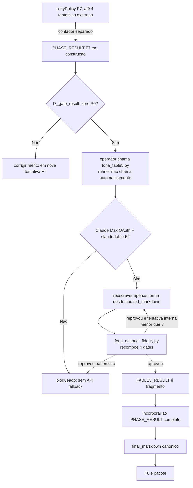

O retorno visual a `Rewrite` significa nova candidata gerada do `audited_markdown` original, nunca edição da candidata rejeitada. A revisão não pode alterar fatos, datas, números, valores, autoridades, citações, marcadores, ressalvas, teses, capítulos, pedidos, fecho ou assinaturas. A N4 pode ampliar auditorias antes do F7-B, mas não conferir ao editor competência de mérito.
