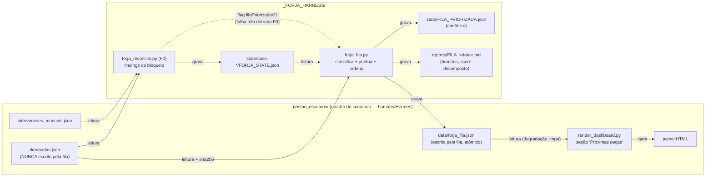
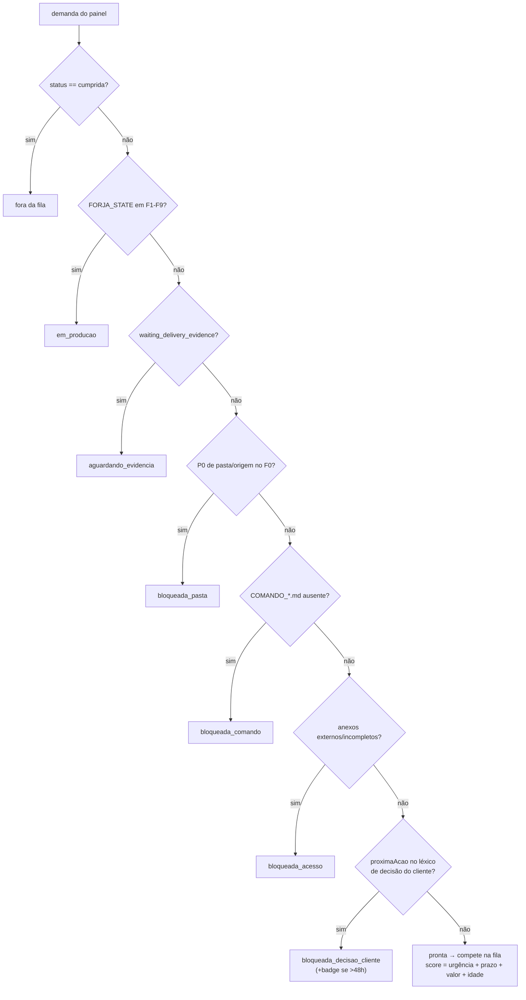
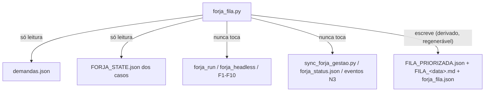

# Diagramas — FORJA FILA (priorização automática painel → FORJA)

Par de `15_PRD_FILA_PRIORIZADA.md` e `16_TDD_FILA_PRIORIZADA.md`.

## 1. Fluxo de dados (quem lê e quem escreve o quê)



## 2. Máquina de classificação de prontidão (ordem de precedência)



## 3. Sequência operacional (dia a dia do Igor)

```mermaid
sequenceDiagram
    participant H as Hermes/Igor (painel)
    participant R as forja_reconcile.py (F0)
    participant F as forja_fila.py
    participant P as painel HTML
    participant A as agente/Efesto (produção)
    H->>H: ajusta urgenciaManual / prazo no painel
    R->>R: audita 23 demandas (findings P0-P2)
    R->>F: chama fila (flag on; falha não derruba F0)
    F->>F: classifica prontidão + score explicável
    F->>P: forja_fila.json → seção "Próximas peças"
    Note over P: Igor vê top 5 + bloqueadas por motivo<br/>sem abrir nenhuma pasta
    A->>F: python forja_fila.py --proxima
    F-->>A: caso do topo (caseId, pasta, comando, score)
    A->>A: dispara produção F1-F10 (comando explícito,<br/>NUNCA automático — anti-requisito do PRD)
```

## 4. Onde a fila NÃO mexe (fronteiras de segurança)


