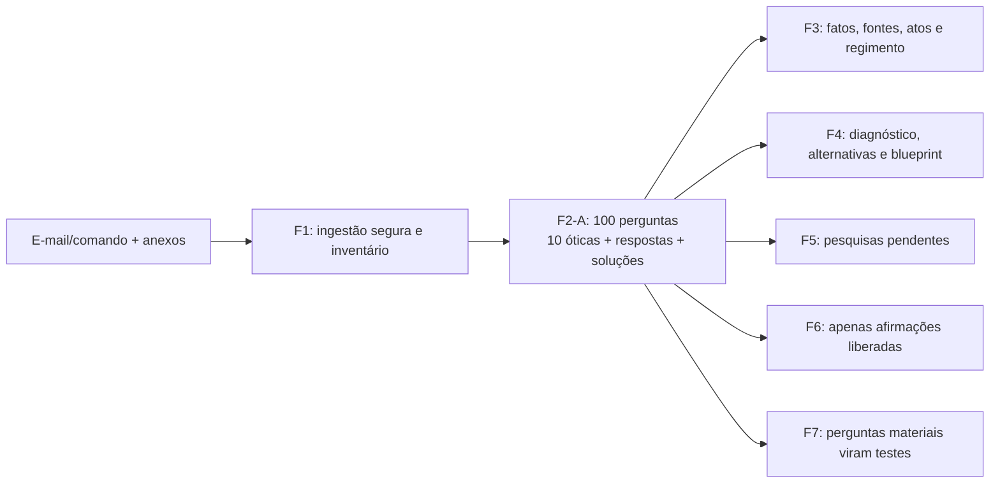

# F2-A — Exploração problematizadora em 100 perguntas

**Decisão de produto:** 14/07/2026. **Status:** implementada para novos ciclos; histórico preservado.

## Problema corrigido

A N4 possuía `F2_QUESTION_TREE.json`, mas casos reais continham apenas 5–20 perguntas e o contrato não exigia diversidade, respostas rastreáveis, síntese do problema ou passagem às fases seguintes. Assim, “ter árvore de perguntas” podia virar autocertificação sem exploração real.

## Posição no fluxo

F2-A é subfase de `F2_CLASSIFICACAO_PRODUTO_RISCO`; não renumera F0–F10 e não promove N4. A N2 continua vigente, N3 continua em sombra e N4 continua `pilot_blocking`.

## Contrato

- Artefato: `F2_QUESTION_TREE.json`.
- Protocolo: `FORJA-F2A-100-v1`.
- Contagem: exatamente 100, IDs `Q001..Q100`.
- Cobertura: exatamente 10 perguntas em cada uma das dez óticas.
- Profundidade mínima: pergunta, âncora do caso, importância, resposta e rota.
- Proveniência: fatos, eventos, precedentes e cálculos respondidos exigem `supportIds`.
- Honestidade: lacuna recebe `blocked`, `not_verified` e consequência; não se inventa resposta.
- Solução: ao menos duas hipóteses comparadas por condições e riscos.
- Handoff: F3, F4, F5, F6 e F7 recebem IDs explícitos.
- Liberação: questão material bloqueada mantém `draftRelease: blocked`.

## Compatibilidade e falha segura

Árvores históricas sem `protocolVersion` continuam legíveis pelo validador N4 antigo e não são reclassificadas silenciosamente. Todo novo resultado F2, porém, tem `question_tree` como saída obrigatória e passa pelo validador estrito antes da promoção. Reabrir F3/F4 de caso antigo exige materializar F2-A, porque a análise precisa ser reconstruída com o novo contrato.

## Implementação e testes

- `forja_exploracao_100.py`: 100 sementes adaptáveis, contrato e CLI.
- `forja_run.py`: reprova promoção de F2 com árvore inválida.
- `phase_contracts/F2.json`: saída e três gates obrigatórios.
- `phase_contracts/F3.json` e `F4.json`: recebem a árvore como entrada.
- `forja_reasoning.py`: valida protocolo estrito sem quebrar histórico.
- `generate_n4_contracts.py`: gera schema e contratos N4 atualizados.
- `test_forja_exploracao_100.py`: regressões de contagem, diversidade, fonte, bloqueio e handoff.

## Anti-requisitos

- não produzir 100 perguntas genéricas apenas para atingir número;
- não usar consenso entre agentes como prova;
- não transformar bloqueio em resposta inventada;
- não expor proveniência operacional na peça;
- não pedir ao Igor decisões técnicas sobre geração, schema ou testes;
- não avançar para redação externa com questão material bloqueada.
