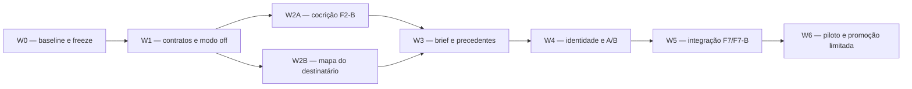

# 35 — Roadmap de execução: FORJA-ASSINATURA Lite

> **EMENDAS NORMATIVAS — 25/07/2026.** Este documento vale **acrescido da seção 9 de `36_CONSOLIDACAO_CONSELHO_E_PARECER_FINAL.md`** (emendas E1 a E16: conselho Helena e Cícero, migração do modelo editorial Fable 5 para Opus 5 com revisão cruzada entre famílias, perímetro de sigilo, testes negativos, registro de escopo e Onda -1). Em conflito, prevalece a seção 9. Os `ANEXO_A/B/C` são histórico e não se executam.


**Versão:** 1.0  
**Data:** 25/07/2026  
**Estado:** pronto para execução por ondas; nenhuma onda iniciada  
**PRD:** `planejamento/33_PRD_FORJA_ASSINATURA_LITE_COCRIACAO_PRECEDENTES.md`  
**TDD:** `planejamento/34_TDD_FORJA_ASSINATURA_LITE_COCRIACAO_PRECEDENTES.md`  
**Arquitetura:** `planejamento/32_PLANO_UNICO_CONSOLIDADO_V2_2026-07-25.md`

Este roadmap substitui o documento 26 como sequência imediata. O plano 26 permanece como backlog experimental de longo prazo.

---

## 1. Regra de execução

Executar uma onda por vez. Cada onda precisa entregar:

- mudança pequena e atribuível;
- testes proporcionais;
- evidência de gate;
- rollback;
- atualização documental necessária;
- decisão explícita de avançar.

Não iniciar uma onda sobre baseline ambíguo. Não rebaselinear a Régua automaticamente. Não agrupar W1–W5 em refatoração única.

## 2. Dependências



W2A e W2B podem ser executadas em paralelo apenas se os responsáveis não alterarem simultaneamente `forja_reasoning.py`, `forja_n4_validate.py` ou os geradores. Se houver um único executor, fazer W2A antes de W2B.

---

## 3. W0 — baseline, contratos inferiores e freeze

### Objetivo

Congelar o estado vivo e confirmar que o plano aponta para interfaces reais.

### Trabalho

1. registrar `git status` e preservar alterações alheias;
2. rodar a suíte dirigida do TDD;
3. rodar `forja_regua.py`;
4. classificar qualquer desvio preexistente;
5. salvar snapshot dos contratos F2–F7, catálogo N4, configurações e Graphify;
6. confirmar actions do TeiaJus com `capabilities`;
7. registrar baseline de custo e latência das rotas afetadas;
8. criar matriz requisito → arquivo → teste a partir do TDD.

### Arquivos

Somente relatórios de baseline e documentação de execução. Nenhum código de produção.

### Gate

- suíte dirigida verde;
- Régua verde ou desvio preexistente documentado e aceito sem rebaseline automático;
- actions do TeiaJus inventariadas;
- nenhum consumidor inferior desconhecido;
- worktree suja mapeada.

### Evidência já disponível

Em 25/07/2026:

```text
104 passed, 3 subtests passed
```

Esse resultado é ponto de partida, não substitui a repetição no início da execução.

### Rollback

Não aplicável; W0 não altera comportamento.

### Commit sugerido

`docs(forja): freeze baseline assinatura lite`

---

## 4. W1 — linguagem do sistema, schemas e modo `off`

### Objetivo

Introduzir os contratos sem materializar comportamento novo.

### Trabalho

1. adicionar namespace `forjaAssinaturaLite` com `mode=off`;
2. generalizar resolução de modo preservando `_effective_mode()`;
3. registrar `F3_MAPA_DESTINATARIO.json`;
4. registrar `F4_SIGNATURE_BRIEF.json`;
5. estender a definição geradora do F2 question tree;
6. adicionar outputs F3/F4 em `EXTENSIONS`;
7. exigir os novos arquivos em `validate_case()` somente quando o modo da feature não for `off`;
8. gerar schemas, catálogo e contratos N4;
9. criar validadores estruturais mínimos que rejeitem payload vazio;
10. criar `test_forja_assinatura_lite.py`;
11. provar que `off` não altera outputs nem chama TeiaJus/modelos.

### Propriedade de arquivos

- `FORJA_N3_CONFIG.json`;
- `forja_n4_common.py`;
- `generate_n4_contracts.py`;
- `forja_n4_validate.py`;
- `forja_reasoning.py`;
- arquivos gerados em `n4_schemas/` e `phase_contracts_n4/`;
- `test_forja_assinatura_lite.py`;
- `test_forja_n4.py`;
- `test_forja_architecture.py`.

### Critérios de aceite

- gerador é idempotente;
- catálogo e `ARTIFACT_SPECS` coincidem;
- contratos F0–F10 mantêm ordem e fachadas;
- casos históricos validam;
- feature ausente equivale a `off`;
- modo desconhecido falha;
- casos N4 já em piloto não ativam a feature nova.
- schema e validador usam os mesmos estados de pergunta.

### Comandos

```powershell
python generate_n4_contracts.py
python -m json.tool n4_schemas\ARTIFACT_CATALOG.json > $null
python forja_phase_contracts.py
python -m pytest -q -p no:cacheprovider `
  test_forja_assinatura_lite.py `
  test_forja_n4.py `
  test_forja_architecture.py
```

### Rollback

Remover namespace e registros novos; regenerar artefatos. Como o modo é `off`, não há migração de caso.

### Commit sugerido

`feat(forja): add assinatura lite contracts in off mode`

---

## 5. W2A — cocrição F2-B em sombra

### Objetivo

Transformar F2-A em consulta material sem envio automático.

### Trabalho

1. implementar campos dialéticos e ledger de decisões;
2. implementar seletor determinístico;
3. implementar políticas de silêncio;
4. implementar renderização da consulta;
5. implementar registro append-only de resposta;
6. criar template humano;
7. validar consulta em casos históricos;
8. medir redundância contra o acervo;
9. manter `draftRelease=blocked` quando houver material pendente.

### Propriedade de arquivos

- `forja_exploracao_100.py`;
- `generate_n4_contracts.py`;
- `forja_reasoning.py`;
- schema F2 gerado;
- `templates/F2_CONSULTA_ADVOGADO.md`;
- `test_forja_exploracao_100.py`;
- `test_forja_assinatura_lite.py`;
- `test_forja_n4.py`.

### Casos de teste mínimos

- fato já documentado;
- objetivo estratégico desconhecido;
- autorização necessária;
- resposta parcial;
- duas rodadas;
- escolha formal não material com default;
- tentativa de default factual;
- resposta `office_declaration` sem `supportIds`.

### Critérios de aceite

- pergunta redundante é rejeitada;
- pergunta material informa consequência;
- silêncio factual bloqueia;
- resposta parcial mantém pendência;
- decisão tem autor e canal;
- consulta renderizada corresponde ao hash;
- nenhum e-mail é enviado;
- incumbente de F6 permanece inalterado.

### Rollback

`mode=off`; campos aditivos permanecem legíveis e ignorados.

### Commit sugerido

`feat(forja): add dialectic consultation in shadow`

---

## 6. W2B — mapa do destinatário e TeiaJus em sombra

### Objetivo

Produzir mapa verificável sem tratar metadado como prova.

### Trabalho

1. implementar schema completo do mapa;
2. implementar validador e freshness;
3. classificar fontes por nível probatório;
4. testar a allowlist ampliada sem ações pagas;
5. integrar `research_sources`, `research_plan`, `research_search` e `research_mission_get`, se capabilities e testes confirmarem contrato;
6. registrar queries e artefatos de replay;
7. construir mapas históricos para casos STJ;
8. verificar composição em fonte oficial atual;
9. deixar prevenção como `unknown` quando não houver fonte adequada.

### Propriedade de arquivos

- `forja_reasoning.py`;
- `forja_n4_validate.py`;
- `FORJA_SEARCH_CONFIG.json`;
- `forja_legal_search.py`, somente se necessário;
- schema e contratos gerados;
- `test_forja_legal_search.py`;
- `test_forja_assinatura_lite.py`;
- `test_forja_n4.py`.

### Critérios de aceite

- DataJud nunca confirma composição ou prevenção;
- composição stale é detectada;
- toda posição aponta para decisão;
- topologia adicional exige justificativa;
- actions `read_paid` são negadas;
- artefato de pesquisa não vira citação final sem F7;
- nenhuma mutação TeiaJus ocorre.

### Rollback

Remover novas actions da allowlist e usar `mode=off`. O TeiaJus canônico não é modificado.

### Commit sugerido

`feat(forja): add sourced recipient map in shadow`

---

## 7. W3 — signature brief, pesquisa jurídica e âncoras

### Objetivo

Vincular decisão humana, topologia e precedentes antes da redação.

### Trabalho

1. implementar `F4_SIGNATURE_BRIEF.json`;
2. validar rotas, decisão humana e cross-references;
3. implementar `legalResearchProtocol` no `source_ledger`;
4. implementar ficha de anchor no `verified_source_ledger`;
5. distinguir ementa, íntegra, metadado e dado administrativo;
6. implementar reabertura F4 quando anchor falhar;
7. testar uma, duas a quatro e mais de quatro rotas;
8. rejeitar rotas estruturalmente duplicadas;
9. testar resultado negativo e descarte de autoridade.

### Propriedade de arquivos

- `forja_reasoning.py`;
- `forja_n4_validate.py`;
- `forja_package.py`;
- `forja_run.py`;
- `forja_claim_binding.py`, se necessário;
- `forja_n4_invalidation.py`;
- geradores e schemas;
- `test_forja_assinatura_lite.py`;
- `test_forja_anti_hallucination_v2.py`;
- `test_forja_anti_cheat.py`;
- `test_forja_run.py`;
- `test_forja_n3_package.py`.

### Critérios de aceite

- brief bloqueado não libera F6;
- rota selecionada possui decisão humana material;
- IDs inexistentes falham;
- ementa isolada não produz holding final;
- trecho alterado falha por hash;
- regime não usa score universal;
- query negativa é reproduzível;
- CGU sancionatório não é precedente;
- anchor rejeitada torna brief/draft stale.

### Rollback

`mode=off`; F5/F7 continuam aceitando ledgers legados. Nenhuma fonte histórica é apagada.

### Commit sugerido

`feat(forja): bind strategy brief to verified anchors`

---

## 8. W4 — corpus de identidade e variante offline

### Objetivo

Transformar acervo heterogêneo em evidência editorial atribuível.

### Trabalho

1. criar manifest vazio e schema/validador;
2. inventariar inicialmente apenas itens de alta confiança;
3. separar escrita, revisão, aprovação, feedback e pensamento oral;
4. vincular versões por hash;
5. classificar diffs por origem intelectual;
6. extrair padrões candidatos sem promover regras globais;
7. gerar variante F6 offline usando brief e padrões autorizados;
8. executar A/B no AUTO-RESEARCH;
9. registrar missingness e tamanho real do corpus.

### Propriedade de arquivos

- `autoresearch/IDENTITY_CORPUS_MANIFEST.jsonl`;
- `forja_learning.py`;
- `forja_diff_docx.py`, se precisar expor metadados;
- `forja_ar_corpus.py`, se precisar de seleção offline;
- prompts versionados em `autoresearch/prompts/`;
- `test_forja_autoresearch.py`;
- `test_forja_assinatura_lite.py`;
- testes de learning N4.

### Critérios de aceite

- autoria desconhecida não vira `human_authored`;
- transcript não vira estilo escrito;
- diff sem autor não vira preferência Medina;
- conteúdo privado não aparece no relatório;
- variante usa o mesmo snapshot jurídico;
- A/B não promove automaticamente;
- regressão jurídica veta ganho editorial.

### Rollback

Não usar o manifest na geração. O corpus é offline e não altera casos.

### Commit sugerido

`feat(forja): add attributable identity corpus for offline evaluation`

---

## 9. W5 — integração F6, F7/F7-B e package

### Objetivo

Preservar a decisão até o texto final e recomputá-la independentemente.

### Trabalho

1. implementar recibo `FORJA-GOSTO-EDGE-v2`;
2. manter compatibilidade com v1;
3. remover exigência fixa de três direções apenas no v2;
4. adicionar hash do brief e rota;
5. recompor recibo em `forja_editorial_fidelity.py`;
6. passar brief opcional por `forja_run.py` e `forja_package.py`;
7. validar conteúdo obrigatório e anchors;
8. provar que F7-B não altera rota, pedidos ou polaridade;
9. manter um único `final_markdown`.

### Propriedade de arquivos

- `forja_fable5.py`;
- `forja_editorial_fidelity.py`;
- `forja_run.py`;
- `forja_package.py`;
- `test_forja_fable5.py`;
- `test_forja_run.py`;
- `test_forja_n3_package.py`;
- `test_forja_assinatura_lite.py`;
- `test_forja_mutation_semantic.py`.

### Critérios de aceite

- chamadas antigas continuam válidas;
- recibo v1 continua legível;
- recibo v2 adulterado falha;
- routeId divergente falha;
- hash do brief divergente falha;
- conteúdo obrigatório removido falha;
- F8 recebe um `final_markdown`;
- package exige ledger e recibos existentes.

### Rollback

`mode=off` e ausência do parâmetro opcional do brief restauram a execução anterior.

### Commit sugerido

`feat(forja): preserve signature brief through final markdown`

---

## 10. W6 — piloto controlado, rollback e documentação

### Objetivo

Exercitar a capacidade completa em poucos casos sem promoção global.

### Trabalho

1. selecionar pilotos com autorização;
2. registrar baseline e expectativas por caso;
3. executar consulta com revisão e envio humanos;
4. executar mapa, brief, pesquisa e um draft;
5. validar F7/F7-B, DOCX/PDF e package;
6. comparar com incumbente;
7. medir interação, segurança, pesquisa, valor e operação;
8. executar rollback `off`;
9. documentar falhas e decisões;
10. regenerar Archify, Graphify, mapas e hashes;
11. realizar revisão independente.

### Pilotos candidatos

Escolher apenas após W0, considerando:

- existência de entrega histórica para replay;
- variedade de produto;
- matéria em que topologia seja relevante;
- ausência de prazo crítico incompatível;
- autorização do responsável.

Os casos listados no plano 31 são candidatos, não seleção automática.

### Critérios de aceite

- zero regressão AH-01 a AH-08;
- zero fato por silêncio;
- zero ação externa não autorizada;
- anchors verificadas;
- composição/prevenção com estado honesto;
- consultas materiais e não redundantes;
- rollback exercitado;
- pacote final íntegro;
- custos e latências publicados com denominadores;
- revisão independente concluída.

### Estado máximo

```text
pilot_completed
```

Não habilitar `default_on`.

### Commit sugerido

`docs(forja): record assinatura lite pilot and validated architecture`

---

## 11. Suíte de promoção

Ao final de W5 e W6:

```powershell
python generate_n4_contracts.py
python forja_phase_contracts.py

python -m pytest -q -p no:cacheprovider `
  test_forja_assinatura_lite.py `
  test_forja_exploracao_100.py `
  test_forja_n4.py `
  test_forja_legal_search.py `
  test_forja_fable5.py `
  test_forja_run.py `
  test_forja_n3_package.py `
  test_forja_anti_hallucination_v2.py `
  test_forja_anti_cheat.py `
  test_forja_autoresearch.py `
  test_forja_mutation_semantic.py `
  test_forja_architecture.py

python validate_forja_n3.py --real-word --run-replay
python forja_regua.py
```

Depois:

```powershell
python "C:\Users\IgorPC\.claude\projects\00_MAPA_ARQUITETURA_IA\REGENERAR_MAPAS_ARQUITETURA.py"
python "C:\Users\IgorPC\.claude\projects\00_MAPA_ARQUITETURA_IA\APROFUNDAR_MAPAS_ARQUITETURA.py"
```

Validar visualmente todos os HTMLs regenerados.

---

## 12. Stop conditions

Parar a onda e não contornar o gate se ocorrer:

- baseline não explicável;
- necessidade de alterar F0–F10;
- migração destrutiva;
- ação TeiaJus paga ou mutação não autorizada;
- envio externo sem autorização;
- schema gerado divergente da fonte;
- caso legado quebrado;
- ementa usada como ratio;
- falsa atribuição do corpus;
- ganho editorial com regressão jurídica;
- necessidade de rebaseline automático;
- mudança estrutural sem mapa atualizado.

---

## 13. Critério de prontidão para começar

O pacote está documentalmente pronto quando:

- [x] PRD e TDD apontam um para o outro;
- [x] requisitos têm componentes e testes;
- [x] ondas têm dependências, arquivos, gates e rollback;
- [x] fontes canônicas de schema e contrato foram identificadas;
- [x] baseline dirigido foi executado;
- [x] ações TeiaJus foram verificadas;
- [x] escopo exclui envio autônomo e custo novo;
- [x] plano preserva F0–F10, F7-B e um único cânone;
- [ ] responsável pela execução inicia W0 e registra a evidência viva.

A única próxima ação de execução é W0. Nenhuma decisão técnica adicional precisa ser devolvida ao usuário antes de iniciá-la.
