# Van Aken + The McKinsey Mind — seleção aplicada ao diagnóstico e ao design da FORJA

**Data do estudo:** 30/07/2026  
**Natureza:** estudo metodológico e proposta de produto; não altera os contratos executáveis nesta entrega.  
**Fontes primárias estudadas:** Joan Ernst van Aken e Hans Berends, *Problem Solving in Organizations: A Methodological Handbook for Business and Management Students*; Ethan M. Rasiel e Paul N. Friga, *The McKinsey Mind*.  
**Fontes locais confrontadas:** contrato F2-A vigente, seu template, schema, validador, contratos F2/F4, schemas N4 de F3/F4 e mapa arquitetural vivo da FORJA.

## 1. Decisão executiva

A FORJA não deve abandonar as 100 perguntas. Deve retirar delas a função de **arquitetura principal do raciocínio**.

O modelo atual é forte como barreira de cobertura, proveniência e honestidade: exige dez óticas, impede lacunas silenciosas, vincula respostas factuais a `supportIds` e encaminha conclusões a F3–F7. Entretanto, a contagem fixa não prova que:

- o problema correto foi definido;
- sintomas foram separados de causas;
- hipóteses rivais foram efetivamente testadas;
- a pesquisa foi priorizada pelo valor para a decisão;
- o diagnóstico chegou a uma explicação causal coerente;
- as alternativas de solução foram derivadas de requisitos e mecanismos;
- existe uma regra racional para parar de perguntar e começar a desenhar.

A melhor síntese dos dois livros é:

> **Van Aken dá profundidade causal e disciplina de design; The McKinsey Mind dá velocidade, estrutura lógica e foco analítico.**

A proposta é transformar F2-A de “questionário de cem itens” em **sistema de exploração adaptativa**, no qual:

1. as dez óticas e as cem sementes permanecem como banco de cobertura;
2. o caso é enquadrado por uma lacuna entre situação comprovada e situação juridicamente alcançável;
3. uma árvore de questões e causas organiza o problema;
4. hipóteses iniciais e rivais determinam os testes e a pesquisa;
5. só são abertas as perguntas que reduzem incerteza material;
6. o diagnóstico termina com uma *diagnostic story* curta, causal, lastreada e acionável;
7. F4 converte essa história em requisitos, alternativas, mecanismos, riscos e escolha de design.

O ganho esperado é **menos pesquisa ornamental, menos redação prematura e mais coerência entre problema, prova, tese, pedido e arquitetura da peça**.

## 2. O que já existe e deve ser preservado

### 2.1 Forças reais da F2-A atual

O protocolo `FORJA-F2A-100-v1` já possui virtudes que os livros recomendariam:

- dez perspectivas canônicas, evitando visão unidimensional;
- perguntas adaptadas ao caso, com `caseAnchor` e `whyItMatters`;
- separação entre documento confirmado, fonte oficial, declaração, inferência, hipótese e não verificado;
- bloqueio honesto de lacunas materiais;
- pelo menos duas hipóteses de solução;
- encaminhamento explícito para F3, F4, F5, F6 e F7;
- impedimento de redação enquanto houver questão material bloqueada;
- F2-B dialética, que evita perguntar ao advogado o que o acervo já responde;
- limite de conforto e autoridade humana definida para consultas;
- validação determinística, testes e compatibilidade histórica.

Isso não deve ser desmontado. A evolução deve ser aditiva e compatível.

### 2.2 Limitações observadas no contrato vivo

| Limitação | Evidência no estado atual | Consequência |
|---|---|---|
| Quantidade é invariável | Exatamente 100 perguntas e exatamente 10 por ótica | Casos simples e complexos recebem a mesma geometria de investigação |
| Cobertura é contada por ótica | `coverage.perLens` mede distribuição | Não mede coerência causal nem valor de decisão |
| Síntese diagnóstica é texto livre | Apenas comprimento mínimo | Pode haver 80 caracteres sem uma explicação causal válida |
| Hipóteses de solução são pouco estruturadas | descrição, condições, riscos e IDs | Não exigem requisitos, mecanismo, alternativa rival, critério de escolha ou teste |
| Não há árvore causal tipada | Há perguntas sobre causas e sintomas | Não existe contrato para causa, mecanismo, efeito, rival ou força da evidência |
| Não há plano de trabalho analítico | Handoff lista perguntas por fase | Não liga hipótese → teste → fonte → produto → prioridade → regra de parada |
| F4 recebe o question tree, mas parte dos schemas é aberta | vários artefatos exigem apenas `items`, `decisions` ou `theses` | A transição diagnóstico → design ainda depende demais de prosa e disciplina do agente |
| A pergunta decisiva forte aparece mais tarde | `signature_brief` em F4 | A pesquisa pode começar antes de a questão governante estar suficientemente estreita |

## 3. O melhor de Van Aken para a FORJA

### 3.1 Definir o problema como lacuna de desempenho

O problema não é o assunto do processo nem o pedido literal recebido. É a distância entre:

- a situação atual comprovada;
- uma situação desejada, legítima e alcançável;
- sob as restrições processuais e probatórias reais.

**Aplicação jurídica:** distinguir “o cliente quer reverter a decisão” de “qual decisão o órgão pode tomar agora, por qual veículo e com quais fatos demonstráveis”.

**Artefato recomendado:** `problemFrame`, com:

- `currentSituation`;
- `desiredSituation`;
- `performanceGap`;
- `normOrCriterion`;
- `problemOwner`;
- `decisionOwner`;
- `inScope`;
- `outOfScope`;
- `boundaryConditions`;
- `problemType`: real, percepção ainda não validada ou meta possivelmente inviável.

**Gate:** `problem_gap_validated`.

**Ganho esperado:** reduz o risco de construir uma peça tecnicamente boa para o problema errado.

### 3.2 Tratar a entrada como *problem mess*

Antes de simplificar, o método reconhece o emaranhado de fatos, valores, interesses, versões e relações de poder.

**Aplicação jurídica:** mapear separadamente:

- versão do cliente;
- posição do escritório;
- narrativa processual documentada;
- tese adversária;
- incentivos do órgão julgador;
- limites éticos e reputacionais;
- efeitos em processos conexos.

Isso não transforma opiniões em fatos. Apenas impede que uma perspectiva seja silenciosamente tomada como “o caso”.

**Artefato recomendado:** bloco `problemMess.stakeholderViews`, com cada visão classificada por fonte e autoridade.

**Gate:** nenhuma formulação do problema pode ocultar uma divergência material conhecida.

**Ganho esperado:** antecipa conflitos de mandato, tese e narrativa que hoje tendem a aparecer na revisão.

### 3.3 Árvore de causa e efeito

Van Aken propõe organizar sintomas à direita e causas potenciais “rio acima”, sem tratar o primeiro desenho como prova.

**Adaptação jurídica:**

- efeito indesejado: risco ou decisão que se pretende evitar;
- causas processuais: inadequação do veículo, preclusão, limite cognitivo;
- causas probatórias: ausência, fragilidade ou contradição do lastro;
- causas jurídicas: requisito cumulativo ausente, regime aplicável, fundamento autônomo;
- causas narrativas: cronologia quebrada, identidade de atos, inferência não sustentada;
- mecanismos: por que determinada intervenção argumentativa ou probatória pode alterar a decisão.

**Artefato recomendado:** `diagnosticTree`, com nós tipados:

- `symptom`;
- `candidate_cause`;
- `validated_cause`;
- `rival_explanation`;
- `mechanism`;
- `consequence`;
- `constraint`.

Cada relação deve declarar `relationType`, `supportIds`, `confidence`, `testId` e `status`.

**Gate:** `causal_chain_coherent`.

**Ganho esperado:** evita tratar enumeração de problemas como diagnóstico.

### 3.4 Teoria como geradora de causas candidatas

A literatura não entra apenas para ornamentar a peça. Ela ajuda a imaginar explicações que o acervo inicial não tornou visíveis.

**Aplicação jurídica:**

- doutrina e jurisprudência geram requisitos, distinções e explicações rivais;
- regimento e rito geram causas processuais de inadmissão;
- estudos empíricos ou literatura especializada podem gerar mecanismos, quando realmente aplicáveis;
- nenhuma causa teórica é promovida sem validação no contexto do caso.

**Artefato recomendado:** para cada hipótese causal, separar:

- `origin`: acervo, teoria, precedente, entrevista ou inferência;
- `contextFit`;
- `rivalExplanations`;
- `validationPlan`.

**Ganho esperado:** amplia a exploração sem confundir analogia teórica com fato.

### 3.5 Triangulação e validação

Uma causa importante não deve depender de uma única fala, um único OCR ou uma única leitura conceitual.

**Aplicação jurídica:** cruzar, conforme materialidade:

- inteiro teor;
- evento processual;
- documento/anexo;
- dado objetivo ou cálculo reproduzível;
- fonte oficial;
- versão humana autorizada, mantida como declaração até confirmação.

**Gate:** causas decisivas devem ter suporte apropriado ou permanecer bloqueadas; duas fontes não são exigidas mecanicamente quando uma fonte primária autêntica é suficiente.

**Ganho esperado:** reduz “lastro aparente” e viés de confirmação.

### 3.6 *Diagnostic story*

O diagnóstico encerra quando é possível contar, em uma ou poucas frases, uma história que ligue:

> problema validado → causas principais → mecanismo → consequências → ponto de intervenção.

Não é resumo literário. É a explicação causal que governará o design.

**Estrutura proposta:**

```text
No contexto C, o resultado indesejado O ocorre principalmente porque C1 e C2,
por meio dos mecanismos M1 e M2; a intervenção precisa atuar sobre C1/C2 sem
violar as restrições R, permanecendo aberta a explicação rival H2 até o teste T.
```

**Gate:** `diagnostic_story_accepted`.

**Critérios:**

- problema e causas não podem ser placeholders;
- cada causa decisiva deve apontar para evidência ou bloqueio;
- explicação rival mais forte deve estar enfrentada;
- a história deve indicar onde uma intervenção pode agir;
- novas coletas devem ter atingido a regra de parada declarada.

**Ganho esperado:** cria uma ponte auditável entre F3 e F4.

### 3.7 Design por requisitos, não por inspiração

Antes de redigir a solução, definir:

- requisitos funcionais;
- necessidades do usuário/revisor/julgador;
- condições de contorno inegociáveis;
- restrições negociáveis.

**Adaptação jurídica:**

- funcional: o que a peça precisa conseguir demonstrar ou obter;
- usuário: como o revisor e o julgador precisam compreender a questão;
- contorno: lei, prazo, competência, fatos, ética, sigilo, mandato;
- restrição: extensão, estilo, formato, preferência estratégica, tempo disponível.

**Artefato recomendado:** `designRequirements`.

**Gate:** `design_requirements_frozen_before_drafting`.

**Ganho esperado:** impede que elegância textual substitua adequação jurídica.

### 3.8 Solução conceitual antes do detalhamento

Van Aken diferencia o *outline design* do detalhamento. Na FORJA:

- **outline design:** tese central, rotas, pedidos, concessões, estrutura causal e ordem de decisão;
- **detailing:** seções, parágrafos, autoridades, anexos, visuais e acabamento.

**Gate:** nenhuma redação longa deve começar antes da aprovação do outline.

**Ganho esperado:** reduz retrabalho estrutural em F6/F7-B.

### 3.9 Alternativas, decisão multicritério e “advogado do diabo”

O design deve conter ao menos uma alternativa viável e ser testado por cenários e críticas.

**Adaptação jurídica:** comparar rotas por:

- força probatória;
- cabimento;
- reversibilidade;
- risco de preclusão;
- compatibilidade com posições conexas;
- custo de premissas não verificadas;
- utilidade subsidiária;
- clareza decisória;
- risco ético/reputacional.

Não reduzir tudo a uma nota única. Preservar o perfil e os trade-offs.

**Gate:** `alternatives_compared_and_stress_tested`.

**Ganho esperado:** evita o casamento precoce com a primeira tese plausível.

### 3.10 Lógica CIMO

Para cada solução relevante:

- **C — Contexto:** qual problema, órgão, fase, fatos, restrições e destinatário;
- **I — Intervenção:** qual tese, prova, pedido, visual ou sequência de atos;
- **M — Mecanismo:** por que isso deve alterar compreensão, cognição, ônus, incentivo ou decisão;
- **O — Outcome:** qual resultado observável e qual limite de sucesso.

**Artefato recomendado:** `designRationaleCIMO`.

**Gate:** solução sem mecanismo explícito não é design justificado; é preferência.

**Ganho esperado:** melhora a justificativa de por que determinada arquitetura de peça deve funcionar neste caso.

## 4. O melhor de The McKinsey Mind para a FORJA

### 4.1 “O problema nem sempre é o problema”

O diagnóstico inicial do solicitante é entrada, não conclusão.

**Aplicação:** F2-A deve registrar `presentedProblem` e `reframedProblem`, justificando a mudança com fonte e raciocínio.

**Ganho esperado:** reduz pesquisa guiada por pedido mal formulado.

### 4.2 Hipótese inicial como mapa, não como veredicto

A hipótese inicial dá direção à coleta. Deve declarar quais premissas precisam ser verdadeiras e ser descartável diante de fatos contrários.

**Artefato recomendado:** `hypothesisLedger`, com:

- `hypothesisId`;
- `statement`;
- `requiredAssumptions`;
- `supportingSignals`;
- `disconfirmingSignals`;
- `quickTest`;
- `status`: aberta, reforçada, reformulada ou rejeitada;
- `revisionHistory`.

**Gate:** `initial_hypothesis_quick_tested`.

**Ganho esperado:** acelera o início sem autorizar conclusão prematura.

### 4.3 Árvores de questões e MECE

A questão governante é decomposta até folhas testáveis que determinam análises concretas.

No direito, MECE deve ser usado com cautela:

- **mutuamente exclusivo** é útil para impedir duplicação de ramos;
- **coletivamente exaustivo** deve significar “completude defensável para a decisão”, não promessa metafísica de que nenhum fundamento jurídico possível existe;
- doutrina, fatos e pedidos podem se sobrepor; o schema deve permitir `crossLinks` explícitos.

**Artefato recomendado:** `issueTree`, distinguindo:

- árvore diagnóstica: “por que ocorre?”;
- árvore de decisão: “o que precisa ser verdadeiro para a rota vencer?”;
- árvore de solução: “quais intervenções podem atuar?”.

**Gate:** `issue_tree_decision_complete`.

**Ganho esperado:** substitui uma lista plana de perguntas por uma estrutura navegável.

### 4.4 *Quick and Dirty Test* com salvaguarda jurídica

O teste rápido elimina hipóteses cujas premissas básicas já são falsas.

**Uso permitido:**

- eliminar rota incompatível com classe, órgão, prazo, ato ou pedido;
- identificar ausência evidente de requisito cumulativo;
- verificar ordem de grandeza de impacto;
- decidir se uma pesquisa aprofundada merece começar.

**Uso proibido:**

- confirmar citação, inteiro teor, identidade processual, prazo ou fato;
- substituir leitura de fonte oficial;
- transformar aproximação em alegação protocolável.

**Ganho esperado:** evita pesquisa cara sobre teses que falham no primeiro requisito.

### 4.5 Plano de trabalho guiado por hipótese

Cada ramo material deve dizer:

- qual questão será respondida;
- qual hipótese está sendo testada;
- qual análise será feita;
- quais fontes são necessárias;
- qual produto será gerado;
- quem é responsável;
- qual é a prioridade;
- qual resultado mudaria a decisão;
- quando parar.

**Artefato recomendado:** `diagnosticWorkplan`.

**Gate:** `research_has_decision_link`.

**Ganho esperado:** pesquisa deixa de ser “procure tudo sobre o tema” e passa a ser teste de decisão.

### 4.6 80/20, “não ferver o oceano” e “e daí?”

Essas heurísticas servem para priorizar esforço, não para reduzir rigor jurídico.

**Aplicação segura:**

- ordenar ramos pela materialidade, incerteza e capacidade de alterar a rota;
- abandonar análise que não muda tese, pedido, prova, risco ou comunicação;
- começar pelas causas e objeções que podem derrubar a solução.

**Exclusões absolutas:** fatos, datas, valores, citações, identidade de atos, prazos, competência e anexos não admitem “direcionalmente correto”.

**Ganho esperado:** menos volume de pesquisa sem utilidade decisória.

### 4.7 *Sanity checks*

Antes de aceitar uma conclusão:

- que magnitude seria necessária para isso importar?
- quão errada a premissa poderia estar antes de mudar a conclusão?
- o resultado é juridicamente possível?
- a tese resolve o problema ou apenas desloca o risco?
- o pedido é executável?

**Gate:** `analysis_sanity_checked`.

**Ganho esperado:** captura conclusões formalmente coerentes, mas praticamente absurdas.

### 4.8 Entrevistas curtas e orientadas

O livro recomenda poucos blocos principais, preparação e sondagem. A FORJA já possui F2-B e limite de conforto.

**Aprimoramento recomendado:** ordenar perguntas humanas pelo valor esperado para a decisão:

```text
prioridade = materialidade × incerteza × poder de mudar a rota × irreversibilidade
```

Não aplicar “tática Columbo” de forma enganosa. Usar apenas a ideia legítima de deixar a questão sensível para depois de construir contexto e confiança.

**Ganho esperado:** menos atrito com o advogado e mais respostas que realmente alteram a estratégia.

### 4.9 Síntese indutiva e *elevator test*

A conclusão vem primeiro, seguida das razões essenciais.

**Aplicação interna:** a *diagnostic story*, o blueprint e o brief de assinatura devem caber em uma formulação curta, sem perder ressalvas materiais.

**Ganho esperado:** melhora revisão humana e reduz divergência entre análise e texto.

## 5. Novo modelo operacional proposto

```mermaid
flowchart LR
    F1["F1 · inventário e leitura segura"] --> A["F2-A1 · problem mess e lacuna"]
    A --> B["F2-A2 · hipótese + issue tree"]
    B --> C["F2-A3 · perguntas adaptativas + QDT"]
    C --> D["F2-B · consulta humana seletiva"]
    C --> E["F3 · workplan, pesquisa e testes"]
    D --> E
    E --> G["Gate · diagnostic story"]
    G --> H["F4 · requisitos e alternativas"]
    H --> I["F4 · CIMO, riscos e escolha"]
    I --> J["F5 · pesquisa oficial residual"]
    J --> K["F6 · outline aprovado antes do detalhamento"]
    K --> L["F7 · testes adversariais e aceite"]
    L --> M["F10 · avaliação e aprendizagem"]
```



Não é necessário criar novas fases numeradas. As marcações A1–A3 podem ser blocos internos do protocolo F2-A v2.

## 6. Como substituir a rigidez das 100 perguntas sem perder cobertura

### 6.1 Papel futuro das cem sementes

As cem sementes tornam-se:

- banco canônico de riscos e ângulos;
- teste final de cobertura;
- fonte de perguntas candidatas;
- mecanismo para detectar ramo omitido.

Deixam de ser:

- obrigação de produzir cem respostas igualmente detalhadas;
- medida principal de profundidade;
- substituto da árvore causal;
- prova de exaustividade.

### 6.2 Exploração adaptativa

1. Executar varredura das dez óticas.
2. Formular a pergunta decisiva e a lacuna.
3. Construir a árvore inicial.
4. Formular hipótese inicial e melhor hipótese rival.
5. Aplicar QDT às premissas eliminatórias.
6. Pontuar cada ramo por materialidade, incerteza, impacto decisório e irreversibilidade.
7. Instanciar perguntas apenas para os ramos relevantes.
8. Abrir nova camada quando a resposta revelar causa, contradição ou alternativa material.
9. Encerrar um ramo quando a regra de parada for atingida.
10. Rodar as cem sementes como auditoria de omissão; eventual omissão material reabre a árvore.

### 6.3 Regra de parada

O diagnóstico pode encerrar quando:

- o problema e o resultado alcançável estão definidos;
- a questão decisiva está estabilizada;
- causas principais e mecanismos estão lastreados ou explicitamente bloqueados;
- a melhor explicação rival foi testada;
- cada ramo material tem resposta, bloqueio ou decisão de não aplicabilidade;
- novas coletas não mudam a árvore nem a decisão;
- existe uma *diagnostic story* coerente;
- estão claros os requisitos que a solução deverá cumprir.

O número de perguntas passa a ser métrica descritiva, não gate primário.

## 7. Alterações de contrato recomendadas para uma futura v2

### 7.1 `F2_QUESTION_TREE.json`

Preservar campos v1 e acrescentar:

- `presentedProblem`;
- `problemFrame`;
- `problemMess`;
- `decisiveQuestion`;
- `issueTree`;
- `hypothesisLedger`;
- `diagnosticWorkplan`;
- `diagnosticStory`;
- `stopRule`;
- `coverageAudit`;
- `questionCountRationale`.

### 7.2 Gates F2

Substituir `exploration_100_complete` como gate substantivo por:

- `problem_gap_validated`;
- `decisive_question_defined`;
- `issue_tree_decision_complete`;
- `initial_and_rival_hypotheses_testable`;
- `research_has_decision_link`;
- `diagnostic_stop_rule_met`;
- `coverage_bank_audited`;
- `answers_provenance_classified`;
- `downstream_handoff_ready`.

Durante a migração, manter `exploration_100_complete` para v1 e aplicar os novos gates apenas ao protocolo v2.

### 7.3 F3

O `reasoning_graph` deve aceitar relações causais tipadas e vínculos a:

- hipótese;
- teste;
- pergunta;
- evidência;
- explicação rival;
- mecanismo;
- consequência.

### 7.4 F4

Fortalecer os artefatos existentes com:

- `designRequirements`;
- `solutionConcepts`;
- `alternatives`;
- `selectionCriteria`;
- `tradeoffs`;
- `designRationaleCIMO`;
- `whatIfScenarios`;
- `devilAdvocateFindings`;
- `outlineDesign`;
- `minimumSpecification`;
- `deltaAnalysis`;
- `residualRisks`.

Gates:

- `diagnostic_story_accepted`;
- `design_requirements_frozen_before_drafting`;
- `two_or_more_alternatives_compared`;
- `selected_solution_mechanism_explained`;
- `outline_approved_before_detailing`;
- `residual_risks_disclosed`.

### 7.5 F7 e F10

F7 deve testar:

- premissas da hipótese;
- explicações rivais;
- coerência problema → causa → mecanismo → solução → pedido;
- aderência aos requisitos;
- cenários de falha.

F10 deve registrar:

- o diagnóstico estava correto?
- qual mecanismo realmente funcionou?
- qual causa foi superestimada?
- qual objeção humana surgiu tarde?
- que proposição de design pode ser reutilizada e em qual contexto?

## 8. Priorização das técnicas

| Prioridade | Técnica | Onde aplicar | Ganho esperado | Cuidado |
|---|---|---|---|---|
| A | Lacuna atual × desejado | F2-A | define o problema correto | validar meta e situação atual |
| A | Pergunta decisiva | F2-A/F4 | governa pesquisa e design | não simplificar além da competência real |
| A | Árvore de questões | F2-A | estrutura e reduz duplicação | MECE jurídico é defensável, não absoluto |
| A | Árvore causal + rival | F2-A/F3 | separa sintoma, causa e mecanismo | árvore inicial é hipótese |
| A | Hipótese + QDT | F2-A | elimina rotas inviáveis cedo | nunca confirma fato/citação |
| A | Workplan hipótese-teste-fonte | F3/F5 | pesquisa com finalidade | não excluir achado inesperado |
| A | *Diagnostic story* | gate F3→F4 | cria saída objetiva do diagnóstico | exige lastro e rival |
| A | Requisitos antes do design | F4 | reduz solução inadequada | distinguir contorno de preferência |
| A | Alternativas e trade-offs | F4 | evita primeira tese automática | não somar notas cegamente |
| A | Outline antes do detalhamento | F4→F6 | reduz retrabalho | aprovação humana continua necessária |
| A | CIMO | F4 | explica por que a solução deve funcionar | mecanismo social não é garantia |
| B | Triangulação | F3/F5 | aumenta confiabilidade | não exigir duas fontes quando uma primária basta |
| B | 80/20 e “e daí?” | priorização | reduz pesquisa ornamental | proibido para verificações críticas |
| B | *Sanity checks* | F3/F4/F7 | encontra absurdo prático | não substitui fonte |
| B | What-if e advogado do diabo | F4/F7 | antecipa falhas | crítica deve ser independente |
| B | Especificação mínima | F4/F6 | preserva flexibilidade e apropriação | não omitir requisito crítico |
| B | Análise delta | F4/F10 | mostra o que realmente muda | não confundir peça com implementação |
| B | Avaliação pós-projeto | F10 | aprendizado causal | distinguir correlação de efeito |
| C | STEEPLED | casos institucionais | amplia macrocontexto | excesso em litígio estreito |
| C | Investigação apreciativa | desenho organizacional | encontra capacidades existentes | pouco útil em erro processual objetivo |
| C | TPC técnico-político-cultural | adoção interna/cliente | melhora execução | não aplicar como manipulação do julgador |
| C | “Prewire everything” | revisão interna autorizada | reduz surpresa e veto tardio | nunca justificar contato indevido com julgador |

## 9. O que não deve ser importado literalmente

1. **MECE absoluto:** o direito contém sobreposição legítima, subsidiariedade e fundamentos concorrentes.
2. **80/20 em verificação:** não vale para citação, prazo, competência, número, data, valor, anexo ou identidade.
3. **“Direcionalmente correto” em alto risco:** aceitável para priorizar, nunca para afirmar.
4. **Hipótese como destino:** a hipótese deve morrer quando os fatos a contradizem.
5. **Framework genérico como camisa de força:** o caso deve governar a estrutura.
6. **Entrevista agressiva:** sondagem não autoriza coerção, dissimulação ou transformação de relato em prova.
7. **Prewire externo:** só cabe como alinhamento interno autorizado; não como contato impróprio com decisores.
8. **CIMO determinista:** mecanismos sociais aumentam probabilidade; não garantem resultado judicial.
9. **Proliferação de artefatos:** preferir campos estruturados nos artefatos canônicos antes de criar novos arquivos.

## 10. Ganhos esperados e como medi-los

Os ganhos abaixo são hipóteses de produto, não resultados já medidos.

| Ganho esperado | Indicador proposto |
|---|---|
| Menos pesquisa sem efeito | proporção de tarefas de pesquisa ligadas a um ramo e a uma decisão |
| Menos redação prematura | casos que chegaram a F6 sem `diagnostic_story_accepted` |
| Menos retrabalho estrutural | revisões de tese, pedido ou ordem decisória após o primeiro draft |
| Melhor detecção de bloqueios | questões decisivas descobertas antes de F6 |
| Menos viés de confirmação | hipóteses reformuladas/rejeitadas e rivais efetivamente testadas |
| Melhor coerência causal | testes F7 para problema → causa → mecanismo → solução → pedido |
| Melhor revisão humana | objeções do revisor que já estavam previstas na árvore/what-if |
| Melhor reutilização | proposições de design F10 reaplicadas com contexto e mecanismo explícitos |
| Menor carga sobre o advogado | perguntas F2-B enviadas versus perguntas que mudaram a rota |
| Maior clareza do blueprint | brief aprovado sem pedido de reenquadramento do problema |

## 11. Piloto recomendado antes de alterar o contrato canônico

Executar em sombra, sem substituir v1:

1. selecionar três casos de complexidades diferentes;
2. executar o protocolo atual e, em paralelo, produzir os blocos v2;
3. manter a mesma fonte e o mesmo limite de tempo;
4. comparar cobertura, bloqueios encontrados, pesquisa descartada, hipóteses rejeitadas, retrabalho e objeções humanas;
5. submeter as duas saídas a revisão cega de qualidade diagnóstica;
6. só promover a v2 se melhorar decisão e reduzir trabalho inútil sem perder lastro.

## 12. Seleção final

Se apenas sete mudanças puderem ser feitas, a ordem recomendada é:

1. `problemFrame` com lacuna validada;
2. `decisiveQuestion`;
3. `issueTree` diagnóstica e de decisão;
4. `hypothesisLedger` com QDT e hipótese rival;
5. `diagnosticWorkplan`;
6. `diagnosticStory` como gate F3→F4;
7. `designRequirements` + alternativas + CIMO antes do outline.

Essa combinação preserva a cobertura e a segurança que a FORJA já conquistou, mas troca a profundidade medida por contagem pela profundidade medida por **estrutura causal, poder de decisão, teste e justificativa de design**.

## 13. Nota de proveniência

As técnicas, capítulos e faixas de páginas foram reconstruídos por consulta às fontes primárias dentro dos notebooks fornecidos. O estudo foi confrontado com os arquivos vivos da FORJA. Para citação acadêmica literal, publicação externa ou transcrição, a passagem e a paginação devem ser conferidas diretamente no exemplar correspondente; este documento usa paráfrase metodológica e não pretende substituir a fonte.
