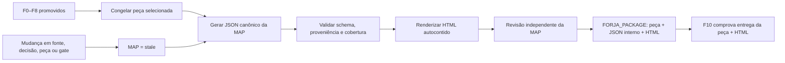

# Plano consolidado final v3 — execução do diagnóstico, design e MAP da FORJA

**Data:** 30/07/2026

**Revisão final:** 05/08/2026 — incorporada a auditoria sistêmica de prontidão, a revisão Fable 5 e a correção executável dos achados A3/A5/A7/A10/A12: despacho explícito sem fallback, invalidação por hash, compatibilidade de fachada, bloqueio visual sem falso-verde e revisão entre famílias antes de promoção.

**Status:** `READY_FOR_GITHUB_G0` — plano técnico fechado; a Onda 0 começa somente depois de o baseline GitHub G0 estar publicado e verificável. A ordem visual de 30/07/2026 já autoriza o bloqueio de saída descrito na § 26.1; cutovers do Diagnóstico v2 e da MAP continuam sujeitos às precondições próprias.

**Identificador:** `FORJA-DIAGNOSTIC-DESIGN-MAP-PLAN-v3`.

**Fonte canônica de execução:** este arquivo. Os planos 39 permanecem como estudos e evidência metodológica, mas não criam trilhas operacionais paralelas.

**Compatibilidade de caminho:** o nome físico com sufixo `_V2` é preservado para não quebrar referências existentes; a versão normativa interna deste conteúdo é v3.

**Escopo:** F2-A/F2-B, F3, F4, F5, F7, F8, pacote F9, entrega e aprendizado em F10.

**Base metodológica:** Van Aken & Berends, *Problem Solving in Organizations*; Rasiel & Friga, *The McKinsey Mind*.

**Planos confrontados:** `39_METODO_DIAGNOSTICO_VAN_AKEN_MCKINSEY.md` v4 e `39_VAN_AKEN_MCKINSEY_DIAGNOSTICO_E_DESIGN_FORJA.md`.

**Base FORJA confrontada:** PSO-Pet 1.0, contratos de fase, schemas N4, validadores, prompt headless, F2-B dialética, artefatos F3/F4, lastro, red team, ciclo AR, manifesto e estado vivo sanitizado.

---

## 1. Decisão executiva

Adotar o desenho de três camadas proposto na revisão cruzada, com dez decisões de fechamento:

1. **não criar outro subsistema paralelo ao PSO-Pet**;
2. **não substituir por atacado `forja_exploracao_100.py`**, porque ele também contém F2-B, injeção obrigatória de prompt, andaime, seleção de consulta e validação já consumida;
3. **não tratar dissimilaridade lexical, saturação declarada ou presença de campos como prova de qualidade**;
4. **reutilizar os artefatos N4 existentes como contrato canônico**, migrando para eles o que hoje está isolado em `PSO_CASE.json`;
5. **entregar ao advogado uma Memória Auditável da Peça obrigatória**, derivada dos artefatos canônicos e vinculada por hash à minuta exata.
6. **separar a evolução em duas trilhas promovíveis de forma independente**: Diagnóstico v2 e MAP;
7. **tratar consulta, pesquisa, auditoria e revisão como possíveis causas de reabertura**, não como fluxo linear irreversível;
8. **preservar um único ciclo de vida por conceito**, com IDs estáveis entre F2, F3, F4 e F10;
9. **entregar peça e MAP humana como bundle atômico ao advogado**, mantendo o JSON canônico como evidência interna protegida;
10. **executar cutovers pequenos, reversíveis e condicionados a evidência**, nunca uma troca conjunta de todas as fases.

O modelo consolidado é:

> **divergência forçada e auditável → convergência por hipótese, árvore e teste → pesquisa causal dirigida → história diagnóstica → auditoria das cem sementes → design por requisitos, alternativas e mecanismo → validação adversarial → aprendizado contextual.**

As cem perguntas deixam de ser a unidade obrigatória de produção. As cem **sementes** continuam obrigatórias como banco de cobertura e auditoria de omissão. A quantidade de perguntas efetivamente abertas passa a ser consequência da complexidade e das descobertas do caso.

Essa mudança é proposta, não vigente. A ordem de 14/07/2026 continua aplicável até determinação expressa do Igor no momento do corte de produção.

A execução pode começar sem essa determinação: a trilha Diagnóstico v2 permanece em sombra, e a trilha MAP pode chegar ao próprio cutover sem modificar a quantidade vigente de perguntas.

---

## 2. Auditoria crítica da v4 recebida

### 2.1 O que a v4 acertou

| Achado | Veredito |
|---|---|
| Os estudos são complementares por assimetria de método | **Correto.** Um aprofundou produção e falhas; o outro aprofundou contratos, schemas e desenho. |
| O PSO-Pet não entrou na operação | **Correto no plano operacional.** Há zero `PSO_CASE.json` no estado atual. |
| A cota de cem favorece preenchimento | **Sustentado pelos artefatos atuais.** Há repetição estrutural e baixa diversidade em campos-chave. |
| Divergência deve preceder a poda | **Correto.** Evita que a hipótese inicial empobreça o *problem mess*. |
| Cada pergunta precisa ter destino | **Correto.** Resposta, ramo, poda lastreada, consulta humana ou bloqueio. |
| Gates de mera presença são vulneráveis a Goodhart | **Correto e central.** Uma história diagnóstica boilerplate não é diagnóstico. |
| O piloto precisa de dono, agenda e consumo real | **Correto.** “Sombra” sem invocação não produz evidência prospectiva. |
| O corte exige governança explícita | **Correto.** A ordem vigente não é revogada por um plano técnico. |

### 2.2 Correções factuais e de formulação

Os números usados na v4 ficaram desatualizados durante a própria rodada:

- `[FATO]` há **52** diretórios em `state/`, não 51;
- `[FATO]` há **13** artefatos `F2_QUESTION_TREE.json`;
- `[FATO]` **11** deles têm exatamente cem perguntas;
- `[FATO]` em **9 dos 11**, as cem perguntas estão marcadas como respondidas;
- `[FATO]` os 11 artefatos somam **14** perguntas bloqueadas;
- `[FATO]` a diversidade de `caseAnchor` varia de **1 a 10** por artefato;
- `[FATO]` a diversidade de `whyItMatters` varia de **1 a 10**;
- `[FATO]` há **zero** `PSO_CASE.json`.

A conclusão sobre degeneração continua plausível, mas deve ser formulada com precisão:

> A cota fixa é um incentivo estrutural para preenchimento, e os artefatos atuais exibem sinais compatíveis com esse mecanismo. Ela não prova, sozinha, que toda resposta ou todo caso seja ruim.

### 2.3 “O PSO-Pet morreu” precisa de qualificação

O PSO-Pet não está invisível:

- aparece no `FORJA_SPEC_MANIFEST.json`;
- é documentado em `DOCUMENTACAO_TECNICA.md`;
- possui método, template, schema, exemplo, validador, benchmark e testes;
- possui auditoria retrospectiva e indicadores vetoriais.

Mas está **operacionalmente dormente**:

- nenhum contrato de fase o exige;
- nenhum gate produtivo depende dele;
- o runner não produz `PSO_CASE.json`;
- os três pilotos prospectivos nunca foram consumados;
- nenhum artefato por caso existe.

A formulação correta é:

> O PSO-Pet está catalogado e tecnicamente testado, mas órfão no fluxo de produção.

### 2.4 Sombra não é o problema; sombra sem execução é

O modo sombra é a proteção correta para uma reforma de contrato. O erro anterior foi não haver:

- evento que disparasse o piloto;
- responsável definido;
- caso agendado;
- artefato consumido pelo passo seguinte;
- comparação pareada;
- decisão de promoção com prazo.

Portanto, o plano consolidado mantém sombra, mas a executa pelo ciclo AR com casos, responsáveis, critérios e encerramento.

### 2.5 A revisão cruzada intelectual não equivale automaticamente ao gate formal

O confronto entre as duas famílias é uma revisão cruzada real do plano e aumenta sua robustez. Entretanto:

- `cross_model_review_verified` é gate operacional de F7/editorial;
- ele exige evidência no formato próprio da execução;
- a existência de dois documentos não o marca automaticamente como `pass`.

Este documento constitui **revisão crítica independente do plano**, não recibo automático de um gate de caso.

### 2.6 Pontos da v4 que precisavam de refinamento

| Proposta v4 | Problema residual | Correção consolidada |
|---|---|---|
| Congelar todas as perguntas antes das respostas | Exploração adaptativa descobre perguntas novas | congelar por **lotes versionados**, cada lote antes de suas respostas |
| Dissimilaridade por sobreposição de tokens | Termos jurídicos legítimos se repetem | usar como canário P1, combinado com novidade de âncora, ramo e efeito decisório |
| Última pergunta sem novidade prova saturação | Declaração facilmente fabricável | ledger de ganho marginal por ramo + revisão independente |
| Folhas obrigatoriamente sim/não | Questões jurídicas podem ser graduais ou condicionais | permitir `boolean`, `threshold`, `scenario`, `choice` e `open_discriminant` |
| Problema de percepção/meta bloqueia a peça | Pode haver produto legítimo de esclarecimento ou troca de veículo | bloquear apenas a rota inadequada; reenquadrar ou exigir decisão humana |
| Substituir `forja_exploracao_100.py` | Perde F2-B e consumidores existentes | extrair núcleo v2 e manter fachada/compatibilidade |
| Rejeitar v1 após o corte | Histórico precisa continuar auditável | v1 proibida somente para novos ciclos; leitor histórico permanece |
| Novo `diagnosticTree` isolado | Duplica `F3_REASONING_GRAPH.json` | tipar e ampliar o grafo existente |

---

## 3. Princípios de arquitetura

1. **Um conceito, um artefato canônico.** Não manter `PSO_CASE.json` e os JSONs N4 dizendo as mesmas coisas.
2. **Produção nova consome a saída anterior.** Campo não consumido é documentação, não fluxo.
3. **Gate de presença não prova qualidade.** Lastro, relações, contraste e revisão dão substância.
4. **Divergir antes de convergir.** A hipótese inicial não limita a primeira varredura.
5. **Hipótese é descartável.** O histórico de rejeição permanece.
6. **Poda é decisão material.** Exige razão, fonte e rechecagem adversarial.
7. **Uma fonte primária suficiente não precisa de duplicação artificial.**
8. **80/20 ordena esforço, não reduz rigor das afirmações.**
9. **Mecanismo não é garantia.** CIMO explicita uma teoria de funcionamento contextual.
10. **Compatibilidade histórica não autoriza protocolo velho em execução nova.**
11. **Perfis não são escolha oportunista do produtor.**
12. **Melhoria só existe depois de comparação prospectiva.**

---

## 4. Fluxo consolidado

```mermaid
flowchart LR
    F1["F1 · corpus e inventário"] --> D0["F2-D0 · problem mess"]
    D0 --> D1["F2-D1 · lotes divergentes congelados"]
    D1 --> D2["F2-D2 · respostas, lacunas e novas ramificações"]
    D2 --> C0["F2-C0 · problem frame"]
    C0 --> C1["F2-C1 · pergunta decisiva"]
    C1 --> C2["F2-C2 · hipóteses + QDT"]
    C2 --> C3["F2-C3 · issue tree + workplan"]
    C3 --> HB["F2-B · consulta humana seletiva"]
    C3 --> F3["F3 · pesquisa dirigida + grafo causal"]
    HB -->|"fecha lacuna sem mudar a rota"| F3
    HB -->|"altera frame, hipótese ou rota"| D2
    F3 --> DS["Gate · diagnostic story"]
    DS --> A["Auditoria das 100 sementes"]
    A -->|"omissão material"| D1
    A -->|"cobertura suficiente"| F4["F4 · requisitos + alternativas"]
    F4 --> M["F4 · mecanismo/CIMO + escolha + outline"]
    M --> F5["F5 · pesquisa oficial residual"]
    F5 --> F6["F6 · redação"]
    F5 -->|"fonte altera diagnóstico"| F3
    F5 -->|"fonte altera design"| F4
    F6 --> F7["F7 · testes, rival e red team"]
    F7 -->|"falha de hipótese ou lastro"| F3
    F7 -->|"falha de requisito ou rota"| F4
    F7 -->|"falha apenas de redação"| F6
    F7 --> F8["F8 · materialização e QA"]
    F8 -->|"fidelidade ou QA falha"| F6
    F8 --> AM["F9 · Memória Auditável da Peça<br/>JSON canônico + HTML"]
    AM -->|"achado material"| IR["router de invalidação"]
    IR --> D2
    IR --> F3
    IR --> F4
    IR --> F6
    IR --> F8
    AM --> PKG["F9 · bundle obrigatório<br/>peça + MAP HTML"]
    PKG --> F10["F10 · entrega íntegra + aprendizado CIMO"]
```



Não se criam novas fases numeradas. D0–D2 e C0–C3 são blocos internos de F2.

Toda reabertura registra `trigger`, artefato invalidado, versão anterior, fase responsável e razão. Nenhuma fase posterior corrige silenciosamente o artefato de uma fase anterior.

---

## 5. Camada D — divergência forçada

### 5.1 Objetivo

Mapear o emaranhado antes de escolher a explicação:

- atos e cronologia;
- versões e interesses;
- fatos favoráveis e desfavoráveis;
- prova e lacunas;
- limites do veículo;
- objeções da parte contrária;
- caminhos de negativa do julgador;
- riscos laterais;
- alternativas de intervenção;
- comunicação e execução.

### 5.2 As dez óticas permanecem

As óticas atuais continuam como pauta de varredura:

1. mandato e resultado;
2. fatos e cronologia;
3. prova e fontes;
4. processo e competência;
5. direito e precedentes;
6. adversário e julgador;
7. riscos, ética e impactos;
8. alternativas e soluções;
9. quantificação e execução;
10. comunicação, visual e validação.

Elas deixam de exigir dez perguntas cada. Cada ótica encerra com:

- perguntas materiais abertas;
- questões cobertas por outro ramo;
- declaração justificada de não aplicabilidade;
- sementes ainda sem destino;
- razão para encerrar ou abrir novo lote.

### 5.3 Congelamento por lotes

Não congelar toda a exploração uma única vez. Usar lotes:

```text
batchId
parentBatchId
trigger
questions[]
contentHash
frozenAt
answeredAt
newMaterialNodes[]
reopenedBranches[]
```

Regras:

- o lote é gravado e recebe hash antes de ser respondido;
- nova evidência pode criar outro lote;
- o novo lote declara qual resposta, contradição ou lacuna o originou;
- pergunta inserida retroativamente em lote respondido é P0;
- correção legítima cria versão nova, não apaga a anterior.

### 5.4 Especificidade

Pergunta material deve apontar para ao menos um dos seguintes:

- ato;
- documento;
- data;
- sujeito;
- pedido;
- valor;
- norma;
- tese;
- tensão identificada;
- lacuna nominada.

O identificador deve existir no inventário ou ser marcado como candidato ainda não validado.

### 5.5 Novidade, não apenas dissimilaridade

Cada pergunta declara:

- `caseAnchorIds`;
- `branchId`;
- `expectedDecisionEffect`;
- `uncertaintyReduced`;
- `noveltyReason`.

Sobreposição textual alta é somente **canário P1**. Torna-se P0 apenas quando coincide com ausência de nova âncora, novo ramo, nova incerteza ou novo efeito decisório.

### 5.6 Perspectivas forçadas

Em casos completos ou intensivos, a divergência deve conter:

- pergunta formulada pela melhor defesa adversária;
- pergunta formulada pelo julgador inclinado a negar;
- pergunta que testa erro no comando recebido;
- pergunta que testa se o veículo escolhido é a própria causa do problema.

---

## 6. Camada C — convergência estruturada

### 6.1 `problemFrame`

Campos:

```text
presentedProblem
currentSituation
currentSituationSupportIds
desiredSituation
normOrCriterion
performanceGap
problemType
problemOwner
decisionOwner
interventionScope
outOfScope
boundaryConditions
reframedProblem
reframingReason
humanDecisionId
```

`problemType`:

- `real`;
- `perception_unconfirmed`;
- `goal_unfeasible_in_current_route`;
- `mixed`;
- `undetermined`.

Consequência:

- `real`: prossegue;
- `perception_unconfirmed`: pesquisa discriminante ou produto explicativo;
- `goal_unfeasible_in_current_route`: rota atual bloqueada e alternativa proposta;
- `mixed`: separa componentes;
- `undetermined`: não abre F4.

### 6.2 Pergunta decisiva

Não exigir apenas resposta binária. Tipos permitidos:

- `boolean`;
- `threshold`;
- `scenario`;
- `choice`;
- `open_discriminant`.

Campos:

```text
text
questionType
decisionOwner
jurisdictionalScope
acceptableOutcomes
nonOutcomes
supportIds
stabilityStatus
```

### 6.3 `hypothesisLedger`

Cada hipótese registra:

- enunciado;
- premissas necessárias;
- sinais favoráveis;
- sinais contrários;
- explicação rival;
- teste rápido;
- teste aprofundado;
- histórico de revisão;
- estado.

Estados:

- `candidate`;
- `survives_quick_test`;
- `needs_deep_test`;
- `blocked`;
- `reframed`;
- `rejected`.

Nenhuma hipótese é “confirmada” apenas pelo QDT.

### 6.4 QDT jurídico

Usar primeiro para premissas eliminatórias:

- prazo;
- competência;
- veículo;
- cognição;
- legitimidade;
- interesse;
- preclusão;
- requisito cumulativo;
- disponibilidade do ato;
- existência de fundamento autônomo.

Cada veredicto exige:

```text
testId
hypothesisId
assumption
method
supportIds
result
resultScope
nextAction
```

Resultado sem fonte é `blocked`, não `refuted` nem `supported`.

### 6.5 `issueTree`

Cada nó registra:

```text
nodeId
parentId
nodeType
question
answerType
materiality
hypothesisIds
caseAnchorIds
status
supportIds
crossLinks
```

Tipos de árvore:

- diagnóstica: por que a situação existe;
- decisória: o que precisa ser verdadeiro para a rota funcionar;
- solução: que intervenções podem atuar.

MECE significa completude defensável. Sobreposições legítimas ficam em `crossLinks`.

### 6.6 Destino obrigatório de cada pergunta

Cada pergunta divergente precisa terminar como:

- `answered_and_mapped`;
- `research_work_item`;
- `human_consultation`;
- `pruned_with_support`;
- `blocked`;
- `not_applicable_with_reason`.

Pergunta sem destino é P0.

### 6.7 `diagnosticWorkplan`

Cada folha material produz item com:

1. questão e hipótese;
2. análise;
3. dado necessário;
4. fonte;
5. produto esperado;
6. responsável;
7. prazo;
8. resultado que muda a decisão;
9. regra de parada.

Esse bloco substitui `downstreamTargets` genérico. O array atual pode permanecer como índice de fase, mas não vale como roteamento suficiente.

### 6.8 Ciclo de vida canônico dos conceitos

| Conceito | Criação | Promoção/consumo | Regra de não duplicação |
|---|---|---|---|
| pergunta decisiva | F2 cria `decisiveQuestionId` em estado `provisional` | F4 aponta para o mesmo ID e registra a decisão em `F4_SIGNATURE_BRIEF.json` | F4 não reescreve outra pergunta sem registrar `supersedesId` e invalidar dependentes |
| hipótese | F2 cria `hypothesisId` e estado inicial | F3 testa; F4 aponta para o mesmo ID em `F4_THESIS_MATURITY.json` | maturidade e conselho não copiam o enunciado como nova autoridade |
| requisito | F2/F3 originam `requirementId` | F4 congela e F7 testa | alteração posterior cria nova versão e reabre os testes afetados |
| CIMO | F4 cria `cimoId` em estado `designed` | F10 acrescenta observação em estado `observed`, referindo o mesmo ID | observação não sobrescreve a teoria de design nem é tratada automaticamente como causalidade |

Cada consumidor declara a versão aceita e resolve o conteúdo pela fonte canônica. Cópia de conveniência pode existir apenas como projeção derivada, com `sourceArtifactId`, `sourceObjectId` e hash.

---

## 7. F3 — pesquisa e grafo causal

### 7.1 Não criar um `diagnosticTree` paralelo

Ampliar `F3_REASONING_GRAPH.json`.

Novos tipos de nó:

- `symptom`;
- `candidate_cause`;
- `supported_candidate_cause`;
- `constraint`;
- `rival_explanation`;
- `mechanism`;
- `consequence`;
- `hypothesis`;
- `test`;
- `evidence`;
- `intervention_lever`.

Novas relações:

- `causes`;
- `contributes_to`;
- `enables`;
- `blocks`;
- `explains`;
- `rival_of`;
- `tested_by`;
- `discriminates`;
- `constrains`;
- `acts_on`;
- além das relações já existentes.

Toda aresta material exige:

```text
reason
supportIds
status
scope
testId
```

`confidence` pode orientar revisão, mas não substitui status probatório.

`supported_candidate_cause` significa causa candidata sustentada dentro do escopo e do padrão de evidência declarados. Não significa causalidade definitivamente demonstrada. O nó registra `evidenceStandard`, `scope`, `rivalStatus` e `limitations`.

### 7.2 Saturação auditável

Usar `stopDecision` por ramo:

```text
branchId
materialQuestionsResolved
blockedQuestions
lastBatchId
newMaterialNodeCount
decisionChanged
remainingUncertainty
marginalGainAssessment
reviewerDecision
```

Critério:

- nenhuma questão material sem destino;
- rival principal testada;
- nova coleta não altera árvore, rota ou requisito;
- bloqueios residuais estão explícitos;
- revisor independente aceita a parada.

Uma frase “atingiu saturação” não passa.

### 7.3 História diagnóstica

Fica no topo do próprio `F3_REASONING_GRAPH.json`:

```text
diagnosticStory
interventionLeverIds
principalCauseIds
rivalExplanationIds
boundaryConditionIds
stopDecision
```

Gate:

> O problema, as causas, o mecanismo, a consequência e o elo atacável formam uma cadeia coerente, apoiada ou explicitamente bloqueada.

---

## 8. Camada A — auditoria das cem sementes

### 8.1 Função

Depois de fechar provisoriamente a árvore, executar as cem sementes do protocolo atual contra ela.

Para cada semente:

```text
seedId
lens
coverageStatus
coveredByNodeIds
notApplicableReason
reopenedQuestionId
reviewerDecision
```

Estados:

- `covered`;
- `covered_by_equivalent`;
- `not_applicable`;
- `material_omission`;
- `pending_review`.

### 8.2 Regra de reabertura

`material_omission`:

- cria nova pergunta em novo lote;
- reabre o ramo;
- invalida a parada;
- registra qual decisão poderia mudar.

### 8.3 O que deixa de existir

- exigência de responder cem itens como se tivessem o mesmo valor;
- dez respostas artificiais por ótica;
- contagem como principal prova de profundidade.

### 8.4 O que permanece

- as dez óticas;
- as cem sementes;
- proveniência;
- `supportIds`;
- bloqueios materiais;
- duas ou mais soluções quando o perfil exigir;
- handoff;
- revisão humana.

---

## 9. F2-B — consulta humana já existe e deve ser reutilizada

`forja_exploracao_100.py` já possui:

- `select_consultation_questions`;
- `validate_dialectic`;
- limite de conforto de doze perguntas;
- autoridade humana;
- política de silêncio;
- proibição de default para fato, prova e autorização;
- recibo humano de envio;
- ledger de decisões;
- distinção entre declaração do escritório e fato provado.

Não criar novo fluxo de entrevista.

### 9.1 Aprimoramento

Acrescentar prioridade estruturada:

```text
priorityFactors:
  materiality
  uncertainty
  routeChangePower
  irreversibility
```

Evitar produto numérico opaco. Usar ordem lexicográfica por faixas:

1. bloqueia identidade, prazo, autorização ou veículo;
2. pode eliminar rota;
3. muda tese, pedido ou prova;
4. reduz risco material;
5. apenas melhora apresentação.

---

## 10. F4 — design usando os artefatos existentes

### 10.1 `F4_THESIS_MATURITY.json`

Reutilizar para:

- hipóteses que sobreviveram a F3;
- maturidade;
- melhor objeção;
- explicações rivais;
- decisão Helena/Cícero;
- gatilhos de ativação ou abandono.

Não duplicar esse conteúdo em `PSO_CASE.json`.

### 10.2 `F4_CASE_ACCEPTANCE_TESTS.json`

Reutilizar para requisitos verificáveis:

- funcionais;
- destinatário;
- condições de contorno;
- restrições negociáveis;
- premissas sobreviventes do QDT;
- condições de falha;
- aderência problema → solução;
- aprovação do outline antes do texto final.

O artefato já possui evidência temporal de congelamento antes do texto.

### 10.3 `F4_DECISION_FACTOR_MAP.json`

Reutilizar para:

- critérios de escolha;
- trade-offs;
- fatores decisórios do destinatário;
- consequências de cada rota;
- riscos residuais.

Não produzir score único de vitória.

### 10.4 `F4_SIGNATURE_BRIEF.json`

Já contém:

- pergunta decisiva;
- rotas;
- teses;
- âncoras candidatas;
- melhor objeção;
- decisão;
- decisão humana;
- `motherSentence`;
- cobertura de famílias de tese.

Ampliar cada rota com:

```text
requirementIds
mechanism
directOutcome
evidenceStrategy
boundaryConditions
switchTriggers
designRationaleCIMO
outlineDesign
minimumSpecification
```

Gates:

- `design_requirements_frozen`;
- `alternatives_substantively_distinct`;
- `selected_route_mechanism_explained`;
- `boundary_conditions_preserved`;
- `outline_approved_before_detailing`;
- `human_route_decision_recorded`.

### 10.5 `F4_COVERAGE_MATRIX.json`

Preservar sua função de cobertura da peça e ligação a parágrafos. A auditoria das sementes fica em F2; não sobrecarregar a matriz F4 com duas semânticas diferentes.

### 10.6 CIMO em dois momentos

**F4 — justificativa do design**

- `cimoId`;
- contexto;
- intervenção;
- mecanismo;
- resultado direto;
- limites.

**F10 — aprendizado**

- o mesmo `cimoId` de F4;
- contexto observado;
- intervenção realmente executada;
- mecanismo que parece ter operado;
- resultado direto observado;
- explicações rivais;
- limites de transferência.

F10 distingue quatro marcos: `delivered`, `lawyer_feedback_observed`, `protocol_observed` e `external_outcome_observed`. Entrega ou feedback não demonstram eficácia jurídica. Atribuição causal só pode ser promovida como aprendizado quando o mecanismo, as explicações rivais, o contexto e as limitações estiverem explicitados e revisados.

Frase-gate:

> Solução sem mecanismo explícito não é design justificado; é preferência.

---

## 11. Memória Auditável da Peça — produto obrigatório de F9/F10

### 11.1 Decisão de produto

Toda nova peça encaminhada ao advogado para revisão deve ser acompanhada por uma **Memória Auditável da Peça — MAP**. Ela integra o próprio bundle de entrega ao advogado; não é relatório opcional nem arquivo produzido depois do envio.

O produto tem duas representações inseparáveis:

| Artefato | Função | Autoridade |
|---|---|---|
| `F9_MEMORIA_AUDITAVEL_PECA.json` | registro interno estruturado, validável e reprocessável | fonte canônica protegida da memória |
| `F9_MEMORIA_AUDITAVEL_PECA.html` | documento humano, autocontido, com diagramas e navegação | companion obrigatório enviado ao advogado, derivado do JSON |

Regras:

- não criar uma nova fase numerada; a MAP é um produto obrigatório de F9;
- o HTML é gerado do JSON e não pode conter conclusão ausente no canônico;
- o `FORJA_PACKAGE.json` inclui peça, JSON canônico e HTML com IDs, funções, fronteiras e hashes separados;
- o bundle efetivamente enviado contém a peça selecionada e o HTML da MAP; o JSON permanece evidência interna e só pode ser exportado por decisão humana autorizada;
- F10 somente fecha quando comprovar que a versão exata da peça e a versão exata do HTML da MAP integraram a mesma entrega ao advogado;
- PDF da MAP pode ser derivado para impressão, mas não substitui o HTML como companion controlado nem o JSON como fonte canônica;
- os rótulos `internal_review_only`, `attorney_work_product` e `neverProtocol` são obrigatórios: a MAP não transforma minuta em peça liberada para protocolo e nunca integra o conjunto destinado ao tribunal.

Contrato proposto:

```text
protocolVersion: FORJA-AUDIT-MEMORY-v1
canonicalArtifact: F9_MEMORIA_AUDITAVEL_PECA.json
humanArtifact: F9_MEMORIA_AUDITAVEL_PECA.html
deliveryRole: mandatory_audit_companion
classification: attorney_work_product
neverProtocol: true
allowedRecipientClass: internal_lawyer
```

### 11.2 O que “memória” significa

A MAP registra a **trilha verificável do trabalho**, não um despejo de raciocínio privado do modelo.

Ela deve expor:

- qual questão foi enfrentada;
- quais documentos e fontes foram efetivamente usados;
- quais métodos e gates foram executados;
- quais hipóteses, alternativas e objeções foram consideradas;
- qual decisão foi tomada, por quem e com qual base verificável;
- quais correções ocorreram e qual artefato foi invalidado;
- quais limitações, lacunas e decisões humanas continuam abertas;
- como cada conclusão relevante chega à peça entregue.

Ela não deve expor:

- cadeia de pensamento privada ou rascunho mental do modelo;
- prompts de sistema, instruções internas, segredos ou credenciais;
- mensagens, autos ou documentos integrais sem necessidade;
- afirmações de certeza superiores ao lastro disponível;
- caminhos locais absolutos como se fossem links utilizáveis pelo advogado.

As unidades auditáveis são **decisão + alternativa + evidência + regra/teste + resultado**, e não narrativa livre sobre “o que a IA pensou”.

### 11.3 Fronteira de proveniência

A MAP é construída somente a partir de artefatos canônicos promovidos e de registros operacionais autorizados:

- identidade e comando do caso;
- inventário do corpus e relatório de ingestão;
- `PHASE_RESULT`, eventos e hashes das fases;
- F2: exploração, pergunta decisiva, hipóteses, QDT, árvore, workplan e auditoria das sementes;
- F3: ledger de fatos/fontes, pesquisa, grafo causal e história diagnóstica;
- F4: teses, testes, fatores, rotas, CIMO, decisões humanas e outline;
- F5: pesquisa oficial residual;
- F6: versão redigida selecionada;
- F7: auditorias, red team, revisão cruzada, correções e gates;
- F8: DOCX/PDF selecionados, fidelidade e QA visual;
- F9: seleção do entregável e manifesto do pacote.

Cada afirmação material da MAP deve carregar:

```text
artifactId
sourceHash
locator
provenanceType
status
```

`provenanceType` usa, no mínimo:

- `source_fact`;
- `human_statement`;
- `human_decision`;
- `model_inference`;
- `method_result`;
- `unverified`;
- `correction`;
- `limitation`.

Não basta apontar para a existência de um arquivo. Conclusão jurídica ou factual precisa chegar a uma âncora verificável; decisão metodológica precisa chegar ao gate, teste ou decisão humana correspondente.

### 11.4 Arquitetura de leitura em três níveis

O HTML deve servir simultaneamente ao advogado que precisa revisar em minutos e ao auditor que precisa reconstruir o processo.

**Nível A — síntese executiva**

- identidade da demanda e versão exata da peça;
- questão decisiva e produto solicitado;
- rota selecionada e conclusão central;
- cinco fundamentos/âncoras mais importantes;
- riscos, bloqueios e decisões humanas ainda necessárias;
- veredito dos gates, sem esconder reprovações.

**Nível B — memória metodológica**

- linha do tempo F0–F9;
- execução das camadas divergência, convergência e auditoria;
- hipóteses, rivais, podas e testes discriminantes;
- plano e resultado da pesquisa;
- desenho CIMO e alternativas descartadas;
- conselho Helena/Cícero e destino dado a cada recomendação;
- histórico de correções, invalidações e reexecuções;
- ligação entre diagnóstico, design, redação e pedidos.

**Nível C — apêndice técnico auditável**

- inventário de artefatos e hashes;
- matriz afirmação → fonte → trecho/localizador → parágrafo da peça;
- matriz de gates com produtor, revisor, horário e evidência;
- versões e diffs materiais;
- pendências e itens `not_applicable` com justificativa;
- manifesto dos anexos do pacote;
- protocolos, versões de schema e identificadores de execução.

### 11.5 Conteúdo mínimo obrigatório

| Bloco | Conteúdo verificável | Origem preferencial |
|---|---|---|
| Identificação | caso, produto, destinatário, versão e hashes | manifesto + F9 |
| Escopo | comando, limites e o que não foi autorizado | intake + decisões humanas |
| Corpus | lido, parcialmente acessível, ilegível, ausente e não lido | F1 |
| Cronologia | atos, versões e marcos processuais relevantes | F1/F3 |
| Método executado | técnicas realmente aplicadas, não apenas previstas | resultados F2–F8 |
| Diagnóstico | problem frame, pergunta, hipóteses, rival, QDT e história | F2/F3 |
| Pesquisa | questões, fontes consultadas, resultado e parada | F3/F5 |
| Design | requisitos, alternativas, mecanismo/CIMO e rota escolhida | F4 |
| Redação | blueprint, versão escolhida e alterações substantivas | F4/F6/F7 |
| Evidência | afirmações e conclusões ligadas a fontes e parágrafos | ledgers + coverage matrix |
| Auditoria | gates executados, achados P0/P1, red team e QA | F7/F8 |
| Correções | problema, causa, correção, reexecução e resultado | eventos + invalidation graph |
| Decisões humanas | quem decidiu, o quê, quando e sobre qual versão | recibos/ledgers autorizados |
| Limitações | lacunas, inferências, controvérsias e risco residual | F2/F3/F7 |
| Entrega | pacote preparado, arquivos exatos, hashes, política e status `pending_send` | F9 |
| Aprendizado pré-entrega | hipótese de melhoria e limite de transferência observável até o fechamento do pacote | F7/F9/CIMO |

Bloco sem incidência não desaparece. Deve constar como `not_applicable`, com justificativa verificável.

### 11.6 Diagramas obrigatórios

O HTML deve incorporar, sem dependência externa:

1. **fluxo do caso F0–F10**, com status, reaberturas e gates;
2. **árvore diagnóstica/grafo causal**, mostrando questão, ramos, causas, rival e ponto de parada;
3. **mapa evidência → conclusão → trecho da peça**, permitindo rastrear os fundamentos decisivos;
4. **linha do tempo de versões e correções**, quando houver mais de uma versão material.

Os diagramas são derivados dos mesmos IDs do JSON. Um desenho manual sem correspondência com os dados falha. Para segurança e portabilidade, usar SVG inline sanitizado; não carregar Mermaid, JavaScript, fontes ou imagens remotas na abertura.

### 11.7 Ciclo de geração e invalidação



Regras de estado:

- gerar somente depois de congelar o hash da peça selecionada e concluir F8;
- produtor da MAP e revisor não podem ser a mesma execução;
- qualquer mudança em fonte, diagnóstico, design, peça, auditoria ou render marcado em `sourceHashes` muda o status para `stale`;
- MAP `stale`, parcialmente regenerada ou alterada manualmente não entra no pacote;
- correções são acrescentadas ao ledger; não se sobrescreve silenciosamente a versão anterior;
- o pacote preserva a MAP usada em cada entrega, mesmo após existir versão posterior;
- nova versão da peça exige nova MAP e novo manifesto.

Modelo de hash, sem dependência circular:

1. congelar hashes das fontes, decisões, artefatos de fase e peça selecionada;
2. serializar de modo determinístico o bloco `payload` do JSON e calcular `canonicalPayloadHash` apenas sobre ele;
3. renderizar o HTML a partir desse payload e incorporar `canonicalPayloadHash` em metadado visível e máquina-legível;
4. calcular `htmlSha256` depois da renderização;
5. o manifesto do pacote registra `petitionSha256`, `canonicalJsonSha256`, `canonicalPayloadHash` e `htmlSha256`;
6. o recibo F10 verifica os hashes dos membros realmente enviados, sem recalcular ou alterar a MAP.

Autoridade de revisão:

- o produtor registra `producerRunId`; o revisor técnico registra `reviewerRunId` distinto;
- revisão por modelo distinto verifica coerência, omissões, proveniência e limites, mas não libera juridicamente a peça;
- o advogado registra recibo humano apenas para decisões de rota, utilidade e correções que exijam autoridade humana;
- `independent_review_passed` exige identidade de execução distinta, escopo declarado, achados e hash revisado;
- revisão sem recibo verificável é `pending_review`, nunca `pass`.

O fechamento ocorre em dois tempos, sem fabricar conhecimento futuro:

1. **snapshot F9:** a MAP anexada descreve tudo que ocorreu até o pacote e declara a entrega como `pending_send`;
2. **recibo F10:** o `F10_DELIVERY_INTEGRITY.json` registra identificador externo, `deliveredAt`, `packageId` e hashes da peça e do HTML efetivamente entregues;
3. **dossiê final arquivado:** uma visão derivada pode reunir MAP + recibo F10 + retorno posterior, mas não altera o HTML que foi enviado;
4. **aprendizado pós-entrega:** feedback, versão humana e resultado direto ficam no ramo F10 e somente integram uma MAP futura se houver nova entrega.

Assim, o advogado recebe a memória completa disponível no instante da entrega, e o sistema preserva também a prova auditável do ato de entregar.

### 11.8 Gates bloqueantes

**F9 — construção e pacote**

- `audit_memory_canonical_json_valid`;
- `audit_memory_html_derived_from_canonical_json`;
- `audit_memory_bound_to_selected_petition_hash`;
- `audit_memory_source_hashes_current`;
- `audit_memory_method_steps_evidenced`;
- `audit_memory_material_conclusions_traceable`;
- `audit_memory_corrections_and_limitations_disclosed`;
- `audit_memory_diagrams_consistent_with_data`;
- `audit_memory_privacy_and_secret_scan_passed`;
- `audit_memory_independent_review_passed`;
- `audit_memory_release_boundary_passed`;
- `package_contains_petition_and_audit_memory`;
- `protocol_export_excludes_audit_memory`.

**F10 — entrega**

- `audit_memory_pre_send_hash_matches_package`;
- `audit_memory_included_in_actual_lawyer_delivery`;
- `audit_memory_post_delivery_identifier_verified`;
- `delivered_petition_and_memory_share_package_id`;
- `management_records_audit_memory_delivery`.

Nenhum score agregado compensa falha nesses gates. Ausência da MAP impede fechar a entrega como cumprida.

### 11.9 Portabilidade do HTML

> **Expurgo de 04/08/2026 (ordem do Igor).** Esta seção trazia uma política de
> classificação da informação — `attorney_work_product`, allowlist de exportação,
> restrição de destinatário por recibo humano, retenção, minimização de dados
> pessoais. Saiu inteira. São petições judiciais e uso interno do escritório; a
> ordem foi "tira tudo do plano de LGPD ou sigilo". O que ficou abaixo é requisito
> técnico de arquivo, não cerimônia de conformidade.

O HTML deve ser um arquivo estático, autocontido, acessível e imprimível:

- `lang="pt-BR"`, sumário navegável e hierarquia semântica;
- CSS e SVG inline; zero dependência de rede;
- política de conteúdo restritiva e nenhum script ativo;
- sem telemetria, pixels, chamadas externas ou links `file://`;
- sem caminhos absolutos do computador — é a mesma regra P0 do corpo da peça;
- referências a anexos por `artifactId` e nome relativo ao pacote;
- escape e sanitização de todo conteúdo vindo de fontes;
- nenhum segredo, credencial ou token no arquivo;
- contraste, texto alternativo e versão de impressão;
- indicação visível de `internal_review_only`, versão, data e hash da peça vinculada.

Uma regra de produto permanece, e ela não é de sigilo: a MAP é documento interno
de revisão e **não pode entrar no pacote protocolável nem no e-mail ao tribunal**.
Um memorando de auditoria anexado a uma petição é defeito de produto. Há teste
negativo cobrindo isso.

### 11.10 Uso pelo advogado e circuito de correção

Cada conclusão, risco, pergunta aberta e correção recebe ID estável. O advogado pode devolver observações referindo-se a esses IDs.

O retorno segue esta regra:

1. comentário é vinculado à conclusão, fonte, decisão ou etapa correspondente;
2. classifica-se se o problema é de corpus, diagnóstico, pesquisa, design, redação, auditoria ou comunicação;
3. a fase responsável é reaberta pelo grafo de invalidação;
4. peça e MAP são regeneradas sobre novos hashes;
5. a correção entra no histórico e pode originar candidato de aprendizado;
6. nenhuma correção metodológica vira regra geral sem revisão, fixture e teste prospectivo.

Assim, a MAP serve ao mesmo tempo para revisão da peça, auditoria do método e melhoria da FORJA.

### 11.11 Compatibilidade e cutover

- entregas históricas continuam legíveis sem reconstrução retroativa obrigatória;
- reenvio ou reabertura material após o cutover exige MAP;
- durante o piloto, a MAP roda em sombra e não pode atrasar a entrega vigente;
- após promoção, toda nova entrega ao advogado exige a peça + HTML no bundle e preserva o JSON canônico no pacote interno;
- exceção operacional somente por decisão humana registrada, com motivo e prazo de saneamento; não pode liberar protocolo nem marcar a trilha completa.

O cutover da MAP usa flag própria e não depende do cutover do Diagnóstico v2. A ordem de 14/07/2026 sobre as cem perguntas não impede a promoção da MAP.

### 11.12 Contrato do bundle de revisão

O modelo vigente de um único `selectedArtifactId` permanece como alias da peça selecionada para compatibilidade, mas F9/F10 passam a validar um bundle versionado:

```text
bundleProtocolVersion: FORJA-LAWYER-REVIEW-BUNDLE-v1
packageId
selectedArtifactId: <peça selecionada>
members[]:
  artifactId
  kind
  sha256
  deliveryRole
  releaseBoundary
requiredDeliveryMemberIds[]
internalEvidenceMemberIds[]
```

Papéis mínimos:

- peça selecionada: `deliveryRole=primary_petition`, `releaseBoundary=internal_review`;
- HTML da MAP: `deliveryRole=mandatory_audit_companion`, `releaseBoundary=internal_review_never_protocol`;
- JSON da MAP: `deliveryRole=internal_audit_evidence`, `releaseBoundary=internal_only`.

O bundle é atômico para a entrega ao advogado: se a peça ou o HTML estiver ausente, divergente ou associado a outro `packageId`, F10 não fecha. O exportador protocolável usa uma allowlist separada e rejeita qualquer membro com `neverProtocol=true`.

---

## 12. Recursos existentes: decisão de integração

| Recurso | Estado atual | Decisão |
|---|---|---|
| Trilha visual (planos 24 e 25) e trilha de lastro documental (protocolo + plano 41) | frentes de 03/08/2026, com efeito em F3, F5, F7, F8, F9 e F10 | **integrar por referência** — estado e fronteiras na § 26; não copiar conteúdo para cá |
| `planejamento/14_METODO_VAN_AKEN_APLICADO_A_PETICOES.md` | base metodológica sólida | **manter** como referência conceitual |
| `forja_pso_pet.py` | validador/benchmark sombra, não invocado | **decompor e integrar** suas regras aos validadores N4 |
| `pso_schemas/pso_case.schema.json` | schema paralelo e permissivo | **não promover**; aposentar após migração |
| `PSO_CASE_EXAMPLE.json` | fixture útil | **converter** em fixtures dos artefatos N4 |
| `templates/F4_METODO_SOLUCAO_PROBLEMA_PETICAO.md` | visão humana completa | **gerar a partir dos JSONs**, não usar como segunda fonte |
| `F2_QUESTION_TREE.json` | artefato canônico consumido | **versionar e ampliar** |
| `forja_exploracao_100.py` | validação F2-A + F2-B + prompt | **preservar como fachada**; extrair núcleo v2 |
| `forja_headless.py` | injeta prompts obrigatórios | **atualizar no cutover** para o protocolo v2 |
| `F3_REASONING_GRAPH.json` | grafo estrutural aberto | **tipar causalidade e diagnóstico** |
| `forja_reasoning.py` | valida árvore, grafo, teses e brief | **estender** e manter como validador central |
| `F4_THESIS_MATURITY.json` | teses, objeções e conselho | **reusar** para maturidade das hipóteses |
| `F4_CASE_ACCEPTANCE_TESTS.json` | testes congelados e temporalidade | **reusar** para requisitos e falsificabilidade |
| `F4_DECISION_FACTOR_MAP.json` | fatores e fontes decisórias | **reusar** para critérios e trade-offs |
| `F4_SIGNATURE_BRIEF.json` | pergunta, rotas, seleção humana | **reusar e ampliar** para mecanismo/CIMO/outline |
| `F4_COVERAGE_MATRIX.json` | cobertura do draft | **preservar sem sobrecarga** |
| `forja_lastro.py` | transcrição e lastro real | **reusar** em QDT, poda e causalidade |
| `F7_METACOGNITIVE_AUDIT.json` | premissas e mudanças | **reusar** para auditoria de viés e rival |
| red team e `cross_model_review_verified` | defesa independente | **aplicar em F7 e no piloto**, com evidência própria |
| `forja_n4_invalidation.py` | invalidação por dependência | **ampliar** para mudanças em diagnóstico e requisitos |
| `forja_run_metrics.py` | métricas de árvore/grafo | **ampliar** com profundidade decisória e retrabalho |
| ciclo AR/autoresearch | shadow, pares, blind, canários | **usar como infraestrutura do piloto** |
| `learning_registry`/F10 | promoção contextual de regras | **usar** para CIMO e lições pós-caso |
| eventos, `PHASE_RESULT` e invalidation graph | linhagem operacional | **usar como fonte da MAP**, sem copiar estado bruto |
| `forja_package.py` / `FORJA_PACKAGE.json` | pacote hash-bound limitado a tipos atuais | **versionar** para bundle com peça, MAP HTML e JSON interno; preservar leitor anterior |
| `phase_contracts/F9.json` e `phase_contracts_n4/F9.json` | contrato do pacote | **acrescentar** MAP JSON/HTML, revisão e gates |
| `forja_delivery.py` | trilha bloqueante de entrega | **acrescentar** elo da MAP efetivamente anexada |
| `F10_DELIVERY_INTEGRITY.json` | integridade de um artefato selecionado | **versionar** para verificar todos os membros obrigatórios entregues |
| `ARTIFACT_CATALOG.json`, `ARTIFACT_SPECS`, `VALIDATORS`, `FLAG_FILES` | registries parcialmente paralelos | **concluir P-J04 antes dos novos artefatos**; catálogo declara owner/schema/validator/flag e preflight detecta drift |
| `forja_n4_common.py` | specs manuais atuais | **manter como fachada gerada/compatível** durante a migração do registry |
| `FORJA-LEGAL-RELEASE-v2` | política de liberação vigente | **preservar integralmente** até o cutover MAP; criar v3 aditiva com fronteira `neverProtocol` e bundle interno |
| `forja_n4_invalidation.py` | triggers sem diagnóstico v2/MAP | **acrescentar** `question_tree`, `diagnostic_decision`, `route_selection`, `source_change`, `petition_change` e `audit_memory` com dependências exatas |
| manifesto, catálogo e contratos | fontes de autoridade | **versionar por trilha**, nunca em um único big-bang |

---

## 13. Contrato proposto para `F2_QUESTION_TREE.json`

### 13.1 Versão

```text
protocolVersion: FORJA-F2A-DIAGNOSTIC-v2
```

### 13.2 Blocos

```text
presentedProblem
problemMess
explorationBatches
questions
problemFrame
decisiveQuestion
hypothesisLedger
quickTests
issueTree
diagnosticWorkplan
dialecticConsultation
decisionLedger
questionDestinations
seedCoverageAudit
openDecisiveQuestions
draftRelease
```

### 13.3 Compatibilidade

- v1 continua legível e auditável em casos históricos;
- novos ciclos, depois do cutover, exigem v2;
- protocolo ausente ou diferente falha fechado;
- novo caso usando v1 após o corte recebe erro explícito;
- caso histórico v1 não precisa ser reescrito;
- consumidores devem declarar quais versões aceitam;
- `forja_reasoning.py` despacha explicitamente por `protocolVersion`; versão desconhecida não pode cair em validação genérica;
- v2 em sombra não substitui, não enfraquece e não contorna os gates estritos do v1 vigente.

---

## 14. Gates substantivos

### F2

- `problem_frame_evidenced`;
- `problem_route_validated_or_reframed`;
- `divergent_batches_hash_bound`;
- `material_questions_have_destinations`;
- `initial_and_rival_hypotheses_testable`;
- `quick_tests_grounded`;
- `issue_tree_decision_complete`;
- `workplan_bound_to_sources`;
- `human_questions_selective_and_authorized`;
- `seed_bank_audited`;
- `no_detected_material_omission_within_declared_scope`;
- `answers_provenance_classified`;
- `downstream_handoff_ready`.

### F3

- `causal_relations_grounded`;
- `rival_explanation_discriminated_or_blocked`;
- `actionable_causes_separated_from_boundaries`;
- `diagnostic_story_coherent`;
- `stop_decision_independently_reviewed`.

### F4

- `design_requirements_frozen`;
- `alternatives_substantively_distinct`;
- `selected_route_mechanism_explained`;
- `boundary_conditions_preserved`;
- `outline_approved_before_detailing`;
- `human_route_decision_recorded`.

### F7

- `pruned_branches_adversarially_rechecked`;
- `hypothesis_revision_history_consistent`;
- `problem_cause_mechanism_solution_request_chain_passed`;
- `requirements_satisfied_or_blocked`;
- `failure_conditions_retested`.

### F9

- `audit_memory_canonical_json_valid`;
- `audit_memory_html_derived_and_hash_bound`;
- `audit_memory_traceability_complete`;
- `audit_memory_privacy_passed`;
- `audit_memory_independent_review_passed`;
- `audit_memory_release_boundary_passed`;
- `package_contains_petition_and_audit_memory`;
- `protocol_export_excludes_audit_memory`.

### F10

- `delivered_required_bundle_members_match_package`;
- `audit_memory_delivery_evidence_verified`;
- `audit_memory_management_sync_confirmed`.

---

## 15. Defesas anti-Goodhart

1. **Lote congelado antes da resposta.**
2. **Veredicto, poda e classificação exigem lastro.**
3. **Diversidade lexical é canário, não verdade.**
4. **Novidade é medida por âncora, ramo, incerteza e decisão.**
5. **Rival precisa de teste discriminante.**
6. **Saturação precisa de ledger e revisão.**
7. **Semente omitida reabre a exploração.**
8. **Alternativas com mesma assinatura são duplicatas.**
9. **Condição de contorno não pode ser rebaixada para a solução caber.**
10. **Revisor responde “o que ficou de fora?” e “qual poda reverteria?”.**
11. **Validador mede estrutura; revisão humana/modelo distinto mede coerência.**
12. **Nenhum score composto compensa falha crítica.**
13. **MAP é derivada de artefatos e hashes; prosa retrospectiva não prova execução.**
14. **Gate ausente ou falho aparece como ausente/falho; o relatório não pode “embelezar” a trilha.**
15. **Diagrama, resumo e apêndice precisam resolver para os mesmos IDs canônicos.**

---

## 16. Perfis de complexidade

| Perfil | Critério | Exigência |
|---|---|---|
| Leve | produto interno não protocolável ou providência realmente simples, sem controvérsia material ativa | problem frame, pergunta, QDT, árvore curta, sementes, uma rota com alternativa considerada |
| Completo | qualquer peça protocolável contenciosa, recurso ou resposta material | todas as camadas, rival, duas rotas substantivas, conselho e requisitos |
| Intensivo | múltiplos atos/recursos vivos, cálculo material, acervo acima do piso, tribunal superior, ciência ou alto impacto | completo + grafo causal ampliado, triangulação, cenários, CIMO e revisão ampliada |

Regras:

- perfil é calculado por dados do manifesto e classificação;
- o produtor não escolhe livremente;
- rebaixamento exige motivo, autorização humana e registro;
- peça protocolável contenciosa nunca cai automaticamente no perfil leve.
- a MAP é obrigatória em todos os perfis depois do cutover; o perfil reduz profundidade de apresentação, não proveniência, integridade ou gates.

---

## 17. Plano final de execução

### 17.1 Estado inicial e limites

A execução começa com produção v1 preservada e dois modos independentes:

```text
diagnosticV2.mode: off | shadow | pilot_blocking | default_on
auditMemory.mode: off | shadow | pilot_blocking | default_on
```

Regras:

- ambos começam em `shadow` somente depois da Onda 1;
- cada flag possui allowlist própria de casos piloto, telemetria e rollback;
- falha em uma trilha não promove, bloqueia nem rebaixa automaticamente a outra;
- `shadow` registra resultado, mas não altera gate de produção, pacote ou estado jurídico;
- `pilot_blocking` bloqueia apenas casos expressamente nomeados;
- `default_on` exige decisão e recibo de cutover da própria trilha.

Papéis de execução:

| Papel | Responsabilidade | Autoridade |
|---|---|---|
| owner técnico Efesto | contratos, código, testes, rollback, evidência e mapas | não libera juridicamente peça nem cutover |
| owner metodológico | rubrica, hipóteses, causalidade, CIMO e critérios do piloto | recomenda promoção; não altera produção |
| revisor independente | revisão cega, adversarial e de proveniência | execução distinta do produtor |
| advogado revisor | utilidade, decisão de rota e correções jurídicas | recibo humano sobre a versão revisada |
| Igor | autorização de cutover e eventual superação da ordem de 14/07 | decisão final de governança |

### 17.2 Arquitetura física escolhida

Novos serviços não aprofundam a raiz plana. Usar o pacote interno `forja_runtime/`, que não conflita com a pasta documental existente `FORJA/`:

```text
forja_runtime/
  validation/registry.py
  diagnostic/v2.py
  artifacts/audit_memory.py
  rendering/audit_memory_html.py
  delivery/bundle.py
```

CLIs ou módulos de raiz só podem existir como fachadas finas para consumidores legados. Módulo novo não importa a fachada da raiz. A migração segue *strangler pattern* e preserva assinaturas até inventário e telemetria provarem que o shim não tem consumidor.

### 17.3 Sequência e dependências

| Onda | Objetivo | Depende de | Pode promover produção? |
|---|---|---|---|
| G0 | baseline GitHub, branch, PR e política de merge | plano aprovado | não |
| 0 | contrato, baseline e fixtures | G0 concluída | não |
| 1 | fundação comum: versões, registry, invalidação e flags | Onda 0 | não |
| 2A | Diagnóstico v2 aditivo em sombra | Onda 1 | não |
| 2B | MAP canônica e HTML em sombra | Onda 1 | não |
| 3 | integração F3/F4, bundle e migração PSO-Pet | 2A e 2B verdes | não |
| 4 | piloto técnico e metodológico | Onda 3 | não |
| 5A | cutover MAP | gates MAP da Onda 4 | sim, apenas MAP |
| 5B | cutover Diagnóstico v2 | gates v2 + decisão de Igor | sim, apenas diagnóstico |
| 6 | deprecação e limpeza compatível | telemetria pós-cutover | não altera conteúdo jurídico |

Ondas 2A e 2B podem ser executadas em paralelo depois da Onda 1, em branches/worktrees separados. Nenhuma outra sobreposição é autorizada.

### Onda G0 — baseline GitHub obrigatório

Antes de W0:

1. confirmar repositório privado, owner, colaboradores, convites, remote e branch-base;
2. atualizar `origin/main` até o commit-base aprovado ou registrar bloqueio objetivo de transporte/tamanho;
3. criar branch `codex/forja-v3-g0-governanca` a partir do `origin/main` confirmado;
4. publicar este plano e sua referência no manifesto em commit isolado;
5. abrir PR draft com base/head explícitos, escopo, testes, riscos, rollback e dependências;
6. verificar o hash remoto da branch e o diff do PR;
7. somente marcar o PR pronto quando a suíte e o gate Efesto passarem;
8. fazer merge conforme a política da seção 25 e apagar a branch remota depois da confirmação;
9. criar a branch W0 apenas sobre o `main` já atualizado pelo merge G0.

**Aceite:** remoto privado confirmado; base sem divergência não explicada; branch e PR existem; somente arquivos do escopo foram commitados; checks verdes; merge e hash remoto verificados; worktree alheio preservado.

**Rollback:** fechar PR sem merge e apagar apenas a branch G0. Nenhum arquivo de caso, estado, entrega ou produção pode ser incluído para “facilitar” a sincronização.

### Onda 0 — contrato executável e baseline

**Mudanças:**

1. registrar este plano no `FORJA_SPEC_MANIFEST.json`;
2. calcular o baseline no início da onda, sem congelar no código a contagem histórica de 11 artefatos;
3. preservar hashes dos contratos F2/F3/F4/F7/F9/F10, schemas, policy v2 e uma entrega de referência sanitizada;
4. formar três fixtures técnicas sanitizadas — leve, completa e intensiva — e separar delas a amostra posterior de promoção;
5. persistir matriz de owners, arquivos, flags, testes, prazo, risco e rollback no registro da candidata AR;
6. fechar schemas propostos, threat model da MAP, política `neverProtocol` e rubrica cega;
7. registrar `FORJA-DIAGNOSTIC-v2` e `FORJA-AUDIT-MEMORY-v1` como candidatas `candidate_shadow`.

**Arquivos:** este plano, `FORJA_SPEC_MANIFEST.json`, registro AR, fixtures sanitizadas e relatório de baseline. Nenhum contrato produtivo é alterado.

**Aceite:** baseline reproduzível; fixtures sem dados privados; hashes preservados; responsáveis e prazo registrados; policy v2 continua idêntica e todos os testes atuais permanecem verdes.

**Rollback:** remover apenas registros/fixtures da candidata ou marcá-los `rejected`; produção não é tocada.

### Onda 1 — fundação comum e fail-closed

**Mudanças:**

1. implementar despacho explícito de `protocolVersion` em F2, recusando versão desconhecida;
2. concluir P-J04 para os artefatos atingidos: `ARTIFACT_CATALOG.json` declara schema, owner, validator, flag, fase, versões e política;
3. fazer `ARTIFACT_SPECS`, `VALIDATORS` e `FLAG_FILES` consumirem a mesma especificação ou falharem em preflight quando divergirem;
4. adicionar flags independentes `diagnosticV2` e `auditMemory`, ambas inicialmente `off`, depois `shadow` mediante teste. O despacho deve ser explícito e determinístico: `resolve_mode(flag, case_id)` consulta a configuração canônica, aplica a allowlist do caso e falha fechado para flag ausente, modo desconhecido, caso não autorizado ou configuração ambígua; nunca pode cair silenciosamente no modo vigente nem reutilizar a flag da outra trilha;
5. ampliar invalidação com triggers e arestas exatas:
   - `question_tree` → F3, F4, F7, MAP e pacote;
   - `diagnostic_decision` → F3, F4, F6, F7, MAP e pacote;
   - `route_selection` → F4, F6, F7, MAP e pacote;
   - `source_change` → artefatos consumidores, peça, MAP e pacote;
   - `petition_change` → F7, F8, MAP, pacote e integridade;
   - `audit_memory` → pacote e F10;
6. registrar eventos de reabertura com trigger, origem, destino, versão e razão.

**Arquivos principais:** `n4_schemas/ARTIFACT_CATALOG.json`, `forja_n4_common.py`, `forja_n4_validate.py`, `forja_reasoning.py`, `forja_n4_invalidation.py`, `FORJA_N3_CONFIG.json`, `forja_runtime/validation/registry.py` e testes.

**Aceite:** versão desconhecida falha fechado; registry sem órfãos ou divergências; cada trigger invalida exatamente os consumidores previstos; flags não mudam produção em `off/shadow`; `resolve_mode` passa por testes de `off`, `shadow`, allowlist permitida, caso fora da allowlist, flag ausente, modo desconhecido e flags independentes; suíte atual e mutações da fundação verdes.

**Rollback:** flags `off`; fachadas atuais continuam válidas; catálogo e adapters retornam à versão anterior sem tocar casos.

### Onda 2A — Diagnóstico v2 em sombra

**Mudanças:** implementar lotes congelados, `problemFrame`, pergunta decisiva, `hypothesisLedger`, QDT, `issueTree`, destinos, workplan, auditoria das sementes e loops F2-B. Preservar arquivo `F2_QUESTION_TREE.json`, leitor v1, `supportIds`, F2-B e headless vigente. Congelar, durante o piloto, as interfaces públicas efetivamente consumidas — `PROTOCOL_VERSION`, `STATUSES`, `validate_exploration_100()` e `mandatory_prompt_for_phase()` — e o comportamento observável do CLI; a fachada adapta v1/v2 sem mudar essas assinaturas. O despacho usa somente o modo resolvido na Onda 1; ausência de modo resolvido ou protocolo incompatível interrompe a execução, sem fallback para v1.

**Arquivos principais:** schema F2 versionado, `forja_runtime/diagnostic/v2.py`, fachadas `forja_exploracao_100.py`/`forja_reasoning.py`, métricas e um teste focado de compatibilidade da fachada cobrindo `forja_headless.py`, `forja_run.py` e `forja_reasoning.py`.

**Aceite:** v1 continua estrita; v2 gera artefato validável sem atuar como gate; todos os objetos possuem IDs estáveis e destinos; nenhuma pergunta material desaparece; respostas F2-B que mudam a rota reabrem F2; os três consumidores importam e executam a fachada sem alteração de assinatura, prompt obrigatório ou resultado v1; teste de compatibilidade cobre `forja_headless.py`, `forja_run.py` e `forja_reasoning.py` em modo v1 e em modo v2, inclusive protocolo desconhecido e rollback para `diagnosticV2.mode=off`.

**Rollback:** `diagnosticV2.mode=off`; artefatos sombra ficam arquivados e não são consumidos.

### Onda 2B — MAP em sombra

**Mudanças:** construir JSON canônico por allowlist, hash unidirecional, HTML autocontido, sanitização, diagramas derivados, revisão independente e estado `stale`. Não integrar ainda o HTML à entrega real. O JSON deve registrar `sourceArtifactId`, `sourceArtifactSha256`, `packageId`, `mapSha256`, `status` (`current`/`stale`) e `invalidatedBy[]`; qualquer alteração na peça, nas fontes materiais, no ledger, nos requisitos ou na decisão de rota invalida a MAP anterior e impede sua reutilização silenciosa.

**Arquivos principais:** schemas MAP, `forja_runtime/artifacts/audit_memory.py`, `forja_runtime/rendering/audit_memory_html.py`, templates/fixtures e testes.

**Aceite:** JSON e HTML resolvem os mesmos IDs; zero script/recurso remoto/caminho local/segredo; alteração de fonte ou peça torna MAP `stale`; produtor e revisor são distintos; HTML renderiza e imprime corretamente; nenhum arquivo MAP entra no exportador protocolável; uma MAP só é `current` quando o hash da peça, o `packageId`, os hashes das fontes materiais e o ledger correspondem ao snapshot F8; MAP ausente, obsoleta, sem hash, sem revisor ou sem correspondência entre JSON e HTML é `pending`/`fail`, nunca `pass`.

**Rollback:** `auditMemory.mode=off`; artefatos sombra preservados apenas como evidência de piloto.

### Onda 3 — integração vertical e bundle

**Mudanças:**

1. ampliar `F3_REASONING_GRAPH.json` e o ciclo F2 → F3 → F4 com referências, não cópias;
2. portar regra por regra do PSO-Pet para artefato/validador canônico, sempre com teste equivalente;
3. ampliar signature brief, testes de aceitação e fatores decisórios;
4. implementar `FORJA-LAWYER-REVIEW-BUNDLE-v1` e preservar `selectedArtifactId` como alias da peça;
5. versionar F9/F10 para `members[]`, `requiredDeliveryMemberIds[]` e `internalEvidenceMemberIds[]`;
6. integrar build, validação, publicação e entrega por interfaces separadas, sem novo ciclo package ↔ validator;
7. gerar a visão humana do antigo template PSO a partir dos JSONs, sem segunda fonte de verdade.

**Arquivos principais:** schemas F3/F4/F9/F10, contratos de fase, `forja_runtime/delivery/bundle.py`, `forja_package.py`, `forja_delivery_integrity.py`, `forja_delivery.py`, registries e testes.

**Aceite:** peça + HTML são membros obrigatórios e atômicos; JSON é membro interno; package v2 histórico continua legível; exportador protocolável rejeita MAP; mudança da peça invalida MAP/pacote; nenhum conteúdo metodológico novo depende de `PSO_CASE.json`.

**Rollback:** modos voltam a `shadow/off`; leitor e pacote anteriores continuam disponíveis; pacote parcialmente construído nunca é publicado.

### Onda 4 — piloto em dois estágios

#### Estágio T0 — funcional

Executar as três fixtures sanitizadas dos perfis leve, completo e intensivo, todas as mutações maliciosas e todos os controles benignos. T0 prova funcionamento e falha segura; não autoriza promoção.

#### Estágio T1 — promoção

Usar no mínimo 12 casos novos ou replays selados não usados para desenvolver a candidata, com quatro por perfil. Se a amostra mínima não existir, o resultado é `inconclusive`, não aprovação.

Protocolo:

1. v1 e v2 recebem as mesmas fontes, modelo, ferramentas, orçamento de tempo e instruções jurídicas;
2. ordem de apresentação é randomizada e identidade do braço é ocultada;
3. revisor não é o produtor e usa rubrica congelada antes dos resultados;
4. MAP dos dois braços é avaliada sem revelar a versão;
5. toda exclusão, falha ou intervenção é registrada;
6. relatório termina em `promote`, `repair_and_repeat`, `reject` ou `inconclusive`.
7. `promote` exige um único recibo `cross_family_review_verified`, emitido por revisor de família diferente da família produtora; a revisão pode apontar reparo, mas não cria novo comitê nem repete o piloto.

Critérios mínimos cumulativos:

- zero conclusão material sem proveniência;
- zero bloqueio jurídico material perdido em relação ao v1;
- 100% dos canários P0 e pelo menos 90% das omissões materiais semeadas detectados;
- no máximo 10% de falso bloqueio nos controles benignos;
- v2 não inferior em pelo menos 10/12 pares e preferido em pelo menos 8/12;
- nenhum caso com perda crítica, mesmo que os totais passem;
- perfil leve com mediana de tempo total não superior a 1,25× v1;
- limite vigente de até 12 perguntas F2-B preservado, salvo autorização humana registrada;
- 100% de concordância entre JSON, HTML, diagramas, peça e hashes nos campos materiais;
- advogado localiza fundamento, correção e pendência em até cinco minutos em pelo menos 90% das tarefas de usabilidade;
- zero segredo, caminho local, conteúdo ativo ou dado pessoal fora da allowlist;
- 100% das alterações de peça testadas tornam MAP/pacote anteriores `stale`;
- rollback ensaiado em cada trilha.
- `cross_family_review_verified=true` sobre os artefatos e resultados finais da candidata.

### Onda 5A — cutover exclusivo da MAP

**Pré-condições:** todos os critérios MAP da Onda 4; `cross_family_review_verified`; recibo do advogado sobre usabilidade; threat model aprovado; política `FORJA-LEGAL-RELEASE-v3` preserva todos os gates v2 e acrescenta bundle/`neverProtocol`; rollback testado.

**Mudanças:** promover apenas `auditMemory.mode=default_on`; versionar contratos F9/F10, manifesto, régua e runbook; exigir peça + HTML no bundle ao advogado; manter JSON interno; sincronizar gestão e recibo F10.

**Aceite:** nova entrega ao advogado sem MAP não fecha F10; pacote protocolável continua sem MAP; entrega histórica não exige backfill; exceção não libera protocolo nem marca trilha completa.

**Rollback:** voltar a `pilot_blocking`, registrar incidente e reconstruir entregas pendentes sob policy conhecida. Artefatos e recibos já emitidos permanecem imutáveis e auditáveis.

### Onda 5B — cutover exclusivo do Diagnóstico v2

**Pré-condições:** critérios v2 da Onda 4; `cross_family_review_verified`; nenhuma regressão P0/P1; decisão expressa do Igor superando a ordem de 14/07; atualização coordenada de `AGENTS.md` e `CLAUDE.md`.

**Mudanças:** promover apenas `diagnosticV2.mode=default_on`; atualizar F2/F3/F4/F7, prompts headless, métricas, documentação e regras de novo caso. Histórico v1 permanece legível.

**Aceite:** caso novo não pode usar v1; leitor histórico continua funcionando; falha v2 bloqueia em vez de cair silenciosamente para v1; MAP continua operando independentemente.

**Rollback:** voltar a `pilot_blocking`; não apagar artefatos v2; registrar quais casos precisam reexecução. A decisão de governança permanece registrada e não é silenciosamente revertida por configuração.

### Onda 6 — deprecação controlada

Descontinuar `PSO_CASE.json` somente depois que cada regra útil possuir destino canônico, fixture equivalente, teste e telemetria. Remover shim apenas após inventário de consumidores igual a zero. Regenerar Graphify e Archify, validar visualmente todos os mapas afetados e registrar hashes finais.

### 17.4 Definition of Done de toda onda

Uma onda só termina quando:

1. arquivos previstos e arquivos realmente alterados são confrontados no diff;
2. schemas/JSON são parseáveis e registries não divergem;
3. testes focados, suíte afetada, mutações maliciosas e controles benignos passam;
4. comportamento é observado no modo/runtime pertinente, não apenas em fixture unitária;
5. inexistem P0/P1 abertos ou gates ausentes mascarados por score;
6. evidência antes/depois, versões, hashes, owner, revisor e decisão ficam registradas;
7. rollback é executável e, nas ondas 4/5, ensaiado;
8. documentação canônica e mapas atingidos são atualizados na mesma onda;
9. nenhuma mudança jurídica, envio externo ou cutover ocorre sem autoridade humana correspondente;
10. o relatório da onda declara `PASS`, `REPAIR_AND_REPEAT`, `REJECTED` ou `INCONCLUSIVE`.

---

## 18. Testes e mutações obrigatórios

### Mutações maliciosas

1. cem perguntas com uma única âncora;
2. perguntas semanticamente iguais com palavras trocadas;
3. lote alterado depois de respondido;
4. `diagnosticStory` genérica;
5. rival de palha;
6. poda sem fonte;
7. QDT sem suporte;
8. hipótese rejeitada reintroduzida sem histórico;
9. saturação declarada com questão material aberta;
10. semente material marcada não aplicável sem motivo;
11. rota duplicada sob outro rótulo;
12. mecanismo vazio;
13. condição de contorno marcada negociável;
14. alternativa escolhida sem decisão humana;
15. v1 emitida por caso novo depois do corte;
16. referência F2→F3/F4 pendurada;
17. produtor e revisor da mesma execução;
18. fonte final usada como prova da entrada.
19. MAP ausente do pacote;
20. HTML não derivado do JSON canônico;
21. MAP vinculada à versão anterior da peça;
22. conclusão material sem `artifactId`, hash ou localizador;
23. gate falho descrito como aprovado no resumo;
24. diagrama contradiz a árvore ou o ledger;
25. correção material omitida do histórico;
26. caminho local, segredo, prompt interno ou dado pessoal desnecessário exposto;
27. script ou recurso remoto embutido no HTML;
28. MAP presente no pacote, mas ausente da entrega real;
29. peça e MAP entregues sob `packageId` diferentes;
30. edição manual do HTML depois da revisão;
31. JSON canônico enviado externamente sem decisão humana;
32. MAP incluída no conjunto protocolável;
33. registry aceita artifact sem owner, schema, validator ou política;
34. versão de protocolo desconhecida aceita por validação genérica;
35. publicação de bundle com apenas um membro obrigatório;
36. resposta F2-B muda a rota, mas o fluxo prossegue sem reabrir F2;
37. fonte nova altera conclusão, mas MAP e pacote permanecem `current`;
38. rollback de uma flag desliga indevidamente a outra.
39. remoção individual de síntese inicial, visualização argumentativa, destaque de varredura, síntese final ou recibo visual não bloqueia a saída.
40. DOCX/PDF é alterado depois do recibo visual e o pacote continua válido.

### Controles benignos

1. repetição legítima de terminologia jurídica;
2. uma única fonte primária suficiente;
3. ótica realmente não aplicável;
4. rota única justificada em perfil leve;
5. nova evidência criando lote adicional;
6. reenquadramento de problema de meta para veículo adequado;
7. requisito negociável legitimamente revisto por Loop B;
8. caso histórico v1 apenas auditado;
9. bloqueio honesto mantido;
10. hipótese reformulada com histórico completo.
11. caso leve com MAP compacta e proveniência integral;
12. bloco realmente não aplicável, com justificativa;
13. grande inventário de fontes resumido por IDs sem copiar documentos integrais;
14. entrega histórica apenas legível, sem backfill obrigatório;
15. nova versão corretamente invalida e regenera a MAP;
16. v1 histórico passa pelo leitor compatível sem ser promovido para caso novo;
17. JSON interno permanece fora da entrega comum ao advogado;
18. peça + HTML válidos são entregues atomicamente sob o mesmo `packageId`;
19. cutover MAP ocorre com Diagnóstico v2 ainda em sombra;
20. rollback Diagnóstico v2 preserva MAP ativa.

### Suítes atingidas

- `test_forja_exploracao_100.py`;
- `test_forja_assinatura_lite.py`;
- `test_forja_assinatura_visual.py`;
- `test_forja_n3_visual.py`;
- `test_forja_n4.py`;
- `test_forja_pso_pet.py`, até sua migração;
- `test_forja_lastro.py`;
- `test_forja_autoresearch.py`;
- novo `test_forja_protocol_dispatch.py`;
- novo `test_forja_artifact_registry.py`;
- novo `test_forja_invalidation_v2.py`;
- novo `test_forja_diagnostic_v2.py`;
- novo `test_forja_audit_memory.py`;
- novo `test_forja_delivery_bundle.py`;
- novo `test_forja_release_boundary.py`;
- `test_forja_n3_package.py`;
- `test_forja_post_protocol.py`;
- testes de `forja_case_tests.py`;
- testes de invalidação, pacote e e2e adversarial.

---

## 19. Métricas do piloto

| Dimensão | Métrica |
|---|---|
| Foco | tarefas de pesquisa ligadas a ramo e decisão |
| Profundidade | cadeia problema → causa → mecanismo → solução completa |
| Cobertura | sementes cobertas, não aplicáveis e reabertas |
| Lastro | veredictos/podas/relações com suporte válido |
| Viés | hipóteses reformuladas ou rejeitadas |
| Rivalidade | explicações rivais realmente discriminadas |
| Eficiência | tempo total e tempo até eliminar rota inviável |
| Carga humana | perguntas F2-B enviadas e quantas mudaram a rota |
| Retrabalho | mudanças de tese/pedido/ordem depois do primeiro draft |
| Design | requisitos satisfeitos e rotas substantivamente distintas |
| Segurança | P0/P1 descobertos antes de F6 |
| Auditabilidade | conclusões materiais com artefato, hash e localizador válidos |
| Integridade da MAP | concordância JSON ↔ HTML ↔ diagramas ↔ peça |
| Usabilidade | tempo para o advogado localizar fundamento, correção e pendência |
| Correção | achados do advogado vinculados a IDs e fase responsável |
| Higiene do arquivo | segredos, caminhos locais e conteúdo ativo detectados |
| Entrega | peça e MAP efetivamente entregues sob o mesmo `packageId` |
| Aprendizado | proposições CIMO promovidas com contexto e limites |

Os indicadores PSO-Pet PDI, DCI, AQI, RTI, MSI, VSI, CDI e LVI continuam úteis como vetor. Não produzir média geral. Os limiares de promoção são os critérios cumulativos da Onda 4; métrica sem denominador, braço comparável ou regra de decisão é apenas descritiva.

---

## 20. Ganhos esperados

`[INFERÊNCIA — depende do piloto]`

- redução do preenchimento sem valor decisório;
- eliminação mais cedo de teses inviáveis;
- menor pesquisa ornamental;
- melhor separação entre sintoma, causa, condição e mecanismo;
- menos perguntas ao advogado que o acervo poderia responder;
- maior coerência entre problema, prova, tese, pedido e outline;
- menor retrabalho após o draft;
- reaproveitamento real do PSO-Pet;
- aprendizado pós-caso mais causal e menos anedótico.
- advogado consegue reconstruir o caminho da demanda à conclusão sem depender de relato oral;
- correções deixam de ser comentários soltos e passam a apontar fonte, decisão, fase e versão;
- auditoria detecta divergência entre método declarado e método efetivamente executado;
- transferência de contexto entre advogados e revisores fica mais rápida e menos sujeita a perda;
- aprendizado da FORJA nasce de incidentes e correções rastreáveis, sem generalização silenciosa;
- entrega passa a provar não apenas qual peça saiu, mas como ela foi construída, testada e limitada.

Não se promete:

- previsão de resultado judicial;
- causalidade científica a partir de um caso;
- MECE absoluto;
- substituição da revisão humana;
- redução do rigor de fonte;
- promoção automática por score.

---

## 21. Decisões de produto

### Decisão já recomendável

Iniciar a Onda 0. A passagem a `shadow` ocorre somente depois da fundação fail-closed da Onda 1 e de seus testes.

### Decisão reservada ao corte

Se os critérios da Onda 4 passarem, emitir determinação expressa:

> Para novos ciclos, `FORJA-F2A-DIAGNOSTIC-v2` substitui a cota fixa de cem perguntas. As dez óticas e as cem sementes permanecem obrigatórias como divergência e auditoria de omissão. Perguntas abertas têm quantidade adaptativa, destinos verificáveis e gates de lastro, causalidade, rival, parada e design. Casos históricos v1 permanecem auditáveis.

#### CONGELADO em 05/08/2026 — decisão unânime do conselho sob delegação do Igor

**O v2 não é rota, é estudo.** Enquanto este bloco existir, `FORJA-F2A-DIAGNOSTIC-v2` **não entra em piloto, sombra ou produção**, e a cota de cem perguntas do `FORJA-F2A-100-v1` continua sendo o regime único para caso novo. Quem ler a determinação acima fora deste contexto está lendo uma intenção, não uma regra vigente.

O congelamento foi decidido por Helena, Efesto e Diabob, em pareceres independentes e convergentes, com o mandato expresso do Igor de decidir em seu lugar. O motivo é o mesmo nos três:

- **O v2 não existe.** Medido em 05/08: zero ocorrências de `diagnosticV2` ou `FORJA-F2A-DIAGNOSTIC` em código ou configuração. Não há `resolve_mode`, não há chave, não há despacho — e a § 13.3 deste plano manda a versão desconhecida falhar explicitamente. Se o piloto começasse hoje, os dois regimes coexistiriam sem nada que os separasse.
- **O v1 está degradado e a causa não foi diagnosticada.** As cem perguntas viraram formulário preenchido em vez de exploração. Trocar o motor antes de entender por que o atual degradou produz o mesmo resultado com nome novo — e o suspeito principal é estrutural, não metodológico: sem gate no contrato de fase, método bom não acontece.

**Critério de descongelamento — os três, cumulativos.** Congelamento sem critério é adiamento com outro nome, e o conselho recusou essa saída nominalmente:

1. **Causa da degradação do v1 diagnosticada por escrito**, com a medição que a sustenta — não a hipótese, a evidência. Se a causa for a ausência de gate no contrato F2A, a correção é acrescentar o gate, e nesse caso **o v2 pode se tornar desnecessário**: o v1 com gate talvez recupere a qualidade sozinho. Descobrir isso é mais barato que construir o v2.
2. **Chave de modo implementada e testada** — `off` / `shadow` / `piloto` / `padrão`, com falha fechada para modo desconhecido, mais o teste de compatibilidade nos três consumidores reais (`forja_headless.py`, `forja_run.py`, `forja_reasoning.py`).
3. **Decisão registrada** de que o v2 continua valendo a pena depois de (1) — porque a resposta legítima a (1) pode ser abandonar o v2.

Enquanto os três não estiverem cumpridos, qualquer texto deste plano que descreva o v2 lê-se como desenho arquivado.

### Decisão sobre PSO-Pet

Não remover `forja_pso_pet.py` imediatamente. Primeiro:

1. portar cada regra útil;
2. criar teste equivalente no artefato canônico;
3. comparar resultados;
4. descontinuar `PSO_CASE.json`;
5. manter somente auditoria/compatibilidade que ainda tenha função.

### Decisão sobre a Memória Auditável da Peça

Adotar desde já o contrato e preparar o piloto em sombra. A obrigatoriedade de anexação entra no cutover exclusivo 5A após validação de integridade, usabilidade e invalidação; não depende da decisão sobre as cem perguntas. Depois do corte, ausência, obsolescência ou não entrega do HTML da MAP impede fechar F10.

---

## 22. Seleção final

As onze mudanças de maior retorno são:

1. lotes divergentes congelados por hash;
2. `problemFrame` com problema real/percepção/meta e reenquadramento;
3. pergunta decisiva tipada;
4. hipótese inicial + rival + QDT lastreado;
5. `issueTree` com destino obrigatório;
6. workplan por folha material;
7. grafo F3 causal tipado;
8. história diagnóstica + stop ledger;
9. auditoria final pelas cem sementes;
10. F4 com requisitos, alternativas, mecanismo/CIMO e outline aprovado.
11. MAP obrigatória, hash-bound e entregue junto com a peça para tornar método, evidência, decisões, correções e limites auditáveis.

O ponto arquitetural decisivo é:

> A FORJA não precisa de mais um método paralelo. Precisa ligar o método já existente aos artefatos, consumidores, gates, testes e ciclo de aprendizado que já possui.

---

## 23. Proveniência e limites

- As técnicas acadêmicas foram estudadas nas fontes primárias indicadas nos planos 39.
- A produção real foi examinada somente por métricas sanitizadas; este plano não reproduz conteúdo jurídico de casos.
- As relações arquiteturais foram confirmadas no grafo, nos contratos e no código local.
- Paginação ou citação literal dos livros deve ser conferida diretamente na edição correspondente antes de uso externo.
- A MAP planejada é uma trilha de evidências e decisões. Ela não expõe cadeia de pensamento privada, prompts internos, segredos ou conteúdo integral desnecessário.
- A existência da MAP não certifica acerto jurídico por si só; ela torna verificável o que foi feito, em qual versão, com qual lastro, gate, limitação e decisão humana.
- Este documento continua sendo o plano-mestre das ondas de Diagnóstico v2 e MAP. A trilha documental L, porém, já foi implementada e revalidada pelo Plano 41; por isso, seu estado efetivo é registrado na seção 26.2. A implementação não equivale à validação humana da fonte prevalente, à promoção de modo novo ou à liberação externa.

---

## 24. Prontidão para início

### 24.1 Veredito

`GO` para a Onda G0. `HOLD` para a Onda 0 até o baseline GitHub estar publicado e verificado. `NO-GO` para qualquer cutover antes dos gates próprios das Ondas 5A/5B.

O início da preparação GitHub não depende de nova decisão técnica do Igor. A única decisão metodológica reservada é a superação expressa da ordem de 14/07 antes do cutover 5B. Envio externo de peças, protocolo e liberação jurídica continuam fora da autoridade do executor técnico.

### 24.2 Baseline técnico observado em 03/08/2026

- fachada viva: 26 casos, nenhum estado inválido e gates humanos preservados;
- estado sanitizado: 52 diretórios, 13 árvores F2, 11 com cem perguntas e zero `PSO_CASE.json`;
- regressão focada ampliada atual: 105 testes e 6 subtestes aprovados em exploração, N4, pacote, PSO-Pet e arquitetura;
- governança vigente: `FORJA-F2A-100-v1` e exatamente cem perguntas continuam obrigatórios para caso novo;
- policy vigente: `FORJA-LEGAL-RELEASE-v2` permanece ativa até o cutover MAP.

Esses números são snapshot de entrada. A Onda 0 deve recalculá-los e registrar hashes; não os transforma em constantes do sistema.

### 24.3 Primeiro work item executável

```text
workItemId: G0-01-GITHUB-BASELINE
objective: publicar baseline verificável e estabelecer branch/PR/merge antes da implementação
allowedChanges:
  - referências Git remotas
  - branch codex/forja-v3-g0-governanca
  - FORJA_SPEC_MANIFEST.json
  - planejamento/40_PLANO_CONSOLIDADO_DIAGNOSTICO_E_DESIGN_FORJA_V2.md
  - metadados do PR
forbiddenChanges:
  - phase contracts produtivos
  - release policy vigente
  - state de casos
  - AGENTS.md e CLAUDE.md
  - arquivos jurídicos, relatórios, renders, caches ou telemetria alheios
verification:
  - hash local e remoto da branch
  - diff do PR limitado ao escopo
  - JSON parseável
  - suíte focada atual verde
  - gate Efesto aprovado
rollback:
  - fechar PR sem merge e apagar somente a branch G0
done:
  - main remoto atualizado, PR G0 integrado e hash do merge verificado
```

Depois de G0, executar `W0-01-BASELINE-CONTRACT` exatamente como definido na Onda 0. A equipe inicia a implementação sem reinterpretar o plano, alterar produção ou aguardar a decisão de cutover.

---

## 25. Governança GitHub, branches, commits, PRs e merges

### 25.1 Objetivo e invariantes

GitHub é a trilha de integração da próxima versão, não backup indiscriminado do workspace jurídico. Invariantes:

- repositório sempre privado;
- nenhum segredo, `state/`, telemetria, cache, render real, autos, e-mail, WhatsApp ou artefato de caso entra em branch de engenharia;
- `main` é a única branch longa e permanece implantável;
- nova mudança nasce em branch `codex/...`; não há commit direto novo em `main`;
- um PR corresponde a uma onda ou fatia vertical reversível;
- merge só ocorre com diff, testes, gate Efesto, rollback e revisão documentados;
- ausência de branch protection contratada é compensada por checklist e recibo de merge; nunca por tornar o repositório público.

### 25.2 Estado GitHub observado em 03/08/2026

```text
repository: igormorais123/fabricas-de-melhoria-de-peticoes
visibility: PRIVATE
defaultBranch: main
collaborators: somente igormorais123
pendingInvitations: 0
openPullRequests: 1 draft
g0Branch: codex/forja-v3-g0-governanca
g0InitialCommit: 944599be34008d669c17b92b9644e5ef5fd74a6a
g0CurrentHead: consultar o remote antes de decidir ou executar merge
g0PullRequest: https://github.com/igormorais123/fabricas-de-melhoria-de-peticoes/pull/1
remoteMain: dbe5bf4d8be20ac77cefdd4ae751d5c989dd99dd
localBase: ad436e6e4c5b39fda1743187e50494cf891a2b22
divergence: local 26 ahead, 0 behind; fast-forward lógico
localObjectPack: 9.61 GiB
gitLfsTrackedFiles: 0
branchProtectionApi: indisponível no plano privado atual (HTTP 403)
pushStatus: branch G0 publicada; sincronização integral de main bloqueada por HTTP 500/disconnect
```

Esse snapshot é evidência de G0 parcialmente executada, não estado permanente. Antes de qualquer nova tentativa, consultar o hash remoto; “Everything up-to-date” após disconnect não prova sincronização.

### 25.3 Estratégia de branches

| Entrega | Branch | Base obrigatória | Regra de merge |
|---|---|---|---|
| governança inicial | `codex/forja-v3-g0-governanca` | `origin/main` confirmado | squash após checks |
| Onda 0 | `codex/forja-v3-w0-baseline` | merge G0 em `main` | squash |
| Onda 1 | `codex/forja-v3-w1-foundation` | merge W0 | squash |
| Onda 2A | `codex/forja-v3-w2a-diagnostic` | merge W1 | squash |
| Onda 2B | `codex/forja-v3-w2b-audit-memory` | merge W1 | squash; paralela somente sem arquivos compartilhados |
| Onda 3 | `codex/forja-v3-w3-integration` | merges 2A e 2B | squash |
| Onda 4 | `codex/forja-v3-w4-pilot` | merge W3 | squash |
| cutover MAP | `codex/forja-v3-w5a-map-cutover` | piloto aprovado | merge commit ou squash conforme migrations; decisão registrada |
| cutover diagnóstico | `codex/forja-v3-w5b-diagnostic-cutover` | piloto + decisão Igor | merge commit ou squash conforme migrations |
| limpeza | `codex/forja-v3-w6-deprecation` | telemetria pós-cutover | squash |

2A e 2B só correm em paralelo se a matriz de ownership provar zero sobreposição de arquivos. Caso ambas precisem alterar manifesto, catálogo, config ou registry, a alteração compartilhada fica na Onda 1 ou a integração é serializada.

### 25.4 Política de commits

Commits pequenos, funcionais e revisáveis, com mensagem convencional:

```text
docs(forja): fechar contrato da onda G0
feat(forja-diagnostic): adicionar protocolo v2 em sombra
feat(forja-map): gerar memória auditável canônica
fix(forja-delivery): invalidar bundle com companion divergente
test(forja): cobrir rollback independente das flags
chore(forja): atualizar catálogo e mapas gerados
```

Regras:

- nunca usar `git add .`, `git add -A` ou staging por diretório amplo;
- usar `git add -- <arquivos confirmados>` e conferir `git diff --cached`;
- não misturar código, fixtures reais, outputs gerados e documentação alheia no mesmo commit;
- commit de código inclui teste ou referência ao teste que o cobre;
- artefato gerado só entra quando o repositório já o trata como canônico;
- não reescrever commit publicado em branch compartilhada; rebase/force apenas em branch individual, com `--force-with-lease` e PR ainda draft;
- segredo detectado cancela o commit e exige rotação antes de qualquer push.

### 25.5 Contrato do pull request

Todo PR contém:

1. objetivo e onda;
2. base/head e dependências;
3. arquivos intencionais e exclusões;
4. contratos/schemas alterados;
5. evidência antes/depois;
6. testes executados, quantidade e resultado;
7. mutações e controles benignos atingidos;
8. riscos P0/P1/P2;
9. rollback executável;
10. impacto em compatibilidade e liberação jurídica;
11. confirmação de que `state/`, casos, segredos e outputs privados não entraram;
12. checklist de documentação, Graphify/Archify e hashes quando aplicável.

PR nasce `draft`. Só vira `ready for review` quando a Definition of Done da onda estiver atendida. Revisão automática ou de modelo não substitui aprovação humana exigida por gate jurídico ou cutover.

### 25.6 Checks e política de merge

Checks mínimos antes de merge:

- parser de JSON/schemas;
- testes focados e suíte afetada;
- testes de arquitetura/registry quando contratos mudarem;
- `git diff --check`;
- varredura de segredo e arquivos proibidos;
- gate Efesto `APROVADA`;
- branch atualizada sobre `origin/main` e sem conflito;
- diff remoto do PR igual ao escopo aprovado.

Política:

- PR de documentação, contrato ou fatia isolada: **squash merge**;
- PR de cutover com migrations/rollback que exijam preservar fronteiras: **merge commit**, justificado no PR;
- nunca usar merge automático quando houver gate humano pendente;
- depois do merge: verificar hash do `main`, checks, arquivos resultantes e apagar a branch remota;
- tag/release somente após Onda 4: `forja-v3.0.0-rc1`; versão estável somente depois dos cutovers aprovados;
- rollback preferencial por `git revert` do merge, não por reset de histórico publicado.

### 25.7 Tratamento do backlog remoto atual

O push acumulado não deve ser repetido como um pacote monolítico. Plano de saneamento G0:

1. preservar os commits locais e o remote atual; não executar reset, rewrite ou limpeza destrutiva;
2. inventariar objetos e commits que pertencem ao engine versus caso, render, cache ou artefato grande;
3. publicar código FORJA por allowlist e manter grandes artefatos no mecanismo privado de release já adotado;
4. decidir a rota de integração sem expor material jurídico:
   - preferida: repositório privado dedicado ao engine FORJA, com contratos, templates, ferramentas e testes;
   - compatibilidade: monorepo atual permanece arquivo privado e recebe apenas sincronizações que passem pelo limite/manifesto de grandes ativos;
5. criar o repositório dedicado somente com autorização externa registrada, definir `main`, acesso privado, regras de PR e remote secundário;
6. validar paridade do engine por manifesto de arquivos e hashes antes de tratá-lo como fonte de desenvolvimento;
7. não iniciar W0 enquanto o repositório de desenvolvimento escolhido não tiver base remota verificável.

Criar novo repositório, reescrever histórico ou mover grandes objetos é ação externa/material e exige confirmação específica. Até essa decisão, o plano e a branch local podem ser preparados, mas a Onda 0 permanece em `HOLD`.

---

## 26. Trilhas transversais de qualidade — visual e lastro documental (integração de 03/08/2026)

O escopo declarado deste plano é o eixo do raciocínio: F2-A/F2-B, F3, F4, F5, F7, F8, F9, F10. Em 03/08/2026 duas frentes de qualidade correram em paralelo e passaram a produzir efeito em fases que este plano governa. Elas entram aqui **por referência, com estado real**, e não por cópia: cada uma tem plano-filho próprio, e duplicar o conteúdo criaria a divergência que a regra do documento 31 proíbe ("toda capacidade nova precisa provar que não existe em outra nomenclatura").

A razão de estarem no plano geral é a **Lição 89**: gate instalado em rota que ninguém percorre é gate nenhum. Frente de qualidade que não aparece no plano canônico de execução é candidata a parar sem ninguém notar — foi exatamente assim que a edição visual morreu em 10/07 e só foi percebida vinte dias depois.

### 26.1 Trilha V — assinatura visual

**Ordem de origem:** determinação do Igor de 30/07/2026, inviolável — nenhuma peça sai da FORJA sem elementos visuais completos; sem atalho, sem waiver, sem exceção para produto interno.

**Planos-filhos:** `24_DIAGNOSTICO_E_PLANO_CONSTANCIA_VISUAL.md` (diagnóstico, medições e histórico) e `25_CONSELHO_GATE_VISUAL_2026-08-03.md` (parecer e nota de superação). Para execução, esta subseção prevalece sobre datas, percentuais, nomes de função e recomendações antigas dos planos-filhos.

**Estado em 03/08/2026 — conferir o código antes de citar, nunca esta tabela:**

| Componente | Estado |
|---|---|
| Entrada única de produção (`forja_visual_build.py`) | em produção, ~7-15 s por peça |
| Gate F8-S de presença (`forja_assinatura_visual.py`) | **modo observação** — grava JSON, não bloqueia |
| Gate de desenho SVG (`_FERRAMENTAS\medina_svg_colisao.py`) | **bloqueante**, dentro de `svg_para_emf` |
| `forja_visual_build.py` como entrada visual canônica | única rota planejada para produção visual; o caminho simples não é rota de entrega |
| Regressão visual focada | **vermelha em 03/08/2026**: um SVG conhecido como defeituoso foi aceito; corrigir antes de tornar o F8-S automático bloqueante |

**Efeito nas fases deste plano:** F7.5 (brief visual declarado) orienta as figuras semânticas; F8 passa pela entrada visual canônica; F9/F10 exigem recibo visual vinculado aos hashes finais. A saída de produção nasce somente de `forja_visual_build.py` e recebe o recibo antes de qualquer pacote.

**Decisão aplicada, sem trava burra:** a ordem do Igor já autoriza fechar a rota simples e impedir saída sem assinatura completa. Enquanto o detector automático estiver em observação, o bloqueio de F9/F10 é cumprido por revisão visual independente de 100% das páginas e recibo hash-bound; ausência ou reprovação impede pacote e entrega, sem waiver. Isso não é atalho: é o controle transitório mais forte enquanto a automação é calibrada.

O F8-S automático passa a bloqueante quando duas condições **técnicas** forem satisfeitas: (a) a suíte visual focada estiver verde, inclusive o SVG conhecido que hoje produz falso-verde; e (b) uma bateria curta com três perfis — peça curta, peça média e peça longa — matar as mutações de ausência sem reprovar as referências aprovadas.

**Ordem de sequenciamento — decisão do Igor de 03/08/2026, que prevalece sobre a redação anterior desta subseção.** O texto acima dizia que não havia carência por data nem nova decisão do Igor. Isso deixou de ser verdade: ele decidiu **ligar depois do prazo de 05/08, nunca antes, e em duas etapas** — primeiro consolidar a entrada visual canônica (que elimina a peça pobre), e só depois tornar o F8-S bloqueante, com a primeira etapa já estável. O motivo declarado é operacional e não técnico: uma peça com prazo travando num falso positivo obrigaria alguém a destravar sob pressão. As condições técnicas (a) e (b) continuam sendo pré-requisito — a decisão acrescenta ordem e piso de data, não dispensa a calibração. Rastreio: tarefas #7 (etapa 1) e #9 (etapa 2, bloqueada por #7); registro em `25_CONSELHO_GATE_VISUAL_2026-08-03.md`.

**Piso funcional da assinatura:** proveniência das skills e do kit; timbre/identidade; síntese inicial em tabela; negrito estratégico e frases-tópico; ao menos uma visualização vetorial ligada a argumento real; pull quote ou caixa-chave distribuído conforme a extensão; síntese estruturada antes dos pedidos; fólio/rodapé; fidelidade textual; montagem e inspeção visual de todas as páginas. Gráfico quantitativo só é exigido quando há dado numérico lastreado; nos demais casos usa-se fluxo, cronologia, comparação ou mapa lógico. Falta de qualquer item aplicável bloqueia. IRV, CVV e demais scores servem para calibração e excesso, nunca compensam ausência nem bloqueiam sozinhos.

**Densidade sem exagero:** até 5 páginas, uma visualização argumentativa; de 6 a 12, duas; acima disso, uma por eixo principal, com teto anti-decoração. A função do elemento prevalece sobre a contagem: visual sem vínculo com argumento não satisfaz o piso.

### 26.2 Trilha L — lastro documental

**Origem:** dois incidentes irmãos. Vale Trading (26/07) — lastro aparente de **proposição**, que gerou o `FORJA-LASTRO-v1`. Cafelana (02/08, e-mail do Fábio de 03/08, thread `19fbfa33e7ce7df9`) — ausência de fonte prevalente e lastro ausente de **número**, que gera a v2.

**Fonte canônica:** `..\PROTOCOLO_LASTRO_DOCUMENTAL.md`. **Catálogo:** § U12 (v1, vigente) e § U13 (v2, implementado e revalidado) de `06_GATES_QUALIDADE_FORJA.md`. **Plano-filho canônico de execução da v2:** [`41_PLANO_GATE_DOCUMENTAL_E_REGRESSAO_FONTE_PREVALENTE.md`](41_PLANO_GATE_DOCUMENTAL_E_REGRESSAO_FONTE_PREVALENTE.md).

**Sincronização com o Plano 41 (04/08/2026):** o plano-filho foi executado e revalidado. A implementação determinística de L9–L13 está no módulo e nas rotas reais, com regressões, calibração e relatório de evidência. O estado pendente não é mais a implementação: a ficha `FONTE_PREVALENTE.json` do caso Cafelana continua proposta, aguardando validação humana da fonte econômica prevalente e da data-base; também não houve promoção/cutover nem liberação externa.

| Componente | Estado |
|---|---|
| L1–L8 (`forja_lastro.py`, regressões do módulo) | vigente e computado nas rotas revalidadas; o censo de liveness registra os gates computados e separa os artefatos históricos inertes |
| L9 fonte prevalente, L10 data-base, L11 valor órfão, L12 hierarquia de fonte, L13 aritmética derivada | **IMPLEMENTADO E REVALIDADO** pelo Plano 41; L9, L10, L12 e L13 têm exigência estrutural P0; L11 é P1 calibrado por medição, não por estimativa |

**Achado que reordena a execução (revisão adversarial de 03/08, verificado no código).** Dois pontos mudam o plano e valem para toda a FORJA, não só para esta trilha:

1. **Gate declarado não é gate computado.** Essa foi a falha identificada e corrigida no Plano 41: o censo atual mede os produtores e as rotas que realmente executam os gates, em vez de aceitar apenas o campo declarado pelo agente. A regra permanece para novas ondas: acrescentar gate a contrato sem produtor computado aumenta a autoatestação.
2. **O produto defeituoso nunca passou pela FORJA.** Foi gerado por script ad hoc na pasta do caso, sem pasta em `state\` e sem fase alguma. Um gate acoplado só à esteira não teria disparado no incidente que o plano existe para impedir. A cobertura exige **dois** pontos: o pré-gate do verificador na entrada `forja_visual_build.py` e `medina_visual_kit.PecaVisual.salvar()` (que cobre a composição visual e o script ad hoc). Tratar qualquer um dos dois como rota única recria o ponto cego.

**Esforço revisado:** 6 a 9 horas, contra as 3 a 5 originais, que não cobriam a ligação na rota real, a computação determinística nem a calibração contra o acervo antes de tornar bloqueante.

**Efeito nas fases deste plano:** F3 escreve o ledger que ancora tudo; F5 e F7 ganham item nominal "fonte prevalente validada" quando o caso tiver dimensão econômica; F9/F10 já bloqueiam pelo elo 9-B. A Memória Auditável da Peça (§ 11) é consumidora direta: sem fonte prevalente declarada, a proveniência que ela exibe é incompleta em caso econômico.

### 26.3 Relação com as ondas G0–6

As duas trilhas são **independentes do baseline GitHub G0** e não estão bloqueadas pelo `HOLD` da Onda 0. A trilha V já opera em produção e a trilha L foi implementada e revalidada como extensão aditiva do módulo existente, com regressões e evidência próprias. Isso não promove a trilha L para uso econômico no Cafelana: sem validação humana da fonte prevalente, ela continua bloqueadora para qualquer produto econômico. Quando a Onda 0 destravar, as ondas ainda previstas neste plano (Diagnóstico v2 e MAP) seguem em trilhas separadas, com o mesmo regime de promoção por evidência.

### 26.4 O princípio comum, que é o aprendizado de 03/08

As duas frentes chegaram, por caminhos independentes, às mesmas quatro regras de arquitetura de gate. Elas valem para qualquer gate futuro da FORJA e são a razão de as trilhas estarem no plano geral, e não em anexos:

1. **O gate mora na rota que todo mundo percorre**, não na rota correta. O elo visual de F10 era sério e rodou em três casos na história; o gate de desenho SVG foi para dentro de `svg_para_emf`, por onde passa até o desenho feito à mão.
2. **Gate que só procura defeito nunca detecta pobreza.** É preciso a contraparte afirmativa, que verifica presença — no visual, o F8-S; no documental, a exigência de fonte prevalente declarada.
3. **Todo gate entra com o par detectar / não-travar.** Recall sem especificidade premia trava excessiva (Lição 70), e um auditor que reprova o acerto é desligado na terceira vez (§ 4 do protocolo de lastro).
4. **Quem constrói não pode ser quem valida, e comitê que lê o resumo do construtor não escapa disso** (Lição 93). A circularidade do gate visual só foi quebrada pela revisão cruzada com a outra família de modelo, lendo o XML — o conselho de quatro personas, rodado no mesmo dia, não a pegou.
5. **Gate declarado não é gate computado, e nenhuma rota é universal até que se prove.** Antes de acrescentar gate a um contrato, medir **quem chama a função em produção**: três das funções centrais da blindagem de lastro estavam em contrato, documentadas em `gateNotes`, e sem nenhum chamador fora do teste. E antes de eleger o ponto de acoplamento, medir **por onde o artefato realmente passa**: a entrada visual canônica precisa acionar o pré-gate e terminar em `PecaVisual.salvar()`; o script ad hoc chega diretamente ao `salvar()`. Essas duas medições custam minutos e são a diferença entre proteção e sensação de proteção.


## 27. Revisão adversarial Fable 5 do plano completo (03/08/2026)

Revisão do plano inteiro, 26 seções, executada pelo Fable 5 com ordem expressa de conferir cada afirmação no código antes de afirmar estado. Devolveu doze achados. **Todos passaram por triagem contra o código antes de entrar aqui**, porque a regra da casa vale também para o revisor: revisor que afirma ausência sem abrir o arquivo produz o mesmo dano do produtor que afirma presença sem lastro.

**Garantia de família:** `cross_session_same_family`. Fable 5 e Opus 5 são da mesma família; esta revisão **não** satisfaz o requisito de revisão cruzada entre famílias, que continua pendente para a promoção de qualquer trilha.

### 27.1 Achados que sobreviveram à verificação

| # | Achado | Estado |
|---|---|---|
| A3 | **Modo do diagnóstico v2 não existe em código.** O plano diz, na § 24.2, que `FORJA-F2A-100-v1` e as cem perguntas continuam obrigatórias para caso novo, e a § 21 diz que `FORJA-F2A-DIAGNOSTIC-v2` substitui a cota fixa nos novos ciclos. Verificado: **nenhuma ocorrência de `diagnosticV2` ou `FORJA-F2A-DIAGNOSTIC` em código ou configuração** — a versão candidata não tem despacho, e a § 13.3 manda a versão desconhecida falhar explicitamente. Durante o piloto, os dois regimes coexistem sem chave que os separe. | **Acatado** — a Onda 1 passa a criar a chave de modo (`off`/`shadow`/`piloto`/`padrão`) antes de qualquer execução pareada |
| A4, A10, A12 | **Lacunas de ciclo de vida da Memória Auditável da Peça.** Não há mecanismo declarado que impeça MAP obsoleta de entrar no pacote quando a peça muda depois de F9; a regra de corte entre entrega histórica e caso reaberto após o cutover é ambígua; e a definição de pronto da onda não diz o que é uma MAP pronta. | **Acatados** — entram como itens nominais da Onda 2B, com a peça congelada por hash ao fim de F8 e a MAP sempre referenciada por esse hash |
| A7 | **"Preservar como fachada" e "extrair núcleo v2" podem ser incompatíveis.** Se o núcleo do `forja_exploracao_100` mudar de interface, o injetor de prompt do headless quebra em caso que estiver rodando durante o piloto. O plano não lista tarefa de compatibilidade. | **Corrigido na Onda 2A** — APIs públicas consumidas foram nomeadas e um teste focado cobre headless, runner e reasoning |
| A5 | **Tensão entre a ordem visual inviolável e o gate visual em observação.** Enquanto o F8-S não bloquear, o único gate de presença visual não existe na prática. O plano registra a pendência, mas se apresenta como executável. | **Corrigido na § 26.1** — a decisão do Igor já está dada; revisão visual independente bloqueia F9/F10 durante a calibração, e o F8-S automático assume depois da bateria curta verde |

### 27.2 Achados descartados na verificação, com o motivo

| # | Achado | Por que não entrou |
|---|---|---|
| A8 | "`INDICE_FORJA.md` não localizado — referência quebrada" | **Falso.** O arquivo existe, tem 18.163 bytes e contém o bloco AUTO-RESEARCH citado. O revisor afirmou ausência sem confirmá-la — exatamente o modo de falha que ele foi instruído a caçar |
| A1, A2 | Autoatestação dos gates e rota não coberta pelo `PecaVisual` | **Circulares.** São os dois achados produzidos horas antes pela revisão adversarial do plano 41, que o revisor leu como contexto e devolveu como descoberta. Não são confirmação independente |
| A9 | "Piloto pode terminar `inconclusive` e o plano não diz o que fazer" | **Já resolvido no próprio plano**, § 18: o relatório termina em `promote`, `repair_and_repeat`, `reject` ou `inconclusive`, e `repair_and_repeat` é a rota do caso inconclusivo |
| A6 | "PSO-Pet classificado como órfão, mas a § 19 endossa seus indicadores" | **A classificação está certa.** Verificado: 639 linhas, nenhum chamador de produção. Indicador útil e módulo desligado não se contradizem; o plano já manda decompor e integrar |
| A11 | "Sequenciamento impossível entre o passo 1 da Trilha L e a Onda 1" | **Premissa errada.** A § 26.3 declara a Trilha L independente do baseline G0 e paralela às demais; não há dependência de ordenação a resolver |

### 27.3 O que esta revisão ensina sobre revisão

Aproveitamento de quatro achados úteis em doze. Os dois mais citados pelo revisor eram nossos, devolvidos; um afirmava ausência de arquivo existente; um cobrava resposta que o plano já dava. Isso não desqualifica o método — os quatro que sobraram são reais e um deles, o A3, é uma lacuna de despacho que passaria batida até o piloto quebrar. Mas confirma a regra: **achado de revisor entra depois de verificado, nunca antes**, e revisor que recebe o plano corrigido como contexto tende a devolvê-lo como descoberta.

## 28. Aplicação das correções após a revisão Fable 5 (05/08/2026)

As correções abaixo foram incorporadas ao corpo operacional do plano, e não apenas registradas como intenção na seção 27:

1. **Despacho do diagnóstico:** a Onda 1 agora exige `resolve_mode(flag, case_id)`, allowlist própria, falha fechada para modo ausente ou desconhecido e nenhuma queda silenciosa para v1. O teste inclui flags independentes e caso fora da allowlist.
2. **Compatibilidade da fachada:** a Onda 2A agora exige teste nos três consumidores efetivos — `forja_headless.py`, `forja_run.py` e `forja_reasoning.py` — em v1, v2, protocolo desconhecido e rollback para `diagnosticV2.mode=off`.
3. **Memória Auditável da Peça:** a Onda 2B agora define os vínculos mínimos (`sourceArtifactId`, `sourceArtifactSha256`, `packageId`, `mapSha256` e `invalidatedBy[]`) e o significado de `current`/`stale`. Sem correspondência integral com o snapshot F8, a MAP não passa.
4. **Correção visual:** enquanto o F8-S permanecer em observação, a revisão visual independente continua sendo a barreira bloqueante de F9/F10; o plano não trata o registro automático como se já fosse bloqueante.

**Estado após a aplicação:** plano atualizado e coerente; nenhum módulo de produção, contrato de fase, flag ou cutover foi alterado nesta revisão. A implementação continua sujeita às ondas, aos testes, à revisão cruzada entre famílias e às decisões humanas previstas.
