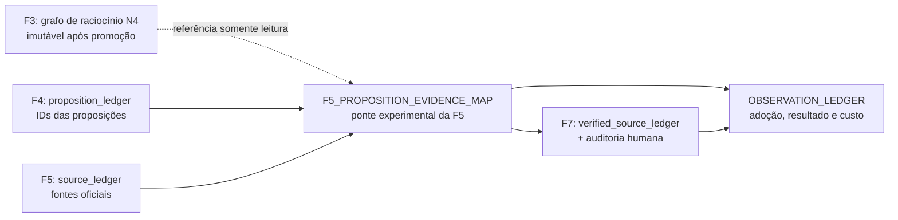

# PRD — Instrumentação rastreável da FORJA: ponte F4 → F5 → F7 sem reabrir F3

**Versão:** 2.0 — reconstrução Efesto após red team Diabob
**Protocolo:** `FORJA-INSTRUMENTACAO-v2`
**Data:** 06/08/2026
**Modo:** arquitetura e especificação executável
**Estado:** pronto para implementação da Onda 0; este documento não altera produção por si só
**Parecer adversarial:** `state/prd45-revisao/PARECER_DIABOB_CODEX.md`

**Substitui normativamente:**

- a versão 1.0 deste PRD;
- `43_PRD_GRAFOS_PONDERADOS.md`;
- `44_PRD_SKILLS_DISCIPLINAS_PROCESSO.md`.

Os documentos substituídos permanecem históricos. Nenhum requisito necessário à
execução desta versão depende de consultá-los.

---

## 1. Resultado e decisão de produto

A FORJA terá uma instrumentação prospectiva única, mas não reescreverá o grafo de
raciocínio da F3 depois da pesquisa oficial. A ligação entre proposição e fonte
será materializada em artefato próprio da F5, consumível e reconciliável pela F7.

A ordem obrigatória é:

1. corrigir a incoerência de severidade do F2A sem enfraquecer P0;
2. instalar o ledger de observação e os schemas experimentais;
3. executar uma fatia vertical D2, de F4 a F7;
4. pilotar as demais disciplinas individualmente;
5. executar o lint do grafo F3 como diagnóstico estrutural separado;
6. promover somente a disciplina que passar por evidência prospectiva, canários,
   revisão humana e ciclo AR.

Quatro decisões antes abertas ficam resolvidas nesta versão:

| Tema | Decisão v2 |
| --- | --- |
| Severidade F2A | P0 bloqueia; P1 informa. A mesma regra vale nos dois caminhos do runner. |
| D2 ↔ grafo | F5 não altera `F3_REASONING_GRAPH.json`; cria ponte própria. |
| `F5_LEDGER_MATERIAL.json` | legado compatível, congelado e sem escrita de volta; não é fonte canônica nem projeção futura. |
| Métrica estrutural | cobertura de aresta é adoção/proxy, nunca resultado jurídico material. |

## 2. Evidência de partida, reproduzida em 06/08/2026

### 2.1 Grafo N4 de F3

Foram lidos os seis artefatos vigentes em
`state/*/n4_artifacts/F3_REASONING_GRAPH.json`.

| Medida | Valor observado |
| --- | ---: |
| grafos | 6 |
| nós | 147 |
| arestas | 49 |
| teses | 20 |
| teses sem entrada `supports`/`justifies` | 8 (40%) |
| arestas sustentadoras cujo alvo é tese | 15 |
| origem `document` | 10 |
| origem `source` | 3 |
| origem `official_fact` | 2 |
| origem `official_source` | 0 |

Há 15 tipos de nó em uso e o schema não fecha o vocabulário. Os 43 nós
`document` possuem apenas `id`, `type` e `sourceArtifact`; o acervo não permite
classificar deterministicamente quantos são peças processuais e quantos escondem
fonte pesquisada sob rótulo errado.

**Interpretação corrigida:** o zero de `official_source` prova ausência de uma
ponte pós-pesquisa dentro do artefato medido. Não prova, sozinho, que a pesquisa
F5 é ignorada operacionalmente, porque o grafo pertence à F3 e nasce antes da F5.

### 2.2 F2A

A unidade canônica atual é o último artefato de cada caso em
`state/*/n4_artifacts/F2_QUESTION_TREE.json`, e não cada cópia em `runs/` ou
`history/`.

| Medida | Valor observado |
| --- | ---: |
| árvores canônicas atuais | 10 |
| gates `exploration_100_complete=fail` | 10 |
| árvores com apenas achados P1 | 8 |
| árvores sem achado | 0 |

A contagem anterior de 25 arquivos era um snapshot histórico e misturava cópias
da mesma execução. Não será baseline de promoção.

O bloqueio ocorre em duas superfícies do runner:

- validação de `question_tree`, que hoje rejeita qualquer achado;
- recomputação dos gates, que converte códigos P1 não mapeados em `fail`.

O CLI isolado já encerra com falha apenas para P0. A divergência é defeito de
integração, não decisão jurídica pendente.

### 2.3 Verificação técnica inicial

- AXI: 5 de 5 checks de saúde aprovados;
- contratos F0–F10 carregados e hashados;
- 95 testes focados aprovados, zero falhas;
- baseline estrutural do grafo reproduzido;
- artefato `F5_LEDGER_MATERIAL.json` conferido no código real.

Essas provas validam o diagnóstico e a implementabilidade do plano. Não provam
eficácia jurídica prospectiva.

## 3. Restrições arquiteturais

1. Cada fase é dona das próprias saídas. Fase posterior não altera artefato
   aprovado de fase anterior.
2. N3 canônico e N4 `candidate_shadow` não são uma única família de contrato.
3. Durante o piloto, a instrumentação não entra em `requiredOutputs` nem
   `requiredGates`.
4. Artefatos existentes não são reescritos para melhorar baseline.
5. Hash, ID, sequência e schema são computáveis; mérito jurídico permanece sob
   auditor humano nominal e fonte.
6. Falha, inelegibilidade e não disparo permanecem no denominador.
7. A instrumentação não entra em DOCX, e-mail ou peça protocolável.
8. Mudança estrutural futura preserva fachadas e segue migração incremental; este
   PRD não executa a refatoração arquitetural v4.

## 4. Arquitetura escolhida



### 4.1 O que muda

F5 passa a produzir, em namespace experimental, um mapa que liga cada
`propositionId` decisiva às entradas do `source_ledger`. A F7 reconcilia esse
mapa com o `verified_source_ledger` e com a auditoria humana do resultado final.

### 4.2 O que não muda

- `F3_REASONING_GRAPH.json` permanece propriedade da F3;
- F5 não altera hash, `updatedAt`, `producerRunId` ou conteúdo de F3;
- o lint do grafo F3 não recebe autoridade jurídica;
- o runner canônico continua sem novo output obrigatório durante a observação.

## 5. Contratos novos

### R0 — `OBSERVATION_LEDGER.jsonl`

Local piloto: `state/<caseId>/instrumentation/OBSERVATION_LEDGER.jsonl`.

Campos mínimos por oportunidade:

- `schemaVersion`, `opportunityId`, `caseId`, `disciplineId`;
- `triggerEventId`, `triggerSequence`, `registeredAt`;
- `eligible`, `eligibilityReason`;
- `dispatchEventId`, `nonDispatchReason`;
- `artifactPath`, `artifactSha256`, `consumerEventId`, `consumedSha256`;
- `humanReviewer`, `humanAudit`, `materialOutcome`;
- `costMinutes`, `arExperimentId`.

**Aceite:**

1. o registro nasce antes do despacho;
2. `eligible=false` exige motivo e continua no censo;
3. elegível sem despacho exige `nonDispatchReason`;
4. consumo só conta com hash idêntico e sequência posterior;
5. escrita é append-only e repetição do mesmo evento não duplica oportunidade;
6. falha de gravação da telemetria não promove artefato nem é silenciada.

### R1 — `F5_PROPOSITION_EVIDENCE_MAP.json`

Local piloto:
`state/<caseId>/instrumentation/F5_PROPOSITION_EVIDENCE_MAP.json`.

Estrutura mínima:

```json
{
  "schemaVersion": 1,
  "caseId": "...",
  "producerPhase": "F5_PESQUISA_OFICIAL",
  "producerRunId": "...",
  "propositionLedger": {"artifactId": "proposition_ledger", "sha256": "..."},
  "sourceLedger": {"artifactId": "source_ledger", "sha256": "..."},
  "links": [
    {
      "linkId": "...",
      "propositionId": "...",
      "sourceId": "...",
      "relation": "supports",
      "sourceLocator": "...",
      "archivedSourceSha256": "...",
      "reviewStatus": "pending_human_review"
    }
  ],
  "blockedPropositions": []
}
```

Relações permitidas: `supports`, `qualifies`, `contradicts` e `does_not_reach`.

**Aceite:**

1. todo `propositionId` existe no `proposition_ledger` hashado;
2. todo `sourceId` existe no `source_ledger` hashado;
3. fonte arquivada declarada tem hash recomputável;
4. proposição decisiva sem link tem bloqueio nominal e motivo;
5. troca de fonte, verbatim ou hash entre precedentes é detectada;
6. o hash de `F3_REASONING_GRAPH.json` antes e depois da F5 é idêntico;
7. o mapa não escreve de volta nos ledgers de F4/F5.

### R2 — lint de evidência pós-F5

O lint da ponte emite:

| Código | Verificação | Piloto |
| --- | --- | --- |
| `EVID-01` | proposição decisiva sem link nem bloqueio | P1 |
| `EVID-02` | `propositionId` inexistente | P0 do instrumento |
| `EVID-03` | `sourceId` inexistente | P0 do instrumento |
| `EVID-04` | hash da fonte arquivada não confere | P0 do instrumento |
| `EVID-05` | vínculo consumido com hash diferente do produzido | P0 do instrumento |
| `EVID-06` | relação fora do vocabulário | P0 do instrumento |
| `EVID-07` | fonte decisiva não chega ao `verified_source_ledger` de F7 | P1 até calibrar |

“P0 do instrumento” impede creditar a observação; durante o piloto não bloqueia
a fase canônica. Promoção futura decide se algum código entra em contrato.

### R3 — lint estrutural do grafo F3

O lint original é preservado, mas separado de D2:

| Código | Verificação | Significado |
| --- | --- | --- |
| `GRAFO-01` | tese sem entrada `supports`/`justifies` | rastreabilidade pré-pesquisa incompleta |
| `GRAFO-02` | nó de fonte isolado | catálogo não ligado dentro de F3 |
| `GRAFO-03` | pedido sem tese justificadora | pedido sem caminho registrado |
| `GRAFO-04` | única entrada é restritiva | restrição sem sustentação registrada |
| `GRAFO-05` | tipo fora da ontologia | divergência vocabular |
| `GRAFO-06` | densidade | telemetria informativa |

`GRAFO-07` da v1 é retirado. Exigir fonte oficial em artefato produzido antes da
pesquisa oficial confunde ordem de fase com qualidade.

Enquanto não existir elo confiável entre texto final e nós F3, `GRAFO-01` é P2
informativo. Nenhum código do grafo bloqueia produção neste PRD.

### R4 — ontologia sem reescrita histórica

Vocabulário proposto para novos grafos:
`document`, `official_source`, `fact`, `event`, `rule`, `thesis`, `request`,
`decision`, `inference` e `gap`.

Valores legados (`source`, `official_fact`, `strategy`, `coverage`,
`calculation`) permanecem legíveis e geram aviso. Migração em memória pode
normalizar consulta; arquivo histórico não é alterado.

O mapeamento só é aprovado depois de classificar a proveniência dos 43 nós
`document` por registro de origem verificável. `sourceArtifact` isolado não basta.

## 6. Correção obrigatória do F2A

### R5 — severidade única nos dois caminhos do runner

Regra:

- achado P0 bloqueia a validação e o gate;
- achado P1 permanece no laudo e não interrompe promoção;
- achado sem severidade é tratado como P0;
- código novo não mapeado preserva sua severidade, em vez de virar `fail` por
  desconhecimento;
- a função que seleciona bloqueantes é única e reutilizada pela validação do
  artefato e pela recomputação do gate.

**Aceite:**

1. as oito árvores canônicas atuais com somente P1 atravessam os dois pontos;
2. as árvores com P0 continuam reprovadas;
3. árvore sintética legítima passa;
4. formulário repetitivo e árvore sem lacuna continuam acusados como P1;
5. árvore com 99 perguntas, fato sem `supportIds` ou protocolo inválido continua
   bloqueada;
6. o laudo preserva código, severidade e detalhe de cada P1.

## 7. As seis disciplinas, sem segunda fonte normativa

| ID | Gatilho e produtor | Saída piloto | Consumidor | Adoção verificável | Resultado material | Canário decisivo |
| --- | --- | --- | --- | --- | --- | --- |
| D1 | antes do despacho de conselho F4 | briefing com perguntas, fontes, restrições e decisões rejeitadas | revisor do conselho | ordem por evento e hash consumido | omissão material ou proposta rejeitada reapresentada | retirar uma fonte ou pergunta obrigatória |
| D2 | cada `propositionId` decisiva em F5 | `F5_PROPOSITION_EVIDENCE_MAP.json` | F7 | vínculo válido e consumido | correções de atribuição, verbatim, *pincite*, vigência ou relevância | trocar a fonte entre dois precedentes |
| D3 | depois de F1, com duas linhas materiais abertas | `F2_INTAKE_HYPOTHESES.json` | F2A/F4 | IDs e estados provisórios resolvíveis | hipótese contradita reaberta, não congelada | fonte posterior contradiz hipótese escolhida |
| D4 | antes do fechamento F7 | `F7_UNCERTAIN_DECISIONS.json` + mapa F9 | F9 | IDs conciliados e trecho localizado | item gera decisão, diligência ou correção humana | dúvida retrospectiva fabricada |
| D5 | antes do despacho de revisão cruzada | `HANDOFF.md` + recibo | revisor cruzado | mesmo hash recebido | tempo de reconstrução, perguntas de identidade e erro de retomada | remover armadilha material do caso |
| D6 | quando decisão de arquitetura/processo é tomada | ficha em `decisoes/` | manutenção e novas propostas | ID, status, fonte e reabertura válidos | proposta rejeitada reaparece sem fato novo | remover critério de reabertura |

Regras específicas:

- D3 é sempre provisória, roda depois de F1 e nunca bloqueia por silêncio humano.
- D4 não expõe IDs internos no e-mail; o mapa interno prova a ponte F7 → F9.
- D5 só vale no evento real de pré-despacho, não em “troca de contexto” genérica.
- D6 começa pelas quatro decisões resolvidas na § 1. Migração massiva das decisões
  históricas não bloqueia a fatia D2.

## 8. Itens preservados fora do caminho crítico

### R6 — `stop_reason`

O recibo editorial deve ser gravado após o retorno do envelope e antes de parse,
fidelidade ou exceção. Sucesso, ausência do campo, saída inválida e divergência de
modelo terão testes próprios. R6 é observabilidade independente e não recebe
crédito causal por D1–D6.

### R7 — classificador semântico de instruções rejeitado

Permanece rejeitada a criação de classificador que decida automaticamente núcleo
comum, específico Codex e específico Claude. Ferramenta futura pode calcular hash
e diff, nunca classificar mérito sem nova decisão.

### R8 — descoberta entre famílias

Depois de a disciplina possuir produtor, consumidor e artefato estáveis, o
`AGENTS.md` aplicável registra skill, caminho, gatilho, modo automático/manual e
fonte prevalente. Skill manual não é anunciada como disparo automático.

## 9. Ondas de execução

### Onda 0 — coerência do gate e instrumentos

1. implementar R5 e seus testes nos dois caminhos do runner;
2. congelar baseline canônico por caso, sem contar cópias históricas;
3. escrever schemas de R0 e R1;
4. criar os quatro registros de decisão desta versão;
5. manter toda instrumentação fora dos contratos obrigatórios.

**Saída:** oito casos P1-only desobstruídos, P0 preservado e instrumentos
parseáveis. Nenhuma disciplina integrada ainda.

### Onda 1 — fatia vertical D2

1. registrar todas as oportunidades F5 elegíveis;
2. produzir o mapa de proposição-evidência;
3. executar `EVID-01` a `EVID-07`;
4. reconciliar com F7 e auditor humano;
5. executar caso bom, fonte trocada e hash adulterado.

**Saída:** três oportunidades elegíveis completas ou declaração de denominador
insuficiente. F3 permanece byte a byte idêntica.

### Onda 2 — disciplinas independentes

Pilotar D1, D4, D5 e D6 separadamente. D3 entra por último, somente depois de o
F2A estar estável e sempre como hipótese provisória.

**Saída:** três oportunidades assistidas por disciplina, canário e contraprova.

### Onda 3 — observação prospectiva

Rodar por 30 dias. Uma disciplina só recebe leitura exploratória quando acumular
pelo menos dez oportunidades elegíveis; abaixo disso o resultado é inconclusivo.
Dez oportunidades não provam eficácia causal e não substituem o ciclo AR.

### Onda 4 — promoção individual

Cada disciplina recebe `promover`, `continuar_estudo` ou `retirar`. Promoção para
N4 `candidate_shadow` exige schema, catálogo, contrato F5, consumidor, canários,
contraprovas, cobertura humana e rollback. Promoção para N3 canônico é decisão
posterior e separada; não ocorre por consequência automática deste PRD.

## 10. Métricas

Três colunas independentes: adoção, resultado material e custo. Uma não compensa
a outra.

### 10.1 Fórmulas comuns

- adoção = `N_consumed / N_eligible`;
- não disparo = `N_non_dispatch / N_eligible`;
- cobertura humana = `N_human_audited / N_eligible`;
- custo = mediana e maior valor de minutos por oportunidade;
- denominador zero = `não aplicável`, nunca 100%.

### 10.2 D2

| Coluna | Medida |
| --- | --- |
| adoção | proposições decisivas com link ou bloqueio válido; hashes produzidos/consumidos iguais |
| resultado material | correções humanas em atribuição, verbatim, *pincite*, vigência e relevância por proposição auditada |
| custo | minutos por proposição elegível, incluindo urgências e não disparos |

`EVID-01` mede cobertura. `GRAFO-01` mede preenchimento de F3. Nenhum dos dois,
isoladamente, conta como melhora jurídica.

### 10.3 Critério de reabertura de ponderação

A ponderação de arestas permanece suspensa. Só pode ser rediscutida se, nos
grafos vigentes:

- teses sem entrada sustentadora forem menos de 10%;
- mediana de arestas sustentadoras por tese for pelo menos 3;
- e a ontologia estiver fechada com proveniência dos nós classificada.

Mesmo quando esses pisos forem atingidos, ausência de campo não produz peso e
documento dos autos não recebe salvo-conduto automático.

## 11. Plano de testes

### 11.1 F2A

1. P1 de diversidade não bloqueia na validação inicial;
2. P1 de diversidade não bloqueia na recomputação;
3. P0 bloqueia nos dois caminhos;
4. severidade ausente falha fechada;
5. oito artefatos atuais P1-only passam em regressão nominada;
6. árvore legítima e sabotagens existentes continuam discriminadas.

### 11.2 Ponte F4 → F5 → F7

1. `propositionId` desconhecida reprova;
2. `sourceId` desconhecida reprova;
3. hash de fonte divergente reprova;
4. fonte trocada entre precedentes reprova;
5. proposição bloqueada com motivo válido não é falsa cobertura;
6. consumidor com hash diferente não conta como exposição;
7. mapa válido passa;
8. F3 conserva o mesmo SHA-256 antes e depois da F5.

### 11.3 Observação

1. oportunidade inelegível permanece no censo;
2. não disparo exige motivo;
3. replay não duplica evento;
4. denominador zero produz `não aplicável`;
5. falha do instrumento não vira resultado verde.

### 11.4 Grafo F3

1. baseline real reproduz 8 `GRAFO-01`;
2. grafo sintético completo passa;
3. nó/aresta pendente, relação inválida e sustentação sem escopo reprovam;
4. vocabulário legado avisa sem reescrever arquivo.

## 12. Rollout, rollback e observabilidade

### Rollout

- feature namespace único: `instrumentation.mode = off|observe|candidate_shadow`;
- início obrigatório em `observe`;
- seleção de casos explícita e registrada;
- nenhum gate canônico novo antes da Onda 4.

### Rollback

1. definir `instrumentation.mode=off`;
2. parar novos sidecars sem apagar os existentes;
3. confirmar que contratos N3 e hashes F3 permanecem inalterados;
4. preservar ledger, canários e reason codes da falha;
5. reexecutar health e regressão do subsistema afetado.

Como o piloto não reescreve artefatos canônicos, rollback é desativação e
preservação de evidência, não restauração de dados jurídicos.

## 13. Riscos e controles

| Risco | Controle |
| --- | --- |
| arestas para satisfazer métrica | cobertura fica em adoção; resultado material é auditado em F7 |
| retroescrita F5 → F3 | teste de hash imutável e artefato próprio da F5 |
| mistura N3/N4 | namespace experimental; promoção primeiro para N4 shadow |
| seleção de casos fáceis | censo de gatilhos, inelegíveis e não disparos |
| duas fontes de verdade | direção F4 `proposition_ledger` → F5 `source_ledger` → mapa derivado, sem escrita de volta |
| P1 continuar bloqueando por outro caminho | função única de seleção de bloqueantes e testes nos dois pontos |
| classificar `document` por palpite | exigir registro de proveniência; `sourceArtifact` não basta |
| PRD grande não ser executado | ondas verticais com saída, gate e rollback próprios |
| autor validar o próprio benefício | auditor humano nominal e ciclo AR |

## 14. Fora do escopo

- grafo de atos processuais M3;
- ponderação de arestas;
- reescrita de grafos históricos;
- classificador semântico de instruções;
- RAG ou LLM-as-judge como gate jurídico;
- refatoração física P-J01 a P-J06 da arquitetura v4;
- promoção direta a contrato N3;
- envio, protocolo ou alteração de peça jurídica.

M3 continua obrigação separada e não é escondido dentro deste programa.

## 15. Critério de conclusão do PRD

Esta especificação está pronta para implementação quando:

1. a direção F4 → F5 → F7 e a imutabilidade de F3 estiverem explícitas;
2. as seis disciplinas tiverem gatilho, saída, consumidor, métrica e canário;
3. decisões F2A e `F5_LEDGER_MATERIAL` não dependerem de nova escolha técnica do
   dono;
4. cada onda tiver aceite e rollback;
5. os testes cobrirem o failure mode real;
6. métricas estruturais não forem apresentadas como eficácia jurídica;
7. nenhum requisito normativo depender de PRD substituído.

Implementação só é concluída depois de testes, health, diff, validação do runtime
e evidência prospectiva proporcionais à onda executada.

## 16. Próxima ação única

Implementar a Onda 0 em uma entrega curta: corrigir a semântica P0/P1 nos dois
caminhos do F2A, congelar o baseline canônico por caso e adicionar os schemas de
R0/R1 sem integrar disciplina ou gate novo à produção.
