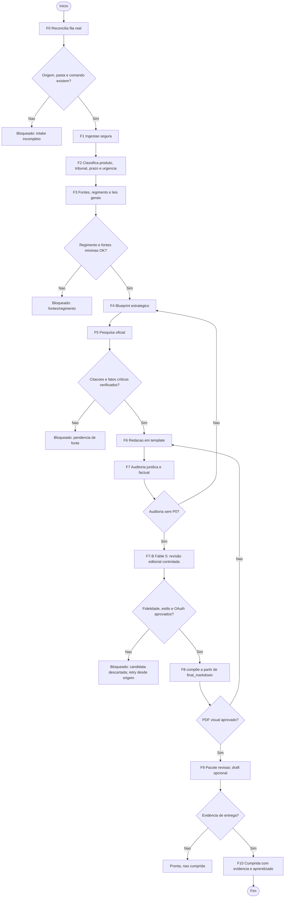
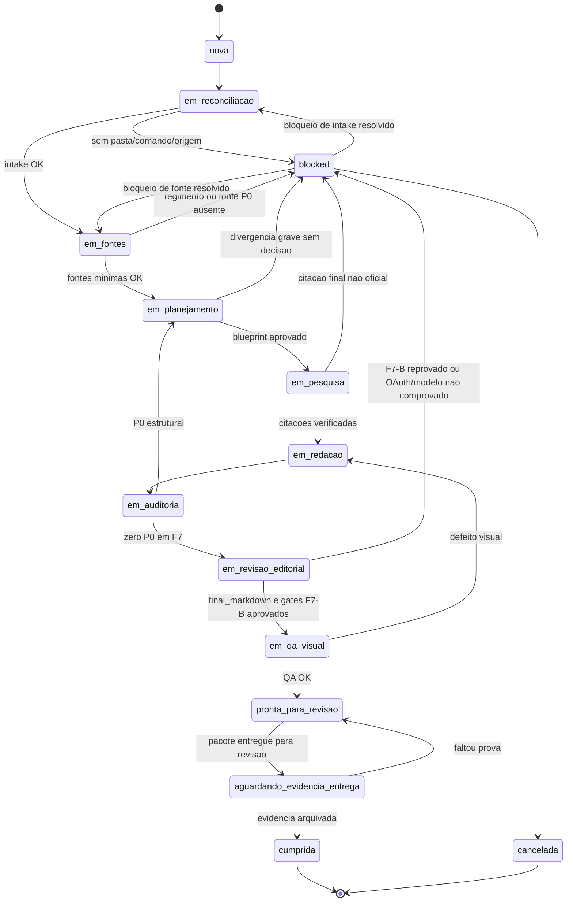
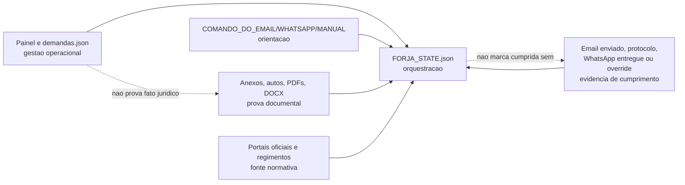
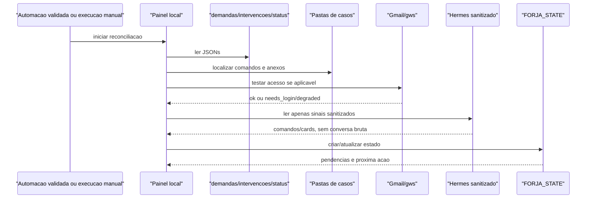
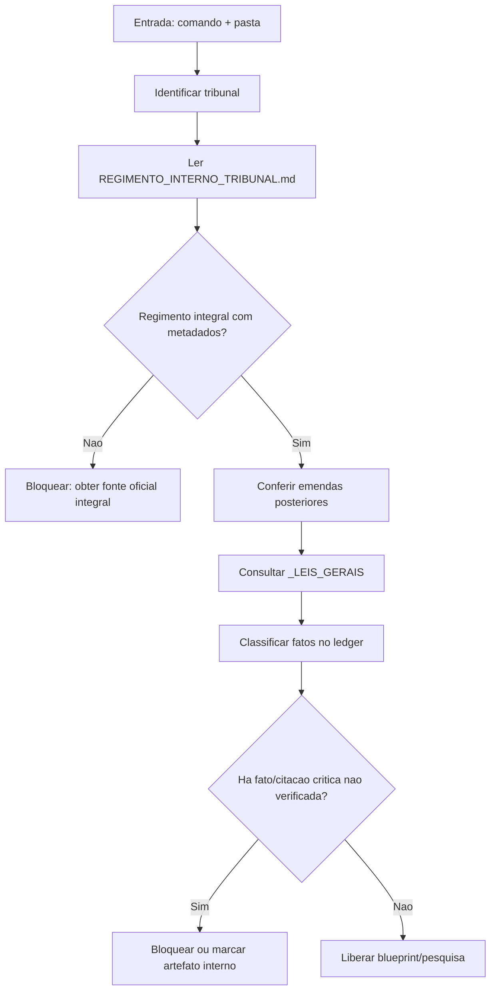
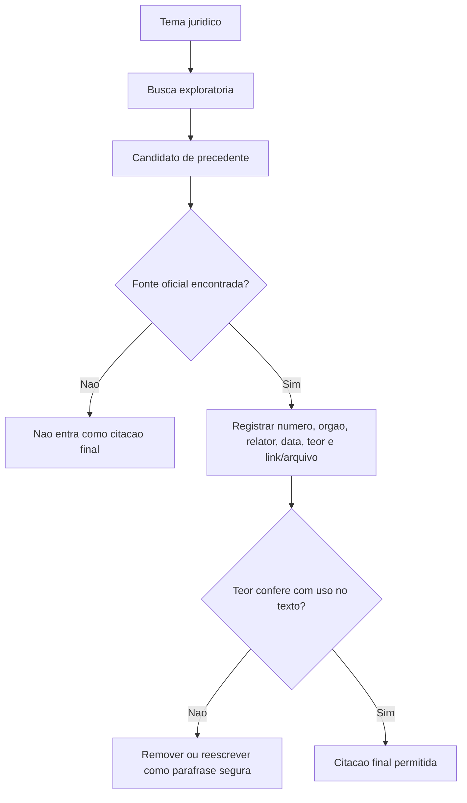
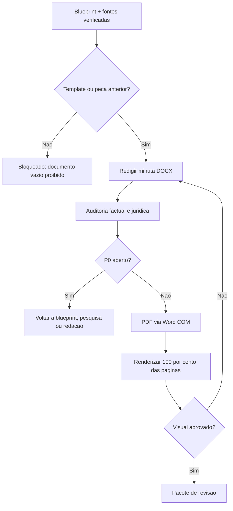
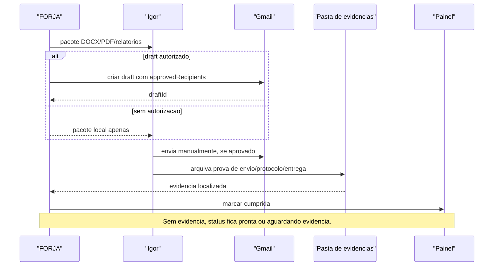
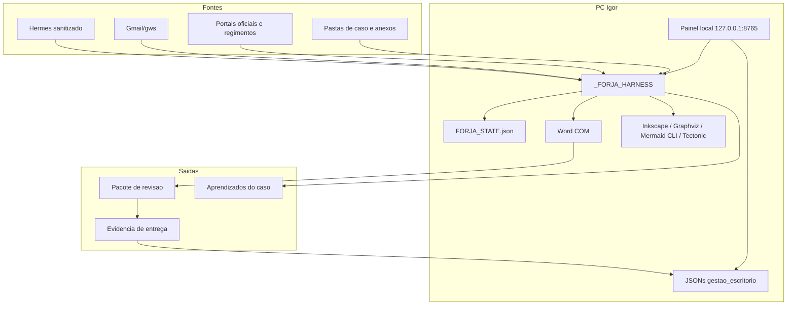
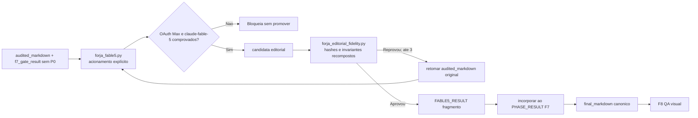

# Consulta IA — DIAGRAMAS — FORJA N2

> Cópia de consulta derivada. O documento canônico permanece no caminho de origem indicado abaixo.

## Metadados e rastreabilidade

- **Documento de origem:** `04_DIAGRAMAS_FORJA.md`
- **Tipo:** Diagramas
- **SHA-256 da origem:** `20bc10c26d42fcef2f7636a15eb0615d61071f83e1422002e8eb11c2b1711553`
- **Linhas da origem:** 290
- **Blocos integralmente indexados:** 12
- **Geração:** 2026-08-10T13:53:35-03:00
- **Cobertura:** 100% das linhas e do texto da origem, sem omissão.
- **Links relativos normalizados:** 0 destino(s), apenas para preservar a navegação na cópia.

## Roteiro de consulta para IA

**Síntese de localização:** Versão: N2.0 Data: 2026-07-08 Status: vigente para execução PRD: 01PRDFORJA.md TDD: 02TDDFORJA.md Roadmap: 03ROADMAPFORJA.md

**Termos de recuperação:** nao, panel, sim, evidencia, participant, gmail, mermaid, harness, fonte, fontes, regimento, oficial.

Use o índice abaixo para localizar o bloco pertinente. Cada entrada informa as linhas exatas no documento de origem. Para afirmações materiais, leia o bloco integral e confira o arquivo canônico pelo SHA-256.

## Índice detalhado e cobertura integral

- [SRC-S001 · L1–L13 · DIAGRAMAS — FORJA N2](#src-s001)
  - Assuntos: diagramas, versão, data, status, vigente, execução, prd, prd_forja
  - Trecho-guia: Versão: N2.0 Data: 2026-07-08 Status: vigente para execução PRD: 01PRDFORJA.md TDD: 02TDDFORJA.md Roadmap: 03ROADMAPFORJA.md
  - SHA-256 do bloco: `2412470e81f47c9168c3696dfc0c28797949a8c368800b54a99d20841a1a3414`
  - [SRC-S002 · L14–L48 · 1. Fluxo macro F0-F10](#src-s002)
    - Caminho: DIAGRAMAS — FORJA N2 > 1. Fluxo macro F0-F10
    - Assuntos: nao, sim, bloqueado, fontes, regimento, g7b, f10, fluxo
    - Trecho-guia: Documento de consulta sobre 1. Fluxo macro F0-F10.
    - SHA-256 do bloco: `f6b8d45eae1ee4f85bff2dc93882b52adc7e61e506b1d027033d151eca36bb67`
  - [SRC-S003 · L49–L81 · 2. Maquina de estados](#src-s003)
    - Caminho: DIAGRAMAS — FORJA N2 > 2. Maquina de estados
    - Assuntos: blocked, em_reconciliacao, em_fontes, em_planejamento, em_pesquisa, em_redacao, em_auditoria, em_revisao_editorial
    - Trecho-guia: Documento de consulta sobre 2. Maquina de estados.
    - SHA-256 do bloco: `5c27b588862e62a47f95fa4849099f0f3b49d5489b3e3ccab82ef93e04cabefc`
  - [SRC-S004 · L82–L104 · 3. Fonte de verdade](#src-s004)
    - Caminho: DIAGRAMAS — FORJA N2 > 3. Fonte de verdade
    - Assuntos: painel, anexos, evidencia, fonte, verdade, json, comando, whatsapp
    - Trecho-guia: Documento de consulta sobre 3. Fonte de verdade.
    - SHA-256 do bloco: `e84735dc70d232098b7012333f07bab03bc48c8a3fd83d87680cc61d5a276d91`
  - [SRC-S005 · L105–L129 · 4. Sequencia de reconciliacao e ingestao](#src-s005)
    - Caminho: DIAGRAMAS — FORJA N2 > 4. Sequencia de reconciliacao e ingestao
    - Assuntos: panel, participant, gmail, hermes, reconciliacao, state, sequencia, ingestao
    - Trecho-guia: Documento de consulta sobre 4. Sequencia de reconciliacao e ingestao.
    - SHA-256 do bloco: `921aa0bd36633e4fafb534db558ca66e60b6f72fa653b9387629f9560ca937b7`
  - [SRC-S006 · L130–L147 · 5. Gate de fontes e regimento](#src-s006)
    - Caminho: DIAGRAMAS — FORJA N2 > 5. Gate de fontes e regimento
    - Assuntos: regimento, nao, gate, fontes, integral, bloquear, sim, mermaid
    - Trecho-guia: Documento de consulta sobre 5. Gate de fontes e regimento.
    - SHA-256 do bloco: `ba871d9fec34a6f597b16404bbf23446843303ea76f0f47b1d1c1279d65fc3ee`
  - [SRC-S007 · L148–L163 · 6. Pesquisa e citacao oficial](#src-s007)
    - Caminho: DIAGRAMAS — FORJA N2 > 6. Pesquisa e citacao oficial
    - Assuntos: citacao, oficial, nao, pesquisa, final, sim, teor, mermaid
    - Trecho-guia: Documento de consulta sobre 6. Pesquisa e citacao oficial.
    - SHA-256 do bloco: `af44729ae20db6f21816b9b20a9dbf618c101bc1cb4745032d5972fbeb6e729f`
  - [SRC-S008 · L164–L182 · 7. Redacao, auditoria e QA visual](#src-s008)
    - Caminho: DIAGRAMAS — FORJA N2 > 7. Redacao, auditoria e QA visual
    - Assuntos: redacao, auditoria, visual, nao, sim, blueprint, mermaid, flowchart
    - Trecho-guia: Documento de consulta sobre 7. Redacao, auditoria e QA visual.
    - SHA-256 do bloco: `725159081edc72ab11d1599e0c9d9a32dde0b0ccd9253a63e36de6ed18e774e0`
  - [SRC-S009 · L183–L210 · 8. Entrega e cumprimento](#src-s009)
    - Caminho: DIAGRAMAS — FORJA N2 > 8. Entrega e cumprimento
    - Assuntos: igor, participant, gmail, entrega, evidence, panel, evidencia, cumprimento
    - Trecho-guia: Documento de consulta sobre 8. Entrega e cumprimento.
    - SHA-256 do bloco: `22e0683c8033492f9a94b428272360e4b1f5873540d0f83558ae78c28ffb9480`
  - [SRC-S010 · L211–L253 · 9. Arquitetura de componentes](#src-s010)
    - Caminho: DIAGRAMAS — FORJA N2 > 9. Arquitetura de componentes
    - Assuntos: harness, word, subgraph, panel, data, end, gmail, hermes
    - Trecho-guia: Documento de consulta sobre 9. Arquitetura de componentes.
    - SHA-256 do bloco: `eb712c4d066ea03421ed4bdf0eee88dad182d66d1758dbbe0e265168d91118e9`
  - [SRC-S011 · L254–L272 · 10. Leitura executiva](#src-s011)
    - Caminho: DIAGRAMAS — FORJA N2 > 10. Leitura executiva
    - Assuntos: leitura, executiva, manifest, fluxo, correto, reconciliar, realidade, bloquear
    - Trecho-guia: 1. reconciliar a realidade; 2. bloquear entrada incompleta; 3. provar fonte e regimento; 4. planejar com divergencia registrada; 5. validar citacoes oficialmente; 6. redigir em template; 7. auditar; 8. revisar editorialmente com Fable 5, recompor os gates e então renderizar e ins
    - SHA-256 do bloco: `755c1204151cc331d3812aaad9f65b9a784ab6b2159441785e55634d6bc3bb15`
  - [SRC-S012 · L273–L290 · 11. Adendo de leitura — fronteira F7-B (15/07/2026)](#src-s012)
    - Caminho: DIAGRAMAS — FORJA N2 > 11. Adendo de leitura — fronteira F7-B (15/07/2026)
    - Assuntos: run, auth, fidelity, ate, adendo, leitura, fronteira, f7-b
    - Trecho-guia: As três candidatas editoriais do diagrama (inicial + até dois retries) são internas a uma tentativa F7. O contrato da fase continua admitindo até quatro tentativas externas, cada uma com diretório e trilha próprios. O runner não chama o Fable 5 por conta própria.
    - SHA-256 do bloco: `f292f984fe9c9dd198c80d51d9351a36fa4a04d8a0a1197805965d4d5ad65281`

## Conteúdo integral indexado

Os marcadores HTML abaixo são apenas âncoras de navegação. O texto reproduz integralmente a origem normalizada em UTF-8; somente destinos de links relativos podem ter sido recalculados para apontar ao mesmo arquivo a partir desta pasta.

# DIAGRAMAS — FORJA N2

**Versão:** N2.0  
**Data:** 2026-07-08  
**Status:** vigente para execução  
**PRD:** `01_PRD_FORJA.md`  
**TDD:** `02_TDD_FORJA.md`  
**Roadmap:** `03_ROADMAP_FORJA.md`

> Estes diagramas substituem os diagramas v2.0 anteriores. O fluxo agora é bloqueante, evidencial e sanitizado.

---

## 1. Fluxo macro F0-F10

---

## 2. Maquina de estados

---

## 3. Fonte de verdade

---

## 4. Sequencia de reconciliacao e ingestao

---

## 5. Gate de fontes e regimento

---

## 6. Pesquisa e citacao oficial

---

## 7. Redacao, auditoria e QA visual

---

## 8. Entrega e cumprimento

---

## 9. Arquitetura de componentes

---

## 10. Leitura executiva

O fluxo correto do FORJA N2 é:

1. reconciliar a realidade;
2. bloquear entrada incompleta;
3. provar fonte e regimento;
4. planejar com divergencia registrada;
5. validar citacoes oficialmente;
6. redigir em template;
7. auditar;
8. revisar editorialmente com Fable 5, recompor os gates e então renderizar e inspecionar;
9. entregar pacote ou draft autorizado;
10. marcar cumprida apenas com evidencia.

Se algum diagrama conflitar com o PRD/TDD/Manifest, vence o manifest e a regra mais restritiva.

---

## 11. Adendo de leitura — fronteira F7-B (15/07/2026)

As três candidatas editoriais do diagrama (inicial + até dois retries) são internas a uma tentativa F7. O contrato da fase continua admitindo até quatro tentativas externas, cada uma com diretório e trilha próprios. O runner não chama o Fable 5 por conta própria.
