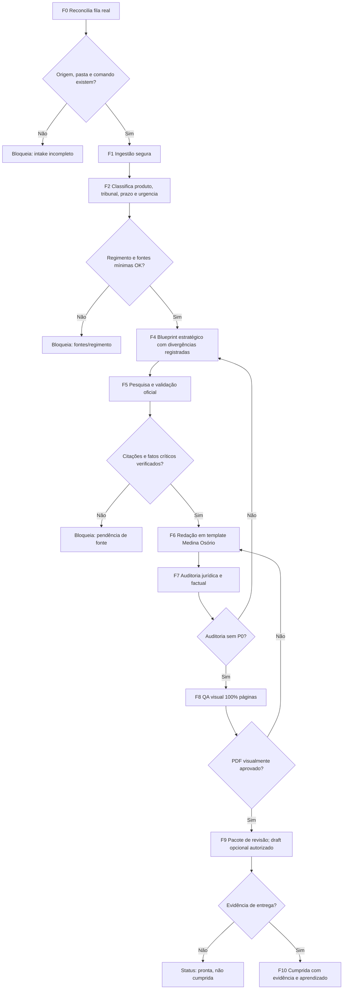

# Consulta IA — FORJA N2 — Análise crítica e planejamento corrigido

> Cópia de consulta derivada. O documento canônico permanece no caminho de origem indicado abaixo.

## Metadados e rastreabilidade

- **Documento de origem:** `05_FORJA_NIVEL_2_ANALISE_E_PLANO_CORRIGIDO.md`
- **Tipo:** Plano
- **SHA-256 da origem:** `8823098bcfddd331941be216f12a9917b3d6708e9d64ae0012c9216fe988910a`
- **Linhas da origem:** 455
- **Blocos integralmente indexados:** 46
- **Geração:** 2026-08-10T13:53:35-03:00
- **Cobertura:** 100% das linhas e do texto da origem, sem omissão.
- **Links relativos normalizados:** 0 destino(s), apenas para preservar a navegação na cópia.

## Roteiro de consulta para IA

**Síntese de localização:** Data: 2026-07-08 Status: versão superior consolidada dos quatro planejamentos FORJA; originais reescritos para N2 em 2026-07-08 Escopo: registrar falhas/acertos e justificar a correção aplicada ao PRD, TDD, roadmap e diagramas Fontes analisadas: 01PRDFORJA.md, 02TDDFORJA.md, 03ROADMAPFORJA.md, 04DIAGRAMASFORJA.md

**Termos de recuperação:** não, json, entrega, tdd, regimento, oficial, evidência, caso, roadmap, painel, fonte, demanda.

Use o índice abaixo para localizar o bloco pertinente. Cada entrada informa as linhas exatas no documento de origem. Para afirmações materiais, leia o bloco integral e confira o arquivo canônico pelo SHA-256.

## Índice detalhado e cobertura integral

- [SRC-S001 · L1–L9 · FORJA N2 — Análise crítica e planejamento corrigido](#src-s001)
  - Assuntos: análise, crítica, planejamento, corrigido, data, status, versão, superior
  - Trecho-guia: Data: 2026-07-08 Status: versão superior consolidada dos quatro planejamentos FORJA; originais reescritos para N2 em 2026-07-08 Escopo: registrar falhas/acertos e justificar a correção aplicada ao PRD, TDD, roadmap e diagramas Fontes analisadas: 01PRDFORJA.md, 02TDDFORJA.md, 03RO
  - SHA-256 do bloco: `c6ed99c14fd4924b9fe93bc3063530085ee7ce6d61cf7828447dc48f599709de`
  - [SRC-S002 · L10–L19 · 1. Veredito executivo](#src-s002)
    - Caminho: FORJA N2 — Análise crítica e planejamento corrigido > 1. Veredito executivo
    - Assuntos: não, veredito, executivo, têm, painel, entrega, deve, quatro
    - Trecho-guia: Os quatro planejamentos têm uma base útil: fases F0-F10, preocupação com regimento, red team, auditoria visual, custos e modo sombra. Porém, no estado atual, não estão prontos para implementação confiável. O principal defeito não é falta de ambição; é excesso de promessa sem cont
    - SHA-256 do bloco: `4d691550b5390b7b0e50584ce609860eca320d8f5670bbcb0150871b3d8b935a`
  - [SRC-S003 · L20–L32 · 2. Acertos preservados](#src-s003)
    - Caminho: FORJA N2 — Análise crítica e planejamento corrigido > 2. Acertos preservados
    - Assuntos: plano, acertos, preservados, modelo, redação, auditoria, visual, entrega
    - Trecho-guia: 1. Modelo por fases F0-F10. A decomposição por ingestão, pesquisa, planejamento, redação, auditoria, QA visual, entrega e encerramento é aproveitável. 2. Gates humanos. A ideia de bloquear em plano jurídico, auditoria e entrega é correta. 3. Regimento antes da redação. Esse ponto
    - SHA-256 do bloco: `13e3ef03809c81a645fd931141192221910a0e306055b7078355f0baf32f83ee`
  - [SRC-S004 · L33–L34 · 3. Falhas críticas identificadas](#src-s004)
    - Caminho: FORJA N2 — Análise crítica e planejamento corrigido > 3. Falhas críticas identificadas
    - Assuntos: falhas, críticas, identificadas
    - Trecho-guia: Documento de consulta sobre 3. Falhas críticas identificadas.
    - SHA-256 do bloco: `039b1af20c7c7ccfd7dae91c7da92a150b736d045cd765a6fc0ab273fdf2d3c0`
    - [SRC-S005 · L35–L48 · P0 — impedem execução segura](#src-s005)
      - Caminho: FORJA N2 — Análise crítica e planejamento corrigido > 3. Falhas críticas identificadas > P0 — impedem execução segura
      - Assuntos: tdd, prd, roadmap, não, pode, fallback, execução, fonte
      - Trecho-guia: Documento de consulta sobre P0 — impedem execução segura.
      - SHA-256 do bloco: `a86c26e56cfeca123ae810f06a3b72453b535fa80cd180daaa580ec4c8475266`
    - [SRC-S006 · L49–L60 · P1 — geram retrabalho ou falsa governança](#src-s006)
      - Caminho: FORJA N2 — Análise crítica e planejamento corrigido > 3. Falhas críticas identificadas > P1 — geram retrabalho ou falsa governança
      - Assuntos: pode, mas, campos, geram, retrabalho, falsa, governança, citado
      - Trecho-guia: Documento de consulta sobre P1 — geram retrabalho ou falsa governança.
      - SHA-256 do bloco: `55ab1d2cbe7a71c009df40cc2d8441fb66ad1478d20149ca07cfd98e6a502d44`
    - [SRC-S007 · L61–L71 · P2 — ajustes de qualidade](#src-s007)
      - Caminho: FORJA N2 — Análise crítica e planejamento corrigido > 3. Falhas críticas identificadas > P2 — ajustes de qualidade
      - Assuntos: ajustes, qualidade, métricas, não, falha, correção, diagramas, usam
      - Trecho-guia: Documento de consulta sobre P2 — ajustes de qualidade.
      - SHA-256 do bloco: `3645c1ea4f65ba03ed83048bbcfd17a4315484ff472d2effbbe55a9b03abac27`
  - [SRC-S008 · L72–L85 · 4. Princípios corrigidos do FORJA N2](#src-s008)
    - Caminho: FORJA N2 — Análise crítica e planejamento corrigido > 4. Princípios corrigidos do FORJA N2
    - Assuntos: não, comando, prova, entrega, oficial, vira, princípios, corrigidos
    - Trecho-guia: 1. Painel resume; comando orienta; anexo prova. O painel nunca é prova jurídica nem prova de entrega. 2. Fonte oficial vence conveniência. SCON vale para STJ; STF e tribunais locais exigem portal oficial ou arquivo oficial arquivado. Jusbrasil, Google Scholar e IA são descoberta,
    - SHA-256 do bloco: `5547f62cefba9e0da1f7ec7dfa1d2bff00b89b080be3da5c1410bde712844bea`
  - [SRC-S009 · L86–L87 · 5. Escopo N2](#src-s009)
    - Caminho: FORJA N2 — Análise crítica e planejamento corrigido > 5. Escopo N2
    - Assuntos: escopo
    - Trecho-guia: Documento de consulta sobre 5. Escopo N2.
    - SHA-256 do bloco: `b97dbedb5f61344d3bcd8c4c37d136d772e898424a5a203a9712263881268668`
    - [SRC-S010 · L88–L100 · Dentro do escopo](#src-s010)
      - Caminho: FORJA N2 — Análise crítica e planejamento corrigido > 5. Escopo N2 > Dentro do escopo
      - Assuntos: dentro, escopo, comandos, criar, regimento, gerar, somente, demanda
      - Trecho-guia: Reconciliar fila real do escritório com demandas.json, comandos, pastas e evidências. Rodar ingestão assistida de e-mails e comandos existentes. Criar inventário de caso, matriz de fontes, regimento e leis gerais. Gerar blueprint jurídico com discordância registrada. Pesquisar ju
      - SHA-256 do bloco: `7e24fa95808b6a376534fac3f852309575e402ec58abd9579fa638495b1c20ed`
    - [SRC-S011 · L101–L113 · Fora do escopo N2](#src-s011)
      - Caminho: FORJA N2 — Análise crítica e planejamento corrigido > 5. Escopo N2 > Fora do escopo N2
      - Assuntos: fora, escopo, automaticamente, regimento, enviar, e-mail, protocolar, judicialmente
      - Trecho-guia: Enviar e-mail automaticamente. Protocolar judicialmente. Assinar digitalmente. Marcar demanda cumprida com base apenas no painel. Transcrever áudio WhatsApp automaticamente antes de existir fluxo técnico validado. Transformar comunicação informal em evidência final sem arquivo, m
      - SHA-256 do bloco: `9d89180419123819eea45ffa054ca42166d4330fce6f22978d3f69ed855edf85`
  - [SRC-S012 · L114–L115 · 6. Arquitetura N2 corrigida](#src-s012)
    - Caminho: FORJA N2 — Análise crítica e planejamento corrigido > 6. Arquitetura N2 corrigida
    - Assuntos: arquitetura, corrigida
    - Trecho-guia: Documento de consulta sobre 6. Arquitetura N2 corrigida.
    - SHA-256 do bloco: `3a8b8760e26ada4f1ea8016dea8bd5f2563d0129ea49f744e443aca93747f642`
    - [SRC-S013 · L116–L139 · Camadas](#src-s013)
      - Caminho: FORJA N2 — Análise crítica e planejamento corrigido > 6. Arquitetura N2 corrigida > Camadas
      - Assuntos: json, camadas, gestao_escritorio, local, caso, evidência, gestão, operacional
      - Trecho-guia: 1. Gestão operacional gestaoescritorio/data/demandas.json intervencoesmanuais.json statusintegracoes.json painel local em 127.0.0.1:8765
      - SHA-256 do bloco: `b35e06205f82fea9a0b791201958545dfa24fafd009eb0c3e013d63be5abb6c0`
    - [SRC-S014 · L140–L152 · Fonte de verdade por tipo](#src-s014)
      - Caminho: FORJA N2 — Análise crítica e planejamento corrigido > 6. Arquitetura N2 corrigida > Fonte de verdade por tipo
      - Assuntos: fonte, verdade, tipo, json, anexo, tribunal, informação, status
      - Trecho-guia: Documento de consulta sobre Fonte de verdade por tipo.
      - SHA-256 do bloco: `471612ef1b436b205d6ff7ea3bdf3974ddd9c33ca25b7f67c682c0a74e23caeb`
  - [SRC-S015 · L153–L154 · 7. Schema mínimo N2](#src-s015)
    - Caminho: FORJA N2 — Análise crítica e planejamento corrigido > 7. Schema mínimo N2
    - Assuntos: schema, mínimo
    - Trecho-guia: Documento de consulta sobre 7. Schema mínimo N2.
    - SHA-256 do bloco: `f4c0c9a07dfdf23c6bcd2ba8bdfe4298cb2f9e24ac302d02682c113b10770c24`
    - [SRC-S016 · L155–L190 · Extensão em demandas.json](#src-s016)
      - Caminho: FORJA N2 — Análise crítica e planejamento corrigido > 7. Schema mínimo N2 > Extensão em demandas.json
      - Assuntos: null, json, extensão, demandas, status, demanda-, aberta, version
      - Trecho-guia: Documento de consulta sobre Extensão em demandas.json.
      - SHA-256 do bloco: `8bce3d6264f399c794573ce827d6e14eccc9932e788b2e3e10df040229d440a0`
    - [SRC-S017 · L191–L214 · FORJASTATE.json](#src-s017)
      - Caminho: FORJA N2 — Análise crítica e planejamento corrigido > 7. Schema mínimo N2 > FORJASTATE.json
      - Assuntos: json, t00, forjastate, forja_state, caseid, case-, specversion, createdat
      - Trecho-guia: Documento de consulta sobre FORJASTATE.json.
      - SHA-256 do bloco: `83b58425bc695504d38cbed988f6d9891c004c516152bfaf9d7347adcd22385e`
    - [SRC-S018 · L215–L229 · Ledger de fontes](#src-s018)
      - Caminho: FORJA N2 — Análise crítica e planejamento corrigido > 7. Schema mínimo N2 > Ledger de fontes
      - Assuntos: ledger, fontes, fonte, não, verificado, cada, afirmação, crítica
      - Trecho-guia: Cada afirmação crítica deve caber em uma destas classes:
      - SHA-256 do bloco: `57316d5e96e29e5090eb5f5795eef4a938f66ba9b2ee75ee395de319e1674d23`
  - [SRC-S019 · L230–L231 · 8. Fases N2 corrigidas](#src-s019)
    - Caminho: FORJA N2 — Análise crítica e planejamento corrigido > 8. Fases N2 corrigidas
    - Assuntos: fases, corrigidas
    - Trecho-guia: Documento de consulta sobre 8. Fases N2 corrigidas.
    - SHA-256 do bloco: `faa2f4186e52168d18cac96966f163301e2f7ceac3c67e0635ce98f903822274`
    - [SRC-S020 · L232–L239 · F0 — Vigília e reconciliação da fila](#src-s020)
      - Caminho: FORJA N2 — Análise crítica e planejamento corrigido > 8. Fases N2 corrigidas > F0 — Vigília e reconciliação da fila
      - Assuntos: vigília, reconciliação, fila, demandas, json, execução, objetivo, saber
      - Trecho-guia: Objetivo: saber o estado real antes de agir. Entrada: demandas.json, statusintegracoes.json, comandos, pastas e evidências. Execução: atualizar painel, detectar novas demandas, classificar integrações como ok, degraded, needslogin ou offline. Correção principal: Calendar não exec
      - SHA-256 do bloco: `0b527b5e48ea0a3b0307b75f49a60cd6aca2fa4f9769b0874dde3473cfba6cc1`
    - [SRC-S021 · L240–L246 · F1 — Ingestão segura](#src-s021)
      - Caminho: FORJA N2 — Análise crítica e planejamento corrigido > 8. Fases N2 corrigidas > F1 — Ingestão segura
      - Assuntos: anexos, ingestão, segura, pasta, não, objetivo, criar, reconciliar
      - Trecho-guia: Objetivo: criar ou reconciliar uma demanda sem perder contexto. Saídas: pasta, comando, anexos, hash/lista de anexos, entrada no painel. Regras: não sobrescrever pasta existente; não consolidar duas pastas CASO-02 apagando uma; deduplicar por threadId, assunto, processo e anexos.
      - SHA-256 do bloco: `8ccaf87d3fe87a0ec80945de6535c78e27328885f1fcb3934010ba69d6abf84f`
    - [SRC-S022 · L247–L253 · F2 — Classificação do produto e risco](#src-s022)
      - Caminho: FORJA N2 — Análise crítica e planejamento corrigido > 8. Fases N2 corrigidas > F2 — Classificação do produto e risco
      - Assuntos: produto, classificação, risco, tribunal, pasta, anexos, esperados, indefinido
      - Trecho-guia: Objetivo: decidir o tipo de trabalho antes de aplicar molde jurídico. Classificações: petição, memorial, embargos, parecer, laudo, proposta, administrativo. Campos obrigatórios: tribunal provável, prazo, urgência, produto esperado, destinatário de revisão, pasta, anexos esperados
      - SHA-256 do bloco: `b103a2d52739fa6928e1523328ffe79bab05058f2cfe09ae6791e31b7b140427`
    - [SRC-S023 · L254–L260 · F3 — Fontes, regimento e leis gerais](#src-s023)
      - Caminho: FORJA N2 — Análise crítica e planejamento corrigido > 8. Fases N2 corrigidas > F3 — Fontes, regimento e leis gerais
      - Assuntos: regimento, fontes, leis, gerais, tribunal, metadados, objetivo, bloquear
      - Trecho-guia: Objetivo: bloquear redação sem base normativa. Execução: identificar tribunal, ler REGIMENTOINTERNOTRIBUNAL.md, conferir metadados, emendas posteriores e LEISGERAIS. Saídas: F3MAPAFONTESEREGIMENTO.md e sourceLedger. Gate P0: regimento ausente, incompleto ou sem metadados bloqueia
      - SHA-256 do bloco: `42ebeddd12ec78eb5e363907216ec8cd0b3e124ee1e430dec46cd974f709d959`
    - [SRC-S024 · L261–L268 · F4 — Mapa do caso e estratégia](#src-s024)
      - Caminho: FORJA N2 — Análise crítica e planejamento corrigido > 8. Fases N2 corrigidas > F4 — Mapa do caso e estratégia
      - Assuntos: mapa, caso, estratégia, plano, lacunas, objetivo, transformar, documentos
      - Trecho-guia: Objetivo: transformar documentos em plano jurídico. Execução: separar fatos documentais, declarações, inferências, hipóteses e lacunas. Rodar conselho multi-agente quando fizer sentido. Saída: F4BLUEPRINTESTRATEGICO.md. Correção principal: divergências entre personas são registra
      - SHA-256 do bloco: `f27fdf9f6e795184d0575b9cb37135cf2620af2ad17bc7dc2e766dd328c9e81d`
    - [SRC-S025 · L269–L275 · F5 — Pesquisa externa com validação oficial](#src-s025)
      - Caminho: FORJA N2 — Análise crítica e planejamento corrigido > 8. Fases N2 corrigidas > F5 — Pesquisa externa com validação oficial
      - Assuntos: oficial, pesquisa, externa, validação, validar, fonte, citação, não
      - Trecho-guia: Objetivo: encontrar e validar precedentes. Execução: usar buscas e skills como descoberta; validar em fonte oficial antes de citação. Saídas: F5JURISPRUDENCIAVERIFICADA.md e F5CITACOESREMOVIDAS.md. Gate P0: precedente não localizado em fonte oficial não entra como citação final. 
      - SHA-256 do bloco: `f538f9c3eeca9b8e672f1f7280de248707599e0adcf6fa3235e344fac44a6224`
    - [SRC-S026 · L276–L282 · F6 — Redação a partir de template](#src-s026)
      - Caminho: FORJA N2 — Análise crítica e planejamento corrigido > 8. Fases N2 corrigidas > F6 — Redação a partir de template
      - Assuntos: template, redação, partir, padrão, objetivo, produzir, minuta, forte
      - Trecho-guia: Objetivo: produzir minuta forte sem quebrar padrão do escritório. Execução: copiar template ou peça anterior; redigir com blueprint, ledger de fontes e padrão Medina Osório. Visual law: só entra se resolver cronologia, fluxo, matriz prova-argumento, contradição ou pedido. Gate: n
      - SHA-256 do bloco: `1d644e29329d649eac3642b7222476e46af3ae3d0bd55e46dee67f26ac2015e0`
    - [SRC-S027 · L283–L289 · F7 — Auditoria jurídica e factual](#src-s027)
      - Caminho: FORJA N2 — Análise crítica e planejamento corrigido > 8. Fases N2 corrigidas > F7 — Auditoria jurídica e factual
      - Assuntos: auditoria, jurídica, factual, objetivo, remover, erro, antes, pacote
      - Trecho-guia: Objetivo: remover erro antes do pacote visual. Checks obrigatórios: citações, fatos, prazos, premissas, anexos mencionados, regimento, leis gerais, placeholders, metadados sensíveis. Saídas: F7RELATORIOAUDITORIA.md, CHECKLISTFONTESEPENDENCIAS.md. Gate: qualquer P0 volta para F4/F
      - SHA-256 do bloco: `606f97e06ec5d7e581f9ce68634d9667d53aa134f6d5194b0b7b3c5a8b29c465`
    - [SRC-S028 · L290–L296 · F8 — QA visual](#src-s028)
      - Caminho: FORJA N2 — Análise crítica e planejamento corrigido > 8. Fases N2 corrigidas > F8 — QA visual
      - Assuntos: pdf, visual, final, inspeção, página, objetivo, confirmar, realmente
      - Trecho-guia: Objetivo: confirmar que o PDF final realmente ficou íntegro. Execução: Word COM para PDF, render de 100% das páginas, inspeção de timbre, fólio, rodapé, margens, fontes, diagramas e sobreposição. Dependências verificadas em 08/07/2026: Inkscape, Graphviz, Tectonic e Mermaid CLI e
      - SHA-256 do bloco: `2f24e6035c3e1a2b51032bc52dd8f8c3eddf7dbf8e7a3c27c93c62c007947e15`
    - [SRC-S029 · L297–L303 · F9 — Pacote de revisão e draft opcional](#src-s029)
      - Caminho: FORJA N2 — Análise crítica e planejamento corrigido > 8. Fases N2 corrigidas > F9 — Pacote de revisão e draft opcional
      - Assuntos: draft, opcional, pacote, revisão, não, objetivo, entregar, igor
      - Trecho-guia: Objetivo: entregar para Igor/Fábio revisar, não enviar automaticamente. Saídas: DOCX, PDF, relatório, checklist e preview visual. Draft Gmail: opcional, depende de autorização e approvedRecipients. Gate: prontapararevisao não é cumprida.
      - SHA-256 do bloco: `985e41f37d55c16c7f75973b308bd227b851a6e64465378ac4dc812df9141ad9`
    - [SRC-S030 · L304–L312 · F10 — Reconciliação, entrega e aprendizado](#src-s030)
      - Caminho: FORJA N2 — Análise crítica e planejamento corrigido > 8. Fases N2 corrigidas > F10 — Reconciliação, entrega e aprendizado
      - Assuntos: entrega, f10, reconciliação, aprendizado, evidência, painel, objetivo, fechar
      - Trecho-guia: Objetivo: fechar o ciclo sem mentira operacional. Execução: arquivar evidência de envio/protocolo/entrega, salvar final, registrar feedback, atualizar painel. Gate para cumprida: evidência real ou intervenção manual documentada. Saídas: F10DOCUMENTACAOFINAL/, DIFFORIGINALVSFINAL.
      - SHA-256 do bloco: `2db25fbb5d668da8ff37d84ff6bf4d4708a57c809b14d4498262c146b7e1a5a9`
  - [SRC-S031 · L313–L314 · 9. Roadmap N2](#src-s031)
    - Caminho: FORJA N2 — Análise crítica e planejamento corrigido > 9. Roadmap N2
    - Assuntos: roadmap
    - Trecho-guia: Documento de consulta sobre 9. Roadmap N2.
    - SHA-256 do bloco: `62e08bb8e96c505744e1427167dcb5f8d9cef6801de43163e0cdd9f84c359651`
    - [SRC-S032 · L315–L320 · M0 — Travar especificação e segurança operacional](#src-s032)
      - Caminho: FORJA N2 — Análise crítica e planejamento corrigido > 9. Roadmap N2 > M0 — Travar especificação e segurança operacional
      - Assuntos: travar, especificação, segurança, operacional, json, duração, sugerida, dias
      - Trecho-guia: Duração sugerida: 2 a 4 dias. Entrega: FORJASPECMANIFEST.json, schema de FORJASTATE.json, estados do painel e regras de evidência. Critério de pronto: os quatro documentos antigos apontam para o N2 ou estão marcados como superseded. Nenhum agente segue TDD antigo sem compatibilid
      - SHA-256 do bloco: `c859ca8e6e8437d3225809d86ecbdc2d6ba61fbd7665024b06b1bcfd7d984ff2`
    - [SRC-S033 · L321–L326 · M1 — Reconciliação da fila e ingestão degradável](#src-s033)
      - Caminho: FORJA N2 — Análise crítica e planejamento corrigido > 9. Roadmap N2 > M1 — Reconciliação da fila e ingestão degradável
      - Assuntos: reconciliação, fila, ingestão, degradável, duração, sugerida, semana, entrega
      - Trecho-guia: Duração sugerida: 1 semana. Entrega: rotina que lê painel, comandos e pastas; classifica Gmail/Hermes como ok/degraded/needslogin/offline; gera pendências claras. Critério de pronto: 10 demandas reais auditadas sem criar duplicidade nem marcar cumprida sem prova.
      - SHA-256 do bloco: `72e71823268f43f7b3df1777d194fbafdb3b9ff87120a6c8fb894209eacc0cce`
    - [SRC-S034 · L327–L332 · M2 — Gate de fontes, regimento e leis gerais](#src-s034)
      - Caminho: FORJA N2 — Análise crítica e planejamento corrigido > 9. Roadmap N2 > M2 — Gate de fontes, regimento e leis gerais
      - Assuntos: regimento, gate, fontes, leis, gerais, casos, duração, sugerida
      - Trecho-guia: Duração sugerida: 1 a 2 semanas. Entrega: F3MAPAFONTESEREGIMENTO.md automático para casos piloto. Critério de pronto: 5 casos com tribunal identificado, regimento lido, emendas registradas e lacunas bloqueantes nominadas.
      - SHA-256 do bloco: `5e12f2b07b6c02ebad630cfaddc87477990872cb498fe132e66f73e7a6796712`
    - [SRC-S035 · L333–L338 · M3 — Pesquisa oficial e ledger de citações](#src-s035)
      - Caminho: FORJA N2 — Análise crítica e planejamento corrigido > 9. Roadmap N2 > M3 — Pesquisa oficial e ledger de citações
      - Assuntos: citações, oficial, pesquisa, ledger, fonte, duração, sugerida, semanas
      - Trecho-guia: Duração sugerida: 2 semanas. Entrega: validador de citações por fonte oficial e relatório de citações removidas. Critério de pronto: 2 casos com todas as citações finais confirmadas em fonte oficial ou arquivo-fonte arquivado.
      - SHA-256 do bloco: `dcecfc4ef507679586c20c4d872a7cee12cc62bce918a9c40641229523c31a68`
    - [SRC-S036 · L339–L344 · M4 — Redação com template e visual law controlado](#src-s036)
      - Caminho: FORJA N2 — Análise crítica e planejamento corrigido > 9. Roadmap N2 > M4 — Redação com template e visual law controlado
      - Assuntos: template, redação, visual, law, controlado, duração, sugerida, semanas
      - Trecho-guia: Duração sugerida: 2 a 4 semanas. Entrega: uma peça piloto DOCX/PDF usando template, sem documento vazio, com diagramas apenas quando úteis. Critério de pronto: render de todas as páginas, 0 placeholders, padrão Medina Osório preservado.
      - SHA-256 do bloco: `4225d8fee495554e3813c652dddd628f9de39396914ef817d81661e2248bfae0`
    - [SRC-S037 · L345–L352 · M5 — Auditoria, entrega e fechamento com evidência](#src-s037)
      - Caminho: FORJA N2 — Análise crítica e planejamento corrigido > 9. Roadmap N2 > M5 — Auditoria, entrega e fechamento com evidência
      - Assuntos: entrega, evidência, auditoria, fechamento, cumprida, duração, sugerida, semanas
      - Trecho-guia: Duração sugerida: 1 a 2 semanas. Entrega: pacote completo de revisão e fluxo de marcação cumprida somente com evidência. Critério de pronto: uma demanda piloto vai de aberta a cumprida com trilha completa: comando, fontes, minuta, auditoria, QA, entrega e evidência.
      - SHA-256 do bloco: `ef2e7f80e264caa22046d421f20598f80852b820eaea329bfcc06a2859e2a413`
  - [SRC-S038 · L353–L367 · 10. Critérios de aceite N2](#src-s038)
    - Caminho: FORJA N2 — Análise crítica e planejamento corrigido > 10. Critérios de aceite N2
    - Assuntos: nenhum, nenhuma, final, vira, critérios, aceite, data, fonte
    - Trecho-guia: 1. Nenhuma fase final aceita [NÃO VERIFICADO], [VERIFICAR], [NOME], [DATA], [CRC-UF] ou placeholder equivalente. 2. Nenhuma citação jurisprudencial entra sem fonte oficial ou arquivo oficial arquivado. 3. Nenhum regimento é aceito sem fonte, versão, data de download e seção de em
    - SHA-256 do bloco: `60d125308cbca6708ce235e62c41fb888096502faf164d04972a433e5c394f4e`
  - [SRC-S039 · L368–L369 · 11. Métricas N2](#src-s039)
    - Caminho: FORJA N2 — Análise crítica e planejamento corrigido > 11. Métricas N2
    - Assuntos: métricas
    - Trecho-guia: Documento de consulta sobre 11. Métricas N2.
    - SHA-256 do bloco: `dfb400cdfd04bcf464b9e2784ce98cfe70b09e15df147049c32a09110086a2e2`
    - [SRC-S040 · L370–L377 · Métricas de qualidade](#src-s040)
      - Caminho: FORJA N2 — Análise crítica e planejamento corrigido > 11. Métricas N2 > Métricas de qualidade
      - Assuntos: métricas, qualidade, detectadas, antes, citações, removidas, falta, fonte
      - Trecho-guia: Citações removidas por falta de fonte oficial. Fatos reclassificados de fato documental para declaração/inferência. Pendências bloqueantes detectadas antes de draft. Placeholders encontrados antes do PDF final. Páginas com defeito visual detectadas no render.
      - SHA-256 do bloco: `437e8f3820a248e0e95134f7d60f4b3c4b23ca5cae6940940240ba5f8d4d7a3b`
    - [SRC-S041 · L378–L384 · Métricas operacionais](#src-s041)
      - Caminho: FORJA N2 — Análise crítica e planejamento corrigido > 11. Métricas N2 > Métricas operacionais
      - Assuntos: métricas, operacionais, tempo, falta, demandas, fila, até, pronta_para_revisao
      - Trecho-guia: Tempo de fila até prontapararevisao. Tempo parado por falta de anexo, regimento, login ou fonte oficial. Demandas reconciliadas como abertas, vencidas, 48h, sem resposta com peça, pendência de anexos. Demandas que não foram marcadas como cumpridas por falta de evidência.
      - SHA-256 do bloco: `fd4763c42613d04df8d5e1c5f207762e83defb9f80d39c5c2de03ee46282be7f`
    - [SRC-S042 · L385–L393 · Métricas de custo](#src-s042)
      - Caminho: FORJA N2 — Análise crítica e planejamento corrigido > 11. Métricas N2 > Métricas de custo
      - Assuntos: custo, métricas, real, fase, retries, diferença, estimativa, casos
      - Trecho-guia: Custo real por fase. Retries por fase. Diferença entre estimativa e custo real. Casos bloqueados por orçamento.
      - SHA-256 do bloco: `9a666efc6d9ba6ddc5b18e7dac7560da57885f45ca45fe806b3a2464857ca401`
  - [SRC-S043 · L394–L422 · 12. Diagrama N2 — fluxo corrigido](#src-s043)
    - Caminho: FORJA N2 — Análise crítica e planejamento corrigido > 12. Diagrama N2 — fluxo corrigido
    - Assuntos: não, sim, bloqueia, diagrama, fluxo, corrigido, regimento, fontes
    - Trecho-guia: Documento de consulta sobre 12. Diagrama N2 — fluxo corrigido.
    - SHA-256 do bloco: `d7ecaa0333ad310eb438e85a3cf85ec0ff82c1878fe9024585f5ab60596165df`
  - [SRC-S044 · L423–L439 · 13. Decisões que substituem os quatro documentos anteriores](#src-s044)
    - Caminho: FORJA N2 — Análise crítica e planejamento corrigido > 13. Decisões que substituem os quatro documentos anteriores
    - Assuntos: quatro, pode, decisões, substituem, documentos, anteriores, fonte, escopo
    - Trecho-guia: Documento de consulta sobre 13. Decisões que substituem os quatro documentos anteriores.
    - SHA-256 do bloco: `093446dc38f60d165ffe97145ccfdd8085c844b5851b170bd65267ce06988669`
  - [SRC-S045 · L440–L450 · 14. Próximas ações recomendadas](#src-s045)
    - Caminho: FORJA N2 — Análise crítica e planejamento corrigido > 14. Próximas ações recomendadas
    - Assuntos: ações, próximas, recomendadas, implementar, primeiro, schema, estado, reconciliação
    - Trecho-guia: 1. Implementar primeiro o schema de estado e a reconciliação de evidências; não começar por Claude headless. 2. Rodar piloto N2 em caso já concluído, preferencialmente CASO-04 ou CASO-14, comparando contra artefatos finais existentes. 3. Depois ligar ingestão Gmail/WhatsApp em mo
    - SHA-256 do bloco: `9cf9065250a9e4e4f3f555d464f8ffdf7812b341a8fe65e42a8fa1d56c998222`
  - [SRC-S046 · L451–L455 · 15. Resumo para Igor](#src-s046)
    - Caminho: FORJA N2 — Análise crítica e planejamento corrigido > 15. Resumo para Igor
    - Assuntos: não, pode, resumo, igor, plano, dizer, original, tem
    - Trecho-guia: O FORJA original tem boa direção, mas ainda parece um plano de demonstração. O N2 transforma em plano operacional: menos promessa, mais prova. A diferença prática é que a máquina não pode dizer "pronto" sem fonte, não pode dizer "cumprido" sem entrega, não pode usar número bonito
    - SHA-256 do bloco: `91e673a38a26a531fdd00b782423bedb7a3730aad05774bf75022b042382d0ea`

## Conteúdo integral indexado

Os marcadores HTML abaixo são apenas âncoras de navegação. O texto reproduz integralmente a origem normalizada em UTF-8; somente destinos de links relativos podem ter sido recalculados para apontar ao mesmo arquivo a partir desta pasta.

<a id="src-s001"></a>

# FORJA N2 — Análise crítica e planejamento corrigido

**Data:** 2026-07-08  
**Status:** versão superior consolidada dos quatro planejamentos FORJA; originais reescritos para N2 em 2026-07-08  
**Escopo:** registrar falhas/acertos e justificar a correção aplicada ao PRD, TDD, roadmap e diagramas  
**Fontes analisadas:** `01_PRD_FORJA.md`, `02_TDD_FORJA.md`, `03_ROADMAP_FORJA.md`, `04_DIAGRAMAS_FORJA.md`  

---


<a id="src-s002"></a>

## 1. Veredito executivo

Os quatro planejamentos têm uma base útil: fases F0-F10, preocupação com regimento, red team, auditoria visual, custos e modo sombra. Porém, no estado atual, **não estão prontos para implementação confiável**. O principal defeito não é falta de ambição; é excesso de promessa sem contrato operacional verificável.

O risco maior é jurídico-operacional: o plano mistura painel, Gmail, WhatsApp, IA jurídica, Word COM, pesquisa oficial e entrega ao escritório como se todos tivessem o mesmo nível de confiabilidade. Não têm. O painel é gestão; a prova está nos anexos, autos, e-mails, PDFs e fontes oficiais. A versão N2 corrige isso criando uma esteira com fonte de verdade explícita, estados bloqueantes e entrega somente com evidência.

**Decisão N2:** FORJA deve ser primeiro um harness de produção assistida, auditável e bloqueante. Só depois deve assumir automação mais agressiva. A meta correta é reduzir retrabalho e fila mental sem criar falsa segurança.

---


<a id="src-s003"></a>

## 2. Acertos preservados

1. **Modelo por fases F0-F10.** A decomposição por ingestão, pesquisa, planejamento, redação, auditoria, QA visual, entrega e encerramento é aproveitável.
2. **Gates humanos.** A ideia de bloquear em plano jurídico, auditoria e entrega é correta.
3. **Regimento antes da redação.** Esse ponto é obrigatório pela regra da fábrica e deve permanecer como gate duro.
4. **Anti-alucinação como requisito, não como estilo.** O plano acerta ao tratar citação, precedente, processo, prazo e fato de autos como itens verificáveis.
5. **QA visual página a página.** A exigência de renderizar o PDF e inspecionar todas as páginas é correta e deve ser mantida.
6. **Modo sombra.** Rodar em paralelo antes de assumir produção é o caminho certo, desde que sem mover nem apagar artefatos automaticamente.
7. **Reuso de componentes existentes.** O plano acerta ao não reinventar `gestao_escritorio`, `demandas.json`, `word_visual_pipeline.py`, templates e aprendizados.
8. **Preocupação com custo.** O alerta sobre retry e orçamento é relevante, mas precisa ser recalculado com preço/modelo real no momento de execução.

---


<a id="src-s004"></a>

## 3. Falhas críticas identificadas


<a id="src-s005"></a>

### P0 — impedem execução segura

| Falha | Onde aparece | Correção N2 |
|---|---|---|
| Não há versão única da verdade: PRD v1.1, TDD v1.0, Roadmap v1.0, Diagramas v2.0 divergem. | Todos os documentos | Criar `FORJA_SPEC_MANIFEST.json` e tratar este N2 como fonte normativa até os originais serem atualizados. |
| WhatsApp entra no Roadmap M0, mas o TDD diz que está fora do v1.0. | Roadmap M0 vs. TDD escopo | N2 separa: WhatsApp textual pode gerar comando/demanda; áudio e transcrição ficam em backlog técnico até existir fluxo validado. |
| Google Calendar é tratado como disparador técnico. | PRD/Roadmap/Diagramas | Calendar vira lembrete humano. Execução real deve ser Codex automation, Windows Task Scheduler ou serviço local validado. |
| `cumprida` pode ser marcada por estado do painel, não por evidência de entrega. | PRD F10/TDD F10 | N2 exige e-mail enviado, anexo entregue, WhatsApp entregue ou intervenção manual documentada antes de `cumprida`. |
| Destinatário de rascunho é inconsistente: PRD usa Fábio; TDD usa Igor. | PRD F9 vs. TDD F9 | N2 remove hardcode. Usa `approvedRecipients` por demanda e cria draft somente quando autorizado. |
| Percentuais de vitória e Monte Carlo parecem precisão jurídica sem base auditável. | TDD F5B, TDD/Roadmap relatórios | N2 proíbe percentual de êxito como métrica de entrega. Permite apenas classificação qualitativa com premissas explícitas. |
| Fallback para fonte não oficial pode passar como validação. | TDD F4 fallback Google Scholar | N2 permite fontes não oficiais só para descoberta. Citação final exige fonte oficial ou arquivo-fonte arquivado. |
| Fallback `python-docx` pode violar o padrão Word do escritório. | PRD/TDD/Roadmap | N2: documento protocolável sempre parte do template ou peça anterior. Fallback degradado bloqueia entrega final, salvo autorização humana explícita. |
| Suposições sobre sandbox/CLI não estão comprovadas e há trechos corrompidos no TDD. | TDD F0/F2/custos | N2 cria adaptador validado por teste local antes de rodar em caso real. Nenhuma flag vira requisito sem prova. |


<a id="src-s006"></a>

### P1 — geram retrabalho ou falsa governança

| Falha | Impacto | Correção N2 |
|---|---|---|
| Estado `FORJA_STATE.json` é citado, mas não especificado. | Cada agente pode gravar campos diferentes. | N2 define schema mínimo. |
| Critérios como "100% match" com trabalho manual são rígidos demais e mal definidos. | Pode reprovar por diferença irrelevante ou aprovar por igualdade superficial. | N2 mede estrutura, anexos, comando, prazos, evidência e ausência de perda documental. |
| Modo sombra move `_SOMBRA_M0/*` para a pasta principal. | Risco de duplicar, sobrescrever ou poluir caso. | N2 nunca move automaticamente. Produz diff e proposta de promoção. |
| `0 [VERIFICAR]` é critério final, mas o plano não separa minuta interna de peça protocolável. | Pode bloquear pesquisa útil ou deixar pendência escondida. | N2 permite `[VERIFICAR]` em fases internas; bloqueia F9/F10 enquanto existir pendência protocolável. |
| Painel remoto é citado sem contrato de campos. | Pode virar painel bonito, mas inútil para execução ou auditoria. | N2 define campos operacionais mínimos: caso, fase, P0/P1/P2, próximo passo, evidência e caminhos de artefatos. |
| Custos usam preços/modelos possivelmente desatualizados. | Fatura e expectativa ficam erradas. | N2 calcula custo real por execução e só usa estimativa como faixa revisável. |
| Ferramentas marcadas como ausentes no PRD existem na máquina. | Roadmap fica errado e bloqueia M4 sem motivo. | N2 atualiza dependências: Inkscape, Graphviz, Tectonic e Mermaid CLI estão disponíveis localmente em 08/07/2026. |


<a id="src-s007"></a>

### P2 — ajustes de qualidade

| Falha | Correção N2 |
|---|---|
| Diagramas usam alguns rótulos e ícones que podem quebrar renderização ou ficarem inadequados em documento formal. | Usar ASCII nos arquivos de automação e deixar símbolos apenas em material visual final validado. |
| Roadmap mistura produto, implementação e operação diária. | Separar: especificação, execução técnica, governança e uso pelo escritório. |
| Métricas de sucesso são boas, mas faltam métricas de dano evitado. | Incluir: citações removidas, pendências detectadas, anexos faltantes, demandas não marcadas como cumpridas por falta de prova. |
| Não há owner claro por artefato. | Cada fase passa a ter saída, dono lógico e critério de bloqueio. |

---


<a id="src-s008"></a>

## 4. Princípios corrigidos do FORJA N2

1. **Painel resume; comando orienta; anexo prova.** O painel nunca é prova jurídica nem prova de entrega.
2. **Fonte oficial vence conveniência.** SCON vale para STJ; STF e tribunais locais exigem portal oficial ou arquivo oficial arquivado. Jusbrasil, Google Scholar e IA são descoberta, não validação.
3. **Bloqueio é sucesso quando evita erro.** Um caso parado por falta de regimento, anexo, prazo ou citação não é falha do sistema; é proteção.
4. **Sem consenso falso.** Conselho multi-agente registra divergência real: acatado, rejeitado e motivo.
5. **Sem número persuasivo não auditável.** Probabilidade de êxito, delta percentual e "Monte Carlo jurídico" só podem aparecer como experimento interno, nunca como relatório para entrega sem metodologia validada.
6. **Entrega final exige evidência.** `pronta` significa pacote pronto para revisão; `cumprida` significa entregue/protocolada/comprovada.
7. **Comunicação vira comando operacional.** WhatsApp, e-mail, Hermes e intervenção manual entram como origem, comando, anexos, evidência ou pendência; rótulo genérico não é gate N2.
8. **Degradação explícita.** Se Gmail, SCON, Word COM ou Hermes falham, o estado vira `degraded` ou `blocked`; não vira "OK".
9. **Template primeiro.** Peça protocolável parte de `TEMPLATE_MEDINA_OSORIO_PETICAO.docx` ou de cópia da peça anterior do caso.

---


<a id="src-s009"></a>

## 5. Escopo N2


<a id="src-s010"></a>

### Dentro do escopo

- Reconciliar fila real do escritório com `demandas.json`, comandos, pastas e evidências.
- Rodar ingestão assistida de e-mails e comandos existentes.
- Criar inventário de caso, matriz de fontes, regimento e leis gerais.
- Gerar blueprint jurídico com discordância registrada.
- Pesquisar jurisprudência com validação oficial.
- Redigir minuta a partir de template ou peça anterior.
- Auditar fatos, citações, prazos, placeholders, regimento e diagramação.
- Gerar pacote de revisão para Igor/Fábio.
- Criar draft Gmail somente quando autorizado e com destinatário por demanda.
- Marcar demanda como cumprida somente com evidência arquivada.


<a id="src-s011"></a>

### Fora do escopo N2

- Enviar e-mail automaticamente.
- Protocolar judicialmente.
- Assinar digitalmente.
- Marcar demanda cumprida com base apenas no painel.
- Transcrever áudio WhatsApp automaticamente antes de existir fluxo técnico validado.
- Transformar comunicação informal em evidência final sem arquivo, mensagem, protocolo ou intervenção manual documentada.
- Usar probabilidade numérica de vitória como promessa de qualidade.
- Atualizar regimento por resumo; regimento precisa de texto integral e metadados.

---


<a id="src-s012"></a>

## 6. Arquitetura N2 corrigida


<a id="src-s013"></a>

### Camadas

1. **Gestão operacional**
   - `gestao_escritorio/data/demandas.json`
   - `intervencoes_manuais.json`
   - `status_integracoes.json`
   - painel local em `127.0.0.1:8765`

2. **Caso jurídico**
   - pasta do caso
   - `COMANDO_DO_EMAIL.md`, `COMANDO_DO_WHATSAPP.md` ou `COMANDO_MANUAL.md`
   - anexos, autos, PDFs, DOCX, regimento, leis, relatórios, QA

3. **Harness FORJA**
   - `_FORJA_HARNESS/state/<caseId>/FORJA_STATE.json`
   - logs e checkpoints
   - adaptadores para Gmail/gws, Hermes sanitizado, pesquisa oficial, Word COM e QA visual

4. **Entrega e evidência**
   - pacote final local
   - draft opcional
   - evidência arquivada em `gestao_escritorio/entregas_fabio_osorio`
   - comentário manual vinculado à demanda quando necessário


<a id="src-s014"></a>

### Fonte de verdade por tipo

| Tipo de informação | Fonte de verdade |
|---|---|
| Status da fila | `demandas.json` + `intervencoes_manuais.json` |
| Existência de demanda | comando + pasta + entrada no painel |
| Fato jurídico | anexo/autos/PDF/DOCX/fonte oficial |
| Tribunal/regimento | número CNJ, endereçamento, decisão e `REGIMENTO_INTERNO_<TRIBUNAL>.md` |
| Entrega | e-mail enviado, WhatsApp entregue, protocolo, anexo arquivado ou intervenção manual documentada |
| Custo | log real por fase, não estimativa fixa |

---


<a id="src-s015"></a>

## 7. Schema mínimo N2


<a id="src-s016"></a>

### Extensão em `demandas.json`

```json
{
  "id": "demanda-...",
  "status": "aberta",
  "forja": {
    "version": "N2.0",
    "enabled": true,
    "caseId": "case-...",
    "phase": "F3_FONTES_REGIMENTO",
    "phaseStatus": "blocked",
    "caseFolder": "C:/Users/IgorPC/.../Nome do caso",
    "commandFile": "COMANDO_DO_EMAIL.md",
    "approvedRecipients": [],
    "blockedReasons": [
      {
        "code": "REGIMENTO_AUSENTE",
        "severity": "P0",
        "detail": "Regimento do tribunal não encontrado na pasta."
      }
    ],
    "deliveryEvidence": {
      "status": "none|draft_created|sent_confirmed|manual_override",
      "path": null,
      "confirmedAt": null
    },
    "costs": {
      "budgetUsd": null,
      "actualUsd": null,
      "requiresApproval": false
    }
  }
}
```


<a id="src-s017"></a>

### `FORJA_STATE.json`

```json
{
  "caseId": "case-...",
  "specVersion": "N2.0",
  "createdAt": "2026-07-08T00:00:00-03:00",
  "updatedAt": "2026-07-08T00:00:00-03:00",
  "currentPhase": "F3_FONTES_REGIMENTO",
  "status": "blocked",
  "inputs": {
    "demandId": "demanda-...",
    "caseFolder": "C:/...",
    "commandFile": "COMANDO_DO_EMAIL.md"
  },
  "phaseHistory": [],
  "artifacts": [],
  "gates": [],
  "sourceLedger": [],
  "deliveryEvidence": null,
  "costLog": []
}
```


<a id="src-s018"></a>

### Ledger de fontes

Cada afirmação crítica deve caber em uma destas classes:

- `[FONTE: arquivo]`
- `[FONTE: oficial]`
- `[DECLARAÇÃO DO ESCRITÓRIO/CLIENTE]`
- `[INFERÊNCIA]`
- `[HIPÓTESE ESTRATÉGICA]`
- `[NÃO VERIFICADO]`

Regra: `[NÃO VERIFICADO]` pode existir em artefato interno, mas bloqueia peça final, draft e marcação como pronta.

---


<a id="src-s019"></a>

## 8. Fases N2 corrigidas


<a id="src-s020"></a>

### F0 — Vigília e reconciliação da fila

**Objetivo:** saber o estado real antes de agir.  
**Entrada:** `demandas.json`, `status_integracoes.json`, comandos, pastas e evidências.  
**Execução:** atualizar painel, detectar novas demandas, classificar integrações como `ok`, `degraded`, `needs_login` ou `offline`.  
**Correção principal:** Calendar não executa automação; ele lembra. A execução vem de rotina Codex/agendador/serviço local validado.  
**Gate:** nenhuma demanda nova entra como confiável se origem, pasta ou comando estiverem ausentes.


<a id="src-s021"></a>

### F1 — Ingestão segura

**Objetivo:** criar ou reconciliar uma demanda sem perder contexto.  
**Saídas:** pasta, comando, anexos, hash/lista de anexos, entrada no painel.  
**Regras:** não sobrescrever pasta existente; não consolidar duas pastas CASO-02 apagando uma; deduplicar por `threadId`, assunto, processo e anexos.  
**Gate:** anexos esperados ausentes viram pendência explícita.


<a id="src-s022"></a>

### F2 — Classificação do produto e risco

**Objetivo:** decidir o tipo de trabalho antes de aplicar molde jurídico.  
**Classificações:** petição, memorial, embargos, parecer, laudo, proposta, administrativo.  
**Campos obrigatórios:** tribunal provável, prazo, urgência, produto esperado, destinatário de revisão, pasta, anexos esperados e evidência mínima para avançar.  
**Gate:** produto indefinido, tribunal indefinido quando necessário, pasta ausente, comando ausente ou anexos esperados não mapeados.


<a id="src-s023"></a>

### F3 — Fontes, regimento e leis gerais

**Objetivo:** bloquear redação sem base normativa.  
**Execução:** identificar tribunal, ler `REGIMENTO_INTERNO_<TRIBUNAL>.md`, conferir metadados, emendas posteriores e `_LEIS_GERAIS`.  
**Saídas:** `F3_MAPA_FONTES_E_REGIMENTO.md` e `sourceLedger`.  
**Gate P0:** regimento ausente, incompleto ou sem metadados bloqueia F4/F6 até correção.


<a id="src-s024"></a>

### F4 — Mapa do caso e estratégia

**Objetivo:** transformar documentos em plano jurídico.  
**Execução:** separar fatos documentais, declarações, inferências, hipóteses e lacunas. Rodar conselho multi-agente quando fizer sentido.  
**Saída:** `F4_BLUEPRINT_ESTRATEGICO.md`.  
**Correção principal:** divergências entre personas são registradas; Helena não "aplana" discordância para consenso falso.  
**Gate:** plano precisa dizer o que entra, o que sai, por quê e quais lacunas podem matar protocolo.


<a id="src-s025"></a>

### F5 — Pesquisa externa com validação oficial

**Objetivo:** encontrar e validar precedentes.  
**Execução:** usar buscas e skills como descoberta; validar em fonte oficial antes de citação.  
**Saídas:** `F5_JURISPRUDENCIA_VERIFICADA.md` e `F5_CITACOES_REMOVIDAS.md`.  
**Gate P0:** precedente não localizado em fonte oficial não entra como citação final. Pode virar hipótese ou pendência.


<a id="src-s026"></a>

### F6 — Redação a partir de template

**Objetivo:** produzir minuta forte sem quebrar padrão do escritório.  
**Execução:** copiar template ou peça anterior; redigir com blueprint, ledger de fontes e padrão Medina Osório.  
**Visual law:** só entra se resolver cronologia, fluxo, matriz prova-argumento, contradição ou pedido.  
**Gate:** nenhum documento protocolável nasce de `Document()` vazio.


<a id="src-s027"></a>

### F7 — Auditoria jurídica e factual

**Objetivo:** remover erro antes do pacote visual.  
**Checks obrigatórios:** citações, fatos, prazos, premissas, anexos mencionados, regimento, leis gerais, placeholders, metadados sensíveis.  
**Saídas:** `F7_RELATORIO_AUDITORIA.md`, `CHECKLIST_FONTES_E_PENDENCIAS.md`.  
**Gate:** qualquer P0 volta para F4/F5/F6, não segue como "pronto com ressalva".


<a id="src-s028"></a>

### F8 — QA visual

**Objetivo:** confirmar que o PDF final realmente ficou íntegro.  
**Execução:** Word COM para PDF, render de 100% das páginas, inspeção de timbre, fólio, rodapé, margens, fontes, diagramas e sobreposição.  
**Dependências verificadas em 08/07/2026:** Inkscape, Graphviz, Tectonic e Mermaid CLI existem localmente; ImageMagick não foi localizado no `PATH` nesta checagem.  
**Gate:** PDF final só é aprovado com evidência de inspeção página a página.


<a id="src-s029"></a>

### F9 — Pacote de revisão e draft opcional

**Objetivo:** entregar para Igor/Fábio revisar, não enviar automaticamente.  
**Saídas:** DOCX, PDF, relatório, checklist e preview visual.  
**Draft Gmail:** opcional, depende de autorização e `approvedRecipients`.  
**Gate:** `pronta_para_revisao` não é `cumprida`.


<a id="src-s030"></a>

### F10 — Reconciliação, entrega e aprendizado

**Objetivo:** fechar o ciclo sem mentira operacional.  
**Execução:** arquivar evidência de envio/protocolo/entrega, salvar final, registrar feedback, atualizar painel.  
**Gate para `cumprida`:** evidência real ou intervenção manual documentada.  
**Saídas:** `F10_DOCUMENTACAO_FINAL/`, `DIFF_ORIGINAL_VS_FINAL.md`, `APRENDIZADOS_DO_CASO.md`, atualização do painel.

---


<a id="src-s031"></a>

## 9. Roadmap N2


<a id="src-s032"></a>

### M0 — Travar especificação e segurança operacional

**Duração sugerida:** 2 a 4 dias.  
**Entrega:** `FORJA_SPEC_MANIFEST.json`, schema de `FORJA_STATE.json`, estados do painel e regras de evidência.  
**Critério de pronto:** os quatro documentos antigos apontam para o N2 ou estão marcados como superseded. Nenhum agente segue TDD antigo sem compatibilidade.


<a id="src-s033"></a>

### M1 — Reconciliação da fila e ingestão degradável

**Duração sugerida:** 1 semana.  
**Entrega:** rotina que lê painel, comandos e pastas; classifica Gmail/Hermes como `ok/degraded/needs_login/offline`; gera pendências claras.  
**Critério de pronto:** 10 demandas reais auditadas sem criar duplicidade nem marcar cumprida sem prova.


<a id="src-s034"></a>

### M2 — Gate de fontes, regimento e leis gerais

**Duração sugerida:** 1 a 2 semanas.  
**Entrega:** `F3_MAPA_FONTES_E_REGIMENTO.md` automático para casos piloto.  
**Critério de pronto:** 5 casos com tribunal identificado, regimento lido, emendas registradas e lacunas bloqueantes nominadas.


<a id="src-s035"></a>

### M3 — Pesquisa oficial e ledger de citações

**Duração sugerida:** 2 semanas.  
**Entrega:** validador de citações por fonte oficial e relatório de citações removidas.  
**Critério de pronto:** 2 casos com todas as citações finais confirmadas em fonte oficial ou arquivo-fonte arquivado.


<a id="src-s036"></a>

### M4 — Redação com template e visual law controlado

**Duração sugerida:** 2 a 4 semanas.  
**Entrega:** uma peça piloto DOCX/PDF usando template, sem documento vazio, com diagramas apenas quando úteis.  
**Critério de pronto:** render de todas as páginas, 0 placeholders, padrão Medina Osório preservado.


<a id="src-s037"></a>

### M5 — Auditoria, entrega e fechamento com evidência

**Duração sugerida:** 1 a 2 semanas.  
**Entrega:** pacote completo de revisão e fluxo de marcação `cumprida` somente com evidência.  
**Critério de pronto:** uma demanda piloto vai de aberta a cumprida com trilha completa: comando, fontes, minuta, auditoria, QA, entrega e evidência.

---


<a id="src-s038"></a>

## 10. Critérios de aceite N2

1. Nenhuma fase final aceita `[NÃO VERIFICADO]`, `[VERIFICAR]`, `[NOME]`, `[DATA]`, `[CRC-UF]` ou placeholder equivalente.
2. Nenhuma citação jurisprudencial entra sem fonte oficial ou arquivo oficial arquivado.
3. Nenhum regimento é aceito sem fonte, versão, data de download e seção de emendas posteriores.
4. Nenhum DOCX protocolável nasce fora do template ou de peça anterior do caso.
5. Nenhum PDF final é aprovado sem render e inspeção de todas as páginas.
6. Nenhuma demanda vira `cumprida` sem evidência de entrega.
7. Nenhuma entrada de WhatsApp, e-mail ou Hermes vira tarefa acionável sem comando, pasta e anexos esperados registrados.
8. Nenhum custo pago novo é assumido sem limite e registro.
9. Nenhum fallback degradado vira entrega final sem autorização explícita.
10. Nenhum agente pode alterar o escopo v1/v2 sem atualizar o manifest.

---


<a id="src-s039"></a>

## 11. Métricas N2


<a id="src-s040"></a>

### Métricas de qualidade

- Citações removidas por falta de fonte oficial.
- Fatos reclassificados de fato documental para declaração/inferência.
- Pendências bloqueantes detectadas antes de draft.
- Placeholders encontrados antes do PDF final.
- Páginas com defeito visual detectadas no render.


<a id="src-s041"></a>

### Métricas operacionais

- Tempo de fila até `pronta_para_revisao`.
- Tempo parado por falta de anexo, regimento, login ou fonte oficial.
- Demandas reconciliadas como abertas, vencidas, 48h, sem resposta com peça, pendência de anexos.
- Demandas que não foram marcadas como cumpridas por falta de evidência.


<a id="src-s042"></a>

### Métricas de custo

- Custo real por fase.
- Retries por fase.
- Diferença entre estimativa e custo real.
- Casos bloqueados por orçamento.

---


<a id="src-s043"></a>

## 12. Diagrama N2 — fluxo corrigido



---


<a id="src-s044"></a>

## 13. Decisões que substituem os quatro documentos anteriores

| Tema | Versão antiga | N2 corrigido |
|---|---|---|
| Fonte normativa | Quatro docs divergentes | Manifest + este N2 como fonte temporária |
| WhatsApp | Escopo e backlog ao mesmo tempo | Texto sanitizado no escopo; áudio fora |
| Calendar | Dispara automação | Lembrete humano; automação roda por rotina validada |
| Gmail | Draft hardcoded | Draft opcional por demanda e autorização |
| Cumprimento | Status pode avançar após envio detectado | Só com evidência arquivada |
| Jurisprudência | SCON/Google Scholar misturados | Oficial para validação; não oficial só descoberta |
| Probabilidade de vitória | Percentuais e Monte Carlo | Classificação qualitativa auditável |
| Visual law | Fallback degradado pode entregar | Fallback degradado bloqueia final se afetar padrão |
| Custos | Estimativas fixas | Custo real por fase + limite |
| Modo sombra | Pode mover para main | Nunca move; propõe promoção |

---


<a id="src-s045"></a>

## 14. Próximas ações recomendadas

1. Implementar primeiro o schema de estado e a reconciliação de evidências; não começar por Claude headless.
2. Rodar piloto N2 em caso já concluído, preferencialmente CASO-04 ou CASO-14, comparando contra artefatos finais existentes.
3. Depois ligar ingestão Gmail/WhatsApp em modo sombra.
4. Só promover automação para produção quando o fechamento com evidência estiver funcionando.

**Ações já executadas em 2026-07-08:** `FORJA_SPEC_MANIFEST.json` criado; `01_PRD_FORJA.md`, `02_TDD_FORJA.md`, `03_ROADMAP_FORJA.md` e `04_DIAGRAMAS_FORJA.md` reescritos para N2.

---


<a id="src-s046"></a>

## 15. Resumo para Igor

O FORJA original tem boa direção, mas ainda parece um plano de demonstração. O N2 transforma em plano operacional: menos promessa, mais prova. A diferença prática é que a máquina não pode dizer "pronto" sem fonte, não pode dizer "cumprido" sem entrega, não pode usar número bonito de vitória, não pode esconder que Gmail/WhatsApp está degradado e não pode quebrar o padrão visual do escritório por fallback técnico.

Essa versão é a base certa para implementar sem criar risco jurídico novo.
