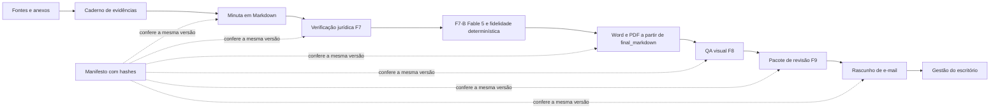
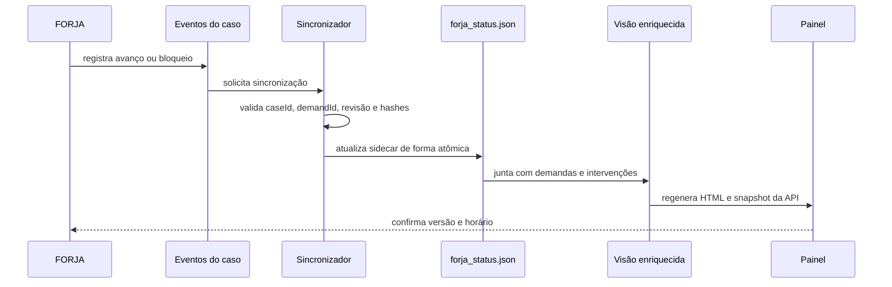
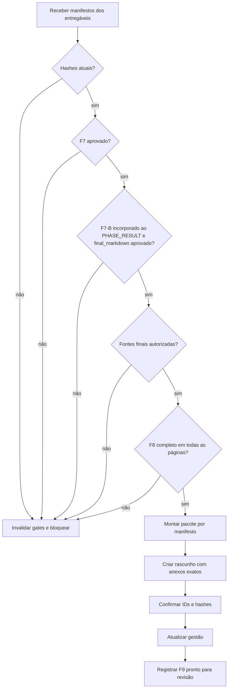

# Consulta IA — FORJA N3 — PLANO DE INTEGRIDADE, CONTEXTO, VISUAL E GESTÃO

> Cópia de consulta derivada. O documento canônico permanece no caminho de origem indicado abaixo.

## Metadados e rastreabilidade

- **Documento de origem:** `08_PLANO_FORJA_N3_INTEGRIDADE_VISUAL_E_GESTAO.md`
- **Tipo:** Plano
- **SHA-256 da origem:** `3300bf75928e8c284e9fc6d6aa745ad30613b0812e5651087888c0784336d7a7`
- **Linhas da origem:** 1201
- **Blocos integralmente indexados:** 75
- **Geração:** 2026-08-10T13:53:35-03:00
- **Cobertura:** 100% das linhas e do texto da origem, sem omissão.
- **Links relativos normalizados:** 0 destino(s), apenas para preservar a navegação na cópia.

## Roteiro de consulta para IA

**Síntese de localização:** Status: proposta de implementação incremental — revisão 2 Revisado em: 09/07/2026 Base preservada: FORJA N2, fases F0–F10, Helena, Cícero, red team, verificadores, template Medina Osório, Word COM, SVG→EMF, Gmail em rascunho e revisão humana. Auditoria de origem: ../reports/AUDITORIACOMPLETAFORJA562026-07-09.md

**Termos de recuperação:** json, não, fase, revisão, versão, estado, painel, visual, fonte, etapa, arquivo, contexto.

Use o índice abaixo para localizar o bloco pertinente. Cada entrada informa as linhas exatas no documento de origem. Para afirmações materiais, leia o bloco integral e confira o arquivo canônico pelo SHA-256.

## Índice detalhado e cobertura integral

- [SRC-S001 · L1–L9 · FORJA N3 — PLANO DE INTEGRIDADE, CONTEXTO, VISUAL E GESTÃO](#src-s001)
  - Assuntos: plano, integridade, contexto, visual, gestão, revisão, status, proposta
  - Trecho-guia: Status: proposta de implementação incremental — revisão 2 Revisado em: 09/07/2026 Base preservada: FORJA N2, fases F0–F10, Helena, Cícero, red team, verificadores, template Medina Osório, Word COM, SVG→EMF, Gmail em rascunho e revisão humana. Auditoria de origem: ../reports/AUDIT
  - SHA-256 do bloco: `2100375add777dff95f944b4be4d9e78b6b8c2aead879dc7d3fff143a2937187`
  - [SRC-S002 · L10–L24 · 1. Objetivo da N3](#src-s002)
    - Caminho: FORJA N3 — PLANO DE INTEGRIDADE, CONTEXTO, VISUAL E GESTÃO > 1. Objetivo da N3
    - Assuntos: não, onde, objetivo, integridade, avance, todo, fonte, página
    - Trecho-guia: A FORJA N3 não substitui a N2. Ela acrescenta uma camada de integridade para garantir que:
    - SHA-256 do bloco: `837b6ec5486dd3437ba0de237cc96577e8de73f95a9bfb8e43c209e77bcd3c4c`
  - [SRC-S003 · L25–L36 · 1.1 Correções incorporadas na revisão 2](#src-s003)
    - Caminho: FORJA N3 — PLANO DE INTEGRIDADE, CONTEXTO, VISUAL E GESTÃO > 1.1 Correções incorporadas na revisão 2
    - Assuntos: revisão, correções, incorporadas, não, painel, serão, será, docx
    - Trecho-guia: A primeira versão do plano ainda deixava sete ambiguidades que poderiam recriar os problemas auditados. Esta revisão as resolve antes da implementação:
    - SHA-256 do bloco: `cae7643233cd182983a2d55a9698823129ea16a639325eca384d313497a0de81`
  - [SRC-S004 · L37–L49 · 1.2 Limites da versão](#src-s004)
    - Caminho: FORJA N3 — PLANO DE INTEGRIDADE, CONTEXTO, VISUAL E GESTÃO > 1.2 Limites da versão
    - Assuntos: limites, versão, não, pretende, automatizar, envio, protocolo, substituir
    - Trecho-guia: automatizar envio ou protocolo; substituir a decisão jurídica de Fábio, Igor ou do advogado responsável; transformar todo caso legado para o novo formato de uma vez; usar resumo como substituto do documento original; criar uma infraestrutura distribuída desnecessária; misturar at
    - SHA-256 do bloco: `0c0049a03aefad8db2143b4593befe716244a09de0e5a1dd0b14807899b408d5`
  - [SRC-S005 · L50–L77 · 2. Princípio central](#src-s005)
    - Caminho: FORJA N3 — PLANO DE INTEGRIDADE, CONTEXTO, VISUAL E GESTÃO > 2. Princípio central
    - Assuntos: confere, mesma, versão, princípio, central, pdf, novo, fluxo
    - Trecho-guia: O novo fluxo terá uma única cadeia de identidade:
    - SHA-256 do bloco: `7d1965fe1da8314c1b31423940b010ecc76073f7c87ae0fd27299ab3094c6421`
  - [SRC-S006 · L78–L79 · 3. Arquitetura incremental](#src-s006)
    - Caminho: FORJA N3 — PLANO DE INTEGRIDADE, CONTEXTO, VISUAL E GESTÃO > 3. Arquitetura incremental
    - Assuntos: arquitetura, incremental
    - Trecho-guia: Documento de consulta sobre 3. Arquitetura incremental.
    - SHA-256 do bloco: `0e2a34ca9bfee591d252a83df86fd77e5d316cf9c42d9edff1840b7d9b6dcc47`
  - [SRC-S007 · L80–L104 · 3.1 Novos artefatos canônicos por caso](#src-s007)
    - Caminho: FORJA N3 — PLANO DE INTEGRIDADE, CONTEXTO, VISUAL E GESTÃO > 3.1 Novos artefatos canônicos por caso
    - Assuntos: json, caso, não, páginas, novos, artefatos, canônicos, arquivos
    - Trecho-guia: Cada state/case-/ passará a poder conter, sem invalidar os arquivos antigos:
    - SHA-256 do bloco: `0f3c6c733657fdd760ba01467734d6f9b1ba585a84076f9afbcb2de7487197ff`
  - [SRC-S008 · L105–L120 · 3.2 Estado derivado, não atribuído](#src-s008)
    - Caminho: FORJA N3 — PLANO DE INTEGRIDADE, CONTEXTO, VISUAL E GESTÃO > 3.2 Estado derivado, não atribuído
    - Assuntos: estado, derivado, não, atribuído, fase, novo, módulo, proposto
    - Trecho-guia: Novo módulo proposto: FORJAHARNESS/forjastatemachine.py.
    - SHA-256 do bloco: `ddcf6638d8aab8acf6c56d136d0928e4547a87f5aed3c0656c9f81c492ad289d`
    - [SRC-S009 · L121–L132 · 3.2.1 Modelo de estado em três dimensões](#src-s009)
      - Caminho: FORJA N3 — PLANO DE INTEGRIDADE, CONTEXTO, VISUAL E GESTÃO > 3.2 Estado derivado, não atribuído > 3.2.1 Modelo de estado em três dimensões
      - Assuntos: blocked, modelo, estado, três, dimensões, phasecursor, qual, lifecyclestatus
      - Trecho-guia: Um único campo status não é suficiente. A N3 separará:
      - SHA-256 do bloco: `f392f9ca6b28c5ba492f19fa9f1deee4982d7a32ec8a253d42f32d59e49254d5`
    - [SRC-S010 · L133–L180 · 3.2.2 Contrato mínimo do evento](#src-s010)
      - Caminho: FORJA N3 — PLANO DE INTEGRIDADE, CONTEXTO, VISUAL E GESTÃO > 3.2 Estado derivado, não atribuído > 3.2.2 Contrato mínimo do evento
      - Assuntos: evento, escritor, contrato, mínimo, json, idempotencykey, caseid, runid
      - Trecho-guia: Regras de concorrência e recuperação:
      - SHA-256 do bloco: `2e02d0d603b1d7a888b7ea1d369f9a3b72e56363fb6d0861b37a560137029306`
    - [SRC-S011 · L181–L190 · Regra de reabertura](#src-s011)
      - Caminho: FORJA N3 — PLANO DE INTEGRIDADE, CONTEXTO, VISUAL E GESTÃO > 3.2 Estado derivado, não atribuído > Regra de reabertura
      - Assuntos: regra, reabertura, pesquisa, posterior, encontrar, problema, após, continua
      - Trecho-guia: Se uma pesquisa posterior encontrar problema após F9:
      - SHA-256 do bloco: `5c8ef7b30c0b2fb86e9f230b5b340271e6647d82dc07e4320c2ae074b80bfded`
  - [SRC-S012 · L191–L241 · 3.3 Manifesto do pacote](#src-s012)
    - Caminho: FORJA N3 — PLANO DE INTEGRIDADE, CONTEXTO, VISUAL E GESTÃO > 3.3 Manifesto do pacote
    - Assuntos: manifesto, path, sha256, não, zero, pendência, pacote, json
    - Trecho-guia: FORJAPACKAGE.json será a lista definitiva do que saiu da FORJA.
    - SHA-256 do bloco: `ea2894e6e853531e95e5b19b079698827faa45d801ea8e33fe86ea74b799c6de`
  - [SRC-S013 · L242–L259 · 3.4 Matriz de fontes de verdade](#src-s013)
    - Caminho: FORJA N3 — PLANO DE INTEGRIDADE, CONTEXTO, VISUAL E GESTÃO > 3.4 Matriz de fontes de verdade
    - Assuntos: json, painel, fontes, fonte, matriz, verdade, canônica, pacote
    - Trecho-guia: Nenhuma visão derivada pode ser usada para reescrever sua própria fonte canônica.
    - SHA-256 do bloco: `cec89aecb4e7f3e64e82c32b48204dd6a10e0a1b92d08f268ac481e932cd613d`
  - [SRC-S014 · L260–L261 · 4. Continuidade de contexto sem perda de sentido](#src-s014)
    - Caminho: FORJA N3 — PLANO DE INTEGRIDADE, CONTEXTO, VISUAL E GESTÃO > 4. Continuidade de contexto sem perda de sentido
    - Assuntos: continuidade, contexto, perda, sentido
    - Trecho-guia: Documento de consulta sobre 4. Continuidade de contexto sem perda de sentido.
    - SHA-256 do bloco: `b75f7598819c1561d6b0932ccd1602ec41c987216baa3fde02ad8ff76cdafc5d`
  - [SRC-S015 · L262–L267 · 4.1 Correção da premissa](#src-s015)
    - Caminho: FORJA N3 — PLANO DE INTEGRIDADE, CONTEXTO, VISUAL E GESTÃO > 4.1 Correção da premissa
    - Assuntos: correção, premissa, contexto, longo, não, continuará, sendo, usado
    - Trecho-guia: Contexto longo continuará sendo usado, mas não será tratado como garantia de leitura uniforme. A N3 adotará contexto longo com cadernos de evidência por fase.
    - SHA-256 do bloco: `968182b3a64f4533a6d0b0b367565ad46bb87b4350405c28a960b8704d6b73f3`
  - [SRC-S016 · L268–L283 · 4.2 Unidade mínima: afirmação com lastro](#src-s016)
    - Caminho: FORJA N3 — PLANO DE INTEGRIDADE, CONTEXTO, VISUAL E GESTÃO > 4.2 Unidade mínima: afirmação com lastro
    - Assuntos: afirmação, unidade, mínima, lastro, agente, cada, fato, decisivo
    - Trecho-guia: factId estável; texto da afirmação; entidade envolvida; data/período; sourceId; página/evento; trecho de apoio; classificação: comprovado, declarado, inferido, conflitante ou não verificado; uso permitido na peça; agente que extraiu; agente que confirmou.
    - SHA-256 do bloco: `a235a3c5d9e6a798cbc40854738a71099d5902699a72892c823bf2f8c35a36b6`
  - [SRC-S017 · L284–L298 · 4.3 Pacotes de entrada por fase](#src-s017)
    - Caminho: FORJA N3 — PLANO DE INTEGRIDADE, CONTEXTO, VISUAL E GESTÃO > 4.3 Pacotes de entrada por fase
    - Assuntos: fase, originais, pacotes, entrada, índice, fatos, arquivos, recebe
    - Trecho-guia: Documento de consulta sobre 4.3 Pacotes de entrada por fase.
    - SHA-256 do bloco: `afe0fc965348e82ce9f498e350e31d917ea5d4326cd77122f9256ffb2921ff8a`
  - [SRC-S018 · L299–L310 · 4.4 Limites operacionais](#src-s018)
    - Caminho: FORJA N3 — PLANO DE INTEGRIDADE, CONTEXTO, VISUAL E GESTÃO > 4.4 Limites operacionais
    - Assuntos: recebe, limites, operacionais, documento, partes, cada, resumo, redator
    - Trecho-guia: documento grande é indexado por partes e páginas; cada leitor registra intervalo lido, método, falha de extração e cobertura do documento; resumo nunca substitui o acesso ao original; o redator recebe os fatos/proposições aprovados e pode reabrir a fonte; o auditor recebe a peça 
    - SHA-256 do bloco: `fab3fb835b8052005c5f9efa626b6fbb0979a495e35a5be369e7f2d3110fb44f`
  - [SRC-S019 · L311–L322 · 4.5 Gate contra contaminação entre casos](#src-s019)
    - Caminho: FORJA N3 — PLANO DE INTEGRIDADE, CONTEXTO, VISUAL E GESTÃO > 4.5 Gate contra contaminação entre casos
    - Assuntos: casos, gate, contra, contaminação, relatório, novo, teste, forja_case_isolation
    - Trecho-guia: cria lista de entidades esperadas do caso; varre peça, relatório, e-mail e manifesto por nomes exclusivos de outros casos; sinaliza referência estrangeira; permite modelos e citações comuns por whitelist; bloqueia F9 se houver entidade externa sem justificativa.
    - SHA-256 do bloco: `11d88d12e23f8b5c3b04decaa99514d268d1f121cc2cf92e43d2047318f91105`
  - [SRC-S020 · L323–L335 · 4.6 Cobertura, compressão e estouro de contexto](#src-s020)
    - Caminho: FORJA N3 — PLANO DE INTEGRIDADE, CONTEXTO, VISUAL E GESTÃO > 4.6 Cobertura, compressão e estouro de contexto
    - Assuntos: contexto, cobertura, compressão, estouro, cada, páginas, pacote, agente
    - Trecho-guia: quantidade de páginas disponíveis e efetivamente cobertas; páginas sem texto, OCR duvidoso ou leitura visual pendente; itens deliberadamente excluídos e justificativa; tamanho do pacote entregue a cada agente; checkpoint de continuidade antes de trocar de agente ou resumir contex
    - SHA-256 do bloco: `1c2caa4c359e951c269e34870f67ecf625ff79a741a732d0fb840ce4d5ee954c`
  - [SRC-S021 · L336–L347 · 4.7 Fidelidade semântica entre formatos](#src-s021)
    - Caminho: FORJA N3 — PLANO DE INTEGRIDADE, CONTEXTO, VISUAL E GESTÃO > 4.7 Fidelidade semântica entre formatos
    - Assuntos: fidelidade, semântica, formatos, parágrafos, docx, terá, três, comparações
    - Trecho-guia: A N3 terá três comparações complementares:
    - SHA-256 do bloco: `5587ac244a82fc8ab8e8e5601e08f48ed8e860f81868b0660468c02b74724320`
  - [SRC-S022 · L348–L349 · 5. Gates jurídicos N3](#src-s022)
    - Caminho: FORJA N3 — PLANO DE INTEGRIDADE, CONTEXTO, VISUAL E GESTÃO > 5. Gates jurídicos N3
    - Assuntos: gates, jurídicos
    - Trecho-guia: Documento de consulta sobre 5. Gates jurídicos N3.
    - SHA-256 do bloco: `2ceacb459370943d465d2381d999d3352cf6f16a928c46827a9ddf591eaf5b71`
  - [SRC-S023 · L350–L359 · 5.1 Gate F5 — fonte utilizável](#src-s023)
    - Caminho: FORJA N3 — PLANO DE INTEGRIDADE, CONTEXTO, VISUAL E GESTÃO > 5.1 Gate F5 — fonte utilizável
    - Assuntos: fonte, deve, ser, gate, utilizável, artefatos, protocolavel, toda
    - Trecho-guia: toda jurisprudência, súmula, tema, regimento e citação literal deve possuir fonte; finalUseAllowed deve ser true; citacoesNaoConferidas deve ser vazio; a fonte deve ter hash ou URL oficial + data de consulta; duplicatas de fonte devem ser consolidadas por identificador canônico.
    - SHA-256 do bloco: `c7e09bee5a840bb776f7102fa3f3f84018c30a04cdfeeaa51e4e9717467e3ddf`
  - [SRC-S024 · L360–L378 · 5.2 Gate F7 — conteúdo](#src-s024)
    - Caminho: FORJA N3 — PLANO DE INTEGRIDADE, CONTEXTO, VISUAL E GESTÃO > 5.2 Gate F7 — conteúdo
    - Assuntos: gate, conteúdo, quando, passa, somente, artefato, personas, obrigatórias
    - Trecho-guia: p0 == 0; personas obrigatórias presentes quando aplicáveis; citações finais conferidas; fatos decisivos apontam para factId autorizado; nenhum placeholder proibido; nenhuma entidade estrangeira inexplicada; relatório e arquivo têm hashes correspondentes.
    - SHA-256 do bloco: `41687ec2f3c45a20e1fe9c573132ca811a1e132b3b83f20d9df6b36766fb4bee`
    - [SRC-S025 · L379–L386 · 5.2-A Gate F7-B — texto final canônico](#src-s025)
      - Caminho: FORJA N3 — PLANO DE INTEGRIDADE, CONTEXTO, VISUAL E GESTÃO > 5.2 Gate F7 — conteúdo > 5.2-A Gate F7-B — texto final canônico
      - Assuntos: não, gate, f7-b, texto, final, canônico, tentativas, conclusão
      - Trecho-guia: Para tentativas F7 novas, zero P0 é pré-condição, não conclusão do conteúdo textual. O operador executa forjafable5.py de forma controlada dentro da tentativa; forjarun.py não faz essa chamada automaticamente. O editor usa claude-fable-5 pela autenticação OAuth Claude Max, sem AP
      - SHA-256 do bloco: `5af0ef5b82fac87843815481b64c8bb7afd4f1a2730d8d783db8934e211bc218`
  - [SRC-S026 · L387–L397 · 5.3 Gate F9 — pacote](#src-s026)
    - Caminho: FORJA N3 — PLANO DE INTEGRIDADE, CONTEXTO, VISUAL E GESTÃO > 5.3 Gate F9 — pacote
    - Assuntos: não, pacote, gate, arquivo, existir, cria, rascunho, qualquer
    - Trecho-guia: qualquer entregável protocolável estiver com fonte não conferida; F7/F8 estiverem vencidos por mudança de hash; algum arquivo listado não existir; o anexo escolhido não for o arquivo do manifesto; EMAILRESPOSTA.txt/equivalente canônico não existir; o conjunto de anexos divergir d
    - SHA-256 do bloco: `c37c943d6df67d4a6785abafb69440b2b247d9d2be6eec701ff26f2a1f736513`
  - [SRC-S027 · L398–L412 · 5.4 Gate F10 — evidência](#src-s027)
    - Caminho: FORJA N3 — PLANO DE INTEGRIDADE, CONTEXTO, VISUAL E GESTÃO > 5.4 Gate F10 — evidência
    - Assuntos: evidência, gate, f10, arquivo, válida, deve, ser, estruturada
    - Trecho-guia: Evidência válida deve ser estruturada:
    - SHA-256 do bloco: `3abaf494363129542887ebac667db018efe598495bf0b2e6ece79c78fcd6facc`
  - [SRC-S028 · L413–L414 · 6. QA visual N3](#src-s028)
    - Caminho: FORJA N3 — PLANO DE INTEGRIDADE, CONTEXTO, VISUAL E GESTÃO > 6. QA visual N3
    - Assuntos: visual
    - Trecho-guia: Documento de consulta sobre 6. QA visual N3.
    - SHA-256 do bloco: `a9e0e951929d21e224f5c71d4d7bf328d860be159221b0c7f0db7f8057f547bb`
  - [SRC-S029 · L415–L434 · 6.1 Separar geração, inspeção e aprovação](#src-s029)
    - Caminho: FORJA N3 — PLANO DE INTEGRIDADE, CONTEXTO, VISUAL E GESTÃO > 6.1 Separar geração, inspeção e aprovação
    - Assuntos: aprovação, pdf, páginas, revisor, não, separar, geração, inspeção
    - Trecho-guia: 1. rendered: PDF virou imagens; 2. lintpassed: verificações geométricas e textuais passaram; 3. independentreviewpassed: todas as páginas foram examinadas e registradas por agente/revisor diferente do gerador.
    - SHA-256 do bloco: `8b81ba007b48dba0afe5bef7b53b34f294463c31417175a07c0c75e4bd90246e`
  - [SRC-S030 · L435–L457 · 6.2 Validador SVG V2](#src-s030)
    - Caminho: FORJA N3 — PLANO DE INTEGRIDADE, CONTEXTO, VISUAL E GESTÃO > 6.2 Validador SVG V2
    - Assuntos: texto, svg, validador, mínima, final, dentro, outro, conteúdo
    - Trecho-guia: Novo módulo proposto: FERRAMENTAS/medinavisuallint.py.
    - SHA-256 do bloco: `dc327113f0576848c43a8a46d5688f0e088c473467fe30ecdac97551bd0eef18`
  - [SRC-S031 · L458–L470 · 6.3 Parser Markdown visual](#src-s031)
    - Caminho: FORJA N3 — PLANO DE INTEGRIDADE, CONTEXTO, VISUAL E GESTÃO > 6.3 Parser Markdown visual
    - Assuntos: markdown, parser, visual, não, correções, forja_visual, reconhecer, tratar
    - Trecho-guia: reconhecer H1–H6; tratar blockquotes de forma própria; remover gramática Markdown que não deve aparecer; preservar listas, tabelas e notas; dimensionar colunas de tabela por conteúdo, não por divisão igual fixa; validar numeração de figuras; impedir legenda dupla; substituir o ga
    - SHA-256 do bloco: `b1b2167028530326e33e96c81c07e00107e2edcbb2ad5fa5c80c41d4aaaba622`
  - [SRC-S032 · L471–L484 · 6.4 Cobertura de conteúdo V2](#src-s032)
    - Caminho: FORJA N3 — PLANO DE INTEGRIDADE, CONTEXTO, VISUAL E GESTÃO > 6.4 Cobertura de conteúdo V2
    - Assuntos: cobertura, conteúdo, gate, linhas, caracteres, atual, usa, acima
    - Trecho-guia: O gate atual usa linhas acima de 60 caracteres e os primeiros 150 caracteres. O novo gate deve comparar:
    - SHA-256 do bloco: `87f5a3deaa95c9ecedf0d40c9ab7d6c46019343128ceaf2007e2ed5323a003f4`
  - [SRC-S033 · L485–L512 · 6.5 Ledger página a página](#src-s033)
    - Caminho: FORJA N3 — PLANO DE INTEGRIDADE, CONTEXTO, VISUAL E GESTÃO > 6.5 Ledger página a página
    - Assuntos: página, ledger, json, pass, exemplo, f8_qa_ledger, pdfsha256, pagecount
    - Trecho-guia: Se o PDF mudar, o ledger fica automaticamente vencido.
    - SHA-256 do bloco: `b8db5edf58b007855b13fddc0fd61594d98e7ff3bf0c41cb46a2f63b07adddc7`
  - [SRC-S034 · L513–L528 · 6.6 Regressões visuais obrigatórias](#src-s034)
    - Caminho: FORJA N3 — PLANO DE INTEGRIDADE, CONTEXTO, VISUAL E GESTÃO > 6.6 Regressões visuais obrigatórias
    - Assuntos: regressões, visuais, obrigatórias, caso-17, caso-16, rótulos, caso-19, caso-07
    - Trecho-guia: Transformar os defeitos reais em fixtures:
    - SHA-256 do bloco: `a7546ed96cf7307cc416e6d6156666333a76485852b3929d8edb66548dd8e9e8`
  - [SRC-S035 · L529–L550 · 6.7 QA em quatro camadas](#src-s035)
    - Caminho: FORJA N3 — PLANO DE INTEGRIDADE, CONTEXTO, VISUAL E GESTÃO > 6.7 QA em quatro camadas
    - Assuntos: página, quatro, camadas, tabelas, cabeçalho, rodapé, fólio, branco
    - Trecho-guia: cabeçalho ou rodapé ausente/inconsistente; número de página duplicado, cortado ou deslocado; linha órfã de título no fim da página; tabela partida de forma ilegível; página em branco não intencional; nota lateral colidindo com corpo ou fólio; figura afastada do argumento que deve
    - SHA-256 do bloco: `6b079848f735b48ea6ee847d0f50dc31c958fa680f7eea757160038a9b517b89`
  - [SRC-S036 · L551–L552 · 7. Integração com a gestão do escritório](#src-s036)
    - Caminho: FORJA N3 — PLANO DE INTEGRIDADE, CONTEXTO, VISUAL E GESTÃO > 7. Integração com a gestão do escritório
    - Assuntos: integração, gestão, escritório
    - Trecho-guia: Documento de consulta sobre 7. Integração com a gestão do escritório.
    - SHA-256 do bloco: `d92d6bf090af71bd1e517dafa0309f871dbe004d2edf4a9e19c2c2f0caed8d26`
  - [SRC-S037 · L553–L562 · 7.1 Papel de ABRIRGESTAOESCRITORIO.html](#src-s037)
    - Caminho: FORJA N3 — PLANO DE INTEGRIDADE, CONTEXTO, VISUAL E GESTÃO > 7.1 Papel de ABRIRGESTAOESCRITORIO.html
    - Assuntos: papel, html, lançador, será, local, abrirgestaoescritorio, abrir_gestao_escritorio, preservado
    - Trecho-guia: O lançador será preservado. Ele continuará abrindo:
    - SHA-256 do bloco: `7c12ccc2762a3da65e7c517b26da4d5f55dbfcc334b74cf244fa0512e08eff97`
  - [SRC-S038 · L563–L574 · 7.2 Sincronizador file-first](#src-s038)
    - Caminho: FORJA N3 — PLANO DE INTEGRIDADE, CONTEXTO, VISUAL E GESTÃO > 7.2 Sincronizador file-first
    - Assuntos: file-first, sincronizador, servidor, pelo, novo, módulo, proposto, gestao_escritorio
    - Trecho-guia: Novo módulo proposto: gestaoescritorio/scripts/syncforjagestao.py.
    - SHA-256 do bloco: `30d23beb7838a67248fa241ed18b9b6464c7a965a9979789a980396b79d298e2`
    - [SRC-S039 · L575–L621 · Decisão de propriedade dos dados](#src-s039)
      - Caminho: FORJA N3 — PLANO DE INTEGRIDADE, CONTEXTO, VISUAL E GESTÃO > 7.2 Sincronizador file-first > Decisão de propriedade dos dados
      - Assuntos: json, participant, não, demandid, vínculo, caso, sidecar, sincronizador
      - Trecho-guia: O sincronizador não altera demandas.json. A rotina atual updatedashboardlocal.ps1 reconstrói esse arquivo e depois aplica intervencoesmanuais.json; inserir a FORJA nele criaria disputa de escrita e risco de perda no próximo refresh.
      - SHA-256 do bloco: `6104490a68396cef469bba0c539dfc45297d62d5fb146adaab51617b484466b1`
  - [SRC-S040 · L622–L664 · 7.3 Visão forja unida à demanda](#src-s040)
    - Caminho: FORJA N3 — PLANO DE INTEGRIDADE, CONTEXTO, VISUAL E GESTÃO > 7.3 Visão forja unida à demanda
    - Assuntos: demanda, json, pass, visão, status, unida, painel, não
    - Trecho-guia: O bloco abaixo aparece na visão enriquecida da demanda e no snapshot do painel. Sua fonte é forjastatus.json, não uma mutação de demandas.json:
    - SHA-256 do bloco: `4ab956ade372a866494f8c600029ff06bb8869f20fcc29fcefba26f290db7338`
  - [SRC-S041 · L665–L677 · 7.3.1 Contrato de precedência](#src-s041)
    - Caminho: FORJA N3 — PLANO DE INTEGRIDADE, CONTEXTO, VISUAL E GESTÃO > 7.3.1 Contrato de precedência
    - Assuntos: contrato, precedência, demanda, não, derivado, ação, manual, campo
    - Trecho-guia: Isso evita que “pronta para revisão” apague uma pendência administrativa ou que uma ação manual antiga esconda o bloqueador técnico da FORJA.
    - SHA-256 do bloco: `665d73398f2df1dae359513de8d9911f91eebe458d80e48c1c4db70e29dfd8c8`
  - [SRC-S042 · L678–L694 · 7.4 Atualizações automáticas](#src-s042)
    - Caminho: FORJA N3 — PLANO DE INTEGRIDADE, CONTEXTO, VISUAL E GESTÃO > 7.4 Atualizações automáticas
    - Assuntos: criado, atualizações, automáticas, caso, aprovado, reprovado, eventos, obrigam
    - Trecho-guia: caso criado; fase iniciada/concluída; bloqueio ou desbloqueio; parecer Helena/Cícero registrado; F7 aprovado/reprovado; F8 aprovado/reprovado; pacote criado; rascunho Gmail criado; envio confirmado; caso encerrado ou substituído.
    - SHA-256 do bloco: `154489199f7244ace89857bf45e490ffc97c2d9b08a49129a23888236bd41ee9`
  - [SRC-S043 · L695–L711 · 7.5 Campos do painel](#src-s043)
    - Caminho: FORJA N3 — PLANO DE INTEGRIDADE, CONTEXTO, VISUAL E GESTÃO > 7.5 Campos do painel
    - Assuntos: campos, painel, fase, última, cada, demanda, exibir, não
    - Trecho-guia: “FORJA não executada”, “em andamento”, “bloqueada”, “pronta para revisão” ou “enviada”; fase atual e última fase concluída; horário da última sincronização; alerta de estado desatualizado; P0/P1 e bloqueadores; fontes oficiais: conferidas/pendentes; QA visual: páginas revisadas/t
    - SHA-256 do bloco: `88643115e18e0ba779d1d5295276dba6e3d6402491998009bccaf1590e26a01d`
    - [SRC-S044 · L712–L724 · Links que realmente abrem](#src-s044)
      - Caminho: FORJA N3 — PLANO DE INTEGRIDADE, CONTEXTO, VISUAL E GESTÃO > 7.5 Campos do painel > Links que realmente abrem
      - Assuntos: links, servidor, local, caminho, realmente, abrem, painel, botão
      - Trecho-guia: O painel não emitirá links file:///C:/.... Cada botão de artefato enviará caseId + artifactId ao servidor local. O servidor resolverá o caminho exclusivamente pelo FORJAPACKAGE.json e então abrirá o arquivo com o aplicativo padrão do Windows ou a pasta correspondente.
      - SHA-256 do bloco: `28b272ced6636a0c13f12221e85ace2f034d95e276cf2e1d12404f2625a9f6bf`
  - [SRC-S045 · L725–L732 · 7.6 Regra de status da demanda](#src-s045)
    - Caminho: FORJA N3 — PLANO DE INTEGRIDADE, CONTEXTO, VISUAL E GESTÃO > 7.6 Regra de status da demanda
    - Assuntos: demanda, regra, status, não, rascunho, criado, marca, cumprida
    - Trecho-guia: rascunho criado não marca cumprida; readyforreview e draftawaitingreview mantêm a demanda aberta; somente sentconfirmed, protocolo ou reconciliação comprovada podem concluir; mudança manual continua possível, mas deve registrar evidência estruturada; divergência estado/painel ger
    - SHA-256 do bloco: `2c61e098d0f4d3d8163c25770a3c82e9cb146560496fd69a7e801376b19509b7`
  - [SRC-S046 · L733–L746 · 7.7 Endpoint opcional](#src-s046)
    - Caminho: FORJA N3 — PLANO DE INTEGRIDADE, CONTEXTO, VISUAL E GESTÃO > 7.7 Endpoint opcional
    - Assuntos: api, caseid, post, endpoint, opcional, get, depois, sincronizador
    - Trecho-guia: Depois do sincronizador file-first estável, o servidor pode expor:
    - SHA-256 do bloco: `6b70bbb9a73bd842d8060c21a4bec5f7795571b1458bdc44aa527996f36f7082`
  - [SRC-S047 · L747–L748 · 8. Fechamento único do ciclo](#src-s047)
    - Caminho: FORJA N3 — PLANO DE INTEGRIDADE, CONTEXTO, VISUAL E GESTÃO > 8. Fechamento único do ciclo
    - Assuntos: fechamento, único, ciclo
    - Trecho-guia: Documento de consulta sobre 8. Fechamento único do ciclo.
    - SHA-256 do bloco: `b1b536580f215aa33fd55ee17fcaa257b3dd4151887d0eac8ccc49073fbcdaf9`
  - [SRC-S048 · L749–L773 · 8.1 Executor canônico e retomável](#src-s048)
    - Caminho: FORJA N3 — PLANO DE INTEGRIDADE, CONTEXTO, VISUAL E GESTÃO > 8.1 Executor canônico e retomável
    - Assuntos: tentativa, executor, canônico, fase, não, válida, retomável, novo
    - Trecho-guia: O fechamento só será confiável se as fases anteriores também tiverem um caminho reproduzível. Novo módulo proposto: FORJAHARNESS/forjarun.py.
    - SHA-256 do bloco: `0c9cb392156f7247131edfd4b059abac5ab419dae83199a2235bc5c5b8973720`
  - [SRC-S049 · L774–L802 · 8.2 Fechamento F7→F10](#src-s049)
    - Caminho: FORJA N3 — PLANO DE INTEGRIDADE, CONTEXTO, VISUAL E GESTÃO > 8.2 Fechamento F7→F10
    - Assuntos: não, sim, hashes, rascunho, fechamento, f10, aprovado, pacote
    - Trecho-guia: Novo orquestrador proposto: FORJAHARNESS/forjaclosecycle.py.
    - SHA-256 do bloco: `62f27eb9038f9f87c2bbbba9cf054707604132f8b2c48233f16918b7a4e5b55e`
  - [SRC-S050 · L803–L820 · 8.3 Responsabilidades independentes](#src-s050)
    - Caminho: FORJA N3 — PLANO DE INTEGRIDADE, CONTEXTO, VISUAL E GESTÃO > 8.3 Responsabilidades independentes
    - Assuntos: pode, próprio, jurídico, visual, responsabilidades, independentes, aprovar, final
    - Trecho-guia: Em contingência, uma mesma IA pode desempenhar papéis em execuções separadas, mas nunca aprovar no mesmo runId o artefato que acabou de gerar sem uma nova revisão independente registrada.
    - SHA-256 do bloco: `eab2b36fa821d01ce180ee22c3933d740d7ee94061f152fe149d98ffd2035ce8`
  - [SRC-S051 · L821–L822 · 9. Plano de implementação seguro](#src-s051)
    - Caminho: FORJA N3 — PLANO DE INTEGRIDADE, CONTEXTO, VISUAL E GESTÃO > 9. Plano de implementação seguro
    - Assuntos: plano, implementação, seguro
    - Trecho-guia: Documento de consulta sobre 9. Plano de implementação seguro.
    - SHA-256 do bloco: `4e2da1e9a8e0a1f4b95869c504b339c002e2a08f01b39bae16a70033e2379fd5`
  - [SRC-S052 · L823–L836 · Etapa 0 — Congelamento da referência](#src-s052)
    - Caminho: FORJA N3 — PLANO DE INTEGRIDADE, CONTEXTO, VISUAL E GESTÃO > Etapa 0 — Congelamento da referência
    - Assuntos: etapa, congelamento, referência, estados, plano, mudança, comportamento, nenhuma
    - Trecho-guia: criar inventário e hashes dos scripts atuais; salvar snapshot dos 21 estados e dados da gestão; registrar quais casos são N2, reconciliados ou legados; documentar a matriz de fontes de verdade e schemas antes do primeiro código; fixar o hash do plano e dos contratos usados em cad
    - SHA-256 do bloco: `59991159b58b05b33d44889dab25b57f8f33e647f059f464802e36cc38d52597`
  - [SRC-S053 · L837–L855 · Etapa 1 — Testes que reproduzem os erros](#src-s053)
    - Caminho: FORJA N3 — PLANO DE INTEGRIDADE, CONTEXTO, VISUAL E GESTÃO > Etapa 1 — Testes que reproduzem os erros
    - Assuntos: teste, criar, testes, adicionar, etapa, reproduzem, erros, mudança
    - Trecho-guia: corrigir validatef7integration.py; adicionar teste de JSON global; adicionar testes de regressão de fase; adicionar testes de duas escritas concorrentes e revisão desatualizada; simular interrupção entre evento, materialização e sincronização; adicionar teste de fonte não autoriz
    - SHA-256 do bloco: `77bc335e417ad88a5e649f8508ecb7b505ada90bf9f1d39220196cbe951c8c61`
  - [SRC-S054 · L856–L868 · Etapa 2 — Manifesto e máquina de estados em sombra](#src-s054)
    - Caminho: FORJA N3 — PLANO DE INTEGRIDADE, CONTEXTO, VISUAL E GESTÃO > Etapa 2 — Manifesto e máquina de estados em sombra
    - Assuntos: estados, etapa, manifesto, máquina, sombra, eventos, json, estado
    - Trecho-guia: Mudança de comportamento: apenas gravação paralela, sem controlar produção.
    - SHA-256 do bloco: `22d8319a1684de996d9f71b15f3d29d4d75a8c64d0f8afa3685dde0dddc49aec`
  - [SRC-S055 · L869–L882 · Etapa 3 — Contexto estruturado](#src-s055)
    - Caminho: FORJA N3 — PLANO DE INTEGRIDADE, CONTEXTO, VISUAL E GESTÃO > Etapa 3 — Contexto estruturado
    - Assuntos: etapa, contexto, estruturado, página, mudança, comportamento, novos, cadernos
    - Trecho-guia: Mudança de comportamento: novos cadernos passam a acompanhar casos-piloto.
    - SHA-256 do bloco: `88526cae9dd641ea924e2ed60595f6fa33b0d4d9ce8be129afda56d03dbd68fb`
  - [SRC-S056 · L883–L897 · Etapa 4 — QA visual V2](#src-s056)
    - Caminho: FORJA N3 — PLANO DE INTEGRIDADE, CONTEXTO, VISUAL E GESTÃO > Etapa 4 — QA visual V2
    - Assuntos: visual, etapa, implementar, peças, defeitos, mudança, comportamento, gate
    - Trecho-guia: Mudança de comportamento: o gate novo roda em sombra e compara com o atual.
    - SHA-256 do bloco: `7e8eec2d1090af471588abc71fca1c7be7e47ffb55ba9842792896da8e74247e`
  - [SRC-S057 · L898–L912 · Etapa 5 — Sincronização com a gestão em sombra](#src-s057)
    - Caminho: FORJA N3 — PLANO DE INTEGRIDADE, CONTEXTO, VISUAL E GESTÃO > Etapa 5 — Sincronização com a gestão em sombra
    - Assuntos: não, etapa, sincronização, gestão, sombra, painel, json, demandas
    - Trecho-guia: Mudança de comportamento: gera arquivo de comparação, não altera painel oficial.
    - SHA-256 do bloco: `57f348e7c2fc7eade48c8e5e8b83baae7bb59bded54dded9f1248190b42f5d68`
  - [SRC-S058 · L913–L926 · Etapa 6 — Fechamento único em piloto](#src-s058)
    - Caminho: FORJA N3 — PLANO DE INTEGRIDADE, CONTEXTO, VISUAL E GESTÃO > Etapa 6 — Fechamento único em piloto
    - Assuntos: fechamento, etapa, único, piloto, caso, executar, pelo, painel
    - Trecho-guia: Mudança de comportamento: ativada por feature flag em um caso escolhido.
    - SHA-256 do bloco: `9e87fe5c255efde536c36c3920fb8d485a784243abc99ec22f5a3273c484bbd1`
  - [SRC-S059 · L927–L936 · Etapa 7 — Replay e promoção gradual](#src-s059)
    - Caminho: FORJA N3 — PLANO DE INTEGRIDADE, CONTEXTO, VISUAL E GESTÃO > Etapa 7 — Replay e promoção gradual
    - Assuntos: replay, etapa, promoção, gradual, novos, casos, caso-02, caso-07
    - Trecho-guia: replay em CASO-02, CASO-07, CASO-16, CASO-17, CASO-19/Fábio e Plano de Saúde; corrigir primeiro os módulos, não reescrever silenciosamente as peças; gerar relatório antes/depois; ativar N3 por novos casos; manter N2 disponível até três ciclos novos estáveis e o replay dos seis ca
    - SHA-256 do bloco: `30259640166675ebb3f4553165042e50670512f744f4e5651d21123ed818bee7`
  - [SRC-S060 · L937–L968 · 10. Feature flags e rollback](#src-s060)
    - Caminho: FORJA N3 — PLANO DE INTEGRIDADE, CONTEXTO, VISUAL E GESTÃO > 10. Feature flags e rollback
    - Assuntos: false, flags, rollback, feature, json, eventstorev1, statemachinev2, managementsidecarv1
    - Trecho-guia: ativação independente; dependências explícitas: stateMachineV2 depende de eventStoreV1; fechamento depende de state machine, F7 e F8 válidos; default false até concluir etapa de sombra; nenhuma migração destrutiva; backup antes da primeira escrita em cada base; escrita atômica co
    - SHA-256 do bloco: `53010331a155334b27cd37dfbc084a79c6149a311468c3a585225b7c0f509e36`
  - [SRC-S061 · L969–L1010 · 11. Matriz de testes obrigatórios](#src-s061)
    - Caminho: FORJA N3 — PLANO DE INTEGRIDADE, CONTEXTO, VISUAL E GESTÃO > 11. Matriz de testes obrigatórios
    - Assuntos: reprovar, evento, após, bloquear, pdf, não, fase, estado
    - Trecho-guia: Documento de consulta sobre 11. Matriz de testes obrigatórios.
    - SHA-256 do bloco: `6701acf96458c495b449e458fdead1031a29d18f795597abfcb5ca592f0dd098`
  - [SRC-S062 · L1011–L1025 · 11.1 Corpus de regressão obrigatório](#src-s062)
    - Caminho: FORJA N3 — PLANO DE INTEGRIDADE, CONTEXTO, VISUAL E GESTÃO > 11.1 Corpus de regressão obrigatório
    - Assuntos: regressão, não, corpus, obrigatório, caso, replay, provar, relatório
    - Trecho-guia: Cada replay roda sobre cópia imutável do caso, produz relatório antes/depois e não substitui a peça histórica. O objetivo é provar o gate, não “embelezar” retroativamente o acervo.
    - SHA-256 do bloco: `43165e4916497084b65ec6344c0c600dee94f63979b8634c0c2befc80d660991`
  - [SRC-S063 · L1026–L1054 · 12. Critérios de aceitação da N3](#src-s063)
    - Caminho: FORJA N3 — PLANO DE INTEGRIDADE, CONTEXTO, VISUAL E GESTÃO > 12. Critérios de aceitação da N3
    - Assuntos: pacote, não, todos, estado, painel, critérios, aceitação, pode
    - Trecho-guia: A versão só pode ser promovida quando todos os itens abaixo forem verdadeiros:
    - SHA-256 do bloco: `03d75891e6776eed1a0f68b40d18ec31e362e7eb01174d5dbe4b0126355c0203`
  - [SRC-S064 · L1055–L1056 · 13. Definição de pronto por camada](#src-s064)
    - Caminho: FORJA N3 — PLANO DE INTEGRIDADE, CONTEXTO, VISUAL E GESTÃO > 13. Definição de pronto por camada
    - Assuntos: definição, pronto, camada
    - Trecho-guia: Documento de consulta sobre 13. Definição de pronto por camada.
    - SHA-256 do bloco: `151812b8892c0e98a80082ecb086d3a6a34806c489b76b177889cb2cc0279d11`
    - [SRC-S065 · L1057–L1064 · Estado](#src-s065)
      - Caminho: FORJA N3 — PLANO DE INTEGRIDADE, CONTEXTO, VISUAL E GESTÃO > 13. Definição de pronto por camada > Estado
      - Assuntos: estado, transições, validadas, eventos, imutáveis, idempotentes, recuperáveis, concorrência
      - Trecho-guia: transições validadas; eventos imutáveis, idempotentes e recuperáveis; concorrência sem perda de atualização; reabertura explícita; compatibilidade N2.
      - SHA-256 do bloco: `2806f428d1331e4fcb5c8a982c2afb867440009c67e47d4e73c0c759a8933f7c`
    - [SRC-S066 · L1065–L1072 · Jurídico](#src-s066)
      - Caminho: FORJA N3 — PLANO DE INTEGRIDADE, CONTEXTO, VISUAL E GESTÃO > 13. Definição de pronto por camada > Jurídico
      - Assuntos: jurídico, fontes, finais, autorizadas, fatos, lastro, mapa, proveniência
      - Trecho-guia: fontes finais autorizadas; fatos com lastro; mapa de proveniência dos parágrafos decisivos; Helena, Cícero e red team registrados; classificação clara de papel, público e política de liberação.
      - SHA-256 do bloco: `d6b372e76fd81a4c2836c8bb8a55582db7c9ac595093a42ab73f11d91d9dbfbf`
    - [SRC-S067 · L1073–L1081 · Visual](#src-s067)
      - Caminho: FORJA N3 — PLANO DE INTEGRIDADE, CONTEXTO, VISUAL E GESTÃO > 13. Definição de pronto por camada > Visual
      - Assuntos: visual, nenhuma, pdf, svg, válido, colisão, conhecida, gramática
      - Trecho-guia: SVG válido; nenhuma colisão conhecida; nenhuma gramática Markdown vazada; todas as páginas revisadas por execução independente do gerador; estrutura Word/PDF validada; QA vinculado ao hash do PDF.
      - SHA-256 do bloco: `0f0e5d397e930bba27b75831ecf9ddc9170c5a44cb7e02a9814e517ec10a3bbb`
    - [SRC-S068 · L1082–L1089 · Pacote](#src-s068)
      - Caminho: FORJA N3 — PLANO DE INTEGRIDADE, CONTEXTO, VISUAL E GESTÃO > 13. Definição de pronto por camada > Pacote
      - Assuntos: pacote, manifesto, completo, anexos, exatos, e-mail, canônico, hashes
      - Trecho-guia: manifesto completo; anexos exatos; e-mail canônico; hashes, bytes e IDs confirmados; retry sem duplicar rascunho.
      - SHA-256 do bloco: `68f2370cc1dc9bac635c1788363815fccd0f09ae2e54cfa90f0617bab3f3986c`
    - [SRC-S069 · L1090–L1100 · Gestão](#src-s069)
      - Caminho: FORJA N3 — PLANO DE INTEGRIDADE, CONTEXTO, VISUAL E GESTÃO > 13. Definição de pronto por camada > Gestão
      - Assuntos: gestão, json, sidecar, forja_status, atualizado, unido, visão, demandas
      - Trecho-guia: sidecar forjastatus.json atualizado e unido à visão; demandas.json preservado como base da gestão; próxima ação real; status sem conclusão prematura; links por artifactId e evidência acessíveis; alerta de desatualização.
      - SHA-256 do bloco: `ec5c1c4ab3ca1e92ddaa9ae8314a6098f797435e8de84a891348f23f21e76501`
  - [SRC-S070 · L1101–L1117 · 14. Ordem de construção recomendada](#src-s070)
    - Caminho: FORJA N3 — PLANO DE INTEGRIDADE, CONTEXTO, VISUAL E GESTÃO > 14. Ordem de construção recomendada
    - Assuntos: ordem, construção, recomendada, schemas, contratos, fase, baseline, rollback
    - Trecho-guia: 1. schemas, contratos de fase e baseline de rollback; 2. testes de regressão, concorrência e interrupção; 3. eventos atômicos + máquina de estados; 4. executor retomável + cadernos de contexto; 5. gate jurídico F5/F7/F9; 6. QA visual V2 independente; 7. manifesto de pacote + fech
    - SHA-256 do bloco: `9dc4f72b1392f3b7f1613e8c99409483804f72383426540e664042c96fcf08d2`
  - [SRC-S071 · L1118–L1150 · 15. Métricas e aprendizado operacional](#src-s071)
    - Caminho: FORJA N3 — PLANO DE INTEGRIDADE, CONTEXTO, VISUAL E GESTÃO > 15. Métricas e aprendizado operacional
    - Assuntos: painel, métricas, aprendizado, operacional, cada, dados, fase, quantidade
    - Trecho-guia: Cada execução produzirá FORJARUNMETRICS.json com dados suficientes para detectar degradação sem depender da memória do agente:
    - SHA-256 do bloco: `b4c117453ac6c9e2d3ea7a1fd0ab6863e65906ab50fb627d56327ad2631282dd`
  - [SRC-S072 · L1151–L1166 · 16. Riscos controlados da implementação](#src-s072)
    - Caminho: FORJA N3 — PLANO DE INTEGRIDADE, CONTEXTO, VISUAL E GESTÃO > 16. Riscos controlados da implementação
    - Assuntos: caso, riscos, controlados, implementação, json, sidecar, risco, controle
    - Trecho-guia: Documento de consulta sobre 16. Riscos controlados da implementação.
    - SHA-256 do bloco: `92729de75ad727d4dfc683bbe532901f71706a48717075df1c1a571aaaf9a8f6`
  - [SRC-S073 · L1167–L1177 · 16.1 Controle de versão do próprio plano](#src-s073)
    - Caminho: FORJA N3 — PLANO DE INTEGRIDADE, CONTEXTO, VISUAL E GESTÃO > 16.1 Controle de versão do próprio plano
    - Assuntos: versão, controle, próprio, plano, não, contratos, esta, revisão
    - Trecho-guia: esta revisão 2 continua proposta e não muda o manifesto canônico N2; schemas e contratos terão versão própria; cada piloto registra o hash deste documento e dos contratos usados; alteração de regra durante um caso cria nova versão, não reinterpreta retroativamente eventos antigos
    - SHA-256 do bloco: `8dff85b0281f1c5d841bcaaadc06189afe333ec0beb342d66dd1dd59fcae69a9`
  - [SRC-S074 · L1178–L1196 · 17. Resultado esperado](#src-s074)
    - Caminho: FORJA N3 — PLANO DE INTEGRIDADE, CONTEXTO, VISUAL E GESTÃO > 17. Resultado esperado
    - Assuntos: resultado, esperado, não, final, usuário, abrirá, abrir_gestao_escritorio, html
    - Trecho-guia: Ao final, o usuário abrirá ABRIRGESTAOESCRITORIO.html e verá, para cada demanda:
    - SHA-256 do bloco: `91979804b214086323327cabde41cb91effd4e375b40045af12e0c232f0f8380`
  - [SRC-S075 · L1197–L1201 · 18. Nota histórica de implementação posterior — F7-B (15/07/2026)](#src-s075)
    - Caminho: FORJA N3 — PLANO DE INTEGRIDADE, CONTEXTO, VISUAL E GESTÃO > 18. Nota histórica de implementação posterior — F7-B (15/07/2026)
    - Assuntos: implementação, f7-b, nota, histórica, posterior, tentativas, sufixo, json
    - Trecho-guia: A revisão 2 deste plano nasceu antes da implementação do F7-B. O acréscimo acima registra o estado vigente sem reclassificar eventos históricos: tentativas anteriores permanecem interpretadas pelo contrato e specHash usados à época; tentativas novas exigem o bundle editorial.
    - SHA-256 do bloco: `7fa4a829751693500548bc0997e1159632d84c23581a4f268a96e44306166aef`

## Conteúdo integral indexado

Os marcadores HTML abaixo são apenas âncoras de navegação. O texto reproduz integralmente a origem normalizada em UTF-8; somente destinos de links relativos podem ter sido recalculados para apontar ao mesmo arquivo a partir desta pasta.

<a id="src-s001"></a>

# FORJA N3 — PLANO DE INTEGRIDADE, CONTEXTO, VISUAL E GESTÃO

**Status:** proposta de implementação incremental — revisão 2  
**Revisado em:** 09/07/2026  
**Base preservada:** FORJA N2, fases F0–F10, Helena, Cícero, red team, verificadores, template Medina Osório, Word COM, SVG→EMF, Gmail em rascunho e revisão humana.  
**Auditoria de origem:** `../reports/AUDITORIA_COMPLETA_FORJA_5_6_2026-07-09.md`

---


<a id="src-s002"></a>

## 1. Objetivo da N3

A FORJA N3 não substitui a N2. Ela acrescenta uma camada de integridade para garantir que:

1. cada fase avance por transição válida;
2. todo fato e fundamento importante preserve sua fonte e página;
3. o arquivo auditado seja exatamente o arquivo diagramado e anexado;
4. nenhuma peça final avance com fonte não autorizada;
5. nenhuma página seja aprovada apenas porque foi renderizada;
6. todo ciclo atualize automaticamente o sistema de gestão;
7. o painel mostre onde a FORJA rodou, onde não rodou, onde parou e por quê;
8. versões antigas continuem disponíveis e recuperáveis.

**Nome proposto:** FORJA N3 — Integridade Operacional e Visual.


<a id="src-s003"></a>

## 1.1 Correções incorporadas na revisão 2

A primeira versão do plano ainda deixava sete ambiguidades que poderiam recriar os problemas auditados. Esta revisão as resolve antes da implementação:

1. a FORJA **não escreverá diretamente** em `demandas.json`, porque esse arquivo é reconstruído por Gmail, WhatsApp, tarefas manuais e enriquecimentos locais;
2. a gestão receberá os estados da FORJA em uma base lateral própria, unida ao painel somente na leitura/renderização;
3. eventos terão sequência, revisão esperada, chave de idempotência e recuperação após interrupção;
4. fase processual, estado do ciclo e situação dos gates serão dimensões separadas;
5. o QA anterior à revisão humana será realizado por inspeção independente do gerador, sem o campo enganoso `humanReview`;
6. a fidelidade não será medida apenas entre Markdown e DOCX: haverá correspondência parágrafo→fato/fonte e comparação MD→DOCX→PDF;
7. links de artefatos no painel serão abertos pelo servidor local por `artifactId`, evitando caminhos `file:///` quebrados por espaços, acentos ou políticas do navegador.


<a id="src-s004"></a>

## 1.2 Limites da versão

A N3 não pretende:

- automatizar envio ou protocolo;
- substituir a decisão jurídica de Fábio, Igor ou do advogado responsável;
- transformar todo caso legado para o novo formato de uma vez;
- usar resumo como substituto do documento original;
- criar uma infraestrutura distribuída desnecessária;
- misturar atualização da FORJA com coleta de Gmail, WhatsApp ou agenda.

---


<a id="src-s005"></a>

## 2. Princípio central

O novo fluxo terá uma única cadeia de identidade:



Se qualquer arquivo mudar, os gates posteriores ficam vencidos e precisam ser refeitos. Não haverá “QA aprovado” para um PDF diferente daquele que foi anexado.

---


<a id="src-s006"></a>

## 3. Arquitetura incremental


<a id="src-s007"></a>

## 3.1 Novos artefatos canônicos por caso

Cada `state/case-*/` passará a poder conter, sem invalidar os arquivos antigos:

| Arquivo | Finalidade |
|---|---|
| `FORJA_CASE_MANIFEST.json` | identidade do caso, demanda, versão, execução e estado derivado |
| `events/000001-<eventId>.json` | evento canônico e imutável, gravado atomicamente; nenhuma fase apaga a anterior |
| `FORJA_EVENTS.jsonl` | exportação reconstruível para leitura e auditoria; não é a fonte primária de escrita |
| `F1_DOCUMENT_INDEX.json` | inventário de anexos com hash, tipo, páginas e status de leitura |
| `F1_COVERAGE.json` | páginas/partes efetivamente lidas, falhas de extração e releituras exigidas |
| `F3_FACT_LEDGER.json` | fatos, fonte, página, grau de certeza e uso permitido |
| `F3_CHRONOLOGY.json` | cronologia canônica e conflitos de datas |
| `F3_CONTRADICTIONS.json` | versões incompatíveis, lacunas e perguntas abertas |
| `F4_PROPOSITION_LEDGER.json` | proposições jurídicas aprovadas para redação |
| `F6_PARAGRAPH_PROVENANCE.json` | vínculo entre parágrafos da minuta, fatos, fontes e proposições jurídicas |
| `F7_GATE_RESULT.json` | veredito jurídico agregado por artefato e por pacote |
| `FABLE5_RESULT.json` | fragmento editorial a incorporar ao resultado completo F7; não substitui `PHASE_RESULT.json` |
| `editorial_fidelity.json` | hashes e invariantes recompostos entre `audited_markdown` e `final_markdown` |
| `F8_QA_LEDGER.json` | inspeção de todas as páginas e diagramas |
| `FORJA_PACKAGE.json` | arquivos finais, função, hashes e anexos do rascunho |
| `F10_DELIVERY_EVIDENCE.json` | evidência estruturada de revisão/envio/protocolo |

O `FORJA_STATE.json` continuará existindo durante toda a migração. Na N3 ele vira uma visão de compatibilidade gerada a partir dos eventos, não um arquivo que qualquer etapa pode sobrescrever livremente.


<a id="src-s008"></a>

## 3.2 Estado derivado, não atribuído

Novo módulo proposto: `_FORJA_HARNESS/forja_state_machine.py`.

Responsabilidades:

- validar a transição solicitada;
- registrar `eventId`, `eventSeq`, `idempotencyKey`, `runId`, `attemptId`, horário, fase, resultado e motivo;
- impedir regressão silenciosa;
- permitir reabertura explícita de um gate;
- calcular fase, ciclo, gates, bloqueadores e próxima ação em campos separados;
- gravar de forma atômica;
- rejeitar escrita quando a revisão esperada estiver desatualizada;
- recuperar a visão materializada a partir dos eventos após interrupção;
- manter compatibilidade com estados N2.


<a id="src-s009"></a>

### 3.2.1 Modelo de estado em três dimensões

Um único campo `status` não é suficiente. A N3 separará:

| Dimensão | Exemplos | Pergunta respondida |
|---|---|---|
| `phaseCursor` | `F5`, `F7`, `F9` | em qual etapa o ciclo está trabalhando? |
| `lifecycleStatus` | `running`, `blocked`, `ready_for_review`, `sent_confirmed` | qual é a situação operacional do caso? |
| `gateStatus` | `f7=pass`, `f8=stale`, `citations=blocked` | quais aprovações continuam válidas? |

Assim, uma pesquisa reaberta depois de F9 pode produzir `phaseCursor=F5`, `lifecycleStatus=blocked` e `f8=stale` sem apagar que F9 já ocorreu em uma tentativa anterior.


<a id="src-s010"></a>

### 3.2.2 Contrato mínimo do evento

```json
{
  "schemaVersion": 1,
  "eventId": "evt-uuid",
  "eventSeq": 42,
  "idempotencyKey": "caseId:runId:F7:attempt2:completed",
  "caseId": "case-...",
  "demandId": "email-...",
  "runId": "run-...",
  "attemptId": "attempt-...",
  "expectedRevision": 41,
  "type": "phase_completed",
  "phase": "F7_AUDITORIA",
  "result": "pass",
  "artifactHashes": {},
  "at": "ISO-8601",
  "actor": "forja-auditor"
}
```

Regras de concorrência e recuperação:

- somente um escritor mantém o lock curto do caso;
- `expectedRevision` diferente da última sequência reprova a escrita, sem sobrescrever trabalho alheio;
- repetir a mesma `idempotencyKey` devolve o evento existente;
- cada evento é criado em arquivo temporário e promovido por rename atômico;
- arquivo parcial nunca entra em `events/`;
- `FORJA_STATE.json`, JSONL e sincronização são reconstruíveis a partir dos eventos;
- lock abandonado possui expiração e somente é retomado depois de confirmar que não há escritor ativo;
- duas IAs podem ler e produzir artefatos paralelamente, mas a promoção de fase passa pelo escritor canônico.

Estados operacionais recomendados:

| Estado | Significado |
|---|---|
| `not_run` | a demanda não passou pela FORJA |
| `queued` | apta, aguardando início |
| `running` | existe fase em execução |
| `blocked` | impedimento concreto identificado |
| `ready_for_review` | pacote íntegro disponível para revisão humana |
| `draft_awaiting_review` | rascunho Gmail criado, sem envio confirmado |
| `sent_confirmed` | envio humano confirmado por evidência |
| `fulfilled_by_forja_f10` | ciclo encerrado com trilha completa |
| `fulfilled_by_reconciliation` | cumprimento anterior reconhecido por reconciliação |
| `superseded` | estado substituído por caso canônico |


<a id="src-s011"></a>

### Regra de reabertura

Se uma pesquisa posterior encontrar problema após F9:

- F9 continua registrado como tentativa concluída;
- é criado evento `gate_reopened` para F5/F7;
- o estado vira `blocked` ou `running`;
- o rascunho e o QA anterior ficam `stale`;
- a fase atual não volta silenciosamente para F5.


<a id="src-s012"></a>

## 3.3 Manifesto do pacote

`FORJA_PACKAGE.json` será a lista definitiva do que saiu da FORJA.

Campos mínimos:

```json
{
  "caseId": "case-...",
  "runId": "run-...",
  "createdAt": "ISO-8601",
  "status": "ready_for_review",
  "deliverables": [
    {
      "id": "peca-principal",
      "role": "protocolavel",
      "md": {"path": "...", "sha256": "..."},
      "docx": {"path": "...", "sha256": "..."},
      "pdf": {"path": "...", "sha256": "..."},
      "f7ResultSha256": "...",
      "f8ResultSha256": "..."
    }
  ],
  "draft": {
    "draftId": "...",
    "threadId": "...",
    "attachmentHashes": []
  }
}
```

Papéis permitidos:

- `protocolavel`;
- `memorando_interno`;
- `estudo_estrategico`;
- `parecer`;
- `anexo_visual`;
- `resposta_email`;
- `material_apoio`.

O papel do arquivo não basta para decidir o gate. Cada entregável terá também `audience` e `releasePolicy`:

| Política | Exemplos | Regra de fontes e pendências |
|---|---|---|
| `strict_protocol` | petição, memorial, representação pronta para uso | zero fonte não conferida, zero placeholder, zero pendência material |
| `decision_support` | estudo e parecer encaminhados a Fábio/Igor | pendência permitida somente se rotulada no próprio documento e no e-mail |
| `internal_working` | blueprint, red team, notas de leitura | pode conter hipóteses, sempre com classificação e sem aparência de peça final |

O texto do e-mail será gerado a partir do manifesto e dos gates. Ele não poderá afirmar “todas as fontes conferidas” quando existir qualquer pendência em um entregável anexado.


<a id="src-s013"></a>

## 3.4 Matriz de fontes de verdade

| Informação | Fonte canônica | Visões derivadas |
|---|---|---|
| evento e avanço de fase | `events/*.json` | `FORJA_STATE.json`, JSONL, painel |
| fato jurídico | `F3_FACT_LEDGER.json` + documento original | minuta, relatório, auditoria |
| validade da fonte | ledger de fontes/F5 | F7, pacote, e-mail |
| arquivo entregue | `FORJA_PACKAGE.json` por hash | draft Gmail, painel |
| QA visual | `F8_QA_LEDGER.json` vinculado ao hash do PDF | pacote, painel |
| demanda do escritório | `demandas.json` | painel enriquecido |
| intervenções humanas | `intervencoes_manuais.json` | painel enriquecido |
| execução da FORJA no painel | `forja_status.json` | snapshot HTML/API |
| envio/protocolo | `F10_DELIVERY_EVIDENCE.json` + identificador externo | estado e painel |

Nenhuma visão derivada pode ser usada para reescrever sua própria fonte canônica.

---


<a id="src-s014"></a>

## 4. Continuidade de contexto sem perda de sentido


<a id="src-s015"></a>

## 4.1 Correção da premissa

Contexto longo continuará sendo usado, mas não será tratado como garantia de leitura uniforme. A N3 adotará **contexto longo com cadernos de evidência por fase**.

Não se propõe banco vetorial complexo. Os próprios arquivos do caso serão a base; a melhoria é organizar a passagem de informação.


<a id="src-s016"></a>

## 4.2 Unidade mínima: afirmação com lastro

Cada fato decisivo deve carregar:

- `factId` estável;
- texto da afirmação;
- entidade envolvida;
- data/período;
- `sourceId`;
- página/evento;
- trecho de apoio;
- classificação: comprovado, declarado, inferido, conflitante ou não verificado;
- uso permitido na peça;
- agente que extraiu;
- agente que confirmou.


<a id="src-s017"></a>

## 4.3 Pacotes de entrada por fase

| Fase | Recebe obrigatoriamente |
|---|---|
| F1 | anexos originais + índice documental |
| F2 | comando + resumo do índice + limitações materiais |
| F3 | fatos, cronologia, contradições e acesso aos originais |
| F4 | caderno F3 + objetivo jurídico + pareceres Helena/Cícero |
| F5 | proposições que exigem fonte oficial |
| F6 | blueprint aprovado + proposition ledger + fatos autorizados + mapa parágrafo→lastro |
| F7 | minuta + ledgers + originais apontados |
| F8 | arquivos exatos aprovados em F7 |
| F9 | somente arquivos com F7/F8 válidos e hashes atuais |
| F10 | pacote, evidência externa e registro de aprendizado |


<a id="src-s018"></a>

## 4.4 Limites operacionais

- documento grande é indexado por partes e páginas;
- cada leitor registra intervalo lido, método, falha de extração e cobertura do documento;
- resumo nunca substitui o acesso ao original;
- o redator recebe os fatos/proposições aprovados e pode reabrir a fonte;
- o auditor recebe a peça e os originais, não apenas o resumo do redator;
- trecho sem origem preservada não pode virar fato comprovado por repetição entre agentes;
- cada parágrafo argumentativo recebe IDs laterais de fatos/proposições, mantidos fora do texto visível da peça;
- nenhuma fase recebe artefatos de outro caso sem declaração explícita;
- nome das partes, número do processo e cliente formam um `caseNamespace`.


<a id="src-s019"></a>

## 4.5 Gate contra contaminação entre casos

Novo teste `forja_case_isolation.py`:

- cria lista de entidades esperadas do caso;
- varre peça, relatório, e-mail e manifesto por nomes exclusivos de outros casos;
- sinaliza referência estrangeira;
- permite modelos e citações comuns por whitelist;
- bloqueia F9 se houver entidade externa sem justificativa.

Isso capturaria “CASO-16” no relatório CASO-02.


<a id="src-s020"></a>

## 4.6 Cobertura, compressão e estouro de contexto

Cada execução registrará:

- quantidade de páginas disponíveis e efetivamente cobertas;
- páginas sem texto, OCR duvidoso ou leitura visual pendente;
- itens deliberadamente excluídos e justificativa;
- tamanho do pacote entregue a cada agente;
- checkpoint de continuidade antes de trocar de agente ou resumir contexto;
- fatos descartados por conflito, duplicidade ou irrelevância.

Quando um pacote ultrapassar o limite operacional definido para a fase, ele será dividido por documento ou questão jurídica, nunca cortado no meio sem ledger. A conclusão só pode ser agregada quando `F1_COVERAGE.json` comprovar que todos os intervalos obrigatórios foram processados.


<a id="src-s021"></a>

## 4.7 Fidelidade semântica entre formatos

A N3 terá três comparações complementares:

1. **origem→minuta:** parágrafos decisivos apontam para fatos/proposições autorizados;
2. **Markdown→DOCX:** títulos, parágrafos, listas, tabelas, citações e notas preservam seus `blockId`;
3. **DOCX→PDF:** texto extraído, ordem dos blocos, páginas e elementos visuais correspondem ao documento renderizado.

Mudança de redação é permitida; perda de proposição, inversão de sentido, retirada de ressalva ou alteração numérica é bloqueadora. O relatório de fidelidade mostrará diferenças materiais, não apenas porcentagem genérica de cobertura.

---


<a id="src-s022"></a>

## 5. Gates jurídicos N3


<a id="src-s023"></a>

## 5.1 Gate F5 — fonte utilizável

Para artefatos `protocolavel`:

- toda jurisprudência, súmula, tema, regimento e citação literal deve possuir fonte;
- `finalUseAllowed` deve ser `true`;
- `citacoesNaoConferidas` deve ser vazio;
- a fonte deve ter hash ou URL oficial + data de consulta;
- duplicatas de fonte devem ser consolidadas por identificador canônico.


<a id="src-s024"></a>

## 5.2 Gate F7 — conteúdo

F7 passa somente se, por artefato:

- `p0 == 0`;
- personas obrigatórias presentes quando aplicáveis;
- citações finais conferidas;
- fatos decisivos apontam para `factId` autorizado;
- nenhum placeholder proibido;
- nenhuma entidade estrangeira inexplicada;
- relatório e arquivo têm hashes correspondentes.

P1 pode existir em `internal_working`. Em `decision_support`, ele precisa aparecer de forma inteligível no próprio documento e no e-mail. Em `strict_protocol`, deve ser classificado como:

- `aceito_para_revisao_humana` com justificativa; ou
- `bloqueador_de_protocolo`.

Mesmo quando aceito para revisão humana, um P1 material impede o rótulo “pronto para protocolo”. Não haverá um P1 genérico que desaparece no fechamento.


<a id="src-s025"></a>

### 5.2-A Gate F7-B — texto final canônico

Para tentativas F7 novas, zero P0 é pré-condição, não conclusão do conteúdo textual. O operador executa `forja_fable5.py` de forma controlada dentro da tentativa; `forja_run.py` não faz essa chamada automaticamente. O editor usa `claude-fable-5` pela autenticação OAuth Claude Max, sem API key, e produz uma candidata exclusivamente editorial.

`forja_editorial_fidelity.py` recompõe hashes, evidência de modelo/autenticação e invariantes sem confiar na autocertificação do modelo. São bloqueantes alterações de números, datas, valores, autoridades, marcadores processuais, citações, marcadores de ressalva/auditoria, títulos, pedidos, fecho ou origem operacional, bem como retenção inferior ao mínimo e P0 de estilo humano. O editor também não pode mudar tese, estratégia, prova, conclusão, condicionante ou prequestionamento.

O executor admite três candidatas internas no total — a inicial e até dois retries —, sempre do `audited_markdown` original. Essas candidatas não se confundem com as até quatro tentativas externas da fase F7, que continuam isoladas em diretórios de tentativa. Após aprovação, `final_markdown` é o cânone de F8/F9 e `audited_markdown` permanece na trilha.


<a id="src-s026"></a>

## 5.3 Gate F9 — pacote

F9 não cria rascunho se:

- qualquer entregável protocolável estiver com fonte não conferida;
- F7/F8 estiverem vencidos por mudança de hash;
- algum arquivo listado não existir;
- o anexo escolhido não for o arquivo do manifesto;
- `EMAIL_RESPOSTA.txt`/equivalente canônico não existir;
- o conjunto de anexos divergir do pacote.


<a id="src-s027"></a>

## 5.4 Gate F10 — evidência

Evidência válida deve ser estruturada:

- tipo: e-mail, protocolo, WhatsApp, arquivo entregue ou reconciliação;
- identificador externo ou caminho existente;
- horário;
- responsável;
- hash quando houver arquivo;
- vínculo com `caseId` e `packageSha256`.

Texto livre continua como observação, não como prova suficiente isolada.

---


<a id="src-s028"></a>

## 6. QA visual N3


<a id="src-s029"></a>

## 6.1 Separar geração, inspeção e aprovação

Três resultados diferentes:

1. `rendered`: PDF virou imagens;
2. `lint_passed`: verificações geométricas e textuais passaram;
3. `independent_review_passed`: todas as páginas foram examinadas e registradas por agente/revisor diferente do gerador.

Somente os três juntos produzem `F8: approved`.

Essa aprovação é **pré-revisão humana**. Ela significa que a FORJA considera o pacote visualmente íntegro para ser entregue a Fábio/Igor, não que o responsável humano aprovou o mérito ou autorizou protocolo.

Regras de independência:

- o gerador não pode aprovar o próprio PDF;
- a identidade do revisor e a execução ficam registradas;
- o revisor recebe o PDF final e o mapa de expectativas, não a justificativa de que “já está correto”;
- achado exige correção, nova renderização e nova revisão das páginas afetadas;
- alteração que muda paginação invalida a revisão de todas as páginas posteriores.


<a id="src-s030"></a>

## 6.2 Validador SVG V2

Novo módulo proposto: `_FERRAMENTAS/medina_visual_lint.py`.

Verificações obrigatórias:

- XML válido;
- enums válidos para `font-weight`, `font-style` e `text-anchor`;
- fonte mínima no tamanho final;
- texto dentro do `viewBox`;
- texto dentro do cartão ao qual pertence;
- texto sem colisão com outro texto;
- formas opacas sem cobrir conteúdo relevante;
- conectores sem atravessar rótulos;
- padding mínimo;
- legenda e número de figura coerentes;
- nenhuma caixa com texto truncado;
- relação de contraste mínima para leitura.

O cálculo será determinístico por bounding boxes sempre que o SVG permitir. O render final continuará sendo examinado porque Word/EMF pode introduzir diferenças.

O validador não tratará toda interseção como erro. Caixas, fundos e textos terão papéis explícitos no SVG (`data-role`, `data-container-id`), permitindo distinguir conteúdo legitimamente contido de uma forma opaca que cobre outro bloco. Diagramas legados sem metadados rodam com heurística e revisão independente obrigatória.


<a id="src-s031"></a>

## 6.3 Parser Markdown visual

Correções em `forja_visual.py`:

- reconhecer H1–H6;
- tratar blockquotes `>` de forma própria;
- remover gramática Markdown que não deve aparecer;
- preservar listas, tabelas e notas;
- dimensionar colunas de tabela por conteúdo, não por divisão igual fixa;
- validar numeração de figuras;
- impedir legenda dupla;
- substituir o gate de cobertura parcial por comparação estrutural de blocos.


<a id="src-s032"></a>

## 6.4 Cobertura de conteúdo V2

O gate atual usa linhas acima de 60 caracteres e os primeiros 150 caracteres. O novo gate deve comparar:

- títulos;
- parágrafos;
- itens de lista;
- linhas de tabela;
- citações;
- notas;
- marcadores especiais.

Cada bloco recebe `blockId` e hash normalizado. Exclusões só podem ocorrer por ID explícito no mapa, nunca por substring genérica.


<a id="src-s033"></a>

## 6.5 Ledger página a página

Exemplo de `F8_QA_LEDGER.json`:

```json
{
  "pdfSha256": "...",
  "pageCount": 31,
  "pages": [
    {
      "page": 1,
      "imageSha256": "...",
      "lint": "pass",
      "independentReview": {
        "status": "pass",
        "reviewer": "forja-visual-auditor",
        "runId": "run-...",
        "reviewedAt": "ISO-8601"
      },
      "findings": []
    }
  ],
  "approved": true
}
```

Se o PDF mudar, o ledger fica automaticamente vencido.


<a id="src-s034"></a>

## 6.6 Regressões visuais obrigatórias

Transformar os defeitos reais em fixtures:

| Fixture | Deve reprovar por |
|---|---|
| CASO-17 p. 10 | sobreposição de degraus + legenda duplicada |
| CASO-16 p. 9 | caixa opaca cobrindo rótulos |
| CASO-19/Fábio p. 6 | colisões e total oculto |
| CASO-07 p. 3 | overflow horizontal dos cartões |
| CASO-07 p. 15 | rótulos sobrepostos à timeline |
| CASO-16 p. 12 | `####` literal |
| SVG de CASO-02, CASO-17 e CASO-19 | atributos inválidos |

Essas páginas não devem ser apenas corrigidas; devem virar testes para que o mesmo erro não retorne.


<a id="src-s035"></a>

## 6.7 QA em quatro camadas

| Camada | Verifica |
|---|---|
| 1. Fonte | Markdown vazado, estrutura, tabelas, legendas, placeholders |
| 2. Vetor | SVG/XML, geometria, caixas, conectores, atributos e fontes |
| 3. Documento | estilos Word, cabeçalho/rodapé, fólio, quebras, tabelas, páginas em branco |
| 4. Render final | sobreposição, clipping, texto ilegível, ordem visual e fidelidade PDF |

Também serão bloqueadores:

- cabeçalho ou rodapé ausente/inconsistente;
- número de página duplicado, cortado ou deslocado;
- linha órfã de título no fim da página;
- tabela partida de forma ilegível;
- página em branco não intencional;
- nota lateral colidindo com corpo ou fólio;
- figura afastada do argumento que deveria explicar;
- densidade que torne o texto pequeno apesar de cumprir nominalmente 8 pt.

---


<a id="src-s036"></a>

## 7. Integração com a gestão do escritório


<a id="src-s037"></a>

## 7.1 Papel de `ABRIR_GESTAO_ESCRITORIO.html`

O lançador será preservado. Ele continuará abrindo:

- painel vivo local;
- snapshot local;
- versão móvel, quando disponível.

A integração será feita na camada de dados e no servidor, não no lançador.


<a id="src-s038"></a>

## 7.2 Sincronizador file-first

Novo módulo proposto: `gestao_escritorio/scripts/sync_forja_gestao.py`.

Motivo da escolha file-first:

- funciona mesmo com o servidor local fechado;
- evita perder atualização por indisponibilidade temporária;
- usa gravação atômica já praticada no painel;
- pode ser chamado pelo fluxo e pelo servidor;
- permite replay e auditoria.


<a id="src-s039"></a>

### Decisão de propriedade dos dados

O sincronizador **não altera `demandas.json`**. A rotina atual `update_dashboard_local.ps1` reconstrói esse arquivo e depois aplica `intervencoes_manuais.json`; inserir a FORJA nele criaria disputa de escrita e risco de perda no próximo refresh.

Serão usados dois sidecars:

| Arquivo | Conteúdo |
|---|---|
| `gestao_escritorio/data/forja_status.json` | última visão materializada da FORJA por `demandId` |
| `gestao_escritorio/data/forja_case_links.json` | vínculo explícito entre demanda e caso, incluindo casos substituídos ou reconciliados |

`render_dashboard.py` e a API carregarão `demandas.json`, intervenções manuais e `forja_status.json`, unindo-os em memória por `demandId`. Demanda sem vínculo será exibida como `not_run`; não será necessário poluir a base de coleta com vinte blocos artificiais.

Fluxo:



Regras do sincronizador:

- vínculo primário somente por `demandId` registrado no caso;
- vínculo legado somente por entrada aprovada em `forja_case_links.json`;
- assunto, primeira palavra ou nome parecido nunca fecham associação automaticamente;
- gravação protegida por lock **entre processos** próprio do sidecar, compartilhado pela CLI e pelo servidor; o `threading.Lock` interno do servidor não é suficiente;
- atualização aceita apenas `eventSeq` maior que o já sincronizado;
- repetição da mesma sequência é idempotente;
- falha de sincronização não altera o evento do caso;
- `--reconcile` compara todos os casos com o sidecar e reaplica eventos faltantes;
- `lastSyncedEventSeq`, `lastSyncAttemptAt` e erro compacto tornam atraso visível.

O sidecar será sempre escrito em arquivo temporário, validado contra schema e promovido por rename. Leitores continuarão vendo a versão anterior completa enquanto a nova é montada.


<a id="src-s040"></a>

## 7.3 Visão `forja` unida à demanda

O bloco abaixo aparece na **visão enriquecida** da demanda e no snapshot do painel. Sua fonte é `forja_status.json`, não uma mutação de `demandas.json`:

```json
{
  "forja": {
    "version": "N3.0",
    "caseId": "case-...",
    "runId": "run-...",
    "status": "draft_awaiting_review",
    "currentPhase": "F9_PACOTE_REVISAO",
    "completedPhases": ["F1", "F2", "F3", "F4", "F5", "F6", "F7", "F8", "F9"],
    "blockers": [],
    "gates": {
      "f7": "pass",
      "f8": "pass",
      "citations": "pass"
    },
    "visualQa": {"reviewed": 36, "total": 36, "status": "pass"},
    "draftId": "...",
    "artifacts": [],
    "lastEventAt": "...",
    "syncedAt": "...",
    "stale": false
  }
}
```

Para demanda que nunca passou pela FORJA:

```json
{
  "forja": {
    "version": "N3.0",
    "status": "not_run",
    "reason": "sem caso FORJA associado"
  }
}
```

Assim o painel responde à pergunta do usuário: “onde rodou ou não rodou?”.


<a id="src-s041"></a>

## 7.3.1 Contrato de precedência

| Campo | Regra |
|---|---|
| `status` da demanda | coleta + override humano; FORJA não marca cumprimento por conta própria |
| `forja.lifecycleStatus` | derivado exclusivamente dos eventos FORJA |
| `proximaAcao` | painel exibe a ação manual e, separadamente, `forja.nextAction` |
| prazo | continua na gestão; data mencionada por documento permanece “a conferir” |
| evidência de envio | só muda a demanda após F10/reconciliação com identificador válido |
| comentários | resumo derivado pode ser anexado, mas não substitui o sidecar |

Isso evita que “pronta para revisão” apague uma pendência administrativa ou que uma ação manual antiga esconda o bloqueador técnico da FORJA.


<a id="src-s042"></a>

## 7.4 Atualizações automáticas

Eventos que obrigam sincronização:

- caso criado;
- fase iniciada/concluída;
- bloqueio ou desbloqueio;
- parecer Helena/Cícero registrado;
- F7 aprovado/reprovado;
- F8 aprovado/reprovado;
- pacote criado;
- rascunho Gmail criado;
- envio confirmado;
- caso encerrado ou substituído.

O comentário humano-resumido pode continuar existindo, mas será gerado do evento, sem ser a única fonte do estágio.


<a id="src-s043"></a>

## 7.5 Campos do painel

Para cada demanda, exibir:

- “FORJA não executada”, “em andamento”, “bloqueada”, “pronta para revisão” ou “enviada”;
- fase atual e última fase concluída;
- horário da última sincronização;
- alerta de estado desatualizado;
- P0/P1 e bloqueadores;
- fontes oficiais: conferidas/pendentes;
- QA visual: páginas revisadas/total;
- pareceres Helena e Cícero;
- links locais para pacote e artefatos;
- `draftId`/thread quando houver;
- próxima ação real;
- evidência de cumprimento.


<a id="src-s044"></a>

### Links que realmente abrem

O painel não emitirá links `file:///C:/...`. Cada botão de artefato enviará `caseId` + `artifactId` ao servidor local. O servidor resolverá o caminho exclusivamente pelo `FORJA_PACKAGE.json` e então abrirá o arquivo com o aplicativo padrão do Windows ou a pasta correspondente.

Regras:

- o navegador nunca fornece um caminho livre;
- o artefato precisa existir no manifesto e ter o hash esperado;
- caminhos com espaços e acentos são resolvidos no servidor, sem montagem manual de URL;
- arquivo ausente mostra erro útil e marca o pacote como divergente;
- na versão remota/móvel, o botão local fica identificado como indisponível em vez de abrir link quebrado;
- PDFs que devam ser consultados no navegador podem ser servidos por rota autenticada do painel local, sem expor caminho físico.


<a id="src-s045"></a>

## 7.6 Regra de status da demanda

- rascunho criado não marca `cumprida`;
- `ready_for_review` e `draft_awaiting_review` mantêm a demanda aberta;
- somente `sent_confirmed`, protocolo ou reconciliação comprovada podem concluir;
- mudança manual continua possível, mas deve registrar evidência estruturada;
- divergência estado/painel gera alerta e não é resolvida por suposição.


<a id="src-s046"></a>

## 7.7 Endpoint opcional

Depois do sincronizador file-first estável, o servidor pode expor:

- `POST /api/forja/sync`;
- `GET /api/forja/status/<caseId>`;
- `GET /api/forja/artifacts/<caseId>`.
- `POST /api/forja/open-artifact` com `caseId` e `artifactId`;
- `POST /api/forja/open-package` com `caseId`.

As rotas chamam o mesmo módulo de sincronização; não mantêm uma segunda regra de negócio.

---


<a id="src-s047"></a>

## 8. Fechamento único do ciclo


<a id="src-s048"></a>

## 8.1 Executor canônico e retomável

O fechamento só será confiável se as fases anteriores também tiverem um caminho reproduzível. Novo módulo proposto: `_FORJA_HARNESS/forja_run.py`.

Ele receberá `caseId`, fase inicial opcional e feature flags. Não receberá um prompt livre capaz de ignorar o contrato. Cada fase terá especificação versionada em `phase_contracts/F0.json` a `F10.json` com:

- entradas obrigatórias e hashes;
- artefatos permitidos;
- saída esperada e schema;
- gates de promoção;
- próxima transição válida;
- política de retry;
- responsável por gerar e responsável por revisar.

Regras de execução:

- cada tentativa trabalha em `runs/<runId>/<phase>/<attemptId>/`;
- agentes escrevem apenas na pasta da tentativa;
- o executor valida e promove artefatos para o manifesto canônico;
- falha mantém a tentativa para diagnóstico e não substitui a última versão válida;
- retomada começa no último evento confirmado, sem repetir entrega ou comentário;
- retry ganha novo `attemptId` e preserva a tentativa anterior;
- nenhuma fase altera `currentPhase` diretamente;
- `forja_headless.py` poderá ser adaptado como invocador, mas não continuará sendo a autoridade do estado.


<a id="src-s049"></a>

## 8.2 Fechamento F7→F10

Novo orquestrador proposto: `_FORJA_HARNESS/forja_close_cycle.py`.

Ele não redige a peça. Apenas fecha o ciclo com ordem rígida:



Não haverá outro caminho autorizado para criar rascunho de pacote FORJA.

Antes de registrar o rascunho, o fechamento calculará os hashes dos bytes efetivamente enviados como anexos. Depois da criação, armazenará `draftId`, `threadId`, nomes, tamanhos e hashes do conjunto. O rascunho é reprovado se o conjunto diferir de `FORJA_PACKAGE.json`.


<a id="src-s050"></a>

## 8.3 Responsabilidades independentes

| Papel | Pode produzir | Não pode aprovar sozinho |
|---|---|---|
| leitores | extrações e caderno F1/F3 | cobertura final do próprio lote |
| Helena/Cícero | pareceres estratégicos/jurídicos | minuta final |
| redator | Markdown e mapa de proveniência | F7 |
| auditor jurídico | F7 e `audited_markdown` | texto que ele próprio redigiu |
| editor Fable 5 | candidata `final_markdown`, diff e relatório | fidelidade; aprovação vem dos gates determinísticos |
| compositor visual | DOCX/PDF/diagramas | F8 |
| auditor visual | ledger F8 | PDF que ele próprio gerou |
| fechador | pacote e draft | mérito jurídico ou visual |
| sincronizador | sidecar da gestão | status jurídico do caso |

Em contingência, uma mesma IA pode desempenhar papéis em execuções separadas, mas nunca aprovar no mesmo `runId` o artefato que acabou de gerar sem uma nova revisão independente registrada.

---


<a id="src-s051"></a>

## 9. Plano de implementação seguro


<a id="src-s052"></a>

## Etapa 0 — Congelamento da referência

**Mudança de comportamento:** nenhuma.

- criar inventário e hashes dos scripts atuais;
- salvar snapshot dos 21 estados e dados da gestão;
- registrar quais casos são N2, reconciliados ou legados;
- documentar a matriz de fontes de verdade e schemas antes do primeiro código;
- fixar o hash do plano e dos contratos usados em cada piloto;
- não normalizar estados antigos;
- estabelecer feature flags.

Saída: baseline reproduzível e plano de rollback.


<a id="src-s053"></a>

## Etapa 1 — Testes que reproduzem os erros

**Mudança de comportamento:** nenhuma.

- corrigir `validate_f7_integration.py`;
- adicionar teste de JSON global;
- adicionar testes de regressão de fase;
- adicionar testes de duas escritas concorrentes e revisão desatualizada;
- simular interrupção entre evento, materialização e sincronização;
- adicionar teste de fonte não autorizada em F9;
- criar fixtures dos sete defeitos visuais;
- criar teste de contaminação entre casos;
- criar teste de fidelidade origem→MD→DOCX→PDF;
- criar teste de identidade de hashes;
- criar teste estado→sidecar→painel em diretório temporário;
- criar teste de abertura de artefato com espaços e acentos.

Critério: os novos testes devem falhar contra a N2 exatamente pelos problemas encontrados.


<a id="src-s054"></a>

## Etapa 2 — Manifesto e máquina de estados em sombra

**Mudança de comportamento:** apenas gravação paralela, sem controlar produção.

- implementar eventos atômicos em `events/*.json` e exportação JSONL reconstruível;
- gerar `FORJA_CASE_MANIFEST.json` a partir dos estados atuais;
- comparar estado N2 e estado N3 derivado;
- emitir relatório de divergências;
- provar idempotência, lock curto e recuperação após evento parcial;
- não alterar `currentPhase` legado automaticamente.

Critério: replay dos 21 casos sem perder eventos e com divergências explícitas.


<a id="src-s055"></a>

## Etapa 3 — Contexto estruturado

**Mudança de comportamento:** novos cadernos passam a acompanhar casos-piloto.

- implementar índice documental;
- fatos, cronologia e contradições;
- proposition ledger;
- mapa parágrafo→fato/proposição;
- isolamento de namespace;
- cobertura por documento/página;
- contratos de entrada e saída de F1–F7.

Critério: toda afirmação decisiva do piloto aponta para arquivo e página/evento.


<a id="src-s056"></a>

## Etapa 4 — QA visual V2

**Mudança de comportamento:** o gate novo roda em sombra e compara com o atual.

- implementar lint SVG/XML;
- corrigir parser H1–H6 e blockquotes;
- implementar cobertura estrutural;
- criar ledger de páginas;
- separar compositor e auditor visual;
- validar estrutura Word e paridade textual do PDF;
- rodar nas cinco peças visual law anteriores;
- provar que os defeitos conhecidos são detectados.

Critério: nenhum dos sete defeitos passa; peças simples sem defeito continuam aprovadas.


<a id="src-s057"></a>

## Etapa 5 — Sincronização com a gestão em sombra

**Mudança de comportamento:** gera arquivo de comparação, não altera painel oficial.

- implementar `sync_forja_gestao.py` e `forja_status.json` em destino temporário;
- associar `caseId` a `demandId` de forma estrita;
- gerar a visão `forja` para as 20 demandas sem alterar `demandas.json`;
- derivar `not_run` onde não houver vínculo;
- comparar próxima ação, status e evidência;
- validar replay de sequências não sincronizadas;
- validar links por `artifactId` no servidor local;
- verificar que a regeneração do painel continua funcionando.

Critério: zero alteração indevida de status e zero demanda concluída por rascunho.


<a id="src-s058"></a>

## Etapa 6 — Fechamento único em piloto

**Mudança de comportamento:** ativada por feature flag em um caso escolhido.

- montar `FORJA_PACKAGE.json`;
- executar o caso pelo `forja_run.py` com contratos versionados;
- executar F7/F8 por hash;
- criar rascunho apenas pelo novo fechamento;
- sincronizar o painel;
- verificar links, IDs, bytes e hashes dos anexos;
- confirmar rollback.

Critério: pacote, draft e painel mostram os mesmos arquivos e o mesmo estado.


<a id="src-s059"></a>

## Etapa 7 — Replay e promoção gradual

- replay em CASO-02, CASO-07, CASO-16, CASO-17, CASO-19/Fábio e Plano de Saúde;
- corrigir primeiro os módulos, não reescrever silenciosamente as peças;
- gerar relatório antes/depois;
- ativar N3 por novos casos;
- manter N2 disponível até três ciclos novos estáveis e o replay dos seis casos representativos.

---


<a id="src-s060"></a>

## 10. Feature flags e rollback

Flags propostas:

```json
{
  "eventStoreV1": false,
  "stateMachineV2": false,
  "phaseRunnerV1": false,
  "contextLedgersV1": false,
  "visualGateV2": false,
  "managementSidecarV1": false,
  "forjaManagementBridge": false,
  "canonicalCloseCycle": false
}
```

Regras:

- ativação independente;
- dependências explícitas: `stateMachineV2` depende de `eventStoreV1`; fechamento depende de state machine, F7 e F8 válidos;
- default `false` até concluir etapa de sombra;
- nenhuma migração destrutiva;
- backup antes da primeira escrita em cada base;
- escrita atômica com arquivo temporário + rename;
- se a sincronização falhar, o caso continua íntegro e o painel mostra “sincronização pendente”;
- desligar `managementSidecarV1` faz o painel ignorar o sidecar sem tocar em `demandas.json`;
- rollback desliga a flag e volta ao fluxo N2 sem apagar eventos N3;
- nenhuma flag pode promover estado sozinha ao ser ligada novamente: o replay recalcula a visão e exige gates atuais.

---


<a id="src-s061"></a>

## 11. Matriz de testes obrigatórios

| ID | Teste | Resultado esperado |
|---|---|---|
| ST-01 | tentar F9→F5 por atribuição direta | rejeitar; exigir `gate_reopened` |
| ST-02 | repetir evento idempotente | não duplicar fase/comentário |
| ST-03 | estado N2 sem evento | gerar visão compatível, sem alterar original |
| ST-04 | dois agentes promovem a mesma revisão | um confirma; o outro recebe conflito sem sobrescrever |
| ST-05 | interrupção após gravar evento | reconstruir estado e sincronização no replay |
| ST-06 | evento temporário/parcial | ignorar e não avançar fase |
| J-01 | `finalUseAllowed=false` em peça protocolável | bloquear F9 |
| J-02 | citação pendente em estudo interno | permitir revisão com rótulo, bloquear protocolo |
| J-03 | mudar MD após F7 | invalidar F7, F8 e pacote |
| J-04 | e-mail diz “tudo conferido” com pendência | reprovar texto do e-mail |
| CT-01 | entidade de outro caso no relatório | bloquear F9 |
| CT-02 | PDF grande segmentado | comprovar cobertura de todas as páginas |
| CT-03 | fato sem página/origem | impedir uso como fato comprovado |
| CT-04 | ressalva retirada na conversão | reprovar fidelidade semântica |
| CT-05 | número/data muda entre MD e PDF | reprovar pacote |
| V-01 | CASO-17 p. 10 | reprovar |
| V-02 | CASO-16 p. 9 | reprovar |
| V-03 | CASO-19 p. 6 | reprovar |
| V-04 | CASO-07 p. 3 e p. 15 | reprovar |
| V-05 | `####` e `>` literais | reprovar |
| V-06 | atributos SVG inválidos | reprovar |
| V-07 | PDF regenerado após inspeção | invalidar ledger |
| V-08 | gerador tenta aprovar o próprio run | rejeitar independência do QA |
| V-09 | cabeçalho, fólio ou página em branco defeituosa | reprovar estrutura Word/PDF |
| G-01 | caso avança de fase | painel atualizar em uma sincronização |
| G-02 | rascunho criado | demanda permanece aberta |
| G-03 | evidência textual sem ID/caminho | não concluir automaticamente |
| G-04 | servidor fechado | registrar e sincronizar na próxima execução |
| G-05 | demanda sem caso | mostrar `not_run` |
| G-06 | refresh Gmail regrava `demandas.json` | preservar estado FORJA no sidecar |
| G-07 | dois casos tentam atualizar o sidecar | manter ambos sem perda de atualização |
| G-08 | artefato com espaço/acento | abrir pelo `artifactId` no servidor local |
| G-09 | versão móvel tenta abrir arquivo local | informar indisponibilidade, sem link quebrado |
| PK-01 | anexo do draft difere do manifesto | bloquear fechamento |
| PK-02 | JSON inválido | falhar no gate de pacote |
| PK-03 | arquivo antigo escolhido por glob | impedir; seleção somente por ID do manifesto |
| PK-04 | retry após draft já criado | reutilizar/identificar a entrega, sem duplicar rascunho |


<a id="src-s062"></a>

## 11.1 Corpus de regressão obrigatório

| Caso | Capacidade que o replay precisa provar |
|---|---|
| CASO-02 | isolamento entre casos, fontes pendentes e relatório sem contaminação |
| CASO-07 | cartões, overflow horizontal, timeline e painel de entrega |
| CASO-16 | H4/blockquotes, sobreposição opaca e integridade de memoriais longos |
| CASO-17 | legenda, sequência visual e colisão entre degraus |
| CASO-19/Fábio | números, percentuais, caixas, JSON válido e total visível |
| Plano de Saúde | pacote com cinco produtos, fonte não verificada, regressão F9→F5 e dez anexos |

Cada replay roda sobre cópia imutável do caso, produz relatório antes/depois e não substitui a peça histórica. O objetivo é provar o gate, não “embelezar” retroativamente o acervo.

---


<a id="src-s063"></a>

## 12. Critérios de aceitação da N3

A versão só pode ser promovida quando todos os itens abaixo forem verdadeiros:

1. a visão das 20 demandas exibe estado FORJA ou `not_run` sem inserir esses dados em `demandas.json`;
2. nenhum caso sofre regressão silenciosa de fase;
3. F9 é impossível com `finalUseAllowed=false` em artefato protocolável;
4. 100% das páginas do pacote possuem revisão independente registrada no ledger F8;
5. os sete defeitos visuais conhecidos são detectados automaticamente;
6. os cinco produtos simples recentes continuam renderizando sem regressão;
7. todos os JSON da FORJA são válidos;
8. `validate_f7_integration.py` passa da raiz do workspace e da pasta harness;
9. não há entidade exclusiva de outro caso em peça, relatório ou e-mail;
10. fatos decisivos e parágrafos argumentativos possuem lastro rastreável;
11. MD, DOCX, PDF, F7, F8, pacote e anexos têm hashes e conteúdo coerentes;
12. painel atualiza pelo sidecar após cada evento relevante sem depender de comentário manual;
13. refresh de Gmail/WhatsApp e aplicação de intervenções não apagam o estado FORJA;
14. conflitos de escrita não perdem eventos nem artefatos válidos;
15. interrupção em qualquer ponto pode ser retomada sem duplicar fase, comentário ou rascunho;
16. todos os links locais de artefatos abrem por `artifactId` no painel vivo;
17. o compositor visual não consegue aprovar o próprio `runId`;
18. texto do e-mail corresponde às pendências reais do pacote;
19. rascunho nunca conclui demanda;
20. integração indisponível gera status pendente, nunca `ok` falso;
21. rollback para N2 é demonstrado em teste;
22. três ciclos novos e o replay dos seis casos representativos terminam sem divergência entre eventos, estado, pacote, Gmail e painel.

---


<a id="src-s064"></a>

## 13. Definição de pronto por camada


<a id="src-s065"></a>

### Estado

- transições validadas;
- eventos imutáveis, idempotentes e recuperáveis;
- concorrência sem perda de atualização;
- reabertura explícita;
- compatibilidade N2.


<a id="src-s066"></a>

### Jurídico

- fontes finais autorizadas;
- fatos com lastro;
- mapa de proveniência dos parágrafos decisivos;
- Helena, Cícero e red team registrados;
- classificação clara de papel, público e política de liberação.


<a id="src-s067"></a>

### Visual

- SVG válido;
- nenhuma colisão conhecida;
- nenhuma gramática Markdown vazada;
- todas as páginas revisadas por execução independente do gerador;
- estrutura Word/PDF validada;
- QA vinculado ao hash do PDF.


<a id="src-s068"></a>

### Pacote

- manifesto completo;
- anexos exatos;
- e-mail canônico;
- hashes, bytes e IDs confirmados;
- retry sem duplicar rascunho.


<a id="src-s069"></a>

### Gestão

- sidecar `forja_status.json` atualizado e unido à visão;
- `demandas.json` preservado como base da gestão;
- próxima ação real;
- status sem conclusão prematura;
- links por `artifactId` e evidência acessíveis;
- alerta de desatualização.

---


<a id="src-s070"></a>

## 14. Ordem de construção recomendada

1. schemas, contratos de fase e baseline de rollback;
2. testes de regressão, concorrência e interrupção;
3. eventos atômicos + máquina de estados;
4. executor retomável + cadernos de contexto;
5. gate jurídico F5/F7/F9;
6. QA visual V2 independente;
7. manifesto de pacote + fechamento único;
8. sidecar e sincronizador da gestão;
9. replay dos seis casos e piloto controlado;
10. ativação gradual após três ciclos estáveis.

Essa ordem resolve primeiro as contradições que podem produzir afirmações falsas de prontidão. A aparência do painel vem depois da integridade dos dados que ele exibirá.

---


<a id="src-s071"></a>

## 15. Métricas e aprendizado operacional

Cada execução produzirá `FORJA_RUN_METRICS.json` com dados suficientes para detectar degradação sem depender da memória do agente:

- duração e resultado de cada fase;
- número de tentativas e motivo dos retries;
- quantidade de documentos/páginas disponíveis e cobertos;
- tamanho dos pacotes de contexto por fase;
- falhas de extração, estouro de contexto ou interrupção;
- quantidade de fatos, contradições, fontes e pendências;
- P0/P1 por gate;
- páginas e diagramas reprovados em F8;
- tempo entre evento e sincronização do painel;
- identidade dos artefatos promovidos;
- uso/custo quando o provedor realmente fornecer esses dados, sem inventar estimativa.

Indicadores da N3:

| Indicador | Meta de promoção |
|---|---:|
| divergência evento/estado/painel | 0 |
| artefato anexado sem hash do pacote | 0 |
| página sem revisão independente | 0 |
| fonte não autorizada em `strict_protocol` | 0 |
| atualização perdida por concorrência | 0 |
| link local quebrado no painel vivo | 0 |
| defeito visual conhecido que escape ao gate | 0 |
| cobertura documental obrigatória | 100% ou bloqueio explícito |

Correções feitas por Fábio, Igor, Helena ou Cícero após a entrega serão classificadas por causa: fato, fonte, estratégia, redação, omissão, visual, prazo, pacote ou gestão. A retrospectiva só vira nova regra quando houver exemplo reproduzível e teste correspondente.

---


<a id="src-s072"></a>

## 16. Riscos controlados da implementação

| Risco | Controle previsto |
|---|---|
| complexidade excessiva | arquivos JSON simples, sidecar e módulos pequenos; sem banco novo na primeira versão |
| evento duplicado | `idempotencyKey` + sequência por caso |
| duas IAs no mesmo caso | lock curto + `expectedRevision` + promoção central |
| refresh do painel apagar FORJA | sidecar separado de `demandas.json` |
| associação ao caso errado | `demandId`/registro explícito; nunca aproximação por assunto |
| falso positivo do lint visual | metadados de layout + tolerâncias + revisão independente |
| gerador autoaprovar o resultado | papéis e `runId` distintos no ledger |
| estado legado inconsistente | adaptador somente leitura + divergência explícita, sem migração em massa |
| retry duplicar Gmail | chave de idempotência e consulta do `draftId` antes de criar |
| mudança depois do QA | invalidação automática por hash e paginação |
| plano e código divergirem | `specVersion` e `specHash` registrados no manifesto de cada execução |


<a id="src-s073"></a>

## 16.1 Controle de versão do próprio plano

- esta revisão 2 continua proposta e não muda o manifesto canônico N2;
- schemas e contratos terão versão própria;
- cada piloto registra o hash deste documento e dos contratos usados;
- alteração de regra durante um caso cria nova versão, não reinterpreta retroativamente eventos antigos;
- somente após os critérios da seção 12 o `FORJA_SPEC_MANIFEST.json` poderá declarar N3 como padrão;
- a promoção final exige atualização coerente de PRD, TDD, roadmap, diagramas, documentação técnica e runbook.

---


<a id="src-s074"></a>

## 17. Resultado esperado

Ao final, o usuário abrirá `ABRIR_GESTAO_ESCRITORIO.html` e verá, para cada demanda:

- se a FORJA foi ou não executada;
- em que fase está;
- o que já passou nos gates;
- o que bloqueou;
- quais peças e estudos existem;
- se Helena e Cícero participaram;
- quantas páginas foram realmente revisadas;
- se há rascunho aguardando revisão;
- se houve envio/protocolo comprovado;
- qual é a próxima ação correta.

Ao mesmo tempo, a FORJA impedirá que um relatório se declare aprovado quando a página contém sobreposição, que uma fonte não verificada entre silenciosamente no pacote e que uma atualização tardia de pesquisa apague o estágio já alcançado.

---


<a id="src-s075"></a>

## 18. Nota histórica de implementação posterior — F7-B (15/07/2026)

A revisão 2 deste plano nasceu antes da implementação do F7-B. O acréscimo acima registra o estado vigente sem reclassificar eventos históricos: tentativas anteriores permanecem interpretadas pelo contrato e `specHash` usados à época; tentativas novas exigem o bundle editorial.

`FABLE5_RESULT[<sufixo>].json` é deliberadamente um fragmento para mesclagem no `PHASE_RESULT.json`, pois F7 também contém auditoria jurídica, red team e artefatos adversariais. A promoção valida o conjunto completo. Em múltiplos entregáveis, `audited_markdown<suffix>`, `final_markdown<suffix>`, relatório, diff, uso e fidelidade compartilham o mesmo sufixo seguro, impedindo contaminação por pareamento implícito.
