# Consulta IA — DIAGRAMAS — FORJA N4: Raciocínio, Prova e Ciência

> Cópia de consulta derivada. O documento canônico permanece no caminho de origem indicado abaixo.

## Metadados e rastreabilidade

- **Documento de origem:** `13_DIAGRAMAS_FORJA_N4_RACIOCINIO_PROVA_CIENCIA.md`
- **Tipo:** Diagramas
- **SHA-256 da origem:** `8ef38597bed6a4fc9291c65961fea373f051ee7b5e9105838d561e948d0ba5fd`
- **Linhas da origem:** 540
- **Blocos integralmente indexados:** 20
- **Geração:** 2026-08-10T13:53:35-03:00
- **Cobertura:** 100% das linhas e do texto da origem, sem omissão.
- **Links relativos normalizados:** 0 destino(s), apenas para preservar a navegação na cópia.

## Roteiro de consulta para IA

**Síntese de localização:** Versão proposta: N4.0 Data: 2026-07-10 Status: versão final dos diagramas de planejamento; não vigentes Revisão do documento: final-r2, após auditoria cruzada de 2026-07-10 PRD: 10PRDFORJAN4RACIOCINIOPROVACIENCIA.md TDD: 11TDDFORJAN4RACIOCINIOPROVACIENCIA.md Roadmap: 12ROADMAPFORJAN4RACIOCINIOPROVACIENCIA.md

**Termos de recuperação:** não, questões, sim, caso, mermaid, root, cmp, cobertura, status, flowchart, draft, peça.

Use o índice abaixo para localizar o bloco pertinente. Cada entrada informa as linhas exatas no documento de origem. Para afirmações materiais, leia o bloco integral e confira o arquivo canônico pelo SHA-256.

## Índice detalhado e cobertura integral

- [SRC-S001 · L1–L14 · DIAGRAMAS — FORJA N4: Raciocínio, Prova e Ciência](#src-s001)
  - Assuntos: diagramas, raciocínio, prova, ciência, versão, planejamento, prd, tdd
  - Trecho-guia: Versão proposta: N4.0 Data: 2026-07-10 Status: versão final dos diagramas de planejamento; não vigentes Revisão do documento: final-r2, após auditoria cruzada de 2026-07-10 PRD: 10PRDFORJAN4RACIOCINIOPROVACIENCIA.md TDD: 11TDDFORJAN4RACIOCINIOPROVACIENCIA.md Roadmap: 12ROADMAPFOR
  - SHA-256 do bloco: `c4555cf8bb964f57dceeea2bda598fe195f5b63cc0c0be9e9dff1ad5e0c1286b`
  - [SRC-S002 · L15–L53 · 1. Evolução incremental dentro de F0–F10](#src-s002)
    - Caminho: DIAGRAMAS — FORJA N4: Raciocínio, Prova e Ciência > 1. Evolução incremental dentro de F0–F10
    - Assuntos: não, f10, sim, ready, testes, f5j, sci, f5c
    - Trecho-guia: Documento de consulta sobre 1. Evolução incremental dentro de F0–F10.
    - SHA-256 do bloco: `f54e799b40df7b5cacb8ecc62a32630b6b147dacd8367c3f2b115b6c6c7d2561`
  - [SRC-S003 · L54–L100 · 2. Camadas da arquitetura N4](#src-s003)
    - Caminho: DIAGRAMAS — FORJA N4: Raciocínio, Prova e Ciência > 2. Camadas da arquitetura N4
    - Assuntos: validator, reasoning, visual, subgraph, package, end, consistency, casetests
    - Trecho-guia: Documento de consulta sobre 2. Camadas da arquitetura N4.
    - SHA-256 do bloco: `d0421eb9a0a825abdd19b6eaabe52b8a707ce32047e0ef4db7be0a194043ec0b`
  - [SRC-S004 · L101–L135 · 3. Árvore de questões, cobertura e redação](#src-s004)
    - Caminho: DIAGRAMAS — FORJA N4: Raciocínio, Prova e Ciência > 3. Árvore de questões, cobertura e redação
    - Assuntos: root, questões, status, coverage, paragraph, cobertura, gate, árvore
    - Trecho-guia: Documento de consulta sobre 3. Árvore de questões, cobertura e redação.
    - SHA-256 do bloco: `40a233689c0092c017c303a6da2de1009d2321332335fc5ebe42b2563f07cf4b`
  - [SRC-S005 · L136–L160 · 4. Grafo jurídico leve](#src-s005)
    - Caminho: DIAGRAMAS — FORJA N4: Raciocínio, Prova e Ciência > 4. Grafo jurídico leve
    - Assuntos: supports, thesis, scope, partial, fact, contradicts, claim, qualifies
    - Trecho-guia: Leitura: todas as relações pertencem à enumeração canônica do PRD N4-R03 (supports, contradicts, qualifies, dependson, respondsto, ignoredby, distinguishes, quantifies, limits, records, justifies, testedby, resolves). O alcance é atributo (scope: full | partial), não relação nova
    - SHA-256 do bloco: `4d96ce148ea46c455cfb90d279a4c8a7bf7f2dd4e0f1eaed56529b3cd8cec1c1`
  - [SRC-S006 · L161–L187 · 5. Peça responsiva: comparação documental e A1](#src-s006)
    - Caminho: DIAGRAMAS — FORJA N4: Raciocínio, Prova e Ciência > 5. Peça responsiva: comparação documental e A1
    - Assuntos: cmp, participant, peça, draft, resposta, responsiva, comparação, documental
    - Trecho-guia: Documento de consulta sobre 5. Peça responsiva: comparação documental e A1.
    - SHA-256 do bloco: `f2b5b0d3b50e0fc56e26c69fe111d1fc7b33fe1e7f0d73aeb709fb28c2c66138`
  - [SRC-S007 · L188–L213 · 6. Identidade terminológica, tempo e quantificação](#src-s007)
    - Caminho: DIAGRAMAS — FORJA N4: Raciocínio, Prova e Ciência > 6. Identidade terminológica, tempo e quantificação
    - Assuntos: conflict, sim, explain, não, time, regime, quant, global
    - Trecho-guia: Documento de consulta sobre 6. Identidade terminológica, tempo e quantificação.
    - SHA-256 do bloco: `855502ab2b37e1cf80245514914da52fb0cf8a92e52c0c90348db83c8935857b`
  - [SRC-S008 · L214–L245 · 7. Maturidade de teses e módulos condicionais](#src-s008)
    - Caminho: DIAGRAMAS — FORJA N4: Raciocínio, Prova e Ciência > 7. Maturidade de teses e módulos condicionais
    - Assuntos: council, role, candidate, settlement, não, decisionmap, conduct, ledger
    - Trecho-guia: Documento de consulta sobre 7. Maturidade de teses e módulos condicionais.
    - SHA-256 do bloco: `6492f4b6209045cf167e786e432d95a597b4c769804c921ebdd69d5318e4574b`
  - [SRC-S009 · L246–L279 · 8. Pipeline do Lastro Científico Interdisciplinar](#src-s009)
    - Caminho: DIAGRAMAS — FORJA N4: Raciocínio, Prova e Ciência > 8. Pipeline do Lastro Científico Interdisciplinar
    - Assuntos: search, source, não, mode, protocol, crossref, openalex, ncbi
    - Trecho-guia: Documento de consulta sobre 8. Pipeline do Lastro Científico Interdisciplinar.
    - SHA-256 do bloco: `ea64045749abcd37095a2277446304cb08044b81ad0918046dea9da97485a43b`
  - [SRC-S010 · L280–L310 · 9. Estados de uma fonte acadêmica](#src-s010)
    - Caminho: DIAGRAMAS — FORJA N4: Raciocínio, Prova e Ciência > 9. Estados de uma fonte acadêmica
    - Assuntos: editorial_status_checked, identity_pending, identity_confirmed, content_pending, appraisal_completed, mapped_to_claim, limited_use_or_block, estados
    - Trecho-guia: Documento de consulta sobre 9. Estados de uma fonte acadêmica.
    - SHA-256 do bloco: `dfeaab4b593b75c60b290a0a912d29778635cf21e03e84475759b568b08140b3`
  - [SRC-S011 · L311–L343 · 10. Testes do caso e auditoria metacognitiva](#src-s011)
    - Caminho: DIAGRAMAS — FORJA N4: Raciocínio, Prova e Ciência > 10. Testes do caso e auditoria metacognitiva
    - Assuntos: result, draft, meta, testes, tests, auditoria, metacognitiva, freeze
    - Trecho-guia: Documento de consulta sobre 10. Testes do caso e auditoria metacognitiva.
    - SHA-256 do bloco: `099d241ed46508d91a264e36c47cdcac7cba319da9a3aa4319368559e3afe4c7`
  - [SRC-S012 · L344–L371 · 11. Aprendizado por correção humana](#src-s012)
    - Caminho: DIAGRAMAS — FORJA N4: Raciocínio, Prova e Ciência > 11. Aprendizado por correção humana
    - Assuntos: classify, structural, humana, diff, versão, visual, fixture, aprendizado
    - Trecho-guia: Documento de consulta sobre 11. Aprendizado por correção humana.
    - SHA-256 do bloco: `0815be7d897f329a8e28b6c2411f959fb2dc820ab4b34bb5a48c3a44468a998e`
  - [SRC-S013 · L372–L398 · 12. Gestão, modos e rollback](#src-s013)
    - Caminho: DIAGRAMAS — FORJA N4: Raciocínio, Prova e Ciência > 12. Gestão, modos e rollback
    - Assuntos: rollback, flags, gestão, validator, sidecar, block, modos, caso
    - Trecho-guia: Documento de consulta sobre 12. Gestão, modos e rollback.
    - SHA-256 do bloco: `87a610bb215f5c2dfba8456f1babab6b698ec03ab934d013082aa71003d6e0eb`
  - [SRC-S014 · L399–L423 · 13. Roadmap e gates de promoção](#src-s014)
    - Caminho: DIAGRAMAS — FORJA N4: Raciocínio, Prova e Ciência > 13. Roadmap e gates de promoção
    - Assuntos: replay, gate, docs, roadmap, gates, promoção, real, não
    - Trecho-guia: Documento de consulta sobre 13. Roadmap e gates de promoção.
    - SHA-256 do bloco: `0c235736cd6f67f131501a77917ee573b33e4812ea3e40e9b97a63999712ece8`
  - [SRC-S015 · L424–L435 · 14. Leitura executiva](#src-s015)
    - Caminho: DIAGRAMAS — FORJA N4: Raciocínio, Prova e Ciência > 14. Leitura executiva
    - Assuntos: demonstrável, hash, leitura, executiva, verificados, evidência, quando, real
    - Trecho-guia: A N4 acrescenta cinco ideias centrais à FORJA:
    - SHA-256 do bloco: `aa3bcc0106a28f4bc5d1fdab9119b5e13cfab0eddee4ceee50bd84a4215bb33d`
  - [SRC-S016 · L436–L453 · 15. Estado final dos canários M6](#src-s016)
    - Caminho: DIAGRAMAS — FORJA N4: Raciocínio, Prova e Ciência > 15. Estado final dos canários M6
    - Assuntos: mode, baseline, retrospectiva, mutações, estado, final, canários, ok2
    - Trecho-guia: Documento de consulta sobre 15. Estado final dos canários M6.
    - SHA-256 do bloco: `0a64b7f30d5323906dd8e94b8d5e35d762d7a6bcc0dfba6ae5adfd1ca167758e`
  - [SRC-S017 · L454–L474 · 16. Diagrama do estado implantado em 11/07/2026](#src-s017)
    - Caminho: DIAGRAMAS — FORJA N4: Raciocínio, Prova e Ciência > 16. Diagrama do estado implantado em 11/07/2026
    - Assuntos: estado, pick, piloto, não, sim, pilot, gate, management
    - Trecho-guia: Documento de consulta sobre 16. Diagrama do estado implantado em 11/07/2026.
    - SHA-256 do bloco: `d3068087446c5c1a4fff343b33e39b7501f8c278324a96feb856748ed685130c`
  - [SRC-S018 · L475–L492 · 17. Anti-autocertificação e decisão do conselho](#src-s018)
    - Caminho: DIAGRAMAS — FORJA N4: Raciocínio, Prova e Ciência > 17. Anti-autocertificação e decisão do conselho
    - Assuntos: decisão, conselho, não, sim, anti-autocertificação, semântica, promoção, mermaid
    - Trecho-guia: O diagrama separa aprovação mecânica, decisão jurídica e promoção. Nenhum score agregado supera fonte revogada, conselho contrário ou ausência de evidência semântica.
    - SHA-256 do bloco: `4beab099025293628a5092aae317e4979ad1518c279695e60c8e7c2eb1270885`
  - [SRC-S019 · L493–L518 · 18. Petição como intervenção projetada — PSO-Pet](#src-s019)
    - Caminho: DIAGRAMAS — FORJA N4: Raciocínio, Prova e Ciência > 18. Petição como intervenção projetada — PSO-Pet
    - Assuntos: intervenção, diagnose, requisitos, alternatives, evaluate, reopen, petição, projetada
    - Trecho-guia: Leitura: as fases F0–F10 continuam como controle de estado. As setas de retorno representam iteração cognitiva registrada, não regressão silenciosa nem autorização para ignorar gates concluídos.
    - SHA-256 do bloco: `feb09915cb4daf14038dbfd91f88116b25d714c9c886fa14cedf7021845650de`
  - [SRC-S020 · L519–L540 · 19. Fronteira operacional F7/F7-B/F8 — adendo de 15/07/2026](#src-s020)
    - Caminho: DIAGRAMAS — FORJA N4: Raciocínio, Prova e Ciência > 19. Fronteira operacional F7/F7-B/F8 — adendo de 15/07/2026
    - Assuntos: não, rewrite, gate, f7-b, auth, fronteira, operacional, adendo
    - Trecho-guia: O retorno visual a Rewrite significa nova candidata gerada do auditedmarkdown original, nunca edição da candidata rejeitada. A revisão não pode alterar fatos, datas, números, valores, autoridades, citações, marcadores, ressalvas, teses, capítulos, pedidos, fecho ou assinaturas. A
    - SHA-256 do bloco: `d6cbd8279a29e8b4b57bfab9f2e2eed5d396e97cf568c090c2d6543d22feea95`

## Conteúdo integral indexado

Os marcadores HTML abaixo são apenas âncoras de navegação. O texto reproduz integralmente a origem normalizada em UTF-8; somente destinos de links relativos podem ter sido recalculados para apontar ao mesmo arquivo a partir desta pasta.

# DIAGRAMAS — FORJA N4: Raciocínio, Prova e Ciência

**Versão proposta:** N4.0  
**Data:** 2026-07-10  
**Status:** versão final dos diagramas de planejamento; não vigentes  
**Revisão do documento:** final-r2, após auditoria cruzada de 2026-07-10  
**PRD:** `10_PRD_FORJA_N4_RACIOCINIO_PROVA_CIENCIA.md`  
**TDD:** `11_TDD_FORJA_N4_RACIOCINIO_PROVA_CIENCIA.md`  
**Roadmap:** `12_ROADMAP_FORJA_N4_RACIOCINIO_PROVA_CIENCIA.md`

> Os diagramas explicam a candidata N4. Em caso de conflito, prevalecem o manifest vigente e, para o planejamento N4, PRD e TDD nesta ordem.

---

## 1. Evolução incremental dentro de F0–F10

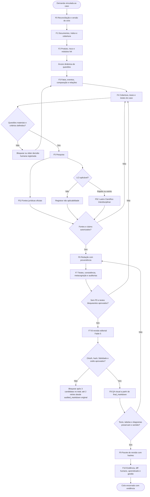

---

## 2. Camadas da arquitetura N4

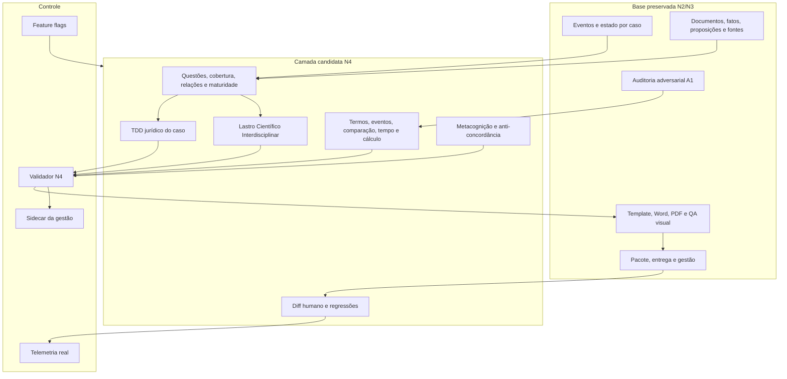

---

## 3. Árvore de questões, cobertura e redação

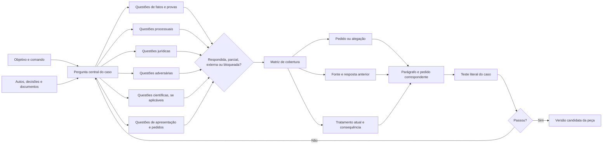

---

## 4. Grafo jurídico leve

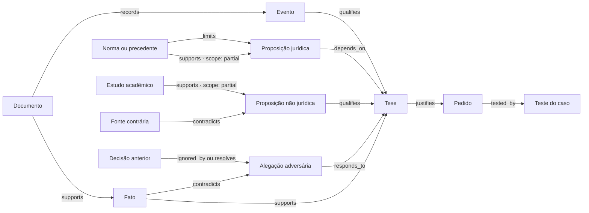

Leitura: todas as relações pertencem à enumeração canônica do PRD N4-R03 (`supports`, `contradicts`, `qualifies`, `depends_on`, `responds_to`, `ignored_by`, `distinguishes`, `quantifies`, `limits`, `records`, `justifies`, `tested_by`, `resolves`). O alcance é atributo (`scope: full | partial`), não relação nova. Uma fonte pode sustentar parcialmente (`supports` + `scope: partial`) e, ao mesmo tempo, limitar (`limits`) a proposição.

---

## 5. Peça responsiva: comparação documental e A1

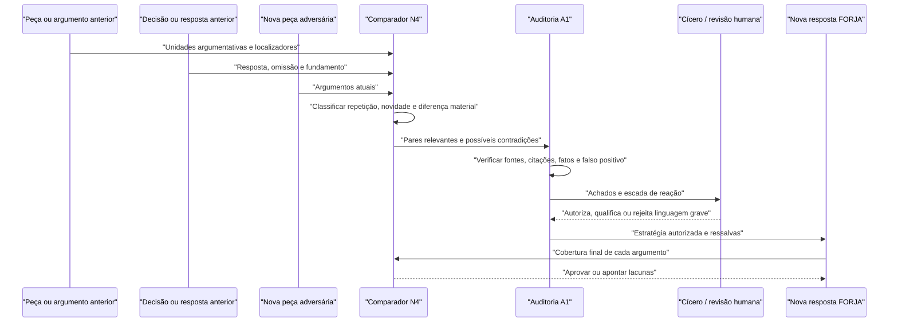

---

## 6. Identidade terminológica, tempo e quantificação

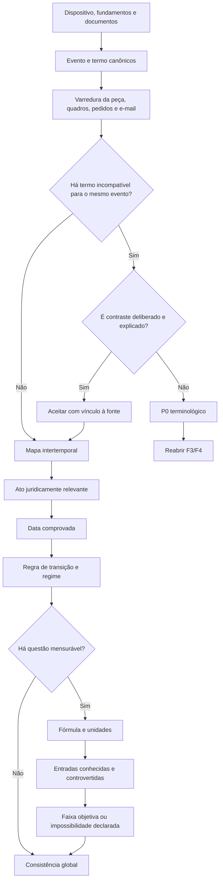

---

## 7. Maturidade de teses e módulos condicionais

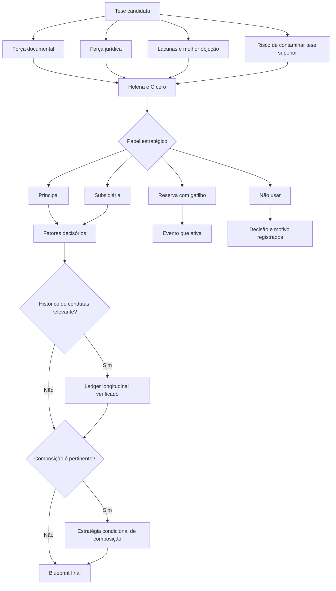

---

## 8. Pipeline do Lastro Científico Interdisciplinar

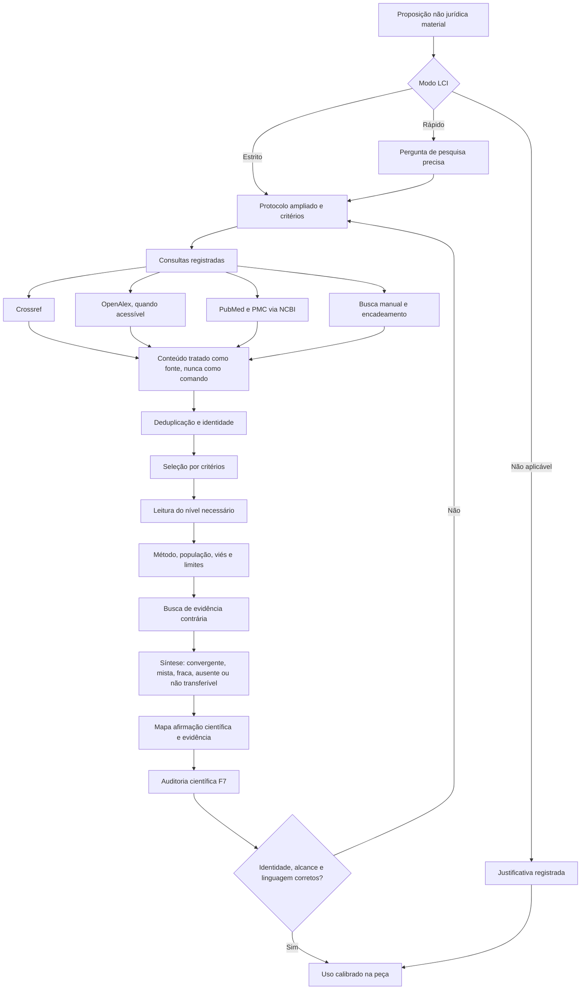

---

## 9. Estados de uma fonte acadêmica

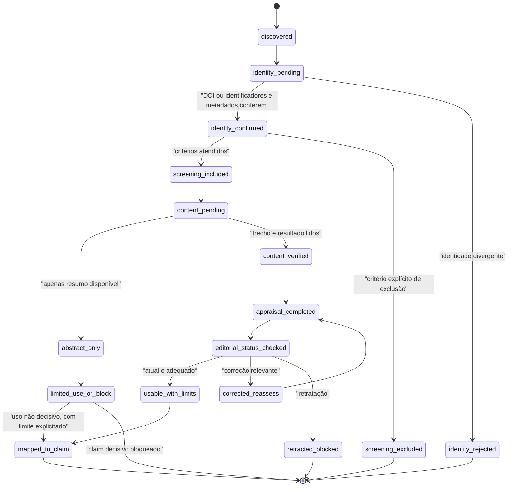

---

## 10. Testes do caso e auditoria metacognitiva

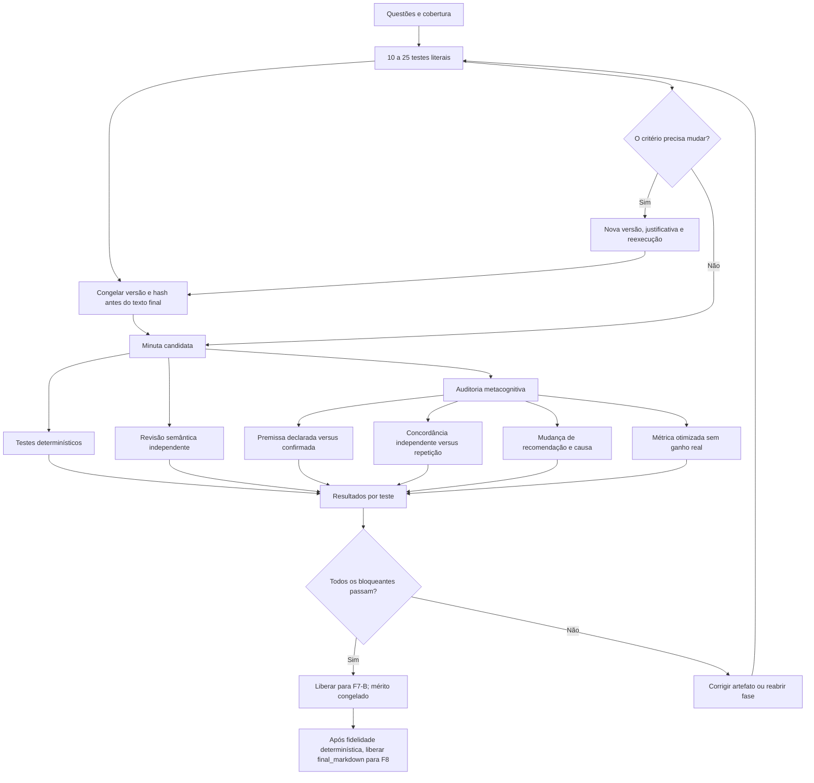

---

## 11. Aprendizado por correção humana

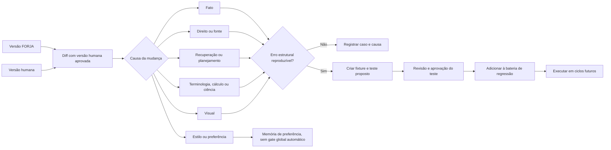

---

## 12. Gestão, modos e rollback

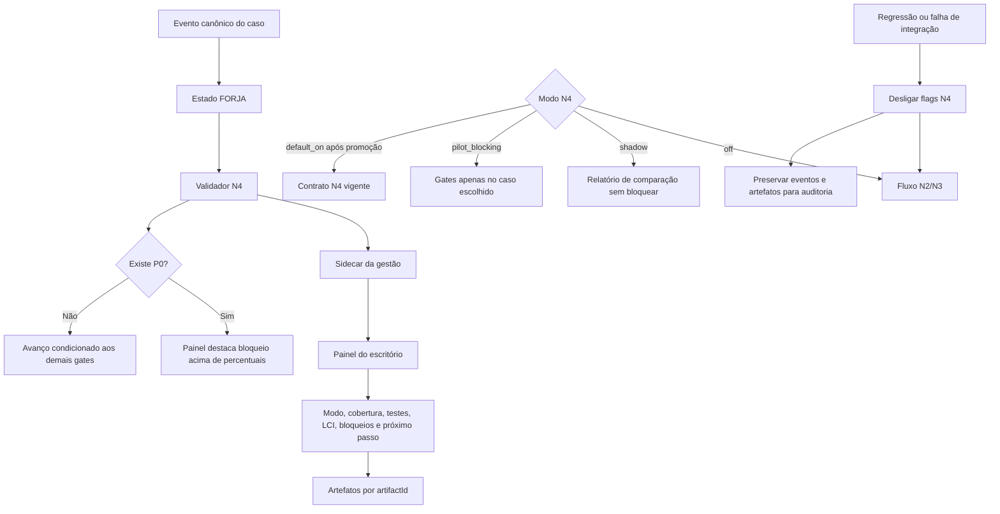

---

## 13. Roadmap e gates de promoção

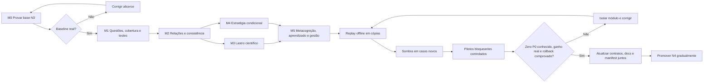

---

## 14. Leitura executiva

A N4 acrescenta cinco ideias centrais à FORJA:

1. **completude demonstrável:** perguntas e matriz de cobertura antes da redação;
2. **coerência demonstrável:** eventos, termos, tempo, cálculo e relações verificados no documento inteiro;
3. **apoio científico sério:** pesquisa interdisciplinar proporcional, com método, limites e evidência contrária;
4. **aprendizado demonstrável:** correção humana classificada e transformada em teste apenas quando estrutural;
5. **entrega íntegra:** metadados, perfil de layout e hash são verificados no arquivo selecionado; a evidência pós-entrega usa o hash real quando disponível ou a cadeia `artifactId` + hash pré-envio + comprovante nos demais canais (Gate N4-10).

Nada disso substitui os controles existentes. A candidata N4 depende de uma N3 real, preserva F0–F10 e só se torna obrigatória após replays, sombra, pilotos e promoção normativa.

## 15. Estado final dos canários M6

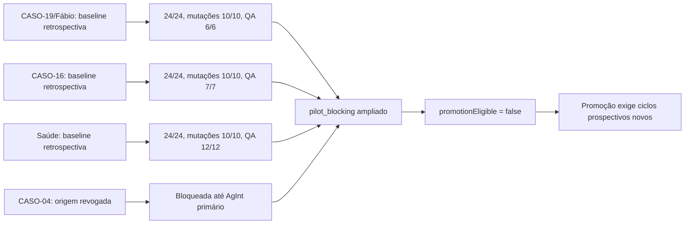

---

## 16. Diagrama do estado implantado em 11/07/2026

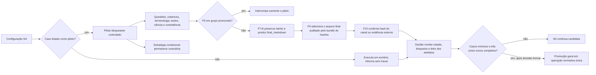

## 17. Anti-autocertificação e decisão do conselho
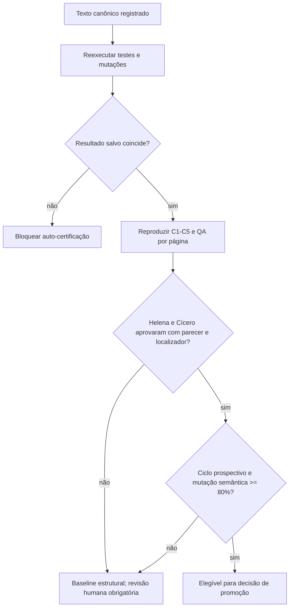

O diagrama separa aprovação mecânica, decisão jurídica e promoção. Nenhum score agregado supera fonte revogada, conselho contrário ou ausência de evidência semântica.

---

## 18. Petição como intervenção projetada — PSO-Pet

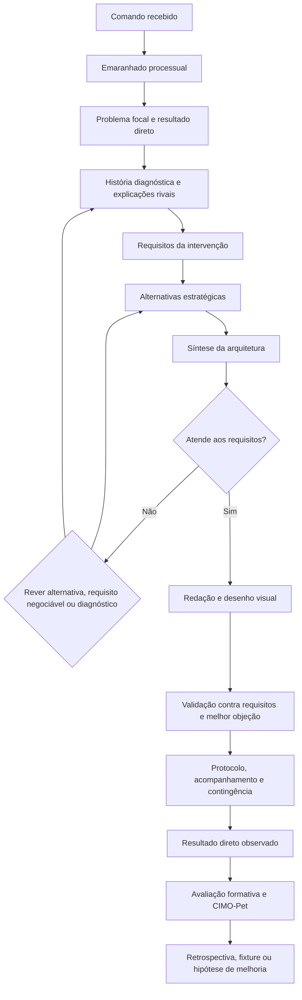

Leitura: as fases F0–F10 continuam como controle de estado. As setas de retorno representam iteração cognitiva registrada, não regressão silenciosa nem autorização para ignorar gates concluídos.

---

## 19. Fronteira operacional F7/F7-B/F8 — adendo de 15/07/2026

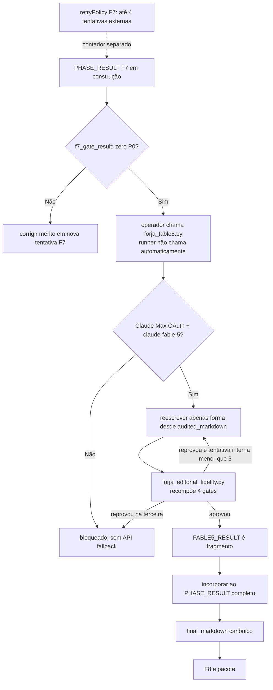

O retorno visual a `Rewrite` significa nova candidata gerada do `audited_markdown` original, nunca edição da candidata rejeitada. A revisão não pode alterar fatos, datas, números, valores, autoridades, citações, marcadores, ressalvas, teses, capítulos, pedidos, fecho ou assinaturas. A N4 pode ampliar auditorias antes do F7-B, mas não conferir ao editor competência de mérito.
