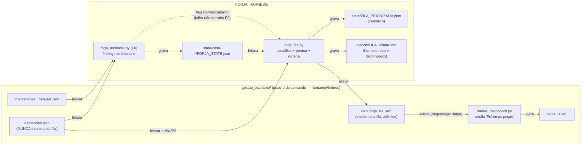
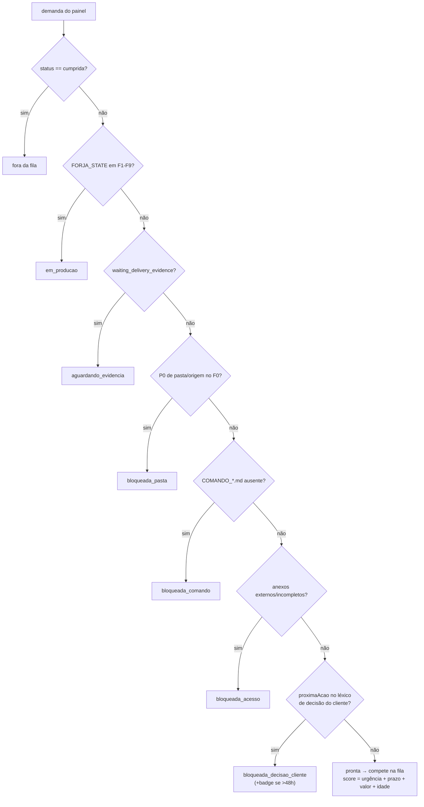
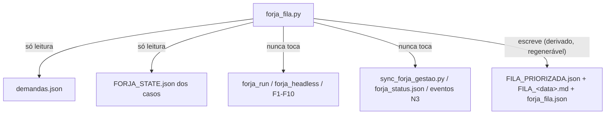

# Consulta IA — Diagramas — FORJA FILA (priorização automática painel → FORJA)

> Cópia de consulta derivada. O documento canônico permanece no caminho de origem indicado abaixo.

## Metadados e rastreabilidade

- **Documento de origem:** `17_DIAGRAMAS_FILA_PRIORIZADA.md`
- **Tipo:** Diagramas
- **SHA-256 da origem:** `f0640bc578e16e691bd9948485f2058b09b89d5ee053bf3fe8f24ca34de9819d`
- **Linhas da origem:** 87
- **Blocos integralmente indexados:** 5
- **Geração:** 2026-08-10T13:53:35-03:00
- **Cobertura:** 100% das linhas e do texto da origem, sem omissão.
- **Links relativos normalizados:** 0 destino(s), apenas para preservar a navegação na cópia.

## Roteiro de consulta para IA

**Síntese de localização:** Par de 15PRDFILAPRIORIZADA.md e 16TDDFILAPRIORIZADA.md.

**Termos de recuperação:** fila, não, json, painel, forja_fila, leitura, sim, rec, participant, quem, dia, igor.

Use o índice abaixo para localizar o bloco pertinente. Cada entrada informa as linhas exatas no documento de origem. Para afirmações materiais, leia o bloco integral e confira o arquivo canônico pelo SHA-256.

## Índice detalhado e cobertura integral

- [SRC-S001 · L1–L4 · Diagramas — FORJA FILA (priorização automática painel → FORJA)](#src-s001)
  - Assuntos: diagramas, fila, priorização, automática, painel, par, prd_fila_priorizada, tdd_fila_priorizada
  - Trecho-guia: Par de 15PRDFILAPRIORIZADA.md e 16TDDFILAPRIORIZADA.md.
  - SHA-256 do bloco: `4832430d090b55603b75b9db24c43d4200293f9ad087baeb4d7c3ebc3772b5ca`
  - [SRC-S002 · L5–L35 · 1. Fluxo de dados (quem lê e quem escreve o quê)](#src-s002)
    - Caminho: Diagramas — FORJA FILA (priorização automática painel → FORJA) > 1. Fluxo de dados (quem lê e quem escreve o quê)
    - Assuntos: fila, json, rec, leitura, quem, grava, html, fluxo
    - Trecho-guia: Documento de consulta sobre 1. Fluxo de dados (quem lê e quem escreve o quê).
    - SHA-256 do bloco: `fdfb1a554e7ddc06e3e7497122d43814e3a7796c816fd780556588dedb846cb5`
  - [SRC-S003 · L36–L56 · 2. Máquina de classificação de prontidão (ordem de precedência)](#src-s003)
    - Caminho: Diagramas — FORJA FILA (priorização automática painel → FORJA) > 2. Máquina de classificação de prontidão (ordem de precedência)
    - Assuntos: sim, não, máquina, classificação, prontidão, ordem, precedência, fora
    - Trecho-guia: Documento de consulta sobre 2. Máquina de classificação de prontidão (ordem de precedência).
    - SHA-256 do bloco: `705ca910c25f5438a2ba8228f994c84436d242a138af9d80ad79388636097e38`
  - [SRC-S004 · L57–L76 · 3. Sequência operacional (dia a dia do Igor)](#src-s004)
    - Caminho: Diagramas — FORJA FILA (priorização automática painel → FORJA) > 3. Sequência operacional (dia a dia do Igor)
    - Assuntos: participant, dia, igor, painel, forja_fila, sequência, operacional, produção
    - Trecho-guia: Documento de consulta sobre 3. Sequência operacional (dia a dia do Igor).
    - SHA-256 do bloco: `e2261c4cb423085e633390840fee90c97d34176e4ce40bec5422ca76901a1eea`
  - [SRC-S005 · L77–L87 · 4. Onde a fila NÃO mexe (fronteiras de segurança)](#src-s005)
    - Caminho: Diagramas — FORJA FILA (priorização automática painel → FORJA) > 4. Onde a fila NÃO mexe (fronteiras de segurança)
    - Assuntos: fila, json, onde, não, mexe, fronteiras, segurança, forja_fila
    - Trecho-guia: Documento de consulta sobre 4. Onde a fila NÃO mexe (fronteiras de segurança).
    - SHA-256 do bloco: `53887e8edc2675498cfe25e2311f939ced7e30c7e6a48f85cd4d5498678654fe`

## Conteúdo integral indexado

Os marcadores HTML abaixo são apenas âncoras de navegação. O texto reproduz integralmente a origem normalizada em UTF-8; somente destinos de links relativos podem ter sido recalculados para apontar ao mesmo arquivo a partir desta pasta.

<a id="src-s001"></a>

# Diagramas — FORJA FILA (priorização automática painel → FORJA)

Par de `15_PRD_FILA_PRIORIZADA.md` e `16_TDD_FILA_PRIORIZADA.md`.


<a id="src-s002"></a>

## 1. Fluxo de dados (quem lê e quem escreve o quê)




<a id="src-s003"></a>

## 2. Máquina de classificação de prontidão (ordem de precedência)




<a id="src-s004"></a>

## 3. Sequência operacional (dia a dia do Igor)

```mermaid
sequenceDiagram
    participant H as Hermes/Igor (painel)
    participant R as forja_reconcile.py (F0)
    participant F as forja_fila.py
    participant P as painel HTML
    participant A as agente/Efesto (produção)
    H->>H: ajusta urgenciaManual / prazo no painel
    R->>R: audita 23 demandas (findings P0-P2)
    R->>F: chama fila (flag on; falha não derruba F0)
    F->>F: classifica prontidão + score explicável
    F->>P: forja_fila.json → seção "Próximas peças"
    Note over P: Igor vê top 5 + bloqueadas por motivo<br/>sem abrir nenhuma pasta
    A->>F: python forja_fila.py --proxima
    F-->>A: caso do topo (caseId, pasta, comando, score)
    A->>A: dispara produção F1-F10 (comando explícito,<br/>NUNCA automático — anti-requisito do PRD)
```


<a id="src-s005"></a>

## 4. Onde a fila NÃO mexe (fronteiras de segurança)


