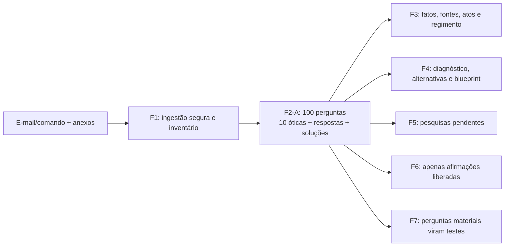

# Consulta IA — F2-A — Exploração problematizadora em 100 perguntas

> Cópia de consulta derivada. O documento canônico permanece no caminho de origem indicado abaixo.

## Metadados e rastreabilidade

- **Documento de origem:** `20_F2A_EXPLORACAO_100_PERGUNTAS.md`
- **Tipo:** Documento de planejamento
- **SHA-256 da origem:** `3f7a8d786a23ef64a1b84b8be35cb10e10c9ec24ab41583a859f4af59c3a8ac5`
- **Linhas da origem:** 58
- **Blocos integralmente indexados:** 7
- **Geração:** 2026-08-10T13:53:35-03:00
- **Cobertura:** 100% das linhas e do texto da origem, sem omissão.
- **Links relativos normalizados:** 0 destino(s), apenas para preservar a navegação na cópia.

## Roteiro de consulta para IA

**Síntese de localização:** Decisão de produto: 14/07/2026. Status: implementada para novos ciclos; histórico preservado.

**Termos de recuperação:** não, perguntas, f2-a, f2a, contrato, json, exploração, testes, problematizadora, problema, segura, apenas.

Use o índice abaixo para localizar o bloco pertinente. Cada entrada informa as linhas exatas no documento de origem. Para afirmações materiais, leia o bloco integral e confira o arquivo canônico pelo SHA-256.

## Índice detalhado e cobertura integral

- [SRC-S001 · L1–L4 · F2-A — Exploração problematizadora em 100 perguntas](#src-s001)
  - Assuntos: f2-a, exploração, problematizadora, perguntas, decisão, produto, status, implementada
  - Trecho-guia: Decisão de produto: 14/07/2026. Status: implementada para novos ciclos; histórico preservado.
  - SHA-256 do bloco: `8eec9ec8bc2dbde6080c946be9ba93cdbc347e44037efb607bf63be464580072`
  - [SRC-S002 · L5–L8 · Problema corrigido](#src-s002)
    - Caminho: F2-A — Exploração problematizadora em 100 perguntas > Problema corrigido
    - Assuntos: problema, corrigido, perguntas, possuía, f2_question_tree, json, mas, casos
    - Trecho-guia: A N4 possuía F2QUESTIONTREE.json, mas casos reais continham apenas 5–20 perguntas e o contrato não exigia diversidade, respostas rastreáveis, síntese do problema ou passagem às fases seguintes. Assim, “ter árvore de perguntas” podia virar autocertificação sem exploração real.
    - SHA-256 do bloco: `d583081a9ce2d0e726fe4f8e5c5945135b105497b2c43c05a064307291410f62`
  - [SRC-S003 · L9–L23 · Posição no fluxo](#src-s003)
    - Caminho: F2-A — Exploração problematizadora em 100 perguntas > Posição no fluxo
    - Assuntos: f2a, continua, posição, fluxo, f2-a, perguntas, não, mermaid
    - Trecho-guia: F2-A é subfase de F2CLASSIFICACAOPRODUTORISCO; não renumera F0–F10 e não promove N4. A N2 continua vigente, N3 continua em sombra e N4 continua pilotblocking.
    - SHA-256 do bloco: `7ac7c37785ae8ef972911a46156fa9df8932e4746eba334a529e9aa911f277fb`
  - [SRC-S004 · L24–L36 · Contrato](#src-s004)
    - Caminho: F2-A — Exploração problematizadora em 100 perguntas > Contrato
    - Assuntos: contrato, exatamente, ids, resposta, blocked, artefato, f2_question_tree, json
    - Trecho-guia: Artefato: F2QUESTIONTREE.json. Protocolo: FORJA-F2A-100-v1. Contagem: exatamente 100, IDs Q001..Q100. Cobertura: exatamente 10 perguntas em cada uma das dez óticas. Profundidade mínima: pergunta, âncora do caso, importância, resposta e rota. Proveniência: fatos, eventos, preceden
    - SHA-256 do bloco: `2a284f09de9ba65e1c1e69ed321ae91454aaa55058f85a2dd65fb8398678d05d`
  - [SRC-S005 · L37–L40 · Compatibilidade e falha segura](#src-s005)
    - Caminho: F2-A — Exploração problematizadora em 100 perguntas > Compatibilidade e falha segura
    - Assuntos: compatibilidade, falha, segura, pelo, validador, antigo, novo, árvores
    - Trecho-guia: Árvores históricas sem protocolVersion continuam legíveis pelo validador N4 antigo e não são reclassificadas silenciosamente. Todo novo resultado F2, porém, tem questiontree como saída obrigatória e passa pelo validador estrito antes da promoção. Reabrir F3/F4 de caso antigo exig
    - SHA-256 do bloco: `8deae0b6a7da0756ba7d83ad7868d9e6294af7bb4a87d568ab4a2dfc8f8f98d6`
  - [SRC-S006 · L41–L50 · Implementação e testes](#src-s006)
    - Caminho: F2-A — Exploração problematizadora em 100 perguntas > Implementação e testes
    - Assuntos: json, implementação, testes, árvore, phase_contracts, forja_exploracao_100, sementes, adaptáveis
    - Trecho-guia: forjaexploracao100.py: 100 sementes adaptáveis, contrato e CLI. forjarun.py: reprova promoção de F2 com árvore inválida. phasecontracts/F2.json: saída e três gates obrigatórios. phasecontracts/F3.json e F4.json: recebem a árvore como entrada. forjareasoning.py: valida protocolo e
    - SHA-256 do bloco: `4a492e7ef5480964062e3ffb8e22783da434d42cf90cae3a2c5379400b90b795`
  - [SRC-S007 · L51–L58 · Anti-requisitos](#src-s007)
    - Caminho: F2-A — Exploração problematizadora em 100 perguntas > Anti-requisitos
    - Assuntos: não, anti-requisitos, produzir, perguntas, genéricas, apenas, atingir, número
    - Trecho-guia: não produzir 100 perguntas genéricas apenas para atingir número; não usar consenso entre agentes como prova; não transformar bloqueio em resposta inventada; não expor proveniência operacional na peça; não pedir ao Igor decisões técnicas sobre geração, schema ou testes; não avança
    - SHA-256 do bloco: `273b9f272c850a6705eacc0fa713acbeaa9b8cfe2456ac90c35f52a215392aa4`

## Conteúdo integral indexado

Os marcadores HTML abaixo são apenas âncoras de navegação. O texto reproduz integralmente a origem normalizada em UTF-8; somente destinos de links relativos podem ter sido recalculados para apontar ao mesmo arquivo a partir desta pasta.

# F2-A — Exploração problematizadora em 100 perguntas

**Decisão de produto:** 14/07/2026. **Status:** implementada para novos ciclos; histórico preservado.

## Problema corrigido

A N4 possuía `F2_QUESTION_TREE.json`, mas casos reais continham apenas 5–20 perguntas e o contrato não exigia diversidade, respostas rastreáveis, síntese do problema ou passagem às fases seguintes. Assim, “ter árvore de perguntas” podia virar autocertificação sem exploração real.

## Posição no fluxo

F2-A é subfase de `F2_CLASSIFICACAO_PRODUTO_RISCO`; não renumera F0–F10 e não promove N4. A N2 continua vigente, N3 continua em sombra e N4 continua `pilot_blocking`.

## Contrato

- Artefato: `F2_QUESTION_TREE.json`.
- Protocolo: `FORJA-F2A-100-v1`.
- Contagem: exatamente 100, IDs `Q001..Q100`.
- Cobertura: exatamente 10 perguntas em cada uma das dez óticas.
- Profundidade mínima: pergunta, âncora do caso, importância, resposta e rota.
- Proveniência: fatos, eventos, precedentes e cálculos respondidos exigem `supportIds`.
- Honestidade: lacuna recebe `blocked`, `not_verified` e consequência; não se inventa resposta.
- Solução: ao menos duas hipóteses comparadas por condições e riscos.
- Handoff: F3, F4, F5, F6 e F7 recebem IDs explícitos.
- Liberação: questão material bloqueada mantém `draftRelease: blocked`.

## Compatibilidade e falha segura

Árvores históricas sem `protocolVersion` continuam legíveis pelo validador N4 antigo e não são reclassificadas silenciosamente. Todo novo resultado F2, porém, tem `question_tree` como saída obrigatória e passa pelo validador estrito antes da promoção. Reabrir F3/F4 de caso antigo exige materializar F2-A, porque a análise precisa ser reconstruída com o novo contrato.

## Implementação e testes

- `forja_exploracao_100.py`: 100 sementes adaptáveis, contrato e CLI.
- `forja_run.py`: reprova promoção de F2 com árvore inválida.
- `phase_contracts/F2.json`: saída e três gates obrigatórios.
- `phase_contracts/F3.json` e `F4.json`: recebem a árvore como entrada.
- `forja_reasoning.py`: valida protocolo estrito sem quebrar histórico.
- `generate_n4_contracts.py`: gera schema e contratos N4 atualizados.
- `test_forja_exploracao_100.py`: regressões de contagem, diversidade, fonte, bloqueio e handoff.

## Anti-requisitos

- não produzir 100 perguntas genéricas apenas para atingir número;
- não usar consenso entre agentes como prova;
- não transformar bloqueio em resposta inventada;
- não expor proveniência operacional na peça;
- não pedir ao Igor decisões técnicas sobre geração, schema ou testes;
- não avançar para redação externa com questão material bloqueada.
