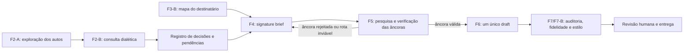

# Consulta IA — 32 — Plano único consolidado v2: cocrição, identidade e precedentes

> Cópia de consulta derivada. O documento canônico permanece no caminho de origem indicado abaixo.

## Metadados e rastreabilidade

- **Documento de origem:** `32_PLANO_UNICO_CONSOLIDADO_V2_2026-07-25.md`
- **Tipo:** Plano
- **SHA-256 da origem:** `c11b5ff98e2eb99f402f18dfc1f56b69d0eb9a101276fbbc125d406c4741b0ab`
- **Linhas da origem:** 617
- **Blocos integralmente indexados:** 54
- **Geração:** 2026-08-10T13:53:35-03:00
- **Cobertura:** 100% das linhas e do texto da origem, sem omissão.
- **Links relativos normalizados:** 0 destino(s), apenas para preservar a navegação na cópia.

## Roteiro de consulta para IA

**Síntese de localização:** Data: 25/07/2026. Estado: pesquisa e planejamento revisados. Não autoriza implementação nem envio externo.

**Termos de recuperação:** não, pesquisa, identidade, advogado, deve, decisão, precedentes, consulta, resposta, único, mapa, destinatário.

Use o índice abaixo para localizar o bloco pertinente. Cada entrada informa as linhas exatas no documento de origem. Para afirmações materiais, leia o bloco integral e confira o arquivo canônico pelo SHA-256.

## Índice detalhado e cobertura integral

- [SRC-S001 · L1–L20 · 32 — Plano único consolidado v2: cocrição, identidade e precedentes](#src-s001)
  - Assuntos: não, cocrição, identidade, precedentes, documento, plano, único, consolidado
  - Trecho-guia: Data: 25/07/2026. Estado: pesquisa e planejamento revisados. Não autoriza implementação nem envio externo.
  - SHA-256 do bloco: `9ea46ceddca3cec742bd701bcf47dce52244df226d9d61f31d0a00b4e4454412`
  - [SRC-S002 · L21–L37 · 1. Resultado pretendido](#src-s002)
    - Caminho: 32 — Plano único consolidado v2: cocrição, identidade e precedentes > 1. Resultado pretendido
    - Assuntos: advogado, decisão, resultado, pretendido, humana, pesquisa, caso, risco
    - Trecho-guia: A FORJA deve funcionar como parceiro intelectual do advogado responsável antes de redigir:
    - SHA-256 do bloco: `68371007a91630ddc13bd98b8a02b1d1b2aa2815a3db6439ff616898f2d9223b`
  - [SRC-S003 · L38–L52 · 2. Linha de base verificada: o que existe e o que realmente falta](#src-s003)
    - Caminho: 32 — Plano único consolidado v2: cocrição, identidade e precedentes > 2. Linha de base verificada: o que existe e o que realmente falta
    - Assuntos: existe, não, base, exigem, pesquisa, linha, verificada, realmente
    - Trecho-guia: Consequência arquitetural: não se deve criar um sistema paralelo, mas também não se deve declarar uma lacuna “resolvida” apenas porque uma pergunta, um campo genérico ou uma ação distante existe em outro subsistema.
    - SHA-256 do bloco: `717acfe2a22b3d9e7cc2102fded34008323bf8277b50529b6a5c0715bab8c3cd`
  - [SRC-S004 · L53–L54 · 3. Princípios não negociáveis](#src-s004)
    - Caminho: 32 — Plano único consolidado v2: cocrição, identidade e precedentes > 3. Princípios não negociáveis
    - Assuntos: princípios, não, negociáveis
    - Trecho-guia: Documento de consulta sobre 3. Princípios não negociáveis.
    - SHA-256 do bloco: `118cf6f012d1268c294dad5a1531056bb7045b3491250887cbea0a8397ec6258`
    - [SRC-S005 · L55–L60 · 3.1 Verificação antes de persuasão](#src-s005)
      - Caminho: 32 — Plano único consolidado v2: cocrição, identidade e precedentes > 3. Princípios não negociáveis > 3.1 Verificação antes de persuasão
      - Assuntos: verificação, antes, persuasão, precedente, nenhuma, melhoria, assinatura, pode
      - Trecho-guia: Nenhuma melhoria de assinatura pode reduzir os gates factuais e jurídicos. Citação, número, órgão, relator, composição, data, trecho, ratio e estado do precedente continuam sujeitos a fonte oficial e recomputação independente.
      - SHA-256 do bloco: `b81e408d5670ba2adf4833f280ca8b0d9e5e941296fc3a15172120b83361ec63`
    - [SRC-S006 · L61–L72 · 3.2 Identidade como método, não personificação](#src-s006)
      - Caminho: 32 — Plano único consolidado v2: cocrição, identidade e precedentes > 3. Princípios não negociáveis > 3.2 Identidade como método, não personificação
      - Assuntos: não, identidade, método, personificação, significa, autoria, escrever, medina
      - Trecho-guia: “Escrever como Medina” significa aproximar:
      - SHA-256 do bloco: `4613c336d9ecfa4614679bb6b01cc122eec1a041251b5c43389bc30543dc3704`
    - [SRC-S007 · L73–L81 · 3.3 Cocrição com responsabilidade epistêmica](#src-s007)
      - Caminho: 32 — Plano único consolidado v2: cocrição, identidade e precedentes > 3. Princípios não negociáveis > 3.3 Cocrição com responsabilidade epistêmica
      - Assuntos: não, cocrição, responsabilidade, epistêmica, declaração, escritório, pode, definir
      - Trecho-guia: Uma declaração do escritório pode definir objetivo, preferência, autorização ou leitura estratégica. Ela não prova, por si, fato externo do processo. O registro deve manter separadas:
      - SHA-256 do bloco: `8764922a8c3d9ee6f1490dddf55db72056ac60f24df9f2349d8ee1af83cec78b`
    - [SRC-S008 · L82–L90 · 3.4 Proporcionalidade](#src-s008)
      - Caminho: 32 — Plano único consolidado v2: cocrição, identidade e precedentes > 3. Princípios não negociáveis > 3.4 Proporcionalidade
      - Assuntos: recebem, proporcionalidade, precedentes, custo, pesquisa, fichamento, cresce, materialidade
      - Trecho-guia: O custo da pesquisa e do fichamento cresce com a materialidade:
      - SHA-256 do bloco: `dbafa1f9a52ba4e72a522416a98d68048a3fc0bd0838d7ea87e1a788f975b0d8`
    - [SRC-S009 · L91–L96 · 3.5 Sem pseudoprecisão](#src-s009)
      - Caminho: 32 — Plano único consolidado v2: cocrição, identidade e precedentes > 3. Princípios não negociáveis > 3.5 Sem pseudoprecisão
      - Assuntos: pseudoprecisão, não, usar, quando, houver, percentuais, intuitivos, notas
      - Trecho-guia: Não usar percentuais intuitivos, notas de aderência ou pesos arbitrários para simular certeza. Quando houver medida estatística, ela deve ter população, janela, denominador, incerteza e finalidade declarados. Quando não houver, usar categorias verificáveis e justificativa em ling
      - SHA-256 do bloco: `d16b4455435362c715e80dcdb2ea4dc2abc90bfa0763799b5cbd64bb3302ab1e`
  - [SRC-S010 · L97–L120 · 4. Fluxo-alvo corrigido](#src-s010)
    - Caminho: 32 — Plano único consolidado v2: cocrição, identidade e precedentes > 4. Fluxo-alvo corrigido
    - Assuntos: advogado, fluxo-alvo, corrigido, f2b, dialética, mapa, destinatário, pesquisa
    - Trecho-guia: O fluxo tem duas frentes paralelas antes da redação:
    - SHA-256 do bloco: `6f76441bea578162119d48188a069a397c53725fd2383b0e267b7ad5edf79b02`
  - [SRC-S011 · L121–L122 · 5. F2-B — consulta dialética ao advogado responsável](#src-s011)
    - Caminho: 32 — Plano único consolidado v2: cocrição, identidade e precedentes > 5. F2-B — consulta dialética ao advogado responsável
    - Assuntos: f2-b, consulta, dialética, advogado, responsável
    - Trecho-guia: Documento de consulta sobre 5. F2-B — consulta dialética ao advogado responsável.
    - SHA-256 do bloco: `f58995200f586a444a2de3df3858a54144a4b5bffa254cc847c2a26d5d31e3bb`
    - [SRC-S012 · L123–L137 · 5.1 O que a consulta deve produzir](#src-s012)
      - Caminho: 32 — Plano único consolidado v2: cocrição, identidade e precedentes > 5. F2-B — consulta dialética ao advogado responsável > 5.1 O que a consulta deve produzir
      - Assuntos: consulta, não, deve, produzir, caso, pode, exigir, questionário
      - Trecho-guia: A consulta não é um questionário integral. É uma seleção adaptativa das dúvidas que podem mudar:
      - SHA-256 do bloco: `f44b09be16f4cda18bb7fcbd8c14235b4aa63a1cf89036864031cc2f4a55e1ca`
    - [SRC-S013 · L138–L148 · 5.2 Filtros de admissão](#src-s013)
      - Caminho: 32 — Plano único consolidado v2: cocrição, identidade e precedentes > 5. F2-B — consulta dialética ao advogado responsável > 5.2 Filtros de admissão
      - Assuntos: filtros, admissão, pergunta, não, está, cada, precisa, passar
      - Trecho-guia: Cada pergunta precisa passar por quatro filtros:
      - SHA-256 do bloco: `6932060bfaa9d8dc6fae2a64db6821b38252c1df1fd406fd3ef950cb4df42613`
    - [SRC-S014 · L149–L162 · 5.3 Efeito do silêncio](#src-s014)
      - Caminho: 32 — Plano único consolidado v2: cocrição, identidade e precedentes > 5. F2-B — consulta dialética ao advogado responsável > 5.3 Efeito do silêncio
      - Assuntos: efeito, material, não, silêncio, pergunta, fato, bloqueia, nunca
      - Trecho-guia: O plano 31 é corrigido neste ponto:
      - SHA-256 do bloco: `4777416c905ef3bbc337f589b71eb188f3a8040f336ec8ac2d8ab26701e85c90`
    - [SRC-S015 · L163–L177 · 5.4 Resposta não é aceite automático](#src-s015)
      - Caminho: 32 — Plano único consolidado v2: cocrição, identidade e precedentes > 5. F2-B — consulta dialética ao advogado responsável > 5.4 Resposta não é aceite automático
      - Assuntos: resposta, não, aceite, automático, haverá, decisão, cumpre, função
      - Trecho-guia: A resposta cumpre a função de fixação de escopo apenas quando efetivamente resolve os pontos materiais. Não haverá uma subfase F2-C separada, mas haverá um registro explícito de decisão dentro dos contratos existentes:
      - SHA-256 do bloco: `6eeb8acc51454ef632c1bb645c1d51088b20d07ad7aa3f5e2d662b1332c82d26`
    - [SRC-S016 · L178–L190 · 5.5 Forma de interação](#src-s016)
      - Caminho: 32 — Plano único consolidado v2: cocrição, identidade e precedentes > 5. F2-B — consulta dialética ao advogado responsável > 5.5 Forma de interação
      - Assuntos: forma, interação, e-mail, não, envio, único, consolidado, padrão
      - Trecho-guia: Um único e-mail consolidado é o padrão inicial, não uma ontologia rígida. Respostas podem chegar por e-mail, WhatsApp, áudio ou reunião e devem ser incorporadas ao mesmo ledger versionado.
      - SHA-256 do bloco: `90f499f42a57ef10dcc879d5fe9c74be23e86b46b901181d1aa93e8dd8eb7cef`
  - [SRC-S017 · L191–L192 · 6. F3-B — mapa do destinatário com fontes separadas](#src-s017)
    - Caminho: 32 — Plano único consolidado v2: cocrição, identidade e precedentes > 6. F3-B — mapa do destinatário com fontes separadas
    - Assuntos: f3-b, mapa, destinatário, fontes, separadas
    - Trecho-guia: Documento de consulta sobre 6. F3-B — mapa do destinatário com fontes separadas.
    - SHA-256 do bloco: `1f512658c7b881e786ddc2f8bf75712037bc314e78fe2ea46bcfb72c957e627f`
    - [SRC-S018 · L193–L201 · 6.1 Dois novos tipos de artefato](#src-s018)
      - Caminho: 32 — Plano único consolidado v2: cocrição, identidade e precedentes > 6. F3-B — mapa do destinatário com fontes separadas > 6.1 Dois novos tipos de artefato
      - Assuntos: dois, novos, tipos, artefato, json, schema, mantêm-se, execução
      - Trecho-guia: Mantêm-se os dois novos tipos de artefato de execução:
      - SHA-256 do bloco: `45399cfba330d0f84077a46f6088569f2a5ba0aa60f1b31e10ea2ac7a9c7c9ee`
    - [SRC-S019 · L202–L217 · 6.2 Conteúdo do mapa](#src-s019)
      - Caminho: 32 — Plano único consolidado v2: cocrição, identidade e precedentes > 6. F3-B — mapa do destinatário com fontes separadas > 6.2 Conteúdo do mapa
      - Assuntos: oficial, conteúdo, mapa, regimento, atual, fonte, órgão, competente
      - Trecho-guia: O mapa deve separar campos e fontes:
      - SHA-256 do bloco: `d191fb8c74ca84ddb46d6ac60d5bb12065d96c0019b87193e10c7edb36f30f6c`
    - [SRC-S020 · L218–L223 · 6.3 Topologia condicional](#src-s020)
      - Caminho: 32 — Plano único consolidado v2: cocrição, identidade e precedentes > 6. F3-B — mapa do destinatário com fontes separadas > 6.3 Topologia condicional
      - Assuntos: topologia, condicional, não, seção, ordem, busca, deve, seguir
      - Trecho-guia: A ordem de busca deve seguir a competência e o problema concreto, não uma escada fixa. Outra turma da seção, seção ou Corte Especial só entra quando a estrutura do tribunal e a matéria tornarem esse nível relevante.
      - SHA-256 do bloco: `27899f95fcaef691416f38dc88c72d954987301e522cd2d23ed2b54fea324e48`
    - [SRC-S021 · L224–L236 · 6.4 Perecibilidade](#src-s021)
      - Caminho: 32 — Plano único consolidado v2: cocrição, identidade e precedentes > 6. F3-B — mapa do destinatário com fontes separadas > 6.4 Perecibilidade
      - Assuntos: perecibilidade, dado, não, cada, mutável, precisa, checkedat, sourceid
      - Trecho-guia: checkedAt; sourceId ou URL oficial; freshnessPolicy; status: confirmed, stale, unknown ou notapplicable.
      - SHA-256 do bloco: `32375ac4021109a6aaa8efc8e52eb51f0b927a4e3d77f7393e016164edbe00dd`
  - [SRC-S022 · L237–L258 · 7. F4 — signature brief como centro único de decisão](#src-s022)
    - Caminho: 32 — Plano único consolidado v2: cocrição, identidade e precedentes > 7. F4 — signature brief como centro único de decisão
    - Assuntos: decisão, brief, rotas, rota, não, signature, centro, único
    - Trecho-guia: O brief absorve o leque de teses e evita lugares concorrentes de decisão. Seus campos mínimos:
    - SHA-256 do bloco: `84405e38b39bafb64e930ad4796af29a4d8e40e93e3e4b42dc6a46c6fc66e1d7`
  - [SRC-S023 · L259–L260 · 8. F5/F7 — precedentes estratégicos e auditáveis](#src-s023)
    - Caminho: 32 — Plano único consolidado v2: cocrição, identidade e precedentes > 8. F5/F7 — precedentes estratégicos e auditáveis
    - Assuntos: precedentes, estratégicos, auditáveis
    - Trecho-guia: Documento de consulta sobre 8. F5/F7 — precedentes estratégicos e auditáveis.
    - SHA-256 do bloco: `21a8b520f018daabaefa0a440ce5d63e61f4d765f60507d6afe30050ae77e2af`
    - [SRC-S024 · L261–L268 · 8.1 Nome correto](#src-s024)
      - Caminho: 32 — Plano único consolidado v2: cocrição, identidade e precedentes > 8. F5/F7 — precedentes estratégicos e auditáveis > 8.1 Nome correto
      - Assuntos: nome, correto, jurimetria, documento, chamou, seleção, passa, chamar-se
      - Trecho-guia: O que o documento 31 chamou de “jurimetria de seleção” passa a chamar-se:
      - SHA-256 do bloco: `104e0a546791ea254aa466bfe03d13826d051975eaa15fdf53f2b15f053050b9`
    - [SRC-S025 · L269–L286 · 8.2 Trilha de busca dentro do sourceledger](#src-s025)
      - Caminho: 32 — Plano único consolidado v2: cocrição, identidade e precedentes > 8. F5/F7 — precedentes estratégicos e auditáveis > 8.2 Trilha de busca dentro do sourceledger
      - Assuntos: trilha, não, busca, dentro, source_ledger, jurídica, ids, motivo
      - Trecho-guia: O caderno separado continua cortado. A trilha jurídica passa a existir por extensão versionada do sourceledger, com:
      - SHA-256 do bloco: `888dccaf7db1544e04a834c3abc80f4b8d6d204e6ea4b496251709e1a531f7df`
    - [SRC-S026 · L287–L305 · 8.3 Extensão do verifiedsourceledger](#src-s026)
      - Caminho: 32 — Plano único consolidado v2: cocrição, identidade e precedentes > 8. F5/F7 — precedentes estratégicos e auditáveis > 8.3 Extensão do verifiedsourceledger
      - Assuntos: extensão, íntegra, elemento, sustentar, quando, ementa, verifiedsourceledger, verified_source_ledger
      - Trecho-guia: Somente precedentes-âncora recebem ficha aprofundada:
      - SHA-256 do bloco: `383c1ddb0b8fc10fea73d4a5db0c3ddb95144d4cf3c71d176a3ea6402dcb408d`
    - [SRC-S027 · L306–L320 · 8.4 Regime sem rótulo simplificador](#src-s027)
      - Caminho: 32 — Plano único consolidado v2: cocrição, identidade e precedentes > 8. F5/F7 — precedentes estratégicos e auditáveis > 8.4 Regime sem rótulo simplificador
      - Assuntos: regime, não, rótulo, simplificador, vigência, peso, campo, deve
      - Trecho-guia: base normativa; tipo de autoridade; dever ou efeito jurídico; órgão competente; caminho de distinção, revisão ou superação; estado de vigência.
      - SHA-256 do bloco: `5bfecd739813b1b2c0c6f37fee1406251d124a978b73362e5e853d6f513f7596`
    - [SRC-S028 · L321–L331 · 8.5 Integração real com o TeiaJus](#src-s028)
      - Caminho: 32 — Plano único consolidado v2: cocrição, identidade e precedentes > 8. F5/F7 — precedentes estratégicos e auditáveis > 8.5 Integração real com o TeiaJus
      - Assuntos: integração, teiajus, pelo, real, plano, deverá, ações, implementação
      - Trecho-guia: O plano de implementação deverá tratar a diferença entre:
      - SHA-256 do bloco: `6a1304db06a6d43fb30a61b1681b99cc49bfc8d4bd53717035e785aa3dbe2ba1`
    - [SRC-S029 · L332–L342 · 8.6 Precedente administrativo](#src-s029)
      - Caminho: 32 — Plano único consolidado v2: cocrição, identidade e precedentes > 8. F5/F7 — precedentes estratégicos e auditáveis > 8.6 Precedente administrativo
      - Assuntos: precedente, administrativo, decisório, separar, dois, objetos, evidência, administrativa
      - Trecho-guia: evidência administrativa e dados de integridade: CEIS, CEAF, CNEP, CEPIM, leniência; precedente administrativo decisório: acórdãos, decisões colegiadas, enunciados e julgados de TCU, CGU/CRG, CADE, CVM, CNJ ou CNMP.
      - SHA-256 do bloco: `68d5bcf706c6b5efe1004807bf50f7f2caa1377b8057dbc8d594d2a31df2b8dc`
  - [SRC-S030 · L343–L344 · 9. Identidade Medina — corpus progressivo e atribuível](#src-s030)
    - Caminho: 32 — Plano único consolidado v2: cocrição, identidade e precedentes > 9. Identidade Medina — corpus progressivo e atribuível
    - Assuntos: identidade, medina, corpus, progressivo, atribuível
    - Trecho-guia: Documento de consulta sobre 9. Identidade Medina — corpus progressivo e atribuível.
    - SHA-256 do bloco: `2f62c91094622b90b6be9cc631e7683285c341383b62dbabfade8ba26a9079e6`
    - [SRC-S031 · L345–L366 · 9.1 Não esperar por corpus perfeito](#src-s031)
      - Caminho: 32 — Plano único consolidado v2: cocrição, identidade e precedentes > 9. Identidade Medina — corpus progressivo e atribuível > 9.1 Não esperar por corpus perfeito
      - Assuntos: não, esperar, corpus, perfeito, fábio, autor, versão, trabalho
      - Trecho-guia: O trabalho pode começar com o acervo atual, mas não com a premissa de que todos os DOCX são produção do escritório ou autoria de Fábio. O primeiro produto é um inventário curatorial, fora do caminho crítico:
      - SHA-256 do bloco: `c4b952edd83aa2e50ce7888edd11b4e3fa8ba63e1d2f0d42ef0dcda52f2dba3f`
    - [SRC-S032 · L367–L375 · 9.2 Quatro corpora, com pesos diferentes](#src-s032)
      - Caminho: 32 — Plano único consolidado v2: cocrição, identidade e precedentes > 9. Identidade Medina — corpus progressivo e atribuível > 9.2 Quatro corpora, com pesos diferentes
      - Assuntos: evidência, quatro, corpora, pesos, diferentes, melhor, alteração, peças
      - Trecho-guia: 1. Peças assinadas ou atribuídas com alta confiança: melhor evidência de estilo escrito. 2. Diffs entre versões: melhor evidência de preferência editorial, desde que se saiba quem alterou ou aprovou. 3. Feedback humano registrado: evidência direta de aceitação e rejeição. 4. Tran
      - SHA-256 do bloco: `af1a895f49d6d2f401f1cb25f422e99a692919b5f4b89073909830ada20c6d42`
    - [SRC-S033 · L376–L391 · 9.3 O que extrair](#src-s033)
      - Caminho: 32 — Plano único consolidado v2: cocrição, identidade e precedentes > 9. Identidade Medina — corpus progressivo e atribuível > 9.3 O que extrair
      - Assuntos: extrair, não, movimentos, argumentativos, recorrentes, ordem, apresentação, relação
      - Trecho-guia: movimentos argumentativos recorrentes; ordem de apresentação; relação entre autoridade, igualdade e consequência; padrões de distinção; ritmo e extensão de parágrafos; uso de doutrina; formas de transição; preferências de abertura e conclusão; alterações que ele aceita, desfaz ou
      - SHA-256 do bloco: `eaeb4b9a7a30b4d02e91b7f486e55b0f7cd42b75078a8945d932f0ac3a823afb`
    - [SRC-S034 · L392–L405 · 9.4 Validação](#src-s034)
      - Caminho: 32 — Plano único consolidado v2: cocrição, identidade e precedentes > 9. Identidade Medina — corpus progressivo e atribuível > 9.4 Validação
      - Assuntos: validação, não, objetivo, enganar, leitor, nem, provar, imitação
      - Trecho-guia: O objetivo não é “enganar o leitor” nem provar imitação. É aumentar:
      - SHA-256 do bloco: `0849ea81436957325fa24060491d9aa399e15567e7cf256f0f065f5888a3a3b4`
  - [SRC-S035 · L406–L407 · 10. Superfície técnica consolidada](#src-s035)
    - Caminho: 32 — Plano único consolidado v2: cocrição, identidade e precedentes > 10. Superfície técnica consolidada
    - Assuntos: superfície, técnica, consolidada
    - Trecho-guia: Documento de consulta sobre 10. Superfície técnica consolidada.
    - SHA-256 do bloco: `98b3b7c084996796bcf7183d5a8ce6ff71631ce0932d3701a29569032b2eba31`
    - [SRC-S036 · L408–L412 · 10.1 Novos tipos de artefato de execução](#src-s036)
      - Caminho: 32 — Plano único consolidado v2: cocrição, identidade e precedentes > 10. Superfície técnica consolidada > 10.1 Novos tipos de artefato de execução
      - Assuntos: novos, tipos, artefato, execução, json, f3_mapa_destinatario, f4_signature_brief
      - Trecho-guia: 1. F3MAPADESTINATARIO.json; 2. F4SIGNATUREBRIEF.json.
      - SHA-256 do bloco: `16db699cae1920bd41843588c9cf7d1025322d3ad3eeabdc30e1a9cfbbd280fa`
    - [SRC-S037 · L413–L428 · 10.2 Extensões aditivas](#src-s037)
      - Caminho: 32 — Plano único consolidado v2: cocrição, identidade e precedentes > 10. Superfície técnica consolidada > 10.2 Extensões aditivas
      - Assuntos: extensões, aditivas, f2-a, f2-b, seleção, decisão, proveniência, efeito
      - Trecho-guia: 1. F2-A/F2-B: seleção, decisão, proveniência e efeito do silêncio; 2. sourceledger: trilha de busca jurídica e resultados negativos; 3. verifiedsourceledger: ficha profunda das âncoras; 4. recibo gostoJuridico: hash do brief, rota selecionada e recomposição final.
      - SHA-256 do bloco: `91a1822148ebb0e07c67c93b2c1a28ad4c607cb4e6b1fecf4174375fe9a3e30e`
    - [SRC-S038 · L429–L432 · 10.3 Ativo curatorial](#src-s038)
      - Caminho: 32 — Plano único consolidado v2: cocrição, identidade e precedentes > 10. Superfície técnica consolidada > 10.3 Ativo curatorial
      - Assuntos: ativo, curatorial, identity_corpus_manifest, jsonl, obrigatoriedade, caso, bloquear, produção
      - Trecho-guia: IDENTITYCORPUSMANIFEST.jsonl, sem obrigatoriedade por caso e sem bloquear produção.
      - SHA-256 do bloco: `eff6d08ec055c7285bb1b2dc7d866db7ee847c1f3e3cd443e2cf0e4af9417ca7`
    - [SRC-S039 · L433–L446 · 10.4 O que continua fora](#src-s039)
      - Caminho: 32 — Plano único consolidado v2: cocrição, identidade e precedentes > 10. Superfície técnica consolidada > 10.4 O que continua fora
      - Assuntos: continua, fora, múltiplos, drafts, petição, votação, n-way, condorcet
      - Trecho-guia: múltiplos drafts por petição; votação N-way ou Condorcet; recall; pacote novo com dezenas de módulos; jurimetria comportamental de julgadores; inferência psicológica; automação de envio externo sem autorização; escore numérico de aderência; imitação declarada de autoria.
      - SHA-256 do bloco: `8cc572af6c344612b77dafadea0ca68f1a373bc08570ae1fb2332fcf98443fca`
  - [SRC-S040 · L447–L461 · 11. Validação por natureza da capacidade](#src-s040)
    - Caminho: 32 — Plano único consolidado v2: cocrição, identidade e precedentes > 11. Validação por natureza da capacidade
    - Assuntos: não, capacidade, brief, validação, natureza, decisões, fato, material
    - Trecho-guia: O A/B serve para testar se brief e identidade melhoram a redação. Não serve para decidir se um dado factual está correto nem para legitimar uma interação pedida pelo titular.
    - SHA-256 do bloco: `ca4366b98ac1d5a17ceca778de8cc832d44d4221d05248e605c0c547dfe4d335`
  - [SRC-S041 · L462–L463 · 12. Ondas revisadas](#src-s041)
    - Caminho: 32 — Plano único consolidado v2: cocrição, identidade e precedentes > 12. Ondas revisadas
    - Assuntos: ondas, revisadas
    - Trecho-guia: Documento de consulta sobre 12. Ondas revisadas.
    - SHA-256 do bloco: `0a0425eca739b52bf1c1e7a0ee3c7a27a2da5a2d2139297774d7e9f4b4a57416`
    - [SRC-S042 · L464–L478 · Onda 0 — contratos e proveniência](#src-s042)
      - Caminho: 32 — Plano único consolidado v2: cocrição, identidade e precedentes > 12. Ondas revisadas > Onda 0 — contratos e proveniência
      - Assuntos: contratos, onda, proveniência, especificar, mudança, output, fixar, semântica
      - Trecho-guia: fixar semântica dos estados epistêmicos; definir efeito do silêncio por pergunta; mapear produtores e consumidores dos artefatos a estender; especificar schemas, versões e migração; especificar fontes por campo do mapa; inventariar o bridge TeiaJus real; criar plano de corpus e r
      - SHA-256 do bloco: `681fb803cbeb371fb64d979016c6a9fa19934aaf42c9e06af17db9069a5ef266`
    - [SRC-S043 · L479–L489 · Onda 1A — cocrição em sombra](#src-s043)
      - Caminho: 32 — Plano único consolidado v2: cocrição, identidade e precedentes > 12. Ondas revisadas > Onda 1A — cocrição em sombra
      - Assuntos: sombra, consulta, onda, cocrição, perguntas, nenhuma, selecionar, materiais
      - Trecho-guia: selecionar perguntas materiais; gerar minuta de consulta; registrar respostas históricas e simular decisões; validar que perguntas não estavam respondidas no acervo; testar múltiplas rodadas e silêncio material.
      - SHA-256 do bloco: `4e67545cf9fc28559cfb2bf9aba6b20c08fa8f206ee8eddaf58db3fe10896009`
    - [SRC-S044 · L490–L502 · Onda 1B — destinatário e precedentes em sombra](#src-s044)
      - Caminho: 32 — Plano único consolidado v2: cocrição, identidade e precedentes > 12. Ondas revisadas > Onda 1B — destinatário e precedentes em sombra
      - Assuntos: onda, destinatário, precedentes, sombra, produzir, mapa, brief, âncoras
      - Trecho-guia: produzir mapa com fontes separadas; pesquisar topologia relevante; produzir brief; verificar três a seis âncoras; reabrir F4 quando âncora cair.
      - SHA-256 do bloco: `585fe9ee7ae91d3189701b6d470751d452f6566469c0ddeb3fc2187016added4`
    - [SRC-S045 · L503–L513 · Onda 2 — identidade e variante de redação](#src-s045)
      - Caminho: 32 — Plano único consolidado v2: cocrição, identidade e precedentes > 12. Ondas revisadas > Onda 2 — identidade e variante de redação
      - Assuntos: variante, onda, identidade, redação, padrões, ganho, curar, corpus
      - Trecho-guia: curar o corpus disponível; separar escrita, edição, feedback e fala; extrair padrões candidatos; produzir um único draft variante que consome brief e padrões; comparar cegamente com o incumbente; rejeitar melhorias que reduzam fidelidade jurídica.
      - SHA-256 do bloco: `72df891b6090b5641e0d76efb5a4a8b99387f4671bec8b8f56296ee0d3e9e680`
    - [SRC-S046 · L514–L524 · Onda 3 — piloto controlado](#src-s046)
      - Caminho: 32 — Plano único consolidado v2: cocrição, identidade e precedentes > 12. Ondas revisadas > Onda 3 — piloto controlado
      - Assuntos: onda, piloto, controlado, poucos, casos, pilotcases, consulta, enviada
      - Trecho-guia: poucos casos por pilotCases; consulta enviada apenas por pessoa autorizada ou fluxo interno autorizado; mapa e brief ativos; F7/F7-B recompõem rota, âncoras e conteúdo obrigatório; rollback por flag; revisão humana final obrigatória.
      - SHA-256 do bloco: `02184fe6fd77b240db9fc0a2f0c69d3158ab093e64a67579e658978e12ba3a29`
    - [SRC-S047 · L525–L532 · Trilha posterior e condicional](#src-s047)
      - Caminho: 32 — Plano único consolidado v2: cocrição, identidade e precedentes > 12. Ondas revisadas > Trilha posterior e condicional
      - Assuntos: trilha, posterior, condicional, conectores, jurisprudência, administrativa, conforme, demanda
      - Trecho-guia: conectores de jurisprudência administrativa conforme demanda real; jurimetria comportamental J-B somente após autorização, protocolo ético-jurídico específico e desenho estatístico válido; nenhum desses itens bloqueia as ondas centrais.
      - SHA-256 do bloco: `a46497505a1d3e9c30dd69bc939722f4877328d1388ff339a2adfb701837f419`
  - [SRC-S048 · L533–L551 · 13. Critérios de aceite do plano antes de implementação](#src-s048)
    - Caminho: 32 — Plano único consolidado v2: cocrição, identidade e precedentes > 13. Critérios de aceite do plano antes de implementação
    - Assuntos: aceite, plano, implementação, critérios, antes, estiver, factual, tiver
    - Trecho-guia: O plano estará pronto para implementação quando:
    - SHA-256 do bloco: `3e3b9b6ba16d5d64d9ae0887287c1a3b7b9cd04e26bfa5a488d82e95d9cc337c`
  - [SRC-S049 · L552–L567 · 14. Decisões humanas reservadas](#src-s049)
    - Caminho: 32 — Plano único consolidado v2: cocrição, identidade e precedentes > 14. Decisões humanas reservadas
    - Assuntos: reservadas, decisões, humanas, pode, advogado, final, não, sugerir
    - Trecho-guia: A FORJA pode sugerir, comparar e explicar. Permanecem reservadas ao advogado responsável:
    - SHA-256 do bloco: `046050c61bccd89563898d9fd16f4c8d89446efe8a01bb1dfe68e32baf362b07`
  - [SRC-S050 · L568–L584 · 15. O que mudou em relação ao documento 31](#src-s050)
    - Caminho: 32 — Plano único consolidado v2: cocrição, identidade e precedentes > 15. O que mudou em relação ao documento 31
    - Assuntos: documento, novo, pesquisa, começa, mudou, relação, versão, parte
    - Trecho-guia: Documento de consulta sobre 15. O que mudou em relação ao documento 31.
    - SHA-256 do bloco: `8dd771d6332497c0845b836fef08cef4004739207de827c07952116f9da04d25`
  - [SRC-S051 · L585–L586 · 16. Evidências e referências usadas nesta revisão](#src-s051)
    - Caminho: 32 — Plano único consolidado v2: cocrição, identidade e precedentes > 16. Evidências e referências usadas nesta revisão
    - Assuntos: evidências, referências, usadas, nesta, revisão
    - Trecho-guia: Documento de consulta sobre 16. Evidências e referências usadas nesta revisão.
    - SHA-256 do bloco: `7cf531612ea58a920eea08357020380206c4f381c4b1abd4d5c8699587243efe`
    - [SRC-S052 · L587–L599 · Evidência local](#src-s052)
      - Caminho: 32 — Plano único consolidado v2: cocrição, identidade e precedentes > 16. Evidências e referências usadas nesta revisão > Evidência local
      - Assuntos: json, evidência, local, n4_schemas, f5c_research_protocol, schema, f5c_study_ledger, forja_exploracao_100
      - Trecho-guia: forjaexploracao100.py e contratos F2-A; FORJASEARCHCONFIG.json e forjalegalsearch.py; n4schemas/f5cresearchprotocol.schema.json; n4schemas/f5cstudyledger.schema.json; artefatos reais F5CRESEARCHPROTOCOL.json e F5CSTUDYLEDGER.json; forjalearning.py; forjadiffdocx.py; ../MODELOS/; 
      - SHA-256 do bloco: `21f6ce47ba6e61372e1047ea9b60ebeeea65dd1777f2abe7bff1ae896a12d8bc`
    - [SRC-S053 · L600–L608 · Fontes oficiais para os limites jurídicos](#src-s053)
      - Caminho: 32 — Plano único consolidado v2: cocrição, identidade e precedentes > 16. Evidências e referências usadas nesta revisão > Fontes oficiais para os limites jurídicos
      - Assuntos: https, www, planalto, gov, ccivil_03, htm, fontes, oficiais
      - Trecho-guia: Código de Processo Civil, especialmente arts. 489, § 1º, V e VI, e 927: https://www.planalto.gov.br/ccivil03/ato2015-2018/2015/lei/l13105.htm Glossário da API Pública do DataJud: https://datajud-wiki.cnj.jus.br/api-publica/glossario/ LOMAN, art. 41: https://www.planalto.gov.br/cc
      - SHA-256 do bloco: `12b8ee44cb56987c07c2253a4ba083c2d968b239da98b54e4eebe8ea1332e75e`
  - [SRC-S054 · L609–L617 · 17. Próxima ação](#src-s054)
    - Caminho: 32 — Plano único consolidado v2: cocrição, identidade e precedentes > 17. Próxima ação
    - Assuntos: próxima, ação, planejamento, roadmap, conversão, documental, foi, concluída
    - Trecho-guia: A conversão documental foi concluída:
    - SHA-256 do bloco: `1e6e4ef88639a8b42e6d27b95dd6a1b18003f709e18dfd81e6da06b867fa2465`

## Conteúdo integral indexado

Os marcadores HTML abaixo são apenas âncoras de navegação. O texto reproduz integralmente a origem normalizada em UTF-8; somente destinos de links relativos podem ter sido recalculados para apontar ao mesmo arquivo a partir desta pasta.

# 32 — Plano único consolidado v2: cocrição, identidade e precedentes

**Data:** 25/07/2026.  
**Estado:** pesquisa e planejamento revisados. **Não autoriza implementação nem envio externo.**

**Substitui como roteiro de execução:** `31_PLANO_UNICO_CONSOLIDADO_2026-07-25.md`. O documento 31 permanece preservado como registro da consolidação anterior. Os documentos 26 a 30 continuam como visão longa, requisitos, evidência de origem e backlog experimental; em caso de conflito operacional, prevalece este documento.

**Decisão:** manter a arquitetura Lite do documento 31, mas corrigir seis premissas antes de qualquer implementação:

1. a consulta ao advogado é uma etapa de **cocrição e decisão**, não mera projeção de perguntas;
2. silêncio, resposta estratégica e prova factual têm efeitos diferentes;
3. o mapa do destinatário exige fontes complementares; o TeiaJus não contém sozinho todos os dados;
4. pesquisa topológica de precedentes não deve ser chamada de jurimetria;
5. a identidade Medina exige corpus com autoria e proveniência curadas, não imitação da fala;
6. extensões de artefatos existentes dispensam novo tipo de artefato, mas **não dispensam versão de schema, migração aditiva e validação de consumidores**.

A solução continua pequena: **dois novos tipos de artefato de execução**, quatro extensões aditivas de contratos existentes e um corpus curatorial fora do caminho crítico de produção.

---

## 1. Resultado pretendido

A FORJA deve funcionar como parceiro intelectual do advogado responsável antes de redigir:

1. lê os autos e fontes disponíveis;
2. identifica o que já sabe, o que é inferência e o que depende de decisão humana;
3. pesquisa também a **cabeça do advogado**: objetivo, restrições, intuição do caso, risco aceitável e rota preferida;
4. apresenta alternativas reais, seus custos e a razão de descartar as demais;
5. pesquisa e verifica as autoridades adequadas ao destinatário;
6. registra a decisão humana;
7. só então produz um único texto;
8. preserva, na redação, o método argumentativo e o grau de sofisticação aceito pelo titular, sem fabricar uma persona.

O produto não é “uma IA que pergunta tudo” nem “uma IA que faz tudo sozinha”. É um ciclo de **investigação, confronto, escolha, verificação e redação** em que a máquina amplia o espaço de decisão e o advogado conserva as decisões que alteram a estratégia, a narrativa factual ou o risco do caso.

---

## 2. Linha de base verificada: o que existe e o que realmente falta

| Capacidade | Estado atual verificado | Lacuna que este plano cobre |
|---|---|---|
| Exploração F2-A | cem perguntas, estados `answered`, `blocked` e `not_applicable`; respostas factuais exigem `supportIds`; há perguntas sobre prevenção e ratio/obiter | seleção material, linguagem endereçada, iteração com o advogado e registro das decisões estratégicas |
| F4 | já existe definição da questão jurisdicional e há infraestrutura de pareceres | brief único com rotas, rejeições, consequência decisória e âncoras |
| F5/F7 | já há `source_ledger`, `verified_source_ledger`, checklist de citações e artefatos F5C para pesquisa científica extrajurídica | trilha reproduzível da pesquisa **jurídica**, resultados negativos e ficha profunda apenas das âncoras |
| TeiaJus | base viva com pesquisa de casos e camadas STJ; o agente anuncia 31 ações | o bridge da FORJA expõe superfície menor; composição atual, prevenção e íntegra decisiva exigem fontes e gates próprios |
| Identidade | `_MODELOS` não contém peças canônicas; o acervo possui centenas de DOCX de proveniências heterogêneas; há `forja_diff_docx.py`, feedback humano e classes de atribuição em `forja_learning.py` | inventário de autoria, seleção de corpus escrito, padrões estáveis e avaliação cega |
| Fontes administrativas | há dados de CEIS, CEAF, CNEP, CEPIM e acordos de leniência | esses registros são dados sancionatórios e de integridade, **não jurisprudência administrativa**; decisões de TCU, CGU/CRG, CADE, CVM, CNJ e CNMP exigem conectores ou coleta próprios |

Consequência arquitetural: não se deve criar um sistema paralelo, mas também não se deve declarar uma lacuna “resolvida” apenas porque uma pergunta, um campo genérico ou uma ação distante existe em outro subsistema.

---

## 3. Princípios não negociáveis

### 3.1 Verificação antes de persuasão

Nenhuma melhoria de assinatura pode reduzir os gates factuais e jurídicos. Citação, número, órgão, relator, composição, data, trecho, ratio e estado do precedente continuam sujeitos a fonte oficial e recomputação independente.

O CPC exige demonstração dos fundamentos determinantes e da adequação do precedente ao caso, bem como fundamentação para distinção ou superação; isso impede substituir análise por etiqueta ou escore. Regime jurídico e aderência factual são dimensões relacionadas, mas diferentes.

### 3.2 Identidade como método, não personificação

“Escrever como Medina” significa aproximar:

- forma de identificar a questão decisiva;
- movimento entre autoridade, isonomia e consequência;
- densidade doutrinária útil;
- modo de antecipar objeções;
- nível de precisão e acabamento que ele aceitaria assinar.

Não significa reproduzir cacoetes de fala, inserir vocabulário ornamental ou alegar autoria humana inexistente. A transcrição serve primeiro como corpus de **pensamento oral**. Só peças de autoria ou revisão atribuídas servem como evidência forte de estilo escrito.

### 3.3 Cocrição com responsabilidade epistêmica

Uma declaração do escritório pode definir objetivo, preferência, autorização ou leitura estratégica. Ela não prova, por si, fato externo do processo. O registro deve manter separadas:

- `record_evidence`: dado sustentado nos autos ou fonte oficial;
- `office_declaration`: declaração do advogado ou do escritório;
- `inference`: conclusão analítica ainda não confirmada;
- `unknown`: ponto material não resolvido.

### 3.4 Proporcionalidade

O custo da pesquisa e do fichamento cresce com a materialidade:

- precedentes de descoberta recebem metadados mínimos;
- precedentes citados recebem verificação de citação e vigência;
- precedentes-âncora recebem confronto profundo de ratio, fatos e operação;
- nenhuma peça recebe dossiês extensos sobre autoridades que não afetam a rota escolhida.

### 3.5 Sem pseudoprecisão

Não usar percentuais intuitivos, notas de aderência ou pesos arbitrários para simular certeza. Quando houver medida estatística, ela deve ter população, janela, denominador, incerteza e finalidade declarados. Quando não houver, usar categorias verificáveis e justificativa em linguagem natural.

---

## 4. Fluxo-alvo corrigido

O fluxo tem duas frentes paralelas antes da redação:

- **dialética:** compreender o caso junto com o advogado;
- **topológica:** compreender quem decide e quais autoridades realmente governam a controvérsia.

Uma não substitui a outra. O mapa do destinatário sem intenção do advogado produz estratégia tecnicamente informada, porém desalinhada. A intenção do advogado sem pesquisa topológica produz estratégia alinhada, porém abstrata.

---

## 5. F2-B — consulta dialética ao advogado responsável

### 5.1 O que a consulta deve produzir

A consulta não é um questionário integral. É uma seleção adaptativa das dúvidas que podem mudar:

- a identidade do produto;
- o objetivo do cliente;
- a tese ou a ordem das teses;
- a narrativa factual material;
- o pedido;
- a tolerância a risco;
- a pesquisa necessária;
- a escolha entre rotas plausíveis.

O alvo de cinco a doze perguntas é uma heurística editorial, não um gate. Caso simples pode exigir menos; caso complexo pode exigir rodadas sucessivas. A regra é **materialidade por pergunta**, não quantidade.

### 5.2 Filtros de admissão

Cada pergunta precisa passar por quatro filtros:

1. **não está respondida** nos autos, nas mensagens ou em fonte oficial acessível;
2. **pode mudar** decisão material do trabalho;
3. está endereçada à pessoa capaz de respondê-la ou decidir;
4. informa o efeito da ausência de resposta.

Pergunta que a FORJA poderia resolver pesquisando o próprio acervo é falha do sistema, não colaboração humana.

### 5.3 Efeito do silêncio

O plano 31 é corrigido neste ponto:

| Tipo de pergunta | Efeito de ausência de resposta |
|---|---|
| fato material, documento essencial ou identidade processual | bloqueia a alegação ou o produto dependente; nunca vira premissa protocolável |
| autorização, pedido, renúncia, reconhecimento ou exposição de risco | bloqueia a ação correspondente |
| objetivo do cliente ou escolha estratégica decisiva | mantém alternativas abertas e impede seleção final da rota |
| preferência não material de forma, prioridade ou apresentação | pode receber default explícito, reversível e visível |
| escolha estratégica não material | pode receber default apenas se a consulta tiver declarado a consequência e o risco |

Portanto, `default_on_silence` não é propriedade global. É decisão por pergunta e nunca converte ignorância em fato.

### 5.4 Resposta não é aceite automático

A resposta cumpre a função de fixação de escopo apenas quando efetivamente resolve os pontos materiais. Não haverá uma subfase F2-C separada, mas haverá um **registro explícito de decisão** dentro dos contratos existentes:

- pergunta;
- resposta literal ou síntese aprovada;
- autor e canal;
- natureza epistêmica;
- decisão produzida;
- artefatos afetados;
- pendência remanescente;
- data e versão.

Uma resposta parcial, ambígua ou lateral não fecha a questão.

### 5.5 Forma de interação

Um único e-mail consolidado é o padrão inicial, não uma ontologia rígida. Respostas podem chegar por e-mail, WhatsApp, áudio ou reunião e devem ser incorporadas ao mesmo ledger versionado.

No piloto:

- a FORJA gera minuta de consulta e destinatário sugerido;
- uma pessoa autorizada revisa e envia;
- o envio e a resposta recebem vínculo de proveniência;
- não há envio autônomo até existir autorização expressa, allowlist de destinatários internos e trilha de auditoria.

---

## 6. F3-B — mapa do destinatário com fontes separadas

### 6.1 Dois novos tipos de artefato

Mantêm-se os dois novos tipos de artefato de execução:

1. `F3_MAPA_DESTINATARIO.json`;
2. `F4_SIGNATURE_BRIEF.json`.

Cada um exigirá schema próprio, registro no catálogo, contrato de fase, validação cruzada, migração compatível e testes de consumidores. “Dois artefatos” não significa “zero schema”.

### 6.2 Conteúdo do mapa

O mapa deve separar campos e fontes:

| Bloco | Conteúdo | Fonte adequada |
|---|---|---|
| competência | órgão competente e fundamento | lei, regimento e autos |
| prevenção | existência, origem, processo relacionado e fundamento | autos, distribuição e regimento |
| composição atual | membros e data de conferência | página oficial atual do tribunal |
| posição individual | decisões do relator sobre a questão | íntegra oficial ou reprodução oficial verificável |
| posição colegiada | órgão, seção ou plenário competente | precedentes verificados |
| divergência | posições incompatíveis ou linhas distintas | conjunto comparável de decisões |
| rota recursal | via possível e pressupostos | lei, regimento e situação processual |

O campo `orgaoJulgador` do DataJud é metadado processual. Pode orientar a pesquisa, mas não prova composição atual nem prevenção. Espelho mensal ajuda na descoberta; íntegra e fonte oficial são necessárias para extrair fundamentos determinantes de uma âncora.

### 6.3 Topologia condicional

A ordem de busca deve seguir a competência e o problema concreto, não uma escada fixa. Outra turma da seção, seção ou Corte Especial só entra quando a estrutura do tribunal e a matéria tornarem esse nível relevante.

Prequestionamento não é o último degrau da topologia. É um ledger paralelo, derivado da decisão recorrida e da rota recursal projetada.

### 6.4 Perecibilidade

Cada dado mutável precisa de:

- `checkedAt`;
- `sourceId` ou URL oficial;
- `freshnessPolicy`;
- `status`: `confirmed`, `stale`, `unknown` ou `not_applicable`.

Dado vencido não é reutilizado silenciosamente. “Não apurado” é melhor que composição antiga apresentada como atual.

---

## 7. F4 — signature brief como centro único de decisão

O brief absorve o leque de teses e evita lugares concorrentes de decisão. Seus campos mínimos:

- questão decisiva;
- consequência jurídica e prática demonstrada nos autos;
- rotas realmente plausíveis;
- rota selecionada e responsável pela decisão;
- rotas rejeitadas e motivo;
- frase-mãe provisória;
- fatos e documentos decisivos por ID;
- precedentes-âncora candidatos por ID;
- melhor contra-argumento e resposta;
- conteúdo obrigatório e limites;
- pendências que impedem a redação.

“Exatamente três rotas” passa a ser orientação de exploração, não obrigação. O padrão é duas a quatro quando houver pluralidade real. Uma única rota é válida se as alternativas seriam artificiais; mais de quatro exige justificativa de complexidade.

O brief é uma decisão estruturada, não um sumário para expansão mecânica. F6 recebe a rota e os vínculos necessários, mas não deve transformar cada campo em subtítulo.

---

## 8. F5/F7 — precedentes estratégicos e auditáveis

### 8.1 Nome correto

O que o documento 31 chamou de “jurimetria de seleção” passa a chamar-se:

> **pesquisa topológica e estratégica de precedentes**

É recuperação, classificação jurídica e confronto de autoridades. Só será jurimetria quando houver análise quantitativa com população e método declarados.

### 8.2 Trilha de busca dentro do `source_ledger`

O caderno separado continua cortado. A trilha jurídica passa a existir por extensão versionada do `source_ledger`, com:

- `queryId`;
- base e endpoint consultados;
- data e hora;
- termos e filtros;
- órgão e recorte temporal;
- IDs retornados;
- IDs descartados e motivo;
- bases não consultadas e motivo;
- resultado negativo;
- referência de replay ou telemetria;
- limitações conhecidas.

Os artefatos F5C mostram que a FORJA já sabe representar protocolo de pesquisa, mas hoje essa família é voltada à ciência extrajurídica e há casos reais em que aparece como não aplicável. A lacuna jurídica é parcial, não total.

### 8.3 Extensão do `verified_source_ledger`

Somente precedentes-âncora recebem ficha aprofundada:

- identidade completa;
- fonte e hash da íntegra;
- trecho literal e localização;
- questão decidida;
- fundamentos determinantes;
- obiter potencialmente confundível;
- moldura fática determinante;
- confronto elemento a elemento com o caso;
- operação pretendida: aplicar, distinguir, delimitar ou sustentar superação;
- regime jurídico;
- vigência conferida em;
- revisor humano quando decisivo.

Não se extrai ratio de ementa quando a íntegra é necessária para sustentar a proposição. Ementa pode servir à descoberta e a uma descrição limitada, identificada como tal.

### 8.4 Regime sem rótulo simplificador

O campo `regime` deve registrar:

- base normativa;
- tipo de autoridade;
- dever ou efeito jurídico;
- órgão competente;
- caminho de distinção, revisão ou superação;
- estado de vigência.

As categorias do art. 927 do CPC não devem ser comprimidas em um único peso numérico. “Persuasivo qualificado” pode existir como categoria interna, desde que identificada como convenção da FORJA, não como classe legal.

Decisão monocrática ou antiga não recebe peso baixo automaticamente. Importam competência, contexto, estabilidade, aderência e vigência.

### 8.5 Integração real com o TeiaJus

O plano de implementação deverá tratar a diferença entre:

- capacidades anunciadas pelo agente TeiaJus;
- ações efetivamente permitidas pelo `FORJA_SEARCH_CONFIG.json`;
- comandos diretos STJ já expostos pelo bridge;
- fontes externas ainda não integradas.

Antes de dizer “integração completa”, deverá existir contrato explícito para as ações necessárias de plano, missão e pesquisa, com allowlist, somente leitura, telemetria, limites e teste de proveniência.

### 8.6 Precedente administrativo

Separar dois objetos:

- **evidência administrativa e dados de integridade:** CEIS, CEAF, CNEP, CEPIM, leniência;
- **precedente administrativo decisório:** acórdãos, decisões colegiadas, enunciados e julgados de TCU, CGU/CRG, CADE, CVM, CNJ ou CNMP.

Uma tabela de autoridades em `forja_authorities.py` não cria a fonte nem prova a decisão. Cada família só entra quando houver coleta oficial, identidade, íntegra ou conteúdo decisório suficiente, atualização e gate de citação.

---

## 9. Identidade Medina — corpus progressivo e atribuível

### 9.1 Não esperar por corpus perfeito

O trabalho pode começar com o acervo atual, mas não com a premissa de que todos os DOCX são produção do escritório ou autoria de Fábio. O primeiro produto é um inventário curatorial, fora do caminho crítico:

`IDENTITY_CORPUS_MANIFEST.jsonl`

Campos mínimos:

- arquivo e hash;
- tipo de documento;
- data;
- autor declarado;
- papel de Fábio: autor, coautor, revisor, aprovador, desconhecido;
- confiança da atribuição;
- canal de origem;
- versão: inicial, revisada, enviada ou protocolada;
- relação com outra versão;
- uso permitido: pensamento, estilo escrito, preferência editorial ou negativo;
- observações de proveniência.

Esse manifest é ativo de pesquisa, não novo artefato obrigatório por caso.

### 9.2 Quatro corpora, com pesos diferentes

1. **Peças assinadas ou atribuídas com alta confiança:** melhor evidência de estilo escrito.
2. **Diffs entre versões:** melhor evidência de preferência editorial, desde que se saiba quem alterou ou aprovou.
3. **Feedback humano registrado:** evidência direta de aceitação e rejeição.
4. **Transcrição da entrevista:** evidência forte de método de pensamento e linguagem oral; evidência fraca de forma escrita.

As classes de contribuição intelectual já existentes em `forja_learning.py` devem ser reutilizadas. Uma alteração entre nossa versão e a protocolada não é automaticamente alteração de Fábio.

### 9.3 O que extrair

- movimentos argumentativos recorrentes;
- ordem de apresentação;
- relação entre autoridade, igualdade e consequência;
- padrões de distinção;
- ritmo e extensão de parágrafos;
- uso de doutrina;
- formas de transição;
- preferências de abertura e conclusão;
- alterações que ele aceita, desfaz ou introduz.

Não usar lista rígida de palavras proibidas como substituto de estilo. O detector deve observar fenômenos: densidade artificial, redundância, simetria mecânica, erudição decorativa, abstração sem lastro e agressividade improdutiva.

O “movimento Medina” é técnica opcional, aplicável quando fatos e autoridades o sustentarem. Não é fórmula obrigatória em toda peça.

### 9.4 Validação

O objetivo não é “enganar o leitor” nem provar imitação. É aumentar:

- preferência cega do revisor;
- aceitação para assinatura;
- preservação de fatos, pedidos e autoridades;
- redução de reescrita material;
- adequação ao tipo de peça.

Saídas estilométricas permanecem internas e auxiliares. Não devem ser apresentadas como autenticidade humana ou autoria.

---

## 10. Superfície técnica consolidada

### 10.1 Novos tipos de artefato de execução

1. `F3_MAPA_DESTINATARIO.json`;
2. `F4_SIGNATURE_BRIEF.json`.

### 10.2 Extensões aditivas

1. F2-A/F2-B: seleção, decisão, proveniência e efeito do silêncio;
2. `source_ledger`: trilha de busca jurídica e resultados negativos;
3. `verified_source_ledger`: ficha profunda das âncoras;
4. recibo `gostoJuridico`: hash do brief, rota selecionada e recomposição final.

Cada extensão exige:

- incremento de versão;
- defaults compatíveis para casos legados;
- atualização de schema e catálogo;
- validação de produtores e consumidores;
- replay de fixtures;
- proibição de rebaseline automático.

### 10.3 Ativo curatorial

- `IDENTITY_CORPUS_MANIFEST.jsonl`, sem obrigatoriedade por caso e sem bloquear produção.

### 10.4 O que continua fora

- múltiplos drafts por petição;
- votação N-way ou Condorcet;
- recall;
- pacote novo com dezenas de módulos;
- jurimetria comportamental de julgadores;
- inferência psicológica;
- automação de envio externo sem autorização;
- escore numérico de aderência;
- imitação declarada de autoria.

---

## 11. Validação por natureza da capacidade

| Capacidade | Prova adequada | Gate irredutível |
|---|---|---|
| consulta dialética | materialidade, taxa de resposta, decisões produzidas, perguntas redundantes e rodadas | zero fato material convertido em premissa por silêncio |
| mapa do destinatário | conferência campo a campo em fonte oficial e política de freshness | prevenção e composição sem fonte não podem ser tratadas como confirmadas |
| brief | cobertura das decisões materiais e vínculo com ledgers | rota não pode depender de fato ou âncora bloqueados |
| precedentes | replay da busca, íntegra, hash, quote check, vigência e revisão | ratio decisiva não pode depender só de ementa |
| brief → redação | A/B cego no AUTO-RESEARCH, além dos gates jurídicos | ganho editorial nunca compensa regressão factual ou jurídica |
| identidade | preferência cega, aceitação para assinatura, diff material e preservação semântica | autoria e proveniência do corpus precisam ser atribuíveis |

O A/B serve para testar se brief e identidade melhoram a redação. Não serve para decidir se um dado factual está correto nem para legitimar uma interação pedida pelo titular.

---

## 12. Ondas revisadas

### Onda 0 — contratos e proveniência

Sem mudança no output:

- fixar semântica dos estados epistêmicos;
- definir efeito do silêncio por pergunta;
- mapear produtores e consumidores dos artefatos a estender;
- especificar schemas, versões e migração;
- especificar fontes por campo do mapa;
- inventariar o bridge TeiaJus real;
- criar plano de corpus e regras de atribuição.

**Saída:** pacote de contratos revisável, sem código de produção.  
**Gate:** nenhuma afirmação de capacidade existente pode depender apenas de nome semelhante.

### Onda 1A — cocrição em sombra

- selecionar perguntas materiais;
- gerar minuta de consulta;
- registrar respostas históricas e simular decisões;
- validar que perguntas não estavam respondidas no acervo;
- testar múltiplas rodadas e silêncio material.

**Saída:** consulta interna e ledger de decisão em sombra.  
**Gate:** nenhuma consulta externa automática; nenhuma resposta estratégica usada como prova factual.

### Onda 1B — destinatário e precedentes em sombra

- produzir mapa com fontes separadas;
- pesquisar topologia relevante;
- produzir brief;
- verificar três a seis âncoras;
- reabrir F4 quando âncora cair.

**Saída:** mapa, brief e âncoras sem alterar F6.  
**Gate:** composição, prevenção, ratio e vigência conferidas conforme a natureza do dado.

As ondas 1A e 1B podem correr em paralelo depois da Onda 0.

### Onda 2 — identidade e variante de redação

- curar o corpus disponível;
- separar escrita, edição, feedback e fala;
- extrair padrões candidatos;
- produzir um único draft variante que consome brief e padrões;
- comparar cegamente com o incumbente;
- rejeitar melhorias que reduzam fidelidade jurídica.

**Saída:** evidência de ganho ou ausência de ganho, não promoção automática.

### Onda 3 — piloto controlado

- poucos casos por `pilotCases`;
- consulta enviada apenas por pessoa autorizada ou fluxo interno autorizado;
- mapa e brief ativos;
- F7/F7-B recompõem rota, âncoras e conteúdo obrigatório;
- rollback por flag;
- revisão humana final obrigatória.

**Gate de ampliação:** ganho prospectivo, ausência de regressão jurídica, rastreabilidade completa e custo operacional aceitável.

### Trilha posterior e condicional

- conectores de jurisprudência administrativa conforme demanda real;
- jurimetria comportamental J-B somente após autorização, protocolo ético-jurídico específico e desenho estatístico válido;
- nenhum desses itens bloqueia as ondas centrais.

---

## 13. Critérios de aceite do plano antes de implementação

O plano estará pronto para implementação quando:

- [ ] os novos artefatos tiverem donos, schemas, consumidores e invalidadores definidos;
- [ ] o efeito do silêncio estiver codificado por classe de pergunta;
- [ ] resposta, aceite estratégico e prova factual estiverem separados;
- [ ] cada campo do mapa tiver fonte, freshness e comportamento de falha;
- [ ] o bridge TeiaJus necessário estiver distinguido das capacidades apenas anunciadas;
- [ ] ratio decisiva exigir conteúdo suficiente e localização verificável;
- [ ] o regime do precedente não for reduzido a peso numérico;
- [ ] o corpus tiver política de autoria e contribuição intelectual;
- [ ] A/B, conferência factual e métrica de interação não forem confundidos;
- [ ] o envio externo permanecer sujeito a autorização;
- [ ] casos legados preservarem compatibilidade;
- [ ] os gates anti-alucinação AH-01 a AH-08 permanecerem fail-closed em `strict_protocol`.

---

## 14. Decisões humanas reservadas

A FORJA pode sugerir, comparar e explicar. Permanecem reservadas ao advogado responsável:

- objetivo final do trabalho;
- fatos que dependam de declaração do cliente ou do escritório;
- escolha estratégica quando houver risco material;
- desistência, concessão, reconhecimento ou pedido sensível;
- autorização de envio;
- seleção final da rota;
- aprovação do texto para assinatura.

Se o advogado não decidir ponto essencial, a FORJA pode avançar nas partes independentes, mas não deve encobrir a pendência.

---

## 15. O que mudou em relação ao documento 31

| Tema | Documento 31 | Versão 32 |
|---|---|---|
| TeiaJus | “já tem o dado” | contém parte dos insumos; composição, prevenção e ratio exigem fontes e gates distintos |
| consulta | resposta equivale a aceite | só equivale quando resolve materialmente o ponto; resposta parcial mantém pendência |
| silêncio | default pouco delimitado | default apenas não material; fato, autorização e estratégia decisiva bloqueiam o dependente |
| rotas | exatamente três | duas a quatro como heurística; sem alternativas artificiais |
| schema | extensões “sem schema novo” | sem novo tipo de artefato, mas com versão, migração e validação de consumidores |
| pesquisa | só resultado negativo seria novo | F5C já cobre parte do raciocínio científico; pesquisa jurídica precisa genealogia de queries e rejeições |
| J-A | jurimetria de seleção | pesquisa topológica e estratégica de precedentes |
| CGU | precedente administrativo implícito | dados sancionatórios separados de decisões administrativas |
| identidade | Corpus B começa com diffs | corpus começa por inventário de autoria; diff sem atribuição não prova preferência de Fábio |
| implantação da consulta | entra diretamente em operação | começa em sombra; envio real requer pessoa ou fluxo interno autorizado |

---

## 16. Evidências e referências usadas nesta revisão

### Evidência local

- `forja_exploracao_100.py` e contratos F2-A;
- `FORJA_SEARCH_CONFIG.json` e `forja_legal_search.py`;
- `n4_schemas/f5c_research_protocol.schema.json`;
- `n4_schemas/f5c_study_ledger.schema.json`;
- artefatos reais `F5C_RESEARCH_PROTOCOL.json` e `F5C_STUDY_LEDGER.json`;
- `forja_learning.py`;
- `forja_diff_docx.py`;
- `../_MODELOS/`;
- `FAILURE_TAXONOMY_ANTI_ALUCINACAO.md`;
- mapas Archify/Graphify e `INTERFACES_INFERIORES.md`.

### Fontes oficiais para os limites jurídicos

- Código de Processo Civil, especialmente arts. 489, § 1º, V e VI, e 927: <https://www.planalto.gov.br/ccivil_03/_ato2015-2018/2015/lei/l13105.htm>
- Glossário da API Pública do DataJud: <https://datajud-wiki.cnj.jus.br/api-publica/glossario/>
- LOMAN, art. 41: <https://www.planalto.gov.br/ccivil_03/leis/lcp/lcp35.htm>
- Estatuto da Advocacia, art. 34 e incisos aplicáveis ao caso concreto: <https://www.planalto.gov.br/ccivil_03/leis/l8906.htm>

---

## 17. Próxima ação

A conversão documental foi concluída:

- PRD: `planejamento/33_PRD_FORJA_ASSINATURA_LITE_COCRIACAO_PRECEDENTES.md`;
- TDD: `planejamento/34_TDD_FORJA_ASSINATURA_LITE_COCRIACAO_PRECEDENTES.md`;
- roadmap: `planejamento/35_ROADMAP_EXECUCAO_FORJA_ASSINATURA_LITE.md`.

A próxima ação de execução é a W0 do roadmap. Até que uma onda seja executada e validada, os artefatos e fluxos permanecem **arquitetura proposta**, não capacidade implementada.
