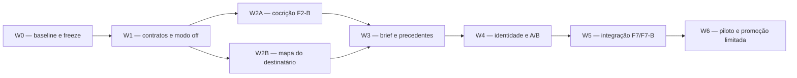

# Consulta IA — 35 — Roadmap de execução: FORJA-ASSINATURA Lite

> Cópia de consulta derivada. O documento canônico permanece no caminho de origem indicado abaixo.

## Metadados e rastreabilidade

- **Documento de origem:** `35_ROADMAP_EXECUCAO_FORJA_ASSINATURA_LITE.md`
- **Tipo:** Roadmap
- **SHA-256 da origem:** `86ea0864dfe68fa0f4bcf2cdb728229dac567eb74e67df979e29fa16460e59ea`
- **Linhas da origem:** 556
- **Blocos integralmente indexados:** 65
- **Geração:** 2026-08-10T13:53:35-03:00
- **Cobertura:** 100% das linhas e do texto da origem, sem omissão.
- **Links relativos normalizados:** 0 destino(s), apenas para preservar a navegação na cópia.

## Roteiro de consulta para IA

**Síntese de localização:** EMENDAS NORMATIVAS — 25/07/2026. Este documento vale acrescido da seção 9 de 36CONSOLIDACAOCONSELHOEPARECERFINAL.md (emendas E1 a E16: conselho Helena e Cícero, migração do modelo editorial Fable 5 para Opus 5 com revisão cruzada entre famílias, perímetro de sigilo, testes negativos, registro de escopo e Onda -1). Em conflito, prevalece a seção 9. Os ANEXOA/…

**Termos de recuperação:** não, objetivo, arquivos, trabalho, rollback, commit, sugerido, critérios, aceite, off, propriedade, implementar.

Use o índice abaixo para localizar o bloco pertinente. Cada entrada informa as linhas exatas no documento de origem. Para afirmações materiais, leia o bloco integral e confira o arquivo canônico pelo SHA-256.

## Índice detalhado e cobertura integral

- [SRC-S001 · L1–L16 · 35 — Roadmap de execução: FORJA-ASSINATURA Lite](#src-s001)
  - Assuntos: roadmap, execução, planejamento, forja-assinatura, lite, emendas, este, documento
  - Trecho-guia: EMENDAS NORMATIVAS — 25/07/2026. Este documento vale acrescido da seção 9 de 36CONSOLIDACAOCONSELHOEPARECERFINAL.md (emendas E1 a E16: conselho Helena e Cícero, migração do modelo editorial Fable 5 para Opus 5 com revisão cruzada entre famílias, perímetro de sigilo, testes negati
  - SHA-256 do bloco: `fe1576014a0349d63a0fbb0511abd52b8941ad8be015cdaeffe848abcd6bc9f1`
  - [SRC-S002 · L17–L29 · 1. Regra de execução](#src-s002)
    - Caminho: 35 — Roadmap de execução: FORJA-ASSINATURA Lite > 1. Regra de execução
    - Assuntos: onda, não, regra, execução, executar, vez, cada, precisa
    - Trecho-guia: Executar uma onda por vez. Cada onda precisa entregar:
    - SHA-256 do bloco: `cf22f5218d2f58ca69266cee9db99f3dc94b4cf2d2b1d077376db26ae09cd6d4`
  - [SRC-S003 · L30–L47 · 2. Dependências](#src-s003)
    - Caminho: 35 — Roadmap de execução: FORJA-ASSINATURA Lite > 2. Dependências
    - Assuntos: w2a, w2b, dependências, mermaid, flowchart, baseline, freeze, contratos
    - Trecho-guia: W2A e W2B podem ser executadas em paralelo apenas se os responsáveis não alterarem simultaneamente forjareasoning.py, forjan4validate.py ou os geradores. Se houver um único executor, fazer W2A antes de W2B.
    - SHA-256 do bloco: `407c21e35f646eead0f9047091b1885835816a8ec6b416e16fb0013b6085cfcb`
  - [SRC-S004 · L48–L49 · 3. W0 — baseline, contratos inferiores e freeze](#src-s004)
    - Caminho: 35 — Roadmap de execução: FORJA-ASSINATURA Lite > 3. W0 — baseline, contratos inferiores e freeze
    - Assuntos: baseline, contratos, inferiores, freeze
    - Trecho-guia: Documento de consulta sobre 3. W0 — baseline, contratos inferiores e freeze.
    - SHA-256 do bloco: `7dc086eabe33049df75bec6c3614d97088ebd2e0661bbd723ad34129cd43ca5c`
    - [SRC-S005 · L50–L53 · Objetivo](#src-s005)
      - Caminho: 35 — Roadmap de execução: FORJA-ASSINATURA Lite > 3. W0 — baseline, contratos inferiores e freeze > Objetivo
      - Assuntos: objetivo, congelar, estado, vivo, confirmar, plano, aponta, interfaces
      - Trecho-guia: Congelar o estado vivo e confirmar que o plano aponta para interfaces reais.
      - SHA-256 do bloco: `4e18cdacffb52ccb9db024f6968ec339abe903a8fc73b1ada380b9666fac2872`
    - [SRC-S006 · L54–L64 · Trabalho](#src-s006)
      - Caminho: 35 — Roadmap de execução: FORJA-ASSINATURA Lite > 3. W0 — baseline, contratos inferiores e freeze > Trabalho
      - Assuntos: trabalho, registrar, rodar, tdd, git, status, preservar, alterações
      - Trecho-guia: 1. registrar git status e preservar alterações alheias; 2. rodar a suíte dirigida do TDD; 3. rodar forjaregua.py; 4. classificar qualquer desvio preexistente; 5. salvar snapshot dos contratos F2–F7, catálogo N4, configurações e Graphify; 6. confirmar actions do TeiaJus com capabi
      - SHA-256 do bloco: `d66606557645c2256b24603aaa5b79fb15acdd184f841b7e06e7edbe46ba4617`
    - [SRC-S007 · L65–L68 · Arquivos](#src-s007)
      - Caminho: 35 — Roadmap de execução: FORJA-ASSINATURA Lite > 3. W0 — baseline, contratos inferiores e freeze > Arquivos
      - Assuntos: arquivos, somente, relatórios, baseline, documentação, execução, nenhum, código
      - Trecho-guia: Somente relatórios de baseline e documentação de execução. Nenhum código de produção.
      - SHA-256 do bloco: `0a735f9fc41edab9a6bfb58906a50f32df375f052be23bec46529f3eb483a505`
    - [SRC-S008 · L69–L76 · Gate](#src-s008)
      - Caminho: 35 — Roadmap de execução: FORJA-ASSINATURA Lite > 3. W0 — baseline, contratos inferiores e freeze > Gate
      - Assuntos: gate, verde, suíte, dirigida, régua, desvio, preexistente, documentado
      - Trecho-guia: suíte dirigida verde; Régua verde ou desvio preexistente documentado e aceito sem rebaseline automático; actions do TeiaJus inventariadas; nenhum consumidor inferior desconhecido; worktree suja mapeada.
      - SHA-256 do bloco: `9fcc3ef245c204d89f814f6af430381f49b2b327f9df2b44d6a9699dbc1f5768`
    - [SRC-S009 · L77–L86 · Evidência já disponível](#src-s009)
      - Caminho: 35 — Roadmap de execução: FORJA-ASSINATURA Lite > 3. W0 — baseline, contratos inferiores e freeze > Evidência já disponível
      - Assuntos: evidência, disponível, passed, text, subtests, esse, resultado, ponto
      - Trecho-guia: Esse resultado é ponto de partida, não substitui a repetição no início da execução.
      - SHA-256 do bloco: `7db5e967133199c9ee9162dcca9795d03a314eef9a1bc2214c8e484b757167b0`
    - [SRC-S010 · L87–L90 · Rollback](#src-s010)
      - Caminho: 35 — Roadmap de execução: FORJA-ASSINATURA Lite > 3. W0 — baseline, contratos inferiores e freeze > Rollback
      - Assuntos: rollback, não, aplicável, altera, comportamento
      - Trecho-guia: Não aplicável; W0 não altera comportamento.
      - SHA-256 do bloco: `33d24cfed9745437cb7637e33362be82d0913ff35ccf9b75c26d799e37b1db43`
    - [SRC-S011 · L91–L96 · Commit sugerido](#src-s011)
      - Caminho: 35 — Roadmap de execução: FORJA-ASSINATURA Lite > 3. W0 — baseline, contratos inferiores e freeze > Commit sugerido
      - Assuntos: commit, sugerido, docs, freeze, baseline, assinatura, lite
      - Trecho-guia: docs(forja): freeze baseline assinatura lite
      - SHA-256 do bloco: `17216199c10792f90d02df4546b9906a58414a007b9523443618351839786484`
  - [SRC-S012 · L97–L98 · 4. W1 — linguagem do sistema, schemas e modo off](#src-s012)
    - Caminho: 35 — Roadmap de execução: FORJA-ASSINATURA Lite > 4. W1 — linguagem do sistema, schemas e modo off
    - Assuntos: linguagem, sistema, schemas, modo, off
    - Trecho-guia: Documento de consulta sobre 4. W1 — linguagem do sistema, schemas e modo off.
    - SHA-256 do bloco: `2bc482dc1247fed89f8b1f89ecc9eae3ebda853c2b6295b959484909768b6e3b`
    - [SRC-S013 · L99–L102 · Objetivo](#src-s013)
      - Caminho: 35 — Roadmap de execução: FORJA-ASSINATURA Lite > 4. W1 — linguagem do sistema, schemas e modo off > Objetivo
      - Assuntos: objetivo, introduzir, contratos, materializar, comportamento, novo
      - Trecho-guia: Introduzir os contratos sem materializar comportamento novo.
      - SHA-256 do bloco: `2c034fe39936a62e13d90fe5f7a727ffd531d29ebcb9251ad32b3c0f2f25c568`
    - [SRC-S014 · L103–L116 · Trabalho](#src-s014)
      - Caminho: 35 — Roadmap de execução: FORJA-ASSINATURA Lite > 4. W1 — linguagem do sistema, schemas e modo off > Trabalho
      - Assuntos: off, trabalho, adicionar, modo, registrar, json, outputs, não
      - Trecho-guia: 1. adicionar namespace forjaAssinaturaLite com mode=off; 2. generalizar resolução de modo preservando effectivemode(); 3. registrar F3MAPADESTINATARIO.json; 4. registrar F4SIGNATUREBRIEF.json; 5. estender a definição geradora do F2 question tree; 6. adicionar outputs F3/F4 em EXT
      - SHA-256 do bloco: `e00fbdad1983a84b269755d04b488cfe8d83ca5930bf4d30fb0467fc9a661276`
    - [SRC-S015 · L117–L128 · Propriedade de arquivos](#src-s015)
      - Caminho: 35 — Roadmap de execução: FORJA-ASSINATURA Lite > 4. W1 — linguagem do sistema, schemas e modo off > Propriedade de arquivos
      - Assuntos: arquivos, propriedade, forja_n3_config, json, forja_n4_common, generate_n4_contracts, forja_n4_validate, forja_reasoning
      - Trecho-guia: FORJAN3CONFIG.json; forjan4common.py; generaten4contracts.py; forjan4validate.py; forjareasoning.py; arquivos gerados em n4schemas/ e phasecontractsn4/; testforjaassinaturalite.py; testforjan4.py; testforjaarchitecture.py.
      - SHA-256 do bloco: `c2da1acc6db6e7cdd1e9faa24f0d0f0ad90360c28f3d77761277e0bfc2dde243`
    - [SRC-S016 · L129–L139 · Critérios de aceite](#src-s016)
      - Caminho: 35 — Roadmap de execução: FORJA-ASSINATURA Lite > 4. W1 — linguagem do sistema, schemas e modo off > Critérios de aceite
      - Assuntos: critérios, aceite, casos, feature, gerador, idempotente, catálogo, artifact_specs
      - Trecho-guia: gerador é idempotente; catálogo e ARTIFACTSPECS coincidem; contratos F0–F10 mantêm ordem e fachadas; casos históricos validam; feature ausente equivale a off; modo desconhecido falha; casos N4 já em piloto não ativam a feature nova. schema e validador usam os mesmos estados de pe
      - SHA-256 do bloco: `2eb8a5cc5f61adb7be6e57a03c10759a6249a977abb2454558adf3d1592a73c4`
    - [SRC-S017 · L140–L151 · Comandos](#src-s017)
      - Caminho: 35 — Roadmap de execução: FORJA-ASSINATURA Lite > 4. W1 — linguagem do sistema, schemas e modo off > Comandos
      - Assuntos: python, comandos, json, powershell, generate_n4_contracts, tool, n4_schemas, artifact_catalog
      - Trecho-guia: Documento de consulta sobre Comandos.
      - SHA-256 do bloco: `ca33556b803711493799d1cf29594a8a20b481813c7393dddbf9960889ed0c4b`
    - [SRC-S018 · L152–L155 · Rollback](#src-s018)
      - Caminho: 35 — Roadmap de execução: FORJA-ASSINATURA Lite > 4. W1 — linguagem do sistema, schemas e modo off > Rollback
      - Assuntos: rollback, remover, namespace, registros, novos, regenerar, artefatos, modo
      - Trecho-guia: Remover namespace e registros novos; regenerar artefatos. Como o modo é off, não há migração de caso.
      - SHA-256 do bloco: `f43515c8b4df7d161dfc8dd1f94a5c6357a2166ba600fa4617c3635d4fbf254e`
    - [SRC-S019 · L156–L161 · Commit sugerido](#src-s019)
      - Caminho: 35 — Roadmap de execução: FORJA-ASSINATURA Lite > 4. W1 — linguagem do sistema, schemas e modo off > Commit sugerido
      - Assuntos: commit, sugerido, feat, add, assinatura, lite, contracts, off
      - Trecho-guia: feat(forja): add assinatura lite contracts in off mode
      - SHA-256 do bloco: `b6a2ccf954e179ac75020edaee029cab5b3a19fb627e0d7e591ac07c92b81cdd`
  - [SRC-S020 · L162–L163 · 5. W2A — cocrição F2-B em sombra](#src-s020)
    - Caminho: 35 — Roadmap de execução: FORJA-ASSINATURA Lite > 5. W2A — cocrição F2-B em sombra
    - Assuntos: w2a, cocrição, f2-b, sombra
    - Trecho-guia: Documento de consulta sobre 5. W2A — cocrição F2-B em sombra.
    - SHA-256 do bloco: `e1bdfdfd018c5437d2ffe55fb80f5aca80856accb8f4d3a4f67ce07178549b63`
    - [SRC-S021 · L164–L167 · Objetivo](#src-s021)
      - Caminho: 35 — Roadmap de execução: FORJA-ASSINATURA Lite > 5. W2A — cocrição F2-B em sombra > Objetivo
      - Assuntos: objetivo, transformar, f2-a, consulta, material, envio, automático
      - Trecho-guia: Transformar F2-A em consulta material sem envio automático.
      - SHA-256 do bloco: `5fe56012dd0c83de02f46b20c6826a370b28c24d69ac41034335a6b3341d063f`
    - [SRC-S022 · L168–L179 · Trabalho](#src-s022)
      - Caminho: 35 — Roadmap de execução: FORJA-ASSINATURA Lite > 5. W2A — cocrição F2-B em sombra > Trabalho
      - Assuntos: implementar, trabalho, consulta, campos, dialéticos, ledger, decisões, seletor
      - Trecho-guia: 1. implementar campos dialéticos e ledger de decisões; 2. implementar seletor determinístico; 3. implementar políticas de silêncio; 4. implementar renderização da consulta; 5. implementar registro append-only de resposta; 6. criar template humano; 7. validar consulta em casos his
      - SHA-256 do bloco: `cf5f35952fc4bb6f590cf6fc04b439025c29270e7b0ccf9c3ef1e07537565e4a`
    - [SRC-S023 · L180–L190 · Propriedade de arquivos](#src-s023)
      - Caminho: 35 — Roadmap de execução: FORJA-ASSINATURA Lite > 5. W2A — cocrição F2-B em sombra > Propriedade de arquivos
      - Assuntos: propriedade, arquivos, forja_exploracao_100, generate_n4_contracts, forja_reasoning, schema, gerado, templates
      - Trecho-guia: forjaexploracao100.py; generaten4contracts.py; forjareasoning.py; schema F2 gerado; templates/F2CONSULTAADVOGADO.md; testforjaexploracao100.py; testforjaassinaturalite.py; testforjan4.py.
      - SHA-256 do bloco: `17db92b9dd975de82ccf5c885bd71c3c4dfbe8de400648d60ec3cad6735330ba`
    - [SRC-S024 · L191–L201 · Casos de teste mínimos](#src-s024)
      - Caminho: 35 — Roadmap de execução: FORJA-ASSINATURA Lite > 5. W2A — cocrição F2-B em sombra > Casos de teste mínimos
      - Assuntos: casos, teste, mínimos, resposta, default, fato, documentado, objetivo
      - Trecho-guia: fato já documentado; objetivo estratégico desconhecido; autorização necessária; resposta parcial; duas rodadas; escolha formal não material com default; tentativa de default factual; resposta officedeclaration sem supportIds.
      - SHA-256 do bloco: `ce498407936211c8306730681397e59ad195c18341833fc931b9a4767afeb1b7`
    - [SRC-S025 · L202–L212 · Critérios de aceite](#src-s025)
      - Caminho: 35 — Roadmap de execução: FORJA-ASSINATURA Lite > 5. W2A — cocrição F2-B em sombra > Critérios de aceite
      - Assuntos: critérios, aceite, pergunta, redundante, rejeitada, material, informa, consequência
      - Trecho-guia: pergunta redundante é rejeitada; pergunta material informa consequência; silêncio factual bloqueia; resposta parcial mantém pendência; decisão tem autor e canal; consulta renderizada corresponde ao hash; nenhum e-mail é enviado; incumbente de F6 permanece inalterado.
      - SHA-256 do bloco: `2c3288a726442e603c16abb18cb53077aa38614c3ab475461836aef0b7fc197f`
    - [SRC-S026 · L213–L216 · Rollback](#src-s026)
      - Caminho: 35 — Roadmap de execução: FORJA-ASSINATURA Lite > 5. W2A — cocrição F2-B em sombra > Rollback
      - Assuntos: rollback, mode, off, campos, aditivos, permanecem, legíveis, ignorados
      - Trecho-guia: mode=off; campos aditivos permanecem legíveis e ignorados.
      - SHA-256 do bloco: `291bcbbcf944ed68c8669ece2cbe09cc4f767211319ce002ff21962a26825f9c`
    - [SRC-S027 · L217–L222 · Commit sugerido](#src-s027)
      - Caminho: 35 — Roadmap de execução: FORJA-ASSINATURA Lite > 5. W2A — cocrição F2-B em sombra > Commit sugerido
      - Assuntos: commit, sugerido, feat, add, dialectic, consultation, shadow
      - Trecho-guia: feat(forja): add dialectic consultation in shadow
      - SHA-256 do bloco: `aa2af5c2b04bc952d51365981afab67921d8ea235696ac6b1926772135599abb`
  - [SRC-S028 · L223–L224 · 6. W2B — mapa do destinatário e TeiaJus em sombra](#src-s028)
    - Caminho: 35 — Roadmap de execução: FORJA-ASSINATURA Lite > 6. W2B — mapa do destinatário e TeiaJus em sombra
    - Assuntos: w2b, mapa, destinatário, teiajus, sombra
    - Trecho-guia: Documento de consulta sobre 6. W2B — mapa do destinatário e TeiaJus em sombra.
    - SHA-256 do bloco: `3634bd77b8276cc6c663c1092c8f01adf8d2b5df6bdcde9809a5b36dfb1164e8`
    - [SRC-S029 · L225–L228 · Objetivo](#src-s029)
      - Caminho: 35 — Roadmap de execução: FORJA-ASSINATURA Lite > 6. W2B — mapa do destinatário e TeiaJus em sombra > Objetivo
      - Assuntos: objetivo, produzir, mapa, verificável, tratar, metadado, prova
      - Trecho-guia: Produzir mapa verificável sem tratar metadado como prova.
      - SHA-256 do bloco: `518f0e60a11684a88cddae7b7553c16e453e8c1251c75f6da7674d3d374e5b74`
    - [SRC-S030 · L229–L240 · Trabalho](#src-s030)
      - Caminho: 35 — Roadmap de execução: FORJA-ASSINATURA Lite > 6. W2B — mapa do destinatário e TeiaJus em sombra > Trabalho
      - Assuntos: trabalho, implementar, fonte, schema, completo, mapa, validador, freshness
      - Trecho-guia: 1. implementar schema completo do mapa; 2. implementar validador e freshness; 3. classificar fontes por nível probatório; 4. testar a allowlist ampliada sem ações pagas; 5. integrar researchsources, researchplan, researchsearch e researchmissionget, se capabilities e testes confi
      - SHA-256 do bloco: `3195f739668a277cc19c474b6c132519afc015514038bf25d173a1811373481d`
    - [SRC-S031 · L241–L251 · Propriedade de arquivos](#src-s031)
      - Caminho: 35 — Roadmap de execução: FORJA-ASSINATURA Lite > 6. W2B — mapa do destinatário e TeiaJus em sombra > Propriedade de arquivos
      - Assuntos: propriedade, arquivos, forja_reasoning, forja_n4_validate, forja_search_config, json, forja_legal_search, somente
      - Trecho-guia: forjareasoning.py; forjan4validate.py; FORJASEARCHCONFIG.json; forjalegalsearch.py, somente se necessário; schema e contratos gerados; testforjalegalsearch.py; testforjaassinaturalite.py; testforjan4.py.
      - SHA-256 do bloco: `711861edcb7bd6402502736653082acd35a915ad39919993ad9e4b10128b8cc1`
    - [SRC-S032 · L252–L261 · Critérios de aceite](#src-s032)
      - Caminho: 35 — Roadmap de execução: FORJA-ASSINATURA Lite > 6. W2B — mapa do destinatário e TeiaJus em sombra > Critérios de aceite
      - Assuntos: critérios, aceite, composição, datajud, nunca, confirma, prevenção, stale
      - Trecho-guia: DataJud nunca confirma composição ou prevenção; composição stale é detectada; toda posição aponta para decisão; topologia adicional exige justificativa; actions readpaid são negadas; artefato de pesquisa não vira citação final sem F7; nenhuma mutação TeiaJus ocorre.
      - SHA-256 do bloco: `a424123e8c5b7443214cc3bc0de37533b9ac98c5cf90caf0196ad0b82394bfe1`
    - [SRC-S033 · L262–L265 · Rollback](#src-s033)
      - Caminho: 35 — Roadmap de execução: FORJA-ASSINATURA Lite > 6. W2B — mapa do destinatário e TeiaJus em sombra > Rollback
      - Assuntos: rollback, remover, novas, actions, allowlist, usar, mode, off
      - Trecho-guia: Remover novas actions da allowlist e usar mode=off. O TeiaJus canônico não é modificado.
      - SHA-256 do bloco: `37105188e183ad2951a576302389319d41cd20b43e6f795ca40001c852b0298d`
    - [SRC-S034 · L266–L271 · Commit sugerido](#src-s034)
      - Caminho: 35 — Roadmap de execução: FORJA-ASSINATURA Lite > 6. W2B — mapa do destinatário e TeiaJus em sombra > Commit sugerido
      - Assuntos: commit, sugerido, feat, add, sourced, recipient, map, shadow
      - Trecho-guia: feat(forja): add sourced recipient map in shadow
      - SHA-256 do bloco: `53ec2f647cf00b1d020a57d864cfbba371ceb3f001177d94b7fa0314cbd06b2f`
  - [SRC-S035 · L272–L273 · 7. W3 — signature brief, pesquisa jurídica e âncoras](#src-s035)
    - Caminho: 35 — Roadmap de execução: FORJA-ASSINATURA Lite > 7. W3 — signature brief, pesquisa jurídica e âncoras
    - Assuntos: signature, brief, pesquisa, jurídica, âncoras
    - Trecho-guia: Documento de consulta sobre 7. W3 — signature brief, pesquisa jurídica e âncoras.
    - SHA-256 do bloco: `c3939d3950b6816055ae12c6d735320ea66f3254f7afbbbc857db3b152df06c2`
    - [SRC-S036 · L274–L277 · Objetivo](#src-s036)
      - Caminho: 35 — Roadmap de execução: FORJA-ASSINATURA Lite > 7. W3 — signature brief, pesquisa jurídica e âncoras > Objetivo
      - Assuntos: objetivo, vincular, decisão, humana, topologia, precedentes, antes, redação
      - Trecho-guia: Vincular decisão humana, topologia e precedentes antes da redação.
      - SHA-256 do bloco: `5098d05030bf453b73a48fbfaaaafdb49608a2ab560bd98aecd8af38e43db070`
    - [SRC-S037 · L278–L289 · Trabalho](#src-s037)
      - Caminho: 35 — Roadmap de execução: FORJA-ASSINATURA Lite > 7. W3 — signature brief, pesquisa jurídica e âncoras > Trabalho
      - Assuntos: implementar, rotas, trabalho, anchor, testar, quatro, f4_signature_brief, json
      - Trecho-guia: 1. implementar F4SIGNATUREBRIEF.json; 2. validar rotas, decisão humana e cross-references; 3. implementar legalResearchProtocol no sourceledger; 4. implementar ficha de anchor no verifiedsourceledger; 5. distinguir ementa, íntegra, metadado e dado administrativo; 6. implementar r
      - SHA-256 do bloco: `072abb286648beceb355fd92014e442e7331e5df7fef96add05a6222622c339b`
    - [SRC-S038 · L290–L304 · Propriedade de arquivos](#src-s038)
      - Caminho: 35 — Roadmap de execução: FORJA-ASSINATURA Lite > 7. W3 — signature brief, pesquisa jurídica e âncoras > Propriedade de arquivos
      - Assuntos: propriedade, arquivos, forja_reasoning, forja_n4_validate, forja_package, forja_run, forja_claim_binding, necessário
      - Trecho-guia: forjareasoning.py; forjan4validate.py; forjapackage.py; forjarun.py; forjaclaimbinding.py, se necessário; forjan4invalidation.py; geradores e schemas; testforjaassinaturalite.py; testforjaantihallucinationv2.py; testforjaanticheat.py; testforjarun.py; testforjan3package.py.
      - SHA-256 do bloco: `743e6cfc6216c21a347e1ad17378c374e74a3814c032365aa9b246dafe30cc10`
    - [SRC-S039 · L305–L316 · Critérios de aceite](#src-s039)
      - Caminho: 35 — Roadmap de execução: FORJA-ASSINATURA Lite > 7. W3 — signature brief, pesquisa jurídica e âncoras > Critérios de aceite
      - Assuntos: não, critérios, aceite, brief, bloqueado, libera, rota, selecionada
      - Trecho-guia: brief bloqueado não libera F6; rota selecionada possui decisão humana material; IDs inexistentes falham; ementa isolada não produz holding final; trecho alterado falha por hash; regime não usa score universal; query negativa é reproduzível; CGU sancionatório não é precedente; anc
      - SHA-256 do bloco: `5f22cbf2097ebf0ace1d8c84405b037b0d8ebe3750f54ca5df16535153a88e11`
    - [SRC-S040 · L317–L320 · Rollback](#src-s040)
      - Caminho: 35 — Roadmap de execução: FORJA-ASSINATURA Lite > 7. W3 — signature brief, pesquisa jurídica e âncoras > Rollback
      - Assuntos: rollback, mode, off, continuam, aceitando, ledgers, legados, nenhuma
      - Trecho-guia: mode=off; F5/F7 continuam aceitando ledgers legados. Nenhuma fonte histórica é apagada.
      - SHA-256 do bloco: `9fd3929fe99392a3d1e3e993ac58953261d2e0573f24ec40d048cefb457255d8`
    - [SRC-S041 · L321–L326 · Commit sugerido](#src-s041)
      - Caminho: 35 — Roadmap de execução: FORJA-ASSINATURA Lite > 7. W3 — signature brief, pesquisa jurídica e âncoras > Commit sugerido
      - Assuntos: commit, sugerido, feat, bind, strategy, brief, verified, anchors
      - Trecho-guia: feat(forja): bind strategy brief to verified anchors
      - SHA-256 do bloco: `71cbb4f3fbb9badb84deaafa38bc67effffea269e3fdfd85a1a82a0544cdf86d`
  - [SRC-S042 · L327–L328 · 8. W4 — corpus de identidade e variante offline](#src-s042)
    - Caminho: 35 — Roadmap de execução: FORJA-ASSINATURA Lite > 8. W4 — corpus de identidade e variante offline
    - Assuntos: corpus, identidade, variante, offline
    - Trecho-guia: Documento de consulta sobre 8. W4 — corpus de identidade e variante offline.
    - SHA-256 do bloco: `f7e3bf3d4554cba142fe4246b46227ef7141f648b4a2ce1dc737292210674d40`
    - [SRC-S043 · L329–L332 · Objetivo](#src-s043)
      - Caminho: 35 — Roadmap de execução: FORJA-ASSINATURA Lite > 8. W4 — corpus de identidade e variante offline > Objetivo
      - Assuntos: objetivo, transformar, acervo, heterogêneo, evidência, editorial, atribuível
      - Trecho-guia: Transformar acervo heterogêneo em evidência editorial atribuível.
      - SHA-256 do bloco: `ea2ac1d8e2cb602c2f4718b35af35e8202d7b2498eb594ab3c657c3259a27e93`
    - [SRC-S044 · L333–L344 · Trabalho](#src-s044)
      - Caminho: 35 — Roadmap de execução: FORJA-ASSINATURA Lite > 8. W4 — corpus de identidade e variante offline > Trabalho
      - Assuntos: trabalho, padrões, criar, manifest, vazio, schema, validador, inventariar
      - Trecho-guia: 1. criar manifest vazio e schema/validador; 2. inventariar inicialmente apenas itens de alta confiança; 3. separar escrita, revisão, aprovação, feedback e pensamento oral; 4. vincular versões por hash; 5. classificar diffs por origem intelectual; 6. extrair padrões candidatos sem
      - SHA-256 do bloco: `ac0d21155025416cd7473a4101ef2e445b0a3e2435bdda6053a51c75fbcfd2ab`
    - [SRC-S045 · L345–L355 · Propriedade de arquivos](#src-s045)
      - Caminho: 35 — Roadmap de execução: FORJA-ASSINATURA Lite > 8. W4 — corpus de identidade e variante offline > Propriedade de arquivos
      - Assuntos: propriedade, arquivos, autoresearch, precisar, prompts, identity_corpus_manifest, jsonl, forja_learning
      - Trecho-guia: autoresearch/IDENTITYCORPUSMANIFEST.jsonl; forjalearning.py; forjadiffdocx.py, se precisar expor metadados; forjaarcorpus.py, se precisar de seleção offline; prompts versionados em autoresearch/prompts/; testforjaautoresearch.py; testforjaassinaturalite.py; testes de learning N4.
      - SHA-256 do bloco: `a908e61e75a2fce0d27342ef83b2935ec4aa90c383040f66158233ca640fb26d`
    - [SRC-S046 · L356–L365 · Critérios de aceite](#src-s046)
      - Caminho: 35 — Roadmap de execução: FORJA-ASSINATURA Lite > 8. W4 — corpus de identidade e variante offline > Critérios de aceite
      - Assuntos: não, vira, critérios, aceite, autoria, desconhecida, human_authored, transcript
      - Trecho-guia: autoria desconhecida não vira humanauthored; transcript não vira estilo escrito; diff sem autor não vira preferência Medina; conteúdo privado não aparece no relatório; variante usa o mesmo snapshot jurídico; A/B não promove automaticamente; regressão jurídica veta ganho editorial
      - SHA-256 do bloco: `f3db9280281bd4fc7c1233b1c438ad7dd6c38717b9c3d0a6eeaa1a747eb2affc`
    - [SRC-S047 · L366–L369 · Rollback](#src-s047)
      - Caminho: 35 — Roadmap de execução: FORJA-ASSINATURA Lite > 8. W4 — corpus de identidade e variante offline > Rollback
      - Assuntos: rollback, não, usar, manifest, geração, corpus, offline, altera
      - Trecho-guia: Não usar o manifest na geração. O corpus é offline e não altera casos.
      - SHA-256 do bloco: `835436acba7bf8f7bde3e538b162b93dba447903fb15a715b405ec6874b4d9d7`
    - [SRC-S048 · L370–L375 · Commit sugerido](#src-s048)
      - Caminho: 35 — Roadmap de execução: FORJA-ASSINATURA Lite > 8. W4 — corpus de identidade e variante offline > Commit sugerido
      - Assuntos: commit, sugerido, feat, add, attributable, identity, corpus, for
      - Trecho-guia: feat(forja): add attributable identity corpus for offline evaluation
      - SHA-256 do bloco: `d3069bbdc13f3c9864598c64377cd6445fdbd6264feece7bc9cb8e2bde4ca34a`
  - [SRC-S049 · L376–L377 · 9. W5 — integração F6, F7/F7-B e package](#src-s049)
    - Caminho: 35 — Roadmap de execução: FORJA-ASSINATURA Lite > 9. W5 — integração F6, F7/F7-B e package
    - Assuntos: integração, f7-b, package
    - Trecho-guia: Documento de consulta sobre 9. W5 — integração F6, F7/F7-B e package.
    - SHA-256 do bloco: `6e4cc05192371bd4c099f28389ba8467ab2e8201bf0e71af6e29acf3573c847c`
    - [SRC-S050 · L378–L381 · Objetivo](#src-s050)
      - Caminho: 35 — Roadmap de execução: FORJA-ASSINATURA Lite > 9. W5 — integração F6, F7/F7-B e package > Objetivo
      - Assuntos: objetivo, preservar, decisão, até, texto, final, recomputá-la, independentemente
      - Trecho-guia: Preservar a decisão até o texto final e recomputá-la independentemente.
      - SHA-256 do bloco: `21707766033e154f000a04bc1d220345f68c1061633b3eaf3634c6b07d5038fa`
    - [SRC-S051 · L382–L393 · Trabalho](#src-s051)
      - Caminho: 35 — Roadmap de execução: FORJA-ASSINATURA Lite > 9. W5 — integração F6, F7/F7-B e package > Trabalho
      - Assuntos: trabalho, recibo, manter, brief, rota, implementar, forja-gosto-edge-v2, compatibilidade
      - Trecho-guia: 1. implementar recibo FORJA-GOSTO-EDGE-v2; 2. manter compatibilidade com v1; 3. remover exigência fixa de três direções apenas no v2; 4. adicionar hash do brief e rota; 5. recompor recibo em forjaeditorialfidelity.py; 6. passar brief opcional por forjarun.py e forjapackage.py; 7.
      - SHA-256 do bloco: `f427890abea355fa595a63f1a743a5be0d90f8497c91e436b4fa84866dd01560`
    - [SRC-S052 · L394–L405 · Propriedade de arquivos](#src-s052)
      - Caminho: 35 — Roadmap de execução: FORJA-ASSINATURA Lite > 9. W5 — integração F6, F7/F7-B e package > Propriedade de arquivos
      - Assuntos: propriedade, arquivos, forja_fable5, forja_editorial_fidelity, forja_run, forja_package, test_forja_fable5, test_forja_run
      - Trecho-guia: forjafable5.py; forjaeditorialfidelity.py; forjarun.py; forjapackage.py; testforjafable5.py; testforjarun.py; testforjan3package.py; testforjaassinaturalite.py; testforjamutationsemantic.py.
      - SHA-256 do bloco: `409ea4fd4dde304043b4f299b11668fe21ba0520a4d4001d6fc5afda7e91bb03`
    - [SRC-S053 · L406–L416 · Critérios de aceite](#src-s053)
      - Caminho: 35 — Roadmap de execução: FORJA-ASSINATURA Lite > 9. W5 — integração F6, F7/F7-B e package > Critérios de aceite
      - Assuntos: falha, critérios, aceite, recibo, divergente, chamadas, antigas, continuam
      - Trecho-guia: chamadas antigas continuam válidas; recibo v1 continua legível; recibo v2 adulterado falha; routeId divergente falha; hash do brief divergente falha; conteúdo obrigatório removido falha; F8 recebe um finalmarkdown; package exige ledger e recibos existentes.
      - SHA-256 do bloco: `5b6a7c3adbe2c040a64cde20c8d9c0e1e28c823137a0feecee44f65f0350a3df`
    - [SRC-S054 · L417–L420 · Rollback](#src-s054)
      - Caminho: 35 — Roadmap de execução: FORJA-ASSINATURA Lite > 9. W5 — integração F6, F7/F7-B e package > Rollback
      - Assuntos: rollback, mode, off, ausência, parâmetro, opcional, brief, restauram
      - Trecho-guia: mode=off e ausência do parâmetro opcional do brief restauram a execução anterior.
      - SHA-256 do bloco: `87273e286845bf5c23f37ca63c25267da9d694e8c373e85bdc898e9c77f74a31`
    - [SRC-S055 · L421–L426 · Commit sugerido](#src-s055)
      - Caminho: 35 — Roadmap de execução: FORJA-ASSINATURA Lite > 9. W5 — integração F6, F7/F7-B e package > Commit sugerido
      - Assuntos: commit, sugerido, feat, preserve, signature, brief, through, final
      - Trecho-guia: feat(forja): preserve signature brief through final markdown
      - SHA-256 do bloco: `18ea3fd9f8135f64a606a98095459dcbcdc06bc362eae45c6486649ee304c540`
  - [SRC-S056 · L427–L428 · 10. W6 — piloto controlado, rollback e documentação](#src-s056)
    - Caminho: 35 — Roadmap de execução: FORJA-ASSINATURA Lite > 10. W6 — piloto controlado, rollback e documentação
    - Assuntos: piloto, controlado, rollback, documentação
    - Trecho-guia: Documento de consulta sobre 10. W6 — piloto controlado, rollback e documentação.
    - SHA-256 do bloco: `18ef0791a8d99391c037cc4635746fc4ba93f46149b55feedb8b5bd386e26a99`
    - [SRC-S057 · L429–L432 · Objetivo](#src-s057)
      - Caminho: 35 — Roadmap de execução: FORJA-ASSINATURA Lite > 10. W6 — piloto controlado, rollback e documentação > Objetivo
      - Assuntos: objetivo, exercitar, capacidade, completa, poucos, casos, promoção, global
      - Trecho-guia: Exercitar a capacidade completa em poucos casos sem promoção global.
      - SHA-256 do bloco: `145646f792f3997f6014ab77d10554b89d9a38f456c8e210f7a854c3f5b76d7e`
    - [SRC-S058 · L433–L446 · Trabalho](#src-s058)
      - Caminho: 35 — Roadmap de execução: FORJA-ASSINATURA Lite > 10. W6 — piloto controlado, rollback e documentação > Trabalho
      - Assuntos: executar, trabalho, revisão, pesquisa, selecionar, pilotos, autorização, registrar
      - Trecho-guia: 1. selecionar pilotos com autorização; 2. registrar baseline e expectativas por caso; 3. executar consulta com revisão e envio humanos; 4. executar mapa, brief, pesquisa e um draft; 5. validar F7/F7-B, DOCX/PDF e package; 6. comparar com incumbente; 7. medir interação, segurança,
      - SHA-256 do bloco: `f3eebcee1c84ad3d32c26f3cbd1c3d93da16331534b207af370e6f0f48219473`
    - [SRC-S059 · L447–L458 · Pilotos candidatos](#src-s059)
      - Caminho: 35 — Roadmap de execução: FORJA-ASSINATURA Lite > 10. W6 — piloto controlado, rollback e documentação > Pilotos candidatos
      - Assuntos: candidatos, pilotos, escolher, apenas, após, considerando, existência, entrega
      - Trecho-guia: Escolher apenas após W0, considerando:
      - SHA-256 do bloco: `174e9fe0b1ef55af824cc1f064c43a5afb437950e961d516f8ca7f2a70afe7cc`
    - [SRC-S060 · L459–L471 · Critérios de aceite](#src-s060)
      - Caminho: 35 — Roadmap de execução: FORJA-ASSINATURA Lite > 10. W6 — piloto controlado, rollback e documentação > Critérios de aceite
      - Assuntos: zero, critérios, aceite, não, regressão, ah-01, ah-08, fato
      - Trecho-guia: zero regressão AH-01 a AH-08; zero fato por silêncio; zero ação externa não autorizada; anchors verificadas; composição/prevenção com estado honesto; consultas materiais e não redundantes; rollback exercitado; pacote final íntegro; custos e latências publicados com denominadores;
      - SHA-256 do bloco: `c53220fc5fb621cd06dbc225b848a5c632fad54e3574b110cc5f5147abe00172`
    - [SRC-S061 · L472–L479 · Estado máximo](#src-s061)
      - Caminho: 35 — Roadmap de execução: FORJA-ASSINATURA Lite > 10. W6 — piloto controlado, rollback e documentação > Estado máximo
      - Assuntos: estado, máximo, text, pilot_completed, não, habilitar, default_on
      - Trecho-guia: Documento de consulta sobre Estado máximo.
      - SHA-256 do bloco: `5d3f97250e704277a1e4b16e3be548fb7cf77128d6505eee74fe8609839b6e79`
    - [SRC-S062 · L480–L485 · Commit sugerido](#src-s062)
      - Caminho: 35 — Roadmap de execução: FORJA-ASSINATURA Lite > 10. W6 — piloto controlado, rollback e documentação > Commit sugerido
      - Assuntos: commit, sugerido, docs, record, assinatura, lite, pilot, and
      - Trecho-guia: docs(forja): record assinatura lite pilot and validated architecture
      - SHA-256 do bloco: `dc58cb70f50e876fde5cf4c4dda266899125f5831027d486a0ac8f00c3b70318`
  - [SRC-S063 · L486–L522 · 11. Suíte de promoção](#src-s063)
    - Caminho: 35 — Roadmap de execução: FORJA-ASSINATURA Lite > 11. Suíte de promoção
    - Assuntos: python, suíte, promoção, powershell, users, igorpc, claude, projects
    - Trecho-guia: Validar visualmente todos os HTMLs regenerados.
    - SHA-256 do bloco: `914d43269a403cff7755f9a2e0b794897229f511a80c242a39d3d6b6d3656bcc`
  - [SRC-S064 · L523–L541 · 12. Stop conditions](#src-s064)
    - Caminho: 35 — Roadmap de execução: FORJA-ASSINATURA Lite > 12. Stop conditions
    - Assuntos: não, stop, conditions, necessidade, parar, onda, contornar, gate
    - Trecho-guia: Parar a onda e não contornar o gate se ocorrer:
    - SHA-256 do bloco: `ab7a243e8d59bd4973a8a68bf47e08356f673c5c2f5b53c388ba826cbb384959`
  - [SRC-S065 · L542–L556 · 13. Critério de prontidão para começar](#src-s065)
    - Caminho: 35 — Roadmap de execução: FORJA-ASSINATURA Lite > 13. Critério de prontidão para começar
    - Assuntos: critério, prontidão, começar, têm, foram, execução, pacote, está
    - Trecho-guia: O pacote está documentalmente pronto quando:
    - SHA-256 do bloco: `2599a146980c57f1baba87f135dc000048add5c240ff0f3171c1e6e606c803b7`

## Conteúdo integral indexado

Os marcadores HTML abaixo são apenas âncoras de navegação. O texto reproduz integralmente a origem normalizada em UTF-8; somente destinos de links relativos podem ter sido recalculados para apontar ao mesmo arquivo a partir desta pasta.

<a id="src-s001"></a>

# 35 — Roadmap de execução: FORJA-ASSINATURA Lite

> **EMENDAS NORMATIVAS — 25/07/2026.** Este documento vale **acrescido da seção 9 de `36_CONSOLIDACAO_CONSELHO_E_PARECER_FINAL.md`** (emendas E1 a E16: conselho Helena e Cícero, migração do modelo editorial Fable 5 para Opus 5 com revisão cruzada entre famílias, perímetro de sigilo, testes negativos, registro de escopo e Onda -1). Em conflito, prevalece a seção 9. Os `ANEXO_A/B/C` são histórico e não se executam.


**Versão:** 1.0  
**Data:** 25/07/2026  
**Estado:** pronto para execução por ondas; nenhuma onda iniciada  
**PRD:** `planejamento/33_PRD_FORJA_ASSINATURA_LITE_COCRIACAO_PRECEDENTES.md`  
**TDD:** `planejamento/34_TDD_FORJA_ASSINATURA_LITE_COCRIACAO_PRECEDENTES.md`  
**Arquitetura:** `planejamento/32_PLANO_UNICO_CONSOLIDADO_V2_2026-07-25.md`

Este roadmap substitui o documento 26 como sequência imediata. O plano 26 permanece como backlog experimental de longo prazo.

---


<a id="src-s002"></a>

## 1. Regra de execução

Executar uma onda por vez. Cada onda precisa entregar:

- mudança pequena e atribuível;
- testes proporcionais;
- evidência de gate;
- rollback;
- atualização documental necessária;
- decisão explícita de avançar.

Não iniciar uma onda sobre baseline ambíguo. Não rebaselinear a Régua automaticamente. Não agrupar W1–W5 em refatoração única.


<a id="src-s003"></a>

## 2. Dependências



W2A e W2B podem ser executadas em paralelo apenas se os responsáveis não alterarem simultaneamente `forja_reasoning.py`, `forja_n4_validate.py` ou os geradores. Se houver um único executor, fazer W2A antes de W2B.

---


<a id="src-s004"></a>

## 3. W0 — baseline, contratos inferiores e freeze


<a id="src-s005"></a>

### Objetivo

Congelar o estado vivo e confirmar que o plano aponta para interfaces reais.


<a id="src-s006"></a>

### Trabalho

1. registrar `git status` e preservar alterações alheias;
2. rodar a suíte dirigida do TDD;
3. rodar `forja_regua.py`;
4. classificar qualquer desvio preexistente;
5. salvar snapshot dos contratos F2–F7, catálogo N4, configurações e Graphify;
6. confirmar actions do TeiaJus com `capabilities`;
7. registrar baseline de custo e latência das rotas afetadas;
8. criar matriz requisito → arquivo → teste a partir do TDD.


<a id="src-s007"></a>

### Arquivos

Somente relatórios de baseline e documentação de execução. Nenhum código de produção.


<a id="src-s008"></a>

### Gate

- suíte dirigida verde;
- Régua verde ou desvio preexistente documentado e aceito sem rebaseline automático;
- actions do TeiaJus inventariadas;
- nenhum consumidor inferior desconhecido;
- worktree suja mapeada.


<a id="src-s009"></a>

### Evidência já disponível

Em 25/07/2026:

```text
104 passed, 3 subtests passed
```

Esse resultado é ponto de partida, não substitui a repetição no início da execução.


<a id="src-s010"></a>

### Rollback

Não aplicável; W0 não altera comportamento.


<a id="src-s011"></a>

### Commit sugerido

`docs(forja): freeze baseline assinatura lite`

---


<a id="src-s012"></a>

## 4. W1 — linguagem do sistema, schemas e modo `off`


<a id="src-s013"></a>

### Objetivo

Introduzir os contratos sem materializar comportamento novo.


<a id="src-s014"></a>

### Trabalho

1. adicionar namespace `forjaAssinaturaLite` com `mode=off`;
2. generalizar resolução de modo preservando `_effective_mode()`;
3. registrar `F3_MAPA_DESTINATARIO.json`;
4. registrar `F4_SIGNATURE_BRIEF.json`;
5. estender a definição geradora do F2 question tree;
6. adicionar outputs F3/F4 em `EXTENSIONS`;
7. exigir os novos arquivos em `validate_case()` somente quando o modo da feature não for `off`;
8. gerar schemas, catálogo e contratos N4;
9. criar validadores estruturais mínimos que rejeitem payload vazio;
10. criar `test_forja_assinatura_lite.py`;
11. provar que `off` não altera outputs nem chama TeiaJus/modelos.


<a id="src-s015"></a>

### Propriedade de arquivos

- `FORJA_N3_CONFIG.json`;
- `forja_n4_common.py`;
- `generate_n4_contracts.py`;
- `forja_n4_validate.py`;
- `forja_reasoning.py`;
- arquivos gerados em `n4_schemas/` e `phase_contracts_n4/`;
- `test_forja_assinatura_lite.py`;
- `test_forja_n4.py`;
- `test_forja_architecture.py`.


<a id="src-s016"></a>

### Critérios de aceite

- gerador é idempotente;
- catálogo e `ARTIFACT_SPECS` coincidem;
- contratos F0–F10 mantêm ordem e fachadas;
- casos históricos validam;
- feature ausente equivale a `off`;
- modo desconhecido falha;
- casos N4 já em piloto não ativam a feature nova.
- schema e validador usam os mesmos estados de pergunta.


<a id="src-s017"></a>

### Comandos

```powershell
python generate_n4_contracts.py
python -m json.tool n4_schemas\ARTIFACT_CATALOG.json > $null
python forja_phase_contracts.py
python -m pytest -q -p no:cacheprovider `
  test_forja_assinatura_lite.py `
  test_forja_n4.py `
  test_forja_architecture.py
```


<a id="src-s018"></a>

### Rollback

Remover namespace e registros novos; regenerar artefatos. Como o modo é `off`, não há migração de caso.


<a id="src-s019"></a>

### Commit sugerido

`feat(forja): add assinatura lite contracts in off mode`

---


<a id="src-s020"></a>

## 5. W2A — cocrição F2-B em sombra


<a id="src-s021"></a>

### Objetivo

Transformar F2-A em consulta material sem envio automático.


<a id="src-s022"></a>

### Trabalho

1. implementar campos dialéticos e ledger de decisões;
2. implementar seletor determinístico;
3. implementar políticas de silêncio;
4. implementar renderização da consulta;
5. implementar registro append-only de resposta;
6. criar template humano;
7. validar consulta em casos históricos;
8. medir redundância contra o acervo;
9. manter `draftRelease=blocked` quando houver material pendente.


<a id="src-s023"></a>

### Propriedade de arquivos

- `forja_exploracao_100.py`;
- `generate_n4_contracts.py`;
- `forja_reasoning.py`;
- schema F2 gerado;
- `templates/F2_CONSULTA_ADVOGADO.md`;
- `test_forja_exploracao_100.py`;
- `test_forja_assinatura_lite.py`;
- `test_forja_n4.py`.


<a id="src-s024"></a>

### Casos de teste mínimos

- fato já documentado;
- objetivo estratégico desconhecido;
- autorização necessária;
- resposta parcial;
- duas rodadas;
- escolha formal não material com default;
- tentativa de default factual;
- resposta `office_declaration` sem `supportIds`.


<a id="src-s025"></a>

### Critérios de aceite

- pergunta redundante é rejeitada;
- pergunta material informa consequência;
- silêncio factual bloqueia;
- resposta parcial mantém pendência;
- decisão tem autor e canal;
- consulta renderizada corresponde ao hash;
- nenhum e-mail é enviado;
- incumbente de F6 permanece inalterado.


<a id="src-s026"></a>

### Rollback

`mode=off`; campos aditivos permanecem legíveis e ignorados.


<a id="src-s027"></a>

### Commit sugerido

`feat(forja): add dialectic consultation in shadow`

---


<a id="src-s028"></a>

## 6. W2B — mapa do destinatário e TeiaJus em sombra


<a id="src-s029"></a>

### Objetivo

Produzir mapa verificável sem tratar metadado como prova.


<a id="src-s030"></a>

### Trabalho

1. implementar schema completo do mapa;
2. implementar validador e freshness;
3. classificar fontes por nível probatório;
4. testar a allowlist ampliada sem ações pagas;
5. integrar `research_sources`, `research_plan`, `research_search` e `research_mission_get`, se capabilities e testes confirmarem contrato;
6. registrar queries e artefatos de replay;
7. construir mapas históricos para casos STJ;
8. verificar composição em fonte oficial atual;
9. deixar prevenção como `unknown` quando não houver fonte adequada.


<a id="src-s031"></a>

### Propriedade de arquivos

- `forja_reasoning.py`;
- `forja_n4_validate.py`;
- `FORJA_SEARCH_CONFIG.json`;
- `forja_legal_search.py`, somente se necessário;
- schema e contratos gerados;
- `test_forja_legal_search.py`;
- `test_forja_assinatura_lite.py`;
- `test_forja_n4.py`.


<a id="src-s032"></a>

### Critérios de aceite

- DataJud nunca confirma composição ou prevenção;
- composição stale é detectada;
- toda posição aponta para decisão;
- topologia adicional exige justificativa;
- actions `read_paid` são negadas;
- artefato de pesquisa não vira citação final sem F7;
- nenhuma mutação TeiaJus ocorre.


<a id="src-s033"></a>

### Rollback

Remover novas actions da allowlist e usar `mode=off`. O TeiaJus canônico não é modificado.


<a id="src-s034"></a>

### Commit sugerido

`feat(forja): add sourced recipient map in shadow`

---


<a id="src-s035"></a>

## 7. W3 — signature brief, pesquisa jurídica e âncoras


<a id="src-s036"></a>

### Objetivo

Vincular decisão humana, topologia e precedentes antes da redação.


<a id="src-s037"></a>

### Trabalho

1. implementar `F4_SIGNATURE_BRIEF.json`;
2. validar rotas, decisão humana e cross-references;
3. implementar `legalResearchProtocol` no `source_ledger`;
4. implementar ficha de anchor no `verified_source_ledger`;
5. distinguir ementa, íntegra, metadado e dado administrativo;
6. implementar reabertura F4 quando anchor falhar;
7. testar uma, duas a quatro e mais de quatro rotas;
8. rejeitar rotas estruturalmente duplicadas;
9. testar resultado negativo e descarte de autoridade.


<a id="src-s038"></a>

### Propriedade de arquivos

- `forja_reasoning.py`;
- `forja_n4_validate.py`;
- `forja_package.py`;
- `forja_run.py`;
- `forja_claim_binding.py`, se necessário;
- `forja_n4_invalidation.py`;
- geradores e schemas;
- `test_forja_assinatura_lite.py`;
- `test_forja_anti_hallucination_v2.py`;
- `test_forja_anti_cheat.py`;
- `test_forja_run.py`;
- `test_forja_n3_package.py`.


<a id="src-s039"></a>

### Critérios de aceite

- brief bloqueado não libera F6;
- rota selecionada possui decisão humana material;
- IDs inexistentes falham;
- ementa isolada não produz holding final;
- trecho alterado falha por hash;
- regime não usa score universal;
- query negativa é reproduzível;
- CGU sancionatório não é precedente;
- anchor rejeitada torna brief/draft stale.


<a id="src-s040"></a>

### Rollback

`mode=off`; F5/F7 continuam aceitando ledgers legados. Nenhuma fonte histórica é apagada.


<a id="src-s041"></a>

### Commit sugerido

`feat(forja): bind strategy brief to verified anchors`

---


<a id="src-s042"></a>

## 8. W4 — corpus de identidade e variante offline


<a id="src-s043"></a>

### Objetivo

Transformar acervo heterogêneo em evidência editorial atribuível.


<a id="src-s044"></a>

### Trabalho

1. criar manifest vazio e schema/validador;
2. inventariar inicialmente apenas itens de alta confiança;
3. separar escrita, revisão, aprovação, feedback e pensamento oral;
4. vincular versões por hash;
5. classificar diffs por origem intelectual;
6. extrair padrões candidatos sem promover regras globais;
7. gerar variante F6 offline usando brief e padrões autorizados;
8. executar A/B no AUTO-RESEARCH;
9. registrar missingness e tamanho real do corpus.


<a id="src-s045"></a>

### Propriedade de arquivos

- `autoresearch/IDENTITY_CORPUS_MANIFEST.jsonl`;
- `forja_learning.py`;
- `forja_diff_docx.py`, se precisar expor metadados;
- `forja_ar_corpus.py`, se precisar de seleção offline;
- prompts versionados em `autoresearch/prompts/`;
- `test_forja_autoresearch.py`;
- `test_forja_assinatura_lite.py`;
- testes de learning N4.


<a id="src-s046"></a>

### Critérios de aceite

- autoria desconhecida não vira `human_authored`;
- transcript não vira estilo escrito;
- diff sem autor não vira preferência Medina;
- conteúdo privado não aparece no relatório;
- variante usa o mesmo snapshot jurídico;
- A/B não promove automaticamente;
- regressão jurídica veta ganho editorial.


<a id="src-s047"></a>

### Rollback

Não usar o manifest na geração. O corpus é offline e não altera casos.


<a id="src-s048"></a>

### Commit sugerido

`feat(forja): add attributable identity corpus for offline evaluation`

---


<a id="src-s049"></a>

## 9. W5 — integração F6, F7/F7-B e package


<a id="src-s050"></a>

### Objetivo

Preservar a decisão até o texto final e recomputá-la independentemente.


<a id="src-s051"></a>

### Trabalho

1. implementar recibo `FORJA-GOSTO-EDGE-v2`;
2. manter compatibilidade com v1;
3. remover exigência fixa de três direções apenas no v2;
4. adicionar hash do brief e rota;
5. recompor recibo em `forja_editorial_fidelity.py`;
6. passar brief opcional por `forja_run.py` e `forja_package.py`;
7. validar conteúdo obrigatório e anchors;
8. provar que F7-B não altera rota, pedidos ou polaridade;
9. manter um único `final_markdown`.


<a id="src-s052"></a>

### Propriedade de arquivos

- `forja_fable5.py`;
- `forja_editorial_fidelity.py`;
- `forja_run.py`;
- `forja_package.py`;
- `test_forja_fable5.py`;
- `test_forja_run.py`;
- `test_forja_n3_package.py`;
- `test_forja_assinatura_lite.py`;
- `test_forja_mutation_semantic.py`.


<a id="src-s053"></a>

### Critérios de aceite

- chamadas antigas continuam válidas;
- recibo v1 continua legível;
- recibo v2 adulterado falha;
- routeId divergente falha;
- hash do brief divergente falha;
- conteúdo obrigatório removido falha;
- F8 recebe um `final_markdown`;
- package exige ledger e recibos existentes.


<a id="src-s054"></a>

### Rollback

`mode=off` e ausência do parâmetro opcional do brief restauram a execução anterior.


<a id="src-s055"></a>

### Commit sugerido

`feat(forja): preserve signature brief through final markdown`

---


<a id="src-s056"></a>

## 10. W6 — piloto controlado, rollback e documentação


<a id="src-s057"></a>

### Objetivo

Exercitar a capacidade completa em poucos casos sem promoção global.


<a id="src-s058"></a>

### Trabalho

1. selecionar pilotos com autorização;
2. registrar baseline e expectativas por caso;
3. executar consulta com revisão e envio humanos;
4. executar mapa, brief, pesquisa e um draft;
5. validar F7/F7-B, DOCX/PDF e package;
6. comparar com incumbente;
7. medir interação, segurança, pesquisa, valor e operação;
8. executar rollback `off`;
9. documentar falhas e decisões;
10. regenerar Archify, Graphify, mapas e hashes;
11. realizar revisão independente.


<a id="src-s059"></a>

### Pilotos candidatos

Escolher apenas após W0, considerando:

- existência de entrega histórica para replay;
- variedade de produto;
- matéria em que topologia seja relevante;
- ausência de prazo crítico incompatível;
- autorização do responsável.

Os casos listados no plano 31 são candidatos, não seleção automática.


<a id="src-s060"></a>

### Critérios de aceite

- zero regressão AH-01 a AH-08;
- zero fato por silêncio;
- zero ação externa não autorizada;
- anchors verificadas;
- composição/prevenção com estado honesto;
- consultas materiais e não redundantes;
- rollback exercitado;
- pacote final íntegro;
- custos e latências publicados com denominadores;
- revisão independente concluída.


<a id="src-s061"></a>

### Estado máximo

```text
pilot_completed
```

Não habilitar `default_on`.


<a id="src-s062"></a>

### Commit sugerido

`docs(forja): record assinatura lite pilot and validated architecture`

---


<a id="src-s063"></a>

## 11. Suíte de promoção

Ao final de W5 e W6:

```powershell
python generate_n4_contracts.py
python forja_phase_contracts.py

python -m pytest -q -p no:cacheprovider `
  test_forja_assinatura_lite.py `
  test_forja_exploracao_100.py `
  test_forja_n4.py `
  test_forja_legal_search.py `
  test_forja_fable5.py `
  test_forja_run.py `
  test_forja_n3_package.py `
  test_forja_anti_hallucination_v2.py `
  test_forja_anti_cheat.py `
  test_forja_autoresearch.py `
  test_forja_mutation_semantic.py `
  test_forja_architecture.py

python validate_forja_n3.py --real-word --run-replay
python forja_regua.py
```

Depois:

```powershell
python "C:\Users\IgorPC\.claude\projects\00_MAPA_ARQUITETURA_IA\REGENERAR_MAPAS_ARQUITETURA.py"
python "C:\Users\IgorPC\.claude\projects\00_MAPA_ARQUITETURA_IA\APROFUNDAR_MAPAS_ARQUITETURA.py"
```

Validar visualmente todos os HTMLs regenerados.

---


<a id="src-s064"></a>

## 12. Stop conditions

Parar a onda e não contornar o gate se ocorrer:

- baseline não explicável;
- necessidade de alterar F0–F10;
- migração destrutiva;
- ação TeiaJus paga ou mutação não autorizada;
- envio externo sem autorização;
- schema gerado divergente da fonte;
- caso legado quebrado;
- ementa usada como ratio;
- falsa atribuição do corpus;
- ganho editorial com regressão jurídica;
- necessidade de rebaseline automático;
- mudança estrutural sem mapa atualizado.

---


<a id="src-s065"></a>

## 13. Critério de prontidão para começar

O pacote está documentalmente pronto quando:

- [x] PRD e TDD apontam um para o outro;
- [x] requisitos têm componentes e testes;
- [x] ondas têm dependências, arquivos, gates e rollback;
- [x] fontes canônicas de schema e contrato foram identificadas;
- [x] baseline dirigido foi executado;
- [x] ações TeiaJus foram verificadas;
- [x] escopo exclui envio autônomo e custo novo;
- [x] plano preserva F0–F10, F7-B e um único cânone;
- [ ] responsável pela execução inicia W0 e registra a evidência viva.

A única próxima ação de execução é W0. Nenhuma decisão técnica adicional precisa ser devolvida ao usuário antes de iniciá-la.
