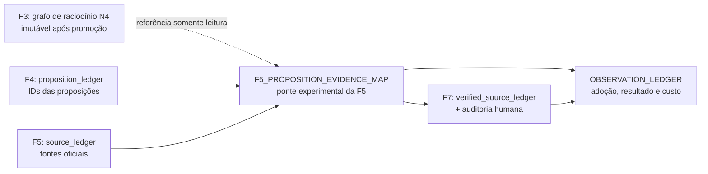

# Consulta IA — PRD — Instrumentação rastreável da FORJA: ponte F4 → F5 → F7 sem reabrir F3

> Cópia de consulta derivada. O documento canônico permanece no caminho de origem indicado abaixo.

## Metadados e rastreabilidade

- **Documento de origem:** `45_PRD_INSTRUMENTACAO_FORJA.md`
- **Tipo:** PRD
- **SHA-256 da origem:** `b84bd796ca66ec87b011650d3fd61996d4666bda3a5c8d1ff00dc94df9216fd9`
- **Linhas da origem:** 521
- **Blocos integralmente indexados:** 45
- **Geração:** 2026-08-10T13:53:35-03:00
- **Cobertura:** 100% das linhas e do texto da origem, sem omissão.
- **Links relativos normalizados:** 0 destino(s), apenas para preservar a navegação na cópia.

## Roteiro de consulta para IA

**Síntese de localização:** Versão: 2.0 — reconstrução Efesto após red team Diabob Protocolo: FORJA-INSTRUMENTACAO-v2 Data: 06/08/2026 Modo: arquitetura e especificação executável Estado: pronto para implementação da Onda 0; este documento não altera produção por si só Parecer adversarial: state/prd45-revisao/PARECERDIABOBCODEX.md

**Termos de recuperação:** não, fonte, grafo, json, hash, f2a, lint, artefato, prd, ponte, severidade, única.

Use o índice abaixo para localizar o bloco pertinente. Cada entrada informa as linhas exatas no documento de origem. Para afirmações materiais, leia o bloco integral e confira o arquivo canônico pelo SHA-256.

## Índice detalhado e cobertura integral

- [SRC-S001 · L1–L20 · PRD — Instrumentação rastreável da FORJA: ponte F4 → F5 → F7 sem reabrir F3](#src-s001)
  - Assuntos: prd, versão, instrumentação, rastreável, ponte, reabrir, reconstrução, efesto
  - Trecho-guia: Versão: 2.0 — reconstrução Efesto após red team Diabob Protocolo: FORJA-INSTRUMENTACAO-v2 Data: 06/08/2026 Modo: arquitetura e especificação executável Estado: pronto para implementação da Onda 0; este documento não altera produção por si só Parecer adversarial: state/prd45-revis
  - SHA-256 do bloco: `b119e9a1f8f459d8f60bb9a74feaedc5fa252cf08e1d6544a0c02f5e5e9ddb01`
  - [SRC-S002 · L21–L45 · 1. Resultado e decisão de produto](#src-s002)
    - Caminho: PRD — Instrumentação rastreável da FORJA: ponte F4 → F5 → F7 sem reabrir F3 > 1. Resultado e decisão de produto
    - Assuntos: resultado, decisão, não, grafo, produto, prospectiva, fonte, severidade
    - Trecho-guia: A FORJA terá uma instrumentação prospectiva única, mas não reescreverá o grafo de raciocínio da F3 depois da pesquisa oficial. A ligação entre proposição e fonte será materializada em artefato próprio da F5, consumível e reconciliável pela F7.
    - SHA-256 do bloco: `4c61287d3575978c97278a48f3ef1697b4faf5ddc6c28dfd87468167ed09e67b`
  - [SRC-S003 · L46–L47 · 2. Evidência de partida, reproduzida em 06/08/2026](#src-s003)
    - Caminho: PRD — Instrumentação rastreável da FORJA: ponte F4 → F5 → F7 sem reabrir F3 > 2. Evidência de partida, reproduzida em 06/08/2026
    - Assuntos: evidência, partida, reproduzida
    - Trecho-guia: Documento de consulta sobre 2. Evidência de partida, reproduzida em 06/08/2026.
    - SHA-256 do bloco: `a9d85f5b731bb79fef70c8155209d32d96c0b8c640610e98ceb64342929ff36e`
    - [SRC-S004 · L48–L74 · 2.1 Grafo N4 de F3](#src-s004)
      - Caminho: PRD — Instrumentação rastreável da FORJA: ponte F4 → F5 → F7 sem reabrir F3 > 2. Evidência de partida, reproduzida em 06/08/2026 > 2.1 Grafo N4 de F3
      - Assuntos: origem, grafo, não, arestas, teses, document, official_source, quantos
      - Trecho-guia: Foram lidos os seis artefatos vigentes em state//n4artifacts/F3REASONINGGRAPH.json.
      - SHA-256 do bloco: `75081c584040f99401c896a73645692f82cf685dfa3cfb351b8999ccec822e3f`
    - [SRC-S005 · L75–L98 · 2.2 F2A](#src-s005)
      - Caminho: PRD — Instrumentação rastreável da FORJA: ponte F4 → F5 → F7 sem reabrir F3 > 2. Evidência de partida, reproduzida em 06/08/2026 > 2.2 F2A
      - Assuntos: não, árvores, f2a, cada, gates, fail, apenas, achado
      - Trecho-guia: A unidade canônica atual é o último artefato de cada caso em state//n4artifacts/F2QUESTIONTREE.json, e não cada cópia em runs/ ou history/.
      - SHA-256 do bloco: `b3cc63f51eaf6f7f90bd8d109b91f9d676edebd42bcfd4f1bc0f6f65ee6eb170`
    - [SRC-S006 · L99–L109 · 2.3 Verificação técnica inicial](#src-s006)
      - Caminho: PRD — Instrumentação rastreável da FORJA: ponte F4 → F5 → F7 sem reabrir F3 > 2. Evidência de partida, reproduzida em 06/08/2026 > 2.3 Verificação técnica inicial
      - Assuntos: verificação, técnica, inicial, aprovados, axi, checks, saúde, contratos
      - Trecho-guia: AXI: 5 de 5 checks de saúde aprovados; contratos F0–F10 carregados e hashados; 95 testes focados aprovados, zero falhas; baseline estrutural do grafo reproduzido; artefato F5LEDGERMATERIAL.json conferido no código real.
      - SHA-256 do bloco: `60ca212ebc54b3a326e10dea12b8c662604f2d34323bdcba80459ec9e5348c42`
  - [SRC-S007 · L110–L124 · 3. Restrições arquiteturais](#src-s007)
    - Caminho: PRD — Instrumentação rastreável da FORJA: ponte F4 → F5 → F7 sem reabrir F3 > 3. Restrições arquiteturais
    - Assuntos: não, fase, são, restrições, arquiteturais, instrumentação, entra, cada
    - Trecho-guia: 1. Cada fase é dona das próprias saídas. Fase posterior não altera artefato aprovado de fase anterior. 2. N3 canônico e N4 candidateshadow não são uma única família de contrato. 3. Durante o piloto, a instrumentação não entra em requiredOutputs nem requiredGates. 4. Artefatos exi
    - SHA-256 do bloco: `d790b289f6dfe76b026781fe5ea1edb213d78687e0330cd3cbebc4f0b9c8f24b`
  - [SRC-S008 · L125–L143 · 4. Arquitetura escolhida](#src-s008)
    - Caminho: PRD — Instrumentação rastreável da FORJA: ponte F4 → F5 → F7 sem reabrir F3 > 4. Arquitetura escolhida
    - Assuntos: map, obs, arquitetura, escolhida, mermaid, flowchart, grafo, raciocínio
    - Trecho-guia: Documento de consulta sobre 4. Arquitetura escolhida.
    - SHA-256 do bloco: `84213cae80fa0f499c3b41268b405e8c09acb88740d91274a099d259ba756b14`
    - [SRC-S009 · L144–L149 · 4.1 O que muda](#src-s009)
      - Caminho: PRD — Instrumentação rastreável da FORJA: ponte F4 → F5 → F7 sem reabrir F3 > 4. Arquitetura escolhida > 4.1 O que muda
      - Assuntos: muda, mapa, passa, produzir, namespace, experimental, liga, cada
      - Trecho-guia: F5 passa a produzir, em namespace experimental, um mapa que liga cada propositionId decisiva às entradas do sourceledger. A F7 reconcilia esse mapa com o verifiedsourceledger e com a auditoria humana do resultado final.
      - SHA-256 do bloco: `f08e066f947aa427fb8ee45e56961ae123fd0977468d9e793b9dcf6999d39d18`
    - [SRC-S010 · L150–L156 · 4.2 O que não muda](#src-s010)
      - Caminho: PRD — Instrumentação rastreável da FORJA: ponte F4 → F5 → F7 sem reabrir F3 > 4. Arquitetura escolhida > 4.2 O que não muda
      - Assuntos: não, muda, f3_reasoning_graph, json, permanece, propriedade, altera, hash
      - Trecho-guia: F3REASONINGGRAPH.json permanece propriedade da F3; F5 não altera hash, updatedAt, producerRunId ou conteúdo de F3; o lint do grafo F3 não recebe autoridade jurídica; o runner canônico continua sem novo output obrigatório durante a observação.
      - SHA-256 do bloco: `cfd952c996a759381650ac8bed0b3b9c2116b675c123fab846a39871336ac7e0`
  - [SRC-S011 · L157–L158 · 5. Contratos novos](#src-s011)
    - Caminho: PRD — Instrumentação rastreável da FORJA: ponte F4 → F5 → F7 sem reabrir F3 > 5. Contratos novos
    - Assuntos: contratos, novos
    - Trecho-guia: Documento de consulta sobre 5. Contratos novos.
    - SHA-256 do bloco: `8f02704b2015e0d8685abe9fa18a7ff1b77cad7dd365ba736c27d01016f7b923`
    - [SRC-S012 · L159–L181 · R0 — OBSERVATIONLEDGER.jsonl](#src-s012)
      - Caminho: PRD — Instrumentação rastreável da FORJA: ponte F4 → F5 → F7 sem reabrir F3 > 5. Contratos novos > R0 — OBSERVATIONLEDGER.jsonl
      - Assuntos: jsonl, observation_ledger, caseid, oportunidade, eligible, nondispatchreason, despacho, exige
      - Trecho-guia: Local piloto: state/caseId/instrumentation/OBSERVATIONLEDGER.jsonl.
      - SHA-256 do bloco: `ad3319759b496b5466775aff588032d3e9eb79745c6f5f65d75ebc0517a7eac5`
    - [SRC-S013 · L182–L223 · R1 — F5PROPOSITIONEVIDENCEMAP.json](#src-s013)
      - Caminho: PRD — Instrumentação rastreável da FORJA: ponte F4 → F5 → F7 sem reabrir F3 > 5. Contratos novos > R1 — F5PROPOSITIONEVIDENCEMAP.json
      - Assuntos: json, hash, f5_proposition_evidence_map, caseid, artifactid, proposition_ledger, sha256, source_ledger
      - Trecho-guia: Local piloto: state/caseId/instrumentation/F5PROPOSITIONEVIDENCEMAP.json.
      - SHA-256 do bloco: `1d1ec927a322718c0d5465780015b145bdffb8e287dfc007246312aad31a964e`
    - [SRC-S014 · L224–L240 · R2 — lint de evidência pós-F5](#src-s014)
      - Caminho: PRD — Instrumentação rastreável da FORJA: ponte F4 → F5 → F7 sem reabrir F3 > 5. Contratos novos > R2 — lint de evidência pós-F5
      - Assuntos: instrumento, lint, não, evidência, pós-f5, código, piloto, decisiva
      - Trecho-guia: “P0 do instrumento” impede creditar a observação; durante o piloto não bloqueia a fase canônica. Promoção futura decide se algum código entra em contrato.
      - SHA-256 do bloco: `c8b8045302696f349d08c76886328238d867204601dba6aba8b9c6b3216fdaf0`
    - [SRC-S015 · L241–L259 · R3 — lint estrutural do grafo F3](#src-s015)
      - Caminho: PRD — Instrumentação rastreável da FORJA: ponte F4 → F5 → F7 sem reabrir F3 > 5. Contratos novos > R3 — lint estrutural do grafo F3
      - Assuntos: lint, grafo, estrutural, código, grafo-01, tese, entrada, fonte
      - Trecho-guia: O lint original é preservado, mas separado de D2:
      - SHA-256 do bloco: `ee7c3f23ce0a9f1c99eefb982d5b1974364671541549cc67c15f0d77406f8088`
    - [SRC-S016 · L260–L272 · R4 — ontologia sem reescrita histórica](#src-s016)
      - Caminho: PRD — Instrumentação rastreável da FORJA: ponte F4 → F5 → F7 sem reabrir F3 > 5. Contratos novos > R4 — ontologia sem reescrita histórica
      - Assuntos: ontologia, reescrita, histórica, document, não, vocabulário, proposto, novos
      - Trecho-guia: Vocabulário proposto para novos grafos: document, officialsource, fact, event, rule, thesis, request, decision, inference e gap.
      - SHA-256 do bloco: `4727145dc3ac6cebf26ce93ffbd34ebf45f16dcc9249803633eb362e134d52f1`
  - [SRC-S017 · L273–L274 · 6. Correção obrigatória do F2A](#src-s017)
    - Caminho: PRD — Instrumentação rastreável da FORJA: ponte F4 → F5 → F7 sem reabrir F3 > 6. Correção obrigatória do F2A
    - Assuntos: correção, obrigatória, f2a
    - Trecho-guia: Documento de consulta sobre 6. Correção obrigatória do F2A.
    - SHA-256 do bloco: `40ba8441a840c3dba9985f645f9a3db0eb49b8e72be51afff19469d815fee963`
    - [SRC-S018 · L275–L296 · R5 — severidade única nos dois caminhos do runner](#src-s018)
      - Caminho: PRD — Instrumentação rastreável da FORJA: ponte F4 → F5 → F7 sem reabrir F3 > 6. Correção obrigatória do F2A > R5 — severidade única nos dois caminhos do runner
      - Assuntos: severidade, única, dois, achado, árvore, caminhos, runner, validação
      - Trecho-guia: achado P0 bloqueia a validação e o gate; achado P1 permanece no laudo e não interrompe promoção; achado sem severidade é tratado como P0; código novo não mapeado preserva sua severidade, em vez de virar fail por desconhecimento; a função que seleciona bloqueantes é única e reutil
      - SHA-256 do bloco: `ebc8ae31baa6a987fb75d94ee27f0a4368a4aaadba00015642d794917fb5d334`
  - [SRC-S019 · L297–L315 · 7. As seis disciplinas, sem segunda fonte normativa](#src-s019)
    - Caminho: PRD — Instrumentação rastreável da FORJA: ponte F4 → F5 → F7 sem reabrir F3 > 7. As seis disciplinas, sem segunda fonte normativa
    - Assuntos: fonte, decisões, não, material, antes, json, ids, seis
    - Trecho-guia: D3 é sempre provisória, roda depois de F1 e nunca bloqueia por silêncio humano. D4 não expõe IDs internos no e-mail; o mapa interno prova a ponte F7 → F9. D5 só vale no evento real de pré-despacho, não em “troca de contexto” genérica. D6 começa pelas quatro decisões resolvidas na
    - SHA-256 do bloco: `75eca40e14b1adfebfec67bb92a774bd98784be198583fbdbce6b2f4055d5a1b`
  - [SRC-S020 · L316–L317 · 8. Itens preservados fora do caminho crítico](#src-s020)
    - Caminho: PRD — Instrumentação rastreável da FORJA: ponte F4 → F5 → F7 sem reabrir F3 > 8. Itens preservados fora do caminho crítico
    - Assuntos: itens, preservados, fora, caminho, crítico
    - Trecho-guia: Documento de consulta sobre 8. Itens preservados fora do caminho crítico.
    - SHA-256 do bloco: `aa65ab0ab161b5f48148e1d4937947e209232592afb343080a6ea7ab7c377cc6`
    - [SRC-S021 · L318–L324 · R6 — stopreason](#src-s021)
      - Caminho: PRD — Instrumentação rastreável da FORJA: ponte F4 → F5 → F7 sem reabrir F3 > 8. Itens preservados fora do caminho crítico > R6 — stopreason
      - Assuntos: stopreason, stop_reason, recibo, editorial, deve, ser, gravado, após
      - Trecho-guia: O recibo editorial deve ser gravado após o retorno do envelope e antes de parse, fidelidade ou exceção. Sucesso, ausência do campo, saída inválida e divergência de modelo terão testes próprios. R6 é observabilidade independente e não recebe crédito causal por D1–D6.
      - SHA-256 do bloco: `00778ee837b2d69a44024b9aa7126f54b4dadb3df17a39d9528c076361353af4`
    - [SRC-S022 · L325–L330 · R7 — classificador semântico de instruções rejeitado](#src-s022)
      - Caminho: PRD — Instrumentação rastreável da FORJA: ponte F4 → F5 → F7 sem reabrir F3 > 8. Itens preservados fora do caminho crítico > R7 — classificador semântico de instruções rejeitado
      - Assuntos: classificador, semântico, instruções, rejeitado, específico, permanece, rejeitada, criação
      - Trecho-guia: Permanece rejeitada a criação de classificador que decida automaticamente núcleo comum, específico Codex e específico Claude. Ferramenta futura pode calcular hash e diff, nunca classificar mérito sem nova decisão.
      - SHA-256 do bloco: `a6a07721677ed1cddaaab4ef74c48349c2a4f2fc40da5ceada46bfaeb5d4c776`
    - [SRC-S023 · L331–L336 · R8 — descoberta entre famílias](#src-s023)
      - Caminho: PRD — Instrumentação rastreável da FORJA: ponte F4 → F5 → F7 sem reabrir F3 > 8. Itens preservados fora do caminho crítico > R8 — descoberta entre famílias
      - Assuntos: descoberta, famílias, skill, automático, manual, depois, disciplina, possuir
      - Trecho-guia: Depois de a disciplina possuir produtor, consumidor e artefato estáveis, o AGENTS.md aplicável registra skill, caminho, gatilho, modo automático/manual e fonte prevalente. Skill manual não é anunciada como disparo automático.
      - SHA-256 do bloco: `d6e1a47be890c908a4c16ac35db5effd58d0870e4e57c101d92b4b150fd1a231`
  - [SRC-S024 · L337–L338 · 9. Ondas de execução](#src-s024)
    - Caminho: PRD — Instrumentação rastreável da FORJA: ponte F4 → F5 → F7 sem reabrir F3 > 9. Ondas de execução
    - Assuntos: ondas, execução
    - Trecho-guia: Documento de consulta sobre 9. Ondas de execução.
    - SHA-256 do bloco: `1537209107c01e15d576e3f27755cf0a336f4a26a38268cd4484c93146ad5a21`
    - [SRC-S025 · L339–L349 · Onda 0 — coerência do gate e instrumentos](#src-s025)
      - Caminho: PRD — Instrumentação rastreável da FORJA: ponte F4 → F5 → F7 sem reabrir F3 > 9. Ondas de execução > Onda 0 — coerência do gate e instrumentos
      - Assuntos: instrumentos, onda, coerência, gate, implementar, seus, testes, dois
      - Trecho-guia: 1. implementar R5 e seus testes nos dois caminhos do runner; 2. congelar baseline canônico por caso, sem contar cópias históricas; 3. escrever schemas de R0 e R1; 4. criar os quatro registros de decisão desta versão; 5. manter toda instrumentação fora dos contratos obrigatórios.
      - SHA-256 do bloco: `2cd4a1c953bbdb06cac3e299d625d2cf0a272bff7b8d483aff83254a2504086b`
    - [SRC-S026 · L350–L360 · Onda 1 — fatia vertical D2](#src-s026)
      - Caminho: PRD — Instrumentação rastreável da FORJA: ponte F4 → F5 → F7 sem reabrir F3 > 9. Ondas de execução > Onda 1 — fatia vertical D2
      - Assuntos: onda, fatia, vertical, oportunidades, elegíveis, executar, byte, registrar
      - Trecho-guia: 1. registrar todas as oportunidades F5 elegíveis; 2. produzir o mapa de proposição-evidência; 3. executar EVID-01 a EVID-07; 4. reconciliar com F7 e auditor humano; 5. executar caso bom, fonte trocada e hash adulterado.
      - SHA-256 do bloco: `669921b566249fd51241489ae0fa0046e43692226ae94209f96afaf260f236bb`
    - [SRC-S027 · L361–L367 · Onda 2 — disciplinas independentes](#src-s027)
      - Caminho: PRD — Instrumentação rastreável da FORJA: ponte F4 → F5 → F7 sem reabrir F3 > 9. Ondas de execução > Onda 2 — disciplinas independentes
      - Assuntos: onda, disciplinas, independentes, pilotar, separadamente, entra, último, somente
      - Trecho-guia: Pilotar D1, D4, D5 e D6 separadamente. D3 entra por último, somente depois de o F2A estar estável e sempre como hipótese provisória.
      - SHA-256 do bloco: `ea25ea2b5e0783c1aec51b23593d961595132d6a030610db645ae7dc8af8b3b7`
    - [SRC-S028 · L368–L373 · Onda 3 — observação prospectiva](#src-s028)
      - Caminho: PRD — Instrumentação rastreável da FORJA: ponte F4 → F5 → F7 sem reabrir F3 > 9. Ondas de execução > Onda 3 — observação prospectiva
      - Assuntos: onda, observação, prospectiva, dez, oportunidades, não, rodar, dias
      - Trecho-guia: Rodar por 30 dias. Uma disciplina só recebe leitura exploratória quando acumular pelo menos dez oportunidades elegíveis; abaixo disso o resultado é inconclusivo. Dez oportunidades não provam eficácia causal e não substituem o ciclo AR.
      - SHA-256 do bloco: `de8d0e0667fc72d22fdc0e3ac29ede77eb46bd5005c6d71d7a39021dc27a088b`
    - [SRC-S029 · L374–L380 · Onda 4 — promoção individual](#src-s029)
      - Caminho: PRD — Instrumentação rastreável da FORJA: ponte F4 → F5 → F7 sem reabrir F3 > 9. Ondas de execução > Onda 4 — promoção individual
      - Assuntos: promoção, onda, individual, cada, disciplina, recebe, promover, continuar_estudo
      - Trecho-guia: Cada disciplina recebe promover, continuarestudo ou retirar. Promoção para N4 candidateshadow exige schema, catálogo, contrato F5, consumidor, canários, contraprovas, cobertura humana e rollback. Promoção para N3 canônico é decisão posterior e separada; não ocorre por consequênci
      - SHA-256 do bloco: `e07f5d95728ad2ffbb83c1db444ba114d9e69fd1e30d59bf89fec370348fbabe`
  - [SRC-S030 · L381–L385 · 10. Métricas](#src-s030)
    - Caminho: PRD — Instrumentação rastreável da FORJA: ponte F4 → F5 → F7 sem reabrir F3 > 10. Métricas
    - Assuntos: métricas, três, colunas, independentes, adoção, resultado, material, custo
    - Trecho-guia: Três colunas independentes: adoção, resultado material e custo. Uma não compensa a outra.
    - SHA-256 do bloco: `b94adc4bc78373296c747149d04afeb438b54e867e6a5837312de87bf9b710eb`
    - [SRC-S031 · L386–L393 · 10.1 Fórmulas comuns](#src-s031)
      - Caminho: PRD — Instrumentação rastreável da FORJA: ponte F4 → F5 → F7 sem reabrir F3 > 10. Métricas > 10.1 Fórmulas comuns
      - Assuntos: n_eligible, fórmulas, comuns, não, adoção, n_consumed, disparo, n_non_dispatch
      - Trecho-guia: adoção = Nconsumed / Neligible; não disparo = Nnondispatch / Neligible; cobertura humana = Nhumanaudited / Neligible; custo = mediana e maior valor de minutos por oportunidade; denominador zero = não aplicável, nunca 100%.
      - SHA-256 do bloco: `077439e571073989772073d61687a808c4f8847672e0770ad91f2a265ed7a71c`
    - [SRC-S032 · L394–L404 · 10.2 D2](#src-s032)
      - Caminho: PRD — Instrumentação rastreável da FORJA: ponte F4 → F5 → F7 sem reabrir F3 > 10. Métricas > 10.2 D2
      - Assuntos: proposição, mede, coluna, medida, adoção, proposições, decisivas, link
      - Trecho-guia: EVID-01 mede cobertura. GRAFO-01 mede preenchimento de F3. Nenhum dos dois, isoladamente, conta como melhora jurídica.
      - SHA-256 do bloco: `0a59573924f687a5cf22e144ad14fc2b4a7b36f637652608c3fd69fd8d108f97`
    - [SRC-S033 · L405–L416 · 10.3 Critério de reabertura de ponderação](#src-s033)
      - Caminho: PRD — Instrumentação rastreável da FORJA: ponte F4 → F5 → F7 sem reabrir F3 > 10. Métricas > 10.3 Critério de reabertura de ponderação
      - Assuntos: ponderação, critério, reabertura, arestas, forem, menos, não, permanece
      - Trecho-guia: A ponderação de arestas permanece suspensa. Só pode ser rediscutida se, nos grafos vigentes:
      - SHA-256 do bloco: `a6dcd4fb8ec8136061cebed6f485f40cd018e6a8e6cd57973efd010272dc5c75`
  - [SRC-S034 · L417–L418 · 11. Plano de testes](#src-s034)
    - Caminho: PRD — Instrumentação rastreável da FORJA: ponte F4 → F5 → F7 sem reabrir F3 > 11. Plano de testes
    - Assuntos: plano, testes
    - Trecho-guia: Documento de consulta sobre 11. Plano de testes.
    - SHA-256 do bloco: `06eb8d02b11a0bad61450057c664a099a737313c174733e4707a087bc60a5981`
    - [SRC-S035 · L419–L427 · 11.1 F2A](#src-s035)
      - Caminho: PRD — Instrumentação rastreável da FORJA: ponte F4 → F5 → F7 sem reabrir F3 > 11. Plano de testes > 11.1 F2A
      - Assuntos: bloqueia, f2a, diversidade, não, validação, inicial, recomputação, dois
      - Trecho-guia: 1. P1 de diversidade não bloqueia na validação inicial; 2. P1 de diversidade não bloqueia na recomputação; 3. P0 bloqueia nos dois caminhos; 4. severidade ausente falha fechada; 5. oito artefatos atuais P1-only passam em regressão nominada; 6. árvore legítima e sabotagens existen
      - SHA-256 do bloco: `2312502d8fb24865891858b0b93d66cda2d07a451f5abeb907d1c2382a886526`
    - [SRC-S036 · L428–L438 · 11.2 Ponte F4 → F5 → F7](#src-s036)
      - Caminho: PRD — Instrumentação rastreável da FORJA: ponte F4 → F5 → F7 sem reabrir F3 > 11. Plano de testes > 11.2 Ponte F4 → F5 → F7
      - Assuntos: reprova, ponte, desconhecida, hash, fonte, válido, não, propositionid
      - Trecho-guia: 1. propositionId desconhecida reprova; 2. sourceId desconhecida reprova; 3. hash de fonte divergente reprova; 4. fonte trocada entre precedentes reprova; 5. proposição bloqueada com motivo válido não é falsa cobertura; 6. consumidor com hash diferente não conta como exposição; 7.
      - SHA-256 do bloco: `03b73b4ed074aba1d582d0d1dc556a4afd127d295e916bec4d9aad495a2bd56f`
    - [SRC-S037 · L439–L446 · 11.3 Observação](#src-s037)
      - Caminho: PRD — Instrumentação rastreável da FORJA: ponte F4 → F5 → F7 sem reabrir F3 > 11. Plano de testes > 11.3 Observação
      - Assuntos: não, observação, oportunidade, inelegível, permanece, censo, disparo, exige
      - Trecho-guia: 1. oportunidade inelegível permanece no censo; 2. não disparo exige motivo; 3. replay não duplica evento; 4. denominador zero produz não aplicável; 5. falha do instrumento não vira resultado verde.
      - SHA-256 do bloco: `5dd148fc45d8533443c948bfbcbf2a297413d15540c77a0ec2d9f88d22676db4`
    - [SRC-S038 · L447–L453 · 11.4 Grafo F3](#src-s038)
      - Caminho: PRD — Instrumentação rastreável da FORJA: ponte F4 → F5 → F7 sem reabrir F3 > 11. Plano de testes > 11.4 Grafo F3
      - Assuntos: grafo, baseline, real, reproduz, grafo-01, sintético, completo, passa
      - Trecho-guia: 1. baseline real reproduz 8 GRAFO-01; 2. grafo sintético completo passa; 3. nó/aresta pendente, relação inválida e sustentação sem escopo reprovam; 4. vocabulário legado avisa sem reescrever arquivo.
      - SHA-256 do bloco: `67956341bfa2518d850e6aa0d1cf9ec5d94007ac5ca18ea7a4ddb0c87841c751`
  - [SRC-S039 · L454–L455 · 12. Rollout, rollback e observabilidade](#src-s039)
    - Caminho: PRD — Instrumentação rastreável da FORJA: ponte F4 → F5 → F7 sem reabrir F3 > 12. Rollout, rollback e observabilidade
    - Assuntos: rollout, rollback, observabilidade
    - Trecho-guia: Documento de consulta sobre 12. Rollout, rollback e observabilidade.
    - SHA-256 do bloco: `423e856900763f13151693890f2c38f9311404efca0499120625b11b00476bcb`
    - [SRC-S040 · L456–L462 · Rollout](#src-s040)
      - Caminho: PRD — Instrumentação rastreável da FORJA: ponte F4 → F5 → F7 sem reabrir F3 > 12. Rollout, rollback e observabilidade > Rollout
      - Assuntos: rollout, observe, feature, namespace, único, instrumentation, mode, off
      - Trecho-guia: feature namespace único: instrumentation.mode = off|observe|candidateshadow; início obrigatório em observe; seleção de casos explícita e registrada; nenhum gate canônico novo antes da Onda 4.
      - SHA-256 do bloco: `822ba21afa964cbd6be431f70df0537608e87a8776b4a9e456f95a2055191978`
    - [SRC-S041 · L463–L473 · Rollback](#src-s041)
      - Caminho: PRD — Instrumentação rastreável da FORJA: ponte F4 → F5 → F7 sem reabrir F3 > 12. Rollout, rollback e observabilidade > Rollback
      - Assuntos: rollback, não, definir, instrumentation, mode, off, parar, novos
      - Trecho-guia: 1. definir instrumentation.mode=off; 2. parar novos sidecars sem apagar os existentes; 3. confirmar que contratos N3 e hashes F3 permanecem inalterados; 4. preservar ledger, canários e reason codes da falha; 5. reexecutar health e regressão do subsistema afetado.
      - SHA-256 do bloco: `27bceb239117a7c8e729a4f615f2dbd6aacb1eeb488950240de8b697ae3dcd52`
  - [SRC-S042 · L474–L487 · 13. Riscos e controles](#src-s042)
    - Caminho: PRD — Instrumentação rastreável da FORJA: ponte F4 → F5 → F7 sem reabrir F3 > 13. Riscos e controles
    - Assuntos: não, riscos, controles, próprio, seleção, risco, controle, arestas
    - Trecho-guia: Documento de consulta sobre 13. Riscos e controles.
    - SHA-256 do bloco: `cba1ab1941554d10a292e7785f150367e644778e56ae430d74a070f39721a608`
  - [SRC-S043 · L488–L500 · 14. Fora do escopo](#src-s043)
    - Caminho: PRD — Instrumentação rastreável da FORJA: ponte F4 → F5 → F7 sem reabrir F3 > 14. Fora do escopo
    - Assuntos: fora, escopo, grafo, atos, processuais, ponderação, arestas, reescrita
    - Trecho-guia: grafo de atos processuais M3; ponderação de arestas; reescrita de grafos históricos; classificador semântico de instruções; RAG ou LLM-as-judge como gate jurídico; refatoração física P-J01 a P-J06 da arquitetura v4; promoção direta a contrato N3; envio, protocolo ou alteração de 
    - SHA-256 do bloco: `6417920b1e33d7b80ad8c7cb98a99e91e6eb420ce8a0a952f4e7d929250040f5`
  - [SRC-S044 · L501–L516 · 15. Critério de conclusão do PRD](#src-s044)
    - Caminho: PRD — Instrumentação rastreável da FORJA: ponte F4 → F5 → F7 sem reabrir F3 > 15. Critério de conclusão do PRD
    - Assuntos: prd, critério, conclusão, esta, implementação, não, onda, testes
    - Trecho-guia: Esta especificação está pronta para implementação quando:
    - SHA-256 do bloco: `82b65411da229563bb62feb2d726449a9eded4f2addd1047390d266e3557453b`
  - [SRC-S045 · L517–L521 · 16. Próxima ação única](#src-s045)
    - Caminho: PRD — Instrumentação rastreável da FORJA: ponte F4 → F5 → F7 sem reabrir F3 > 16. Próxima ação única
    - Assuntos: próxima, ação, única, implementar, onda, entrega, curta, corrigir
    - Trecho-guia: Implementar a Onda 0 em uma entrega curta: corrigir a semântica P0/P1 nos dois caminhos do F2A, congelar o baseline canônico por caso e adicionar os schemas de R0/R1 sem integrar disciplina ou gate novo à produção.
    - SHA-256 do bloco: `ee9f5c2f0aaa36590843647aa4cd5b2ac2df39c62fbe18b0289c3418cc105f7e`

## Conteúdo integral indexado

Os marcadores HTML abaixo são apenas âncoras de navegação. O texto reproduz integralmente a origem normalizada em UTF-8; somente destinos de links relativos podem ter sido recalculados para apontar ao mesmo arquivo a partir desta pasta.

<a id="src-s001"></a>

# PRD — Instrumentação rastreável da FORJA: ponte F4 → F5 → F7 sem reabrir F3

**Versão:** 2.0 — reconstrução Efesto após red team Diabob
**Protocolo:** `FORJA-INSTRUMENTACAO-v2`
**Data:** 06/08/2026
**Modo:** arquitetura e especificação executável
**Estado:** pronto para implementação da Onda 0; este documento não altera produção por si só
**Parecer adversarial:** `state/prd45-revisao/PARECER_DIABOB_CODEX.md`

**Substitui normativamente:**

- a versão 1.0 deste PRD;
- `43_PRD_GRAFOS_PONDERADOS.md`;
- `44_PRD_SKILLS_DISCIPLINAS_PROCESSO.md`.

Os documentos substituídos permanecem históricos. Nenhum requisito necessário à
execução desta versão depende de consultá-los.

---


<a id="src-s002"></a>

## 1. Resultado e decisão de produto

A FORJA terá uma instrumentação prospectiva única, mas não reescreverá o grafo de
raciocínio da F3 depois da pesquisa oficial. A ligação entre proposição e fonte
será materializada em artefato próprio da F5, consumível e reconciliável pela F7.

A ordem obrigatória é:

1. corrigir a incoerência de severidade do F2A sem enfraquecer P0;
2. instalar o ledger de observação e os schemas experimentais;
3. executar uma fatia vertical D2, de F4 a F7;
4. pilotar as demais disciplinas individualmente;
5. executar o lint do grafo F3 como diagnóstico estrutural separado;
6. promover somente a disciplina que passar por evidência prospectiva, canários,
   revisão humana e ciclo AR.

Quatro decisões antes abertas ficam resolvidas nesta versão:

| Tema | Decisão v2 |
| --- | --- |
| Severidade F2A | P0 bloqueia; P1 informa. A mesma regra vale nos dois caminhos do runner. |
| D2 ↔ grafo | F5 não altera `F3_REASONING_GRAPH.json`; cria ponte própria. |
| `F5_LEDGER_MATERIAL.json` | legado compatível, congelado e sem escrita de volta; não é fonte canônica nem projeção futura. |
| Métrica estrutural | cobertura de aresta é adoção/proxy, nunca resultado jurídico material. |


<a id="src-s003"></a>

## 2. Evidência de partida, reproduzida em 06/08/2026


<a id="src-s004"></a>

### 2.1 Grafo N4 de F3

Foram lidos os seis artefatos vigentes em
`state/*/n4_artifacts/F3_REASONING_GRAPH.json`.

| Medida | Valor observado |
| --- | ---: |
| grafos | 6 |
| nós | 147 |
| arestas | 49 |
| teses | 20 |
| teses sem entrada `supports`/`justifies` | 8 (40%) |
| arestas sustentadoras cujo alvo é tese | 15 |
| origem `document` | 10 |
| origem `source` | 3 |
| origem `official_fact` | 2 |
| origem `official_source` | 0 |

Há 15 tipos de nó em uso e o schema não fecha o vocabulário. Os 43 nós
`document` possuem apenas `id`, `type` e `sourceArtifact`; o acervo não permite
classificar deterministicamente quantos são peças processuais e quantos escondem
fonte pesquisada sob rótulo errado.

**Interpretação corrigida:** o zero de `official_source` prova ausência de uma
ponte pós-pesquisa dentro do artefato medido. Não prova, sozinho, que a pesquisa
F5 é ignorada operacionalmente, porque o grafo pertence à F3 e nasce antes da F5.


<a id="src-s005"></a>

### 2.2 F2A

A unidade canônica atual é o último artefato de cada caso em
`state/*/n4_artifacts/F2_QUESTION_TREE.json`, e não cada cópia em `runs/` ou
`history/`.

| Medida | Valor observado |
| --- | ---: |
| árvores canônicas atuais | 10 |
| gates `exploration_100_complete=fail` | 10 |
| árvores com apenas achados P1 | 8 |
| árvores sem achado | 0 |

A contagem anterior de 25 arquivos era um snapshot histórico e misturava cópias
da mesma execução. Não será baseline de promoção.

O bloqueio ocorre em duas superfícies do runner:

- validação de `question_tree`, que hoje rejeita qualquer achado;
- recomputação dos gates, que converte códigos P1 não mapeados em `fail`.

O CLI isolado já encerra com falha apenas para P0. A divergência é defeito de
integração, não decisão jurídica pendente.


<a id="src-s006"></a>

### 2.3 Verificação técnica inicial

- AXI: 5 de 5 checks de saúde aprovados;
- contratos F0–F10 carregados e hashados;
- 95 testes focados aprovados, zero falhas;
- baseline estrutural do grafo reproduzido;
- artefato `F5_LEDGER_MATERIAL.json` conferido no código real.

Essas provas validam o diagnóstico e a implementabilidade do plano. Não provam
eficácia jurídica prospectiva.


<a id="src-s007"></a>

## 3. Restrições arquiteturais

1. Cada fase é dona das próprias saídas. Fase posterior não altera artefato
   aprovado de fase anterior.
2. N3 canônico e N4 `candidate_shadow` não são uma única família de contrato.
3. Durante o piloto, a instrumentação não entra em `requiredOutputs` nem
   `requiredGates`.
4. Artefatos existentes não são reescritos para melhorar baseline.
5. Hash, ID, sequência e schema são computáveis; mérito jurídico permanece sob
   auditor humano nominal e fonte.
6. Falha, inelegibilidade e não disparo permanecem no denominador.
7. A instrumentação não entra em DOCX, e-mail ou peça protocolável.
8. Mudança estrutural futura preserva fachadas e segue migração incremental; este
   PRD não executa a refatoração arquitetural v4.


<a id="src-s008"></a>

## 4. Arquitetura escolhida




<a id="src-s009"></a>

### 4.1 O que muda

F5 passa a produzir, em namespace experimental, um mapa que liga cada
`propositionId` decisiva às entradas do `source_ledger`. A F7 reconcilia esse
mapa com o `verified_source_ledger` e com a auditoria humana do resultado final.


<a id="src-s010"></a>

### 4.2 O que não muda

- `F3_REASONING_GRAPH.json` permanece propriedade da F3;
- F5 não altera hash, `updatedAt`, `producerRunId` ou conteúdo de F3;
- o lint do grafo F3 não recebe autoridade jurídica;
- o runner canônico continua sem novo output obrigatório durante a observação.


<a id="src-s011"></a>

## 5. Contratos novos


<a id="src-s012"></a>

### R0 — `OBSERVATION_LEDGER.jsonl`

Local piloto: `state/<caseId>/instrumentation/OBSERVATION_LEDGER.jsonl`.

Campos mínimos por oportunidade:

- `schemaVersion`, `opportunityId`, `caseId`, `disciplineId`;
- `triggerEventId`, `triggerSequence`, `registeredAt`;
- `eligible`, `eligibilityReason`;
- `dispatchEventId`, `nonDispatchReason`;
- `artifactPath`, `artifactSha256`, `consumerEventId`, `consumedSha256`;
- `humanReviewer`, `humanAudit`, `materialOutcome`;
- `costMinutes`, `arExperimentId`.

**Aceite:**

1. o registro nasce antes do despacho;
2. `eligible=false` exige motivo e continua no censo;
3. elegível sem despacho exige `nonDispatchReason`;
4. consumo só conta com hash idêntico e sequência posterior;
5. escrita é append-only e repetição do mesmo evento não duplica oportunidade;
6. falha de gravação da telemetria não promove artefato nem é silenciada.


<a id="src-s013"></a>

### R1 — `F5_PROPOSITION_EVIDENCE_MAP.json`

Local piloto:
`state/<caseId>/instrumentation/F5_PROPOSITION_EVIDENCE_MAP.json`.

Estrutura mínima:

```json
{
  "schemaVersion": 1,
  "caseId": "...",
  "producerPhase": "F5_PESQUISA_OFICIAL",
  "producerRunId": "...",
  "propositionLedger": {"artifactId": "proposition_ledger", "sha256": "..."},
  "sourceLedger": {"artifactId": "source_ledger", "sha256": "..."},
  "links": [
    {
      "linkId": "...",
      "propositionId": "...",
      "sourceId": "...",
      "relation": "supports",
      "sourceLocator": "...",
      "archivedSourceSha256": "...",
      "reviewStatus": "pending_human_review"
    }
  ],
  "blockedPropositions": []
}
```

Relações permitidas: `supports`, `qualifies`, `contradicts` e `does_not_reach`.

**Aceite:**

1. todo `propositionId` existe no `proposition_ledger` hashado;
2. todo `sourceId` existe no `source_ledger` hashado;
3. fonte arquivada declarada tem hash recomputável;
4. proposição decisiva sem link tem bloqueio nominal e motivo;
5. troca de fonte, verbatim ou hash entre precedentes é detectada;
6. o hash de `F3_REASONING_GRAPH.json` antes e depois da F5 é idêntico;
7. o mapa não escreve de volta nos ledgers de F4/F5.


<a id="src-s014"></a>

### R2 — lint de evidência pós-F5

O lint da ponte emite:

| Código | Verificação | Piloto |
| --- | --- | --- |
| `EVID-01` | proposição decisiva sem link nem bloqueio | P1 |
| `EVID-02` | `propositionId` inexistente | P0 do instrumento |
| `EVID-03` | `sourceId` inexistente | P0 do instrumento |
| `EVID-04` | hash da fonte arquivada não confere | P0 do instrumento |
| `EVID-05` | vínculo consumido com hash diferente do produzido | P0 do instrumento |
| `EVID-06` | relação fora do vocabulário | P0 do instrumento |
| `EVID-07` | fonte decisiva não chega ao `verified_source_ledger` de F7 | P1 até calibrar |

“P0 do instrumento” impede creditar a observação; durante o piloto não bloqueia
a fase canônica. Promoção futura decide se algum código entra em contrato.


<a id="src-s015"></a>

### R3 — lint estrutural do grafo F3

O lint original é preservado, mas separado de D2:

| Código | Verificação | Significado |
| --- | --- | --- |
| `GRAFO-01` | tese sem entrada `supports`/`justifies` | rastreabilidade pré-pesquisa incompleta |
| `GRAFO-02` | nó de fonte isolado | catálogo não ligado dentro de F3 |
| `GRAFO-03` | pedido sem tese justificadora | pedido sem caminho registrado |
| `GRAFO-04` | única entrada é restritiva | restrição sem sustentação registrada |
| `GRAFO-05` | tipo fora da ontologia | divergência vocabular |
| `GRAFO-06` | densidade | telemetria informativa |

`GRAFO-07` da v1 é retirado. Exigir fonte oficial em artefato produzido antes da
pesquisa oficial confunde ordem de fase com qualidade.

Enquanto não existir elo confiável entre texto final e nós F3, `GRAFO-01` é P2
informativo. Nenhum código do grafo bloqueia produção neste PRD.


<a id="src-s016"></a>

### R4 — ontologia sem reescrita histórica

Vocabulário proposto para novos grafos:
`document`, `official_source`, `fact`, `event`, `rule`, `thesis`, `request`,
`decision`, `inference` e `gap`.

Valores legados (`source`, `official_fact`, `strategy`, `coverage`,
`calculation`) permanecem legíveis e geram aviso. Migração em memória pode
normalizar consulta; arquivo histórico não é alterado.

O mapeamento só é aprovado depois de classificar a proveniência dos 43 nós
`document` por registro de origem verificável. `sourceArtifact` isolado não basta.


<a id="src-s017"></a>

## 6. Correção obrigatória do F2A


<a id="src-s018"></a>

### R5 — severidade única nos dois caminhos do runner

Regra:

- achado P0 bloqueia a validação e o gate;
- achado P1 permanece no laudo e não interrompe promoção;
- achado sem severidade é tratado como P0;
- código novo não mapeado preserva sua severidade, em vez de virar `fail` por
  desconhecimento;
- a função que seleciona bloqueantes é única e reutilizada pela validação do
  artefato e pela recomputação do gate.

**Aceite:**

1. as oito árvores canônicas atuais com somente P1 atravessam os dois pontos;
2. as árvores com P0 continuam reprovadas;
3. árvore sintética legítima passa;
4. formulário repetitivo e árvore sem lacuna continuam acusados como P1;
5. árvore com 99 perguntas, fato sem `supportIds` ou protocolo inválido continua
   bloqueada;
6. o laudo preserva código, severidade e detalhe de cada P1.


<a id="src-s019"></a>

## 7. As seis disciplinas, sem segunda fonte normativa

| ID | Gatilho e produtor | Saída piloto | Consumidor | Adoção verificável | Resultado material | Canário decisivo |
| --- | --- | --- | --- | --- | --- | --- |
| D1 | antes do despacho de conselho F4 | briefing com perguntas, fontes, restrições e decisões rejeitadas | revisor do conselho | ordem por evento e hash consumido | omissão material ou proposta rejeitada reapresentada | retirar uma fonte ou pergunta obrigatória |
| D2 | cada `propositionId` decisiva em F5 | `F5_PROPOSITION_EVIDENCE_MAP.json` | F7 | vínculo válido e consumido | correções de atribuição, verbatim, *pincite*, vigência ou relevância | trocar a fonte entre dois precedentes |
| D3 | depois de F1, com duas linhas materiais abertas | `F2_INTAKE_HYPOTHESES.json` | F2A/F4 | IDs e estados provisórios resolvíveis | hipótese contradita reaberta, não congelada | fonte posterior contradiz hipótese escolhida |
| D4 | antes do fechamento F7 | `F7_UNCERTAIN_DECISIONS.json` + mapa F9 | F9 | IDs conciliados e trecho localizado | item gera decisão, diligência ou correção humana | dúvida retrospectiva fabricada |
| D5 | antes do despacho de revisão cruzada | `HANDOFF.md` + recibo | revisor cruzado | mesmo hash recebido | tempo de reconstrução, perguntas de identidade e erro de retomada | remover armadilha material do caso |
| D6 | quando decisão de arquitetura/processo é tomada | ficha em `decisoes/` | manutenção e novas propostas | ID, status, fonte e reabertura válidos | proposta rejeitada reaparece sem fato novo | remover critério de reabertura |

Regras específicas:

- D3 é sempre provisória, roda depois de F1 e nunca bloqueia por silêncio humano.
- D4 não expõe IDs internos no e-mail; o mapa interno prova a ponte F7 → F9.
- D5 só vale no evento real de pré-despacho, não em “troca de contexto” genérica.
- D6 começa pelas quatro decisões resolvidas na § 1. Migração massiva das decisões
  históricas não bloqueia a fatia D2.


<a id="src-s020"></a>

## 8. Itens preservados fora do caminho crítico


<a id="src-s021"></a>

### R6 — `stop_reason`

O recibo editorial deve ser gravado após o retorno do envelope e antes de parse,
fidelidade ou exceção. Sucesso, ausência do campo, saída inválida e divergência de
modelo terão testes próprios. R6 é observabilidade independente e não recebe
crédito causal por D1–D6.


<a id="src-s022"></a>

### R7 — classificador semântico de instruções rejeitado

Permanece rejeitada a criação de classificador que decida automaticamente núcleo
comum, específico Codex e específico Claude. Ferramenta futura pode calcular hash
e diff, nunca classificar mérito sem nova decisão.


<a id="src-s023"></a>

### R8 — descoberta entre famílias

Depois de a disciplina possuir produtor, consumidor e artefato estáveis, o
`AGENTS.md` aplicável registra skill, caminho, gatilho, modo automático/manual e
fonte prevalente. Skill manual não é anunciada como disparo automático.


<a id="src-s024"></a>

## 9. Ondas de execução


<a id="src-s025"></a>

### Onda 0 — coerência do gate e instrumentos

1. implementar R5 e seus testes nos dois caminhos do runner;
2. congelar baseline canônico por caso, sem contar cópias históricas;
3. escrever schemas de R0 e R1;
4. criar os quatro registros de decisão desta versão;
5. manter toda instrumentação fora dos contratos obrigatórios.

**Saída:** oito casos P1-only desobstruídos, P0 preservado e instrumentos
parseáveis. Nenhuma disciplina integrada ainda.


<a id="src-s026"></a>

### Onda 1 — fatia vertical D2

1. registrar todas as oportunidades F5 elegíveis;
2. produzir o mapa de proposição-evidência;
3. executar `EVID-01` a `EVID-07`;
4. reconciliar com F7 e auditor humano;
5. executar caso bom, fonte trocada e hash adulterado.

**Saída:** três oportunidades elegíveis completas ou declaração de denominador
insuficiente. F3 permanece byte a byte idêntica.


<a id="src-s027"></a>

### Onda 2 — disciplinas independentes

Pilotar D1, D4, D5 e D6 separadamente. D3 entra por último, somente depois de o
F2A estar estável e sempre como hipótese provisória.

**Saída:** três oportunidades assistidas por disciplina, canário e contraprova.


<a id="src-s028"></a>

### Onda 3 — observação prospectiva

Rodar por 30 dias. Uma disciplina só recebe leitura exploratória quando acumular
pelo menos dez oportunidades elegíveis; abaixo disso o resultado é inconclusivo.
Dez oportunidades não provam eficácia causal e não substituem o ciclo AR.


<a id="src-s029"></a>

### Onda 4 — promoção individual

Cada disciplina recebe `promover`, `continuar_estudo` ou `retirar`. Promoção para
N4 `candidate_shadow` exige schema, catálogo, contrato F5, consumidor, canários,
contraprovas, cobertura humana e rollback. Promoção para N3 canônico é decisão
posterior e separada; não ocorre por consequência automática deste PRD.


<a id="src-s030"></a>

## 10. Métricas

Três colunas independentes: adoção, resultado material e custo. Uma não compensa
a outra.


<a id="src-s031"></a>

### 10.1 Fórmulas comuns

- adoção = `N_consumed / N_eligible`;
- não disparo = `N_non_dispatch / N_eligible`;
- cobertura humana = `N_human_audited / N_eligible`;
- custo = mediana e maior valor de minutos por oportunidade;
- denominador zero = `não aplicável`, nunca 100%.


<a id="src-s032"></a>

### 10.2 D2

| Coluna | Medida |
| --- | --- |
| adoção | proposições decisivas com link ou bloqueio válido; hashes produzidos/consumidos iguais |
| resultado material | correções humanas em atribuição, verbatim, *pincite*, vigência e relevância por proposição auditada |
| custo | minutos por proposição elegível, incluindo urgências e não disparos |

`EVID-01` mede cobertura. `GRAFO-01` mede preenchimento de F3. Nenhum dos dois,
isoladamente, conta como melhora jurídica.


<a id="src-s033"></a>

### 10.3 Critério de reabertura de ponderação

A ponderação de arestas permanece suspensa. Só pode ser rediscutida se, nos
grafos vigentes:

- teses sem entrada sustentadora forem menos de 10%;
- mediana de arestas sustentadoras por tese for pelo menos 3;
- e a ontologia estiver fechada com proveniência dos nós classificada.

Mesmo quando esses pisos forem atingidos, ausência de campo não produz peso e
documento dos autos não recebe salvo-conduto automático.


<a id="src-s034"></a>

## 11. Plano de testes


<a id="src-s035"></a>

### 11.1 F2A

1. P1 de diversidade não bloqueia na validação inicial;
2. P1 de diversidade não bloqueia na recomputação;
3. P0 bloqueia nos dois caminhos;
4. severidade ausente falha fechada;
5. oito artefatos atuais P1-only passam em regressão nominada;
6. árvore legítima e sabotagens existentes continuam discriminadas.


<a id="src-s036"></a>

### 11.2 Ponte F4 → F5 → F7

1. `propositionId` desconhecida reprova;
2. `sourceId` desconhecida reprova;
3. hash de fonte divergente reprova;
4. fonte trocada entre precedentes reprova;
5. proposição bloqueada com motivo válido não é falsa cobertura;
6. consumidor com hash diferente não conta como exposição;
7. mapa válido passa;
8. F3 conserva o mesmo SHA-256 antes e depois da F5.


<a id="src-s037"></a>

### 11.3 Observação

1. oportunidade inelegível permanece no censo;
2. não disparo exige motivo;
3. replay não duplica evento;
4. denominador zero produz `não aplicável`;
5. falha do instrumento não vira resultado verde.


<a id="src-s038"></a>

### 11.4 Grafo F3

1. baseline real reproduz 8 `GRAFO-01`;
2. grafo sintético completo passa;
3. nó/aresta pendente, relação inválida e sustentação sem escopo reprovam;
4. vocabulário legado avisa sem reescrever arquivo.


<a id="src-s039"></a>

## 12. Rollout, rollback e observabilidade


<a id="src-s040"></a>

### Rollout

- feature namespace único: `instrumentation.mode = off|observe|candidate_shadow`;
- início obrigatório em `observe`;
- seleção de casos explícita e registrada;
- nenhum gate canônico novo antes da Onda 4.


<a id="src-s041"></a>

### Rollback

1. definir `instrumentation.mode=off`;
2. parar novos sidecars sem apagar os existentes;
3. confirmar que contratos N3 e hashes F3 permanecem inalterados;
4. preservar ledger, canários e reason codes da falha;
5. reexecutar health e regressão do subsistema afetado.

Como o piloto não reescreve artefatos canônicos, rollback é desativação e
preservação de evidência, não restauração de dados jurídicos.


<a id="src-s042"></a>

## 13. Riscos e controles

| Risco | Controle |
| --- | --- |
| arestas para satisfazer métrica | cobertura fica em adoção; resultado material é auditado em F7 |
| retroescrita F5 → F3 | teste de hash imutável e artefato próprio da F5 |
| mistura N3/N4 | namespace experimental; promoção primeiro para N4 shadow |
| seleção de casos fáceis | censo de gatilhos, inelegíveis e não disparos |
| duas fontes de verdade | direção F4 `proposition_ledger` → F5 `source_ledger` → mapa derivado, sem escrita de volta |
| P1 continuar bloqueando por outro caminho | função única de seleção de bloqueantes e testes nos dois pontos |
| classificar `document` por palpite | exigir registro de proveniência; `sourceArtifact` não basta |
| PRD grande não ser executado | ondas verticais com saída, gate e rollback próprios |
| autor validar o próprio benefício | auditor humano nominal e ciclo AR |


<a id="src-s043"></a>

## 14. Fora do escopo

- grafo de atos processuais M3;
- ponderação de arestas;
- reescrita de grafos históricos;
- classificador semântico de instruções;
- RAG ou LLM-as-judge como gate jurídico;
- refatoração física P-J01 a P-J06 da arquitetura v4;
- promoção direta a contrato N3;
- envio, protocolo ou alteração de peça jurídica.

M3 continua obrigação separada e não é escondido dentro deste programa.


<a id="src-s044"></a>

## 15. Critério de conclusão do PRD

Esta especificação está pronta para implementação quando:

1. a direção F4 → F5 → F7 e a imutabilidade de F3 estiverem explícitas;
2. as seis disciplinas tiverem gatilho, saída, consumidor, métrica e canário;
3. decisões F2A e `F5_LEDGER_MATERIAL` não dependerem de nova escolha técnica do
   dono;
4. cada onda tiver aceite e rollback;
5. os testes cobrirem o failure mode real;
6. métricas estruturais não forem apresentadas como eficácia jurídica;
7. nenhum requisito normativo depender de PRD substituído.

Implementação só é concluída depois de testes, health, diff, validação do runtime
e evidência prospectiva proporcionais à onda executada.


<a id="src-s045"></a>

## 16. Próxima ação única

Implementar a Onda 0 em uma entrega curta: corrigir a semântica P0/P1 nos dois
caminhos do F2A, congelar o baseline canônico por caso e adicionar os schemas de
R0/R1 sem integrar disciplina ou gate novo à produção.
