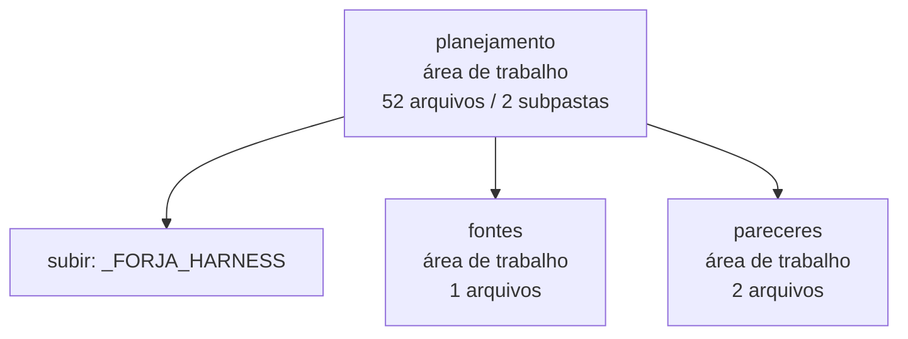

<!-- IA_NAVIGACAO:GERADO_AUTO:v1 -->
# Mapa IA - planejamento

Atualizado automaticamente em: **2026-08-05 13:32:38 -0300**

- Caminho: `C:\Users\IgorPC\.claude\projects\Escritório fabio osório\fabricas de melhoria de petições\_FORJA_HARNESS\planejamento`
- Tipo: **área de trabalho**
- Função para navegação: planejamento, execução, documentação ou material visual
- Conteúdo recursivo: **52 arquivos**, **2 subpastas**, **1.3 MB**
- Tipos de arquivo: .md: 52
- Mapa raiz: [MAPA_IA.md](<../../MAPA_IA.md>)
- Índice geral: [INDICE_GERAL_IA.md](<../../00_IA_NAVIGACAO/INDICE_GERAL_IA.md>)
- Protocolo de navegação: [PROTOCOLO_NAVEGACAO_IA.md](<../../00_IA_NAVIGACAO/PROTOCOLO_NAVEGACAO_IA.md>)
- Inventário JSON para agentes: [inventario_ia.json](<../../00_IA_NAVIGACAO/dados/inventario_ia.json>)
- Mapa superior: [_FORJA_HARNESS](<../MAPA_IA.md>)

## GPS Mermaid

## Ordem de leitura recomendada

1. Ler este `MAPA_IA.md` antes de abrir arquivos pesados.
2. Subir para a raiz se precisar das regras globais `AGENTS.md`, `CLAUDE.md` e `_LEIS_GERAIS`.

## Subpastas diretas

| Subpasta | Tipo | Conteúdo | Atualização | Próximo passo |
|---|---|---:|---:|---|
| [fontes](<fontes/MAPA_IA.md>) | área de trabalho | 1 arquivos / 0 subpastas | 2026-07-08 15:02 | planejamento, execução, documentação ou material visual |
| [pareceres](<pareceres/MAPA_IA.md>) | área de trabalho | 2 arquivos / 0 subpastas | 2026-07-25 16:08 | planejamento, execução, documentação ou material visual |

## Arquivos diretos

| Arquivo | Papel | Tamanho | Modificado | Observação |
|---|---:|---:|---:|---|
| [01_PRD_FORJA.md](<01_PRD_FORJA.md>) | outro | 16.7 KB | 2026-07-15 22:50 | arquivo não classificado automaticamente \| tópicos: PRD — FORJA N2; 1. Visão; 2. Problema |
| [02_TDD_FORJA.md](<02_TDD_FORJA.md>) | outro | 16.5 KB | 2026-07-15 22:50 | arquivo não classificado automaticamente \| tópicos: TDD — FORJA N2; 1. Objetivo técnico; 2. Topologia |
| [03_ROADMAP_FORJA.md](<03_ROADMAP_FORJA.md>) | outro | 9.3 KB | 2026-07-08 23:27 | arquivo não classificado automaticamente \| tópicos: ROADMAP — FORJA N2; 1. Princípios de rollout; 2. Marcos |
| [04_DIAGRAMAS_FORJA.md](<04_DIAGRAMAS_FORJA.md>) | outro | 9.2 KB | 2026-07-15 22:50 | arquivo não classificado automaticamente \| tópicos: DIAGRAMAS — FORJA N2; 1. Fluxo macro F0-F10; 2. Maquina de estados |
| [05_FORJA_NIVEL_2_ANALISE_E_PLANO_CORRIGIDO.md](<05_FORJA_NIVEL_2_ANALISE_E_PLANO_CORRIGIDO.md>) | outro | 24.2 KB | 2026-07-08 23:28 | arquivo não classificado automaticamente \| tópicos: FORJA N2 — Análise crítica e planejamento corrigido; 1. Veredito executivo; 2. Acertos preservados |
| [06_GATES_QUALIDADE_FORJA.md](<06_GATES_QUALIDADE_FORJA.md>) | outro | 49.8 KB | 2026-08-05 03:09 | arquivo não classificado automaticamente \| tópicos: 05 — Gates de Qualidade do FORJA N2 (catálogo complementar); Princípio central (diagnóstico transversal das entregas reais); Catálogo de gates por fase FORJA N2 |
| [07_PLANO_UPGRADE_ESTADO_DA_ARTE_2026.md](<07_PLANO_UPGRADE_ESTADO_DA_ARTE_2026.md>) | outro | 22.2 KB | 2026-07-09 16:56 | arquivo não classificado automaticamente \| tópicos: Plano de Upgrade FORJA × Estado da Arte 2026 — v2 (revisado e detalhado); 0. Filtros aplicados de saída (decisão do Igor — não reabrir); 1. Onde os relatórios CONFIRMAM o FORJA (ativo, não lacuna — não mexer) |
| [08_PLANO_FORJA_N3_INTEGRIDADE_VISUAL_E_GESTAO.md](<08_PLANO_FORJA_N3_INTEGRIDADE_VISUAL_E_GESTAO.md>) | outro | 50.4 KB | 2026-07-15 22:50 | arquivo não classificado automaticamente \| tópicos: FORJA N3 — PLANO DE INTEGRIDADE, CONTEXTO, VISUAL E GESTÃO; 1. Objetivo da N3; 1.1 Correções incorporadas na revisão 2 |
| [09_AUDITORIA_ADVERSARIAL_PONTOS_DECISIVOS.md](<09_AUDITORIA_ADVERSARIAL_PONTOS_DECISIVOS.md>) | outro | 8.6 KB | 2026-07-10 22:28 | arquivo não classificado automaticamente \| tópicos: FORJA — Auditoria adversarial e pontos decisivos; 1. Finalidade; 2. Regra de prudência |
| [10_PRD_FORJA_N4_RACIOCINIO_PROVA_CIENCIA.md](<10_PRD_FORJA_N4_RACIOCINIO_PROVA_CIENCIA.md>) | outro | 38.7 KB | 2026-07-15 22:25 | arquivo não classificado automaticamente \| tópicos: PRD — FORJA N4: Raciocínio, Prova e Ciência; 1. Decisão de produto; 2. Linha de base que a N4 deve respeitar |
| [11_TDD_FORJA_N4_RACIOCINIO_PROVA_CIENCIA.md](<11_TDD_FORJA_N4_RACIOCINIO_PROVA_CIENCIA.md>) | outro | 52.7 KB | 2026-07-15 22:26 | arquivo não classificado automaticamente \| tópicos: TDD — FORJA N4: Raciocínio, Prova e Ciência; 1. Objetivo técnico; 2. Decisões arquiteturais |
| [12_ROADMAP_FORJA_N4_RACIOCINIO_PROVA_CIENCIA.md](<12_ROADMAP_FORJA_N4_RACIOCINIO_PROVA_CIENCIA.md>) | outro | 27.7 KB | 2026-07-15 22:50 | arquivo não classificado automaticamente \| tópicos: ROADMAP — FORJA N4: Raciocínio, Prova e Ciência; 1. Estratégia de rollout; 2. Regras de execução |
| [13_DIAGRAMAS_FORJA_N4_RACIOCINIO_PROVA_CIENCIA.md](<13_DIAGRAMAS_FORJA_N4_RACIOCINIO_PROVA_CIENCIA.md>) | outro | 21.9 KB | 2026-07-15 22:50 | arquivo não classificado automaticamente \| tópicos: DIAGRAMAS — FORJA N4: Raciocínio, Prova e Ciência; 1. Evolução incremental dentro de F0–F10; 2. Camadas da arquitetura N4 |
| [14_METODO_VAN_AKEN_APLICADO_A_PETICOES.md](<14_METODO_VAN_AKEN_APLICADO_A_PETICOES.md>) | outro | 21.5 KB | 2026-07-11 18:23 | arquivo não classificado automaticamente \| tópicos: Método de solução de problemas aplicado à elaboração de petições; 1. Ganho central para a FORJA; 2. Tradução correta para o domínio jurídico |
| [15_PRD_FILA_PRIORIZADA.md](<15_PRD_FILA_PRIORIZADA.md>) | outro | 8.2 KB | 2026-07-12 10:25 | arquivo não classificado automaticamente \| tópicos: PRD — FORJA FILA: priorização automática painel → FORJA; 1. Problema; 2. Solução em uma frase |
| [16_TDD_FILA_PRIORIZADA.md](<16_TDD_FILA_PRIORIZADA.md>) | outro | 8.5 KB | 2026-07-12 10:25 | arquivo não classificado automaticamente \| tópicos: TDD — FORJA FILA: desenho técnico e plano de testes; 1. Componentes; 2. Contratos das funções (núcleo puro — sem I/O) |
| [17_DIAGRAMAS_FILA_PRIORIZADA.md](<17_DIAGRAMAS_FILA_PRIORIZADA.md>) | outro | 3.5 KB | 2026-07-12 09:51 | arquivo não classificado automaticamente \| tópicos: Diagramas — FORJA FILA (priorização automática painel → FORJA); 1. Fluxo de dados (quem lê e quem escreve o quê); 2. Máquina de classificação de prontidão (ordem de precedência) |
| [18_MAPA_IMPLEMENTACAO_FILA_PRIORIZADA.md](<18_MAPA_IMPLEMENTACAO_FILA_PRIORIZADA.md>) | outro | 6.0 KB | 2026-07-12 12:56 | arquivo não classificado automaticamente \| tópicos: Mapa de implementação — FORJA FILA; Visão geral; M0 — Fundação (2h) |
| [19_PLANO_INSTALACAO_MELHORIAS_FORJA_2026-07-12.md](<19_PLANO_INSTALACAO_MELHORIAS_FORJA_2026-07-12.md>) | outro | 13.3 KB | 2026-07-12 17:02 | arquivo não classificado automaticamente \| tópicos: 19 — Plano de instalação das melhorias mapeadas na FORJA; Sumário das lacunas e mapeamento para milestones; M1 — Observabilidade e contexto (estimativa: 6-8h) |
| [20_F2A_EXPLORACAO_100_PERGUNTAS.md](<20_F2A_EXPLORACAO_100_PERGUNTAS.md>) | outro | 3.1 KB | 2026-07-14 14:37 | arquivo não classificado automaticamente \| tópicos: F2-A — Exploração problematizadora em 100 perguntas; Problema corrigido; Posição no fluxo |
| [21_F7B_FABLE5_REVISAO_ESCRITA_FINAL.md](<21_F7B_FABLE5_REVISAO_ESCRITA_FINAL.md>) | outro | 5.6 KB | 2026-07-16 19:39 | arquivo não classificado automaticamente \| tópicos: Decisão arquitetural 21 — F7-B com Claude Fable 5; Contexto; Decisão |
| [21_PLANO_MESTRE_REFATORACAO_FORJA.md](<21_PLANO_MESTRE_REFATORACAO_FORJA.md>) | outro | 1.4 KB | 2026-07-15 19:16 | arquivo não classificado automaticamente \| tópicos: Plano mestre de refatoração segura da FORJA; Fonte de verdade; Limite desta entrega |
| [22_PRD_AUTORESEARCH_FORJA.md](<22_PRD_AUTORESEARCH_FORJA.md>) | outro | 18.3 KB | 2026-07-23 01:42 | arquivo não classificado automaticamente \| tópicos: PRD — FORJA AUTO-RESEARCH (ciclo AR de auto-melhoria anti-trapaça); 1. Decisão de produto; 2. Linha de base preservada |
| [23_TDD_AUTORESEARCH_FORJA.md](<23_TDD_AUTORESEARCH_FORJA.md>) | outro | 14.3 KB | 2026-07-23 01:43 | arquivo não classificado automaticamente \| tópicos: TDD — FORJA AUTO-RESEARCH (implementação técnica do ciclo AR); 1. Objetivo técnico; 2. Topologia e dependências |
| [24_ANALISE_PROPRIEDADE_INTELECTUAL_FORJA.md](<24_ANALISE_PROPRIEDADE_INTELECTUAL_FORJA.md>) | outro | 8.8 KB | 2026-08-05 03:09 | arquivo não classificado automaticamente \| tópicos: 24 — Análise de propriedade intelectual da FORJA e plano de registro; 1. Conclusão executiva; 2. Por que patente não |
| [24_DIAGNOSTICO_E_PLANO_CONSTANCIA_VISUAL.md](<24_DIAGNOSTICO_E_PLANO_CONSTANCIA_VISUAL.md>) | outro | 39.5 KB | 2026-08-03 22:43 | arquivo não classificado automaticamente \| tópicos: Diagnóstico e plano — constância visual da FORJA; 1. Veredito; 2. Evidência |
| [24_HARDENING_ANTI_ALUCINACAO_V2.md](<24_HARDENING_ANTI_ALUCINACAO_V2.md>) | outro | 3.1 KB | 2026-07-23 14:30 | arquivo não classificado automaticamente \| tópicos: Hardening anti-alucinação v2 — plano, execução e rollback; Resultado pretendido; Ameaças tratadas |
| [25_CONSELHO_GATE_VISUAL_2026-08-03.md](<25_CONSELHO_GATE_VISUAL_2026-08-03.md>) | outro | 16.7 KB | 2026-08-04 10:12 | arquivo não classificado automaticamente \| tópicos: Parecer do Conselho Quadripartite: Gate Visual F8-S da FORJA; 1. DECISÃO; 2. COMO SE CHEGOU AQUI |
| [25_GOSTO_JURIDICO_AUTONOMO_EDGE.md](<25_GOSTO_JURIDICO_AUTONOMO_EDGE.md>) | outro | 7.0 KB | 2026-07-24 18:30 | arquivo não classificado automaticamente \| tópicos: Gosto jurídico autônomo na FORJA; 1. O que o vídeo realmente sustenta; 2. Onde a tese do vídeo precisa ser corrigida |
| [26_PLANO_IMPLEMENTACAO_FORJA_ASSINATURA.md](<26_PLANO_IMPLEMENTACAO_FORJA_ASSINATURA.md>) | outro | 52.7 KB | 2026-07-25 15:58 | arquivo não classificado automaticamente \| tópicos: Plano de implementação — FORJA‑ASSINATURA; 1. Decisão executiva; 2. Autoridade, precedência e limites |
| [27_PRD_FORJA_ASSINATURA.md](<27_PRD_FORJA_ASSINATURA.md>) | outro | 20.3 KB | 2026-07-25 15:58 | arquivo não classificado automaticamente \| tópicos: PRD — FORJA-ASSINATURA; 1. Decisão de produto; 2. Problema |
| [28_TDD_FORJA_ASSINATURA.md](<28_TDD_FORJA_ASSINATURA.md>) | outro | 30.6 KB | 2026-07-25 15:58 | arquivo não classificado automaticamente \| tópicos: TDD — FORJA-ASSINATURA; 1. Objetivo técnico; 2. Restrições do sistema vivo |
| [29_REQUISITOS_ENTREVISTA_FABIO_MEDINA_OSORIO.md](<29_REQUISITOS_ENTREVISTA_FABIO_MEDINA_OSORIO.md>) | outro | 43.6 KB | 2026-08-05 03:09 | arquivo não classificado automaticamente \| tópicos: 25 — Requisitos da FORJA extraídos da entrevista de Fábio Medina Osório; 0. Advertência de método (obrigatória antes de citar este documento); 1. O que ele efetivamente pediu |
| [30_ARQUITETURA_DIALETICA_IDENTIDADE_E_PRECEDENTES.md](<30_ARQUITETURA_DIALETICA_IDENTIDADE_E_PRECEDENTES.md>) | outro | 36.2 KB | 2026-07-25 14:15 | arquivo não classificado automaticamente \| tópicos: 26 — Arquitetura de três eixos: dialética com o advogado, identidade Medina Osório e sistema de precedentes; 0. Resolução de uma divergência entre os pareceres; 0.1 Correções do Codex que este documento adota — e que corrigem o documento 25 |
| [31_PLANO_UNICO_CONSOLIDADO_2026-07-25.md](<31_PLANO_UNICO_CONSOLIDADO_2026-07-25.md>) | outro | 15.3 KB | 2026-07-25 15:05 | arquivo não classificado automaticamente \| tópicos: 31 — Plano único consolidado: FORJA-ASSINATURA Lite + requisitos do titular; 1. A descoberta que dispensa metade da obra; 2. A dependência que a versão Lite não enxergou |
| [32_PLANO_UNICO_CONSOLIDADO_V2_2026-07-25.md](<32_PLANO_UNICO_CONSOLIDADO_V2_2026-07-25.md>) | outro | 28.9 KB | 2026-07-25 15:58 | arquivo não classificado automaticamente \| tópicos: 32 — Plano único consolidado v2: cocrição, identidade e precedentes; 1. Resultado pretendido; 2. Linha de base verificada: o que existe e o que realmente falta |
| [33_PRD_FORJA_ASSINATURA_LITE_COCRIACAO_PRECEDENTES.md](<33_PRD_FORJA_ASSINATURA_LITE_COCRIACAO_PRECEDENTES.md>) | outro | 18.4 KB | 2026-08-05 03:09 | arquivo não classificado automaticamente \| tópicos: 33 — PRD: FORJA-ASSINATURA Lite, cocrição e precedentes; 1. Decisão de produto; 2. Problema |
| [34_TDD_FORJA_ASSINATURA_LITE_COCRIACAO_PRECEDENTES.md](<34_TDD_FORJA_ASSINATURA_LITE_COCRIACAO_PRECEDENTES.md>) | outro | 28.2 KB | 2026-07-25 16:10 | arquivo não classificado automaticamente \| tópicos: 34 — TDD: FORJA-ASSINATURA Lite, cocrição e precedentes; 1. Objetivo técnico; 2. Restrições observadas no sistema vivo |
| [35_ROADMAP_EXECUCAO_FORJA_ASSINATURA_LITE.md](<35_ROADMAP_EXECUCAO_FORJA_ASSINATURA_LITE.md>) | outro | 16.4 KB | 2026-07-25 16:10 | arquivo não classificado automaticamente \| tópicos: 35 — Roadmap de execução: FORJA-ASSINATURA Lite; 1. Regra de execução; 2. Dependências |
| [36_CONSOLIDACAO_CONSELHO_E_PARECER_FINAL.md](<36_CONSOLIDACAO_CONSELHO_E_PARECER_FINAL.md>) | outro | 29.7 KB | 2026-08-05 03:09 | arquivo não classificado automaticamente \| tópicos: 36 — Consolidação do conselho e parecer final de execução; Resultado; 1. Evidência colhida nesta execução |
| [37_PLANO_HARNESS_MULTIMODELO.md](<37_PLANO_HARNESS_MULTIMODELO.md>) | outro | 21.3 KB | 2026-07-27 15:27 | arquivo não classificado automaticamente \| tópicos: 37 — FORJA como harness multimodelo; 0. A tese, e por que ela não é nova aqui; 1. O que foi medido em 26/07/2026 |
| [38_PLANO_LOOP_POS_PROTOCOLO_E_AUTOAPERFEICOAMENTO_ARQUITETURAL.md](<38_PLANO_LOOP_POS_PROTOCOLO_E_AUTOAPERFEICOAMENTO_ARQUITETURAL.md>) | outro | 42.2 KB | 2026-07-29 16:24 | arquivo não classificado automaticamente \| tópicos: Plano do loop pós-protocolo e de autoaperfeiçoamento arquitetural da FORJA; 1. Resultado pretendido; 2. Premissas e decisões |
| [39_METODO_DIAGNOSTICO_VAN_AKEN_MCKINSEY.md](<39_METODO_DIAGNOSTICO_VAN_AKEN_MCKINSEY.md>) | outro | 45.9 KB | 2026-07-30 15:27 | arquivo não classificado automaticamente \| tópicos: Reforma do diagnóstico e do design da FORJA — van Aken e The McKinsey Mind; Fontes estudadas; 1. Síntese executiva |
| [39_VAN_AKEN_MCKINSEY_DIAGNOSTICO_E_DESIGN_FORJA.md](<39_VAN_AKEN_MCKINSEY_DIAGNOSTICO_E_DESIGN_FORJA.md>) | outro | 27.9 KB | 2026-07-30 13:25 | arquivo não classificado automaticamente \| tópicos: Van Aken + The McKinsey Mind — seleção aplicada ao diagnóstico e ao design da FORJA; 1. Decisão executiva; 2. O que já existe e deve ser preservado |
| [40_PLANO_CONSOLIDADO_DIAGNOSTICO_E_DESIGN_FORJA_V2.md](<40_PLANO_CONSOLIDADO_DIAGNOSTICO_E_DESIGN_FORJA_V2.md>) | outro | 106.5 KB | 2026-08-05 03:09 | arquivo não classificado automaticamente \| tópicos: Plano consolidado final v3 — execução do diagnóstico, design e MAP da FORJA; 1. Decisão executiva; 2. Auditoria crítica da v4 recebida |
| [41_PLANO_GATE_DOCUMENTAL_E_REGRESSAO_FONTE_PREVALENTE.md](<41_PLANO_GATE_DOCUMENTAL_E_REGRESSAO_FONTE_PREVALENTE.md>) | outro | 84.7 KB | 2026-08-05 04:03 | arquivo não classificado automaticamente \| tópicos: Plano 41 — Fonte prevalente e ancoragem de valor monetário (FORJA-LASTRO-v2); 1. Contexto e incidente que origina o plano; 2. Diagnóstico técnico — onde o fluxo falhou |
| [ANEXO_A_DECISOES_E_ACHADOS_COCRIACAO.md](<ANEXO_A_DECISOES_E_ACHADOS_COCRIACAO.md>) | outro | 24.9 KB | 2026-07-25 15:43 | arquivo não classificado automaticamente \| tópicos: 33 — PRD: cocriação, mapa do destinatário e precedentes estratégicos; 1. Revisão do documento 32 — registro de decisão; 1.1 Acatados sem reserva — e três deles corrigem erro meu |
| [ANEXO_B_INVARIANTES_E_TESTES_COCRIACAO.md](<ANEXO_B_INVARIANTES_E_TESTES_COCRIACAO.md>) | outro | 17.8 KB | 2026-07-25 15:46 | arquivo não classificado automaticamente \| tópicos: 34 — TDD: cocriação, mapa do destinatário e precedentes estratégicos; 1. Princípio de encaixe; 2. Inventário de mudanças |
| [ANEXO_C_GOVERNANCA_E_INSTRUMENTOS_COCRIACAO.md](<ANEXO_C_GOVERNANCA_E_INSTRUMENTOS_COCRIACAO.md>) | outro | 9.6 KB | 2026-07-25 15:47 | arquivo não classificado automaticamente \| tópicos: 35 — Roteiro, portões e instrumentos de operação; 1. Quatro ondas; Onda 0 — Contratos, proveniência e baseline |

## Leitura por papel

- **outro**: [01_PRD_FORJA.md](<01_PRD_FORJA.md>), [02_TDD_FORJA.md](<02_TDD_FORJA.md>), [03_ROADMAP_FORJA.md](<03_ROADMAP_FORJA.md>), [04_DIAGRAMAS_FORJA.md](<04_DIAGRAMAS_FORJA.md>), [05_FORJA_NIVEL_2_ANALISE_E_PLANO_CORRIGIDO.md](<05_FORJA_NIVEL_2_ANALISE_E_PLANO_CORRIGIDO.md>), [06_GATES_QUALIDADE_FORJA.md](<06_GATES_QUALIDADE_FORJA.md>), [07_PLANO_UPGRADE_ESTADO_DA_ARTE_2026.md](<07_PLANO_UPGRADE_ESTADO_DA_ARTE_2026.md>), [08_PLANO_FORJA_N3_INTEGRIDADE_VISUAL_E_GESTAO.md](<08_PLANO_FORJA_N3_INTEGRIDADE_VISUAL_E_GESTAO.md>), [09_AUDITORIA_ADVERSARIAL_PONTOS_DECISIVOS.md](<09_AUDITORIA_ADVERSARIAL_PONTOS_DECISIVOS.md>), [10_PRD_FORJA_N4_RACIOCINIO_PROVA_CIENCIA.md](<10_PRD_FORJA_N4_RACIOCINIO_PROVA_CIENCIA.md>), [11_TDD_FORJA_N4_RACIOCINIO_PROVA_CIENCIA.md](<11_TDD_FORJA_N4_RACIOCINIO_PROVA_CIENCIA.md>), [12_ROADMAP_FORJA_N4_RACIOCINIO_PROVA_CIENCIA.md](<12_ROADMAP_FORJA_N4_RACIOCINIO_PROVA_CIENCIA.md>), [13_DIAGRAMAS_FORJA_N4_RACIOCINIO_PROVA_CIENCIA.md](<13_DIAGRAMAS_FORJA_N4_RACIOCINIO_PROVA_CIENCIA.md>), [14_METODO_VAN_AKEN_APLICADO_A_PETICOES.md](<14_METODO_VAN_AKEN_APLICADO_A_PETICOES.md>), [15_PRD_FILA_PRIORIZADA.md](<15_PRD_FILA_PRIORIZADA.md>), [16_TDD_FILA_PRIORIZADA.md](<16_TDD_FILA_PRIORIZADA.md>), [17_DIAGRAMAS_FILA_PRIORIZADA.md](<17_DIAGRAMAS_FILA_PRIORIZADA.md>), [18_MAPA_IMPLEMENTACAO_FILA_PRIORIZADA.md](<18_MAPA_IMPLEMENTACAO_FILA_PRIORIZADA.md>), [19_PLANO_INSTALACAO_MELHORIAS_FORJA_2026-07-12.md](<19_PLANO_INSTALACAO_MELHORIAS_FORJA_2026-07-12.md>), [20_F2A_EXPLORACAO_100_PERGUNTAS.md](<20_F2A_EXPLORACAO_100_PERGUNTAS.md>), [21_F7B_FABLE5_REVISAO_ESCRITA_FINAL.md](<21_F7B_FABLE5_REVISAO_ESCRITA_FINAL.md>), [21_PLANO_MESTRE_REFATORACAO_FORJA.md](<21_PLANO_MESTRE_REFATORACAO_FORJA.md>), [22_PRD_AUTORESEARCH_FORJA.md](<22_PRD_AUTORESEARCH_FORJA.md>), [23_TDD_AUTORESEARCH_FORJA.md](<23_TDD_AUTORESEARCH_FORJA.md>), [24_ANALISE_PROPRIEDADE_INTELECTUAL_FORJA.md](<24_ANALISE_PROPRIEDADE_INTELECTUAL_FORJA.md>), [24_DIAGNOSTICO_E_PLANO_CONSTANCIA_VISUAL.md](<24_DIAGNOSTICO_E_PLANO_CONSTANCIA_VISUAL.md>), [24_HARDENING_ANTI_ALUCINACAO_V2.md](<24_HARDENING_ANTI_ALUCINACAO_V2.md>), [25_CONSELHO_GATE_VISUAL_2026-08-03.md](<25_CONSELHO_GATE_VISUAL_2026-08-03.md>), [25_GOSTO_JURIDICO_AUTONOMO_EDGE.md](<25_GOSTO_JURIDICO_AUTONOMO_EDGE.md>), [26_PLANO_IMPLEMENTACAO_FORJA_ASSINATURA.md](<26_PLANO_IMPLEMENTACAO_FORJA_ASSINATURA.md>), [27_PRD_FORJA_ASSINATURA.md](<27_PRD_FORJA_ASSINATURA.md>), [28_TDD_FORJA_ASSINATURA.md](<28_TDD_FORJA_ASSINATURA.md>), [29_REQUISITOS_ENTREVISTA_FABIO_MEDINA_OSORIO.md](<29_REQUISITOS_ENTREVISTA_FABIO_MEDINA_OSORIO.md>), [30_ARQUITETURA_DIALETICA_IDENTIDADE_E_PRECEDENTES.md](<30_ARQUITETURA_DIALETICA_IDENTIDADE_E_PRECEDENTES.md>), [31_PLANO_UNICO_CONSOLIDADO_2026-07-25.md](<31_PLANO_UNICO_CONSOLIDADO_2026-07-25.md>), [32_PLANO_UNICO_CONSOLIDADO_V2_2026-07-25.md](<32_PLANO_UNICO_CONSOLIDADO_V2_2026-07-25.md>), [33_PRD_FORJA_ASSINATURA_LITE_COCRIACAO_PRECEDENTES.md](<33_PRD_FORJA_ASSINATURA_LITE_COCRIACAO_PRECEDENTES.md>), [34_TDD_FORJA_ASSINATURA_LITE_COCRIACAO_PRECEDENTES.md](<34_TDD_FORJA_ASSINATURA_LITE_COCRIACAO_PRECEDENTES.md>), [35_ROADMAP_EXECUCAO_FORJA_ASSINATURA_LITE.md](<35_ROADMAP_EXECUCAO_FORJA_ASSINATURA_LITE.md>), [36_CONSOLIDACAO_CONSELHO_E_PARECER_FINAL.md](<36_CONSOLIDACAO_CONSELHO_E_PARECER_FINAL.md>), [37_PLANO_HARNESS_MULTIMODELO.md](<37_PLANO_HARNESS_MULTIMODELO.md>), [38_PLANO_LOOP_POS_PROTOCOLO_E_AUTOAPERFEICOAMENTO_ARQUITETURAL.md](<38_PLANO_LOOP_POS_PROTOCOLO_E_AUTOAPERFEICOAMENTO_ARQUITETURAL.md>), [39_METODO_DIAGNOSTICO_VAN_AKEN_MCKINSEY.md](<39_METODO_DIAGNOSTICO_VAN_AKEN_MCKINSEY.md>), [39_VAN_AKEN_MCKINSEY_DIAGNOSTICO_E_DESIGN_FORJA.md](<39_VAN_AKEN_MCKINSEY_DIAGNOSTICO_E_DESIGN_FORJA.md>), [40_PLANO_CONSOLIDADO_DIAGNOSTICO_E_DESIGN_FORJA_V2.md](<40_PLANO_CONSOLIDADO_DIAGNOSTICO_E_DESIGN_FORJA_V2.md>), [41_PLANO_GATE_DOCUMENTAL_E_REGRESSAO_FONTE_PREVALENTE.md](<41_PLANO_GATE_DOCUMENTAL_E_REGRESSAO_FONTE_PREVALENTE.md>), [ANEXO_A_DECISOES_E_ACHADOS_COCRIACAO.md](<ANEXO_A_DECISOES_E_ACHADOS_COCRIACAO.md>), [ANEXO_B_INVARIANTES_E_TESTES_COCRIACAO.md](<ANEXO_B_INVARIANTES_E_TESTES_COCRIACAO.md>), [ANEXO_C_GOVERNANCA_E_INSTRUMENTOS_COCRIACAO.md](<ANEXO_C_GOVERNANCA_E_INSTRUMENTOS_COCRIACAO.md>)

## Observações anti-alucinação

- Este mapa classifica por nomes, extensões e posição na árvore; não substitui leitura de fonte primária.
- Fato, citação, ID processual, prazo e jurisprudência só entram em peça depois de conferência no arquivo-fonte ou fonte oficial.
- Se a pasta tiver regimento, a peça deve refletir o regimento vigente na data do protocolo.
