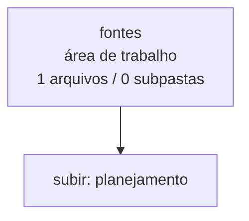

<!-- IA_NAVIGACAO:GERADO_AUTO:v1 -->
# Mapa IA - fontes

Atualizado automaticamente em: **2026-08-05 13:56:04 -0300**

- Caminho: `C:\Users\IgorPC\.claude\projects\Escritório fabio osório\fabricas de melhoria de petições\_FORJA_HARNESS\planejamento\fontes`
- Tipo: **área de trabalho**
- Função para navegação: planejamento, execução, documentação ou material visual
- Conteúdo recursivo: **1 arquivos**, **0 subpastas**, **28.8 KB**
- Tipos de arquivo: .md: 1
- Mapa raiz: [MAPA_IA.md](<../../../MAPA_IA.md>)
- Índice geral: [INDICE_GERAL_IA.md](<../../../00_IA_NAVIGACAO/INDICE_GERAL_IA.md>)
- Protocolo de navegação: [PROTOCOLO_NAVEGACAO_IA.md](<../../../00_IA_NAVIGACAO/PROTOCOLO_NAVEGACAO_IA.md>)
- Inventário JSON para agentes: [inventario_ia.json](<../../../00_IA_NAVIGACAO/dados/inventario_ia.json>)
- Mapa superior: [planejamento](<../MAPA_IA.md>)

## GPS Mermaid

## Ordem de leitura recomendada

1. Ler este `MAPA_IA.md` antes de abrir arquivos pesados.
2. Subir para a raiz se precisar das regras globais `AGENTS.md`, `CLAUDE.md` e `_LEIS_GERAIS`.

## Subpastas diretas

_Sem subpastas diretas._

## Arquivos diretos

| Arquivo | Papel | Tamanho | Modificado | Observação |
|---|---:|---:|---:|---|
| [ANALISE_PONTUAL_HARNESS_F0_F10.md](<ANALISE_PONTUAL_HARNESS_F0_F10.md>) | outro | 28.8 KB | 2026-07-08 15:02 | arquivo não classificado automaticamente \| tópicos: Análise Pontual de Harness — Fases F0 a F10 e Lições Comprovadas; I. LIÇÕES NOVAS — NÃO CAPTURADAS NO PROTOCOLO ATUAL; 1. Pergunta Judicial como Centro Absoluto |

## Leitura por papel

- **outro**: [ANALISE_PONTUAL_HARNESS_F0_F10.md](<ANALISE_PONTUAL_HARNESS_F0_F10.md>)

## Observações anti-alucinação

- Este mapa classifica por nomes, extensões e posição na árvore; não substitui leitura de fonte primária.
- Fato, citação, ID processual, prazo e jurisprudência só entram em peça depois de conferência no arquivo-fonte ou fonte oficial.
- Se a pasta tiver regimento, a peça deve refletir o regimento vigente na data do protocolo.
