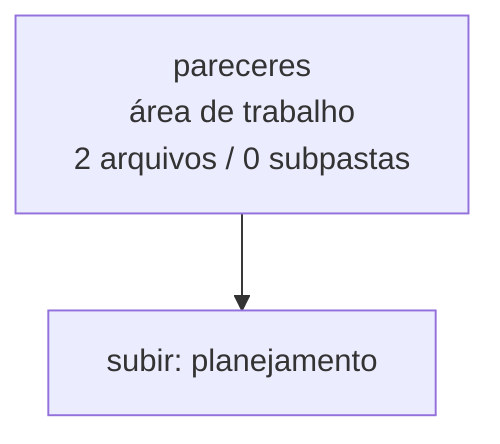

<!-- IA_NAVIGACAO:GERADO_AUTO:v1 -->
# Mapa IA - pareceres

Atualizado automaticamente em: **2026-08-05 13:33:43 -0300**

- Caminho: `C:\Users\IgorPC\.claude\projects\Escritório fabio osório\fabricas de melhoria de petições\_FORJA_HARNESS\planejamento\pareceres`
- Tipo: **área de trabalho**
- Função para navegação: planejamento, execução, documentação ou material visual
- Conteúdo recursivo: **2 arquivos**, **0 subpastas**, **33.0 KB**
- Tipos de arquivo: .md: 2
- Mapa raiz: [MAPA_IA.md](<../../../MAPA_IA.md>)
- Índice geral: [INDICE_GERAL_IA.md](<../../../00_IA_NAVIGACAO/INDICE_GERAL_IA.md>)
- Protocolo de navegação: [PROTOCOLO_NAVEGACAO_IA.md](<../../../00_IA_NAVIGACAO/PROTOCOLO_NAVEGACAO_IA.md>)
- Inventário JSON para agentes: [inventario_ia.json](<../../../00_IA_NAVIGACAO/dados/inventario_ia.json>)
- Mapa superior: [planejamento](<../MAPA_IA.md>)

## GPS Mermaid

## Ordem de leitura recomendada

1. Ler este `MAPA_IA.md` antes de abrir arquivos pesados.
2. Subir para a raiz se precisar das regras globais `AGENTS.md`, `CLAUDE.md` e `_LEIS_GERAIS`.

## Subpastas diretas

_Sem subpastas diretas._

## Arquivos diretos

| Arquivo | Papel | Tamanho | Modificado | Observação |
|---|---:|---:|---:|---|
| [CICERO_FORJA_COCRIACAO_2026-07-25.md](<CICERO_FORJA_COCRIACAO_2026-07-25.md>) | outro | 20.8 KB | 2026-07-25 16:08 | arquivo não classificado automaticamente \| tópicos: Parecer jurídico — FORJA-COCRIACAO-v1; 1. Resultado jurídico direto; 2. Estado real, cânone e lacunas |
| [HELENA_FORJA_COCRIACAO_2026-07-25.md](<HELENA_FORJA_COCRIACAO_2026-07-25.md>) | outro | 12.2 KB | 2026-07-25 15:51 | arquivo não classificado automaticamente \| tópicos: Parecer Helena Strategos — FORJA-COCRIACAO-v1; 1. Status real e recomendação direta; 2. Achado principal |

## Leitura por papel

- **outro**: [CICERO_FORJA_COCRIACAO_2026-07-25.md](<CICERO_FORJA_COCRIACAO_2026-07-25.md>), [HELENA_FORJA_COCRIACAO_2026-07-25.md](<HELENA_FORJA_COCRIACAO_2026-07-25.md>)

## Observações anti-alucinação

- Este mapa classifica por nomes, extensões e posição na árvore; não substitui leitura de fonte primária.
- Fato, citação, ID processual, prazo e jurisprudência só entram em peça depois de conferência no arquivo-fonte ou fonte oficial.
- Se a pasta tiver regimento, a peça deve refletir o regimento vigente na data do protocolo.
