# FORJA explicada por dentro

**Como a demanda se transforma em uma petição pronta para revisão humana**<br>
**Data de referência:** 12/07/2026<br>
**Como ler as cores:** petróleo = funcionamento atual; terracota = melhoria em teste; grafite = evolução planejada; verde = informação confirmada; vermelho = impedimento.

> Este atlas mostra, em linguagem direta, o que a FORJA já faz, quais melhorias estão sendo testadas e o que ainda depende de comprovação. A edição de 12/07/2026 reúne o fluxo completo, a integração com a gestão do escritório, as verificações jurídicas e os aprendizados obtidos com petições reais.

<div class="executive-cards">
  <div class="executive-card active"><strong>11 etapas</strong><span>da entrada da demanda à comprovação da entrega</span></div>
  <div class="executive-card evidence"><strong>Afirmação → fonte</strong><span>cada ponto importante pode ser conferido</span></div>
  <div class="executive-card human"><strong>Helena + Cícero</strong><span>conselho obrigatório e registrado</span></div>
  <div class="executive-card shadow"><strong>Análise aprofundada</strong><span>melhorias testadas antes de se tornarem obrigatórias</span></div>
</div>

## 1. Visão executiva

### 1.1 A FORJA dentro do escritório

**A base da FORJA já funciona. As análises mais profundas ainda passam por testes controlados.**

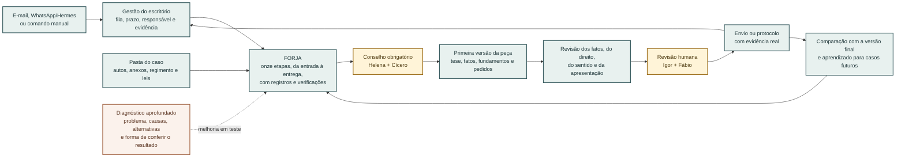

### 1.2 O que é fonte de verdade

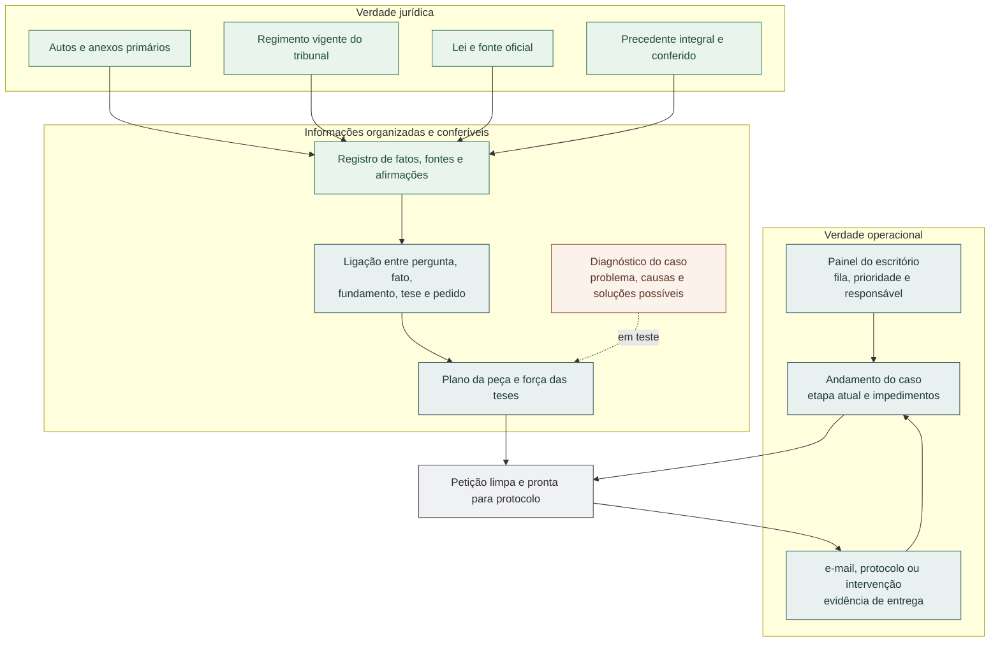

## 2. O caminho completo de uma petição

### 2.1 As onze etapas, da demanda à entrega

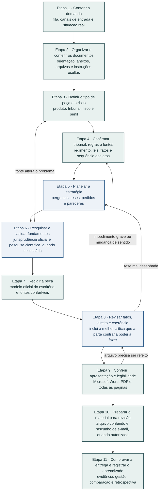

### 2.2 Como a situação do trabalho muda

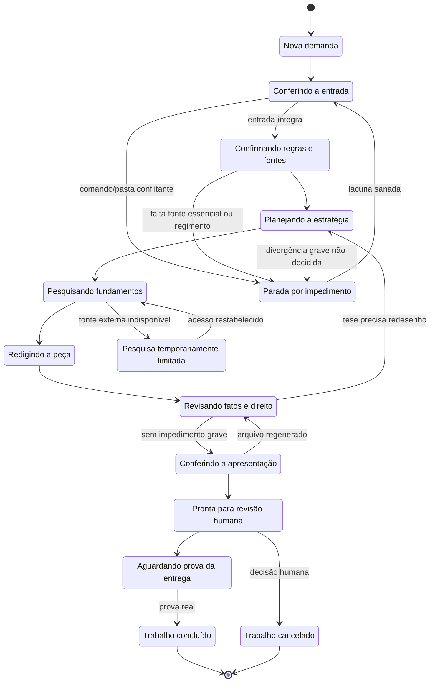

### 2.3 Responsabilidades e decisões

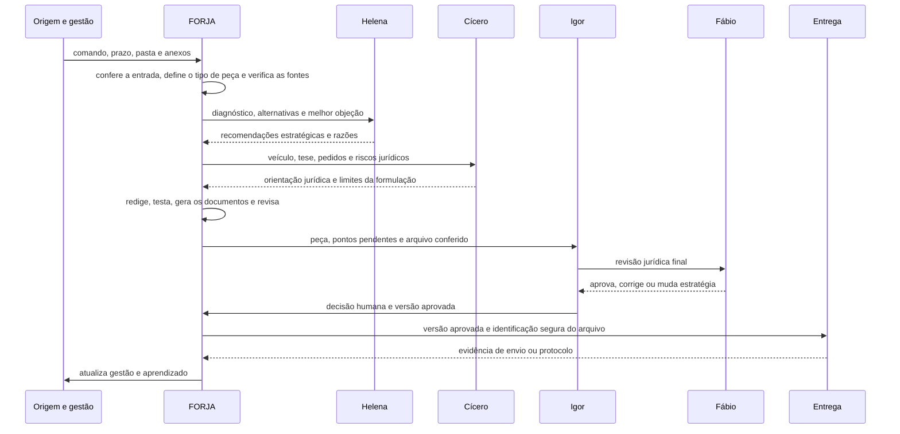

## 3. Como o caso entra e se torna confiável

### 3.1 Da demanda recebida ao conjunto de documentos conferido

```mermaid
flowchart LR
    Signal["Sinal recebido"] --> Reconcile{"Já existe demanda<br/>ou pasta compatível?"}
    Reconcile -->|"sim"| Merge["Reunir com o que já existe, sem sobrescrever"]
    Reconcile -->|"não"| Create["Criar demanda e pasta"]
    Merge --> Inventory["Inventário de anexos"]
    Create --> Inventory
    Inventory --> Scan["Verificar integridade<br/>e procurar instruções ocultas"]
    Scan --> Command["Comando arquivado"]
    Command --> Tribunal["Identificar tribunal e órgão"]
    Tribunal --> Rules["Regimento integral + emendas<br/>+ leis gerais"]
    Rules --> Chronology["Sequência dos atos<br/>e relação entre recursos e decisões"]
    Chronology --> Identity{"Ato atual impugnado<br/>está inequívoco?"}
    Identity -->|"não"| Block["Impedimento grave<br/>não produzir versão pronta para protocolo"]
    Identity -->|"sim"| Ledger["Registro inicial das fontes"]

    classDef active fill:#e8f1ef,stroke:#395c60,color:#21383b;
    classDef evidence fill:#e9f4ec,stroke:#2f6f54,color:#1f4c39;
    classDef blocker fill:#fdecea,stroke:#a33b2b,color:#64251b,stroke-width:2px;
    class Signal,Reconcile,Merge,Create,Inventory,Scan,Command,Tribunal active;
    class Rules,Chronology,Identity,Ledger evidence;
    class Block blocker;
```

### 3.2 Origem da informação interna versus referência processual

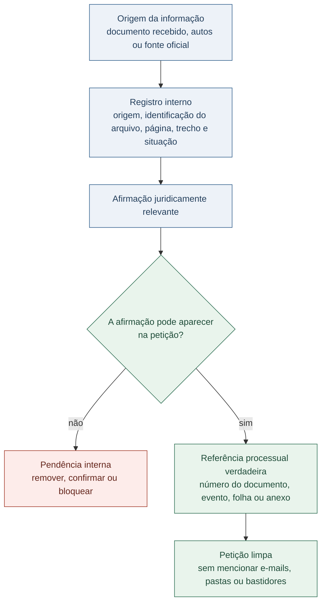

## 4. Como a FORJA organiza as informações

### 4.1 O que fica em primeiro plano e o que é consultado depois

**A FORJA mantém em primeiro plano apenas o que é necessário para decidir cada questão. Os documentos completos permanecem disponíveis para conferência.**

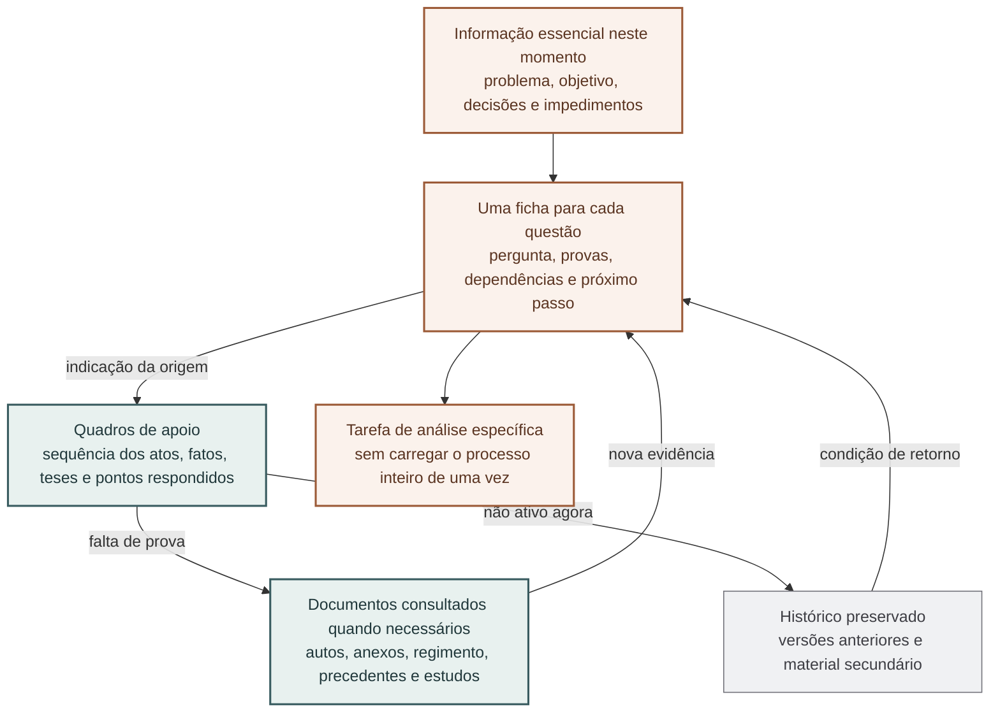

### 4.2 Ciclo de uma questão

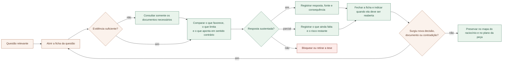

## 5. Como a FORJA constrói a estratégia jurídica

### 5.1 Das perguntas do caso aos fundamentos e pedidos

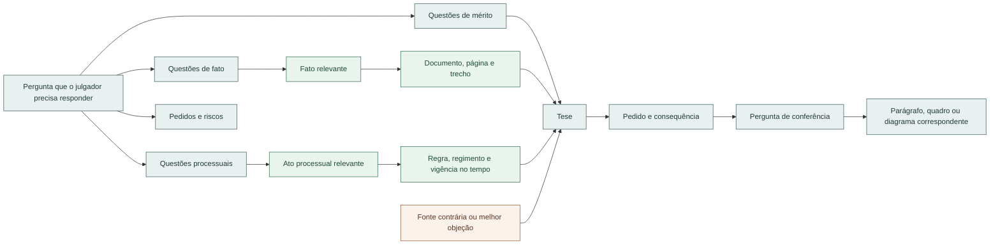

### 5.2 Como uma tese ganha força ou é descartada

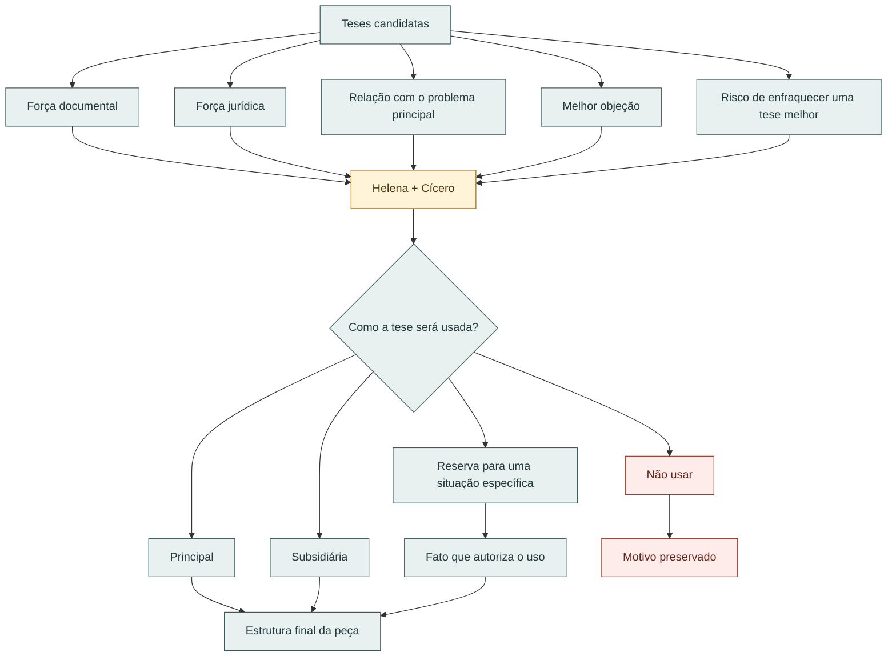

## 6. Como a FORJA aprofunda o diagnóstico do caso

### 6.1 A petição como resposta planejada para um problema concreto

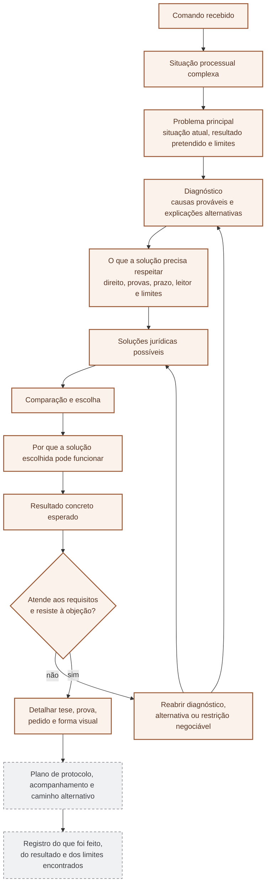

### 6.2 Requisitos e alternativas

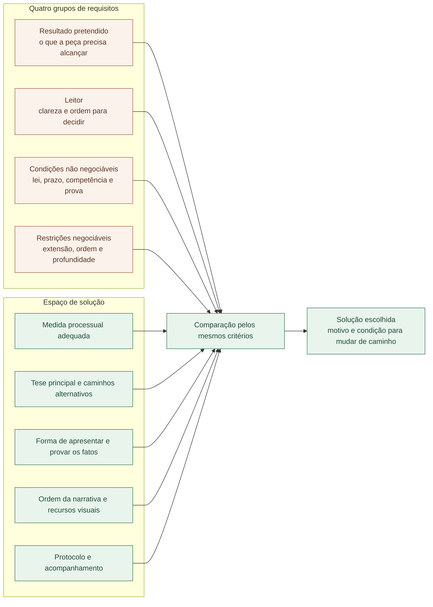

### 6.3 A profundidade da análise varia conforme o caso

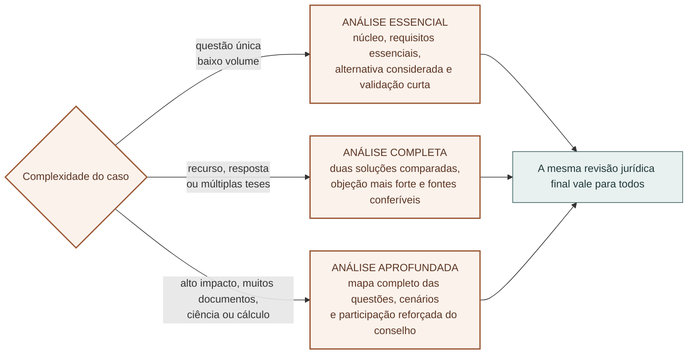

## 7. Como a FORJA examina a peça da parte contrária

### 7.1 Busca de erros, contradições e pontos decisivos

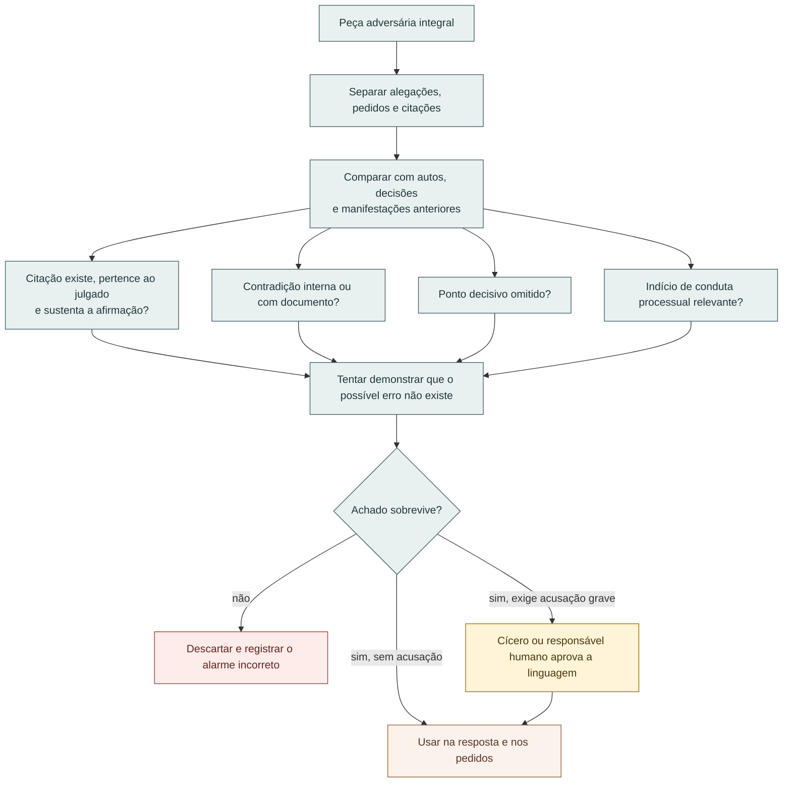

## 8. Como as pesquisas fortalecem a petição

### 8.1 Jurisprudência oficial

```mermaid
flowchart LR
    Question["Afirmação jurídica que precisa de apoio"] --> Discover["Busca por palavras e por sentido"]
    Discover --> Candidate["Precedente candidato"]
    Candidate --> Official{"Fonte oficial ou<br/>arquivo oficial?"}
    Official -->|"não"| Lead["Somente pista de pesquisa"]
    Official -->|"sim"| Identity["Tribunal, órgão, processo,<br/>data e situação"]
    Identity --> Ratio["Trecho, fundamento central e alcance"]
    Ratio --> Limits["Diferenças do caso, analogia e limites"]
    Limits --> Claim["Ligar o precedente à afirmação exata"]
    Claim --> F7["Conferir novamente autoria, sentido e vigência"]
    F7 --> Use["Usar com precisão e sem exagero"]

    classDef research fill:#edf2f8,stroke:#315f8c,color:#243f5c;
    classDef evidence fill:#e9f4ec,stroke:#2f6f54,color:#1f4c39;
    classDef blocker fill:#fdecea,stroke:#a33b2b,color:#64251b;
    class Question,Discover,Candidate,Official,Identity,Ratio,Limits,Claim,F7 research;
    class Use evidence;
    class Lead blocker;
```

### 8.2 Apoio científico de outras áreas do conhecimento

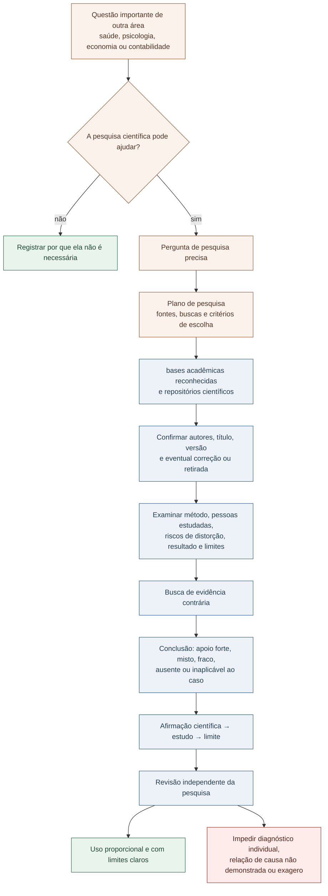

## 9. Da redação ao documento final

### 9.1 Como o conteúdo chega ao Word e ao PDF sem perder sentido

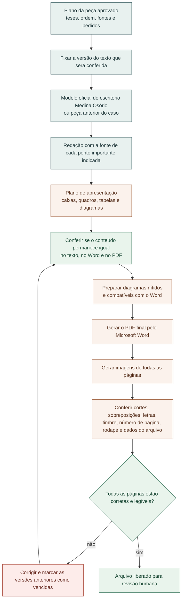

## 10. Como a FORJA evita erros e conclusões apressadas

### 10.1 As revisões feitas antes da liberação

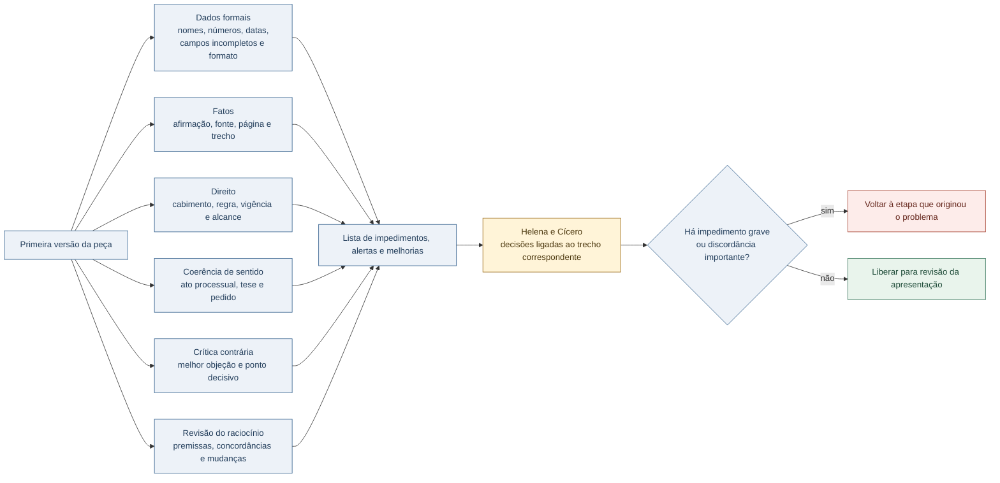

### 10.2 O sistema não pode aprovar o próprio trabalho

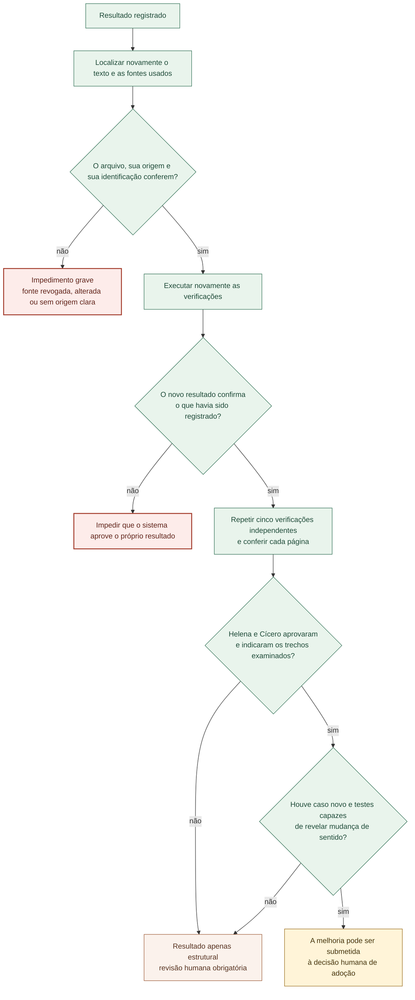

## 11. Como medir se a FORJA realmente melhorou a peça

### 11.1 Oito aspectos avaliados separadamente

```mermaid
flowchart LR
    Plan["Plano do caso elaborado antes da redação"] --> PDI["Definição do problema<br/>o problema está claro e delimitado?"]
    Plan --> DCI["Coerência do diagnóstico<br/>as causas explicam o problema?"]
    Plan --> AQI["Qualidade das alternativas<br/>foram comparadas soluções realmente diferentes?"]
    Plan --> RTI["Respeito aos requisitos<br/>a solução cumpre direito, prova, prazo e objetivo?"]
    Plan --> MSI["Clareza do caminho escolhido<br/>está explicado por que a solução pode funcionar?"]
    Plan --> VSI["Força da conferência<br/>a solução resiste à melhor objeção?"]
    Plan --> CDI["Controle das informações<br/>cada questão usa somente o material necessário?"]
    Plan --> LVI["Qualidade do aprendizado<br/>a correção humana gerou uma lição útil?"]
    PDI --> Gate{"Os aspectos essenciais atingem<br/>o mínimo necessário?"}
    DCI --> Gate
    RTI --> Gate
    VSI --> Gate
    AQI --> Review["Quadro completo para revisão humana"]
    MSI --> Review
    CDI --> Review
    LVI --> Review
    Gate -->|"não"| Bottleneck["Mostrar o ponto fraco<br/>sem escondê-lo em uma média geral"]
    Gate -->|"sim"| Review
    Review --> LegalGate["A revisão jurídica final continua independente"]

    classDef shadow fill:#fbf2ec,stroke:#9c5b38,color:#5b3522;
    classDef evidence fill:#e9f4ec,stroke:#2f6f54,color:#1f4c39;
    classDef blocker fill:#fdecea,stroke:#a33b2b,color:#64251b;
    class Plan,PDI,DCI,AQI,RTI,MSI,VSI,CDI,LVI,Gate,Review shadow;
    class LegalGate evidence;
    class Bottleneck blocker;
```

### 11.2 O que os primeiros casos revelaram

```mermaid
xychart-beta
    title "Problemas encontrados nos quatro primeiros casos examinados"
    x-axis ["Teste simples", "Raciocínio circular", "Caso já concluído", "Conselho pendente", "Fonte bloqueada"]
    y-axis "Casos" 0 --> 4
    bar [4, 3, 3, 3, 1]
```

Leitura: esses números mostram problemas encontrados durante a revisão; não são notas sobre a qualidade jurídica das peças. Os oito aspectos do novo método ainda não foram medidos porque os casos analisados já estavam prontos quando o método foi criado.

## 12. Entrega e gestão integrada

### 12.1 Escolha dos arquivos, entrega e atualização da gestão

```mermaid
sequenceDiagram
    participant F8 as Revisão da apresentação
    participant F9 as Preparação do material
    participant H as Revisão humana
    participant C as Canal de entrega
    participant F10 as Comprovação da entrega
    participant G as Gestão do escritório

    F8->>F9: Word e PDF aprovados e identificados
    F9->>F9: selecionar e conferir os arquivos exatos
    F9->>H: peça, relatório, fontes e pendências
    H-->>F9: versão aprovada ou correção
    F9->>C: arquivo exato autorizado
    C-->>F10: comprovante ou identificação segura do arquivo
    F10->>F10: conferir pacote, arquivo e evidência
    alt entrega confirmada
        F10->>G: concluída + prova da entrega + arquivos
    else sem evidência
        F10->>G: aguardando evidência e ainda não cumprida
    end
    G-->>F10: feedback humano e estado operacional
    F10->>F10: comparar com a versão humana e registrar aprendizado
```

## 13. O que já funciona e o que ainda está sendo acrescentado

### 13.1 A base atual, as melhorias em teste e os próximos passos

```mermaid
flowchart TB
    subgraph Current["FUNCIONAMENTO ATUAL · permanece intacto"]
        Queue["Gestão e fila"]
        Phases["Onze etapas e situação de cada trabalho"]
        Sources["Regimento, fontes e registros de conferência"]
        Draft["Modelo do escritório, Word, PDF e recursos visuais"]
        Delivery["Material para revisão, prova da entrega e gestão"]
    end
    subgraph Pilot["MELHORIAS EM TESTE · já disponíveis em casos escolhidos"]
        N4["Análise aprofundada<br/>perguntas, fontes, ciência, testes e coerência"]
        PsoValidator["Diagnóstico antes da redação<br/>problema, causas, alternativas e forma de conferir"]
        Context["Uma ficha para cada questão importante"]
    end
    subgraph Planned["PRÓXIMOS PASSOS · dependem de casos novos"]
        Prospective["Plano do caso registrado antes da redação"]
        Semantic["Testes mais fortes contra perda de sentido"]
        Value["Tempo, retrabalho, omissões<br/>e revisão humana comparados"]
        Promotion["Adoção apenas das verificações que provarem valor"]
    end
    Queue --> Phases --> Sources --> Draft --> Delivery
    Sources --> N4
    N4 --> PsoValidator
    PsoValidator --> Context
    Context -.-> Prospective
    Prospective --> Semantic --> Value --> Promotion
    Promotion -. "somente após evidência" .-> Phases

    classDef active fill:#e8f1ef,stroke:#395c60,color:#21383b,stroke-width:2px;
    classDef shadow fill:#fbf2ec,stroke:#9c5b38,color:#5b3522,stroke-width:2px;
    classDef planned fill:#f0f1f3,stroke:#707078,color:#3e3e44,stroke-dasharray:5 4;
    class Queue,Phases,Sources,Draft,Delivery active;
    class N4,PsoValidator,Context shadow;
    class Prospective,Semantic,Value,Promotion planned;
```

### 13.2 Como uma melhoria passa do teste para o uso regular

```mermaid
flowchart LR
    Shadow["Agora<br/>observar sem interferir"] --> Light["Caso novo<br/>análise essencial"]
    Light --> Full["Caso novo<br/>análise completa"]
    Full --> Intensive["Caso novo<br/>análise aprofundada"]
    Intensive --> Compare["Comparar erros, retrabalho<br/>e tempo com os casos anteriores"]
    Compare --> Council["Helena + Cícero + revisão humana"]
    Council --> Decision{"Ganho real sem<br/>sobrecarga ou falso bloqueio?"}
    Decision -->|"não"| Revise["Rever a melhoria ou mantê-la apenas em observação"]
    Decision -->|"sim"| Promote["Adotar somente<br/>as verificações comprovadamente úteis"]
    Revise --> Shadow
    Promote --> Monitor["Acompanhar novos erros<br/>e permitir retorno à versão anterior"]

    classDef shadow fill:#fbf2ec,stroke:#9c5b38,color:#5b3522;
    classDef planned fill:#f0f1f3,stroke:#707078,color:#3e3e44,stroke-dasharray:5 4;
    classDef human fill:#fff4d8,stroke:#9a6b18,color:#4b370d;
    class Shadow,Light,Full,Intensive,Compare,Revise planned;
    class Council,Decision human;
    class Promote,Monitor shadow;
```

## 14. Quem faz o quê

### 14.1 Responsabilidades ao longo do trabalho

Esta visão separa com clareza quem prepara, quem verifica e quem toma a decisão final.

```mermaid
flowchart LR
    subgraph Origin["Origem e gestão"]
        Demand["Demanda, prazo e responsável"]
        Command["Comando e anexos"]
        Queue["Fila operacional"]
    end
    subgraph Deterministic["Controles automáticos e conferíveis"]
        Reconcile["Conferir a demanda e a situação real"]
        Ingest["Organizar os documentos e apontar o que falta"]
        Sources["Confirmar tribunal, regimento, leis e fontes"]
        Gates["Revisar fatos, direito, coerência e apresentação"]
        Package["Preparar a revisão humana e comprovar a entrega"]
    end
    subgraph Intelligence["Inteligência jurídica"]
        Classify["Definir o tipo de peça, a urgência e o risco"]
        Diagnose["Delimitar o problema e comparar caminhos possíveis"]
        Research["Pesquisar fundamentos jurídicos e científicos"]
        Draft["Redigir teses, respostas e pedidos"]
    end
    subgraph Council["Conselho independente"]
        Helena["Helena · estratégia, explicações alternativas e consequências"]
        Cicero["Cícero · direito, medida processual e limites"]
    end
    subgraph Human["Decisão humana"]
        Igor["Igor · direção e exceções"]
        Fabio["Fábio · revisão jurídica final"]
    end

    Demand --> Reconcile
    Command --> Ingest
    Queue --> Reconcile
    Reconcile --> Ingest --> Classify --> Sources --> Diagnose
    Diagnose --> Helena
    Diagnose --> Cicero
    Helena --> Research
    Cicero --> Research
    Research --> Draft --> Gates
    Gates -->|"impedimento grave"| Diagnose
    Gates -->|"aprovado"| Igor --> Fabio --> Package
    Package --> Queue

    classDef active fill:#e8f1ef,stroke:#395c60,color:#21383b;
    classDef research fill:#edf2f8,stroke:#315f8c,color:#243f5c;
    classDef human fill:#fff4d8,stroke:#9a6b18,color:#4b370d;
    class Demand,Command,Queue,Reconcile,Ingest,Sources,Gates,Package active;
    class Classify,Diagnose,Research,Draft research;
    class Helena,Cicero,Igor,Fabio human;
```

### 14.2 Como demandas de diferentes canais entram no mesmo fluxo

```mermaid
sequenceDiagram
    participant O as "Origem da demanda"
    participant G as "Gestão do escritório"
    participant F0 as "Etapa 1 · Conferir a demanda"
    participant C as "Pasta do caso"
    participant F1 as "Organização dos documentos"
    participant S as "Registro do andamento"

    O->>G: e-mail, WhatsApp/Hermes ou inclusão manual
    G->>F0: demanda, prazo, responsável e situação
    F0->>C: localizar comando e anexos
    C-->>F0: encontrados, ausentes ou conflitantes
    F0->>S: registrar vínculo e estado real
    F0->>F1: entrada reconciliada
    F1->>C: listar os documentos, identificá-los e verificar o que falta
    F1->>F1: procurar instruções ocultas e arquivos inválidos
    alt anexo crítico ou origem conflitante
        F1->>S: registrar impedimento e pendência específica
        S-->>G: próxima ação concreta
    else conjunto de documentos íntegro
        F1->>S: registrar conjunto de documentos aprovado
        S-->>G: próxima etapa e horário da atualização
    end
```

### 14.3 Tribunal, regimento, prazo e fontes mínimas

```mermaid
flowchart TD
    Case["Número CNJ, endereçamento e decisões"] --> Court["Identificar tribunal e órgão"]
    Court --> Rules{"Regimento integral e atualizado existe?"}
    Rules -->|"não"| Obtain["Obter consolidação oficial e emendas"]
    Obtain --> Rules
    Rules -->|"sim"| General["Consultar Estatuto OAB e LOMAN"]
    General --> Deadline["Contagem de prazo por duas verificações"]
    Deadline --> Holiday["Calendário, dias úteis, feriados e marco inicial"]
    Holiday --> Corpus["Ler a decisão questionada, as peças anteriores e os autos relevantes"]
    Corpus --> Critical{"Fonte crítica ou ato impugnado ausente?"}
    Critical -->|"sim"| Block["Impedimento grave<br/>não redigir versão pronta para protocolo"]
    Critical -->|"não"| Question["Resumir em uma frase o que o julgador precisa decidir"]
    Question --> Blueprint["Liberar o planejamento com a sequência dos atos conferida"]

    classDef evidence fill:#e9f4ec,stroke:#2f6f54,color:#1f4c39;
    classDef blocker fill:#fdecea,stroke:#a33b2b,color:#64251b;
    class Case,Court,Rules,Obtain,General,Deadline,Holiday,Corpus,Critical,Question,Blueprint evidence;
    class Block blocker;
```

## 15. Como versões e arquivos são preservados

### 15.1 Uma tentativa com erro não apaga a última versão válida

```mermaid
sequenceDiagram
    participant R as "Responsável pelo fluxo"
    participant K as "Regras da etapa"
    participant A as "Tentativa isolada"
    participant V as "Revisor independente"
    participant M as "Registro dos arquivos aprovados"
    participant E as "Histórico do caso"

    R->>K: ler documentos necessários, resultado esperado e verificações
    K-->>R: regras da etapa confirmadas
    R->>A: abrir uma nova tentativa identificada
    A->>A: trabalhar sem alterar a última versão válida
    A->>V: resultado, fontes e identificação dos arquivos
    alt resultado inválido ou verificação reprovada
        V-->>R: problemas encontrados e etapa responsável
        R->>E: registrar falha sem substituir versão válida
    else saída válida
        V->>M: registrar os arquivos aprovados
        M->>E: registrar a mudança no histórico
        E-->>R: autorizar a próxima etapa
    end
```

### 15.2 O que fica guardado na pasta de cada caso

```mermaid
flowchart TB
    Case["Pasta do caso"] --> State["Andamento<br/>etapa, impedimentos e provas da entrega"]
    Case --> Runs["Tentativas anteriores preservadas"]
    Case --> Context["Documentos, fatos, afirmações e questões"]
    Case --> Opinions["Pareceres de Helena e Cícero"]
    Case --> Research["Fontes jurídicas e pesquisas científicas"]
    Case --> Production["Texto, Word, PDF e imagens das páginas"]
    Case --> Audit["Revisões, testes e melhor crítica contrária"]
    Case --> Package["Relação dos arquivos preparados para revisão"]
    Case --> Delivery["Comprovante, comparação e aprendizado"]
    Production --> Visual["Plano de apresentação e diagramas nítidos"]
    Visual --> Pages["Todas as páginas conferidas"]
    Package --> Selected["arquivo selecionado = arquivo auditado"]
    Selected --> Delivery

    classDef active fill:#e8f1ef,stroke:#395c60,color:#21383b;
    classDef evidence fill:#e9f4ec,stroke:#2f6f54,color:#1f4c39;
    class Case,State,Runs,Context,Opinions,Research,Production,Visual,Pages active;
    class Audit,Package,Selected,Delivery evidence;
```

### 15.3 Cada afirmação importante deve levar à sua fonte

```mermaid
flowchart LR
    Source["Documento ou fonte oficial"] --> Locator["Número, página, trecho, data e identificação do arquivo"]
    Locator --> Fact["Fato, evento ou afirmação"]
    Fact --> Confidence["O que está confirmado, condicionado ou incerto"]
    Contrary["Fonte ou explicação contrária"] --> Confidence
    Confidence --> Thesis["Tese principal, subsidiária ou reserva"]
    Thesis --> Paragraph["Parágrafo com função definida"]
    Paragraph --> Request["Pedido ou consequência processual"]
    Request --> Test["Pergunta objetiva para conferir o pedido"]
    Test --> Audit{"Sobrevive à melhor objeção?"}
    Audit -->|"não"| Rework["Reabrir fato, fonte ou desenho da tese"]
    Audit -->|"sim"| Eligible["Elegível para revisão humana"]

    classDef evidence fill:#e9f4ec,stroke:#2f6f54,color:#1f4c39;
    classDef challenge fill:#fbf2ec,stroke:#9c5b38,color:#5b3522;
    class Source,Locator,Fact,Confidence,Thesis,Paragraph,Request,Test evidence;
    class Contrary,Audit,Rework challenge;
    style Eligible fill:#fff4d8,stroke:#9a6b18,color:#4b370d;
```

## 16. Gestão do escritório, prazos e canais

### 16.1 Como a FORJA atualiza o painel sem apagar o histórico

```mermaid
sequenceDiagram
    participant F as "FORJA"
    participant E as "Histórico do caso"
    participant S as "Atualização da gestão"
    participant Side as "Registro auxiliar da FORJA"
    participant Base as "Demandas e ajustes humanos"
    participant P as "Painel do escritório"

    F->>E: registrar etapa, impedimento, material ou entrega
    E->>S: informar caso, demanda, ordem e arquivos
    S->>S: confirmar a ligação e a ordem dos registros
    alt informação repetida ou produzida em teste
        S-->>E: ignorar sem alterar a situação real
    else informação nova e válida
        S->>Side: atualizar o registro auxiliar com segurança
        Side->>Base: reunir as informações sem apagar o histórico
        Base->>P: mostrar etapa, impedimentos, revisão visual e próxima ação
        P-->>S: confirmar versão e horário da atualização
    end
```

### 16.2 Gestão de prazos sem confundir lembrete com prova

```mermaid
stateDiagram-v2
    state "Data apenas mencionada" as prazo_mencionado
    state "Data a conferir" as a_conferir
    state "Prazo confirmado" as prazo_confirmado
    state "Prazo ainda indefinido" as sem_prazo_definido
    state "Alerta: faltam 48 horas" as alerta_48h
    state "Trabalho em andamento" as em_execucao
    state "Peça pronta para revisão" as pronta_para_revisao
    state "Aguardando envio ou protocolo" as aguardando_envio
    state "Entrega comprovada" as cumprida
    state "Prazo vencido sem prova de entrega" as vencida
    state "Providência após o vencimento" as contingencia
    [*] --> prazo_mencionado
    prazo_mencionado --> a_conferir: "data extraída de mensagem ou documento"
    a_conferir --> prazo_confirmado: "marco, regra, calendário e responsável conferidos"
    a_conferir --> sem_prazo_definido: "não há base suficiente"
    prazo_confirmado --> alerta_48h: "janela crítica"
    prazo_confirmado --> em_execucao: "trabalho iniciado"
    alerta_48h --> em_execucao
    em_execucao --> pronta_para_revisao: "peça e revisão visual concluídos"
    pronta_para_revisao --> aguardando_envio: "revisão ainda não é entrega"
    aguardando_envio --> cumprida: "protocolo ou envio comprovado"
    aguardando_envio --> vencida: "prazo passou sem evidência"
    sem_prazo_definido --> a_conferir: "nova informação"
    vencida --> contingencia: "ação humana e registro do ocorrido"
    cumprida --> [*]
    contingencia --> [*]
```

### 16.3 Entrada por e-mail, WhatsApp/Hermes e validação humana

```mermaid
flowchart TD
    Email["E-mail<br/>orientação, anexos e conversa relacionada"] --> Normalize["Registrar a demanda sem alterar a mensagem original"]
    Whats["WhatsApp ou Hermes<br/>informação essencial ou áudio transcrito"] --> Normalize
    Manual["Inclusão manual · decisão e contexto"] --> Normalize
    Normalize --> Identity{"Cliente, caso, tipo de peça e prazo estão claros?"}
    Identity -->|"não"| Clarify["Validação por e-mail, WhatsApp ou decisão humana registrada"]
    Clarify --> Identity
    Identity -->|"sim"| Link["Ligar a demanda à pasta correta do caso"]
    Link --> Intake["Conferir a entrada e organizar os documentos"]
    Intake --> Draft["Executar as etapas da FORJA"]
    Draft --> Review["Igor e Fábio revisam a versão correta"]
    Review --> Channel{"Canal autorizado?"}
    Channel -->|"não"| Local["Manter o material no escritório<br/>sem registrar entrega inexistente"]
    Channel -->|"sim"| Deliver["Criar rascunho ou enviar manualmente"]
    Deliver --> Proof["Guardar o rascunho, a conversa,<br/>o protocolo ou o comprovante"]
    Proof --> Management["Atualizar a gestão como concluída"]

    classDef active fill:#e8f1ef,stroke:#395c60,color:#21383b;
    classDef human fill:#fff4d8,stroke:#9a6b18,color:#4b370d;
    classDef blocker fill:#fdecea,stroke:#a33b2b,color:#64251b;
    class Email,Whats,Manual,Normalize,Link,Intake,Draft,Proof,Management active;
    class Clarify,Review,Channel human;
    class Local blocker;
```

## 17. Verificações jurídicas mais profundas

### 17.1 Coerência dos termos, das datas e dos cálculos

```mermaid
flowchart TD
    Sources["Decisões, documentos e dispositivos"] --> Canon["Nome correto de cada ato processual"]
    Canon --> Scan["Conferir texto, quadros, diagramas e pedidos"]
    Scan --> Conflict{"O mesmo evento recebeu qualificações incompatíveis?"}
    Conflict -->|"sim"| Explained{"Contraste deliberado e explicado?"}
    Explained -->|"não"| P0["Impedimento grave<br/>o texto pode ter mudado o sentido do ato"]
    Explained -->|"sim"| Time["Regras aplicáveis em cada momento"]
    Conflict -->|"não"| Time
    Time --> Act["Ato juridicamente relevante"]
    Act --> Date["Data comprovada"]
    Date --> Regime["Regra de transição e regime aplicável"]
    Regime --> Quant{"Há questão mensurável?"}
    Quant -->|"não"| Global["Conferir a coerência do documento inteiro"]
    Quant -->|"sim"| Formula["Definir fórmula, unidades e valores conhecidos"]
    Formula --> Range["Apresentar uma faixa objetiva<br/>ou explicar por que o cálculo ainda não é possível"]
    Range --> Global
    P0 --> Reopen["Voltar à confirmação das fontes<br/>e ao planejamento da estratégia"]

    classDef audit fill:#edf2f8,stroke:#315f8c,color:#243f5c;
    classDef blocker fill:#fdecea,stroke:#a33b2b,color:#64251b;
    class Sources,Canon,Scan,Conflict,Explained,Time,Act,Date,Regime,Quant,Formula,Range,Global audit;
    class P0,Reopen blocker;
```

### 17.2 Ciclo de confiança de uma fonte acadêmica

```mermaid
stateDiagram-v2
    state "Estudo encontrado" as descoberta
    state "Identidade ainda não confirmada" as identidade_pendente
    state "Identidade confirmada" as identidade_confirmada
    state "Estudo rejeitado" as rejeitada
    state "Incluído na pesquisa" as incluida
    state "Excluído por critério declarado" as excluida
    state "Conteúdo ainda não lido" as conteudo_pendente
    state "Somente o resumo foi lido" as apenas_resumo
    state "Conteúdo necessário conferido" as conteudo_verificado
    state "Método e limites avaliados" as avaliacao_metodologica
    state "Situação editorial conferida" as status_editorial
    state "Pode ser usado com limites" as utilizavel_com_limites
    state "Correção exige nova avaliação" as corrigida_reavaliar
    state "Estudo retirado ou inválido" as retratada_bloqueada
    state "Ligado à afirmação da peça" as mapeada_a_afirmacao
    state "Uso apenas secundário" as uso_limitado
    [*] --> descoberta
    descoberta --> identidade_pendente
    identidade_pendente --> identidade_confirmada: "autores, título e versão conferem"
    identidade_pendente --> rejeitada: "dados não correspondem ao estudo"
    identidade_confirmada --> incluida: "critérios atendidos"
    identidade_confirmada --> excluida: "motivo explícito"
    incluida --> conteudo_pendente
    conteudo_pendente --> apenas_resumo
    conteudo_pendente --> conteudo_verificado
    conteudo_verificado --> avaliacao_metodologica
    avaliacao_metodologica --> status_editorial
    status_editorial --> utilizavel_com_limites
    status_editorial --> corrigida_reavaliar
    status_editorial --> retratada_bloqueada
    corrigida_reavaliar --> avaliacao_metodologica
    utilizavel_com_limites --> mapeada_a_afirmacao
    apenas_resumo --> uso_limitado: "não sustenta sozinho uma afirmação decisiva"
    uso_limitado --> mapeada_a_afirmacao
    rejeitada --> [*]
    excluida --> [*]
    retratada_bloqueada --> [*]
    mapeada_a_afirmacao --> [*]
```

### 17.3 A FORJA também questiona o próprio raciocínio

```mermaid
flowchart TD
    Questions["Questões, requisitos e pontos que devem ser respondidos"] --> Tests["Perguntas objetivas e testes de sentido"]
    Tests --> Freeze["Fixar os critérios antes da versão final"]
    Freeze --> Candidate["Primeira versão completa"]
    Candidate --> Mechanical["Nomes, números, fontes, prazos e pedidos"]
    Candidate --> Semantic["Ato processual, tese, negação, ressalva e sentido do conjunto"]
    Candidate --> Adversarial["Melhor objeção e explicação rival"]
    Candidate --> Meta["Premissas, concordâncias automáticas,<br/>mudanças de posição e distorção dos indicadores"]
    Mechanical --> Result["Resultado de cada verificação<br/>sem esconder um problema grave em uma média"]
    Semantic --> Result
    Adversarial --> Result
    Meta --> Result
    Result --> Pass{"Todas as verificações obrigatórias foram aprovadas?"}
    Pass -->|"não"| Cause{"O problema está na fonte, na estratégia,<br/>na redação ou na apresentação?"}
    Cause --> Reopen["Voltar somente à etapa que causou o problema"]
    Reopen --> Tests
    Pass -->|"sim"| F8["Liberar para revisão visual"]

    classDef audit fill:#edf2f8,stroke:#315f8c,color:#243f5c;
    classDef blocker fill:#fdecea,stroke:#a33b2b,color:#64251b;
    class Questions,Tests,Freeze,Candidate,Mechanical,Semantic,Adversarial,Meta,Result,Pass,Cause audit;
    class Reopen blocker;
    style F8 fill:#e9f4ec,stroke:#2f6f54,color:#1f4c39;
```

### 17.4 O que a revisão humana ensina ao sistema

```mermaid
flowchart LR
    AI["Versão produzida pela FORJA"] --> Diff["Comparação com a versão humana aprovada"]
    Human["Versão revisada"] --> Diff
    Diff --> Cause{"Qual foi a causa real?"}
    Cause --> Fact["Fato ou prova"]
    Cause --> Law["Direito ou fonte"]
    Cause --> Plan["Diagnóstico ou estratégia"]
    Cause --> Meaning["Terminologia ou perda de sentido"]
    Cause --> Visual["Composição ou legibilidade"]
    Cause --> Style["Preferência de voz"]
    Fact --> Structural{"O mesmo tipo de erro pode ocorrer em outros casos?"}
    Law --> Structural
    Plan --> Structural
    Meaning --> Structural
    Visual --> Structural
    Structural -->|"sim"| Fixture["Criar um teste baseado na correção"]
    Fixture --> Review["Revisão humana do novo teste"]
    Review --> Battery["Aplicar o teste em trabalhos futuros"]
    Structural -->|"não"| Memory["Registrar como aprendizado específico do caso"]
    Style --> Preference["Registrar a preferência sem transformá-la em regra geral"]
```

## 18. Como escolher e conferir recursos visuais

### 18.1 Escolha do recurso visual conforme a necessidade do leitor

Os trabalhos reais mostram quatro formas especialmente úteis: cartões para números importantes, linha do tempo para a sequência dos fatos, árvore para decisões e convergência para fundamentos independentes. Um recurso visual só permanece na peça quando facilita a leitura e mantém todo o texto legível.

```mermaid
flowchart TD
    Need{"Que dificuldade do leitor precisa ser reduzida?"}
    Need -->|"memorizar números"| Cards["Cartões-síntese · até quatro dados decisivos"]
    Need -->|"entender ordem temporal"| Timeline["Linha do tempo · fatos, marcos e consequência"]
    Need -->|"comparar alternativas"| Table["Tabela · critérios constantes e células curtas"]
    Need -->|"seguir decisão"| Tree["Árvore · condição, bifurcação e resultado"]
    Need -->|"ver fundamentos independentes"| Converge["Convergência · múltiplas rotas ao mesmo pedido"]
    Need -->|"ver magnitude"| Chart["Gráfico · escala, unidade e fonte explícitas"]
    Cards --> Test["Teste de necessidade, precisão e legibilidade"]
    Timeline --> Test
    Table --> Test
    Tree --> Test
    Converge --> Test
    Chart --> Test
    Test --> Useful{"Reduz esforço sem alterar o sentido?"}
    Useful -->|"não"| Remove["Remover ou simplificar"]
    Useful -->|"sim"| VisualMap["Registrar no plano de apresentação da peça"]

    classDef visual fill:#fbf2ec,stroke:#9c5b38,color:#5b3522;
    classDef evidence fill:#e9f4ec,stroke:#2f6f54,color:#1f4c39;
    class Need,Cards,Timeline,Table,Tree,Converge,Chart,Test,Useful visual;
    class VisualMap evidence;
    style Remove fill:#fdecea,stroke:#a33b2b,color:#64251b;
```

### 18.2 Como impedir cortes, sobreposições e letras pequenas

```mermaid
flowchart TD
    Text["Texto jurídico aprovado para composição"] --> Map["Plano de apresentação<br/>tipo, função, posição e conteúdo"]
    Map --> Generate["Gerar tabela, diagrama nítido ou gráfico"]
    Generate --> Geometry["Conferir caixas, margens e tamanho mínimo das letras"]
    Geometry -->|"falha"| Redesign["Redesenhar; nunca apenas diminuir as letras"]
    Redesign --> Generate
    Geometry -->|"passa"| Vector["Preparar uma imagem nítida e compatível com o Word"]
    Vector --> Word["Inserir no modelo oficial do escritório"]
    Word --> PDF["PDF final pelo Microsoft Word"]
    PDF --> Pages["Gerar imagens de todas as páginas"]
    Pages --> Inspect["Examinar cada página em tamanho normal e ampliado"]
    Inspect --> Checks["Texto, cortes, sobreposição, contraste,<br/>timbre, número de página e rodapé"]
    Checks --> Pass{"Página e diagrama preservam leitura e sentido?"}
    Pass -->|"não"| Origin{"Falha de conteúdo ou composição?"}
    Origin -->|"conteúdo"| Map
    Origin -->|"composição"| Generate
    Pass -->|"sim"| Hash["Identificar a nova versão e liberá-la para revisão"]

    classDef visual fill:#fbf2ec,stroke:#9c5b38,color:#5b3522;
    classDef evidence fill:#e9f4ec,stroke:#2f6f54,color:#1f4c39;
    classDef blocker fill:#fdecea,stroke:#a33b2b,color:#64251b;
    class Text,Map,Generate,Geometry,Vector,Word,PDF,Pages,Inspect,Checks,Pass visual;
    class Hash evidence;
    class Redesign,Origin blocker;
```

## 19. Leitura final e roteiro de uso

### 19.1 Todo o funcionamento em uma única sequência

```mermaid
flowchart LR
    Intake["Demanda recebida"] --> Trust["Documentos conferidos"]
    Trust --> Problem["Problema bem definido"]
    Problem --> Alternatives["Alternativas comparadas"]
    Alternatives --> Thesis["Teses, fundamentos e pedidos ligados às fontes"]
    Thesis --> Challenge["Argumentos contrários, ciência e melhor objeção"]
    Challenge --> Draft["Peça limpa e persuasiva"]
    Draft --> Audit["Revisão jurídica, factual, de sentido e de apresentação"]
    Audit --> Human["Decisão humana"]
    Human --> Delivery["Entrega comprovada"]
    Delivery --> Management["Gestão atualizada"]
    Management --> Learn["Aprendizado organizado por causa"]
    Learn -. "melhora comprovada" .-> Problem

    classDef active fill:#e8f1ef,stroke:#395c60,color:#21383b;
    classDef human fill:#fff4d8,stroke:#9a6b18,color:#4b370d;
    classDef evidence fill:#e9f4ec,stroke:#2f6f54,color:#1f4c39;
    class Intake,Trust,Problem,Alternatives,Thesis,Challenge,Draft,Audit,Management,Learn active;
    class Human human;
    class Delivery evidence;
```

A FORJA controla a entrada da demanda, as fontes, a redação, as revisões, a apresentação, o material entregue e a prova da entrega. As melhorias em teste acrescentam uma ligação mais clara entre perguntas, fatos, fundamentos, teses e pedidos. Também exigem que o problema seja bem definido antes da redação e que outras soluções possíveis sejam comparadas.

Para uma leitura rápida, use as seções 1, 2, 12 e 19. Para compreender a inteligência jurídica, use 4 a 8 e 17. Para operação e integração com o escritório, use 14 a 16. Para auditoria e comunicação visual jurídica, use 9, 10 e 18.

O princípio final permanece: **informação bem organizada, fontes fáceis de conferir, alternativas reais e disposição para rever a primeira conclusão.**
